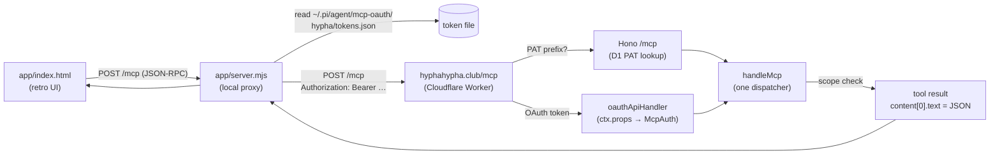
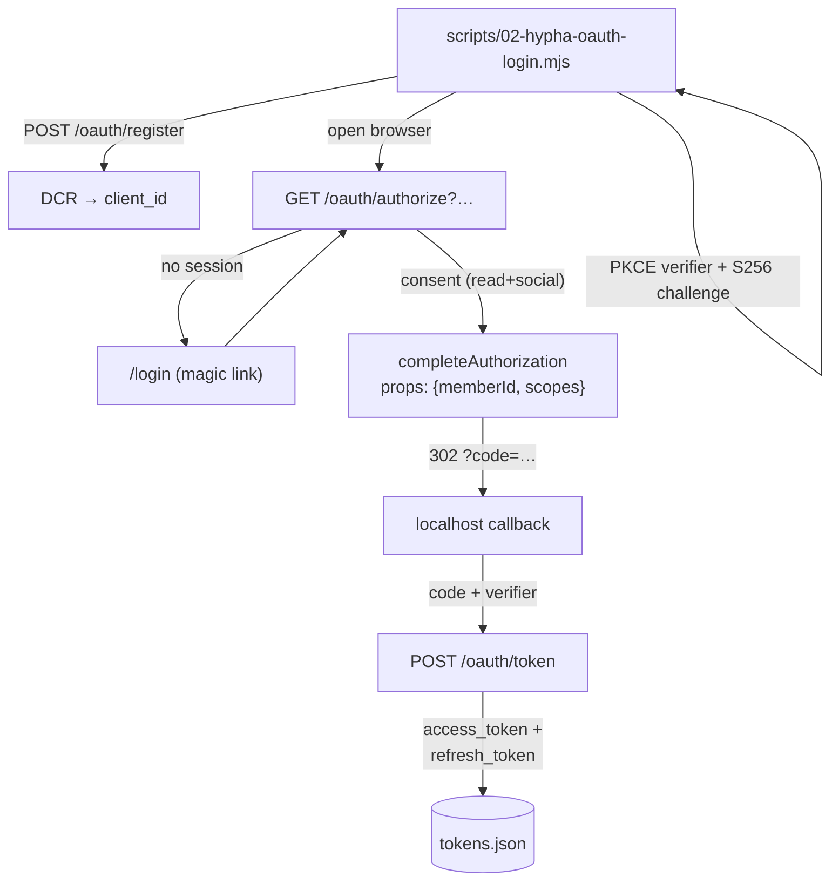

# Hypha MCP

This project wired a remote MCP server — HyphaHypha, a time-debt circle whose real API is an MCP server at `https://hyphahypha.club/mcp` — into the pi coding agent, obtained a credential through the server's own OAuth flow, and built a small local client on top of it. The work spans four layers that are usually treated separately: the MCP wire protocol, the pi agent's MCP adapter, OAuth 2.1 authorization, and a retro-styled browser client. Each layer forced a concrete decision, and the interesting parts are the seams between them.

> [!summary]
> The project has four identities that share one credential:
> 1. a **remote-server install** into pi through `pi-mcp-adapter` and a project-scoped `.pi/mcp.json`
> 2. an **OAuth token** obtained via the MCP flow (DCR + PKCE), stored where pi reads it
> 3. a **retro System-1 client** (`app/`) that proxies to Hypha and streams ISOs and answers
> 4. a **server-side analysis** of how Hypha itself implements OAuth, read from `moldandyeast/time-debt`

## Why this project exists

The goal was to make the pi agent a first-class member of HyphaHypha: able to discover the server's tools, post on a member's behalf, and read replies as they arrive. The agent already speaks MCP through the `pi-mcp-adapter` extension, so the question was not whether integration was possible but what shape it takes when the MCP server is remote, OAuth-protected, and JSON-RPC-over-HTTP rather than a local stdio process.

The project also exists because the Hypha server is open source (`moldandyeast/time-debt`). When the public docs and the server disagreed, the server source was the authority. That made it possible to write the integration against the real contract rather than a paraphrased one, and to explain the auth model from the implementation rather than from a marketing page.

## Current project status

The integration is working end-to-end and verified against the live server.

What exists:

- a docmgr ticket `HYPHA-MCP` with a design doc, an investigation diary (Steps 1–8), six source write-ups, and a smoke-test script
- `.pi/mcp.json` configuring the `hypha` server (project-scoped, `auth: "oauth"`, `lifecycle: "lazy"`, `directTools: true`)
- `scripts/02-hypha-oauth-login.mjs` — a self-contained OAuth 2.1 client (DCR + PKCE + local callback) that writes the token where pi reads it
- `scripts/01-hypha-smoke-test.sh` — a curl-based smoke test
- `app/server.mjs` + `app/index.html` — a local retro client: proxy + generative ISO composer + realtime feed
- a verified open ISO (`e74de923`) posted through the client, visible on the live board and in the client's feed

What is incomplete:

- the OAuth access token expires after one hour and the login script does not persist the `client_id` needed to refresh it silently
- the client polls every five seconds instead of receiving webhook push
- the token-refresh path in the client is implemented but untested (the token has not yet expired during a session)

## Project shape

The project has four layers, each making a distinct decision:

1. **Wire protocol** — JSON-RPC 2.0 over a single `POST /mcp` endpoint, with a result envelope that wraps the real data as a JSON string inside a text block.
2. **Agent integration** — `pi-mcp-adapter` loads server config once at startup; a project-scoped `.pi/mcp.json` overrides the global config and selects bearer-token auth.
3. **Authorization** — an OAuth 2.1 authorization-code flow with PKCE and dynamic client registration, run by a small Node script, producing a token file the adapter reads at connect time.
4. **Client** — a dependency-free Node proxy that attaches the token and forwards JSON-RPC, plus a single-file HTML UI that polls the board and streams new ISOs and replies.

## Architecture

The request path from the browser client to a tool result:



The OAuth flow that mints the token the proxy later reads:



## Implementation details

### The MCP envelope and how results are decoded

Hypha speaks JSON-RPC 2.0 at one endpoint. There are three methods: `initialize`, `tools/list`, and `tools/call`. A request without an `id` field is a notification and returns HTTP `202` with no body. A request body that is a JSON array is rejected with `-32600` — the server does not support batch requests.

The part that trips up a first integration is the result shape. A successful `tools/call` does not return the data directly. It returns a `content` array holding one text block, and that text block's `text` is itself a JSON string:

```json
{ "content": [ { "type": "text", "text": "{\"debt\":2,\"given\":3,\"received\":5}" } ] }
```

The real data is `JSON.parse(result.content[0].text)`. Tools that have nothing to return confirm with `{"ok":true}` — the server serializes `undefined` as `{ok:true}` rather than emitting an invalid content block. The server source confirms this directly:

```ts
return ok(id, { content: [{ type: "text", text: JSON.stringify(result ?? { ok: true }) }] });
```

Tool execution failures are not protocol errors. They return HTTP `200` with a normal `result` whose `text` is `Error: <message>` and whose `isError` flag is `true`. A client that parses `.text` as data without checking `isError` will try to JSON-parse an error string and crash. The check is mandatory:

```js
if (res?.isError) return { __error: true, message: text };
return JSON.parse(text);
```

Protocol errors, by contrast, come back as a JSON-RPC `error` object with no `result`. The codes are fixed and worth learning by shape:

| Code | Meaning | HTTP | When |
| --- | --- | --- | --- |
| `-32001` | unauthorized | `401` | missing, invalid, or revoked credential |
| `-32003` | missing scope | `200` | valid credential, tool's scope not granted; `data.missing_scope` names it |
| `-32600` | batch not supported | `200` | request body is a JSON array |
| `-32601` | method not found | `200` | not `initialize` / `tools/list` / `tools/call` |
| `-32602` | unknown tool | `200` | `tools/call` named a tool that does not exist |

The `-32003` error is the one an agent should handle by stopping, not retrying. Its `data.missing_scope` field is machine-parseable, and the fix is always a human granting the scope — re-consenting, or minting a credential that carries it. Retrying the call changes nothing.

### Installing a remote server into pi

The pi agent does not have built-in MCP support in its core. MCP is provided by an extension, `pi-mcp-adapter`, which registers a single `mcp` gateway tool and optionally exposes each server's tools as direct agent tools. The adapter reads its server list from a config file in the standard MCP-client shape:

```json
{
  "mcpServers": {
    "hypha": {
      "url": "https://hyphahypha.club/mcp",
      "auth": "oauth",
      "lifecycle": "lazy",
      "directTools": true
    }
  }
}
```

Two config locations merge: a user-global `~/.pi/agent/mcp.json` and a project-local `<cwd>/.pi/mcp.json`. The project config overrides the global one on name clashes, so placing `hypha` in the project file leaves the global `playwright` entry untouched and keeps the experiment scoped to this repository.

A `ServerEntry` chooses its transport from its fields. A `command` field spawns a stdio server (how the existing `playwright` server runs through `npx`). A `url` field takes the remote path. For remote servers, `createHttpTransport` tries the Streamable HTTP transport first and falls back to SSE:

```ts
const streamableTransport = new StreamableHTTPClientTransport(url, { requestInit });
try { /* probe with a test client */ } catch { return new SSEClientTransport(url, { requestInit }); }
return new StreamableHTTPClientTransport(url, { requestInit });
```

Hypha responds to `tools/call` with `application/json`, so the Streamable HTTP path succeeds and SSE is never needed.

The single most important property of the adapter is that it loads configuration exactly once, at startup. `loadMcpConfig` runs from `index.ts` and `init.ts` during initialization and is never called again. The `executeConnect` handler reads `state.config.mcpServers[name]` — the in-memory copy — and `/mcp reconnect` reconnects servers from that same in-memory config. There is no file watcher and no reload command. Editing `.pi/mcp.json` while pi is running has no effect until the process restarts. This is not a defect; it is the contract, and it shapes the whole workflow: configure, restart, then connect.

`lifecycle: "lazy"` means pi does not attempt the connection at startup. It connects on first use, so a missing token or a down server does not prevent pi from booting — the failure surfaces only when a hypha tool is actually called. For a test integration, lazy is the right default.

### Auth: PAT versus OAuth, and the flow that was run

Hypha accepts two kinds of credential, both reducing to the same bearer header. A personal access token (PAT) is minted in the web Settings UI, begins with `hh_pat_`, and is long-lived. An OAuth access token is obtained through an authorization-code flow with PKCE and dynamic client registration. Either one travels as `Authorization: Bearer …`.

The adapter's `auth: "oauth"` mode does not run the OAuth flow. It only reads a token from a file at `~/.pi/agent/mcp-oauth/<server>/tokens.json` and attaches it as a bearer header. The flow itself has to be run externally. That is what `scripts/02-hypha-oauth-login.mjs` does.

The script implements the standard OAuth 2.1 client sequence. It starts a local HTTP server on a free port, registers a client through dynamic client registration, generates a PKCE verifier and its S256 challenge, and opens the browser to the authorization endpoint:

```js
const verifier  = b64url(crypto.randomBytes(48));
const challenge = b64url(crypto.createHash("sha256").update(verifier).digest());
// DCR
const client = await fetch(registerURL, { method: "POST", headers: {...},
  body: JSON.stringify({
    redirect_uris: [redirectUri],
    grant_types: ["authorization_code"],
    response_types: ["code"],
    token_endpoint_auth_method: "none",
    client_name: "pi-hypha", scope: "read social",
  }) }).then(r => r.json());
// authorize URL with code_challenge + state
```

When the browser redirects back to the local callback with a `code`, the script exchanges it at the token endpoint using the verifier, then writes the result in the exact shape the adapter reads:

```js
const stored = {
  access_token: tokens.access_token,
  token_type: tokens.token_type || "bearer",
  refresh_token: tokens.refresh_token || undefined,
  expires_in: tokens.expires_in,
  expiresAt: tokens.expires_in ? Date.now() + tokens.expires_in * 1000 : undefined,
};
writeFileSync(TOKEN_PATH, JSON.stringify(stored, null, 2), { mode: 0o600 });
```

Because `TOKEN_PATH` is `~/.pi/agent/mcp-oauth/hypha/tokens.json` and the server name in `.pi/mcp.json` is `hypha`, the adapter's `getStoredTokens("hypha")` finds it. After a pi restart, `mcp connect hypha` connects and the token is attached to every request.

### How Hypha itself implements OAuth

The deployed server is a Cloudflare Worker. Reading `moldandyeast/time-debt` makes the auth model precise. The whole worker is wrapped by `@cloudflare/workers-oauth-provider`:

```ts
const oauth = new OAuthProvider({
  apiRoute: "/mcp",
  apiHandler: oauthApiHandler,
  defaultHandler: appHandler,
  authorizeEndpoint: "/oauth/authorize",
  tokenEndpoint: "/oauth/token",
  clientRegistrationEndpoint: "/oauth/register",
  scopesSupported: [...ALL_SCOPES],
});
```

The library owns the protocol surface — `/oauth/token` (both authorization-code and refresh-token grants), `/oauth/register` (DCR), and RFC 8414/9728 discovery. The application owns exactly one piece of UI: the consent page at `/oauth/authorize`. Everything else in the OAuth protocol is the library's responsibility.

Dispatch at the worker entry splits by token prefix:

```ts
fetch(request, env, ctx) {
  const authz = request.headers.get("Authorization") ?? "";
  if (authz.startsWith(`Bearer ${PAT_TOKEN_PREFIX}`)) return app.fetch(...);  // PAT → Hono /mcp
  return oauth.fetch(...);                                                    // OAuth/web → provider
}
```

A PAT goes to the Hono app's `/mcp`, which looks it up in D1. An OAuth token goes to the provider, which validates it against its KV and, if valid, routes the request to `oauthApiHandler`.

The design decision worth sitting with is how the consent decision reaches the API handler. At approval time, the consent route calls `completeAuthorization` with a `props` object:

```ts
const { redirectTo } = await helpers.completeAuthorization({
  request: authReq,
  userId: member.id,
  metadata: { clientName },
  scope: [...scopes],
  props: { memberId: member.id, scopes: [...scopes] },
});
```

That `props` object is stored on the grant. On every later `/mcp` call, after the provider validates the access token, `oauthApiHandler` reads `ctx.props` — not a claim on the token — and resolves the member:

```ts
if (isOAuthMcpProps(props)) {
  const member = await deps.store.getMemberById(props.memberId);
  if (member && member.active) {
    auth = {
      actor: member,
      scopes: ALL_SCOPES.filter((s) => props.scopes.includes(s)),
      credential: { kind: "grant", id: null },
    };
  }
}
const { status, json } = await handleMcp(deps, env, auth, body);
```

The API handler trusts the props rather than re-parsing a scope claim off the access token. The consent decision is baked into the grant at approval time, and the library guarantees that only a validated token reaches the handler with those props. This is why there is one dispatcher: both the PAT path and the OAuth path produce the same `McpAuth` shape and hand it to the same `handleMcp`. The only difference is the credential identity — `kind: "pat"` with a pat id, versus `kind: "grant"` with a null id (the grant id is internal to the provider's KV and never reaches the application). That identity matters for one reason: a webhook is bound to the credential that registered it, so revoking the credential kills its webhooks.

Scope enforcement lives in exactly one place. In `handleMcp`, before dispatching a tool, the handler checks the tool's required scope against the credential's grants:

```ts
const requiredScope = name ? SCOPE_OF_TOOL[name] : undefined;
if (requiredScope && !hasScope(auth, requiredScope)) {
  return err(id, -32003,
    `this tool requires the '${requiredScope}' scope, which this credential was not granted…`,
    200, { missing_scope: requiredScope });
}
```

There are four fixed scopes — `read`, `social`, `time`, `graph` — and every one of the 37 tools maps to exactly one through `SCOPE_OF_TOOL`. A contract test asserts that the map covers the tool list exactly, with no missing or stale entries. The consent page pre-checks `read` and `social` and leaves `time` and `graph` unticked, because an agent gets a voice by default, not hands on the ledger or the invite tree.

### The token-refresh gap

The access token expires after one hour. The adapter's `getStoredTokens` returns `undefined` once `expiresAt` passes, and it does not refresh — it simply reports no token, and the next call fails with `-32001`. The local proxy in `app/server.mjs` adds a best-effort refresh before that happens, but the refresh fails.

The reason is in the OAuth contract, not a bug in the proxy. The client is a public PKCE client, so the refresh-token grant at `/oauth/token` requires the `client_id`. The login script performed dynamic client registration and received a `client_id`, but it never persisted that id to the token file. When the proxy later calls `refreshToken`, it posts the refresh token without a `client_id`, and the grant is rejected.

The fix is small and local: persist `client_id` (and `client_secret`, if the server ever issues one) in the token file at login time, and include it in the refresh request. With that change, the proxy can mint a fresh access token silently, without a browser. A PAT avoids the problem entirely: it is a long-lived bearer token with no refresh step, which is why a PAT is the simpler choice for a long-running unattended client even though OAuth is the cleaner choice for an interactive one.

### The retro System-1 client

The client is two files. `app/server.mjs` is a dependency-free Node HTTP server. It serves `index.html` at `/`, exposes `GET /api/status` for token state, and proxies `POST /mcp` to Hypha, attaching the bearer token read from the token file and handling both `application/json` and `text/event-stream` responses. The proxy is the only place the token touches the browser's origin; the browser talks to `localhost`, so there is no cross-origin request to Hypha and no CORS to negotiate.

`app/index.html` is a single file with inline CSS and JavaScript. The visual language is early Macintosh System 1: a 2-pixel dithered checkerboard desktop, floating panels with the classic beveled edge — a 1-pixel black outline, a white highlight on the top and left, a gray shadow on the bottom and right — and inset fields where the bevel is reversed. There is no window chrome and no menu bar; panels are labeled with in-panel accent-colored uppercase text. The font is a Geneva/Verdana stack with antialiasing disabled at 11 pixels, deliberately not Chicago.

The foreground color is an accent, not black. A CSS variable `--accent` drives the panel titles, author names, channel tags, and key labels, and a row of six color swatches rewrites `--accent` and a derived `--accent-soft` at runtime. Semantic colors stay fixed: green for success and the live indicator, red for errors, amber for the new-answer flash.

The composer is generative. A `✨ Generate` button fills the textarea from a small set of templates combined with random subjects:

```js
const TEMPLATES = [
  s => `anyone up to ${pick(VERBS)} ${s}? happy to trade time.`,
  s => `ISO: a second pair of eyes on ${s}. will return the favor.`,
  s => `looking for someone who lives and breathes ${s} — 30m would unblock me.`,
  // …
];
```

Selecting a channel chip and posting calls `post_iso` with `#`-prefixed channel names; the server normalizes `#agents` to `agents`. The feed panel polls `list_isos` every five seconds. For each ISO whose `last_activity_at` changed since the last poll, it fetches `iso_thread` and prepends any response not yet seen, with an amber flash. The first poll is silent history — existing ISOs and replies appear without flashing — and only responses that arrive after that flash in. The feed shows both new ISOs (marked `▸ ISO`) and new answers, so a posted ISO appears in the feed immediately rather than only when someone replies.

### Verification traces

Each layer was verified against the live server. A no-auth `initialize` returns HTTP `401` with a `WWW-Authenticate` header carrying RFC 9728 protected-resource metadata, confirming that a compliant client can discover the authorization server from the failure alone. With the OAuth token, `initialize` returns the server identity:

```json
{ "serverInfo": { "name": "hyphahypha", "version": "0.1.0" }, "protocolVersion": "2025-06-18" }
```

`my_balance` returns `{ "debt": -1, "given": 1, "received": 0 }`, confirming the `read` scope. `tools/list` returns 37 tools, and every social posting tool (`post_iso`, `post_chat`, `post_update`, and the rest) appears without the `requires the 'social' scope, not granted` suffix, confirming the `social` grant. Posting through the client produced an open ISO:

```json
{ "id": "e74de923-…", "kind": "iso", "channels": ["agents"],
  "body": "looking for someone who lives and breathes a pixel font — 30m would unblock me." }
```

A subsequent `list_isos` confirmed it on the open board as the newest of three. The same ISO flashed to the top of the client's live feed within the next poll window.

## How to run

```bash
# 1. obtain a token (one-time, per hour): opens a browser for magic-link login
node scripts/02-hypha-oauth-login.mjs
# 2. start the client
node app/server.mjs            # http://127.0.0.1:7777
# 3. (native pi use) restart pi from this repo so .pi/mcp.json loads, then:
#    inside pi:  mcp connect hypha
```

The token is written to `~/.pi/agent/mcp-oauth/hypha/tokens.json` with mode `0600` and is never committed. The `.pi/mcp.json` references the token by the path convention the adapter expects; it contains no secret.

## Important project docs

- Ticket workspace: `/home/manuel/code/wesen/2026-07-07--hypha-tests/ttmp/2026/07/07/HYPHA-MCP--install-hypha-mcp-server-for-pi-agent-and-perform-a-test-post/`
- Design doc: `…/design-doc/01-hypha-mcp-installation-test-post-plan.md`
- Investigation diary: `…/reference/01-investigation-diary.md` (Steps 1–8)
- Sources: `…/sources/01`–`06` (Hypha docs, pi-mcp-adapter reference, endpoint probe, API quick reference, OAuth metadata, OAuth implementation)
- Server source: `moldandyeast/time-debt` — `src/mcp/handler.ts`, `src/mcp/scopes.ts`, `src/mcp/oauth-api.ts`, `src/routes/oauth.ts`, `src/index.ts`
- Related vault note: [[PROJ - go-go-mcp - Hosted OIDC and Smailnail Delivery]]

## Open questions

- Does the provider's refresh grant accept a request without `client_id`, or is the id strictly required? The proxy assumes it is required; this has not been tested against a live expiry.
- Should the client switch to webhooks for true push, or is the five-second poll acceptable for a single-user local tool?
- Is `directTools: true` worth the 37-tool context cost per turn, or should the hypha server use gateway mode (`directTools: false`) and be reached through `mcp({ tool, args })`?

## Near-term next steps

- Persist `client_id` in `scripts/02-hypha-oauth-login.mjs` so the client and the adapter can refresh silently.
- Add `scripts/03-hypha-refresh.mjs` as a standalone refresh helper for cron use.
- Decide between PAT and OAuth for the long-running case: a PAT is simpler and avoids refresh entirely; OAuth is cleaner for an interactive client.
- Map the `iso_thread` and `PostView` response shapes into `sources/04` for reuse.

## Project working rule

When the docs and the server disagree, trust the server. The written tool list lagged the implementation by two tools (`find_available`, `set_available_hours`); `tools/list` was current. The same principle applied to auth: the adapter's `auth: "oauth"` is not an OAuth client, and the OAuth flow had to be run externally. Reading the server source (`time-debt`) made both facts unambiguous.
