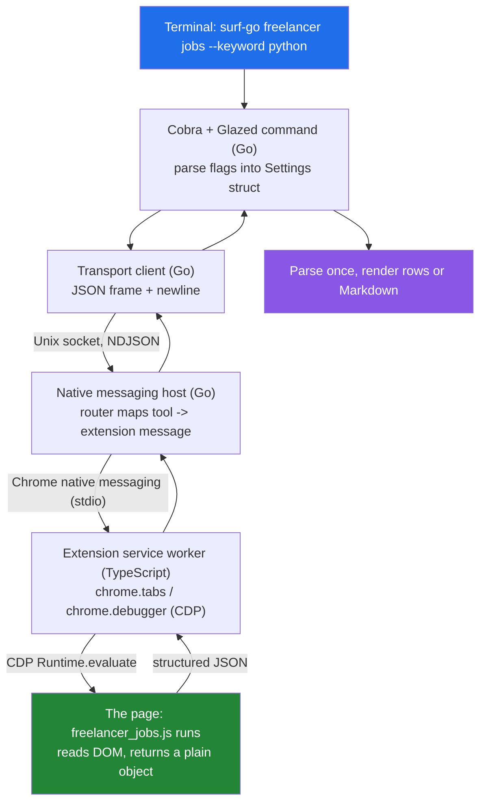
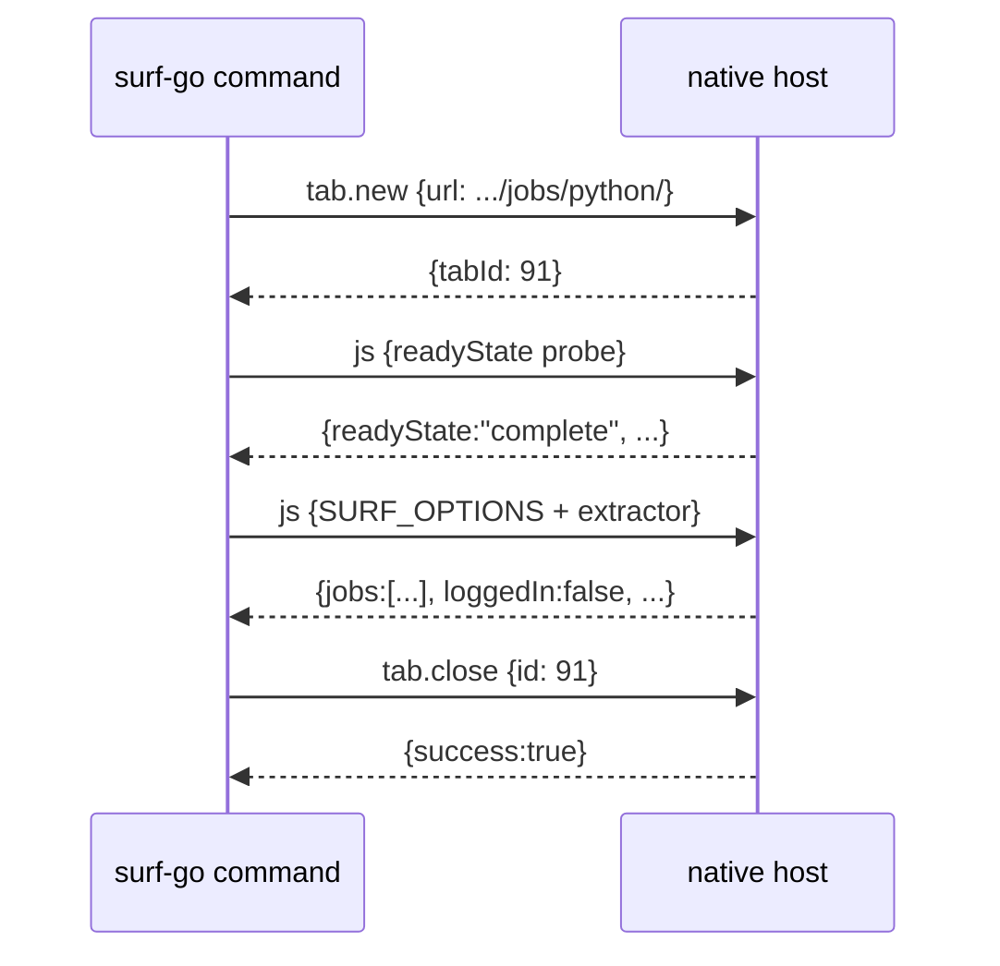

# surf-go Freelancer Verbs — Browser-Side Command Deep Dive

This note explains how three new `surf-go` verbs for freelancer.com were designed and built, and it uses them to teach the general pattern for writing a browser-side command in `surf-go`. The goal is not to catalogue an API. The goal is to make the execution path legible: to show how a command typed in a terminal ends up running JavaScript inside a live Chrome tab, how the extracted data flows back, and why the responsibilities are divided the way they are. A reader who finishes this note should be able to add a fourth verb without rediscovering the failure modes the first three uncovered.

> [!summary]
> This project added three verbs to `surf-go`, all in a new `freelancer` command group:
> 1. `freelancer jobs` — scan the job listing board and extract job cards.
> 2. `freelancer job <url>` — open one project page and extract its full detail.
> 3. `freelancer contest <url>` — open one contest page and extract prize, entries, badges, and time left.
> The durable value is the shared skeleton these verbs share, and the site-specific findings that shaped them: path-based search URLs, an authoritative-but-underivable project category segment, meta-tag budget extraction, and the absence of any clean contest listing page.

## Why this project exists

`surf-cli` drives a real Chrome or Chromium browser from the command line. `surf-go` is the Go reimplementation of that CLI and its native-messaging host. A **verb** is a `surf-go` subcommand; a **browser-side verb** is one whose real work happens inside a web page rather than inside the Go process. The command injects JavaScript into a tab, the JavaScript reads the DOM and returns a structured object, and the Go process turns that object into either a Markdown report for a human or structured rows for a pipeline.

freelancer.com is a productive target for learning this pattern. The job board is server-rendered HTML with stable CSS class names, the listings require no authentication to read, and the data model — a list of job cards, or a single project — is small enough to hold in mind while the surrounding machinery is the thing under study.

## The execution path

A browser-side verb crosses five process boundaries. Almost every defect encountered while building these verbs was a boundary defect: the wrong tab was targeted, the injected script never ran, or the response arrived in a shape the parser did not expect. Understanding the path is therefore the prerequisite for everything else.



The return trip is the mirror of the outbound trip. The page returns a JavaScript value, the service worker serializes it, the host forwards it, the transport client reads exactly one newline-delimited line, and the Go process decodes it once. The wire format on the socket is newline-delimited JSON: one JSON object per line, written and then read back synchronously.

The single most important structural rule follows from this path. The page-side JavaScript is responsible for page interaction and extraction, and nothing else. It waits, queries the DOM, deduplicates, and returns a plain object. The Go code is responsible for transport, orchestration, and presentation: it builds URLs, manages the tab lifecycle, sends tool requests, parses the response once, and chooses the output representation. When these responsibilities blur — a Markdown heading assembled inside the browser script, or a `querySelector` written in Go — the verb becomes hard to test and hard to change.

## The tools vocabulary

The transport speaks a small set of host operations called tools. Browser-side verbs use four of them.

| Tool | Purpose | Key args | Returns (JSON text) |
|------|---------|----------|---------------------|
| `tab.new` | Open a new tab at a URL | `{"url": "..."}` | `{"success":true,"tabId":91,...}` |
| `navigate` | Point an existing/active tab at a URL | `{"url": "..."}` | navigation acknowledgement |
| `js` | Evaluate JavaScript in a tab, return its value | `{"code": "..."}` | the JS return value, JSON-encoded |
| `tab.close` | Close a tab by id | `{"id": 91}` | `{"success":true,"tabId":91}` |

Each call is wrapped in a request envelope and written as one line. The envelope is constructed by `BuildToolRequest` in `go/internal/cli/commands/base.go`, which attaches the tool name, its arguments, a unique id, and — when the verb targets a specific tab — a `tabId` or `windowId`. `ExecuteTool` builds the envelope and calls `client.Send`, which performs the synchronous write-then-read against the socket.

## Anatomy of a browser-side verb

All three freelancer verbs share one skeleton. Learning the skeleton once explains all three.

### The script prelude

The embedded JavaScript cannot read Go variables. Runtime options are passed by prepending a JSON literal to the script text before it is sent:

```go
func buildFreelancerJobsCode(s *FreelancerJobsSettings) (string, error) {
    options := map[string]any{"maxResults": s.MaxResults}
    b, _ := json.Marshal(options)
    return fmt.Sprintf("const SURF_OPTIONS = %s;\n%s", string(b), freelancerJobsScript), nil
}
```

The script reads the injected value defensively, so the same file also runs unchanged during a standalone probe where `SURF_OPTIONS` is absent:

```js
const options = typeof SURF_OPTIONS === 'object' && SURF_OPTIONS !== null ? SURF_OPTIONS : {};
```

The script itself is compiled into the binary with `go:embed`, so production page logic ships with `surf-go` and lives beside the command that uses it:

```go
//go:embed scripts/freelancer_jobs.js
var freelancerJobsScript string
```

### The shared fetch function

Both output modes call one fetch function. This function is the center of the verb, and its shape is the reusable template.

```
fetchFreelancerJobs(ctx, settings):
    page := max(settings.Page, 1)
    url  := buildFreelancerJobsURL(settings.Keyword, page)
    code := buildFreelancerJobsCode(settings)          # SURF_OPTIONS + embedded JS
    client := transport.NewClient(settings.Socket, timeout)

    if no explicit tab-id and no explicit window-id:
        tabID = openOwnedTab(url)      # tab.new + wait until ready; the command OWNS this tab
        ownedTabID = tabID
    else:
        navigate(the targeted tab/window, url)
        wait for readiness if a tab-id was given

    defer: if no error and not KeepTabOpen: closeOwnedTab(ownedTabID)

    resp := ExecuteTool("js", {code}, tabID, windowID)
    return parseFreelancerJobsResponse(resp)           # parse exactly ONCE
```

### Parse once, then fan out

After the host returns, the response is decoded a single time by `parseFreelancerJobsResponse`, which uses two shared helpers in `go/internal/cli/commands/format.go`: `extractErrorText` surfaces any host or page error, and `parseResult` pulls the text out of `result.content[].text` and JSON-decodes it. The decoded map then feeds two pure functions — one that produces rows, one that produces Markdown. Neither re-parses the response. Re-parsing in two places is the origin of the classic defect where rows render correctly but Markdown does not, or the reverse.

### Dual mode

A verb that should serve both a human reader and an automation pipeline implements both `cmds.WriterCommand` (Markdown) and `cmds.GlazeCommand` (rows). This repository's Glazed version does not infer dual behavior from the presence of both interfaces; the verb must opt in explicitly at registration time:

```go
func buildDualModeCommand(cmd cmds.Command) (*cobra.Command, error) {
    return cli.BuildCobraCommand(cmd,
        cli.WithDualMode(true),
        cli.WithGlazeToggleFlag("with-glaze-output"),
        cli.WithParserConfig(cli.CobraParserConfig{
            ShortHelpSections: []string{schema.DefaultSlug},
            MiddlewaresFunc:   cli.CobraCommandDefaultMiddlewares,
        }),
    )
}
```

Without `--with-glaze-output`, the writer path runs and prints Markdown. With it, the glaze path runs and the standard Glazed flags such as `--output json` and `--fields` apply.

## Tab ownership and cleanup

Browser state is shared and persistent, so a verb that opens tabs and never closes them degrades the user's session. Ownership is modeled with two pointers. `tabID` is the tab the verb will run JavaScript against, whether the verb created it or the user supplied it. `ownedTabID` is non-nil only when the verb created the tab, and it is the key used for cleanup.

The rules are: if the verb creates a tab because the user gave no target, the verb owns it and closes it by default; if the user passed `--tab-id` or `--window-id`, the verb does not own that tab and must never close it; cleanup that only removes command-created state is the default, and any cleanup that could destroy user data must be an explicit opt-in. Cleanup is a deferred close guarded on success and on the `--keep-tab-open` opt-out.

The default no-target run therefore produces a fixed four-message sequence, and this sequence is exactly what the mock-host integration test asserts.



`openOwnedTab` and `waitForTabReady` live in `go/internal/cli/commands/tab_ready.go`. Readiness is checked by repeatedly running a tiny probe (`return {href, title, readyState}`) until `readyState === "complete"`, the `href` is real rather than `about:blank`, and the URL matches the expected target. These verbs match on a URL **prefix** (`https://www.freelancer.com`) rather than an exact string, because freelancer normalizes trailing slashes and issues redirects; an exact match would intermittently fail.

The tab-new-versus-navigate split matters for a concrete reason. `navigate` depends on an already-resolved active tab. A verb that should be self-contained cannot rely on that, so it calls `tab.new` explicitly and captures the returned `tabId`. All three verbs do this.

## The three verbs

The three verbs are two distinct shapes over the same skeleton: one listing verb that returns many rows, and two detail verbs that return one row from a single page addressed by URL.

| Verb | Input | Page | Output cardinality | Distinctive extraction |
|------|-------|------|--------------------|------------------------|
| `freelancer jobs` | `--keyword`, `--page` | server-rendered board | many rows | `.JobSearchCard-item` cards |
| `freelancer job <url>` | positional URL | Angular project page | one row | full description + meta-tag budget |
| `freelancer contest <url>` | positional URL | Angular contest page | one row | label→value fields + badge scan |

The listing verb builds a path-based URL and extracts every card. The detail verbs take the project or contest URL as a positional argument, defined with `cmds.WithArguments`, so the invocation reads `surf-go freelancer job <url>` rather than requiring a flag. Each detail verb validates its URL with a normalizer that accepts an absolute freelancer.com URL or a site-relative path and rejects other hosts.

## Implementation details and site-specific findings

The general skeleton is only half the work. The other half is the site-specific knowledge that took live inspection to establish. Each finding below was validated against the live site with Playwright before the corresponding code was written.

### Listing URLs are path-based

freelancer.com encodes both keyword search and pagination in the path, not in query strings. `buildFreelancerJobsURL` mirrors this exactly.

```
https://www.freelancer.com/jobs/            (no keyword, page 1)
https://www.freelancer.com/jobs/python/     (keyword)
https://www.freelancer.com/jobs/python/3/   (keyword, page 3)
https://www.freelancer.com/jobs/2/          (no keyword, page 2)
```

The job card selectors are stable across cards: `.JobSearchCard-item` is the container, `a.JobSearchCard-primary-heading-link` holds the title and a **relative** href, `.JobSearchCard-primary-price` holds a polymorphic budget string (`$131 - $394`, `$1972 Average bid`, or `$15 - $25 / hr`), `.JobSearchCard-secondary-entry` carries the bid count, and `.JobSearchCard-primary-tagsLink` repeats once per skill. The extractor resolves the relative href against `location.origin`, classifies the price as hourly or fixed by regular expression, deduplicates by absolute URL, and waits for a settled condition — a present card, or an explicit "no jobs found" — rather than sleeping for a fixed interval.

### The project category segment is authoritative and not derivable

The most consequential finding concerns the detail-page URL. A job listed under `/jobs/python/` does not live at `/projects/python/<slug>`. Its real URL uses a category segment chosen by freelancer, such as `/projects/api/<slug>`. Reconstructing the URL from the search keyword produces a 404. The rule the `job` verb encodes is therefore blunt: never rebuild the URL from the keyword; use the exact `href` the listing returned. The 404 page is itself detectable — its `h1` reads "Looks like the page you are looking for doesn't exist." — so the extractor throws a clear error rather than returning empty data.

### Meta tags are the stable budget source on the project page

The project detail page is an Angular application. Rather than scrape volatile component markup for the budget, the extractor reads `meta[name="description"]`, whose content has a stable form:

```
"Python & Software Architecture Projects for ₹8000-12000 INR. I am ready to move ..."
```

A single regular expression pulls both the categories and the currency-qualified budget from this string:

```js
const metaMatch = metaDesc.match(/^(.*?)\s+Projects?\s+for\s+(.+?)\.\s/i);
// group 1 -> "Python & Software Architecture"   (categories)
// group 2 -> "₹8000-12000 INR"                  (budget, with currency)
```

The full description is read from `p.Project-description`, which carries the complete brief — roughly 1,500 characters against the roughly 200-character snippet shown on the card. A visible-node currency regex serves as a fallback, and the extractor records which source produced the budget in a `budgetSource` field. Recording the provenance of a value that has more than one possible origin is a habit worth keeping: it makes later debugging a matter of reading one field rather than re-deriving the extraction.

### There is no clean contest listing

The plan for a `freelancer contests` listing verb did not survive contact with the site. `https://www.freelancer.com/contests` redirects to `/contest/`, a marketing landing page that exposes only winning-entry showcase links. `https://www.freelancer.com/contest/browse/` redirects to `/jobs/?contest=true`, which still renders ordinary projects — cards with bid counts and `/projects/...` hrefs — not contests. No server-rendered contest board comparable to `/jobs/` exists. The honest deliverable is therefore a **detail** verb, `freelancer contest <url>`, that addresses one contest by URL. Recording this dead end is as valuable as recording a working selector, because it prevents a future contributor from repeating the same investigation.

### Contest fields: label→value and full-DOM badge scanning

The contest page is also an Angular application, and its meta description is generic ("Check out this contest and enter now!"), so meta tags are useless here. The fields are extracted with a label→value helper that finds the leaf node whose text is exactly a label and reads the value from the parent text or the next sibling.

```js
function labelValue(labelText) {
  const leaf = Array.from(document.querySelectorAll('p, span, div, dt'))
    .find((el) => el.children.length === 0 && normalizeText(el.textContent) === labelText);
  if (!leaf) return null;
  const parentText = normalizeText(leaf.parentElement?.textContent || '');
  if (parentText.startsWith(labelText)) {
    const stripped = normalizeText(parentText.slice(labelText.length));
    if (stripped) return stripped;
  }
  return normalizeText(leaf.nextElementSibling?.textContent || '') || null;
}
```

This scoping matters because the page also renders a sidebar of other featured contests whose prize amounts share the same `$X USD` styling. Matching on the exact label — `Prize:`, `Entries Received:` — binds extraction to the main contest and ignores the look-alike sidebar values.

Badge detection required a correction discovered during live validation. Badges such as `Featured` and `Guaranteed` render as custom elements whose visible uppercase form is produced by CSS; the DOM text is mixed case. An initial scan restricted to `span`, `p`, and `div` found nothing. The fix scans every leaf node once and matches case-insensitively against a known badge set:

```js
const badgeSet = new Set(CONTEST_BADGES.map((b) => b.toLowerCase()));
const found = new Set();
for (const el of document.querySelectorAll('*')) {
  if (el.children.length !== 0) continue;
  const t = normalizeText(el.textContent).toLowerCase();
  if (badgeSet.has(t)) found.add(t);
}
const badges = CONTEST_BADGES.filter((b) => found.has(b.toLowerCase()));
```

Time left is read from a body line matching `(remaining|left)$`. The contest brief text could not be isolated cleanly — heuristics pulled in marketing footer copy — so it is omitted rather than returned wrong. Returning a field that is sometimes incorrect is worse than not returning it.

## Testing at three layers

Each verb is validated at three layers, and each layer catches a different class of defect.

- **Unit tests** exercise the pure functions with no browser and no socket: URL construction for every keyword and page combination, the presence of the `SURF_OPTIONS` prelude and an embedded-script marker, row shaping including the flattening of skill and badge lists into comma-joined strings, Markdown rendering, and the URL normalizers including their rejection cases.
- **Mock-host integration tests** open a real Unix socket and answer four accepts in order with a fake host goroutine, asserting the exact tool sequence: `tab.new` with the correct URL, a `js` readiness probe, a `js` extraction call carrying the expected prelude, and a `tab.close` with the correct id. This is the layer that would have caught the active-tab dependency that once affected an earlier verb.
- **Real-browser validation** runs the exact embedded script body against the live site through Playwright and confirms the returned fields. Mock tests never validate selectors; only a live page can. For all three verbs the live run returned clean, complete objects.

## Repository paths

The verbs and their tests live under `go/` in the `surf-cli` repository at `/home/manuel/code/others/llms/pi/nicobailon/surf-cli`.

- `go/internal/cli/commands/freelancer_jobs.go` and `scripts/freelancer_jobs.js`
- `go/internal/cli/commands/freelancer_job.go` and `scripts/freelancer_job.js`
- `go/internal/cli/commands/freelancer_contest.go` and `scripts/freelancer_contest.js`
- `go/internal/cli/commands/base.go` — `BuildToolRequest`, `ExecuteTool`
- `go/internal/cli/commands/tab_ready.go` — `openOwnedTab`, `waitForTabReady`
- `go/internal/cli/commands/format.go` — `parseResult`, `extractErrorText`
- `go/cmd/surf-go/main.go` — registration of the `freelancer` group and its three subcommands
- `go/cmd/surf-go/integration_test.go` — mock-host tests for all three verbs
- `go/pkg/doc/tutorials/01-building-browser-side-verbs.md` — the canonical tutorial these verbs follow

The full investigation, selector tables, and an intern-oriented guide are captured in the ticket `SURF-20260706-FL1` under `ttmp/2026/07/06/` in the same repository.

## Key points

- A browser-side verb crosses five process boundaries; the page-side script only extracts, and the Go side only transports and presents. Keeping this split clean is what makes the verb testable.
- One shared fetch function serves both output modes, and the response is decoded exactly once before it fans out into rows or Markdown.
- A verb owns the tabs it creates and closes them by default; it never closes a tab the user supplied. `tab.new` plus a captured `tabId` is what makes a verb self-contained.
- Verify that a feasible page exists before committing to a verb's shape. The intended contest listing did not exist, so the deliverable became a detail verb.
- Prefer stable extraction sources. On the project page the meta description yields a currency-qualified budget; on the contest page a label→value helper scopes extraction to the main entity.
- Omit a field that cannot be extracted reliably. A sometimes-wrong value is worse than an absent one.

## Open questions

- Does the `/jobs` board honor server-side filter query parameters for budget and project type, or are the on-page filters purely client-side? This determines whether `--type` and `--min-budget` flags can be added to `freelancer jobs`.
- Would a talent-directory verb (`freelancer search-freelancers`) reuse the listing skeleton unchanged, or does that page differ structurally?
- The authenticated tier — saved projects, inbox, bid drafts — requires a logged-in browser session and draft-only guardrails. What is the right ownership and confirmation model for verbs that could mutate remote state?

## Near-term next steps

- Investigate `/jobs` query-parameter filtering and, if server-side, add filter flags to the listing verb.
- Exercise the verbs end-to-end against a live extension socket, not only through Playwright, once an extension session is available.
- Decide whether contest brief text is worth a more targeted selector or should remain omitted.

## Related notes

- [[Tribal/goja-embedding-in-go]] — the Go+JavaScript runtime pattern that underlies the broader go-go-golems tooling this CLI belongs to.

## Project working rule

> [!important]
> Prove every selector against the live page before writing the Go wrapper, and assert the exact tool sequence in a mock-host test.
> A verb that passes unit tests but was never run against the real DOM has not been validated.
