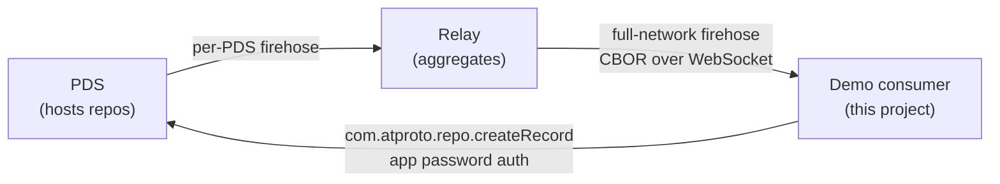
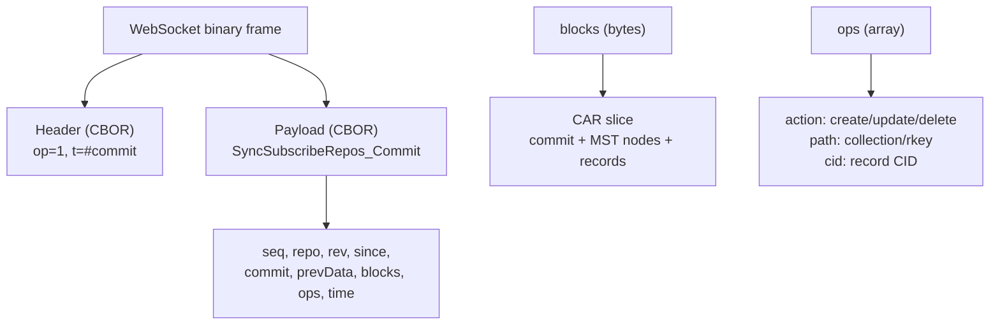
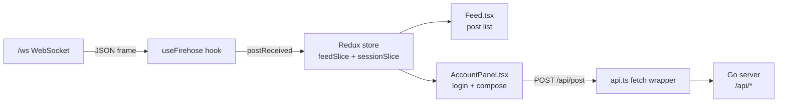

# ATProto Firehose Demo: Subscribing to the Bluesky Event Stream with Go and React

This report explains the ATProto Firehose Demo project as a complete technical system. The repository builds a single Go binary that subscribes to the Bluesky firehose, decodes post records from binary CBOR and CAR payloads, fans the decoded posts out to browsers over a WebSocket, and lets a signed-in user create posts and likes on their own Bluesky account from the same web interface. The frontend is a React application built with Vite and Redux Toolkit, embedded into the Go binary at compile time.

The final implementation lives in `/home/manuel/code/wesen/2026-07-07--atproto-experiments`. The docmgr ticket is `ATPROTO-DEMO`, stored under `ttmp/2026/07/07/ATPROTO-DEMO--atproto-firehose-demo-app/`. The work was implemented across a sequence of commits that first downloaded the protocol specifications, then built the Go backend and React frontend, then verified the full stack against the live Bluesky relay.

> [!summary]
> - The project consumes the ATProto repository event stream (`com.atproto.sync.subscribeRepos`) over a WebSocket. Each event is a binary frame containing two CBOR objects: a header and a payload. Post records are extracted from CAR file slices embedded in `#commit` events.
> - The Go backend uses the official `indigo` SDK for firehose decoding and account actions, the `glazed` framework for CLI structure and logging, and the standard library `net/http.ServeMux` for the HTTP surface. No third-party HTTP framework is used.
> - The React frontend uses Redux Toolkit with two slices: a capped feed ring buffer and a session slice. A WebSocket hook delivers live posts into the store; an HTTP client posts and likes through the authenticated backend.
> - The system is verified end-to-end against the live relay `relay1.us-east.bsky.network`. The binary serves the embedded SPA, the firehose connects within seconds, and real posts decode with correct text, language tags, CIDs, and URIs. A Playwright browser test confirmed zero console errors.

## Current status

The project is a working, verified prototype. It is not a production application. It does not verify commit signatures against independently resolved identity, it does not persist decoded posts to a database, and it uses app-password authentication rather than OAuth. These are deliberate scope decisions for a learning tool, documented as decision records in the ticket design doc.

The implemented user-visible application has two panels:

| Panel | Purpose |
| --- | --- |
| Live firehose | Streams decoded `app.bsky.feed.post` records in real time, showing the author DID, relative time, action, and post text. A header counter shows the count, the last sequence number, and an estimated events-per-second rate. |
| Account | An app-password login form and, once authenticated, a compose box that creates posts on the signed-in account. |

The final implementation commits are:

```text
805b4e5 Verify: Playwright browser test of live firehose UI (0 console errors)
f110aa1 Docs: finalize diary Step 7 (bookkeeping + reMarkable upload complete)
2523c75 Docs: docmgr bookkeeping (relate files, changelog, tasks) + doctor passes
4de89ce Docs: comprehensive design & implementation guide + investigation diary
8d5fe26 Skeleton: Go+glazed firehose consumer, HTTP server, React/Vite/Redux SPA
05d8a59 Sources: download ATProto specs/guides and indigo reference source
ea028d8 Initial commit
```

The final verification commands were:

```bash
go build ./...
go build -o /tmp/atproto-demo ./cmd/atproto-demo
cd frontend && pnpm build
/tmp/atproto-demo serve --addr :18090 --relay https://relay1.us-east.bsky.network
```

The observed final results were:

```text
Go build:   clean, 27 MB binary (includes libp2p via indigo)
Vite build: successful, 173 KB JS (57 KB gzip)
Firehose:   connected to wss://relay1.us-east.bsky.network within 1s
API:        /api/status returned lastSeq advancing; /api/posts returned real decoded posts
Browser:    0 console errors; live feed populated at ~39 events/sec
```

The browser smoke test confirmed four important runtime properties:

1. The embedded single-page application renders the header, the live feed, the account panel, and the footer from a single Go binary on a single port.
2. The `/ws` WebSocket delivers live posts to the browser. The feed counter showed `500 shown · seq 31633487813 · ~39/s`, proving the WebSocket path, the Redux store, and the React render loop all function together.
3. Real decoded posts render with correct text, short DIDs, relative times, and `create`/`delete` action labels, including multilingual content.
4. The account panel renders the app-password login form and the compose box without console errors.

## Why this project exists

The project exists to learn the AT Protocol by building a real consumer of its core primitive: the firehose. Reading specifications alone is insufficient for understanding a binary, content-addressed, self-authenticating data system. The firehose forces the implementer to confront CBOR encoding, CAR file parsing, Merkle Search Tree structure, and the relationship between signed commits and record operations. Building a working decoder is the test of whether those concepts are understood.

The second goal is to close the loop from consumption to production. A demo that only reads the firehose is half a system. The user should be able to sign in and write records back to their own account, then observe those records arrive through the firehose. That round trip makes the protocol's data flow concrete: a write to the user's Personal Data Server becomes a signed commit, which the relay aggregates, which the demo's firehose consumer decodes, which appears in the browser seconds later.

The project deliberately uses the raw relay firehose rather than Jetstream, the JSON-based alternative. Jetstream strips cryptographic signatures and Merkle tree nodes, which makes it simpler to consume but hides the most instructive parts of the protocol. The raw firehose preserves the full self-authenticating data model, which is the property that gives ATProto its name.

## ATProto background

ATProto is a decentralized protocol for public conversation. The unit of data is a record, a JSON object serialized as CBOR, stored in a per-account repository. A repository is a Merkle Search Tree keyed by record path, where each path has the form `<collection>/<record-key>`. A Bluesky post is a record in the `app.bsky.feed.post` collection.

Three identifier formats appear throughout the system:

| Identifier | Example | Purpose |
| --- | --- | --- |
| DID | `did:plc:rvf22xkomx6eydkcjxdkeijb` | Permanent account identifier |
| Handle | `alice.bsky.social` | Human-readable username, resolvable to a DID |
| AT URI | `at://<did>/app.bsky.feed.post/<rkey>` | Canonical reference to a record |

A record is referenced strongly by a CID, a content hash. A strong reference pairs an AT URI with a CID so that the reference is both locatable and integrity-checked. The blessed CID format in ATProto is CID version 1 with the `dag-cbor` codec and a SHA-256 hash.

The network has four service roles. A Personal Data Server (PDS) hosts an account's repository and is the authoritative source of that account's data. A Relay subscribes to many PDS firehoses and aggregates them into a single full-network stream. An AppView aggregates records into application-level views. A Labeler publishes moderation decisions as label metadata. The demo acts as an application: it reads from a relay and writes to the user's PDS.



The firehose endpoint is `com.atproto.sync.subscribeRepos`, reached over a WebSocket. Anyone can connect without authentication. The demo connects to `wss://relay1.us-east.bsky.network/xrpc/com.atproto.sync.subscribeRepos`.

## Repository shape

The repository is organized around four boundaries: the firehose consumer, the account client, the HTTP server, and the embedded frontend.

```text
/home/manuel/code/wesen/2026-07-07--atproto-experiments
├── cmd/atproto-demo/
│   └── main.go                  # glazed/cobra CLI: serve + firehose subcommands
├── pkg/
│   ├── firehose/
│   │   └── consumer.go           # subscribe, decode, fan-out
│   ├── bsky/
│   │   └── client.go             # login, create post, like
│   └── server/
│       ├── server.go             # net/http ServeMux, ring buffer, /api
│       └── ws.go                 # WebSocket fan-out to browsers
├── frontend/
│   ├── src/
│   │   ├── store.ts              # Redux: feed + session slices
│   │   ├── useFirehose.ts        # WebSocket hook with reconnect
│   │   ├── Feed.tsx              # live post list
│   │   ├── AccountPanel.tsx     # login + compose box
│   │   ├── api.ts                # fetch wrapper for /api
│   │   └── types.ts              # Post, Session, Status shapes
│   ├── vite.config.ts            # dev proxy for /api and /ws
│   └── package.json
├── embed.go                     # go:embed of frontend/dist
├── sources/                     # downloaded specs, guides, indigo reference
│   ├── specs/                   # 18 ATProto specifications
│   ├── guides/                  # 9 ATProto guides
│   └── indigo-src/              # 7 indigo reference source files
└── ttmp/2026/07/07/ATPROTO-DEMO--atproto-firehose-demo-app/
    ├── design-doc/01-...md      # 16-section intern guide
    └── reference/01-...md       # 7-step investigation diary
```

The `sources/` directory contains the protocol specifications downloaded with `defuddle` and the indigo reference source files fetched from GitHub. These are study material, not compiled code. Each reference Go file in `sources/indigo-src/` carries a `//go:build ignore` build constraint so the Go toolchain excludes it from the build.

## The firehose wire protocol

The firehose is not JSON. It is binary CBOR over WebSocket. This is the part of ATProto most likely to confuse a new developer, because the encoding is unfamiliar and the framing is not self-describing at the transport level.

Each binary WebSocket frame contains two CBOR objects concatenated: a header and a payload. The header has two fields. The `op` field is an integer: `1` for a regular message, `-1` for an error. The `t` field is a string, present only when `op` is `1`, indicating the message sub-type in short form: `#commit`, `#identity`, `#account`, `#sync`, or `#info`.



The `#commit` event is the workhorse. It carries a diff of the repository as a CAR slice in the `blocks` field, plus a list of record-level operations in the `ops` field. Each operation has an `action` (`create`, `update`, or `delete`), a `path` (`<collection>/<rkey>`), and a `cid` (the new record's content hash, or null for a delete).

To find new posts, the consumer iterates `ops`, filters to `collection == "app.bsky.feed.post"`, and for creates and updates decodes the record bytes out of the CAR slice. The record bytes are the raw CBOR encoding of the record block, addressed by the CID in the operation.

The stream is reliable within a backfill window. Each message carries a `seq` field, a per-host, per-endpoint monotonic sequence number. On reconnect, a client passes `?cursor=<lastSeq>` and the server replays missed messages up to a window of hours or days, then continues live. Sequence numbers are scoped to the combination of host and endpoint. They are not comparable across different relays. The demo pins one relay and persists `lastSeq` in memory for resumption.

## The firehose consumer

The consumer is the core of the backend. It lives in `pkg/firehose/consumer.go`. Its responsibilities are to maintain a resilient WebSocket connection, decode each commit, extract post records, and broadcast them to subscribers.

The connection loop rewrites the relay URL scheme from `https` to `wss`, sets the path to `/xrpc/com.atproto.sync.subscribeRepos`, appends a `cursor` query parameter for resumption, and dials with exponential backoff. On a successful connection it constructs a callback struct and hands the WebSocket to indigo's `HandleRepoStream`:

```go
rsc := &events.RepoStreamCallbacks{
    RepoCommit: func(evt *comatproto.SyncSubscribeRepos_Commit) error {
        return c.handleCommit(ctx, evt)
    },
}
sched := parallel.NewScheduler(8, 100, relayURL, rsc.EventHandler)
events.HandleRepoStream(ctx, con, sched, c.logger)
```

`HandleRepoStream` owns the read loop. It reads each WebSocket frame, decodes the two CBOR objects, dispatches the payload into the right generated type, and passes the event to the scheduler. The scheduler calls the callback. A parallel scheduler fans work out across workers while preserving per-repository ordering: events for the same `repo` are never reordered, but events for different repos may be processed concurrently.

The commit handler verifies the commit, walks the CAR slice, and decodes post records:

```go
r, err := repo.VerifyCommitMessage(ctx, evt)
if err != nil {
    return nil // skip malformed commits, do not kill the stream
}
for _, op := range evt.Ops {
    collection, rkey, _ := syntax.ParseRepoPath(op.Path)
    if collection.String() != "app.bsky.feed.post" {
        continue // filter early
    }
    p := Post{Did: evt.Repo, Rkey: rkey.String(),
        URI: "at://" + evt.Repo + "/" + op.Path,
        Action: op.Action, Seq: evt.Seq, Time: evt.Time}
    if op.Cid != nil {
        p.CID = op.Cid.String()
    }
    if op.Action == "create" || op.Action == "update" {
        recBytes, _, _ := r.GetRecordBytes(ctx, collection, rkey)
        rec, _ := atdata.UnmarshalCBOR(recBytes) // map[string]any
        p.Text = stringField(rec, "text")
        p.CreatedAt = stringField(rec, "createdAt")
        p.Langs = stringSliceField(rec, "langs")
        p.Tags = stringSliceField(rec, "tags")
    }
    c.broadcast(p)
}
```

Three details in this code matter.

First, `repo.VerifyCommitMessage` parses the CAR slice in `evt.Blocks` into a partial Merkle Search Tree and validates the commit structure. It does not verify the commit signature against an independently resolved identity. For a learning tool that trusts the relay, this is acceptable. For production mirroring or moderation, the consumer must add `repo.VerifyCommitSignature` with an `identity.Directory` to resolve the account's signing key.

Second, the collection filter is the single most important performance decision. The full-network firehose emits hundreds of events per second across all record types: posts, likes, follows, reposts, profiles, and more. Filtering to `app.bsky.feed.post` before decoding the record bytes avoids the cost of materializing records the demo does not use.

Third, the record is decoded to a generic `map[string]any` rather than the typed `appbsky.FeedPost` struct. The `atdata.UnmarshalCBOR` function returns a generic map, which is robust to schema additions and avoids depending on cborgen internals. The demo extracts the few fields it needs by hand. To decode into the fully typed struct, the consumer would re-marshal the map to JSON and run `json.Unmarshal` into `*appbsky.FeedPost`.

The fan-out keeps a map of subscriber channels. On each post the consumer snapshots the channels and does a non-blocking send with a `select` default. A slow subscriber is dropped rather than blocking the firehose. This is the correct tradeoff for a real-time stream: a slow consumer must not stall the decode loop.

## The account client

The account client lives in `pkg/bsky/client.go`. It wraps the indigo `atclient` to perform authenticated actions: log in with an app password, fetch the user's profile, create a post, and like a post.

Authentication uses `com.atproto.server.createSession`. The `atclient.LoginWithPasswordHost` function takes a host, an identifier, and a password, and returns an authenticated `*APIClient` that implements the `lexutil.LexClient` interface. The client stores the account's DID and handle for subsequent record creation.

Creating a post builds an `appbsky.FeedPost` record and calls `com.atproto.repo.createRecord`:

```go
post := &appbsky.FeedPost{
    LexiconTypeID: "app.bsky.feed.post",
    Text:          text,
    CreatedAt:     time.Now().UTC().Format(time.RFC3339Nano),
}
input := &comatproto.RepoCreateRecord_Input{
    Collection: "app.bsky.feed.post",
    Repo:       c.did,
    Record:     &lexutil.LexiconTypeDecoder{Val: post},
}
out, err := comatproto.RepoCreateRecord(ctx, c.api, input)
```

The `LexiconTypeDecoder` wrapper is how indigo passes a typed record into the generic `createRecord` input. The `FeedPost` struct implements `cbg.CBORMarshaler`, so it satisfies the decoder's `Val` field. The `LexiconTypeID` field is set to the record's NSID so the server can route the record to the correct collection.

Liking a post is identical in structure. It creates an `app.bsky.feed.like` record whose `Subject` field is a `com.atproto.repo.strongRef` containing the URI and CID of the post being liked. A strong reference pairs the locatable AT URI with the integrity-checking CID, so the like remains valid even if the post is later moved or re-fetched.

App passwords are the authentication mechanism. An account creates an app password at `bsky.app/settings`, separate from the primary password, and can revoke it independently. This is sanctioned for single-purpose tools and bots. For a multi-user application, the production path is OAuth, which uses PKCE, dynamic client registration, and DID-based consent to avoid the application ever handling the password.

## The HTTP server

The HTTP server lives in `pkg/server/server.go` and `pkg/server/ws.go`. It uses only the standard library `net/http.ServeMux` with Go 1.22+ method-and-pattern routing. No third-party HTTP framework is used.

```go
mux.HandleFunc("GET /api/posts",  s.handlePosts)
mux.HandleFunc("GET /api/status", s.handleStatus)
mux.HandleFunc("POST /api/login", s.handleLogin)
mux.HandleFunc("POST /api/post",   s.handlePost)
mux.HandleFunc("POST /api/like",   s.handleLike)
mux.HandleFunc("GET /ws",         s.handleWS)
```

The server is itself a subscriber to the firehose consumer. When it starts, it calls `consumer.Subscribe()` and runs a pump goroutine that ingests each post into a 200-entry ring buffer and fans it out to every connected WebSocket client. The ring buffer lets a freshly connected client see recent history immediately, before the first live event arrives.

The WebSocket handler upgrades the connection with `gorilla/websocket`, sends the ring-buffer snapshot, then pumps live posts as JSON text frames with a 30-second ping keepalive. The upgrader allows all origins, which is acceptable for a local demo but must be restricted for any non-local deployment.

The account endpoints hold the authenticated `bsky.Client` in a mutex-protected field. The `/api/login` handler calls `bsky.Login` and stores the client. The `/api/post` and `/api/like` handlers check that a client exists, returning 401 if not, then delegate to the client's `CreatePost` and `Like` methods.

## The frontend

The frontend is a React 18 application built with Vite 6 and Redux Toolkit. It lives in `frontend/src/`. The state is split into two slices in `store.ts`.

The feed slice holds a `Post[]` capped at 500 entries, newest first. The `postReceived` action prepends a single post and trims the array. The `postsReceived` action merges a snapshot batch, deduplicating by URI and sorting by sequence number. The cap prevents unbounded memory growth as the firehose runs.

The session slice holds the login and posting UI state: a `status` field for the login flow, a `postStatus` field for the compose flow, and error fields for each. The actions follow a start-success-error pattern that the components use to render loading and error states.

The WebSocket hook in `useFirehose.ts` opens a connection to `/ws`, dispatches each incoming frame as `postReceived`, and reconnects with exponential backoff capped at 30 seconds. On mount it also fetches `/api/posts` to seed the feed with a recent snapshot, so the UI is not empty before the first live event arrives.



The `Feed` component renders the post list and a header counter. The counter shows the number of posts displayed, the last sequence number, and an estimated events-per-second rate computed over the last five seconds of post timestamps. The `AccountPanel` component renders the login form and, once authenticated, a compose box that posts to `/api/post`.

During development, the Vite dev server runs on port 5173 and proxies `/api` and `/ws` to the Go server on port 8080. In production, `pnpm build` emits `frontend/dist`, and the Go binary embeds it with `go:embed`. The `embed.go` file lives at the repository root because `go:embed` paths cannot ascend with `..`. The directive `//go:embed all:frontend/dist` embeds the built SPA into the binary, served at `/` with a fallback to `index.html` for client-side routing.

## The CLI entry point

The CLI entry point lives in `cmd/atproto-demo/main.go`. It uses the glazed framework for command structure and logging. The root command has two subcommands: `serve` runs the HTTP server and firehose consumer, and `firehose` streams decoded posts to standard output as JSON lines for debugging.

The glazed framework provides the cobra root command, the `--log-level` flag, and the help system. One non-obvious requirement is that `logging.AddLoggingSectionToRootCommand` must be called in `main()` before `Execute()`. The `PersistentPreRunE` hook calls `logging.InitLoggerFromCobra`, which reads `--log-level`. If the flag is not registered first, every subcommand fails with `flag accessed but not defined: log-level`.

## Verification

The system was verified at three levels: backend API, browser, and build.

The backend API was verified with `curl` against a running binary. The `/api/status` endpoint returned an advancing `lastSeq`, confirming the firehose was connected and the consumer was tracking sequence numbers. The `/api/posts` endpoint returned real decoded posts with correct text, language tags, CIDs, and URIs. A sample post:

```json
{
  "did": "did:plc:rvf22xkomx6eydkcjxdkeijb",
  "rkey": "3mq3r32dzws25",
  "uri": "at://did:plc:rvf22xkomx6eydkcjxdkeijb/app.bsky.feed.post/3mq3r32dzws25",
  "cid": "bafyreihnmzjbukgtbvebchyrmnv24qabt42yd3yqrm5c6by7fn7igjob64",
  "text": "He called and immediately tried to guilt trip me lol",
  "langs": ["en"],
  "action": "create",
  "seq": 31633231144,
  "time": "2026-07-07T23:29:09.482Z"
}
```

The browser was verified with Playwright. Navigating to the running binary and waiting five seconds produced an accessibility snapshot showing the header, the live feed counter (`500 shown · seq 31633487813 · ~39/s`), hundreds of real decoded posts with text and action labels, and the account login form. The browser console had zero errors and zero warnings.

The build was verified with `go build ./...` and `pnpm build`. Both completed cleanly. The Go binary is 27 MB, large because indigo's identity package transitively depends on libp2p. The frontend build produces a 173 KB JavaScript bundle, 57 KB gzipped.

## Decision records

Five decisions shaped the implementation. Each is recorded because a future reader might otherwise re-litigate the choice.

**Use the raw relay firehose, not Jetstream.** Jetstream is the JSON-based alternative that consumes the relay firehose and re-emits it as filtered JSON. It is simpler to consume, but it strips cryptographic signatures and Merkle tree nodes. The raw firehose preserves the full self-authenticating data model, which is the property the project exists to learn. The tradeoff is more complex decoding and trust in the relay for signature verification.

**Decode records to a generic map, not the typed struct.** The `atdata.UnmarshalCBOR` function returns a `map[string]any`, which is robust to schema additions and avoids depending on cborgen internals. The demo extracts the few fields it needs by hand. The tradeoff is no Lexicon validation, which is acceptable for a read-only feed display.

**Use app-password authentication, not OAuth.** OAuth is the production path for end-user applications, but it requires PKCE, dynamic client registration, and DID-based consent. App passwords are a single XRPC call and are explicitly sanctioned for single-purpose tools. The tradeoff is that the user must create an app password, and the password is held in server memory, which limits the deployment to local use.

**Use the standard library ServeMux, not a third-party framework.** Go 1.22+ added method-and-pattern routing to the standard library. The routing needs are trivial. The project convention is to avoid third-party HTTP frameworks. No significant tradeoff for this scope.

**Use an in-memory ring buffer, not a database.** A demo needs recent history but not durable storage. The ring buffer is 200 entries server-side and 500 client-side. The tradeoff is no backfill across restarts; cursor resumption only covers the relay's backfill window.

## Open questions

- Should the demo add Jetstream as a `--transport` flag? This would simplify the consumer for the "fun bot" path while keeping the raw firehose for learning. The `Post` struct and everything downstream would stay the same.
- How much verification is worth the complexity for a learning tool? Adding `repo.VerifyCommitSignature` with an `identity.Directory` would make the consumer fully self-authenticating, but it adds identity resolution latency and complexity.
- Should the frontend show `#identity` and `#account` events? A live "new accounts" counter or a takedown indicator would make the non-commit event types tangible to the user.

## Near-term next steps

- Wire the like button in the frontend. The backend `/api/like` endpoint exists; the `AccountPanel` needs a button on each post that passes the post's URI and CID.
- Add profile display. The `bsky.Client.Profile` method exists; the frontend should show the logged-in user's handle and display name.
- Persist `lastSeq` to disk so a restart resumes from the last sequence number rather than the live tail.
- Add `#identity` and `#account` handling to maintain a DID-to-handle cache and reflect account status changes.
- Add commit signature verification against resolved identity for the full self-authenticating path.

## Important project docs

These are repo-local:

- `/home/manuel/code/wesen/2026-07-07--atproto-experiments/ttmp/2026/07/07/ATPROTO-DEMO--atproto-firehose-demo-app/design-doc/01-atproto-firehose-demo-app-design-implementation-guide.md` — the 16-section intern design and implementation guide
- `/home/manuel/code/wesen/2026-07-07--atproto-experiments/ttmp/2026/07/07/ATPROTO-DEMO--atproto-firehose-demo-app/reference/01-investigation-diary.md` — the 7-step investigation diary
- `/home/manuel/code/wesen/2026-07-07--atproto-experiments/sources/specs/sync.md` — the data synchronization specification
- `/home/manuel/code/wesen/2026-07-07--atproto-experiments/sources/specs/event-stream.md` — the event stream wire protocol specification
- `/home/manuel/code/wesen/2026-07-07--atproto-experiments/sources/specs/repository.md` — the repository, MST, and CAR specification

## Project working rule

> [!important]
> Filter by collection before decoding record bytes. The full-network firehose emits hundreds of events per second across all record types. Materializing records the demo does not use is the largest avoidable cost in the consumer.
