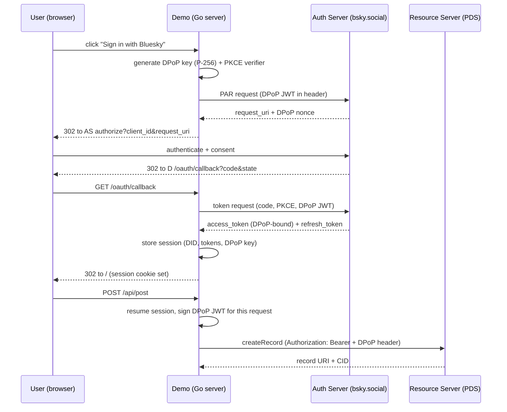

# ATProto OAuth DPoP: Password-Free Bluesky Login for the Firehose Demo

This report explains the OAuth DPoP authentication layer added to the ATProto Firehose Demo as a complete technical system. The repository originally authenticated the user with an app password: the user typed a handle and an app password into the demo, the demo sent the password to the user's Personal Data Server, and the server held the password material in memory. The new layer replaces that with ATProto's OAuth profile, which mandates DPoP (Demonstrating Proof-of-Possession). The user clicks a single button, is redirected to bsky.app to authenticate, consents there, and is redirected back with an access token cryptographically bound to a per-session key. The demo server never sees or holds a password.

The implementation lives in `/home/manuel/code/wesen/2026-07-07--atproto-experiments`, primarily in the new `pkg/oauth/factory.go` package and the refactored `pkg/server/server.go`. The docmgr ticket is `ATPROTO-DEMO`. The work was implemented across commits that first researched the protocol and reference SDK, then built the OAuth factory, then refined the user-facing flow so the account identifier remains editable on bsky.app.

> [!summary]
> - The demo now logs in through ATProto OAuth, not app passwords. OAuth in ATProto mandates DPoP: every access token is bound to a per-session P-256 private key, and every authenticated request signs a short-lived JWT over the HTTP method, URL, and a server-issued nonce. A stolen access token alone is useless without the key.
> - The indigo SDK (`atproto/auth/oauth`) hides the hard parts behind four methods: `StartAuthFlow`, `ProcessCallback`, `ResumeSession`, and `Logout`. PKCE, PAR, DPoP key generation, DPoP JWT signing, and nonce rotation happen inside the SDK.
> - The user-facing flow is a single "Sign in with Bluesky" button with no handle field. Passing a handle as a login hint locks the identifier on bsky.app; omitting it lets the user type or select their account there.
> - The system is verified end-to-end in the browser: the button redirects to `https://bsky.social/oauth/authorize`, the firehose continues to stream, and the client metadata advertises `dpop_bound_access_tokens: true`.

## Current status

The OAuth layer is a working, verified prototype. It is not production-ready in two documented ways. First, the session store is `oauth.NewMemStore()`, an in-process map. A process restart wipes all in-flight authorization states and all active sessions, so a user mid-flow sees `access_denied: This request has expired` if the server restarts between their login click and the callback. Second, the demo runs as a public client. A confidential client (with a P-256 client attestation key) would receive longer token lifetimes.

The implemented user-visible flow has two states:

| State | What the user sees |
| --- | --- |
| Signed out | A "Sign in with Bluesky" button. Clicking it navigates away to bsky.app. |
| Signed in | The account DID and a compose box that creates posts on the signed-in account. |

The relevant implementation commits are:

```text
06beedc Diary: Step 9 (editable identifier, browser verification, expired-request diagnosis)
c93abb1 Auth: remove handle field — identifier editable on bsky.app
5d3cf8c Auth: OAuth DPoP login (handle optional) + fix deletes piling at top
4d61d7b Research: OAuth DPoP login as app-password replacement
```

The verification commands and results were:

```bash
go build ./... && (cd frontend && pnpm build)
curl /oauth/client-metadata.json        # dpop_bound_access_tokens: true
curl -I /oauth/login                     # 302 -> https://bsky.social/oauth/authorize
# Playwright: click "Sign in with Bluesky" -> navigates to bsky.social
```

```text
Go build:   clean
Vite build: clean, 173 KB JS (57 KB gzip)
client-metadata: dpop_bound_access_tokens: true, scopes include fine-grained repo scopes
/oauth/login:  302 -> https://bsky.social/oauth/authorize?...&request_uri=urn:ietf:params:oauth:request_uri:...
Browser:      button click navigates to bsky.social; identifier editable; 0 console errors from the demo
```

## Why this layer exists

The app-password flow has a structural problem. The demo server receives the user's credential, exchanges it for a session, and holds the resulting access token. Every request the demo makes on the user's behalf carries that token. If the demo is compromised, the attacker obtains a token with the full scope of the app password. App passwords are revocable, but during the window before revocation the attacker can act as the user.

OAuth removes the credential from the demo entirely. The user authenticates at their PDS, not at the demo. The demo receives an access token whose scope is limited to exactly what the demo requested, and whose lifetime is short. The token is bound to a key the demo generated and holds, so a token intercepted in transit cannot be replayed from another client. Revocation is a single server-side operation.

DPoP is the binding mechanism that makes the token non-transferrable. Without it, an OAuth access token is a bearer token: whoever holds it can use it. With DPoP, the token is bound to a proof-of-possession key, and every use of the token must include a fresh proof that the presenter holds that key. This is why ATProto mandates DPoP for all client types, including the public clients that browser and desktop apps typically are.

## ATProto OAuth background

ATProto uses a specific profile of OAuth 2.1. The profile combines several standards into one required configuration. Understanding the combination is necessary before reading the implementation, because the implementation delegates to an SDK that assumes the full profile is in play.

| Standard | Role in the ATProto profile |
| --- | --- |
| OAuth 2.1 (draft) | Authorization-code grant only; no implicit grant. |
| PKCE (RFC 7636) | Mandatory. The client generates a verifier; the server challenges it. Prevents authorization-code interception. |
| DPoP (RFC 9449) | Mandatory. Binds access tokens to a per-session key. |
| PAR (RFC 9126) | Used for the authorization request. The request is pushed to the server first, returning a `request_uri`; the browser redirect carries only `client_id` and `request_uri`. |
| Client ID metadata (draft) | The `client_id` is a URL pointing to a public JSON metadata document. No `client_secret`. |

The `client_id` is the part that differs most from conventional OAuth. Instead of a pre-registered secret shared with the server, the `client_id` is a URL. The authorization server fetches the document at that URL to learn the client's name, redirect URIs, scopes, and public keys. For localhost development, ATProto special-cases `http://localhost` as a `client_id` so the server does not need to fetch anything. For production, the `client_id` is `https://<host>/oauth/client-metadata.json`, which the client must serve over HTTPS.

The flow has four roles: the resource owner (the user), the client (the demo), the authorization server (the PDS or an entryway acting for several PDSs), and the resource server (the PDS). In the common case, the PDS is both the authorization server and the resource server. For Bluesky's hosted users, `bsky.social` is the entryway authorization server.



## What DPoP is, concretely

DPoP does not use a metaphor. It uses a key and a signed token. The client generates an ECDSA P-256 keypair at the start of the flow. The private key never leaves the client. The public key is communicated to the authorization server during the token request, and the server binds the issued access token to that public key.

For every request that carries the access token, the client signs a JWT. The JWT header has `typ: dpop+jwt` and `alg: ES256`. The payload contains the HTTP method (`htm`), the request URL (`htu`), a unique random `jti`, an issuance time `iat`, and, when the server requires it, a `nonce`. The client sends this JWT in the `DPoP` HTTP header alongside the `Authorization: Bearer <token>` header.

The resource server validates three things: the JWT signature against the public key bound to the token, the `htm`/`htu` against the actual request, and the `jti` for replay prevention. If the server issued a nonce, the JWT must include it. The server rotates nonces with a maximum lifetime of five minutes. When a client uses a stale nonce, the server returns an error with `error: use_dpop_nonce` and a fresh nonce in the `DPoP-Nonce` response header. The client retries with the new nonce.

The indigo SDK implements this retry. The `SendAuthRequest` function loops twice: the first PAR attempt may fail with `use_dpop_nonce`, the SDK reads the new nonce from the response header and retries. The same pattern applies to token requests and resource-server requests through `ClientSession.DoWithAuth`. The application code never handles a raw DPoP JWT.

## The factory

The OAuth layer is a single package, `pkg/oauth/factory.go`. It wraps the indigo `oauth.ClientApp` and exposes HTTP handlers. The factory owns three things: the client app (which holds the configuration and the session store), a signed cookie store (to identify browser sessions across requests), and a logger.

```go
type Factory struct {
    Oauth       *oauth.ClientApp
    cookieStore *sessions.CookieStore
    logger      *slog.Logger
}

func NewFactory(callbackURL, sessionSecret string, logger *slog.Logger) *Factory {
    config := oauth.NewLocalhostConfig(callbackURL, defaultScopes)
    app := oauth.NewClientApp(&config, oauth.NewMemStore())
    return &Factory{
        Oauth:       app,
        cookieStore: sessions.NewCookieStore([]byte(sessionSecret)),
        logger:      logger,
    }
}
```

The `defaultScopes` list is the security-relevant decision. The demo requests `atproto` (the base scope) plus two fine-grained repo scopes: `repo:app.bsky.feed.post?action=create` and `repo:app.bsky.feed.like?action=create`. The token the demo receives can create posts and likes and nothing else. It cannot read the user's feed, follow accounts, or modify the user's profile. If the token leaks, the blast radius is two record types on one account.

`oauth.NewLocalhostConfig` builds a configuration whose `client_id` is `http://localhost?redirect_uri=...&scope=...`. The query parameters carry the redirect URI and scopes because the localhost special-case has no metadata document to fetch. For a public deployment, `oauth.NewPublicConfig` builds a `client_id` of the form `https://<host>/oauth/client-metadata.json`, and the `HandleClientMetadata` handler serves that document.

## The five handlers

The factory exposes five HTTP handlers. The server registers them in `pkg/server/server.go`:

```go
mux.HandleFunc("GET /oauth/client-metadata.json", s.oauth.HandleClientMetadata)
mux.HandleFunc("GET /oauth/login", s.oauth.HandleLogin)
mux.HandleFunc("GET /oauth/callback", s.oauth.HandleCallback)
mux.HandleFunc("POST /oauth/logout", s.oauth.HandleLogout)
```

`HandleClientMetadata` returns the public client metadata document. The handler sets the client name and URI from the request host, validates the metadata against the configured `client_id`, and serves it as JSON. For localhost dev the PDS does not fetch this, but serving it keeps the client metadata internally consistent.

`HandleLogin` starts the flow. The handler reads an optional `handle` query parameter. If a handle is provided, the SDK resolves it to a DID, resolves the DID to a PDS, resolves the PDS to an authorization server, and passes the handle as a login hint. If no handle is provided, the factory substitutes `https://bsky.social` as the authorization server URL. The SDK's `StartAuthFlow` treats any identifier beginning with `https://` as a direct authorization server URL and skips handle resolution and the login hint. The handler redirects the browser to the authorization endpoint returned by the SDK.

```go
func (f *Factory) HandleLogin(w http.ResponseWriter, r *http.Request) {
    identifier := r.URL.Query().Get("handle")
    if identifier == "" {
        identifier = "https://bsky.social"
    }
    redirectURL, err := f.Oauth.StartAuthFlow(r.Context(), identifier)
    if err != nil {
        http.Error(w, fmt.Sprintf("oauth start: %v", err), http.StatusBadRequest)
        return
    }
    http.Redirect(w, r, redirectURL, http.StatusFound)
}
```

`HandleCallback` receives the redirect back from the authorization server. The SDK's `ProcessCallback` validates the `state`, extracts the authorization code, and exchanges it for tokens. The exchange includes the PKCE verifier (proving the same client started the flow) and a DPoP JWT (proving possession of the session key). The returned `ClientSessionData` holds the account DID, the session ID, the access and refresh tokens, and the DPoP private key in multibase encoding. The handler stores the DID and session ID in a signed cookie and redirects to the SPA root.

`HandleLogout` revokes the session at the authorization server through `f.Oauth.Logout` and clears the cookie.

`ResumeClient` is the per-request method that the post and like handlers use. It reads the DID and session ID from the cookie, calls `f.Oauth.ResumeSession`, and returns the session's `APIClient`. The `APIClient` is a standard indigo `*atclient.APIClient` whose auth method is the DPoP-bound session. When the post handler calls `c.Post(ctx, "com.atproto.repo.createRecord", body, nil)`, the client signs a DPoP JWT for that exact request, attaches it, and sends the bearer token. If the PDS returns a `use_dpop_nonce` error, the client retries with the fresh nonce transparently.

## Reusing the record helpers

The app-password `pkg/bsky` package and the OAuth path share the record-creation logic. The original `Client.CreatePost` method held a reference to the authenticated client and the account DID. To support both auth methods without duplicating the record construction, the package gained two free functions:

```go
func CreatePostWithClient(ctx context.Context, c lexutil.LexClient, did, text string) (uri, cid string, err error)
func LikeWithClient(ctx context.Context, c lexutil.LexClient, did, postURI, postCID string) (string, error)
```

Both take a `lexutil.LexClient`, which is the interface that `*atclient.APIClient` implements. The app-password `Client` and the OAuth-resumed `APIClient` both satisfy it, so the same functions build the `appbsky.FeedPost` or `appbsky.FeedLike` record, wrap it in a `lexutil.LexiconTypeDecoder`, and call `comatproto.RepoCreateRecord`. The server's `authedClient` helper returns the client and DID from the OAuth session, and the handlers delegate to the free functions.

## The frontend changes

The frontend changed in three ways. First, login became a navigation rather than a fetch. OAuth requires the browser to leave the application and return, so the `api.ts` login function was removed. The `AccountPanel` sets `window.location.href = '/oauth/login'` on submit, which is a full-page navigation, not an `XMLHttpRequest`.

Second, the session state comes from the server's status endpoint rather than from a login response. The `App` component runs a `useSessionStatus` hook on mount that fetches `/api/status` and dispatches `sessionFromStatus`. The status endpoint returns `loggedIn` and `did` based on the OAuth cookie. After the callback redirects to `/`, the hook runs, sees the cookie, and the UI switches to the compose box.

Third, the handle field was removed. The first version kept an optional handle field and passed it as a query parameter. That caused the bsky.app sign-in page to pre-fill and lock the identifier input: the user could edit the password but not the handle. The login hint is a convenience for returning users, not a requirement. Removing the field and omitting the hint lets the user type or select any account on bsky.app. The final account panel is a single button.

```mermaid
flowchart LR
    Btn["Sign in with Bluesky<br/>(no handle field)"] -->|window.location| Login["GET /oauth/login"]
    Login -->|302| Bsky["bsky.social/oauth/authorize<br/>(identifier editable)"]
    Bsky -->|user authenticates| Cb["GET /oauth/callback"]
    Cb -->|302 to /| Root["SPA reload"]
    Root -->|useSessionStatus| Status["GET /api/status"]
    Status -->|loggedIn:true, did| Store["Redux session slice"]
    Store --> Compose["Compose box"]
```



## A feed bug fixed alongside

While verifying the OAuth work, the user observed that delete events piled up at the top of the live feed. The cause was in the Redux `feedSlice`. The `postReceived` reducer unconditionally prepended every event to the front of the array. A `delete` event is the newest event by sequence number, so it went to the top, while the `create` it referred to remained lower in the list. Over time, deletes dominated the visible top of the feed.

The firehose interleaves creates and deletes because a delete is itself a repository commit. The correct behavior for a feed display is that a delete removes the matching record, not that it inserts a placeholder. The fix changes `postReceived` to find the entry with the matching URI and remove it on `delete`, and to replace or prepend on `create`/`update`. The snapshot merge in `postsReceived` drops deletes from the initial batch, since a delete in a snapshot is not meaningful without the create that preceded it.

```ts
postReceived(state, action) {
  const p = action.payload
  if (p.action === 'delete') {
    const i = state.findIndex((x) => x.uri === p.uri)
    if (i >= 0) state.splice(i, 1)
    return
  }
  const i = state.findIndex((x) => x.uri === p.uri)
  if (i >= 0) state[i] = p
  else state.unshift(p)
  if (state.length > FEED_CAP) state.length = FEED_CAP
}
```

After the fix, a Playwright check on the rendered feed showed 500 items, 496 creates, zero delete placeholders, and the top eight actions all `create`. The feed no longer accumulates deleted records at the top.

## Verification

The OAuth layer was verified at three levels: the client metadata, the redirect, and the browser.

The client metadata endpoint returns a document with `dpop_bound_access_tokens: true`, the three requested scopes, and a redirect URI matching the callback. This confirms the SDK configuration is correct and the PDS will recognize the client as a DPoP client.

The login endpoint returns a 302 to `https://bsky.social/oauth/authorize?client_id=...&request_uri=urn:ietf:params:oauth:request_uri:req-...`. The `request_uri` proves the PAR request succeeded: the authorization server accepted the pushed request and returned a reference. The presence of the `request_uri` means the SDK completed the PKCE and DPoP setup and the server accepted it.

The browser test confirmed the full redirect chain. Loading the SPA showed the single "Sign in with Bluesky" button with no handle input. Clicking it navigated to `https://bsky.social/oauth/authorize` with no `login_hint` in the URL. The page that loaded was the bsky.app authentication page, where the identifier field was editable. The demo's console had zero errors. The firehose continued streaming throughout, at roughly 40 events per second.

The one error observed during testing was `access_denied: This request has expired` at the callback. This was not a flow bug. The in-memory session store was wiped when the Go process restarted between the login click and the callback. The `state` parameter in the callback URL no longer matched any stored authorization request, so the authorization server reported the request as expired. The fix is a persistent session store, not a change to the flow.

## Decision records

**Omit the handle; let the user authenticate on bsky.app.** The first version kept an optional handle field. Passing a handle as a login hint caused bsky.app to pre-fill and lock the identifier. The user could not correct a typo in the handle without restarting the flow. The decision is to omit the hint entirely and let the user type or select their account on bsky.app. The tradeoff is that returning users type their handle every time, which is acceptable for a demo and is the standard "Sign in with X" behavior.

**Use the bsky.social entryway for the no-handle path.** When no handle is provided, the factory passes `https://bsky.social` as the authorization server URL. This works for accounts hosted on Bluesky's entryway, which covers almost all demo users. Accounts on other PDSs still need a handle so the SDK can resolve their PDS. The tradeoff is that the no-handle path is not universal, but it matches the demo's audience.

**Keep the in-memory store for now.** `oauth.NewMemStore()` is explicitly documented as inappropriate for any real use, because a restart logs out every user and invalidates every in-flight flow. The decision is to keep it for the prototype and document the limitation. The `ClientAuthStore` interface has six methods, small enough to back with a file or SQLite store. The tradeoff is the `access_denied: expired` error on restart, which is acceptable for a local demo.

**Request fine-grained scopes, not full access.** The demo requests `atproto` plus two `repo:` scopes limited to creating posts and likes. The token cannot perform other actions. The tradeoff is that adding a new feature requires adding a new scope to the request, which is the correct constraint: the token's power should match the demo's functionality.

## Open questions

- Should the demo implement a persistent `ClientAuthStore` so flows survive restarts? The interface is small; a file-backed store keyed by `state` and `did/sessionID` would eliminate the expired-request failure.
- Should the demo add a `/oauth/refresh` endpoint? The SDK's `ClientSession.RefreshTokens` exists, but the `APIClient` refreshes transparently on token expiry. An explicit endpoint would let the frontend force a refresh before a long-running action.
- Should the demo run as a confidential client? Adding a P-256 client attestation key would give longer token lifetimes and let the authorization server identify the client software across sessions. The tradeoff is key management.

## Near-term next steps

- Implement a file- or SQLite-backed `ClientAuthStore` so in-flight flows survive restarts and the `state`/PKCE mapping persists across slow human consent.
- Complete the full round-trip with a real human login: consent on bsky.app, callback, post creation, and observation of that post arriving through the firehose. This cannot be automated.
- Add a like button to the feed UI that calls `/api/like` with the post's URI and CID.
- Add a `/oauth/refresh` endpoint for explicit token refresh.

## Important project docs

These are repo-local:

- `/home/manuel/code/wesen/2026-07-07--atproto-experiments/pkg/oauth/factory.go` — the OAuth factory and handlers
- `/home/manuel/code/wesen/2026-07-07--atproto-experiments/pkg/server/server.go` — the server wiring and `authedClient` helper
- `/home/manuel/code/wesen/2026-07-07--atproto-experiments/ttmp/2026/07/07/ATPROTO-DEMO--atproto-firehose-demo-app/scripts/01-oauth-web-demo.go` — the indigo reference web app
- `/home/manuel/code/wesen/2026-07-07--atproto-experiments/ttmp/2026/07/07/ATPROTO-DEMO--atproto-firehose-demo-app/scripts/02-oauth-sdk-oauth.go` — the indigo OAuth SDK
- `/home/manuel/code/wesen/2026-07-07--atproto-experiments/sources/specs/oauth.md` — the ATProto OAuth specification

## Project working rule

> [!important]
> Omit the login hint. Passing a handle as a login hint locks the identifier on bsky.app and prevents the user from correcting it. The user should authenticate on their provider, not commit to a value typed on the demo's form.
