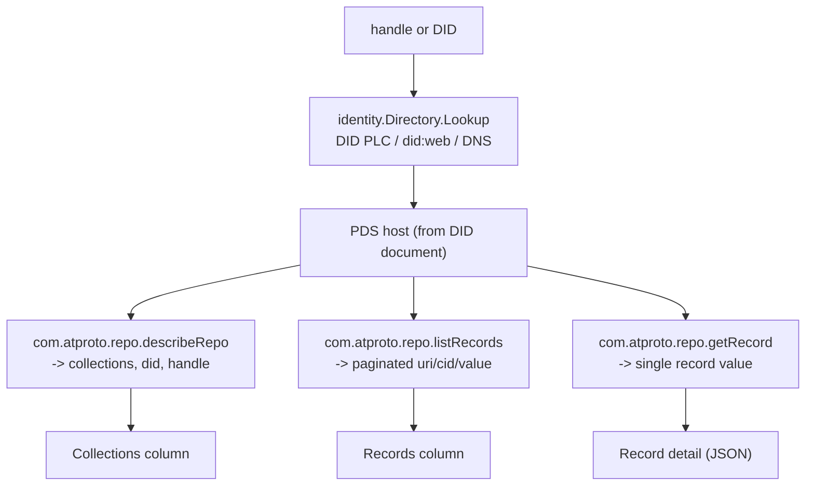
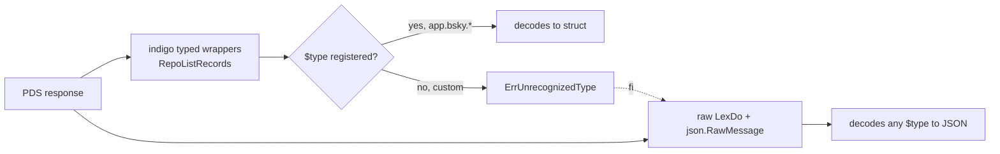

# ATProto Repository Browser: Walking a Public Repository with Go and React

This report explains the repository browser added to the ATProto demo as a complete technical system. The browser is a second page in the demo application. The user enters a handle or a DID, the application describes the repository, lists its collections, paginates the records within a chosen collection, and renders the fully decoded JSON of a selected record. The browser reads any public repository without authentication, and uses the authenticated OAuth session when the user browses their own repo.

The implementation lives in `/home/manuel/code/wesen/2026-07-07--atproto-experiments`, primarily in the new `pkg/repobrowser/browser.go` package, the `pkg/server/server.go` routes, and `frontend/src/RepoBrowser.tsx`. The docmgr ticket is `REPO-BROWSER`. The work was implemented across commits that built the three-layer browser, then fixed a decode failure that occurred when the user pointed the browser at a repository containing custom, non-Bluesky Lexicons.

> [!summary]
> - The browser reads a repository through three public XRPC queries: `com.atproto.repo.describeRepo` (collections), `com.atproto.repo.listRecords` (paginated records), and `com.atproto.repo.getRecord` (single record). Reads are unauthenticated; the OAuth session is used only when the requested repo is the logged-in account's own.
> - A custom-Lexicon decode bug forced a change from indigo's typed record wrappers to raw JSON decoding. The typed wrappers reject any `$type` the SDK has not registered, which breaks browsing for repositories that use custom collections such as `dev.hypercard.app.card`. The fix decodes the record value as `json.RawMessage` so any collection renders.
> - The UI is a three-column layout driven by local React state: collections, records, and record detail. A tab switch moves between the firehose page and the browser; the firehose keeps streaming while the user browses.
> - The system is verified against two real repositories. `atproto.com` returns 25 collections and paginated posts. The user's own `go-go-golems.bsky.social` returns four collections including two custom `dev.hypercard.*` collections, and the browser renders the custom card records after the decode fix.

## Current status

The repository browser is a working, verified page. It reads any public repository by handle or DID, paginates records, and renders record values as JSON. It is not a integrity verifier: it does not check the repository's Merkle Search Tree root or commit signatures, and it does not stream updates. Those are separate concerns covered by the firehose page and by future work.

The implemented user-visible flow has three columns and one input:

| UI element | Purpose |
| --- | --- |
| Identifier input + Describe | Enter a handle or DID; fetch the repo description |
| Collections column | List the repo's collections; click to load records |
| Records column | Paginated record summaries; click to load detail; "load more" for the next page |
| Record column | The selected record's decoded value as JSON |

The implementation commits are:

```text
b17638d Docs: REPO-BROWSER reMarkable upload complete; all tasks done
d0b77b6 Docs: REPO-BROWSER design guide + diary; bookkeeping; doctor passes
a07b130 RepoBrowser: raw-JSON decode so ANY collection works (custom Lexicons)
597df58 Repo browser: walk any ATProto repo by handle/DID (ticket REPO-BROWSER)
```

The verification commands and results were:

```bash
go build ./... && (cd frontend && pnpm build)
curl "/api/repo/describe?repo=atproto.com"            # 25 collections
curl "/api/repo/records?repo=atproto.com&collection=app.bsky.feed.post"  # 50 records
curl "/api/repo/record?repo=atproto.com&collection=app.bsky.feed.post&rkey=<rkey>"
# Playwright: describe -> collections -> records -> detail JSON, 0 console errors
```

```text
Go build:   clean
Vite build: clean, 176 KB JS (58 KB gzip)
atproto.com:        25 collections, 50 records per page, record value with $type/text/embed
go-go-golems.bsky.social: 4 collections (2 custom dev.hypercard.*), 4 card records
Browser:           3-column flow works end-to-end; 0 console errors
```

## Why this page exists

The firehose page shows the network's writes as they happen. It does not show the state those writes accumulate into. A repository is the accumulated state of an account: every post, like, follow, and profile record the account has ever created, organized into collections and addressed by record keys. A repository browser makes that state inspectable.

The second reason is that reads use a different API surface than writes. Writes go through `com.atproto.repo.createRecord` and similar procedures. Reads go through `com.atproto.repo.describeRepo`, `listRecords`, and `getRecord`, which are query endpoints that return the current state without replaying history. Building the browser forces the implementer to learn the read side of the protocol, including identity resolution, pagination, and the record value encoding.

The third reason is that a repository can contain collections the Bluesky application does not define. The user's own repository contains `dev.hypercard.app.card` and `dev.hypercard.app.stack`, which are custom Lexicons from a separate application. A browser that only handled `app.bsky.*` records would be incomplete. The custom-Lexicon decode bug, and its fix, are the most instructive part of this work.

## Repository background

An ATProto repository is a content-addressed, public, key/value mapping. The keys are paths of the form `<collection>/<record-key>`. The values are records, encoded as CBOR on the wire and JSON over HTTP. The whole structure is a Merkle Search Tree, so the root hash changes on every mutation and the data is self-certifying. This section defines the terms the rest of the report uses.

A collection is a namespace for records of the same type, identified by an NSID. `app.bsky.feed.post` holds posts; `app.bsky.feed.like` holds likes; `app.bsky.graph.follow` holds follows. A repository can contain any collection, including custom ones outside the `app.bsky.*` namespace.

Within a collection, each record has a record key (rkey), usually a TID so records sort chronologically. A record's path is `<collection>/<rkey>`. The canonical reference to a record is an AT URI: `at://<authority>/<collection>/<rkey>`, where the authority is a DID or a handle. Every record has a CID, a SHA-256 content hash.

The authoritative host for an account's repository is the account's PDS, declared in the DID document. To read a repository, the application resolves the handle or DID to its PDS endpoint and queries the PDS. Reads are public and unauthenticated.



## The three XRPC read queries

The browser uses three query endpoints under the `com.atproto.repo.*` namespace. All are HTTP GET queries that take a `lexutil.LexClient` (an authenticated client or a plain PDS client) and return typed structs in the indigo SDK.

`com.atproto.repo.describeRepo` takes a handle or DID and returns the list of collections the repository contains, the DID, the handle, and whether the handle resolves correctly. It is the entry point: it tells the UI which collections to show.

```go
func RepoDescribeRepo(ctx context.Context, c lexutil.LexClient, repo string) (*RepoDescribeRepo_Output, error)

type RepoDescribeRepo_Output struct {
    Collections     []string `json:"collections"`
    Did             string   `json:"did"`
    Handle          string   `json:"handle"`
    HandleIsCorrect bool     `json:"handleIsCorrect"`
}
```

`com.atproto.repo.listRecords` paginates the records in a collection. It takes the collection NSID, a cursor (a TID for the next page), a limit, the repo, and a reverse flag. Each record has a URI, a CID, and a value. The browser lists records by URI and CID first, and fetches the full value on demand to keep list responses small.

`com.atproto.repo.getRecord` fetches a single record by repo, collection, and rkey. It returns the URI, the CID, and the value. The optional CID parameter selects a specific version; the browser omits it to get the current version.

To reach the PDS, the browser resolves the handle or DID through `identity.DefaultDirectory()`, which checks DID PLC, `did:web`, and DNS handle records. The `PDSEndpoint()` method returns the PDS base URL from the DID document. A plain `atclient.NewAPIClient(host)` is then used for unauthenticated reads.

## The browser package

The browser is a single package, `pkg/repobrowser/browser.go`. It owns an identity directory, an HTTP client, and a logger. The `pdsClient` method resolves an identifier to its PDS and returns an unauthenticated `APIClient`. When the caller passes an authenticated `LexClient` (the OAuth session), `pdsClient` returns it directly, skipping resolution.

```go
func (b *Browser) pdsClient(ctx context.Context, identifier string, authed util.LexClient) (util.LexClient, string, error) {
    if authed != nil {
        return authed, "", nil
    }
    atid, err := syntax.ParseAtIdentifier(identifier)
    ident, err := b.dir.Lookup(ctx, atid)
    return atclient.NewAPIClient(ident.PDSEndpoint()), ident.DID.String(), nil
}
```

`Describe`, `ListRecords`, and `GetRecord` each resolve the PDS, call the corresponding XRPC, and trim the result to a UI-friendly struct. `ListRecords` returns `RecordSummary` (URI, CID, rkey), not the full value, so list pages stay small. The rkey is extracted from the URI by manual path splitting.

The manual path splitting is a requirement, not a choice. Go's `net/url` package cannot parse AT URIs. The colons in a DID (`did:plc:...`) confuse `net/url`'s host:port splitting, so the path comes out wrong. The at-uri specification explicitly notes that `net/url` does not work. The implementation splits the string manually: strip the `at://` scheme, then `strings.SplitN(rest, "/", 3)` to get the DID, collection, and rkey.

## The custom-Lexicon decode bug

The first version of the browser used indigo's typed `RepoListRecords` and `RepoGetRecord` wrappers. These worked for `atproto.com`, but failed when the user pointed the browser at `go-go-golems.bsky.social`, which contains the custom collections `dev.hypercard.app.card` and `dev.hypercard.app.stack`. The `listRecords` call returned an error: `unrecognized lexicon type: "dev.hypercard.app.card"`.

The cause is in the indigo SDK's `lexutil.LexiconTypeDecoder`. The `Value` field of `RepoListRecords_Record` and `RepoGetRecord_Output` is a `*lexutil.LexiconTypeDecoder`. Its `UnmarshalJSON` method calls `JsonDecodeValue`, which extracts the `$type` field from the JSON and looks up a Go type registered for that `$type` via `lexutil.RegisterType`. If no type is registered, it returns `ErrUnrecognizedType`. The indigo SDK registers types only for the `app.bsky.*` and `com.atproto.*` namespaces. Any custom collection fails to decode.

This is a hard error, not a fallback to a generic map. A repository browser that rejects unknown collections defeats its own purpose: a repo can contain any collection the account's application defines. The fix bypasses the typed decoder entirely.

The fix calls `LexDo` directly with a raw JSON output struct. The struct uses `json.RawMessage` for the value field, so the JSON decoder stores the record bytes without interpreting the `$type`. The browser then passes the raw JSON to the UI, which renders it as-is.

```go
type listRecordsRaw struct {
    Cursor  *string `json:"cursor,omitempty"`
    Records []struct {
        Cid   string          `json:"cid"`
        Uri   string          `json:"uri"`
        Value json.RawMessage `json:"value"`
    } `json:"records"`
}

func (b *Browser) ListRecords(ctx context.Context, identifier, collection, cursor string, limit int64, authed util.LexClient) ([]RecordSummary, string, error) {
    c, _, err := b.pdsClient(ctx, identifier, authed)
    params := map[string]any{"collection": collection, "repo": identifier, "limit": limit}
    if cursor != "" { params["cursor"] = cursor }
    var raw listRecordsRaw
    if err := c.LexDo(ctx, util.Query, "", "com.atproto.repo.listRecords", params, nil, &raw); err != nil {
        return nil, "", fmt.Errorf("listRecords: %w", err)
    }
    // ...build summaries from raw.Records...
}
```

`GetRecord` uses the same pattern. `Describe` keeps the typed `RepoDescribeRepo` because its response has no `Value` field and therefore no decode ambiguity.

After the fix, the browser renders the user's custom card records. The first card, "Executable JS FRP stack", has `$type: dev.hypercard.app.card`, a `name`, a `stack` field that is an AT URI linking to a stack record, a `script`, and `initialState`. The browser now handles any collection the repository contains.



## The auth bridge for own-repo reads

Repository reads are public, so the browser works without authentication. When the user is logged in and browses their own repo, the server uses the OAuth session's DPoP-bound client instead of an unauthenticated one. This respects any read scope the token grants and lets the user see their repo through their own credentials.

The bridge is a single method in `pkg/server/server.go`:

```go
func (s *Server) repoAuthedClient(r *http.Request, repo string) lexutil.LexClient {
    api, err := s.oauth.ResumeClient(r)
    if err != nil { return nil }
    if api.AccountDID != nil && api.AccountDID.String() == repo {
        return api
    }
    return nil
}
```

If the requested repo matches the logged-in account's DID, the method returns the OAuth client; otherwise it returns nil, and the browser falls back to an unauthenticated PDS client. The UI does not change: the same endpoints serve both cases, and the browser code receives either an authenticated or an unauthenticated `LexClient` without knowing which.

## The frontend

The frontend is a three-column layout in `frontend/src/RepoBrowser.tsx`, driven by local React state. The columns are collections, records, and record detail. The state transitions are a chain: describe clears everything and sets the collections; selecting a collection clears the detail and loads the records; selecting a record loads the detail. Pagination appends to the records list when a cursor is passed; selecting a new collection resets it.

The component makes three fetch calls, one per column transition. It does not use Redux: the browser state is local to the page and does not need to survive navigation away from the page. The firehose feed, by contrast, lives in Redux because it must keep streaming while the user switches tabs.

The tab switch lives in `App.tsx`. A two-tab nav moves between Firehose and Repository. The tab is local UI state. Both pages share the Redux store, so the firehose keeps streaming while the user browses a repository. When the user is logged in, the browser offers a "use mine" button that fills the identifier with the user's DID, so they can browse their own repo in one click.

```mermaid
flowchart LR
    Input["identifier + Describe"] -->|GET /api/repo/describe| Desc["describeRepo"]
    Desc --> ColCol["Collections column"]
    ColCol -->|click collection|| Recs["GET /api/repo/records"]
    Recs --> RecCol["Records column"]
    RecCol -->|click record| Det["GET /api/repo/record"]
    Det --> DetCol["Record detail (JSON)"]
    RecCol -->|load more| Recs
```

## Verification

The browser was verified against two real repositories through curl and Playwright.

Against `atproto.com`, the describe endpoint returned 25 collections, including `app.bsky.feed.post`, `app.bsky.feed.like`, `app.bsky.actor.profile`, and `app.bsky.feed.generator`. Listing `app.bsky.feed.post` returned 50 records with correct rkeys and a pagination cursor. Fetching a record returned its decoded value with `$type: app.bsky.feed.post`, `text`, `createdAt`, and `embed`.

Against `go-go-golems.bsky.social`, the describe endpoint returned four collections: `app.bsky.feed.post`, `app.bsky.graph.follow`, `dev.hypercard.app.card`, and `dev.hypercard.app.stack`. The last two are custom Lexicons from the Hypercard application. Before the decode fix, listing `dev.hypercard.app.card` failed with `unrecognized lexicon type`. After the fix, it returned four records, and fetching a record returned its value with `$type: dev.hypercard.app.card`, `name`, `stack`, `script`, and `initialState`.

The Playwright test exercised the full three-column flow: load the page, switch to the Repository tab, describe `go-go-golems.bsky.social`, click `dev.hypercard.app.card`, see four records, click the first, and read the rendered JSON. The browser console had zero errors. The firehose continued streaming throughout, at roughly 40 events per second.

## Decision records

**Use raw JSON decoding, not indigo's typed wrappers, for record values.** The typed wrappers reject any `$type` the SDK has not registered. A repository can contain any collection, including custom ones outside `app.bsky.*`. The decision is to call `LexDo` with a `json.RawMessage` value so any collection decodes. The tradeoff is no Lexicon validation, which is correct for a read-only browser that renders JSON. For code that re-serializes or acts on records, validation against the Lexicon would be needed.

**List records as summaries, fetch the value on demand.** `listRecords` returns the full value per record, which is wasteful for a list view. The decision is to return URI, CID, and rkey in the list, and fetch the value when the user selects a record. The tradeoff is two round trips per record inspection, which is acceptable for a browser.

**Public unauthenticated reads, with OAuth for the user's own repo.** Repository reads are public. The decision is to use an unauthenticated PDS client by default, and the OAuth session only when the requested repo matches the logged-in account's DID. The tradeoff is that the browser cannot read non-public data on other accounts, which the protocol does not expose anyway.

**Manual AT URI parsing, not `net/url`.** Go's `net/url` cannot parse AT URIs because colons in DIDs confuse host:port splitting. The at-uri specification documents this. The decision is to split the URI manually. The tradeoff is a small helper that must handle the scheme and three path segments, which is trivial and spec-anchored.

## Open questions

- Should the browser show the repository's commit revision and MST root? `com.atproto.sync.getLatestCommit` returns the current commit; comparing the MST root against the listed records would verify integrity. This is future work.
- Should the browser render record values with type-aware formatting? Posts could show `text` prominently; likes could show the `subject` strong reference. The current raw-JSON view is complete but not tailored.
- Should the browser resolve AT URI references inside records into clickable links? The Hypercard card records reference stack records by AT URI; making those navigable would turn the browser into a graph walker.

## Near-term next steps

- Add the repo revision and commit root to the description view via `com.atproto.sync.getLatestCommit`.
- Render record values with type-aware formatting for known collections (`app.bsky.*`).
- Resolve AT URI references inside records into clickable navigation links.
- Add virtualized scrolling for large collections so thousands of records do not render at once.
- Surface PDS errors in the UI as a banner so an empty column is distinguishable from a load failure.

## Important project docs

These are repo-local:

- `/home/manuel/code/wesen/2026-07-07--atproto-experiments/pkg/repobrowser/browser.go` — the browser package
- `/home/manuel/code/wesen/2026-07-07--atproto-experiments/pkg/server/server.go` — the routes and `repoAuthedClient`
- `/home/manuel/code/wesen/2026-07-07--atproto-experiments/frontend/src/RepoBrowser.tsx` — the three-column UI
- `/home/manuel/code/wesen/2026-07-07--atproto-experiments/ttmp/2026/07/07/REPO-BROWSER--atproto-repository-browser/design-doc/01-repository-browser-design-implementation-guide.md` — the intern design guide
- `/home/manuel/code/wesen/2026-07-07--atproto-experiments/sources/specs/repository.md` — the repository specification
- `/home/manuel/code/wesen/2026-07-07--atproto-experiments/sources/specs/at-uri-scheme.md` — the AT URI specification

## Project working rule

> [!important]
> Decode record values as raw JSON, not through typed wrappers. A repository can contain any collection, and the typed wrappers reject unregistered `$type` values. The browser must render what the repository contains, not what the SDK knows about.
