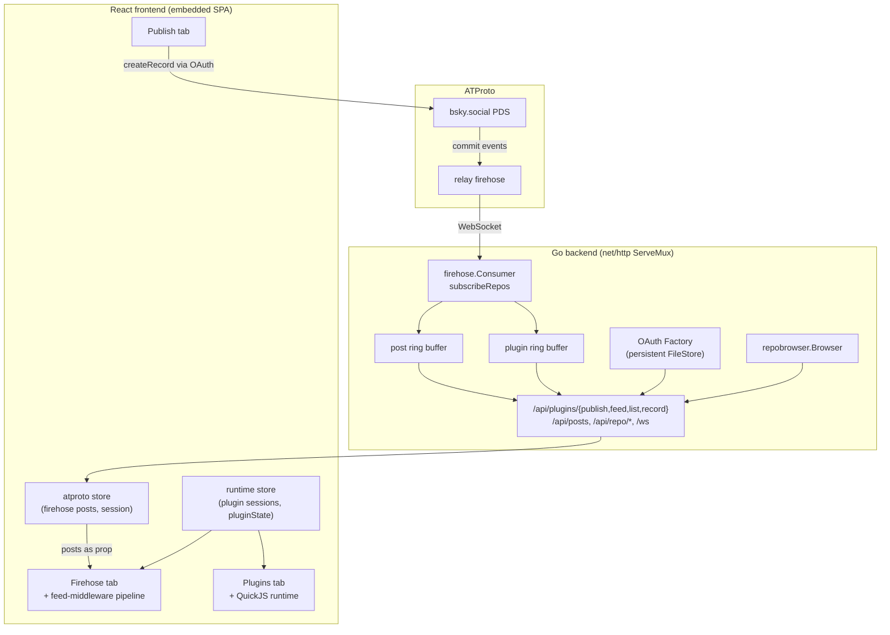
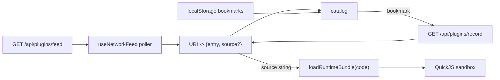

# ATProto Social Plugin Sharing: Publish, Discover, and Run Sandboxed JS Plugins

This report explains a system that lets a person author a JavaScript plugin, publish it to their ATProto repository, and have other people discover that plugin on the live firehose, opt into it, and execute it inside a browser sandbox. The work spans two design tickets, `PLUGIN-SHARING` and `PLUGIN-RUNTIME`, and ends with a single merged application that performs the entire loop in one origin. The implementation lives in `/home/manuel/code/wesen/2026-07-07--atproto-experiments`.

The report is written for an engineer who needs to understand, modify, or reproduce the system. It does not use analogies. It explains each component in its own terms, then connects them with code, diagrams, and a verified end-to-end trace.

> [!summary]
> - A plugin is a `.vm.js` source string published as a `dev.atproto-demo.plugin` record. Publishing uses OAuth DPoP with a fine-grained scope limited to creating that collection. Discovery is the relay firehose; retrieval is `com.atproto.repo.getRecord`.
> - The browser runtime is a QuickJS WebAssembly VM that accepts plugin source as a string. Network loading replaces a build-time `?raw` import with a `fetch()`; the sandbox, validation, and action routing are unchanged.
> - The application is one Go binary that embeds a React frontend. It has four tabs: Firehose (with live feed-middleware plugins), Repository, Publish, and Plugins. A firehose post stream and a plugin session store coexist through a nested Redux provider.
> - The full loop was verified with real data: two plugins were published to a real repository, the firehose decoded them within seconds, they appeared in the Plugins tab as network discoveries, one was bookmarked and launched, and it rendered and responded to input inside the QuickJS sandbox with zero console errors.

## Current status

The system is a working prototype. It publishes real records, decodes them from the live firehose, discovers them in a browser catalog, and runs them in a sandbox. It is not a packaged platform, and it does not verify the integrity of fetched source against the record's content hash; that verification is deferred and documented.

The implemented application has four tabs.

| Tab | Purpose |
| --- | --- |
| Firehose | Live post stream with optional feed-middleware plugins that filter and annotate visible posts. |
| Repository | Walk any public ATProto repository by handle or DID. |
| Publish | Compose a plugin source string and metadata, then publish it as a record. |
| Plugins | Catalog of built-in and network-discovered plugins; bookmark and run them. |

The implementation commits, in order:

```text
f7073a3  publish-plugin CLI tool + verified end-to-end round trip
a8c0219  merge: vendored QuickJS runtime + Plugins tab + firehose middleware
10f28c6  Publish tab + plugin API client
e4eb5a3  backend: Lexicon, publish, firehose decode, endpoints
```

The verification commands and observed results were:

```bash
go build ./... && go vet ./...           # clean
cd frontend && pnpm exec tsc --noEmit   # clean
cd frontend && pnpm build                # clean (QuickJS chunk-size warning is expected)
go run ./cmd/publish-plugin --store /tmp/oauth-store-ps   # publishes 2 records
curl /api/plugins/feed                                     # both plugins
```

```text
publish "Greeting"   -> at://did:plc:y7opujl2.../dev.atproto-demo.plugin/3mq4aoe6bcu26
publish "Echo Box"   -> at://did:plc:y7opujl2.../dev.atproto-demo.plugin/3mq4aoe7kge2y
feed: 2 plugins, within seconds of publish
browser: Greeting bookmarked, launched, rendered "Hello from the firehose!",
         "Next greeting" click cycled the message, 0 console errors
firehose middleware: Keyword Lens 60/60 -> 0/60 on "zzzzz" -> 60/60 on clear
```

## Why this system exists

A prior experiment, `browser-js-inject-vm`, ran JavaScript plugins inside an in-browser QuickJS VM. Its limitation was explicit: plugins were bundled at build time through Vite `?raw` imports, and there was no way to load a plugin authored by someone else. A person could not publish a plugin they wrote, and a browser could not discover plugins authored by other people.

ATProto is the natural substrate for solving that limitation. An ATProto repository is a public, content-addressed, append-mostly key-value store. A plugin script is a small piece of content. If a plugin is an ATProto record, then publishing is `com.atproto.repo.createRecord`, discovery is the relay firehose, and retrieval is `com.atproto.repo.getRecord`. The identity model (DIDs, handles) and the social graph come with the substrate.

The work had to answer three questions. How does a plugin become a record? How does a browser learn that the record exists? How does the browser execute the record's source safely? The first two are the publishing and feed side, ticket `PLUGIN-SHARING`. The third is the execution side, ticket `PLUGIN-RUNTIME`. The two meet at a single interface: the runtime function that evaluates a source string.

## System architecture

The application is one Go binary. The backend serves an HTTP API and an embedded React single-page application over the same origin. There is no second server and no proxy. The frontend has two Redux stores that coexist through a nested provider.



The two stores are separated by ownership. The atproto store holds the firehose post stream and the login session. The runtime store holds plugin sessions, plugin-local state, the action timeline, and toasts. They are bridged by passing data as a prop across the provider boundary: the firehose component reads posts from the atproto store and passes them into the runtime-wrapped pipeline as an argument.

## The Lexicon and the record model

A plugin is a record in the collection `dev.atproto-demo.plugin`. The Lexicon identifier is an NSID. NSID syntax requires a reversed-domain authority followed by a name segment; `dev.atproto-demo` is the authority and `plugin` is the name. The authority is a namespace, not a DNS record. For a deployment that owns a domain, the authority should be that domain in reverse order.

The record key type is `tid`, a Timestamp Identifier. TIDs sort lexicographically by creation time, so listing records returns them newest-first. The Lexicon defines the record as an object with these fields:

```json
{
  "lexicon": 1,
  "id": "dev.atproto-demo.plugin",
  "defs": {
    "main": {
      "type": "record",
      "key": "tid",
      "record": {
        "type": "object",
        "required": ["title", "source", "packageIds", "capabilities", "createdAt"],
        "properties": {
          "title": { "type": "string" },
          "description": { "type": "string" },
          "source": { "type": "string", "maxLength": 100000 },
          "sourceBlob": { "type": "blob", "maxSize": 1000000 },
          "version": { "type": "string" },
          "packageIds": { "type": "array", "items": { "type": "string" } },
          "capabilities": { "type": "object",
            "properties": { "domain": { "type": "array" }, "system": { "type": "array" } } },
          "hooks": { "type": "object",
            "properties": { "feedMiddleware": { "type": "boolean" }, "incomingFeedMessage": { "type": "boolean" } } },
          "homeSurface": { "type": "string" },
          "license": { "type": "string" },
          "createdAt": { "type": "string", "format": "datetime" }
        }
      }
    }
  }
}
```

The `source` field holds the plugin source inline as a string. The `sourceBlob` field is an alternative for large plugins that should be stored as a PDS blob. The first version implements only the inline path; the blob field exists so records can upgrade without a Lexicon migration. The `packageIds` and `capabilities` fields mirror the runtime's manifest entry, so the runtime can install packages and enforce capabilities without a second fetch. The `hooks` field tells the runtime whether the plugin participates in feed middleware.

The canonical reference to a plugin record is an AT URI: `at://<did>/<collection>/<rkey>`. Go's `net/url` cannot parse AT URIs because the colons in a DID confuse host-port splitting. The at-uri specification documents this. The implementation parses the URI by stripping the `at://` scheme and splitting the remainder on `/`.

## The publish path

Publishing writes a plugin record to the authenticated account's repository through `com.atproto.repo.createRecord`. The indigo SDK provides a typed wrapper, `comatproto.RepoCreateRecord`, but its `Record` field requires a registered Go type for the record value. There is no generated Go type for `dev.atproto-demo.plugin`. The typed wrapper rejects custom Lexicons.

The implementation calls the low-level `LexDo` method directly with a `map[string]any` body. This is the same raw approach used elsewhere in the codebase for listing and getting custom-Lexicon records. The `LexDo` signature is:

```go
LexDo(ctx, method, inputEncoding, endpoint, params, bodyData, out) error
```

For `createRecord`, the method is `Procedure` (HTTP POST), the input encoding is `application/json`, and the body carries the repository DID, the collection, and the record:

```go
func Publish(ctx context.Context, client lexutil.LexClient, did string, rec PublishRecord) (*PublishResult, error) {
    body := map[string]any{
        "repo":       did,
        "collection": NSID,
        "record":     rec.recordMap(), // includes "$type": NSID
    }
    var out PublishResult
    err := client.LexDo(ctx, lexutil.Procedure, "application/json",
        "com.atproto.repo.createRecord", nil, body, &out)
    return &out, err
}
```

Authentication uses OAuth DPoP. The OAuth factory requests a fine-grained scope, `repo:dev.atproto-demo.plugin?action=create`, which limits the token to creating records in that one collection. The token is DPoP-bound: the SDK signs a fresh DPoP JWT for each request and rotates the server-issued DPoP nonce automatically. The OAuth session persists to disk through a file-backed store, so a session survives a process restart. A standalone tool, `cmd/publish-plugin`, resumes a persisted session and publishes records without a browser, which is how the verification was performed.

## The firehose decode path

Discovery is the relay firehose. The consumer subscribes to `com.atproto.sync.subscribeRepos` over WebSocket. Each frame is a `#commit` event carrying a CAR slice of new and updated records. The consumer walks the commit operations and decodes the records it cares about.

The consumer originally decoded only `app.bsky.feed.post`. Extending it to decode plugin records required two changes. First, the collection filter, which had been a single `if collection != "app.bsky.feed.post" { continue }`, became a `switch` over collection names. Second, a plugin decoder reads the record block as a generic `map[string]any` using `atdata.UnmarshalCBOR` and extracts the metadata fields the feed needs.

```go
switch collection.String() {
case "app.bsky.feed.post":
    c.decodePost(ctx, r, evt, op, collection, rkey)
case plugins.NSID: // "dev.atproto-demo.plugin"
    c.decodePlugin(ctx, r, evt, op, collection, rkey)
}
```

The plugin decoder deliberately does not read the `source` field. The source can be large, and the feed delivers metadata so a browser can show a catalog entry and decide whether to fetch the full source. This mirrors the repository browser's decision to list records as summaries and fetch the full value on demand.

```go
func (c *Consumer) decodePlugin(ctx context.Context, r *repo.Repo, evt *Commit, op *Op, collection NSID, rkey RecordKey) {
    summary := plugins.PluginSummary{URI: atURI(evt.Repo, op.Path), AuthorDID: evt.Repo, ...}
    if op.Action == "create" || op.Action == "update" {
        recBytes, _, _ := r.GetRecordBytes(ctx, collection, rkey)
        rec, _ := atdata.UnmarshalCBOR(recBytes)         // map[string]any
        summary = plugins.DecodeSummary(evt.Repo, summary.URI, summary.CID, rkey.String(),
                                        op.Action, evt.Seq, evt.Time, rec)
    }
    c.broadcastPlugin(summary)
}
```

The consumer maintains a separate subscriber channel for plugin summaries, so a plugin feed consumer does not pay for post decoding and vice versa. The server subscribes to that channel and pushes summaries into a ring buffer, which the `/api/plugins/feed` endpoint serves newest-first.

A critical property of this path is that it never uses indigo's typed `LexiconTypeDecoder`. That decoder returns `ErrUnrecognizedType` for any `$type` not registered in the Go process, and custom Lexicons are not registered. The raw `map[string]any` decode is the only approach that works for arbitrary collections. This was learned earlier, when pointing the repository browser at a repository containing `dev.hypercard.app.card` records failed with `unrecognized lexicon type`.

## The runtime load seam

The browser runtime is a QuickJS WebAssembly VM. The central fact that makes network loading tractable is that the runtime accepts plugin source as a string. The load function is:

```ts
async loadRuntimeBundle(stackId, sessionId, packageIds, code: string): Promise<RuntimeBundleMeta>
```

The method creates a QuickJS context, installs a bootstrap kernel, installs the requested runtime packages, evaluates `code`, reads the bundle metadata through a host method, and validates it. The `code` parameter is the entire `.vm.js` source string. The runtime is agnostic to where that string came from.

Before the merge, the string came from a Vite `?raw` import at build time. After the merge, the string comes from a `fetch()` to `/api/plugins/record`. Nothing downstream changes. The bootstrap kernel, the package installation, the metadata validation, the surface rendering, and the action routing are all reused unchanged. This is the single most important property of the design: the load seam is a string, so changing the source of the string is the entire difference between a bundled plugin and a network plugin.

A plugin registers itself by calling `defineRuntimeBundle(factory)`, where the factory receives package APIs and returns a bundle object:

```js
defineRuntimeBundle(({ ui }) => ({
  id: 'greeting',
  title: 'Greeting',
  packageIds: ['ui'],
  initialPluginState: { n: 0 },
  surfaces: {
    panel: {
      packId: 'ui.card.v1',
      render({ state }) {
        const n = (state.plugin && state.plugin.n) || 0;
        return ui.panel([ui.text(msgs[n % msgs.length]), ui.button('Next', { onClick: { handler: 'next' } })]);
      },
      handlers: {
        next({ dispatchPluginAction, state }) {
          dispatchPluginAction('state.merge', { n: ((state.plugin && state.plugin.n) || 0) + 1 });
        },
      },
    },
  },
}));
```

The host calls `render`, validates the returned tree, and renders it as React. When the user interacts, the host calls the named handler inside QuickJS. The handler does not mutate host state; it records a JSON action. The host validates and routes the action. This is a data-only protocol: the plugin never receives a live host object reference.

## Discovery, bookmarking, and execution

A React hook polls `/api/plugins/feed` every thirty seconds and caches the summaries. The catalog merges three sources: built-in plugins, bookmarked network plugins, and discovered network plugins. A discovered plugin is not runnable. It becomes runnable only after the user bookmarks it.



Bookmarking is the opt-in gate. A network plugin is arbitrary code from an arbitrary author; running it without consent would execute untrusted code on arrival. Bookmarks persist in `localStorage`, so a user's selection survives a reload. The bookmark also doubles as the user's personal selection of plugins they want available.

When the user launches a bookmarked plugin, the loader fetches its full source from `/api/plugins/record` if it is not already cached, then calls `loadRuntimeBundle` with the source string. The record is fetched by parsing the AT URI into a DID and a record key and querying the repository:

```ts
async function loadNetworkSource(uri: string): Promise<string> {
  const { did, rkey } = parseAtURI(uri);
  const res = await fetch(`/api/plugins/record?repo=${did}&rkey=${rkey}`);
  const record = await res.json();
  return String(record?.value?.source ?? '');
}
```

The cache holds a stable `PluginManifestEntry` reference per URI, so source fetched once persists across renders. This avoids a re-fetch problem: the feed poller recreates summaries each tick, and without a stable reference the source would be re-fetched on every poll.

## The untrusted-plugin security model

Built-in plugins are trusted because their source is in the build. Network plugins are untrusted. The security model has four layers.

The first is execution isolation. Each plugin runs in a separate QuickJS context with no host globals. There is no `window`, no `document`, no `fetch`. A 32 MiB memory cap and a deadline interrupt bound resource use. An infinite loop in a plugin is killed by the interrupt handler.

The second is the data-only boundary. Plugin inputs and outputs cross as JSON values, not live references. A plugin returns a tree of plain data and emits actions as data. Functions cannot cross the boundary; event handlers are referenced by name.

The third is capability clamping. A network plugin declares capabilities in its record, but that declaration is untrusted. The loader intersects the declared capabilities with a safe allowlist before installing the plugin. The allowlist permits only the `feed` domain and no system actions in the first version:

```ts
function clampCapabilities(declared): { domain: string[]; system: string[] } {
  const domain = (declared?.domain ?? []).filter((d) => NETWORK_ALLOWED_DOMAINS.has(d));
  return { domain, system: [] };
}
```

If a network plugin emits an action outside its clamped grant, the capability gate denies it and records `outcome: denied` in the action timeline.

The fourth is opt-in and inspection. A network plugin is not loaded until the user bookmarks it. The catalog shows only metadata until the user opts in. After bookmarking, the source is fetched and shown in a source viewer so the user can read exactly what will run before launching it.

The first version does not verify the fetched source against the record's content hash. The record carries a CID, a content-addressed hash, and verifying the source against it would prove that the bytes that run are the bytes the author published. This requires a DAG-CBOR and CIDv1 library in the browser, which is a documented future step. The current trust mechanism is the bookmark opt-in plus source inspection.

## The two-store bridge

The application has two Redux stores. The atproto store holds the firehose post stream and the login session. The runtime store holds plugin sessions, plugin-local state, and the action timeline. They are kept separate because their state has different ownership and lifecycle: firehose posts arrive continuously from the network, while plugin state changes only when a plugin's handlers or hooks run.

React's `Provider` binds `useSelector` and `useDispatch` to the nearest store. The application wraps only the plugin-using components in a nested provider bound to the runtime store. The firehose component reads posts from the atproto store and passes them as a prop into the runtime-wrapped pipeline:

```tsx
// In the atproto store context:
const posts = useSelector((s: RootState) => s.feed);
const feedPosts = useMemo(() => posts.slice(0, 60).map(toFeedPost), [posts]);
return <Provider store={runtimeStore}><FirehosePlugins posts={feedPosts} /></Provider>;
```

Inside `FirehosePlugins`, the pipeline hook reads plugin state from the runtime store through `useSelector`, takes the posts as an argument, and returns derived visible posts. The hook dispatches plugin-state patches into the runtime store, where plugin state lives. This separation means a firehose post arriving does not touch the runtime store, and a plugin-state change does not touch the atproto store.

## Firehose middleware over the live feed

The firehose tab applies the same feed-middleware pattern to real posts. Active plugins implement a `feed.apply` hook that receives the current posts and returns derived posts, hidden post IDs, annotations, and a state patch. The pipeline runs active plugins in sidebar order:

```ts
let current = posts;
for (const plugin of active) {
  const result = handle.applyFeedMiddleware({
    posts: current, allPosts: posts,
    pluginState: pluginStates[plugin.sessionId] ?? {},
    context: buildFeedHookContext(plugin, posts, 'feed-changed'),
  });
  const step = applyFeedMiddlewareResult(plugin, current, result, duration);
  current = step.posts;
  mergeAnnotations(annotations, step.annotations);
  effects.push(...step.effects);
}
dispatchHookEffects(effects);
```

A `statePatch` returned by a hook is converted into a `plugin/state.merge` action and routed through the same action path as a UI handler. This keeps plugin-local state updates visible in the action timeline and makes them the dependency that reruns the pipeline. When a user types into a search input in a plugin panel, the handler dispatches a state merge, the reducer updates plugin state and increments a version counter, and the pipeline observes the version change and reruns.

The pipeline runs on every firehose post because the atproto store rebuilds the posts array on each arrival. The live firehose delivers roughly forty posts per second into a five-hundred-post buffer. Running the pipeline over all of them on every tick would be wasteful. The implementation caps the posts fed to the pipeline to the most recent sixty, which is enough to demonstrate filtering while keeping each run cheap.

Four built-in feed-middleware plugins are included: Keyword Lens filters by author or text, Author Mute hides posts by DID, Freshness Window filters by time, and Topic Tagger adds tags and filters by topic.

## Decision records

### DR-1: Merge the runtime into the atproto app, not keep two apps

**Context.** The first implementation built `PLUGIN-RUNTIME` as a second application, `browser-js-inject-vm`, that fetched from the atproto server through a Vite proxy. That was two applications talking to each other.

**Decision.** Vendor the QuickJS runtime into the atproto-experiments frontend. The backend already lives there and embeds its frontend through `go:embed`, so the result is one binary and one origin.

**Rationale.** Two applications plus a proxy is a more complex shape than one application. The backend is the natural home because it owns the firehose, OAuth, publish, feed, and repository code. Merging eliminates the proxy and the cross-origin concern.

**Consequences.** The runtime is a frozen copy that can drift from its origin. Extracting it into a shared package is a future step. The runtime was verified to be React-18 compatible, so no version upgrade was needed.

### DR-2: Decode custom-Lexicon records as raw maps, not typed structs

**Context.** indigo's `LexiconTypeDecoder` rejects any `$type` not registered in the Go process with `ErrUnrecognizedType`. `dev.atproto-demo.plugin` has no generated Go type.

**Decision.** Decode record blocks with `atdata.UnmarshalCBOR` into `map[string]any` and switch on the `$type` string. Publish through `LexDo` with a `map[string]any` body.

**Rationale.** This is the only approach that works for arbitrary collections. A typed struct would require code generation and would couple the consumer to a specific Lexicon version.

**Consequences.** No compile-time type safety on decoded fields. Acceptable for a feed consumer that reads a small number of known fields.

### DR-3: The load seam is a string; reuse the runtime unchanged

**Context.** The runtime evaluates a source string. Network plugins are the same source strings, fetched instead of imported.

**Decision.** Do not fork the runtime. Add a network loader that produces manifest entries with lazily-fetched `bundleCode`. The catalog and host consume them identically to built-ins.

**Rationale.** Forking would duplicate validation, package installation, and metadata reading. Reusing keeps the security boundary and the test suite intact.

**Consequences.** A network plugin that declares a package the host does not have installed fails at load with a clear package-mismatch error. This is correct and visible.

### DR-4: Bookmarking is the opt-in gate; capabilities are clamped

**Context.** The feed delivers arbitrary plugins. Running them on arrival would execute untrusted code without consent.

**Decision.** A network plugin is runnable only after the user bookmarks it. Bookmarks persist in `localStorage`. Capabilities are clamped to a feed-only allowlist.

**Rationale.** Opt-in is the minimum consent model. The capability clamp ensures a network plugin cannot affect domains or system actions it was not granted, regardless of what it declares.

**Consequences.** Bookmarks do not sync across devices. A future bookmark record type would sync them. Non-feed network apps cannot perform domain actions in the first version.

### DR-5: Two stores bridged by a prop, not one merged store

**Context.** Firehose posts and plugin state have different ownership and lifecycle. Merging them into one store would couple continuous network arrivals to plugin-session mechanics.

**Decision.** Keep the atproto store and the runtime store separate. Bridge them by passing posts as a prop into the runtime-wrapped pipeline through a nested provider.

**Rationale.** The pipeline hook takes posts as an argument and reads plugin state from the runtime store. Passing the prop is the smallest bridge that preserves the separation. No reducer or slice needs to move.

**Consequences.** Components inside the runtime provider cannot read atproto state through `useSelector`; they receive it as props. This is a small constraint that keeps the boundaries clean.

## Verification: the end-to-end trace

The loop was verified with real data. A persisted OAuth session for the account `did:plc:y7opujl2vvsf4v2n5dm54tny` held the `repo:dev.atproto-demo.plugin?action=create` scope. The `publish-plugin` tool resumed that session and published two records.

```text
1.  publish-plugin resumes the OAuth session (DPoP-bound token + refresh token).
2.  plugins.Publish calls LexDo createRecord with a map body ($type, repo, collection, record).
3.  bsky.social PDS accepts the record and returns {uri, cid}.
4.  The record propagates to the relay.
5.  The firehose consumer receives a #commit event.
6.  decodePlugin reads the CAR block, calls atdata.UnmarshalCBOR, extracts metadata.
7.  broadcastPlugin pushes a PluginSummary into the plugin ring buffer.
8.  GET /api/plugins/feed returns both plugins within seconds.
9.  The Plugins tab poller fetches the feed; both appear under "Discover (network)".
10. The user clicks Add on "Greeting"; the URI is stored in localStorage.
11. "Greeting" moves to "My plugins" and gains a Launch button.
12. The user clicks Launch; ensureSource fetches /api/plugins/record for the source.
13. loadRuntimeBundle evals the source in a fresh QuickJS context.
14. The bootstrap kernel registers the bundle; the host reads metadata.
15. render returns a ui.panel tree; the host renders "Hello from the firehose!".
16. The user clicks "Next greeting"; the host calls the handler in QuickJS.
17. The handler dispatches plugin/state.merge { n: n+1 }.
18. The reducer merges state, increments pluginStateVersion.
19. The panel re-renders with the next message.
```

The browser reported zero console errors throughout. The interactive loop, step 16 through 19, proves that the FRP path runs over network-loaded source: an event crosses into QuickJS, the plugin records an action, the action crosses back, the reducer applies it, and the panel re-renders.

The firehose middleware was verified separately. With sixty live posts streaming, adding Keyword Lens and typing `zzzzz` reduced visible posts to zero; clearing the input restored all sixty. This proves the `feed.apply` pipeline runs over real firehose posts and that plugin-local state changes rerun it.

## Failure modes and tricky details

**The collection filter was a single branch.** The original consumer skipped every record whose collection was not `app.bsky.feed.post`. Turning that into a `switch` was necessary to add the plugin case without re-running post decoding. The risk is that adding a third collection later requires another case; the switch makes that explicit.

**Record keys are `RecordKey`, not `TID`.** `syntax.ParseRepoPath` returns a `RecordKey`, not a `TID`. The first version of the plugin decoder declared its parameter as `syntax.TID` and failed to compile. The fix is to use `RecordKey`; both support `.String()`.

**The runtime needs `?raw` module declarations.** The bootstrap kernel and the UI package are imported with Vite's `?raw` suffix. TypeScript does not know this type unless a `vite-env.d.ts` declares `*.vm.js?raw`. Without it, `tsc` errors on the imports. The declaration must be added to the frontend that vendors the runtime.

**The pipeline runs on every post tick.** The atproto store rebuilds the posts array on each firehose arrival, and the pipeline's effect depends on that array. Capping to sixty posts bounds the cost per run. A higher-volume relay would need debouncing or a stable posts-identity dependency to avoid re-running on every single post.

**Stable entry identity across polls.** The feed poller recreates summaries each tick. If the catalog used those summaries directly, source fetched once would be lost on the next poll. The loader keeps a stable `PluginManifestEntry` reference per URI in a cache, so `bundleCode` populated once persists. This is the same class of bug as the React maximum-update-depth loop found in the original `browser-js-inject-vm`: derived arrays used as hook dependencies need stable identity.

**The web Publish tab needs an active browser session.** The publish API endpoint reads the OAuth cookie. The verification used a standalone tool that resumes the persisted session directly, bypassing the cookie. The web Publish tab requires the user to complete the OAuth flow in a browser to set the cookie.

## Open questions

- Should the browser verify fetched source against the record CID? The record carries a content hash. Verifying it would prove the bytes that run are the bytes the author published, but it requires a DAG-CBOR and CIDv1 library. The first version trusts the server-returned source plus the bookmark opt-in.
- Should bookmarks sync across devices? The first version stores bookmarks in `localStorage`. A bookmark record type, published to the user's own repository, would sync them and make the selection shareable.
- Should network plugins be permitted in the firehose middleware sidebar? The first version allows only built-in feed-middleware plugins in the firehose. A network feed-middleware plugin, once bookmarked, could participate in the same `feed.apply` chain.
- How should the pipeline handle high-volume relays? The sixty-post cap is a demo compromise. A production path would debounce the pipeline or use a stable dependency that does not change on every post.

## Near-term next steps

- Add CID verification for fetched plugin source using a multiformats and DAG-CBOR library.
- Short-circuit the firehose pipeline when no plugins are active, so the raw feed renders without QuickJS involvement.
- Permit bookmarked network feed-middleware plugins in the firehose sidebar.
- Extract the vendored runtime into a shared package to avoid drift between this application and its origin.
- Wire the web Publish tab to the same publish path the standalone tool uses, so a user can publish from the browser after an OAuth login.

## Important project docs

These are repo-local:

- `/home/manuel/code/wesen/2026-07-07--atproto-experiments/pkg/plugins/publisher.go` — the publish path and `DecodeSummary`
- `/home/manuel/code/wesen/2026-07-07--atproto-experiments/pkg/firehose/consumer.go` — the `decodePlugin` firehose path
- `/home/manuel/code/wesen/2026-07-07--atproto-experiments/pkg/oauth/filestore.go` — the persistent OAuth store
- `/home/manuel/code/wesen/2026-07-07--atproto-experiments/frontend/src/plugins/networkLoader.ts` — discovery, bookmarking, capability clamp
- `/home/manuel/code/wesen/2026-07-07--atproto-experiments/frontend/src/components/FirehosePlugins.tsx` — the firehose middleware view
- `/home/manuel/code/wesen/2026-07-07--atproto-experiments/frontend/src/components/PluginTab.tsx` — the catalog and launch host
- `/home/manuel/code/wesen/2026-07-07--atproto-experiments/cmd/publish-plugin/main.go` — the standalone publish tool
- `/home/manuel/code/wesen/2026-07-07--atproto-experiments/ttmp/2026/07/07/PLUGIN-SHARING--social-js-plugin-sharing-via-atproto-lexicon-publishing-feed/` — the design guide and diary
- `/home/manuel/code/wesen/2026-07-07--atproto-experiments/ttmp/2026/07/07/PLUGIN-RUNTIME--network-plugin-loading-and-execution-in-the-browser-vm/` — the design guide and diary

## Project working rule

> [!important]
> The runtime accepts source as a string. Every other concern, publishing, discovery, sandboxing, validation, routing, is built around that one interface. Change the source of the string, and you change whether a plugin is bundled or network-loaded, without touching the sandbox.
