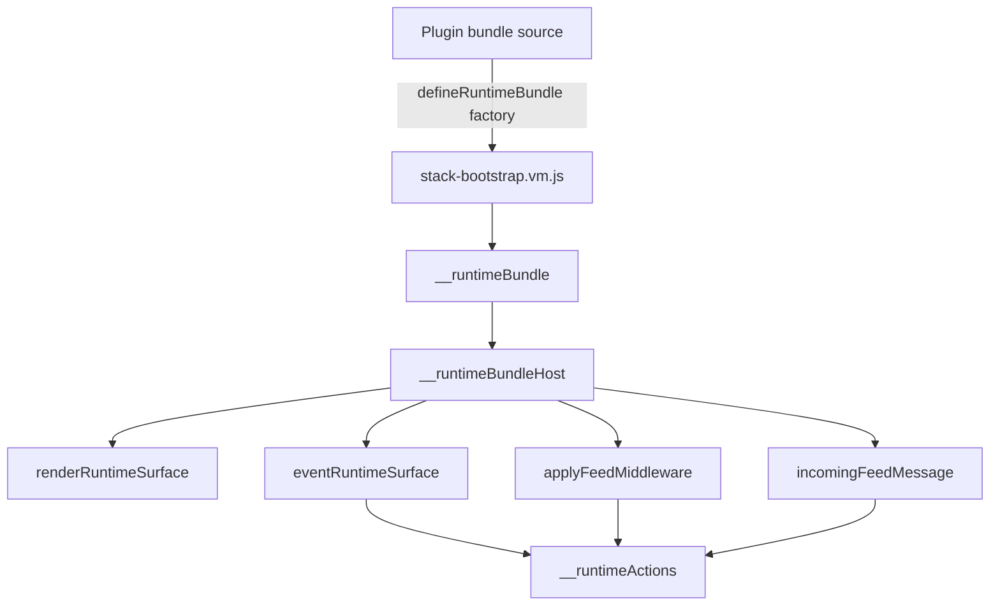
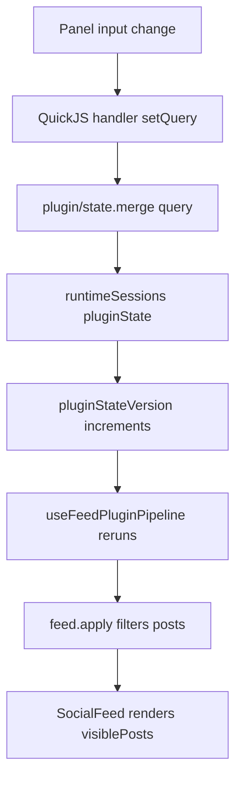

# Browser Plugin VM: Stateful Feed Middleware Runtime Deep Dive

This report explains the Browser Plugin VM project as a complete technical system. The repository builds a browser page that can load JavaScript plugins, execute each plugin inside an in-browser QuickJS VM, render plugin-produced UI through a host-owned React renderer, route plugin actions through an audited Redux action protocol, and run a greenfield social-feed demonstration where plugins maintain private state and participate in a chainable feed middleware system.

The final implementation lives in `/home/manuel/code/wesen/2026-07-07--browser-js-inject-vm`. The main docmgr ticket is `BROWSER-VM-PLUGINS`, stored under `ttmp/2026/07/07/BROWSER-VM-PLUGINS--browser-plugin-vm-select-and-run-sandboxed-js-apps/`. The work was implemented across a sequence of commits that first established the QuickJS runtime and render loop, then added a social feed demo, then replaced that demo with the stateful feed middleware experiment.

> [!summary]
> - The project implements a host-controlled browser plugin runtime. Plugins run in separate QuickJS VM sessions and communicate only through JSON values: UI trees, runtime actions, feed middleware results, and incoming-message decisions.
> - The final feed demo is greenfield. The feed reducer stores canonical posts and feed events; plugins store their own `pluginState`; active plugin hooks derive visible posts and process simulator messages.
> - The runtime now has two plugin entry-point classes. Surface entry points render plugin panels and handle UI events. Feed hook entry points run `feed.apply` and `feed.onIncomingMessage` without rendering a surface.
> - The project is verified by TypeScript, Vitest integration tests, Vite production build, and Playwright browser checks. The final test suite has 37 tests across runtime, action routing, feed helpers, manifest validation, and capability policy.

## Current status

The current project status is a working prototype. It is not a packaged plugin platform and it does not load third-party code over the network. Plugins are bundled at build time through Vite `?raw` imports. That choice keeps the runtime path concrete and inspectable while the host/runtime contract is still changing.

The implemented user-visible application has two main tabs:

| Tab | Purpose |
| --- | --- |
| `Social Feed` | Demonstrates stateful feed middleware plugins, simulator-driven incoming messages, feed event logs, and hook trace output. |
| `Plugin Catalog` | Lists all standalone apps and feed middleware plugins, grouped by category, with launch and source-view buttons. |

The final implementation commits are:

```text
2041564 Runtime: plugin-local state and feed hook entry points
96562ff Feed: greenfield stateful middleware pipeline and plugins
c7f803e UI: highlight plugin source and improve feed middleware polish
e9374d0 Docs: document stateful feed middleware demo
d9d03e6 Docs: diary stateful feed middleware implementation
```

The final verification commands were:

```bash
pnpm typecheck
pnpm test
pnpm build
```

The observed final results were:

```text
TypeScript: clean
Vitest:     6 files, 37 tests, all passing
Vite build: successful, with expected QuickJS chunk-size warning
Browser:    no console errors after reload; middleware and simulator behavior verified
```

The browser smoke test confirmed four important runtime properties:

1. Adding `Keyword Lens` and typing `quickjs` changes plugin-local state, reruns the feed middleware chain, and reduces the visible feed from all posts to one matching post.
2. Adding `Spam Guard` and clicking the simulator twice appends the first simulated message, drops the second spam-like message, and increments `Spam Guard`'s private dropped count.
3. The feed event log records `message.received`, `message.appended`, and `message.dropped` events without a false `message.modified` event for unchanged VM-cloned messages.
4. The source viewer renders plugin JavaScript with dependency-free syntax highlighting, and plugin UI badges use dark text on pale backgrounds for readability.

## Why this project exists

The project explores a constrained plugin architecture for browser applications. The constraint is the important part: plugin code should be able to compute UI and behavior, but it should not receive authority over the host page. It should not receive a DOM node, a host `window`, a Redux store reference, or arbitrary host functions. The host should decide which rendered nodes exist, which actions are accepted, and which shared domains a plugin may affect.

The first version implemented this as a render/event loop. A plugin surface defines `render({ state })` and named event handlers. The host calls `render`, validates the returned tree, and renders it. When the user clicks a rendered button or types into a rendered input, the host calls a named handler inside QuickJS. That handler does not mutate host state directly. It records JSON actions. The host validates and routes those actions.

The later feed middleware work tests a more flexible pattern. Plugins need private state that is not part of the base application domain. A search plugin should own its query. A mute plugin should own its muted authors. A spam plugin should own its phrase list and counters. The canonical feed should remain the source of posts and events, while active plugins derive the visible feed. This separation makes plugin removal simple: remove the plugin session, and its derived effect disappears without editing canonical feed state.

The resulting system is small enough to study directly. It provides a concrete browser implementation of a data-only sandbox protocol:

```text
host state -> JSON input -> QuickJS plugin -> JSON output -> host validation -> React/Redux update
```

Every arrow in that sequence matters. The host never passes a live object reference into the plugin. The plugin never receives a callback that mutates the host. The plugin returns data, and the host decides what that data means.

## Repository shape

The repository is organized around five boundaries: runtime, host, feed domain, plugin bundles, and UI renderer.

```text
/home/manuel/code/wesen/2026-07-07--browser-js-inject-vm
├── src/
│   ├── runtime/
│   │   ├── plugin-runtime/                 # QuickJS contracts, bootstrap, service, validation
│   │   ├── runtime-session-manager/        # host-facing session handle abstraction
│   │   ├── runtime-packages/               # VM-installed packages such as ui
│   │   ├── runtime-packs/                  # host render/validation packs
│   │   └── features/runtimeSessions/       # Redux runtime state, timeline, capability handling
│   ├── host/
│   │   ├── usePluginRuntime.ts             # React FRP loop for renderable surfaces
│   │   ├── PluginPanelHost.tsx             # sidebar host for one plugin panel
│   │   ├── PluginSurfaceHost.tsx           # full-page host for catalog-launched plugins
│   │   ├── pluginIntentRouting.ts          # action audit/routing/capability gate
│   │   └── store.ts                        # Redux composition root
│   ├── features/feed/
│   │   ├── feedSlice.ts                    # canonical posts/events only
│   │   ├── feedPluginPipeline.ts           # pure hook result normalization helpers
│   │   └── useFeedPluginPipeline.ts        # React hook that runs active plugin middleware
│   ├── components/
│   │   ├── SocialFeed.tsx                  # feed UI, simulator, incoming hook chain
│   │   ├── PluginCatalog.tsx               # grouped plugin catalog
│   │   ├── SourceViewer.tsx                # syntax-highlighted source modal
│   │   └── TimelineDebug.tsx               # runtime action audit panel
│   ├── plugins/
│   │   ├── manifest.ts                     # raw bundle imports and plugin metadata
│   │   ├── feed-keyword-lens.vm.js
│   │   ├── feed-favourite-sorter.vm.js
│   │   ├── feed-author-mute.vm.js
│   │   ├── feed-spam-guard.vm.js
│   │   ├── feed-topic-tagger.vm.js
│   │   └── feed-freshness-window.vm.js
│   └── ui/
│       ├── UIRuntimeRenderer.tsx           # host React renderer for data-only UI trees
│       └── uiCardV1Pack.tsx                # pack registration and validation
├── README.md
├── package.json
└── ttmp/2026/07/07/BROWSER-VM-PLUGINS--...
```

The runtime code was originally vendored from `go-go-os-frontend/packages/os-scripting` and `os-ui-cards`, then adapted inside this repository. The project deliberately keeps that vendored code local because the goal is to build a self-contained browser experiment rather than depend on a desktop shell package. The upstream provenance is recorded in `src/runtime/VENDORED.md`.

## The core runtime contract

The central runtime contract is defined in `src/runtime/plugin-runtime/contracts.ts`. The final version recognizes six runtime action kinds:

```ts
export type RuntimeActionKind = 'draft' | 'filters' | 'plugin' | 'domain' | 'system' | 'unknown';
```

The first two kinds come from the initial render/event system. `draft.*` applies to a single surface. `filters.*` applies to a session. The new `plugin/*` kind is the first-class private plugin-state path. Domain actions such as `inventory/reserve-item` still exist, and system commands such as `notify.show` still exist, but feed middleware no longer depends on mutating the feed reducer through `feed/*` domain actions.

The final action-classification rule is intentionally simple:

```ts
if (actionType.startsWith('draft.')) return 'draft';
if (actionType.startsWith('filters.')) return 'filters';
if (actionType.startsWith('plugin/')) return 'plugin';
if (SYSTEM_ACTION_TYPES.has(actionType)) return 'system';
if (actionType.indexOf('/') > 0) return 'domain';
return 'unknown';
```

The order is significant. `plugin/state.merge` starts with `plugin/`, so it must be recognized before the generic domain rule that treats strings with slashes as domain actions. Without this explicit case, plugin-local state updates would be misclassified as domain actions for a domain named `plugin`.

The feed hook contracts were added beside the existing runtime contracts. The essential types are:

```ts
export interface FeedMiddlewareInput {
  posts: FeedPost[];
  allPosts: FeedPost[];
  pluginState: unknown;
  context: FeedHookContext;
}

export interface FeedMiddlewareResult {
  posts?: FeedPost[];
  hiddenPostIds?: string[];
  annotations?: Record<string, Record<string, unknown>>;
  statePatch?: Record<string, unknown>;
  actions?: RuntimeAction[];
  debug?: Record<string, unknown>;
}

export interface IncomingFeedMessageInput {
  message: IncomingFeedMessage;
  allPosts: FeedPost[];
  pluginState: unknown;
  context: FeedHookContext;
}

export interface IncomingFeedMessageResult {
  message?: IncomingFeedMessage;
  drop?: boolean;
  reason?: string;
  statePatch?: Record<string, unknown>;
  actions?: RuntimeAction[];
  debug?: Record<string, unknown>;
}
```

The design uses separate result types because feed projection and incoming-message processing have different outputs. A feed middleware hook receives an array of posts and returns a derived array, optional hidden IDs, and optional annotations. An incoming-message hook receives one message and returns either a possibly modified message or a drop decision.

The `statePatch` field is common to both. It gives a hook a data-only way to update plugin-local state. The host converts that patch into a runtime action:

```ts
{ type: 'plugin/state.merge', payload: statePatch }
```

That conversion matters because it routes hook state changes through the same audit timeline and reducer logic as UI handler changes.

## The QuickJS boundary

The VM-side bootstrap lives in `src/runtime/plugin-runtime/stack-bootstrap.vm.js`. This file is the JavaScript kernel installed into every QuickJS context before a plugin bundle runs. It defines the global functions that plugin bundles call and the host methods that TypeScript invokes through `context.evalCode`.

A plugin bundle registers itself with `defineRuntimeBundle(factory)`. The factory receives package APIs such as `ui` and returns a bundle object. The bootstrap stores that object in `__runtimeBundle`. The host later asks for metadata or invokes entry points through `globalThis.__runtimeBundleHost`.

The original host methods were:

```js
getMeta()
renderRuntimeSurface(surfaceId, state)
eventRuntimeSurface(surfaceId, handlerName, args, state)
defineRuntimeSurface(...)
defineRuntimeSurfaceRender(...)
defineRuntimeSurfaceHandler(...)
```

The final implementation adds:

```js
applyFeedMiddleware(input)
incomingFeedMessage(input)
```

The bootstrap also adds `dispatchPluginAction` to handler and hook contexts. A plugin author writes this:

```js
dispatchPluginAction('state.merge', { query: 'quickjs' });
```

The bootstrap records this action:

```js
{
  type: 'plugin/state.merge',
  payload: { query: 'quickjs' }
}
```

The host does not expose a mutable state object to the plugin. The plugin can read `pluginState` in its current input and request a state update by returning `statePatch` or dispatching a plugin action. The host reducer decides whether the update applies and whether the version changes.

The hook entry points follow the same pattern as surface event handlers. The bootstrap resets `__runtimeActions`, calls the plugin hook with JSON inputs and dispatch recorders, then returns a plain object containing the hook result plus recorded actions. The host validates the result before using it.



The important invariant is that all return values are JSON-serializable. The host receives data, not references.

## The TypeScript runtime service

The host-side QuickJS service lives in `src/runtime/plugin-runtime/runtimeService.ts`. It owns QuickJS session creation, runtime package installation, plugin source evaluation, metadata validation, and entry-point invocation.

The load path is:

```text
create QuickJS session
install bootstrap source
install requested runtime packages
run plugin bundle source
read metadata through __runtimeBundleHost.getMeta()
validate metadata
store RuntimeBundleMeta by sessionId
```

The existing render path calls:

```ts
globalThis.__runtimeBundleHost.renderRuntimeSurface(surfaceId, state)
```

The existing event path calls:

```ts
globalThis.__runtimeBundleHost.eventRuntimeSurface(surfaceId, handler, args, state)
```

The new feed hook paths call:

```ts
globalThis.__runtimeBundleHost.applyFeedMiddleware(input)
globalThis.__runtimeBundleHost.incomingFeedMessage(input)
```

Both hook methods use `eventTimeoutMs` in the first implementation. This is an intentional short-term choice. Hooks are event-like synchronous computations: they inspect current input and return data. They should not run long computations, schedule asynchronous work, or wait on external resources. A future implementation could introduce `hookTimeoutMs`, but the current runtime already has deadline enforcement for event-like VM calls.

The service validates hook output before returning it to the React layer. Validation rejects invalid shapes such as a non-array `posts`, invalid `FeedPost` objects, non-object `statePatch`, non-object `debug`, or invalid runtime actions. This is not a static type check. It runs at the host boundary where untrusted or buggy plugin code returns values.

The validation logic is important because QuickJS `context.dump` converts VM values into native JavaScript values. Once a value crosses that boundary, the host must treat it as untrusted data. A TypeScript interface does not validate runtime values. The service's validators provide that runtime check.

## Runtime session state and the action timeline

Redux runtime session state lives in `src/runtime/features/runtimeSessions/runtimeSessionsSlice.ts`. The runtime session record now includes:

```ts
export interface RuntimeSessionRecord {
  bundleId: string;
  status: RuntimeSessionStatus;
  error: string | null;
  sessionState: Record<string, unknown>;
  surfaceState: Record<string, Record<string, unknown>>;
  pluginState: Record<string, unknown>;
  pluginStateVersion: number;
  capabilities: CapabilityPolicy;
}
```

The new `pluginState` is private by ownership but host-stored by representation. Only the owning session's actions can update it. Storing it in Redux gives the host three capabilities that VM-closure-only state would not provide:

1. React can select plugin state and rerun the feed middleware chain when it changes.
2. The runtime timeline can record plugin-local state updates with the same mechanism used for other actions.
3. Tests can inspect and assert plugin state without reaching into QuickJS internals.

The reducer applies four plugin-state operations:

| Action | Effect |
| --- | --- |
| `plugin/state.merge` | Shallow-merge an object into `pluginState`. |
| `plugin/state.replace` | Replace `pluginState` with a new object, or `{}` for invalid non-object payloads. |
| `plugin/state.set` | Set a dot-path value inside `pluginState`. |
| `plugin/invalidate` | Mark the plugin state as changed without changing fields. |

The reducer increments `pluginStateVersion` only when the operation changes state, except for `plugin/invalidate`, which always requests a version bump. This version field is the dependency used by the feed middleware runner. It prevents a common infinite loop: a hook returns the same `statePatch` every time it runs, the reducer sees no real change, and therefore the version does not change.

The action timeline remains central. Every runtime action is ingested before it is applied or ignored. Timeline entries contain:

```ts
export interface RuntimeTimelineEntry {
  id: string;
  timestamp: string;
  sessionId: string;
  surfaceId: string;
  kind: RuntimeActionKind;
  actionType: string;
  payload?: unknown;
  outcome: DispatchOutcome;
  reason: string | null;
}
```

For hook-generated actions, the host uses a synthetic `surfaceId` of `feed-hook`. This keeps hook activity visible without requiring hooks to pretend they are UI surfaces.

## Host rendering and the FRP loop

Renderable plugin panels still use the original FRP loop in `src/host/usePluginRuntime.ts`. This hook owns one plugin session from React's point of view. It registers the session in Redux, ensures the QuickJS VM exists, seeds initial state, builds the VM-facing state object, renders the current surface, and routes UI events.

The VM-facing state now includes `plugin`:

```ts
{
  self: { bundleId, sessionId, surfaceId, windowId },
  nav: { current, param, depth, canBack },
  ui: { focusedWindowId, runtimeStatus },
  filters: sessionState,
  draft: surfaceState,
  plugin: pluginState,
  ...projectedDomains,
}
```

The `plugin` property is what panel render functions use to show and edit plugin-local state. For example, `Keyword Lens` renders its query input from `state.plugin.query`; when the input changes, the handler dispatches `plugin/state.merge`; the reducer updates `pluginState`; the panel rerenders with the new query; the feed middleware runner also reruns because the plugin state version changed.

The existing `draft` and `filters` properties remain because standalone Counter and Inventory examples still demonstrate the original surface-local and session-local state paths. They are no longer the primary feed plugin state API.

The current loop can be written as pseudocode:

```ts
function usePluginRuntime(plugin, sessionId, surfaceId) {
  registerSessionIfMissing();
  ensureQuickJSSession();
  seedInitialPluginStateAndSurfaceState();

  const projectedState = {
    self,
    nav,
    ui,
    filters,
    draft,
    plugin,
    projectedDomains,
  };

  const tree = handle.renderSurface(surfaceId, projectedState);

  function emitRuntimeEvent(handler, args) {
    const actions = handle.eventSurface(surfaceId, handler, args, projectedState);
    for (const action of actions) {
      dispatchRuntimeAction(action, context);
    }
  }

  return { tree, emitRuntimeEvent, status };
}
```

This is still the user-interface path. Feed hooks are separate runtime entry points, but they share the same session state and action routing.

## The canonical feed reducer

The final feed reducer is intentionally narrow. It lives in `src/features/feed/feedSlice.ts`, and it owns only canonical feed data:

```ts
export interface FeedState {
  posts: FeedPost[];
  events: FeedEvent[];
  nextSimulatedId: number;
}
```

It no longer stores `search`, `favourites`, or `flagged` fields. Those concepts now belong to plugins. This removal is the key greenfield change. It makes the feed reducer responsible for facts, not for the behavior of whichever plugin happens to be active.

The reducer supports:

| Reducer | Purpose |
| --- | --- |
| `appendFeedPost` | Add a canonical post and record a `message.appended` event. |
| `recordFeedEvent` | Add an arbitrary feed event such as `message.received` or `message.dropped`. |
| `bumpSimulatorCounter` | Advance deterministic simulator sequence. |
| `resetFeed` | Restore seed posts and record a `feed.reset` event. |

The seed posts include tags such as `vm`, `quickjs`, `security`, and `plugin`. These tags give `Topic Tagger` and `Keyword Lens` useful initial data before simulator messages arrive.

The reducer does not know which posts are visible. Visibility is a derived value from the middleware chain.

## Feed middleware as a derived computation

The pure helper layer lives in `src/features/feed/feedPluginPipeline.ts`. It defines runtime-independent operations for normalizing hook results, merging annotations, building hook contexts, applying incoming-message results, and converting incoming messages into canonical posts.

A feed middleware step receives:

```ts
plugin: { id, sessionId }
inputPosts: FeedPost[]
result: FeedMiddlewareResult
durationMs: number
```

It returns:

```ts
{
  posts: FeedPost[];
  annotations: Record<string, Record<string, unknown>>;
  trace: FeedPipelineTraceEntry;
  effects: HookEffect[];
}
```

A `HookEffect` is a plugin action that should be routed through the runtime action path:

```ts
export interface HookEffect {
  sessionId: string;
  pluginId: string;
  action: RuntimeAction;
}
```

The helper layer translates hook output into effects. For example, if a middleware hook returns:

```js
{
  posts: nextPosts,
  statePatch: { matchCount: nextPosts.length },
  debug: { query }
}
```

then `applyFeedMiddlewareResult` emits an effect:

```ts
{
  sessionId,
  pluginId,
  action: { type: 'plugin/state.merge', payload: { matchCount: nextPosts.length } }
}
```

The React hook runner later dispatches that effect through `dispatchRuntimeAction`. That keeps the plugin-state update visible in the runtime timeline.

The annotations map is keyed by post ID. Each plugin may add fields to the same post's annotation object. The merge rule is shallow:

```ts
target[postId] = { ...(target[postId] ?? {}), ...annotation };
```

This is sufficient for the current demo. `Favourite Sorter` can add `{ favourite: true }`, `Keyword Lens` can add `{ keywordMatch: true }`, and `Topic Tagger` can add `{ tags: [...] }`. If two plugins write the same annotation key, the later plugin wins because sidebar order is middleware order.

## The React feed pipeline runner

The runtime-aware feed hook runner lives in `src/features/feed/useFeedPluginPipeline.ts`. It bridges canonical posts, active plugin sessions, plugin state selectors, QuickJS hook calls, and React rendering.

The runner observes:

- the active plugin list,
- canonical `posts`,
- each active plugin's `pluginState`,
- each active plugin's `pluginStateVersion`,
- each active plugin's runtime readiness status.

When any of these inputs changes, it runs active feed middleware hooks in order:

```ts
let current = posts;
const annotations = {};
const trace = [];
const effects = [];

for (const plugin of active) {
  const handle = DEFAULT_RUNTIME_SESSION_MANAGER.getSession(plugin.sessionId);
  const meta = handle?.getBundleMeta();
  if (!handle || meta?.hooks?.feedMiddleware !== true) continue;

  const result = handle.applyFeedMiddleware({
    posts: current,
    allPosts: posts,
    pluginState: pluginStates[plugin.sessionId] ?? {},
    context: buildFeedHookContext(plugin, posts, 'feed-changed'),
  });

  const step = applyFeedMiddlewareResult(plugin, current, result, durationMs);
  current = step.posts;
  mergeAnnotations(annotations, step.annotations);
  trace.push(step.trace);
  effects.push(...step.effects);
}

dispatchHookEffects(effects);
setOutput({ visiblePosts: current, annotations, trace, errors });
```

The final `visiblePosts` are local React state, not Redux state. This is a deliberate representation choice. The canonical Redux feed does not store derived views. Derived output belongs to the component that needs it, and it can be recomputed from canonical posts plus active plugin sessions.

The first browser verification found an update loop in this hook path. `SocialFeed` originally created `activeSessions` as a new array on every render. Because `useFeedPluginPipeline` used that array in an effect dependency, the effect reran after every `setOutput`, causing repeated React maximum-update-depth errors. The fix was to memoize `activeSessions`:

```ts
const activeSessions = useMemo(
  () => active.map((entry) => ({ id: entry.id, sessionId: entry.sessionId })),
  [active],
);
```

This bug is instructive because it shows that hook pipelines require stable dependencies. TypeScript and unit tests did not catch it. Browser verification did.

## Incoming-message processing

`SocialFeed.tsx` also owns the simulator and incoming-message hook chain. The simulator cycles through a deterministic list of messages. Each click constructs an `IncomingFeedMessage` with an ID like `sim-1`, records `message.received`, and passes the message through active plugins that implement `feed.onIncomingMessage`.

The incoming chain runs in the same active sidebar order as the visibility chain:

```ts
let message = simulatedMessage;

for (const plugin of activeSessions) {
  const handle = DEFAULT_RUNTIME_SESSION_MANAGER.getSession(plugin.sessionId);
  const meta = handle?.getBundleMeta();
  if (!handle || meta?.hooks?.incomingFeedMessage !== true) continue;

  const result = handle.incomingFeedMessage({
    message,
    allPosts: store.getState().feed.posts,
    pluginState: selectRuntimePluginState(store.getState(), plugin.sessionId),
    context: buildFeedHookContext(plugin, store.getState().feed.posts, 'incoming-message'),
  });

  const step = applyIncomingMessageResult(plugin, message, result, durationMs);
  dispatchHookEffects(step.effects);

  if (step.dropped) {
    recordFeedEvent({ type: 'message.dropped', reason: step.reason, ... });
    bumpSimulatorCounter();
    return;
  }

  if (messagesDiffer(step.message, message)) {
    recordFeedEvent({ type: 'message.modified', ... });
  }

  message = step.message;
}

appendFeedPost({ post: incomingMessageToPost(message), source: 'simulator' });
bumpSimulatorCounter();
```

The `messagesDiffer` check exists because VM-returned messages are cloned values. A plugin that returns `{ message }` may produce a structurally identical object that is not the same JavaScript object reference. The first implementation compared by reference and recorded a false `message.modified` event. The final implementation compares serialized message content:

```ts
function messagesDiffer(left: IncomingFeedMessage, right: IncomingFeedMessage): boolean {
  return JSON.stringify(left) !== JSON.stringify(right);
}
```

This is adequate for small simulator messages. A larger system should use an explicit stable comparator over known fields.

## The final feed plugin set

The final feed plugin set is intentionally varied. Each plugin demonstrates a different part of the stateful middleware API.

| Plugin | File | Demonstrated behavior |
| --- | --- | --- |
| Keyword Lens | `src/plugins/feed-keyword-lens.vm.js` | Plugin-owned query, `feed.apply` filtering, `statePatch` match count, keyword annotations. |
| Favourite Sorter | `src/plugins/feed-favourite-sorter.vm.js` | Plugin-owned favourite authors, post sorting, favourite annotations. |
| Author Mute | `src/plugins/feed-author-mute.vm.js` | Plugin-owned muted authors, hidden post IDs, manual state changes from panel buttons. |
| Spam Guard | `src/plugins/feed-spam-guard.vm.js` | Incoming-message drop decisions, dropped count, last dropped message state. |
| Topic Tagger | `src/plugins/feed-topic-tagger.vm.js` | Incoming-message modification, tag counting, topic filtering. |
| Freshness Window | `src/plugins/feed-freshness-window.vm.js` | Time-window filtering using hook context `now`. |

### Keyword Lens

`Keyword Lens` is the simplest feed middleware example. Its state is:

```js
initialPluginState: { query: '', matchCount: 0 }
```

Its panel renders an input from `state.plugin.query`. Its input handler dispatches:

```js
dispatchPluginAction('state.merge', { query: String(args.value || '') });
```

Its feed middleware hook filters posts by author or text:

```js
apply({ posts, pluginState }) {
  const query = String(pluginState.query || '').trim().toLowerCase();
  const next = query
    ? posts.filter((post) =>
        post.author.toLowerCase().includes(query) ||
        post.text.toLowerCase().includes(query))
    : posts;
  return {
    posts: next,
    annotations,
    statePatch: { matchCount: next.length },
    debug: { query },
  };
}
```

This plugin demonstrates the full loop in a small form:



### Spam Guard

`Spam Guard` is the clearest incoming-message example. Its initial state contains phrases and counters:

```js
initialPluginState: {
  phrases: ['buy crypto', 'free money', '!!!'],
  droppedCount: 0,
  lastDropped: ''
}
```

Its `onIncomingMessage` hook checks the incoming message text:

```js
onIncomingMessage({ message, pluginState }) {
  const text = String(message.text || '').toLowerCase();
  const phrases = Array.isArray(pluginState.phrases) ? pluginState.phrases : [];
  const hit = phrases.find((phrase) => text.includes(String(phrase).toLowerCase()));
  if (!hit) return { message };
  return {
    drop: true,
    reason: 'Spam Guard matched phrase: ' + hit,
    statePatch: {
      droppedCount: Number(pluginState.droppedCount || 0) + 1,
      lastDropped: message.author + ': ' + message.text,
    },
  };
}
```

When the simulator emits `buy crypto now!!! free money for plugin authors`, `Spam Guard` returns `drop: true`. The host records `message.dropped`, does not append a canonical post, applies the plugin state patch through `plugin/state.merge`, and increments the simulator counter.

This plugin demonstrates that incoming-message hooks are not post-hoc filters. They run before canonical append.

### Topic Tagger

`Topic Tagger` modifies messages by adding tags. It also demonstrates that incoming-message hooks and feed middleware hooks can cooperate through plugin state.

The incoming hook adds tags based on text content and patches counts:

```js
onIncomingMessage({ message, pluginState }) {
  const tags = [];
  if (text.includes('quickjs') || text.includes('vm')) tags.push('vm');
  if (text.includes('react') || text.includes('frontend')) tags.push('frontend');
  if (text.includes('dom') || text.includes('capability')) tags.push('security');
  if (text.includes('crypto') || text.includes('free money')) tags.push('spam');

  const nextTags = Array.from(new Set([...(message.tags || []), ...tags]));
  const counts = { ...(pluginState.counts || {}) };
  nextTags.forEach((tag) => { counts[tag] = Number(counts[tag] || 0) + 1; });

  return { message: { ...message, tags: nextTags }, statePatch: { counts } };
}
```

The feed middleware hook then filters by selected topic and adds tag annotations. The panel lets the user choose `all`, `vm`, `frontend`, `security`, or `spam`.

### Freshness Window

`Freshness Window` demonstrates hook context usage. It reads `context.now`, compares it with post timestamps, and filters posts outside a selected time window. The plugin state is just:

```js
{ minutes: 240 }
```

This plugin is useful because it does not depend on text content or authors. It shows that hooks can compute derived views from time and canonical post metadata.

## Source viewer and code readability

The source viewer lives in `src/components/SourceViewer.tsx`. It is used by both the catalog and running feed panels. Its purpose is not only debugging. It is part of the safety and teaching story: the user can inspect the exact `.vm.js` source string that the host evaluates inside QuickJS.

The final implementation includes a dependency-free JavaScript tokenizer. It renders React text and spans; it does not inject highlighted HTML. The tokenizer recognizes:

- comments,
- strings,
- template strings,
- numbers,
- JavaScript keywords,
- literals,
- selected builtins and runtime identifiers,
- punctuation.

The token CSS lives in `src/index.css`:

```css
.source-viewer-code .tok-comment { color: #64748b; font-style: italic; }
.source-viewer-code .tok-keyword { color: #93c5fd; font-weight: 700; }
.source-viewer-code .tok-string { color: #86efac; }
.source-viewer-code .tok-number { color: #fbbf24; }
.source-viewer-code .tok-literal { color: #fca5a5; }
.source-viewer-code .tok-builtin { color: #c4b5fd; }
.source-viewer-code .tok-punct { color: #94a3b8; }
```

This is a readability feature, not a parser. It is sufficient for small demo bundles and avoids adding a large syntax-highlighting dependency.

A separate browser-polish fix changed `ui.badge` rendering in `src/ui/UIRuntimeRenderer.tsx`. The badge background is pale blue. The first version inherited the page's light text color, which was low contrast. The final badge style explicitly sets:

```ts
color: '#0f172a',
fontWeight: 600,
```

Playwright verified the computed style:

```text
color:      rgb(15, 23, 42)
background: rgb(208, 231, 255)
fontWeight: 600
```

## Capability model and authority boundaries

The manifest in `src/plugins/manifest.ts` still carries least-privilege capability grants:

```ts
capabilities: { domain: ['feed'], system: [] }
```

For the final feed middleware experiment, these grants are conservative. Feed middleware hooks do not mutate the feed reducer through `feed/*` domain actions. They receive projected feed state because they are granted the `feed` domain, and they derive output through hook returns. They may still emit runtime actions, and those actions pass through the existing router.

The authority model has four layers:

1. **QuickJS isolation.** Plugin code runs inside a QuickJS VM session with memory and deadline controls.
2. **Data-only boundary.** Plugin inputs and outputs cross as JSON-like values, not live host references.
3. **Host validation.** Runtime metadata, UI trees, action arrays, feed middleware results, and incoming-message results are validated before use.
4. **Action routing.** Runtime actions are classified, audited, capability-checked where relevant, and applied by reducers or host callbacks.

The source viewer adds an inspection layer, but it is not the security boundary. The actual boundary is the QuickJS runtime plus the host's refusal to expose mutable host objects.

## Tests and verification

The final test suite has 37 tests across six files. The tests cover:

| Test file | Coverage |
| --- | --- |
| `runtimeService.integration.test.ts` | Loading bundles, rendering surfaces, event actions, deadlines, plugin-local state metadata, feed middleware hooks, incoming-message hooks. |
| `pluginState.test.ts` | `plugin/*` action classification, plugin state merge/set/replace, version behavior. |
| `capabilityPolicy.test.ts` | Domain and system allow/deny behavior. |
| `pluginIntentRouting.test.ts` | Runtime action routing and capability gating. |
| `feedSlice.test.ts` | Canonical feed reducer, event log, simulator counter, feed pipeline helper normalization. |
| `manifest.test.ts` | Manifest completeness, uniqueness, no wildcard capabilities, feed hook bundle checks. |

The runtime integration tests are especially important because they exercise real QuickJS evaluation. One test loads a synthetic feed-hook bundle with `initialPluginState`, `feed.apply`, and `feed.onIncomingMessage`. It then calls `service.applyFeedMiddleware` and `service.incomingFeedMessage` directly and verifies returned posts, state patches, debug output, modified messages, and drops.

The browser tests were manual Playwright checks rather than committed E2E tests. They found two issues that unit tests did not catch:

1. **Maximum update depth loop.** The cause was an unstable `activeSessions` array used as a dependency by `useFeedPluginPipeline`. The fix was `useMemo`.
2. **False message modification.** The cause was reference comparison of VM-cloned objects. The fix was semantic comparison using `JSON.stringify` for small message values.

These failures are worth preserving because they identify the risk class for future changes: React hook dependencies and VM boundary cloning.

## How to read the implementation

A new contributor should read the implementation in this order.

1. `src/plugins/feed-keyword-lens.vm.js` shows the simplest end-to-end plugin state and feed middleware loop.
2. `src/runtime/plugin-runtime/contracts.ts` defines the runtime action classes and hook input/output contracts.
3. `src/runtime/plugin-runtime/stack-bootstrap.vm.js` shows how plugin code is registered and how `dispatchPluginAction`, `feed.apply`, and `feed.onIncomingMessage` are invoked inside QuickJS.
4. `src/runtime/plugin-runtime/runtimeService.ts` shows how TypeScript calls QuickJS and validates hook output.
5. `src/runtime/features/runtimeSessions/runtimeSessionsSlice.ts` shows how plugin-local state is applied and how the action timeline records outcomes.
6. `src/host/usePluginRuntime.ts` shows the render/event surface loop and how `state.plugin` is projected into panels.
7. `src/features/feed/feedSlice.ts` shows the canonical feed reducer.
8. `src/features/feed/feedPluginPipeline.ts` shows pure hook-result normalization.
9. `src/features/feed/useFeedPluginPipeline.ts` shows the React runtime hook runner.
10. `src/components/SocialFeed.tsx` connects the canonical feed, active plugin panels, simulator, incoming hook chain, pipeline output, event log, and trace UI.
11. `src/components/SourceViewer.tsx` shows source inspection and syntax highlighting.
12. `src/plugins/manifest.ts` shows the complete plugin catalog.

This order starts with a concrete plugin and then moves inward toward runtime mechanics. Reading from the runtime first is also possible, but it is easier to understand `dispatchPluginAction` after seeing why a plugin uses it.

## Detailed execution trace: typing into Keyword Lens

This trace describes what happens when the user adds `Keyword Lens` and types `quickjs`.

```text
1. SocialFeed renders the Keyword Lens panel through PluginPanelHost.
2. PluginPanelHost calls usePluginRuntime for the plugin session.
3. usePluginRuntime ensures a QuickJS session and seeds initialPluginState.
4. usePluginRuntime projects state.plugin into render state.
5. QuickJS render returns a ui.panel tree containing an input.
6. UIRuntimeRenderer renders the input as a host-controlled React input.
7. The user types quickjs.
8. UIRuntimeRenderer emits handler setQuery with { value: 'quickjs' }.
9. usePluginRuntime calls eventRuntimeSurface inside QuickJS.
10. The plugin handler calls dispatchPluginAction('state.merge', { query: 'quickjs' }).
11. The bootstrap returns [{ type: 'plugin/state.merge', payload: { query: 'quickjs' } }].
12. dispatchRuntimeAction records and routes the action.
13. runtimeSessionsSlice merges query into pluginState and increments pluginStateVersion.
14. useFeedPluginPipeline observes pluginStateVersion change and reruns active feed.apply hooks.
15. Keyword Lens receives canonical posts and pluginState.query.
16. Keyword Lens returns filtered posts, match count statePatch, annotations, and debug data.
17. The host applies the statePatch through plugin/state.merge.
18. SocialFeed renders the returned visiblePosts and the panel renders matchCount.
```

The same action path drives UI state and feed-derived output. There is no special host reducer for `query`.

## Detailed execution trace: simulator message dropped by Spam Guard

This trace describes what happens when `Spam Guard` is active and the simulator emits a spam-like message.

```text
1. User clicks Simulate incoming message.
2. SocialFeed selects the next deterministic simulator template.
3. SocialFeed constructs IncomingFeedMessage { id: 'sim-2', author: 'mallory', text: 'buy crypto...', source: 'simulator' }.
4. SocialFeed records message.received.
5. SocialFeed iterates active plugins in sidebar order.
6. Spam Guard has incomingFeedMessage hook metadata, so SocialFeed calls handle.incomingFeedMessage.
7. QuickJS invokes feed.onIncomingMessage with message, allPosts, pluginState, and context.
8. Spam Guard matches phrase 'buy crypto'.
9. Spam Guard returns { drop: true, reason, statePatch }.
10. SocialFeed converts statePatch into plugin/state.merge and dispatches it through the runtime action path.
11. SocialFeed records message.dropped with pluginSessionId and reason.
12. SocialFeed does not append the message to canonical feed.posts.
13. SocialFeed increments nextSimulatedId.
14. The Spam Guard panel rerenders with droppedCount and lastDropped.
```

This trace shows the difference between incoming-message hooks and feed middleware hooks. A feed middleware hook can hide an already canonical post. An incoming-message hook can prevent a simulator message from becoming canonical.

## Design decisions and consequences

### Plugin state is host-stored

The implementation could have stored plugin state inside QuickJS closure variables. That would satisfy a narrow interpretation of "plugins maintain their own state," but it would make reruns and debugging difficult. The host would not know whether plugin state changed, React would not have a selector dependency, and tests would have to call into the VM to inspect state.

The implemented state is private by ownership and host-stored by representation. A plugin owns the meaning of its state fields. The host stores the value, versions it, and provides it as `pluginState` on each render or hook call.

This decision enables deterministic reruns. It also makes the timeline meaningful: `plugin/state.merge` is visible in the same audit system as other runtime actions.

### The feed reducer stores facts, not derived visibility

The feed reducer stores posts and feed events. It does not store search query, muted authors, favourites, topic choice, dropped count, match count, or visible posts. Those values are either plugin state or derived output.

This decision makes plugin removal well-defined. If `Author Mute` is removed, muted authors disappear because the plugin session disappears. The canonical posts remain unchanged. If `Keyword Lens` is removed, the query no longer filters the feed because there is no active hook returning a filtered post list.

### Hook results are normalized before use

The host does not trust hook output. It validates and normalizes hook results at the runtime service boundary and again uses helper functions before rendering. Invalid posts are filtered out by `normalizeFeedPosts`. Invalid hook result shapes throw runtime errors and appear in the pipeline trace.

This decision keeps the host stable when plugin code is wrong. The host can show an error for one plugin without treating returned data as already safe.

### Sidebar order defines middleware order

The active plugin list is stored in React state in the order plugins were added. The middleware runner uses that order. This makes the visible order in the UI match execution order.

This decision is simple and testable. It does mean plugin interactions are order-dependent. If `Topic Tagger` filters by topic before another plugin adds tags, the result can differ from the opposite order. The current UI does not support drag-to-reorder, so the next useful feature is explicit reordering.

### Source highlighting is dependency-free

The source viewer uses a local tokenizer rather than Shiki, highlight.js, or CodeMirror. This keeps the bundle and dependency surface small. It also means highlighting is approximate.

This decision is appropriate for a teaching/prototype source viewer. If the source viewer becomes an editor or a core reading surface for large plugins, a real parser/highlighter and line numbers would be justified.

## Failure modes found during implementation

### React effect dependency loop

The symptom was repeated browser console errors:

```text
Maximum update depth exceeded. This can happen when a component calls setState inside useEffect...
```

The cause was unstable identity. `SocialFeed` constructed `activeSessions` as a new array every render and passed it to `useFeedPluginPipeline`. The pipeline hook used `active` in the effect dependency array. Each `setOutput` triggered a render, which created a new `activeSessions`, which retriggered the effect, which called `setOutput` again.

The fix was to memoize the derived array:

```ts
const activeSessions = useMemo(
  () => active.map((entry) => ({ id: entry.id, sessionId: entry.sessionId })),
  [active],
);
```

The general rule is precise: derived arrays or objects used by hook dependencies must have stable identity across renders unless their contents changed.

### VM clone identity and false modification events

The symptom was an event log that included `message.modified` even when `Spam Guard` returned the original message unchanged.

The cause was boundary cloning. QuickJS returned a dumped native object. It had the same fields as the input message but a different object identity. The code compared `step.message !== message`, so every returned message looked modified.

The fix was semantic comparison:

```ts
function messagesDiffer(left: IncomingFeedMessage, right: IncomingFeedMessage): boolean {
  return JSON.stringify(left) !== JSON.stringify(right);
}
```

The rule is: values crossing the VM boundary should be compared by content, not by object identity.

### Programmatic DOM events did not trigger the React input path

During Playwright verification, directly setting `input.value` and dispatching native `input`/`change` events did not update the plugin state. Real keyboard typing through Playwright did.

This does not indicate an application bug. It indicates that verification should use user-level interactions for controlled React inputs. The confirmed browser path was:

```text
click input
press Control/Meta+A
type quickjs sequentially
observe visible count and plugin match count
```

## Open questions and next steps

The system is now a good prototype. The next changes should make composition and debugging stronger rather than adding many more plugin examples.

### Add plugin reorder UI

Sidebar order is middleware order, but the user cannot change order after adding plugins. Reordering is the next natural UI improvement. It should update the `active` array in `SocialFeed`, which will rerun the pipeline.

### Add automated browser tests

The most important behavior is browser-level behavior. A committed Playwright or Testing Library test should cover:

1. Add `Keyword Lens`.
2. Type `quickjs`.
3. Assert one visible post.
4. Add `Spam Guard`.
5. Click simulator twice.
6. Assert one appended message and one dropped event.

This would preserve the failure modes found manually.

### Add source viewer line numbers and copy button

Syntax highlighting improved readability. The next source-viewer features should be line numbers, a copy button, and optional line wrapping. These are local UI changes that do not affect runtime semantics.

### Add hook execution limits to the trace

The runtime enforces deadlines, but the UI trace only shows duration after success or error. It should also show timeout classification and perhaps the hook timeout budget. This would help explain failures when plugin code loops.

### Consider `visiblePostIds` as a stricter hook output

The current `FeedMiddlewareResult` allows returning full `FeedPost[]`. That is flexible, but it gives plugins a way to construct modified post objects in `feed.apply`. The host normalizes returned posts, but a stricter design could require:

```ts
{ visiblePostIds: string[], annotations?: Record<string, ...> }
```

That would make `feed.apply` a projection over canonical post IDs rather than a post replacement mechanism. It is less flexible but easier to reason about.

## Related project documents

The docmgr ticket contains the implementation record and design docs:

```text
/home/manuel/code/wesen/2026-07-07--browser-js-inject-vm/ttmp/2026/07/07/BROWSER-VM-PLUGINS--browser-plugin-vm-select-and-run-sandboxed-js-apps/
```

Important files:

| Document | Purpose |
| --- | --- |
| `design-doc/01-browser-plugin-vm-system-analysis-design-implementation-guide.md` | Original intern-ready design/implementation guide for the browser QuickJS plugin VM. |
| `design-doc/02-stateful-feed-middleware-plugin-api-analysis-design-implementation-guide.md` | Design guide for plugin-local state, feed middleware hooks, incoming-message hooks, and simulator. |
| `reference/01-investigation-diary.md` | Chronological implementation diary, including Steps 12–14 for the final stateful middleware implementation. |
| `sources/stateful-feed-middleware-demo.png` | Screenshot captured after browser verification. |

The report in this vault is a durable project analysis. The docmgr design docs are more detailed implementation guides. The diary is the operational record of what changed, what failed, and how it was verified.

Related vault note:

- [[ARTICLE - Browser Sandboxed Plugin Runtime - Data-Only Extension Pattern]] extracts the reusable data-only sandboxed plugin architecture from this project.

## Key points

- The runtime boundary is data-only. Plugins return UI trees, runtime actions, feed middleware results, and incoming-message decisions. The host validates and interprets those values.
- Plugin-local state is private by ownership and host-stored by representation. This enables React reruns, timeline audit, and tests.
- The feed reducer stores canonical facts. Active plugin hooks derive the visible feed and process simulator messages.
- The hook system is additive to renderable surfaces. Plugins still render panels; they also define non-render feed hooks.
- Browser verification found real issues that unit tests did not catch. Future work should include automated browser tests for the feed middleware path.
- The current implementation is a prototype with a clear next direction: reorderable middleware, better trace output, and stronger hook-output constraints if needed.
