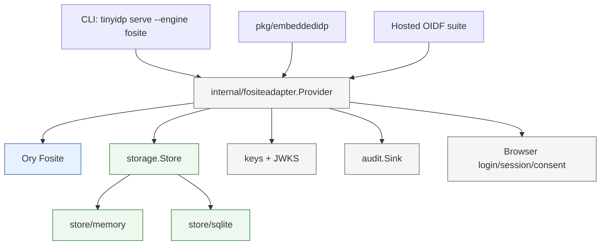
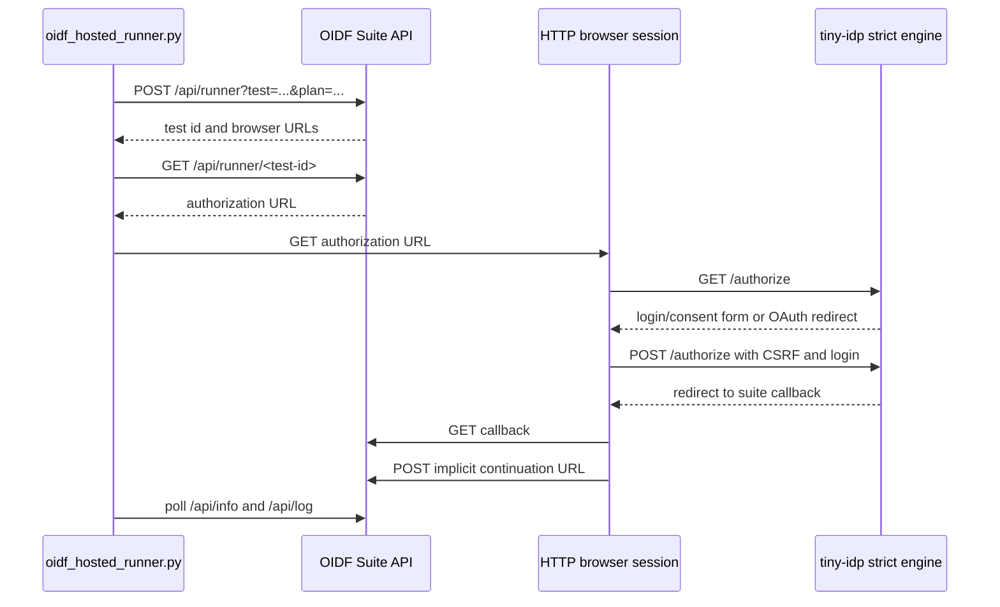

# tiny-idp: Strict Fosite Provider and Hosted OIDF Conformance

This is the protocol and conformance foundation in the [[tiny-idp]] project map.

This report explains the production reorganization of `tiny-idp` as a complete technical system. The work changed `tiny-idp` from a single local mock OpenID Connect provider into a dual-engine project: the existing mock engine remains available for relying-party failure testing, while a new strict engine uses Ory Fosite, durable protocol storage, server-side browser sessions, persistent consent, key rotation, audit hooks, and hosted OpenID Foundation Basic OP conformance validation.

The repository is `/home/manuel/workspaces/2026-07-07/prod-tiny-idp/tiny-idp`. The main docmgr ticket is `TINYIDP-PROD-001`, stored under `ttmp/2026/07/07/TINYIDP-PROD-001--production-embeddable-idp-reorganization/`. The final hosted conformance summary is `reference/03-hosted-oidf-basic-op-conformance-summary.md` in that ticket workspace.

> [!summary]
> - The project now has two explicit engines: `mock` for local testing and failure simulation, and `fosite` for strict production-like OIDC/OAuth behavior.
> - The strict engine delegates protocol mechanics to Ory Fosite while keeping product policy in `tiny-idp`: login, users, consent, sessions, audit, key management, storage, and embedding APIs.
> - The hosted OpenID Foundation Basic OP run completed on plan `Geeb9MBn659ah` with no hard failures: `PASSED=21`, `WARNING=6`, `SKIPPED=4`, `REVIEW=4`.
> - The most important technical corrections came from conformance feedback: ID Token claim scoping, CSP form behavior, `prompt=none`, `max_age`, unsupported request objects, distinct clients for refresh-token binding, and API-driven hosted-suite automation.

## Current status

The project is in a strong production-candidate state for an embeddable Authorization Code + PKCE OpenID Provider profile. It is not yet a complete general-purpose OpenID Provider. It intentionally does not implement dynamic client registration, implicit flow, hybrid flow, arbitrary `request_uri` fetching, multi-node deployment semantics, or a full account-management product.

The implemented strict profile covers:

| Area | Status |
| --- | --- |
| Authorization Code flow | Implemented through Ory Fosite. |
| PKCE | Enforced for public clients and production mode; dev mode supports hosted static-client Basic OP testing. |
| Discovery and JWKS | Implemented by strict metadata and persistent key store. |
| ID Token signing | RS256 with explicit `kid`; tests verify signature against JWKS. |
| Browser login sessions | Server-side opaque session cookie, hashed server-side handle, prompt/max-age behavior. |
| Consent | Policy interface plus durable stored consent. |
| Fosite protocol storage | Memory and SQLite-backed stores; SQLite protocol state survives provider restart. |
| Refresh token rotation | Fosite rotation and reuse rejection coverage; hosted cross-client refresh-token test passed with distinct clients. |
| Audit | Interface-based sink and stable reason-code normalization. |
| Rate limiting | Hook-based interface and fixed-window implementation. |
| Key rotation | Active key rotation with retired verification keys retained. |
| CLI engine selection | `tinyidp serve --engine mock|fosite`, with `mock` as default. |
| Hosted conformance | Fresh Basic OP plan completed with no hard failures. |

The final important commits are:

```text
5650e28 Docs: record hosted OIDF Basic OP results
7418380 Add strict CLI extra clients for conformance
735b5ac Diary: record prompt edge fix commit
4a01794 Fix strict OIDC prompt and request object edges
da72eff Support OIDF API bearer tokens
d1ce6d8 Automate hosted OIDF conformance runner
8005ed3 Complete strict IdP hardening loop
7167fd4 Persist strict IdP consent grants
958232d Add strict IdP sessions and rate limiting hooks
60a94df Harden strict IdP browser and audit paths
949ec1d Persist Fosite protocol state in SQLite
572901a Use Ory Fosite for strict IdP adapter
1a796cf Add strict embedded IdP engine scaffold
05b7189 Add production IdP domain and stores
```

The final validation commands were:

```bash
go test ./...
scripts/run-conformance.sh
docmgr doctor --ticket TINYIDP-PROD-001 --stale-after 30
```

The final hosted Basic OP plan was:

```text
Suite:      https://www.certification.openid.net
Plan ID:    Geeb9MBn659ah
Alias:      tinyidp-basic-20260708b
Variant:    server_metadata=discovery, client_registration=static_client
Clients:    web-app / dev-secret, web-app-2 / dev-secret-2
Result:     PASSED=21, WARNING=6, SKIPPED=4, REVIEW=4, FAILED=0
```

`REVIEW` here is a terminal hosted-suite outcome after screenshot upload for browser-visible behavior. It is not an interrupted test. The suite required screenshots for `prompt=login`, `max_age=1`, invalid redirect URI handling, and invalid request-object redirect URI handling.

## Why this project exists

`tiny-idp` started as a local development Identity Provider. That original purpose remains valid. A relying party needs an easy local OIDC provider that can produce normal tokens, expired tokens, malformed signatures, wrong audiences, device-flow responses, and other synthetic conditions. Those behaviors are useful because relying-party code needs to exercise error paths that are difficult to trigger against a production authorization server.

The problem is that a mock provider and a production embeddable provider have different correctness criteria. A mock benefits from intentionally broken behavior. A production provider must reject unsafe configuration, avoid debug routes, persist signing keys, store protocol state durably, protect browser interactions, rotate refresh tokens, and expose only capabilities that it actually supports. Trying to harden the mock in place would remove useful testing behavior while still leaving production behavior mixed with test-only branches.

The production reorganization therefore made one structural decision before making implementation changes: keep the mock engine and introduce a separate strict engine.

```text
tinyidp serve --engine mock      -> local fixture server and failure simulation
tinyidp serve --engine fosite    -> strict production-like protocol engine
pkg/embeddedidp                  -> Go embedding API for strict provider use
```

This is the main architectural point. The strict engine is not a mode flag that disables a few routes. It has its own provider implementation under `internal/fositeadapter`, its own storage contracts under `internal/storage`, and its own production-shaped behaviors for sessions, consent, audit, keys, and Fosite protocol storage.

## Repository shape after the reorganization

The repository now has a clear separation between domain contracts, storage, strict protocol integration, CLI wiring, and documentation.

```text
/home/manuel/workspaces/2026-07-07/prod-tiny-idp/tiny-idp
├── internal/
│   ├── domain/                 # clients, users, sessions, consents, keys, validation helpers
│   ├── storage/                # store interfaces and reusable test suite
│   ├── store/
│   │   ├── memory/             # in-memory implementation for tests/dev
│   │   └── sqlite/             # durable SQLite implementation and migrations
│   ├── fositeadapter/          # strict Ory Fosite-backed provider
│   ├── keys/                   # RSA generation and rotation helpers
│   ├── audit/                  # structured audit event sink interface
│   ├── oidcmeta/               # strict discovery metadata generation
│   ├── cmds/                   # CLI serve command and engine selection
│   └── server/                 # original mock engine
├── pkg/
│   └── embeddedidp/            # public embeddable provider API
├── docs/
│   ├── conformance.md
│   ├── key-rotation.md
│   ├── security-profile.md
│   └── storage.md
├── scripts/
│   ├── run-conformance.sh
│   └── oidf_hosted_runner.py
└── ttmp/2026/07/07/TINYIDP-PROD-001--production-embeddable-idp-reorganization/
```

The mock engine remains under `internal/server`. The strict engine is under `internal/fositeadapter`. Shared clients, users, keys, sessions, and consent records live in the domain/storage layers rather than in either engine. That separation matters because it lets the project keep local fixture behavior while moving production protocol state to stable interfaces.

## Architecture

The strict engine has four layers. Each layer has a different reason to exist.



Fosite owns protocol mechanics: authorization request parsing, grant handling, token exchange, OIDC session validation, refresh-token rotation, and OAuth error formatting. `tiny-idp` owns product decisions: which users exist, how login happens, how consent is recorded, how browser sessions are stored, how audit events are emitted, how signing keys are rotated, and which storage backend persists protocol state.

This boundary is the reason the strict provider can stay small while still handling hosted-suite edge cases. When a request is a normal Authorization Code request, Fosite parses and validates it. When the request is a product decision such as whether the current browser session can satisfy `prompt=none`, the adapter makes that decision before calling into Fosite response writing.

## The strict authorization path

The authorization endpoint is where the product/protocol boundary is most visible. The GET path performs four decisions in order:

1. Reject unsupported request objects safely before Fosite tries to parse them.
2. Ask Fosite to parse and validate the authorization request.
3. Reuse an existing browser session only when prompt and max-age rules allow it.
4. Render the login/consent form or write an OAuth authorization error.

The relevant shape in `internal/fositeadapter/provider.go` is:

```go
func (p *Provider) authorize(w http.ResponseWriter, r *http.Request) {
    switch r.Method {
    case http.MethodGet:
        if p.rejectUnsupportedRequestObject(w, r) {
            return
        }
        ar, err := p.oauth2.NewAuthorizeRequest(fosite.NewContext(), r)
        if err != nil {
            if ar != nil && ar.GetRequestForm().Get("max_age") != "" &&
               !promptHas(ar.GetRequestForm().Get("prompt"), "none") {
                p.renderInteraction(w, ar, true, true)
                return
            }
            p.oauth2.WriteAuthorizeError(r.Context(), w, ar, err)
            return
        }

        u, sess, hasSession := p.readBrowserSession(r)
        if hasSession && !promptHas(ar.GetRequestForm().Get("prompt"), "login") &&
           sessionSatisfiesMaxAge(sess.AuthTime, ar.GetRequestForm().Get("max_age")) {
            p.finishAuthorize(w, r, ar, u, sess.AuthTime, false)
            return
        }

        if promptHas(ar.GetRequestForm().Get("prompt"), "none") {
            p.oauth2.WriteAuthorizeError(r.Context(), w, ar, fosite.ErrLoginRequired)
            return
        }
        p.renderInteraction(w, ar, true, true)
    }
}
```

This ordering came from hosted conformance feedback. If `prompt=none` arrives without a usable browser session, the OP must not show a login page. It must return `login_required`. If `max_age=1` arrives after the existing authentication is too old, the OP must show a login page because the request is interactive. If `prompt=login` arrives, the OP must ask the user to authenticate again even when a browser session exists.

Those cases are not only UI behavior. They affect ID Token validation because Fosite checks the session's `AuthTime` and `RequestedAt` claims for prompt and max-age semantics.

The session helper is deliberately small:

```go
func sessionSatisfiesMaxAge(authTime time.Time, maxAgeValue string) bool {
    if maxAgeValue == "" {
        return true
    }
    maxAge, err := strconv.ParseInt(maxAgeValue, 10, 64)
    if err != nil || maxAge <= 0 {
        return true
    }
    return !authTime.Add(time.Duration(maxAge) * time.Second).Before(time.Now().UTC())
}
```

The strict engine does not try to interpret every OpenID parameter in product code. It only decides whether the existing browser session is eligible for reuse. Fosite still performs the standards validation for the resulting authorization and token requests.

## OIDC session claims and the `RequestedAt` detail

One hosted-suite failure came from `prompt=none` with an existing session. The server had a valid browser session, but the OIDC session handed to Fosite did not set `RequestedAt` in the cases where Fosite validates prompt/max-age timing. The resulting error was precise: `auth_time` happened after the authorization request, and Fosite rejected the silent flow.

The fix is not to disable Fosite validation. The fix is to set the values Fosite requires when prompt/max-age semantics are active:

```go
claims := &fositejwt.IDTokenClaims{
    Issuer:   p.issuer.String(),
    Subject:  u.Sub,
    Audience: []string{ar.GetClient().GetID()},
    Nonce:    ar.GetRequestForm().Get("nonce"),
    IssuedAt: now,
    AuthTime: authTime.UTC(),
    Extra:    map[string]interface{}{},
}

prompt := ar.GetRequestForm().Get("prompt")
if promptHas(prompt, "none") || promptHas(prompt, "login") ||
   ar.GetRequestForm().Get("max_age") != "" {
    claims.RequestedAt = now
}
```

The same session constructor also fixed two earlier hosted-suite issues. First, it grants claims according to the actual granted scopes rather than always including profile and email claims. Second, it sets the active signing key ID into the JWT header so relying parties can select the correct JWKS entry:

```go
for k, v := range domain.ClaimsForScopes(u, []string(ar.GetGrantedScopes())) {
    if k != "sub" {
        claims.Extra[k] = v
    }
}
headers := fositejwt.NewHeaders()
if key, err := p.store.ActiveSigningKey(ctx); err == nil && key.ID != "" {
    headers.Add("kid", key.ID)
}
```

These details are typical of a strict OIDC implementation. The high-level protocol path can be correct while hosted conformance still fails on claim-level and header-level behavior. The final test suite verifies ID Token signatures against JWKS and checks `kid`, `alg`, issuer, audience, nonce, and expiry.

## Server-side browser sessions

The strict engine stores browser sessions server-side. The cookie contains only an opaque random handle. The store receives a keyed hash of that handle, not the raw cookie value.

```go
func (p *Provider) createBrowserSession(w http.ResponseWriter, r *http.Request, u domain.User, authTime time.Time) error {
    handle := randomB64(32)
    hash := domain.HashSecret(p.csrfKey, handle)
    now := time.Now().UTC()
    err := p.store.CreateSession(r.Context(), domain.Session{
        IDHash:     hash,
        UserID:     u.ID,
        AuthTime:   authTime,
        CreatedAt:  now,
        LastSeenAt: now,
        ExpiresAt:  now.Add(p.sessionTTL),
    })
    if err != nil {
        return err
    }
    http.SetCookie(w, &http.Cookie{
        Name:     sessionCookieName,
        Value:    handle,
        Path:     p.cookiePath(),
        HttpOnly: true,
        Secure:   p.cookieSecure,
        SameSite: http.SameSiteLaxMode,
        MaxAge:   int(p.sessionTTL.Seconds()),
    })
    return nil
}
```

This design gives the store enough information to validate and revoke sessions while keeping the browser cookie independent from the stored primary key. A database leak does not reveal live browser cookie values. A stolen cookie is still sensitive, so production mode must use `Secure` cookies and HTTPS, but the storage format avoids storing bearer session handles directly.

The conformance-relevant session behaviors are:

| Request | Existing session? | Strict behavior |
| --- | --- | --- |
| normal authorization | yes | Reuse session if consent allows. |
| `prompt=none` | no | Return `login_required`. |
| `prompt=none` | yes | Issue code silently if consent allows. |
| `prompt=login` | yes | Render login page and require re-authentication. |
| `max_age=1` after delay | yes | Render login page because old auth time no longer satisfies request. |
| `max_age=10000` | yes | Reuse session. |

Hosted Basic OP checks every one of these paths.

## Consent, scopes, and UserInfo

Consent is a policy boundary, not a hardcoded behavior. The strict provider has a `ConsentPolicy` interface and two important defaults: development can skip consent, while production uses stored consent. The stored-consent path persists the normalized scope set by user and client.

The important distinction is between requested scopes and granted scopes. Fosite exposes both. The strict provider grants only scopes that are allowed by the client, and ID Token/UserInfo claims must be derived from granted scopes. The hosted suite found the earlier bug where ID Tokens included `name` even when the request did not grant `profile`. The fix was to build claims from `ar.GetGrantedScopes()`.

The scope model is intentionally conservative. Optional scopes such as `address` and `phone` were not advertised in discovery, so the hosted suite skipped those modules. Profile and email produced warnings because the user fixture does not populate every optional standard claim. Those warnings are useful evidence: they show that strict scope filtering works, and they show where richer fixture claims would reduce hosted-suite warnings.

## Fosite protocol storage and SQLite durability

The strict provider uses Fosite for protocol state, but the storage implementation belongs to `tiny-idp`. The project added a memory store and a SQLite store that implement both product storage and Fosite protocol storage.

The durable Fosite store persists authorization-code sessions, access-token sessions, refresh-token sessions, PKCE data, and OIDC sessions. The schema is owned by the SQLite store migration, not by adapter startup code:

```text
internal/store/sqlite/migrations/001_schema.sql
internal/fositeadapter/sqlstore.go
internal/fositeadapter/sqlstore_test.go
```

The persistence tests cover two production-critical invariants:

1. Authorization-code state survives provider restart when backed by SQLite.
2. Refresh-token reuse is rejected after rotation.

The second invariant matters because a refresh token is long-lived relative to an authorization code. If a consumed refresh token is accepted again, the server cannot distinguish normal client behavior from token replay. Fosite handles the rotation mechanics, and the store must preserve enough state to make reuse detection durable.

## Signing keys and JWKS

The original mock engine generated a signing key at process startup and exposed synthetic bad-key behavior for RP testing. The strict engine uses a persistent signing-key model. A key can be active for signing and retained for verification after retirement.

The rotation helper follows this rule:

```text
create new key -> make new key active -> retain old key as verification key
```

That order prevents a window where existing ID Tokens cannot be verified through JWKS. The project added `keys.RotateRSA` and tests verifying that old tokens remain verifiable after rotation. The hosted suite also required explicit JWT `kid` headers; Fosite does not infer the key ID from the private key automatically, so the adapter adds it to the OIDC session headers.

The resulting key behavior is:

| Operation | Required result |
| --- | --- |
| Issue a new ID Token | Sign with active key and include `kid`. |
| Publish JWKS | Include active key and retained verification keys. |
| Rotate signing key | New tokens use new key; older tokens still verify. |
| Retire old key | Keep it until all tokens signed by it have expired plus clock skew. |

## Hardening the browser path

The strict browser path includes several security controls that the mock engine does not need:

- CSRF token and CSRF cookie for login/consent POSTs.
- `Cache-Control: no-store` on protocol responses.
- `Content-Security-Policy` with form submission support for hosted conformance callback flows.
- `X-Content-Type-Options: nosniff` and `Referrer-Policy: no-referrer`.
- Server-side browser sessions with `HttpOnly`, `SameSite=Lax`, and production `Secure` cookies.
- Rate-limiting hook on login and token paths.
- Structured audit sink with normalized reason codes.

The CSP change is a good example of conformance feedback producing a narrow fix. The login form originally had no explicit `action`, and the CSP used `form-action 'self'`. The hosted suite exposed a failure when browser form submission was blocked. The strict provider now renders an explicit `/authorize` action and allows HTTPS form actions where required for the suite flow:

```go
fmt.Fprintf(w,
    `<html><body><form method="post" action="%s">...`,
    htmlEscape(p.issuer.Endpoint("/authorize")),
)
```

The security decision is not to weaken all browser policy. The decision is to make the form action explicit and allow the OIDC browser redirect flow that the hosted suite actually drives.

## Unsupported request objects

The Basic OP suite contains tests for unsigned request objects. The strict engine does not advertise request-object support. The correct behavior is therefore to reject request objects with `request_not_supported`, but the exact response location depends on redirect URI validity.

The final helper implements that distinction:

```go
func (p *Provider) rejectUnsupportedRequestObject(w http.ResponseWriter, r *http.Request) bool {
    requestObject := r.URL.Query().Get("request")
    if requestObject == "" {
        return false
    }
    claims := requestObjectClaims(requestObject)
    clientID := firstNonEmpty(r.URL.Query().Get("client_id"), stringClaim(claims, "client_id"))
    queryRedirectURI := r.URL.Query().Get("redirect_uri")

    if queryRedirectURI != "" && !p.clientAllowsRedirect(r.Context(), clientID, queryRedirectURI) {
        http.Error(w, "invalid redirect_uri", http.StatusBadRequest)
        return true
    }

    redirectURI := firstNonEmpty(queryRedirectURI, stringClaim(claims, "redirect_uri"))
    if clientID == "" || redirectURI == "" || !p.clientAllowsRedirect(r.Context(), clientID, redirectURI) {
        w.WriteHeader(http.StatusBadRequest)
        w.Write([]byte(`{"error":"request_not_supported"...}`))
        return true
    }

    loc, _ := url.Parse(redirectURI)
    q := loc.Query()
    q.Set("error", "request_not_supported")
    if state := stringClaim(claims, "state"); state != "" {
        q.Set("state", state)
    }
    loc.RawQuery = q.Encode()
    http.Redirect(w, r, loc.String(), http.StatusFound)
    return true
}
```

The hosted suite checks two different properties here. If the outer redirect URI is valid, the OP may redirect back with an OAuth error. If the outer redirect URI is invalid, the OP must not redirect to a default or payload-provided redirect URI. It must show an error page locally. The helper follows that rule before handing normal authorization requests to Fosite.

## Hosted OIDF automation

The hosted OpenID Foundation suite has two interfaces: a JSON API for plans, runners, info, logs, and images; and browser-visible authorization URLs that must be visited to continue each test. The automation script is therefore hybrid.



The API calls can now use a bearer token from the suite token page:

```bash
export OIDF_API_TOKEN='<token from /tokens.html>'
scripts/oidf_hosted_runner.py --plan Geeb9MBn659ah --remaining
```

The script can also use the browser `JSESSIONID` cookie where suite callback pages still need web-session authentication. This split is important. API-token support makes the plan lifecycle cleaner, but browser callback pages are not all pure API endpoints.

The script supports:

- `--plan` to target a hosted suite plan.
- `--remaining` to run modules with no instances.
- `--only` to run one module.
- `--resume` to continue an existing instance.
- `--artifacts` to save `/api/info` and `/api/log` JSON.
- `--api-token` or `OIDF_API_TOKEN` for bearer-authenticated API calls.
- `--cookie` or `OIDF_JSESSIONID` for browser session reuse.

Raw hosted artifacts are intentionally uncommitted because logs can contain transient authorization codes, tokens, and client credentials.

## The distinct-client refresh-token issue

The original hosted plan configured `client` and `client2` as the same static client: `web-app` with `dev-secret`. That plan was good enough for most modules, but it could not validate refresh-token client binding. The suite's refresh-token module issues a refresh token to `client2` and then attempts to use it with `client1`. If both clients have the same client ID and secret, the server sees the same client both times.

The fix was to add CLI support for extra static clients and create a fresh hosted plan with distinct clients:

```bash
CB='https://www.certification.openid.net/test/a/tinyidp-basic-20260708b/callback'
tinyidp serve --engine fosite \
  --issuer 'https://2853-2600-8805-9398-8a00-a781-feaf-fcbd-986c.ngrok-free.app' \
  --addr 127.0.0.1:5556 \
  --client-id web-app \
  --client-secret dev-secret \
  --redirect-uris "$CB" \
  --redirect-uris "$CB?dummy1=lorem&dummy2=ipsum" \
  --extra-clients "web-app-2|dev-secret-2|$CB|$CB?dummy1=lorem&dummy2=ipsum"
```

The new `--extra-clients` flag uses a pipe-separated format:

```text
client-id|secret|redirect-uri[|redirect-uri...]
```

The format is intentionally shell-friendly for URLs. It avoids using colon as a separator because URLs contain colons. It also avoids JSON-in-a-flag for the initial conformance use case. The embeddable provider already supports arbitrary clients through storage; the CLI flag is a development and certification convenience.

With the distinct-client plan, the refresh-token module passed:

```text
oidcc-refresh-token: s6Wy9BgOnvhsEG5 FINISHED PASSED
```

## Final hosted Basic OP result

The final consolidated plan is `Geeb9MBn659ah`, alias `tinyidp-basic-20260708b`. It completed with no hard failures and no interrupted tests.

| Result | Count | Interpretation |
| --- | ---: | --- |
| PASSED | 21 | Module completed and passed suite assertions. |
| WARNING | 6 | Module completed with hosted-suite warnings, mostly around optional or partial claim behavior. |
| SKIPPED | 4 | Module not applicable because the OP did not advertise the optional capability. |
| REVIEW | 4 | Module completed after screenshot evidence upload. |
| FAILED | 0 | No hard failed modules in the final distinct-client plan. |
| INTERRUPTED | 0 | No modules left in interrupted state in the final distinct-client plan. |

The four `REVIEW` modules are:

| Module | Reason |
| --- | --- |
| `oidcc-prompt-login` | Screenshot confirms that `prompt=login` asks the user to authenticate again. |
| `oidcc-max-age-1` | Screenshot confirms that an expired max-age session asks the user to authenticate again. |
| `oidcc-ensure-registered-redirect-uri` | Screenshot confirms an invalid redirect URI error page. |
| `oidcc-ensure-request-object-with-redirect-uri` | Screenshot confirms invalid redirect URI handling with a request object. |

The skipped modules are expected for the current strict profile:

| Module | Reason |
| --- | --- |
| `oidcc-scope-address` | Address scope is not advertised. |
| `oidcc-scope-phone` | Phone scope is not advertised. |
| `oidcc-scope-all` | Depends on optional scopes that are not all advertised. |
| `oidcc-unsigned-request-object-supported-correctly-or-rejected-as-unsupported` | Unsigned request objects are not advertised as supported. |

The warnings are useful follow-up material rather than blockers for the implemented strict profile. They point to richer optional claims and ACR/claims behavior that could be implemented later if the project expands beyond the current Basic OP subset.

## Implementation sequence

The implementation progressed in phases that reduced risk by establishing boundaries before adding hosted conformance pressure.

1. **Domain and storage contracts.** The project added production-shaped domain records and storage interfaces before introducing Fosite. This made the strict engine depend on stable project concepts rather than Fosite-specific types everywhere.
2. **Strict engine scaffold.** `pkg/embeddedidp` and `tinyidp serve --engine fosite` created the runtime boundary while keeping mock as the default.
3. **Real Fosite adapter.** The handwritten strict spike was replaced with Ory Fosite for protocol mechanics.
4. **Durable protocol storage.** SQLite-backed Fosite storage made restart durability testable.
5. **Browser hardening.** CSRF, CSP, cache headers, audit, consent, rate limiting, and server-side sessions were added around the protocol path.
6. **Key and token hardening.** Key rotation, JWKS validation, refresh-token reuse rejection, and audit reason normalization tightened production behavior.
7. **Hosted suite automation.** Python automation turned manual hosted conformance into a repeatable API/browser workflow.
8. **Hosted feedback fixes.** Prompt, max-age, request-object, CSP, claim scoping, and distinct-client issues were corrected against actual hosted-suite behavior.
9. **Final plan evidence.** A fresh distinct-client plan completed with no hard failures, and a sanitized summary was recorded in docmgr.

This sequence matters because the conformance suite is not a substitute for architecture. The suite can tell the project when behavior is wrong, but it does not decide where product policy should live. The implementation had already separated Fosite from storage, sessions, consent, and audit, so conformance fixes could remain narrow.

## What remains open

The project is ready for more serious embedding experiments, but several areas are still intentionally unfinished.

- **Structured multi-client config.** `--extra-clients` is good enough for hosted conformance. A production CLI or config-file schema should use structured client definitions with validation errors for malformed entries.
- **Hosted artifact export.** The current repo stores a sanitized summary, not raw suite logs. A formal release may need an official hosted plan export stored outside git or in a sanitized artifact bundle.
- **Optional claims.** Profile/email warnings can be reduced by richer fixture users and more complete optional claim support.
- **Public key retention policy.** Key rotation retains verification keys; a cleanup policy should remove retired keys only after token lifetime plus clock skew.
- **Operational cleanup.** Expired authorization codes, sessions, consents, protocol rows, and retired keys need scheduled cleanup in a long-running embedded deployment.
- **Dynamic administration.** Client registration, consent revocation, and key rotation APIs are not yet public product surfaces.
- **Production deployment model.** SQLite is suitable for embedded single-process deployments. Multi-node deployments would need a different store and stronger concurrency assumptions.

## Key technical rules from the project

The most important rules are stable enough to keep beyond this implementation:

- Keep mock behavior and production behavior in separate engines. Do not make production safety depend on disabling individual mock features.
- Let Fosite own protocol mechanics. Keep product policy in the adapter and domain layers.
- Store browser sessions server-side and keep only opaque handles in cookies.
- Derive claims from granted scopes, not from requested scopes and not from a fixed claim set.
- Set explicit JWT `kid` headers when the signing library does not infer them.
- Treat hosted conformance as an executable requirements source. When a hosted failure appears, fix the smallest incorrect behavior and add local regression coverage.
- Do not commit raw hosted-suite artifacts unless they have been sanitized for transient codes, tokens, and secrets.
- Use distinct clients when testing client-bound refresh-token behavior.

## Related files

The primary files to read for the strict implementation are:

```text
/home/manuel/workspaces/2026-07-07/prod-tiny-idp/tiny-idp/internal/fositeadapter/provider.go
/home/manuel/workspaces/2026-07-07/prod-tiny-idp/tiny-idp/internal/fositeadapter/session.go
/home/manuel/workspaces/2026-07-07/prod-tiny-idp/tiny-idp/internal/fositeadapter/sqlstore.go
/home/manuel/workspaces/2026-07-07/prod-tiny-idp/tiny-idp/internal/store/sqlite/migrations/001_schema.sql
/home/manuel/workspaces/2026-07-07/prod-tiny-idp/tiny-idp/internal/cmds/serve.go
/home/manuel/workspaces/2026-07-07/prod-tiny-idp/tiny-idp/scripts/oidf_hosted_runner.py
/home/manuel/workspaces/2026-07-07/prod-tiny-idp/tiny-idp/docs/conformance.md
/home/manuel/workspaces/2026-07-07/prod-tiny-idp/tiny-idp/ttmp/2026/07/07/TINYIDP-PROD-001--production-embeddable-idp-reorganization/reference/03-hosted-oidf-basic-op-conformance-summary.md
```

The main review path should start with `internal/fositeadapter/provider.go`, then move to storage, sessions, and the hosted conformance summary. The design is easiest to understand when the reader follows one authorization request from `/authorize`, through Fosite request parsing, through login/session/consent policy, into `finishAuthorize`, and then through the token endpoint and ID Token creation.
