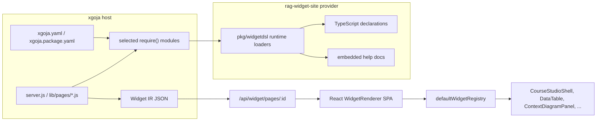

# Widget DSL v3: From Split Modules to a Real Host Migration

This is the host-migration branch of the [[widget-dsl]] project map.

This article explains the `widget.dsl` v3 project as a complete technical arc: why the old split-module DSLs were no longer sufficient, how the new v3 module was designed, how it was implemented in phases, how it was validated through golden IR, Storybook, xgoja preview hosting, and browser automation, and how the real `go-go-course` host was migrated to depend on `widget.dsl` rather than the legacy split modules.

The project was consequential because it moved the widget authoring layer from a set of domain-local component factories toward a single compositional language for server-rendered React interfaces. The final result is not merely a new module name. It is a runtime surface, a TypeScript declaration strategy, an example corpus, a preview host, a migration checker, a Storybook regression suite, and a first real application migration.

> [!summary]
> - `widget.dsl` v3 is a parallel clean-break Goja module that exposes typed namespaces (`raw`, `act`, `bind`, `ui`, `data`, `cms`, `course`, `context`, `schedule`, `time`) while the old modules remain available for existing scripts.
> - The implementation was phased from baseline inventory to runtime kernel, domain namespaces, descriptor-backed declarations, executable examples, xgoja preview hosting, browser regression fixes, Storybook coverage, migration documentation, and a real `go-go-course` host cutover.
> - The most important validation lesson was that Widget IR goldens are necessary but insufficient. The project needed browser checks, screenshots, Storybook fixtures, and real navigation/upload flows to find contract mismatches such as `onNavigate` versus `onNavigateAction`, URL interpolation failures, and raw action objects rendering as `[object Object]`.

## Why this project exists

The widget system already had a working architecture before v3. JavaScript scripts ran inside goja/xgoja, called DSL helpers such as `ui.panel(...)` or `course.courseStudioShell(...)`, returned Widget IR JSON from `/api/widget/pages/:id`, and a React `WidgetRenderer` rendered that IR through a registry of component adapters. The architecture was sound: page authors could build server-driven UI without writing React for every page, and applications such as `go-go-course` could serve rich course, transcript, context-window, and admin pages from JavaScript.

The problem was not that the old system failed to render. The problem was that the authoring layer had grown by accretion. It exposed multiple modules with overlapping responsibilities:

| Legacy module | Original responsibility | Pressure that accumulated |
|---|---|---|
| `ui.dsl` | generic page/layout primitives | generic helpers were scattered across domain modules as features arrived in domain tickets |
| `data.dsl` | old data-table helpers | too low-level for new typed collection/editing workflows |
| `data.v2.dsl` | typed fluent data builders | useful, but separate from the rest of the authoring grammar |
| `context_window.dsl` | context diagrams, transcript widgets, upload widgets | contained both domain-specific context concepts and generic file/upload primitives |
| `course.dsl` | course shell, slides, handouts | contained useful domain widgets but also generic article renderers |
| `cms.dsl` | media and article management | contained CMS widgets and generic visual primitives such as tags, meters, search, pagination, and empty states |

This split made current pages work, but it made new pages harder to write. Authors had to know which module happened to own a helper. Domain modules exposed component names more than intent-level concepts. Data, action, binding, slot, and domain-view shapes were not unified. TypeScript declarations, runtime exports, examples, and documentation could drift independently.

The v3 project began after several adjacent investigations had already established the need for a cleaner authoring grammar. The prior `Widget DSL Grammar` article described the transition from component factories toward intent-level data and UI grammar. The v3 project took the next step: implement a parallel module that could consolidate those lessons without breaking old pages.

## The system before v3

The relevant runtime path is short and precise. An xgoja host selects provider modules in an `xgoja.yaml` or `xgoja.package.yaml` file. JavaScript source files call `require(...)` to load those modules. The `rag-widget-site` provider exposes widget DSL modules, and those modules are implemented in Go under `pkg/widgetdsl`. The JavaScript returns Widget IR objects. The browser fetches those objects and renders them with the React package under `packages/rag-evaluation-site`.



The old modules were installed by `pkg/widgetdsl/module.go`. Helper maps associated helper names with component types. For example, `ui.panel(...)` lowered to a `Panel` component node, `contextWindow.contextDiagramPanel(...)` lowered to `ContextDiagramPanel`, and `courseDsl.courseStudioShell(...)` lowered to `CourseStudioShell`. The old module system also included action helpers (`navigate`, `server`, `download`, `event`, `copy`) and some domain-specific recipes.

The implementation was useful because it was explicit. The limitation was that it was mostly explicit at the wrong level. A page author could say "render this component", but the system could not reliably infer higher-level intent such as "this is a selectable collection", "this is a course handout browser", or "this URL template depends on `document.id`" unless a helper or recipe encoded that exact composition.

## The design rule: parallel clean break, not in-place mutation

The most important design decision was to add `widget.dsl` as a parallel module rather than mutate the old module APIs. This avoided two common failure modes in DSL migrations.

First, existing scripts remained stable. `go-go-course` and other first-party code could keep importing `ui.dsl`, `data.v2.dsl`, `context_window.dsl`, `course.dsl`, and `cms.dsl` while the new module was developed. The project did not need a large synchronized application migration before the new runtime could be tested.

Second, v3 could use clean names and patterns. It did not need to preserve every old option-bag shape or helper name. It could introduce builder callbacks, fragments, accessors, slots, domain intents, and namespace grouping without making every old call site fit the new model immediately.

The intended module shape was:

```js
const widget = require("widget.dsl")

const page = widget.page("Course handouts", (p) =>
  p.section("Handouts", (s) =>
    s.view(
      widget.course.handouts({ documents, selectedDocumentId }, (h) =>
        h.onSelect(widget.act.navigate("?item=${document.id}"))
      )
    )
  )
)
```

This form has three properties that the old split modules did not consistently provide:

1. The import boundary is one module. Domain concepts are namespaces, not separate runtime modules.
2. The public API is intent-oriented. `widget.course.handouts(...)` represents a course handout view; it may lower through `HandoutDocumentShell` today, but the component name is no longer the whole authoring contract.
3. Actions, bindings, and URL templates share one vocabulary. `document.id` is an action-context path, not an object that should be stringified into `[object Object]`.

## Phase structure

The implementation was tracked in:

- `ttmp/2026/07/06/RAGEVAL-SCHEDULE-WIDGETS--calendar-scheduling-widgets-on-generic-base-engines/design-doc/05-widget-dsl-v3-implementation-phases-and-task-tracker.md`
- `ttmp/2026/07/06/RAGEVAL-SCHEDULE-WIDGETS--calendar-scheduling-widgets-on-generic-base-engines/reference/01-implementation-diary.md`

The tracker split the work into eleven phases. That structure mattered because each phase produced a stable validation point and a coherent commit boundary.

| Phase | Purpose | Main result |
|---|---|---|
| 0 | Baseline inventory | Export inventory and tracker established the old surface before changing it. |
| 1 | Module skeleton | `widget.dsl` became a parallel provider module with `raw` escape hatches. |
| 2 | Core spec kernel | Page specs, section specs, nodes, fragments, slots, accessors, selections, list items, actions. |
| 3 | UI namespace | Generic page composition, UI helpers, section metrics/actions/metadata. |
| 4 | Data namespace | Data fields, schemas, collections, matrices, cells, v2 lowering reuse. |
| 5 | CMS namespace | Media library, article queue, markdown editor, CMS intents. |
| 6 | Course namespace | Course shell, landing, slide deck, handouts, metadata, agenda/material helpers, intents. |
| 7 | Context namespace | Style sets, palettes, diagrams, transcript workspace, context intents. |
| 8 | Schedule/time namespaces | Availability polls, booking picker, month/week calendar helpers, time intents. |
| 9 | Descriptor-backed declarations/docs | Namespace descriptors, declaration tests, generated-style API reference. |
| 10 | Runnable examples/goldens/preview | Executable v3 example corpus, golden snapshots, CLI renderer, xgoja preview host. |
| 11 | Integration/cutover guidance | Migration guide, parser-backed checker, real `go-go-course` migration. |

This project is easiest to understand as a sequence of increasing proof. The first phases proved that the runtime could expose the API. The middle phases proved that domain concepts could lower to existing Widget IR. The later phases proved that the API could be documented, executed repeatedly, rendered in a browser, tested through Storybook, and used by a real host.

## The core runtime: page, section, node, action, binding

The v3 runtime lives primarily in `pkg/widgetdsl/v3.go`. The first kernel defined page and section specs, then converted them to Widget IR. The shape is intentionally simple: authoring code constructs specs; specs validate; valid specs lower to `text`, `element`, and `component` nodes.

The central page pattern is:

```js
widget.page("Simple table", (p) =>
  p.section("Sessions", (s) =>
    s.caption("A data.collection table emitted by widget.dsl v3.")
     .view(table)
  )
)
```

At runtime, the page builder collects sections. A section builder collects caption, anchor, tone, metrics, actions, and child nodes. Children are normalized through shared node-export functions so that strings, fragments, component nodes, arrays, and typed specs can all be accepted where renderable content is expected.

The action and binding layer is just as important as the visual layer. Actions are serializable objects:

```js
widget.act.navigate("/pages/${item.id}")
widget.act.server("admin-delete-course-material", { confirm: "Delete ${row.file}?" })
widget.act.download("/api/handouts/${document.id}/download.md")
```

Bindings and accessors let the DSL express paths without prematurely evaluating them:

```js
widget.bind.context("document.id")
widget.bind.field("status")
```

That distinction became important during browser validation. If an accessor object is concatenated into a URL at Goja runtime, the result is `?item=[object Object]`. If it is lowered as a frontend interpolation template, the result is `?item=${item.id}`, and the browser action dispatcher can resolve it against the click context.

## The data namespace: reuse the v2 contract, hide the split module

Phase 4 reused the existing `data.v2.dsl` internals rather than rewriting collection lowering. That was the correct implementation choice because `data.v2.dsl` had already established a useful schema/collection model, and the React `DataTable`, `FormPanel`, and field components already understood the lowered IR.

The v3 API wraps the model under `widget.data`:

```js
const schema = widget.data
  .fields("sessions", (f) =>
    f
      .key("id", { label: "ID" })
      .primary("title", { label: "Title" })
      .count("turns", { label: "Turns" })
      .status("status", { label: "Status" })
  )
  .build()

const table = widget.data
  .collection("sessions", rows, (c) => c.schema(schema).table())
  .toNode()
```

The implementation bridges to `pkg/widgetdsl/v2/spec.CollectionSpec`. That gives v3 immediate access to validation and lowering behavior that was already tested. The important architectural move is not the data structure itself; it is that the v2 data grammar becomes part of one v3 module. A new host no longer has to select `data.v2.dsl` separately to get typed collections.

The `go-go-course` migration later proved why this mattered. The real host had many old `dataV2.collection(...).schema(...).edit(...).masterDetail().toIR()` calls. The v3 module could support those calls through a small adapter because its data namespace already reused the same underlying collection semantics.

## Domain namespaces: public intent over current components

The domain phases established the public vocabulary for CMS, course, context, schedule, and time.

The design rule was consistent: the public v3 name should describe author intent; the current React component is a lowering detail. That does not mean the component disappears. It means the public API is not merely a one-to-one alias for a component type.

For example:

| v3 namespace call | Current lowering target | Public concept |
|---|---|---|
| `widget.cms.mediaLibrary(...)` | `MediaLibraryPanel` | browse/select/upload media assets |
| `widget.cms.articleQueue(...)` | article queue panel composition | review content workflow |
| `widget.course.shell(...)` | `CourseStudioShell` | course workspace shell with navigation |
| `widget.course.slideDeck(...)` | `CourseSlidePanel` / slide shell compositions | slide deck presentation view |
| `widget.course.handouts(...)` | `HandoutDocumentShell` | handout bundle browser |
| `widget.context.diagram(...)` | `ContextDiagramPanel` / diagram widgets | context-window visualization |
| `widget.context.workspace(...)` | `TranscriptWorkspacePanel` | transcript plus annotations/workspace |
| `widget.schedule.availabilityPoll(...)` | `MatrixGrid` | respondent-by-option availability matrix |
| `widget.time.week(...)` | `TimeGrid` | calendar week event layout |

This separation matters because frontend components are allowed to evolve. The public DSL should not force every consumer script to know the implementation component name or the exact prop shape expected by that component. The v3 helper can normalize props, add defaults, and emit the current correct IR.

## Descriptor-backed declarations and documentation

Manual TypeScript declaration editing had already shown its fragility. The project had encountered malformed declaration output and edit mistakes such as illegal placeholder characters. Phase 9 introduced descriptor inventory in `pkg/widgetdsl/v3_descriptors.go` so that runtime exports, declaration fragments, and API reference material can converge around a single source of truth.

The descriptor system is not a complete code generator yet. It is a foundation. It records the namespace/view inventory and supports tests that assert declaration output and API reference entries. The generated-style reference lives at:

- `ttmp/.../reference/05-widget-dsl-v3-api-reference.md`

The reference currently lists namespaces such as `raw`, `act`, `bind`, `ui`, `data`, `cms`, `course`, `context`, `schedule`, `time`, and `style`, with runtime factories and selected method descriptions. The project deliberately records the limitation: Phase 9 is partial. Full runtime/interface generation remains future work. The value is that new exports now have a place to be described structurally rather than by hand-maintaining independent lists.

## Golden examples: executable documentation

Phase 10 produced a committed example corpus under:

- `pkg/widgetdsl/testdata/v3/examples/`
- `pkg/widgetdsl/testdata/v3/golden/`

The CLI `cmd/widgetdsl-v3-examples` runs the examples through Goja and writes golden Widget IR JSON. The test `pkg/widgetdsl/v3_examples_test.go` checks that the examples continue to lower deterministically.

The example set grew to forty pages. It includes simple tables, selectable tables, master-detail editors, row actions, all-module galleries, course/CMS pages, handouts, slides, context diagrams, schedule polls, time views, page chrome, metrics, matrix heatmaps, data cards, speaker views, and complete admin dashboards.

A golden file proves four things:

1. The JavaScript example parses and runs in Goja.
2. The module exports required by that example exist.
3. The emitted IR is JSON-compatible and stable.
4. Shape changes are reviewable as diffs.

A golden file does not prove that React renders the page correctly. That limitation drove the next stage.

## xgoja preview: testing the runtime as a host would use it

The project added a Go preview server and a dedicated xgoja preview app:

- `cmd/widgetdsl-v3-preview/main.go`
- `examples/xgoja-widgetdsl-v3/xgoja.yaml`
- `examples/xgoja-widgetdsl-v3/jsverbs/site.js`
- `examples/xgoja-widgetdsl-v3/jsverbs/server.js`

The xgoja app selects `widget.dsl`, embeds the React SPA assets, embeds the v3 example scripts, and serves pages under `/pages/:id`. It is the smallest real integration point for the module.

The preview host also introduced query-aware examples. Scripts can export `renderPage(query)`, and the server passes query parameters into that function. That changed the examples from static render snapshots into interactive pages where tabs, sidebars, slide navigation, and selected handouts can actually switch content.

This was the first major browser-backed proof of the project. It also found the first major class of bugs.

## Browser validation found contract bugs that goldens could not find

The project repeatedly encountered failures where the IR was valid JSON and the Go tests passed, but the browser output was wrong. These failures were valuable because they identified the exact boundary between Widget IR shape and React widget contracts.

| Symptom | Root cause | Fix |
|---|---|---|
| `?item=[object Object]` in URLs | accessor objects were stringified at Goja runtime | lower accessor values into `${path}` URL templates |
| Section actions rendered as `[object Object]` | section action descriptors were placed in a renderable slot | lower section actions into `Inline` + `Button` widget nodes |
| Dashboard metric values showed without labels | metric helper emitted `key` but not `label` | emit both `key` and `label` |
| Matrix cells were empty | matrix columns used `label` and cells used the wrong cell kind | use `header` and `{ kind: "value" }` cells |
| Transcript workspace lacked expected text | fixtures used fields that did not match component contract | use `text`, `targetMessageId`, `label`, `styleKey` |
| Speaker slide context diagram was empty | snapshot had no parts and the wrong view mode | add non-empty parts and use the supported view |
| Course/handout navigation did not switch real content | examples did not pass query state into renderers | implement `renderPage(query)` and URL-state examples |
| Browser showed stale missing registry entries | preview served an old SPA bundle | rebuild frontend app bundle and xgoja binary |

The lesson is direct: a server-driven UI system needs both IR-level and browser-level tests. The IR contract says what can be serialized. The browser contract says what a component expects to render meaningful UI and dispatch meaningful actions.

## Storybook regression stories

After the browser fixes, the project added Storybook stories that encode the failures as reusable UI fixtures:

- `packages/rag-evaluation-site/src/widgets/WidgetRenderer.v3-regressions.stories.tsx`
- `packages/rag-evaluation-site/src/components/molecules/AppNav/AppNav.stories.tsx`

The regression stories cover:

- course shell tab switching;
- handout document switching;
- transcript text and annotation rendering;
- page chrome section actions;
- dashboard metric labels;
- matrix headers and values;
- speaker slide context diagrams;
- long AppNav overflow.

This moved the fixes from a one-off preview session into a stable review surface. A future component change can now be checked against the exact IR shapes that previously failed.

## Migration documentation and the checker

Phase 11 produced a migration guide:

- `ttmp/.../reference/06-widget-dsl-v3-integration-and-migration-guide.md`

The guide defines the module families:

| Family | Modules | Policy |
|---|---|---|
| v3 | `widget.dsl` | preferred for new hosts and new pages |
| legacy split | `ui.dsl`, `data.dsl`, `data.v2.dsl`, `context_window.dsl`, `course.dsl`, `cms.dsl` | supported for existing scripts |
| removed bucket | `rag.dsl` | not exposed; do not reintroduce it |

The project first added a Python migration checker, then replaced it with a Go/tree-sitter implementation aligned with parser patterns already present in `go-go-goja`.

The final checker lives at:

- `cmd/widgetdsl-migration-checker/main.go`
- `pkg/widgetdsl/migrationcheck/checker.go`
- `pkg/widgetdsl/migrationcheck/checker_test.go`

It parses JavaScript and TypeScript with tree-sitter and reports:

- `legacy-module-import` for `require("ui.dsl")`, ESM imports, exports, and dynamic imports of legacy modules;
- `raw-component-escape-hatch` for direct `raw.component(...)` or `widget.raw.component(...)` calls.

It also skips generated and build directories such as `.xgoja`, `internal/xgojaruntime`, `xgoja_embed`, `dist`, `node_modules`, `app-dist`, and Storybook output. That skip list became necessary after scanning `go-go-course`, where the same source file appears in real authoring source, `.xgoja` staging, and generated embed output.

The useful command for `go-go-course` is:

```bash
go run ./cmd/widgetdsl-migration-checker --root ../go-go-course -- \
  ../go-go-course/cmd/go-go-course
```

Before the host migration, the checker reported five real legacy imports in `cmd/go-go-course/server.js`: `ui.dsl`, `data.v2.dsl`, `context_window.dsl`, `course.dsl`, and `cms.dsl`. That result established the real migration target.

## The real host migration: go-go-course

The final consequential step was migrating `go-go-course/cmd/go-go-course` itself. This host is not an example gallery. It serves course pages, uploads sessions, stores visitor profile state, renders transcripts, renders context-window visualizations, and includes admin/CMS pages.

The initial host code in `server.js` selected and injected split modules:

```js
const ui = require("ui.dsl")
const dataV2 = require("data.v2.dsl")
const contextWindow = require("context_window.dsl")
const courseDsl = require("course.dsl")
const cmsDsl = require("cms.dsl")

const { buildWidgetPage } = createCoursePages({
  ui,
  dataV2,
  contextWindow,
  courseDsl,
  cmsDsl,
  ...
})
```

The migrated host now imports only `widget.dsl` from `rag-widget-site` and constructs legacy-shaped injected objects from a local adapter:

```js
const widget = require("widget.dsl")
const { createWidgetDslV3Adapters } = require("./lib/widget-dsl-v3-adapter")
const { ui, dataV2, contextWindow, courseDsl, cmsDsl } =
  createWidgetDslV3Adapters(widget)
```

Both `xgoja.yaml` and `xgoja.package.yaml` now select only:

```yaml
- provider: rag-widget-site
  name: widget.dsl
  as: widget.dsl
```

The generated runtime was refreshed with `make generate-package`, and the binary confirmed its selected modules:

```text
| rag-widget-site | widget.dsl | widget.dsl | rag-widget-site.widget.dsl | {} |
```

The adapter is explicitly transitional. It lets existing page modules keep their injected names while the host runtime depends only on v3. Internally it uses `widget.raw.component(...)` for component-shaped helpers and wraps selected v3 builders such as `widget.data.collection(...)` for old `data.v2.dsl` method compatibility.

The adapter has two important responsibilities:

1. Preserve existing page-module behavior during the host-level runtime cutover.
2. Concentrate compatibility debt in one file so future native v3 rewrites have a clear target.

The migration checker now reports zero legacy imports for `go-go-course` and one raw-component finding in the adapter. That is the expected intermediate state.

## The navigation bug: why page-load smoke tests were not enough

After the host migration, a user reported that the left navigation in the course shell did not work. This bug passed earlier page-load smoke tests because every page could be loaded directly by URL. The failure was in the action wiring of the rendered shell.

The root cause was a prop-name mismatch. The old `course.dsl.recipes.courseStudio(...)` API used `onNavigate`. The React `CourseStudioShell` widget expects `onNavigateAction`. The adapter passed the old prop through unchanged, so the sidebar buttons rendered but had no action dispatch handler.

The fix was to normalize course shell props in the adapter:

```js
function normalizeCourseStudioProps(options = {}) {
  const props = { ...options }
  if (props.onNavigate && !props.onNavigateAction) {
    props.onNavigateAction = props.onNavigate
    delete props.onNavigate
  }
  return props
}
```

This is a precise example of why browser interaction tests matter. The IR was valid. The component rendered. The page text looked correct. The failure existed only when a user clicked the sidebar button.

## Session upload validation

After fixing navigation, the host was validated through the authenticated and dynamic-session path.

The test sequence was:

1. Open `/pages/settings`.
2. Set display name to `admin_manuel`.
3. Open `/pages/upload`.
4. Copy a Pi session JSONL from `~/.pi/agent/sessions` into Playwright's allowed upload directory.
5. Upload the JSONL through the browser file picker.
6. Confirm the upload card appears and the Analyze Session nav section includes dynamic session routes.
7. Click `Visualize session` from the left navigation.
8. Click `Session Transcript` from the left navigation.
9. Confirm both pages render without console warnings/errors.

The uploaded transcript page showed metadata including:

```text
pi · glm-5.2 · ~/code/wesen · uploaded by admin_manuel · 7 source events · 56 messages · 0 annotations
```

The visualization page rendered a context-window budget and turn blocks for the uploaded session. This proved three things simultaneously:

- the v3-backed adapter can produce the dynamic course shell;
- action-context interpolation still routes to session-specific pages;
- the context-window and transcript components still receive usable props after the host-level module cutover.

## Validation matrix

The final validation set combined static, runtime, browser, and visual checks.

| Layer | Command or method | What it proves |
|---|---|---|
| Go unit/runtime tests | `go test ./pkg/widgetdsl/... ./pkg/xgoja/providers/widgetsite/... -count=1` | v3 module runtime, examples, declarations, provider exposure |
| Frontend typecheck | `pnpm --dir packages/rag-evaluation-site typecheck` | React/TS contracts still typecheck |
| Storybook build | `pnpm --dir packages/rag-evaluation-site build-storybook` | regression fixtures compile and render in Storybook build |
| Example goldens | `go run ./cmd/widgetdsl-v3-examples --out ...` plus tests | example scripts execute and lower to stable IR |
| xgoja preview | `examples/xgoja-widgetdsl-v3` on `127.0.0.1:8098` | v3 module works in a generated xgoja host with embedded SPA/assets |
| Migration checker | `go run ./cmd/widgetdsl-migration-checker ...` | host source has no legacy split-module imports |
| go-go-course tests | `GOWORK=off go test ./cmd/go-go-course ...` | generated host package still builds and tests |
| go-go-course build | `make build` | generated runtime and binary build with v3 module selection |
| Playwright page smoke | page-set navigation/load checks | browser pages return 200, render text, and avoid known error markers |
| Playwright interaction smoke | sidebar clicks and upload flow | shell actions, dynamic routes, file upload, transcript/visualize pages |
| Screenshot review | read screenshots with the image-capable read tool | confirms rendered visual state for admin CMS, DSL master-detail, transcript, and context visualization |

No single validation layer is enough. The project reached confidence by stacking them.

## Current state

The current implementation state is:

- `widget.dsl` v3 exists and is exposed by `rag-widget-site`.
- Old split modules still exist and remain available for existing hosts.
- The v3 example gallery is executable, golden-tested, and browser-previewed.
- The React package contains Storybook regression fixtures for browser-contract failures found during validation.
- The migration checker is parser-backed and can report both legacy imports and raw escape hatches.
- The real `go-go-course` host now selects `widget.dsl` rather than legacy split modules.
- `go-go-course` still uses a local adapter, so the page modules are not yet idiomatic native v3 code.
- The adapter intentionally centralizes one raw-component escape hatch.

This is an important distinction. The project completed the runtime and host migration, but it did not rewrite every `go-go-course` page module into native v3 style. That follow-up work should be done incrementally, starting with pages that already have v3 examples and Storybook coverage.

## Recommended next implementation sequence

The next phase should remove adapter dependence page-by-page. The order should minimize risk:

1. **Rewrite DSL examples first.** They are already examples of the authoring grammar and are easy to compare against `pkg/widgetdsl/testdata/v3/examples`.
2. **Rewrite handouts and slides.** These have v3 examples and browser regressions already covered by Storybook.
3. **Rewrite admin CMS.** This is the highest-value page but also the broadest one. It exercises forms, tables, upload, media, and markdown editing.
4. **Rewrite session transcript/visualize pages.** These are dynamic and should be covered by a committed upload/session Playwright smoke test before the adapter is removed.
5. **Remove adapter helpers as their last call sites disappear.** Do not keep dead compatibility methods.
6. **Turn the migration checker into a host-specific CI gate.** Once the adapter is gone, `--fail-on-findings` should be enabled for the host.

The target end state is not merely "no legacy imports". The target is no adapter and no raw component calls in ordinary pages. Raw escape hatches should remain available in `widget.dsl`, but their use should be rare and documented.

## Engineering rules from the project

The project leaves several durable engineering rules.

- A new DSL surface should be implemented in parallel when the old surface has many active consumers. Parallel module availability allows runtime proof without a synchronized migration.
- Runtime exports, TypeScript declarations, examples, docs, and tests should be treated as one product surface. If any one of them drifts, users will find the mismatch at the worst time.
- Golden IR tests prove execution and shape stability, not rendered correctness. Browser-level checks are required for component contracts, action contexts, and visual meaning.
- Action templates must be tested in the browser. It is easy for an accessor object to serialize cleanly in JSON but interpolate incorrectly at click time.
- A migration checker should parse source rather than grep it. Import syntax is structured, and tree-sitter makes the intended checks explicit.
- Generated source copies should not be counted as authoring source. `.xgoja`, `internal/xgojaruntime`, and `xgoja_embed` are outputs for migration-checking purposes.
- Compatibility adapters are acceptable when they centralize risk and have a removal path. They are harmful if they become the new permanent API without documentation.
- Interactive validation must click controls. A page-load smoke test cannot detect missing `onNavigateAction` wiring.

## Important source paths

The project is spread across two repositories.

### `rag-evaluation-system`

| Path | Role |
|---|---|
| `pkg/widgetdsl/v3.go` | main v3 runtime implementation |
| `pkg/widgetdsl/module.go` | provider module registry and legacy module definitions |
| `pkg/widgetdsl/v3_descriptors.go` | descriptor inventory for v3 namespaces |
| `pkg/widgetdsl/v3_examples_test.go` | golden example stability test |
| `pkg/widgetdsl/testdata/v3/examples/` | executable v3 example scripts |
| `pkg/widgetdsl/testdata/v3/golden/` | golden Widget IR snapshots |
| `cmd/widgetdsl-v3-examples/main.go` | CLI renderer for example scripts |
| `examples/xgoja-widgetdsl-v3/` | reference xgoja preview host |
| `cmd/widgetdsl-migration-checker/main.go` | Go CLI migration checker |
| `pkg/widgetdsl/migrationcheck/checker.go` | tree-sitter migration scanner |
| `packages/rag-evaluation-site/src/widgets/WidgetRenderer.v3-regressions.stories.tsx` | Storybook regression stories |
| `ttmp/.../reference/01-implementation-diary.md` | chronological implementation diary |
| `ttmp/.../design-doc/05-widget-dsl-v3-implementation-phases-and-task-tracker.md` | phase tracker |

### `go-go-course`

| Path | Role |
|---|---|
| `cmd/go-go-course/server.js` | real host entrypoint that now imports `widget.dsl` |
| `cmd/go-go-course/lib/widget-dsl-v3-adapter.js` | transitional v3-backed compatibility adapter |
| `cmd/go-go-course/lib/pages/*.js` | existing page modules still using injected legacy-shaped objects |
| `cmd/go-go-course/xgoja.package.yaml` | generated runtime package config selecting `widget.dsl` |
| `cmd/go-go-course/xgoja.yaml` | local xgoja config selecting `widget.dsl` |
| `cmd/go-go-course/internal/xgojaruntime/` | generated embedded runtime |

## Closing

The `widget.dsl` v3 project changed the status of the widget authoring system. Before this work, the system had several useful modules and a growing set of component factories. After this work, it has a coherent parallel module, a tested runtime kernel, domain namespaces, a descriptor path for declarations and docs, a runnable example corpus, a browser preview host, Storybook regressions, a migration checker, and a real host running on the new module selection.

The remaining work is now well-defined. The adapter in `go-go-course` should shrink until page modules speak native `widget.dsl`. The descriptor layer should grow until declarations and docs are generated more completely. The browser smoke checks should become committed tests. Those are incremental tasks. The hard architectural step has already happened: the system now has a single v3 authoring surface that can be validated, documented, migrated to, and improved without breaking existing legacy consumers.
