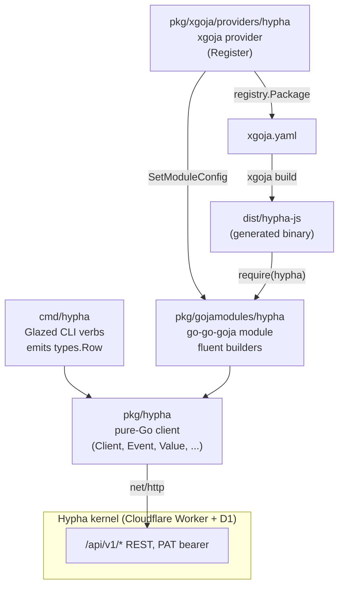

# PROJECT REPORT - Hypha CLI - A Glazed CLI and go-go-goja JS Provider for the Hypha Kernel

This report explains a system that gives the Hypha kernel a Go-native client surface in two forms: a Glazed command-line tool named `hypha`, and a go-go-goja JavaScript module named `hypha` that exposes the same client to a goja runtime through `require("hypha")`. The work spans four implementation phases — a pure-Go HTTP client, a Glazed CLI over that client, a go-go-goja fluent builder module, and an xgoja provider that generates a standalone binary — and it was validated end-to-end against the live deployment at `https://hyphahypha.club`. The implementation lives at `/home/manuel/code/wesen/go-go-golems/hypha-cli` and is published as `github.com/go-go-golems/hypha-cli` with a fork at `wesen/hypha-cli`.

The report is written for an engineer who needs to understand, modify, or reproduce the system. It does not use analogies. Each component is explained in its own terms, then connected to the others with code, diagrams, and a verified end-to-end trace.

> [!summary]
> - The system has three layered deliverables that share one pure-Go client (`pkg/hypha`): the Glazed CLI (`cmd/hypha`), the go-go-goja fluent builder module (`pkg/gojamodules/hypha`), and the xgoja provider (`pkg/xgoja/providers/hypha`). The client is the only package that opens an HTTP socket.
> - The JavaScript API is a fluent builder backed by Go-side opaque objects, in the style of the `goja-text` markdown module. Builders accumulate validation errors and throw an aggregated error at a terminal call; result objects are Go pointers whose exported fields goja reflects into JavaScript.
> - Every layer was validated against the live API. The docs and the server disagreed in four places (`/health` returns bare text, `open_to_work` is a string, list responses are envelope-wrapped, `value.amount` zero is rejected); the implementation was corrected against the server, not the docs.
> - `xgoja doctor` passes and `xgoja build` produced a 79 MB binary that runs `require("hypha")` scripts against production: posting an event, listing checkpoints, and reading the feed.

## Current status

The system is a working prototype. It is not yet published to the public Go proxy with the provider package, so the generated xgoja binary currently requires local `replace` directives during the build. The pure-Go client, the Glazed CLI, the go-go-goja module, and the xgoja provider are all implemented, tested, and live-verified.

The implemented packages:

| Package | Role | Tests |
| --- | --- | --- |
| `pkg/hypha` | Pure-Go REST client (no Cobra, no goja) | 9 unit + 7 live |
| `cmd/hypha` | Glazed CLI verbs over the client | manual live |
| `pkg/gojamodules/hypha` | go-go-goja fluent builder module | 12 runtime integration |
| `pkg/xgoja/providers/hypha` | xgoja provider + embedded help | 3 provider |

The implementation commits, in order:

```text
600936d  Phase 0: bootstrap from go-template (normalized)
c5912dd  Phase 1: pure-Go Hypha client (pkg/hypha)
7fdbcbe  Phase 2: Glazed CLI (cmd/hypha)
b24be41  Phase 3: go-go-goja fluent builder module (pkg/gojamodules/hypha)
3619eae  Phase 4: xgoja provider + generated hypha-js binary
```

The verification commands and observed results were:

```bash
GOWORK=off go build ./...           # clean
GOWORK=off go test ./... -count=1    # 3 packages green (29 tests total)
GOWORK=off go vet ./...             # clean
xgoja doctor -f examples/xgoja/hypha-js/xgoja.yaml   # schema ok, module-resolution ok
```

## Why this project exists

Hypha describes itself as "one identity membrane, one append-only event log, and push delivery, exposed identically through API, CLI, and MCP." The existing first-class clients are JavaScript: a Node CLI (`cli/hypha.mjs`) and an MCP server (`POST /mcp`). There was no Go-native path. The goal of this project was to make Hypha scriptable from Go tooling, embeddable inside go-go-golems command-line applications, and drivable from JavaScript runtimes built on goja — the pure-Go ECMAScript engine — without a Node dependency.

The project also exists because the Hypha API is small and precisely documented. The M1 verb table is eight verbs (`invite`, `connect`, `post`, `read`, `search`, `whois`, `subscribe`, `redact`), plus PAT management, five read-side views, an export endpoint, and an integrity-checkpoint chain. A client that maps each of these to a typed Go method and each to a CLI verb is tractable in a focused effort, and the result is a foundation other Go tooling can build on.

## The Hypha kernel in technical terms

Hypha is a Cloudflare Worker backed by D1 (SQLite), email sending, and HMAC-signed webhooks. Its architecture is three primitives:

1. **Identity membrane.** Membership is invite-only. An existing member or an admin sends an email invite; the recipient accepts with a chosen handle and the kernel mints a root Personal Access Token (PAT) with full non-admin scopes.
2. **Append-only event log.** Every action is an event with a stable ULID `id`, a millisecond `ts`, an `actor`, a `verb`, an optional `kind`, an optional `target` member id, an optional `ref` event id, an `audience` (`circle` or a member id), optional `topics`, an optional `body`, and an optional `value` of `{amount, unit}`. Events are never edited; redaction blanks `body` and `topics` but preserves the immutable fact.
3. **Push delivery.** Members register webhook URLs; the kernel delivers HMAC-signed, SSRF-guarded event deliveries to them.

The M1 verb table is the contract for the Go client. Each row becomes one client method and one CLI verb.

| Verb | Endpoint | Scope | What it does |
| --- | --- | --- | --- |
| `invite` | `POST /api/v1/invites`, `POST /api/v1/invites/accept` | graph | Email invite; creates member; appends `invite` event |
| `connect` | `POST /api/v1/connections` | graph | Introduce two members; appends `connect` event |
| `post` | `POST /api/v1/events` | write (+ value) | Universal append |
| `read` | `GET /api/v1/events` | read | Feed with filters |
| `search` | `GET /api/v1/search?q=` | read | Full-text over non-redacted bodies |
| `whois` | `GET /api/v1/members`, `GET /api/v1/members/:idOrHandle` | read | Identity + trust summary |
| `subscribe` | `POST/GET/DELETE /api/v1/webhooks` | write | Webhook management |
| `redact` | `POST /api/v1/events/:id/redact` | write (own) / admin | Blanks body/topics, keeps fact |

Credential attenuation is a strict rule enforced server-side: a PAT minted from a root credential may carry only a subset of the root's scopes, and `admin` is never mintable through the API. The Go client treats PATs as opaque bearer strings and never inspects them.

Two value units matter for the client. `hours` is the time ledger: every hour given creates a debt obligation, and `received - given = balance`. `kudos` is abundant appreciation that never creates debt. A third unit, `tip`, is reserved and not built. The `kind` namespace is partitioned: bare kinds (`iso`, `gig`, `meeting`, `update`, `chat`, `request`, `accept`, `decline`, `help`, `close`, `kudos`, `tip`) are first-party reserved; third-party tools must dot-prefix their kinds (for example `acme.bounty`). The fluent builder enforces this convention on the Go side.

## Architecture

The system is three layers over one client. The invariant is that `pkg/hypha` is the only package that talks to Hypha. The CLI and the JS module depend on it; neither opens an HTTP socket directly.



Three properties follow from this layout. First, the CLI never touches goja; it is a normal Glazed binary. Second, the JS module has two deployment paths — direct Go embedding through a blank import and `engine.NewRuntimeFactoryBuilder().Build()`, and a generated xgoja binary selected through `xgoja.yaml` — both backed by the same `pkg/hypha` client and the same adapter. Third, the provider is the only piece that knows about xgoja; the module itself is a plain `modules.NativeModule`.

## Implementation details

### The pure-Go client (`pkg/hypha`)

The client is a thin typed wrapper over `net/http` with no third-party HTTP framework. Its state is a base URL, a PAT, and an `*http.Client`:

```go
type Client struct {
    baseURL string
    pat     string
    http    *http.Client
}

func NewClient(baseURL, pat string, opts ...Option) *Client {
    c := &Client{
        baseURL: strings.TrimRight(baseURL, "/"),
        pat:     pat,
        http:    &http.Client{Timeout: 30 * time.Second},
    }
    for _, o := range opts { o(c) }
    return c
}
```

Every call funnels through one private helper. The helper sets the bearer header when a PAT is present, JSON-encodes the request body when there is one, reads the full response body, and decodes the kernel's error shape (`{"error":"<msg>"}`) into a typed `*Error` on any non-2xx status:

```go
func (c *Client) doJSON(ctx context.Context, method, path string, in, out any) error {
    var body io.Reader
    if in != nil {
        b, _ := json.Marshal(in)
        body = bytes.NewReader(b)
    }
    req, _ := http.NewRequestWithContext(ctx, method, c.baseURL+path, body)
    if c.pat != "" { req.Header.Set("Authorization", "Bearer "+c.pat) }
    if in != nil  { req.Header.Set("Content-Type", "application/json") }
    resp, err := c.http.Do(req)
    if err != nil { return fmt.Errorf("hypha: request: %w", err) }
    defer resp.Body.Close()
    raw, _ := io.ReadAll(resp.Body)
    if resp.StatusCode >= 400 {
        var e struct{ Error string `json:"error"` }
        _ = json.Unmarshal(raw, &e)
        return &Error{Status: resp.StatusCode, Message: e.Error, Body: string(raw)}
    }
    if out != nil && len(raw) > 0 {
        return json.Unmarshal(raw, out)
    }
    return nil
}
```

The `Event` type mirrors the kernel store schema. The fields that can be absent — `kind`, `target`, `ref`, `value_amount`, `value_unit` — are pointers, so they decode to `nil` rather than zero values when the server omits them:

```go
type Event struct {
    ID          string   `json:"id"`
    Ts          int64    `json:"ts"`
    Actor       string   `json:"actor"`
    Verb        string   `json:"verb"`
    Kind        *string  `json:"kind"`
    Target      *string  `json:"target"`
    Ref         *string  `json:"ref"`
    Audience    string   `json:"audience"`
    Topics      []string `json:"topics"`
    Body        *string  `json:"body"`
    ValueAmount *float64 `json:"value_amount"`
    ValueUnit   *string  `json:"value_unit"`
    Redacted    int      `json:"redacted"`
}
```

#### Where the docs and the server disagree

Probing the live API before writing the client was the step that made the implementation correct rather than fictional. Four discrepancies between the published docs and the live server shaped the client:

| Discrepancy | Doc implication | Live reality | Fix |
| --- | --- | --- | --- |
| `GET /health` | JSON body | Bare text `ok` | `Health` reads the raw body instead of JSON-decoding |
| `open_to_work` on whois | `bool` | String (e.g. `"pt"`) | `Profile.OpenToWork` is `*string` |
| List responses | Bare arrays | Envelope-wrapped (`{"events":[]}`, `{"members":[]}`, ...) | Every list method decodes the envelope |
| `POST /api/v1/events` with no value | `value` omitted | `value.amount` zero rejected (`400 value.amount must be > 0`) | `PostOptions.Value` is `*Value`, omitted when nil |

The fourth discrepancy is the most instructive. A Go struct field with `omitempty` omits a field only when the struct is the zero value; a `Value{Amount:0, Unit:""}` is not the zero value for `omitempty` purposes in the way a nil pointer is, and the kernel rejects `amount:0`. Making `Value` a pointer and only setting it when the caller supplies a unit is the fix. The unit test for `Post` does not set a value; the live test for posting an `acme.probe` event succeeds; the live test for redacting it succeeds. The `@me` handle is also not supported by the server (`GET /api/v1/members/@me` returns `404`), so `whoami` resolves through a configured handle rather than a magic endpoint.

### The integrity verification chain

The checkpoint verification is the most self-contained piece of logic in the client and the one that demonstrates the integrity model directly. The kernel writes periodic cumulative SHA-256 hashes over the immutable facts of the log. The canonical event format, from the portability doc, is:

```
<id>|<ts>|<actor>|<verb>|<target_or_empty>|<value_amount_or_empty>|<value_unit_or_empty>
```

Empty string is used for null fields, not the word `null`. The fields `body`, `topics`, `audience`, and `redacted` are excluded, so redaction — which blanks `body` and `topics` — does not break the chain. The verification recomputes the running hash over the caller's exported events with `id <= up_to_id` and compares it to a pinned hash:

```go
func (c *Client) Verify(ctx context.Context, upToID, pinnedHash string) (*VerifyResult, error) {
    running := []byte("")
    count := 0
    cursor := ""
    for {
        page, err := c.Export(ctx, cursor)
        if err != nil { return nil, err }
        for _, ev := range page.Events {
            if ev.ID > upToID {
                return &VerifyResult{OK: hexEqualString(hex.EncodeToString(running), pinnedHash),
                    ComputedHash: hex.EncodeToString(running), EventCount: count}, nil
            }
            running = sha256chain(running, []byte(canonicalEvent(ev)))
            count++
        }
        if page.NextCursor == nil { break }
        cursor = *page.NextCursor
    }
    return &VerifyResult{OK: hexEqualString(hex.EncodeToString(running), pinnedHash),
        ComputedHash: hex.EncodeToString(running), EventCount: count}, nil
}
```

One subtlety is that export is scoped to the caller's own events. A global checkpoint covers events authored by everyone, so verifying a global checkpoint against only the caller's export will not match unless the caller authored every event up to the checkpoint. The client is correct; the meaning of `Verify` is "the caller's own events, up to this id, hash to this value." The unit test computes the expected chain in the test using the same `sha256(prev + canonical)` formula and asserts equality, which proves the canonical format is implemented correctly.

### The Glazed CLI (`cmd/hypha`)

The CLI is built with Glazed, the go-go-golems command framework that sits on Cobra and gives every command structured output (`--output json|yaml|csv|table`, `--fields`, `--filter`) with minimal code. Each verb is a `GlazeCommand` whose `RunIntoGlazeProcessor` decodes its flags, calls the client, and emits `types.Row` rows.

The shared connection flags live in a custom Glazed section so every verb gets `--base-url` and `--pat` without redefining them:

```go
func NewConnectionSection() (schema.Section, error) {
    return schema.NewSection("connection", "Hypha connection",
        schema.WithFields(
            fields.New("base-url", fields.TypeString,
                fields.WithDefault("http://localhost:8787"),
                fields.WithHelp("Hypha base URL")),
            fields.New("pat", fields.TypeString,
                fields.WithHelp("Personal Access Token (hh_pat_...); overrides config file")),
        ),
    )
}
```

A `PostCommand` decodes both the default section and the connection section, builds a client, calls `Post`, and emits one row:

```go
func (c *PostCommand) RunIntoGlazeProcessor(ctx context.Context, vals *values.Values, gp middlewares.Processor) error {
    s := &PostSettings{}
    if err := vals.DecodeSectionInto(schema.DefaultSlug, s); err != nil { return err }
    if err := vals.DecodeSectionInto(ConnectionSectionName, s); err != nil { return err }
    client := hypha.NewClient(s.BaseURL, s.PAT)
    opts := hypha.PostOptions{Body: s.Body, Kind: s.Kind, Topics: s.Topic,
        Target: s.To, Ref: s.Ref, Audience: s.Audience, IdemKey: s.IdemKey}
    if s.Unit != "" { opts.Value = &hypha.Value{Amount: s.Value, Unit: s.Unit} }
    ev, err := client.Post(ctx, opts)
    if err != nil { return err }
    return gp.AddRow(ctx, eventRow(ev))
}
```

Because the `CobraParserConfig` sets `AppName: "hypha"`, the env vars `HYPHA_BASE_URL` and `HYPHA_PAT` flow into the connection section automatically. The root wires logging and the help system per the standard Glazed pattern, then registers each verb under its group.

One detail that required correction during implementation: `types.Row` is an `*orderedmap.OrderedMap`, so late field additions use `Set`, not a hypothetical `Add`. The `whois` verb builds a base member row and then appends trust fields with `row.Set("balance", m.Trust.Balance)`. Pointer fields on the `Event` are dereferenced in `eventRow` so the table formatter prints the value rather than a pointer address.

### The go-go-goja fluent builder module (`pkg/gojamodules/hypha`)

The JavaScript API is a fluent builder backed by Go-side opaque objects. This design follows the `goja-text` markdown module, which returns `*MarkdownBuilder` and `*MarkdownNode` Go pointers whose reflected methods chain in JavaScript and whose `Validate()` and `Render()` aggregate errors. The alternative — the `researchctl` codesign module's `*goja.Object` closure builders that throw immediately on each method — was considered and rejected because immediate throws lose cross-call error accumulation.

The module's `Loader` exports a small set of factory functions that return Go pointers:

```go
func (module) Loader(vm *goja.Runtime, moduleObj *goja.Object) {
    client := hypha.NewClient(cfg.BaseURL, cfg.PAT)
    rt := &runtime{vm: vm, client: client, handle: cfg.Handle}
    exports := moduleObj.Get("exports").(*goja.Object)
    rt.mustSet(exports, "event", rt.event)
    rt.mustSet(exports, "feed", rt.feed)
    rt.mustSet(exports, "pats", rt.pats)
    // ... identity, views, webhooks, export, checkpoints, verify
}
```

The `EventBuilder` is the centerpiece. Mutator methods return the same `*EventBuilder` for chaining and append to an `errs` slice on misuse; the terminal `Post` validates first and throws an aggregated error:

```go
type EventBuilder struct {
    rt   *runtime
    opts hypha.PostOptions
    errs []string
}

func (b *EventBuilder) Value(amount float64, unit string) *EventBuilder {
    if unit == "" {
        b.errs = append(b.errs, "value: unit is required (e.g. .value(2, \"hours\"))")
    }
    if unit == "hours" && b.opts.Audience != "circle" {
        b.errs = append(b.errs, "value: unit \"hours\" creates time debt; audience should be \"circle\"")
    }
    if b.opts.Target == "" {
        b.errs = append(b.errs, "value: a valued event requires .to(<member>)")
    }
    b.opts.Value = &hypha.Value{Amount: amount, Unit: unit}
    return b
}

func (b *EventBuilder) Post() (*hypha.Event, error) {
    v := b.Validate()
    if !v.Valid {
        return nil, fmt.Errorf("hypha.event: %s", strings.Join(v.Errors, "; "))
    }
    return b.rt.client.Post(context.Background(), b.opts)
}
```

Because `Post` returns `(*hypha.Event, error)`, goja throws the error as a JavaScript `Error` at the call site. A caller who writes `hypha.event("gave 2h").Kind("gig").Value(2, "hours").Post()` without a target receives one message listing every problem, not a server rejection.

The key rule that governs this design is that goja reflects Go method names verbatim. A Go method named `Kind` is exposed to JavaScript as `Kind`, not `kind`. The `goja-text` markdown module uses `Title`, `Heading`, and `RenderString` in JavaScript; this module uses `Kind`, `Topic`, `Post`, `ToSpec`, and `Validate`. The result objects are also Go pointers whose exported fields goja reflects, so JavaScript reads `ev.ID`, `ev.Verb`, `member.Handle`, and `checkpoint.Hash` directly. The design doc's initial lowerCamelCase sketch was superseded by this PascalCase implementation, because lowerCamelCase would require either `*goja.Object` closure wrappers or hand-written JavaScript shims, neither of which preserves the accumulated-error property.

The other builders follow the same shape. `FeedQuery` has `Kind`, `Topic`, `Actor`, `Limit`, and a `List` terminal. `PATBuilder` has `Scopes`, `Label`, and a `Mint` terminal that guards against an empty scope list. `VerifyQuery` has `UpTo` and `Hash` and a `Run` terminal. Each terminal returns a Go-backed result or throws.

### The xgoja provider and the generated binary (`pkg/xgoja/providers/hypha`)

A `modules.NativeModule` registered with `modules.Register` is enough for direct Go embedding when the package is imported. It is not enough for an xgoja-generated binary, which selects modules through provider packages listed in `xgoja.yaml`. The provider is the bridge.

The provider's `Register` exposes the module and an embedded help source:

```go
func Register(registry *providerapi.ProviderRegistry) error {
    mod := modules.GetModule("hypha")
    if mod == nil {
        return fmt.Errorf("hypha provider: module %q is not registered", "hypha")
    }
    return registry.Package(PackageID,
        providerapi.Module{
            Name:        "hypha",
            DefaultAs:   "hypha",
            Description: mod.Doc(),
            ConfigSchema: json.RawMessage(`{ "type": "object", "properties": {
                "baseUrl": {"type": "string"}, "pat": {"type": "string"}, "handle": {"type": "string"} } }`),
            NewModuleFactory: func(ctx providerapi.ModuleSetupContext) (require.ModuleLoader, error) {
                hyphamod.SetModuleConfig(ctx.Config)
                return mod.Loader, nil
            },
        },
        providerapi.HelpSource{Name: "hypha-runtime-api", FS: doc.FS(), Root: "."},
    )
}
```

The `NewModuleFactory` is the point where per-module configuration from `xgoja.yaml` flows into the adapter. `ctx.Config` is the JSON block from `runtime.modules[].config`; the provider hands it to `hyphamod.SetModuleConfig`, and the module's `Loader` reads it before building the shared client. This two-step mirrors how the `host` provider passes `FSConfig` into the filesystem module.

The example `xgoja.yaml` selects the module and the built-in `run`/`eval`/`repl` commands:

```yaml
schema: xgoja/v2
name: hypha-js
providers:
  - id: hypha
    import: github.com/go-go-golems/hypha-cli/pkg/xgoja/providers/hypha
    register: Register
runtime:
  modules:
    - provider: hypha
      name: hypha
      as: hypha
commands:
  - { id: eval, type: builtin.eval, name: eval }
  - { id: run,  type: builtin.run,  name: run }
  - { id: repl, type: builtin.repl, name: repl }
artifacts:
  - id: binary
    type: binary
    output: dist/hypha-js
```

`xgoja doctor` validates the spec. `xgoja build` generates a Go module that imports the provider, compiles it, and produces a binary. During development, before `hypha-cli` is published with the provider package, the build needs two local `replace` directives: `--xgoja-replace` for `go-go-goja`, and a manual `go mod edit -replace github.com/go-go-golems/hypha-cli=<local path>` in the generated workspace for the consumer. Once the provider is published, a plain `xgoja build` works.

## Verification traces

Each layer was verified against the live server at `https://hyphahypha.club` with a PAT. The traces below are the actual observed behavior.

### The pure-Go client

The live test suite (`pkg/hypha/live_test.go`, skipped without `HYPHA_BASE_URL`/`HYPHA_PAT`) exercised every endpoint:

```text
TestLiveHealth              PASS  (health = "ok")
TestLiveMembersAndWhois     PASS  (members list non-empty; whois @wesen matches members id)
TestLiveFeed                PASS  (feed decodes)
TestLiveBalanceAndTopics    PASS  (balance + topics views decode)
TestLivePatsList            PASS  (pats list decodes)
TestLivePostAndRedact       PASS  (post returns Event; redact returns ok)
TestLiveCheckpointsAndVerify PASS (checkpoints decode; Verify runs, produces hash)
```

A real `POST /api/v1/events` returned the created event:

```json
{"id":"01KX25D327EWXZKDK8WR89RB0W","ts":1783557950535,"actor":"01KX0XTBECGBK8CNK209Y09V4W",
 "verb":"post","kind":"acme.probe","target":null,"ref":null,"audience":"circle",
 "topics":["meta"],"body":"hypha-cli probe (will redact)","value_amount":null,"value_unit":null,"redacted":0}
```

The subsequent `POST /api/v1/events/.../redact` returned `{"ok":true}`, and a follow-up feed read confirmed the event's `topics` became `[]` and `redacted` became `1`.

### The Glazed CLI

The compiled `hypha` binary ran against the live server. A feed read in table format:

```text
+----------------------------+------+-------------+-------+
| id                         | verb | kind        | body  |
+----------------------------+------+-------------+-------+
| 01KX262M96FDCJFM2HYM1NQXA0 | post | acme.probe  | <nil> |
| 01KX262A88F58EM8AEA6R71AR4 | post | acme.probe  | <nil> |
| 01KX25D327EWXZKDK8WR89RB0W | post | acme.probe  | <nil> |
+----------------------------+------+-------------+-------+
```

The `<nil>` body values are redacted events whose `body` is null; the `kind` column renders the dereferenced string, not a pointer address (an earlier build printed `0x39b42a08ef70` before the `derefStr` fix). `hypha views balance --output json` produced one object per member; `hypha whois @wesen --output json` included the trust sub-object fields; `hypha checkpoints --limit 2` listed the cumulative hashes.

### The generated xgoja binary

The smoke script ran against the live server through the generated `hypha-js` binary:

```js
const hypha = require("hypha");
const ev = hypha.event("hypha-js smoke (will redact)").Kind("acme.smoke").Topic("meta").Post();
console.log("posted:", ev.ID);
hypha.checkpoints().Limit(1).List().forEach((cp) => { console.log("checkpoint:", cp.Seq, cp.Hash); });
hypha.feed().Limit(3).List().forEach((e) => { console.log("feed:", e.ID, e.Verb); });
```

Observed output:

```text
posted: 01KX26RTXGB3QPPJV5M5FGZMWK
checkpoint: 4 e02179c2191603d949c2aeaa2ac20f76cbf087b8434c562c902baa0cc6880a2e
feed: 01KX26RTXGB3QPPJV5M5FGZMWK post
feed: 01KX26EN929YZPHQH0CWPJZNG5 post
feed: 01KX26E9QCYFG7P5V2GYYNJ1DA post
```

The posted event appeared as the first feed row, confirming the post succeeded and the immediately subsequent feed read saw it. The smoke post was redacted through the Glazed CLI afterward.

## Common failure modes and how the system handles them

| Failure mode | Where it is caught | Behavior |
| --- | --- | --- |
| Unknown JS method (typo) | goja reflection | `TypeError: Object has no member 'toppic'` at the call site |
| Missing `unit` on `Value()` | `EventBuilder` accumulator | Appended to `errs`; `Post()` throws aggregated error |
| `hours` value with non-circle audience | `EventBuilder` accumulator | Appended to `errs` (debt-creation warning) |
| Empty scope list on `pats().mint()` | `PATBuilder.Mint` | Returns Go error → thrown JS error before HTTP call |
| Server 4xx/5xx | `client.doJSON` | Typed `*Error{Status, Message, Body}` → thrown JS error or CLI error |
| `@me` handle | server returns 404 | `whoami` requires a configured handle; returns clear error if absent |
| Pointer fields in table output | `eventRow` dereferences | Table prints value or `<nil>`, not pointer address |

The design choice that unifies these is that validation happens on the Go side before any HTTP call. A script that misuses the builder never reaches the server; it receives a single aggregated message listing every problem found across the whole builder chain.

## Open questions

- The live deployment accepts PAT bearer against `/api/v1`. The prior `PROJ - Hypha MCP` work used OAuth against `/mcp`. Whether a production deployment ever exposes only the OAuth MCP endpoint (making the REST client unusable against it) is unresolved; the design reserves a `Transport` interface for a future MCP client.
- `whoami` has no server endpoint; it resolves through a configured handle. Whether the kernel will add a real `whoami`/`me` endpoint is open.
- `orEmptyAmount` prints integer-valued amounts without a decimal and fractional amounts with minimal decimals (`strconv.FormatFloat(a,'f',-1,64)`). Whether this matches the kernel's `value_amount` serialization for fractional hours (for example `0.5`) should be confirmed against a checkpoint that covers fractional-hour events.
- The generated xgoja binary's `builtin.eval` command does not auto-`require` the `hypha` module; scripts must use `run` with an explicit `require`. A provider command set that pre-loads the module for `eval` is a future option.

## Near-term next steps

- Publish `hypha-cli` with the provider package so `xgoja build` works without local `replace` directives.
- Implement `modules.TypeScriptDeclarer` on the module so `xgoja gen-dts` emits a `.d.ts` describing the PascalCase builder and result interfaces.
- Wire config-file loading (`~/.config/hypha/config.json`, mode 600, `HYPHA_CONFIG` override) into the CLI root `PersistentPreRunE` so the connection section defaults come from the file.
- Add an `MCPTransport` implementing the same client-shaped interface behind the `Transport` abstraction, so a single deployer choice (REST or MCP) does not require a different client.
- Add result `.ToObject()` helpers so callers can `JSON.stringify` a Go-backed result without going through `ToSpec`.

## Important project docs

- Ticket workspace: `/home/manuel/code/wesen/2026-07-08--hypha-cli/ttmp/2026/07/08/HYPHA-CLI--hypha-xgoja-go-go-goja-cli-client-and-js-provider/`
- Design doc: `…/design-doc/01-hypha-cli-js-provider-analysis-design-and-implementation-guide.md` (~1600 lines, intern-grade)
- Investigation diary: `…/reference/01-investigation-diary.md` (Steps 1–9)
- Hypha docs (authoritative): `https://hyphahypha.club/docs/{readme,conventions,views,portability}`
- Related vault note: [[PROJ - Hypha MCP - Remote Server, OAuth, and a Retro System-1 Client]]

## Project working rule

> [!important]
> Validate against the live server before trusting the docs. The published docs and the deployed API disagreed in four places; the implementation was corrected to match the server in every case. The same principle applied to the JavaScript API: the design doc's lowerCamelCase sketch was superseded by the PascalCase implementation after confirming how goja reflects Go methods.
