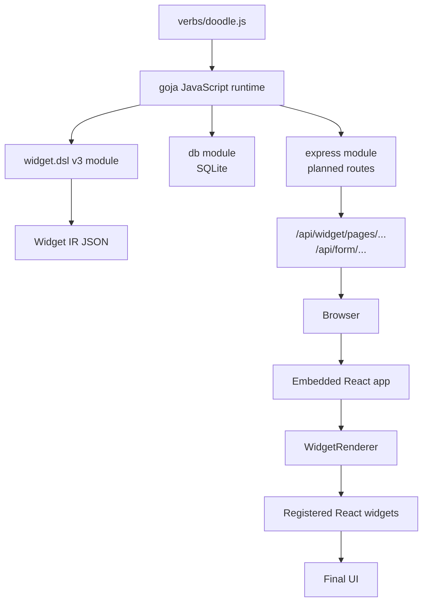

# Doodle Project Report: From xgoja JavaScript to Rendered Widget UI

This report explains the Doodle scheduling example as a complete system. It is written for a reader who knows Go and JavaScript, but has not worked with goja, xgoja, Widget DSL modules, or Widget IR before.

The project lives in `/home/manuel/workspaces/2026-07-03/improve-rag-evaluation-system/rag-evaluation-system/examples/xgoja/doodle-site`. It builds one binary. That binary serves a web application. The application lets a user create a scheduling poll, submit availability, and see the current result table.

The recent work changed the authoring layer. The original version used older split modules named `ui.dsl` and `data.dsl`. The current version uses the unified `widget.dsl` v3 module. The final source has no legacy Widget DSL imports and no raw component escape hatches.

> [!summary]
> - Doodle is a small scheduling site with SQLite storage, xgoja HTTP routes, Widget IR pages, and an embedded React UI.
> - goja runs the JavaScript file inside a Go program. xgoja builds that Go program with selected provider modules.
> - The JavaScript does not render HTML. It calls `widget.dsl`. The DSL builds Widget IR. The React app fetches that IR and renders registered widgets.
> - The refactor moved Doodle from legacy split DSL modules to `widget.dsl` v3. It also added typed v3 helpers so the example no longer needs `widget.raw.component(...)`.

## 1. What the project implements

Doodle implements a minimal scheduling workflow.

A poll owner creates a poll with:

- a title,
- an optional description,
- an optional location,
- one or more time slot labels.

Participants then open the poll and submit one value per slot:

- `yes`,
- `maybe`,
- `no`.

The poll page shows:

- poll metadata,
- a participant-by-slot availability grid,
- a summary grid,
- a score table,
- a form for adding another participant.

The score is simple:

```text
score = yes_count * 2 + maybe_count
```

A slot with the highest score is marked as the current best slot when at least one response exists.

The application is intentionally small. That is useful. A reader can inspect the whole system in one file: `examples/xgoja/doodle-site/verbs/doodle.js`. The file contains the database schema, seed data, queries, page builders, form handlers, and HTTP routes.

## 2. Important files

| File | Purpose |
| --- | --- |
| `examples/xgoja/doodle-site/xgoja.v2.yaml` | xgoja build specification. It selects providers and runtime modules. |
| `examples/xgoja/doodle-site/verbs/doodle.js` | Main application source. It is executed by goja inside the generated binary. |
| `examples/xgoja/doodle-site/Makefile` | Developer commands for build, serve, module listing, and asset sync. |
| `examples/xgoja/doodle-site/dist/doodle-site` | Generated binary. It is built by xgoja. |
| `examples/xgoja/doodle-site/doodle.db` | Runtime SQLite database file. It is created when the server runs. |
| `pkg/widgetdsl/v3.go` | Go implementation of the `widget.dsl` v3 module. |
| `pkg/widgetdsl/typescript.go` | TypeScript declarations for DSL users. |
| `packages/rag-evaluation-site/src/app/App.tsx` | React application shell. It loads Widget IR pages from `/api/widget/pages/...`. |
| `packages/rag-evaluation-site/src/widgets/WidgetRenderer.tsx` | Recursive Widget IR renderer. |
| `packages/rag-evaluation-site/src/widgets/defaultRegistry.ts` | Registry from Widget IR component names to React widget adapters. |

## 3. The runtime stack

The Doodle binary contains several layers. Each layer has one job.



The same generated binary serves both sides:

- the API routes,
- the static React application assets.

The browser opens `/pages/index`, `/pages/create`, or `/pages/poll?poll=<id>`. The React application reads the current route. It then fetches the matching Widget IR page from the API. The React renderer converts that IR into the visible UI.

## 4. What goja is

`goja` is a JavaScript runtime written in Go. It lets a Go program execute JavaScript code without starting Node.js.

For this project, that means:

- `verbs/doodle.js` is JavaScript source.
- The generated `doodle-site` binary is a Go program.
- The Go program embeds or loads the JavaScript.
- At runtime, goja executes that JavaScript.
- The JavaScript can call modules that are implemented in Go.

The important point is module control. This is not a general Node.js process with the full Node standard library. The available modules are selected by the xgoja spec.

In `xgoja.v2.yaml`, Doodle selects these modules:

```yaml
runtime:
  modules:
    - provider: go-go-goja-http
      name: express
      as: express
    - provider: go-go-goja-host
      name: fs
      as: fs:assets
    - provider: go-go-goja-host
      name: db
      as: db
    - provider: rag-widget-site
      name: widget.dsl
      as: widget.dsl
```

The JavaScript can then do this:

```javascript
const express = require("express");
const assets = require("fs:assets");
const db = require("db");
const widget = require("widget.dsl");
```

Each `require` call resolves to a provider-backed module. Some modules expose HTTP functions. Some expose database functions. `widget.dsl` exposes functions that build Widget IR.

## 5. What xgoja is

`xgoja` is the build tool that assembles a custom Go binary around goja and provider modules.

The Doodle Makefile calls it through the local `go-go-goja` workspace:

```makefile
XGOJA_ROOT := $(abspath ../../../../go-go-goja)
XGOJA := cd $(XGOJA_ROOT) && GOWORK=off go run ./cmd/xgoja
SPEC := $(CURDIR)/xgoja.v2.yaml
BIN := $(CURDIR)/dist/doodle-site

build:
	$(XGOJA) build -f $(SPEC) --output $(BIN) --xgoja-replace $(XGOJA_ROOT) --keep-work
```

The build reads `xgoja.v2.yaml`. It includes provider packages. It embeds source files and assets. It produces `dist/doodle-site`.

The result is a normal executable. It is run like this:

```bash
cd examples/xgoja/doodle-site
./dist/doodle-site serve doodle site --http-listen 127.0.0.1:18793
```

The command name comes from `verbs/doodle.js`:

```javascript
__package__({ name: "doodle", short: "Doodle-style scheduling site" });

__verb__("site", {
  name: "site",
  output: "text",
  short: "Serve a Doodle-style scheduling site backed by SQLite and widget.dsl v3",
  tags: ["http", "widget", "db", "doodle"],
});

function site() {
  // server setup lives here
}
```

The verb system exposes `site()` as a command. The HTTP provider mounts it under `serve doodle site`.

## 6. The full path from JS to final UI

This is the main section for a reader who is new to the DSL and IR design.

The path has five steps:

1. JavaScript authoring code calls `widget.dsl`.
2. `widget.dsl` converts those calls into Widget IR objects.
3. The HTTP handler returns the Widget IR as JSON.
4. The React application fetches the JSON.
5. `WidgetRenderer` renders React components from the IR.

The JavaScript file does not return JSX. It does not return HTML. It returns data. That data describes a UI tree.

### 6.1 JavaScript calls the DSL

A Doodle page starts as JavaScript code. Example:

```javascript
return asPage(
  widget.page("New scheduling poll", (p) => {
    applyPageMeta(p, "create", "create")
      .section("Create a poll", (s) =>
        s.caption(
          "Give the event a title and list one time slot per line. Everything is stored in SQLite.",
        ),
      )
      .section("Event details", (s) => s.view(form))
      .section("Navigation", (s) =>
        s.view(widget.ui.button("← Back to all polls", act.navigate("/pages/index"))),
      );
  }),
);
```

This code is normal JavaScript. The important difference is the object behind `widget`. It is not a frontend object. It is a goja module backed by Go code in `pkg/widgetdsl/v3.go`.

When JavaScript calls `widget.page`, it calls a Go function exposed into the goja runtime:

```go
func (r *runtime) v3Page(call goja.FunctionCall) goja.Value {
    spec := &v3PageSpec{SchemaVersion: "0.1.0", ID: "page", Title: "Page", Meta: map[string]any{}}
    // parse title or options
    // create builder
    // apply callback
    return builder
}
```

The DSL gives the JavaScript author a compact API. The author writes page sections, buttons, form rows, data collections, and schedule widgets. The author does not write the final JSON shape by hand.

### 6.2 The DSL creates Widget IR

Widget IR is a structured representation of a UI tree. It has simple node kinds. The renderer understands these kinds.

A basic component node looks like this:

```json
{
  "kind": "component",
  "type": "Button",
  "props": {
    "action": {
      "kind": "navigate",
      "target": "/pages/create"
    }
  },
  "children": [
    { "kind": "text", "text": "+ New poll" }
  ]
}
```

The exact field set changes by component, but the rule is stable:

- `kind` tells the renderer what node class this is.
- `type` names the registered component for component nodes.
- `props` carries component properties.
- `children` carries nested Widget IR nodes.

The v3 DSL helper `widget.ui.button(...)` builds a `Button` component node. The Doodle author does not need to remember the low-level shape.

The helper is implemented in Go like this:

```go
func (r *runtime) v3UIButton(label goja.Value, action goja.Value, options ...goja.Value) map[string]any {
    props := exportOptions(options)
    if action != nil && !goja.IsUndefined(action) && !goja.IsNull(action) {
        props["action"] = action.Export()
    }
    return componentNode("Button", props, r.v3NodeSpecsToIR(r.v3ExportChild(label))...)
}
```

That function receives goja values from JavaScript. It exports them into Go data. It returns a map that represents a Widget IR component node.

### 6.3 The HTTP route returns Widget IR JSON

The Doodle server exposes page routes:

```javascript
app
  .get("/api/widget/pages/create")
  .public()
  .handle((_ctx, res) => res.json(createPage()));
```

`createPage()` returns the page object built by the DSL. `res.json(...)` serializes it as JSON.

The browser does not know how the page was built. It only receives JSON.

A poll route uses a query parameter:

```javascript
app
  .get("/api/widget/pages/poll")
  .public()
  .handle((ctx, res) => {
    const pollId = Number(ctx.request?.query?.poll || 0);
    res.json(pollPage(pollId));
  });
```

This allows a browser URL like:

```text
/pages/poll?poll=3
```

The React app turns that into an API request:

```text
/api/widget/pages/poll?poll=3
```

The query string is preserved. The server can load the right poll.

### 6.4 The React app fetches the IR

The React application code lives in `packages/rag-evaluation-site/src/app/App.tsx`.

It reads the current page id from the browser path:

```typescript
function readPageIdFromLocation(defaultPageId: string): string {
  const url = new URL(window.location.href);
  const queryPage = url.searchParams.get("page");
  if (queryPage) return queryPage;
  const parts = url.pathname.split("/").filter(Boolean);
  if (parts[0] === "pages" && parts[1]) return parts[1];
  return defaultPageId;
}
```

It reads the search string:

```typescript
function readSearchFromLocation(_locationVersion: number): string {
  return window.location.search || "";
}
```

It fetches the Widget IR page:

```typescript
const { page, loading, error, refresh } = useWidgetPage(
  `${cleanApiBase}/pages/${encodeURIComponent(pageId)}${pageSearch}`,
);
```

For Doodle, `cleanApiBase` is `/api/widget`. If the browser is at `/pages/poll?poll=3`, the fetch URL becomes `/api/widget/pages/poll?poll=3`.

### 6.5 WidgetRenderer turns IR into React nodes

The renderer lives in `packages/rag-evaluation-site/src/widgets/WidgetRenderer.tsx`.

Its core function is small:

```typescript
function renderWidgetNode(
  node: WidgetNode,
  ctx: RenderContext,
  registry: WidgetRegistry,
): ReactNode {
  switch (node.kind) {
    case "text":
      return node.text;
    case "element":
      return renderElementNode(node, ctx, registry);
    case "component":
      return renderComponentNode(node, ctx, registry);
    default:
      return null;
  }
}
```

For component nodes, it uses a registry:

```typescript
function renderComponentNode(
  node: ComponentNode,
  ctx: RenderContext,
  registry: WidgetRegistry,
): ReactNode {
  const adapter = registry.get(node.type);
  if (!adapter) {
    return <UnknownWidget node={node} />;
  }
  return adapter.render(node.props ?? {}, renderChildren(node.children, ctx, registry), ctx, node);
}
```

This is the boundary between data and React. A node with `type: "Button"` is rendered by the registered Button adapter. A node with `type: "MatrixGrid"` is rendered by the registered MatrixGrid adapter. A node with an unknown type produces an error callout.

The default registry is built in `defaultRegistry.ts`. It contains entries such as:

- `buttonWidget`,
- `formPanelWidget`,
- `formRowWidget`,
- `textInputWidget`,
- `selectInputWidget`,
- `dataTableWidget`,
- `matrixGridWidget`,
- `emptyStateWidget`.

Doodle uses these through Widget IR. It does not import these React components directly.

### 6.6 The final UI

The final UI is normal React output in the browser. The user sees:

- navigation,
- panels,
- forms,
- inputs,
- buttons,
- tables,
- matrix grids,
- status labels.

The source path remains indirect:

```text
JavaScript page builder
  -> widget.dsl function calls
  -> Widget IR JSON
  -> /api/widget/pages/... response
  -> React fetch
  -> WidgetRenderer
  -> registered React widget adapters
  -> DOM
```

This indirection is the main design choice. It allows Go-hosted JavaScript code to describe UI without bundling custom frontend code for each host application.

## 7. Database design

The schema is created on startup with `CREATE TABLE IF NOT EXISTS`.

```sql
CREATE TABLE IF NOT EXISTS polls (
  id INTEGER PRIMARY KEY AUTOINCREMENT,
  slug TEXT UNIQUE,
  title TEXT NOT NULL,
  description TEXT,
  location TEXT,
  created_at TEXT NOT NULL
);

CREATE TABLE IF NOT EXISTS options (
  id INTEGER PRIMARY KEY AUTOINCREMENT,
  poll_id INTEGER NOT NULL,
  label TEXT NOT NULL,
  sort INTEGER NOT NULL
);

CREATE TABLE IF NOT EXISTS participants (
  id INTEGER PRIMARY KEY AUTOINCREMENT,
  poll_id INTEGER NOT NULL,
  name TEXT NOT NULL,
  created_at TEXT NOT NULL
);

CREATE TABLE IF NOT EXISTS votes (
  participant_id INTEGER NOT NULL,
  option_id INTEGER NOT NULL,
  value TEXT NOT NULL,
  PRIMARY KEY (participant_id, option_id)
);
```

The schema is normalized enough for the example:

- `polls` stores one scheduling poll.
- `options` stores time slot labels for a poll.
- `participants` stores a submitted participant name per poll.
- `votes` stores one value per participant and option.

The vote values remain product-specific:

```text
yes | maybe | no
```

The schedule widget uses a different view contract:

```text
available | maybe | unavailable | unknown
```

The application converts between the two at render time. Storage does not need to change because a generic UI component expects different terms.

## 8. Data loading functions

The JavaScript file uses direct SQL helper functions.

`allPolls()` loads the index page data:

```javascript
function allPolls() {
  return db.query(
    "SELECT p.id, p.slug, p.title, p.location, p.created_at, " +
      "(SELECT COUNT(*) FROM options o WHERE o.poll_id = p.id) AS slots, " +
      "(SELECT COUNT(*) FROM participants pt WHERE pt.poll_id = p.id) AS people " +
      "FROM polls p ORDER BY p.id DESC",
  );
}
```

`getPoll`, `pollOptions`, `pollParticipants`, and `pollVotes` load the poll detail page. The detail page then computes derived structures in memory.

The code does not keep an application-level cache. Every page request reads current database state. This is correct for the example. It keeps server state simple. It also makes redirects reliable: after a POST, the next GET sees the new rows.

## 9. Page-level behavior

### 9.1 Index page

The index page calls `allPolls()`. It computes:

- total poll count,
- total response count,
- total slot count.

It renders a table through `widget.data.collection`:

```javascript
const table = collectionTable(
  "polls",
  rows,
  (f) =>
    f
      .key("id", { label: "ID" })
      .primary("title", { label: "Poll" })
      .short("location", { label: "Where" })
      .count("slots", { label: "Slots" })
      .count("people", { label: "Responses" })
      .date("created", { label: "Created" }),
  { empty: "No polls yet" },
);
```

The field builder defines how each column should be treated. The table renderer receives a schema and rows. It does not need Doodle-specific code.

### 9.2 Create page

The create page builds a form:

```javascript
const form = widget.ui.form(
  {
    title: "Event details",
    method: "post",
    formAction: "/api/form/create-poll",
    submitLabel: "Create poll",
  },
  formRow("Title", textInput({ name: "title", required: true }), { required: true }),
  formRow("Description", textareaInput({ name: "description", rows: 2 })),
  formRow("Location", textInput({ name: "location" })),
  formRow(
    "Time slots (one per line)",
    textareaInput({ name: "slots", rows: 5, required: true }),
    { required: true },
  ),
);
```

The form submits through browser-native form behavior. The route handler receives `ctx.body`, validates the required fields, creates the poll, and redirects.

### 9.3 Poll page

The poll page loads the poll, options, participants, and votes. It builds a nested map:

```javascript
const voteMap = {};
votes.forEach((v) => {
  const pid = v.participant_id;
  if (!voteMap[pid]) voteMap[pid] = {};
  voteMap[pid][v.option_id] = v.value;
});
```

It converts Doodle votes to schedule states:

```javascript
function availabilityValue(value) {
  if (value === "yes") return "available";
  if (value === "no") return "unavailable";
  if (value === "maybe") return "maybe";
  return "unknown";
}
```

It builds the schedule object:

```javascript
const availabilityPoll = {
  title: poll.title,
  options: options.map((opt) => ({ id: String(opt.id), label: opt.label })),
  responses: participants.map((pt) => {
    const availability = {};
    options.forEach((opt) => {
      availability[String(opt.id)] = availabilityValue(
        (voteMap[pt.id] && voteMap[pt.id][opt.id]) || "",
      );
    });
    return { id: String(pt.id), name: pt.name, availability };
  }),
};
```

It renders the availability grid with the schedule DSL:

```javascript
const availabilityGrid = widget.schedule.availabilityPoll(availabilityPoll, (b) =>
  b.readOnly(),
);
```

It also renders the summary grid:

```javascript
const summaryGrid = widget.schedule.pollSummary(availabilityPoll, summaryTallies);
```

The result table remains a data table. That is correct. The result score is specific to this Doodle application.

## 10. Form handling and redirects

There are two POST routes.

The create-poll route:

```javascript
app
  .post("/api/form/create-poll")
  .public()
  .handle((ctx, res) => {
    const body = ctx.body || {};
    const title = String(body.title || "").trim();
    const slots = String(body.slots || "")
      .split(/\r?\n/)
      .map((s) => s.trim())
      .filter((s) => s.length > 0);

    if (!title || slots.length === 0) {
      return res.redirect(303, "/pages/create");
    }

    const pollId = createPoll(title, description, location, slots);
    res.redirect(303, `/pages/poll?poll=${pollId}`);
  });
```

The cast-vote route:

```javascript
app
  .post("/api/form/cast-vote")
  .public()
  .handle((ctx, res) => {
    const body = ctx.body || {};
    const pollId = Number(ctx.request?.query?.poll || 0);
    const name = String(body.name || "").trim();

    // insert participant
    // insert one vote per option
    // redirect back to the poll page
  });
```

Both routes use `303` redirects. That matters. After a POST, the browser performs a GET for the target page. The user can refresh the result page without repeating the POST.

## 11. Original implementation work

The original implementation was tracked under `DOODLE-1`. It built the first complete Doodle site.

The important results were:

- an xgoja v2 spec under `examples/xgoja/doodle-site/xgoja.v2.yaml`,
- a JavaScript verb under `verbs/doodle.js`,
- SQLite schema creation and seed data,
- an index page,
- a create-poll page,
- a poll detail page,
- native form POST handlers,
- SPA asset embedding,
- browser validation.

Several facts were learned during that work.

First, the local `xgoja` tool expected the v2 spec shape. The example had to use `schema: xgoja/v2`.

Second, the local `go-go-goja` Express API no longer supported `app.get(path, handler)`. The current route API is:

```javascript
app.get(pattern).public().handle((ctx, res) => ...)
```

Using the removed two-argument form would panic. Doodle therefore uses planned routes everywhere.

Third, query strings from browser page routes are forwarded into Widget IR API requests. That made `/pages/poll?poll=1` practical.

Fourth, the embedded SPA bundle must match the emitted Widget IR. The first browser run used stale assets. The stale bundle did not know some component types and showed errors such as `Unknown widget: FormPanel`. Rebuilding the current SPA bundle and syncing it into the example fixed the problem.

Fifth, browser validation was required. API JSON could look correct while the embedded SPA still failed to render it.

## 12. The refactor done now

The current refactor was tracked under `DOODLE-WIDGETDSL-V3`. Its goal was narrow and exact:

```text
Move Doodle from legacy ui.dsl / data.dsl modules to widget.dsl v3.
Keep the application behavior the same.
Remove raw component escape hatches.
Validate the real browser flow.
```

The work changed `xgoja.v2.yaml` so that the selected Widget module is only:

```yaml
- provider: rag-widget-site
  name: widget.dsl
  as: widget.dsl
```

The JavaScript import changed from split modules to:

```javascript
const widget = require("widget.dsl");
```

The pages were then rebuilt with v3 helpers:

- `widget.page`,
- `widget.act.navigate`,
- `widget.ui.form`,
- `widget.ui.formRow`,
- `widget.ui.textInput`,
- `widget.ui.textareaInput`,
- `widget.ui.selectInput`,
- `widget.ui.status`,
- `widget.ui.emptyState`,
- `widget.data.fields`,
- `widget.data.collection`,
- `widget.schedule.availabilityPoll`,
- `widget.schedule.pollSummary`.

The first v3 pass still needed `widget.raw.component(...)` for missing UI atoms. That was not kept. The DSL was extended instead.

The new typed helpers were added in `pkg/widgetdsl/v3.go`:

```go
setExport(ui, "formRow", r.v3UIFormRow)
setExport(ui, "textInput", r.v3ComponentFactory("TextInput", map[string]any{"readOnly": false}))
setExport(ui, "textareaInput", r.v3ComponentFactory("TextareaInput", map[string]any{"readOnly": false}))
setExport(ui, "selectInput", r.v3ComponentFactory("SelectInput", nil))
setExport(ui, "status", r.v3UIStatus)
setExport(ui, "emptyState", r.v3UIEmptyState)
```

The TypeScript declarations were updated in `pkg/widgetdsl/typescript.go` so JS authors and generated consumers can see the new API shape.

The final migration checker result is:

```text
No legacy Widget DSL imports or raw component escape hatches found.
```

That is the key refactor result.

## 13. Why the refactor was worth doing

The old split modules worked. They were not wrong for the original proof. But they were not the target authoring surface anymore.

The v3 module has better properties for new examples:

- One import exposes the namespaces used by the app.
- Page, UI, data, schedule, time, and actions live under one root object.
- Builder callbacks keep related configuration close to the object being configured.
- Typed helpers reduce manual component node construction.
- The migration checker can enforce the policy.

The refactor also found missing API surface. Doodle needed normal form controls and empty states. Those are common UI pieces. Adding them to `widget.dsl` is better than making every example use local raw wrappers.

## 14. Current validation state

The following validations were run during the Doodle v3 work:

```bash
go test ./pkg/widgetdsl/... ./pkg/xgoja/providers/widgetsite/... -count=1
```

```bash
go run ./cmd/widgetdsl-migration-checker -- examples/xgoja/doodle-site/verbs examples/xgoja/doodle-site/xgoja.v2.yaml
```

```bash
cd examples/xgoja/doodle-site && make build
```

A browser smoke test was also run on `127.0.0.1:18793`:

1. open the create page;
2. create a new poll;
3. land on the new poll page;
4. submit availability for a participant;
5. verify that the availability matrix updates;
6. verify that the summary grid updates;
7. verify that the score table updates;
8. check that there are no new console errors or warnings.

This test covers the important path. It tests the generated binary, the database, the HTTP routes, the Widget IR, the embedded SPA, and the React widgets together.

## 15. How to run the project

Build and serve:

```bash
cd /home/manuel/workspaces/2026-07-03/improve-rag-evaluation-system/rag-evaluation-system/examples/xgoja/doodle-site
make serve
```

The default address is:

```text
127.0.0.1:18793
```

Useful pages:

```text
/pages/index
/pages/create
/pages/poll?poll=1
```

Clean generated binary and database:

```bash
make clean
```

Rebuild only:

```bash
make build
```

List selected modules:

```bash
make list-modules
```

Run the migration checker from the repository root:

```bash
go run ./cmd/widgetdsl-migration-checker -- examples/xgoja/doodle-site/verbs examples/xgoja/doodle-site/xgoja.v2.yaml
```

## 16. Failure modes already seen

### 16.1 Stale SPA assets

Symptom:

```text
Unknown widget: FormPanel
Unsupported cell
```

Cause: the generated app emitted Widget IR that used component types not known by the embedded SPA bundle.

Fix: rebuild the current app bundle and sync it into the example assets before rebuilding the binary.

The Makefile target is:

```bash
make sync-app
```

It copies from:

```text
packages/rag-evaluation-site/app-dist
```

into:

```text
examples/xgoja/doodle-site/assets/public
```

### 16.2 Old server still running

Symptom:

```text
bind: address already in use
```

Cause: an older Doodle server was still listening on `127.0.0.1:18793`.

Fix: stop the old process and restart the freshly built binary.

### 16.3 Removed Express API shape

Symptom: runtime panic if using the old two-argument route form.

Cause: the local `go-go-goja` Express module removed `app.get(path, handler)`.

Fix: use planned routes:

```javascript
app.get("/path").public().handle((ctx, res) => ...)
```

### 16.4 Raw component escape hatches

Symptom: migration checker reports `raw-component-escape-hatch`.

Cause: source code calls `widget.raw.component(...)`.

Fix: add or use a typed v3 helper. Doodle now uses typed helpers for form rows, inputs, status text, and empty states.

## 17. Current design rules

Use these rules when changing Doodle.

- Keep storage simple. Doodle stores `yes`, `maybe`, and `no` because that is the product language of the form.
- Convert storage values to schedule widget values only at the view boundary.
- Use `widget.dsl` for new page code.
- Do not reintroduce `ui.dsl` or `data.dsl` in this example.
- Do not use `widget.raw.component(...)` unless the missing typed helper is being designed at the same time.
- Validate with the migration checker after changing the Doodle source.
- Validate with a browser after changing emitted Widget IR or embedded assets.
- Keep native form POSTs unless there is a concrete reason to move writes to server actions.

## 18. Good next changes

The project is complete for the current migration goal. The following changes would still improve it:

- Add small standalone v3 examples for `widget.ui.formRow`, `widget.ui.status`, and `widget.ui.emptyState`.
- Add a focused browser smoke test for the Doodle create/vote flow.
- Add a schedule-specific result component if more examples need best-slot scoring.
- Add custom display labels for schedule availability states if product wording must stay as `yes`, `maybe`, and `no` in the rendered grid.
- Document the asset sync requirement near the Makefile target.

## 19. What a new reader should remember

Doodle is not a React application written in JavaScript. It is a Go binary that runs JavaScript with goja. That JavaScript builds Widget IR through `widget.dsl`. The browser receives that IR as JSON. The shared React app renders it through a registry of known widgets.

The recent refactor did not change the product workflow. It changed the authoring contract. Doodle now uses the same v3 DSL style that new hosts should use. The result is easier to check, easier to teach, and easier to migrate forward.

The shortest accurate description is:

```text
xgoja builds the host.
goja runs the JavaScript.
widget.dsl builds the UI data.
The HTTP route returns the UI data.
React renders the UI data.
SQLite stores the scheduling data.
```
