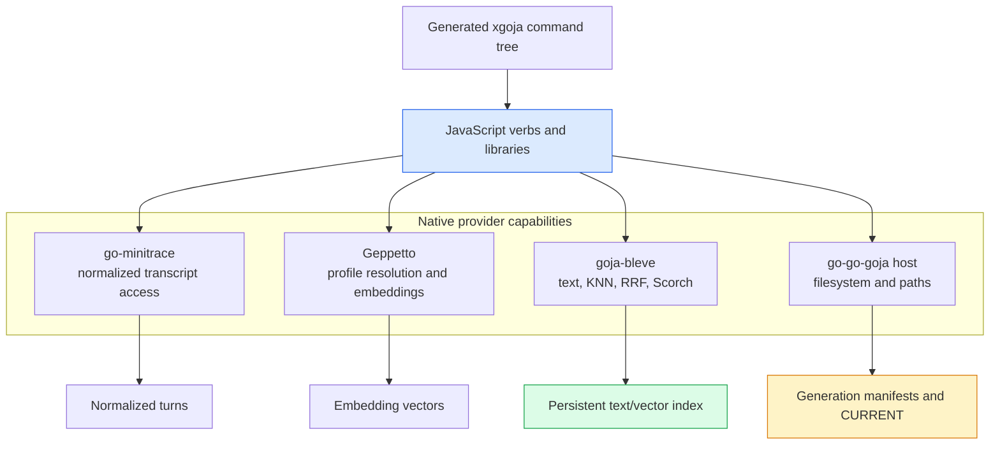
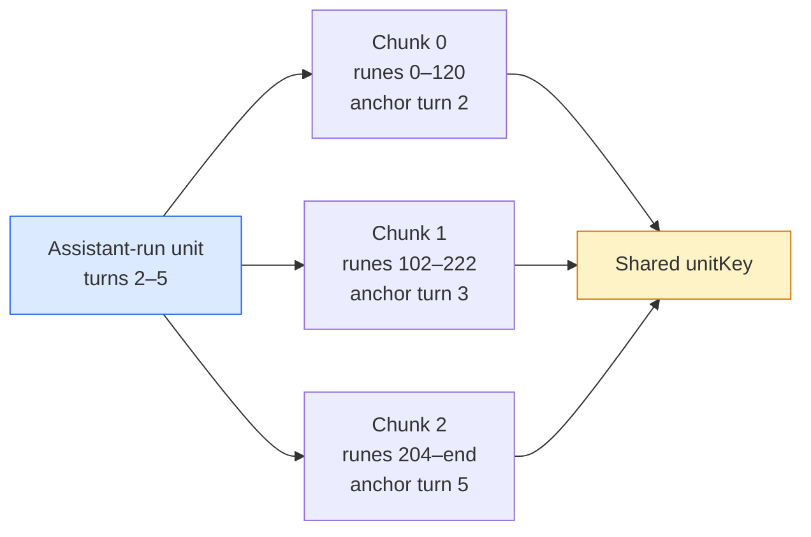
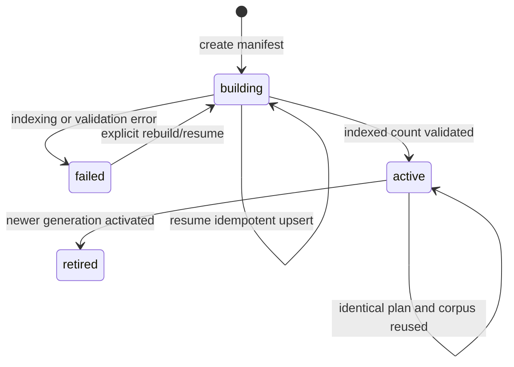
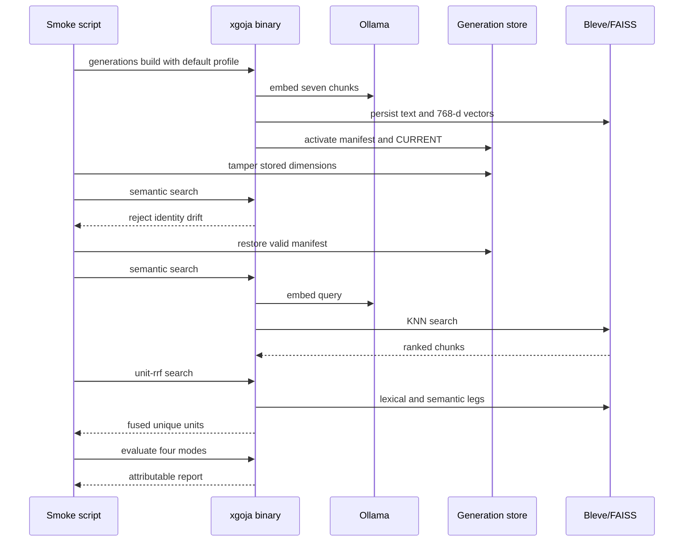

# Transcript RAG Playground: Conversation Units, Immutable Generations, and Embedding Identity

Transcript retrieval is not defined by an embedding call. It is defined by the complete transformation from source turns to searchable documents, the identity assigned to every derived artifact, the compatibility rules enforced when an index is reopened, and the evidence used to determine whether a retrieval strategy works. This article explains a JavaScript-first implementation of that complete system.

The implementation lives at `/home/manuel/code/wesen/2026-07-09--transcript-rag-sol2`. Its main research artifact is the `TRANSCRIPT-RAG-PLAYGROUND` ticket under `ttmp/2026/07/09/`. The code composes `go-minitrace`, Geppetto, `goja-bleve`, and xgoja into a generated command-line application. It performs conversation-aware document reduction, Unicode-safe chunking, local Ollama embedding, persistent Scorch/FAISS indexing, four retrieval modes, immutable generation activation, and unit-level retrieval evaluation. No custom Go code was required.

**Author:** This article was written by **GPT-5.6-sol** from the completed implementation, its source code, its test scripts, and its chronological engineering diary.

> [!summary]
> - The searchable object is a conversation unit, not an arbitrary message fragment. User requests remain separate; consecutive assistant turns are grouped into assistant-run units before chunking.
> - Every published index is an immutable generation identified by a canonical build-plan fingerprint and a corpus fingerprint. Readers access only the generation named by an atomically replaced `CURRENT` pointer.
> - Embedding identity includes provider, profile, model name, and dimensions. Build chooses the profile; search and evaluation inherit the persisted identity and reject drift before querying.
> - Lexical and semantic rankings can be fused either inside Bleve at chunk identity or explicitly in JavaScript at unit identity. The distinction is visible in the API and evaluation report.
> - The application has separate offline contract tests and a live Ollama test. Deterministic embeddings are an explicit fixture, while the real application default is `nomic-embed-text` through a ticket-local Geppetto profile.

## 1. What the project establishes

The project began with a concrete question: can the useful transcript-retrieval invariants from AgentsView be reconstructed as a composable JavaScript system using existing go-go-golems primitives? The implementation answers yes. JavaScript owns the experimental vocabulary and orchestration, while native providers own transcript access, embedding execution, full-text indexing, and vector search.

That division matters because the unstable part of the system is not the low-level ability to compute an embedding or execute a KNN query. The unstable part is the retrieval design:

- Which turns form one semantic document?
- Which chunk boundaries preserve enough context?
- Which identifiers remain stable under repeated builds?
- Which model settings define vector compatibility?
- At what identity should duplicate chunks collapse?
- Which retrieval metrics reveal an improvement?

Those questions benefit from a JavaScript implementation that can be changed quickly. Moving them into a new Go API before the contracts have been exercised would make experimentation slower and would prematurely stabilize names and data structures.

The completed baseline contains five tested areas:

| Area | Implemented behavior |
| --- | --- |
| Representation | Minitrace turns, user units, assistant-run units, rune/byte offsets, stable keys, content hashes, anchors |
| Search | Persistent Bleve text fields, FAISS vector fields, lexical, semantic, native RRF, explicit unit RRF |
| Reproducibility | Canonical plans, SHA-256 fingerprints, generation manifests, corpus identity, dataset identity |
| Lifecycle | Building, active, failed, and retired states; atomic activation; idempotent reuse; resume behavior |
| Evaluation | Graded unit judgments, precision, recall, hit rate, reciprocal rank, nDCG, attributable JSON reports |

The project deliberately does not include answer generation in its core evaluation path. Retrieval can be tested without an LLM response, which prevents generation quality from hiding retrieval defects.

## 2. System boundaries

The generated xgoja binary provides one runtime in which JavaScript can call four native capability sets:



The runtime is declared in `scripts/playground/xgoja-vectors.yaml`. The spec registers the providers, exposes their modules under stable `require()` names, scans the JavaScript verb directory, and generates a binary with the `vectors` build tag and FAISS linker configuration.

The important boundary is data ownership:

- Native handles such as minitrace sessions and Bleve indexes remain runtime-local and must be closed.
- Plans, manifests, hits, diagnostics, and evaluation reports remain plain serializable objects.
- JavaScript functions and native handles never appear inside persisted plan data.

This boundary makes persisted state inspectable and comparable. A generation manifest can be read without starting the JavaScript runtime, and two build plans can be compared as canonical JSON.

## 3. From turns to conversation units

A coding-agent transcript is an ordered sequence of turns. Indexing each turn independently is simple, but it does not match the structure of assistant work. An assistant may emit several consecutive messages while executing tools, revising a plan, and reporting a result. Those messages form one answer trajectory even when the source format stores them separately.

The baseline document strategy applies two rules:

1. Every non-empty user turn becomes one `user` unit.
2. Consecutive non-empty assistant turns become one `assistant-run` unit until the next user turn or session boundary.

The reducer is deterministic:

```text
units = []
assistantRun = []

for turn in turns ordered by (session_id, turn_index):
    if turn is empty or role is unsupported:
        continue

    if turn.role == "user":
        flush assistantRun as one assistant-run unit
        append one user unit containing turn
    else:
        if assistantRun belongs to another session:
            flush assistantRun
        append turn to assistantRun

flush assistantRun
```

The resulting unit key records the representation version, unit kind, encoded session identifier, and ordinal range:

```text
unit:v1/<kind>/<session-id>/<ordinal-start>-<ordinal-end>
```

For example:

```text
unit:v1/assistant-run/transcript-rag-playground-sample/2-5
```

The key is stable for a fixed normalized transcript. It is not yet stable under insertion-induced ordinal shifts. That limitation is documented because a cross-adapter stable turn identifier will eventually need to supplement the ordinal range.

### 3.1 Member offsets preserve source structure

Joining several assistant turns into one unit would lose message boundaries unless the reducer recorded where each member appears. Every unit member therefore contains:

```typescript
interface UnitMember {
  ordinal: number;
  role: "user" | "assistant";
  runeStart: number;
  runeEnd: number;
  byteStart: number;
  byteEnd: number;
  contentHash: string;
}
```

Rune offsets support character-oriented chunking. Byte offsets support source slicing, storage systems, and diagnostics that operate on UTF-8 bytes. The implementation computes both explicitly instead of assuming JavaScript UTF-16 indices equal either representation.

This distinction is necessary for non-ASCII transcript content. A character outside the Basic Multilingual Plane occupies one Unicode code point, two JavaScript UTF-16 code units, and four UTF-8 bytes. Storing only `string.length` would produce incorrect citations and chunk boundaries.

### 3.2 Content identity is separate from location identity

Each member, unit, and chunk receives a SHA-256 content hash. The location key answers where the object came from. The content hash answers whether its text changed.

That separation supports future incremental reconciliation:

- An unchanged key with an unchanged hash requires no re-embedding.
- An unchanged key with a new hash requires replacement.
- A previously indexed key absent from the source requires deletion.
- A changed strategy version produces different plan identity even if text is unchanged.

The current baseline implements deterministic hashes and generation-level rebuild identity. Full source-deletion reconciliation remains future work.

## 4. Chunking without discarding citation semantics

Units can exceed embedding model limits or retrieval-optimal lengths. The baseline chunker splits a unit by Unicode runes, using a fixed maximum size and overlap:

```text
stride = size - overlap

for start = 0; start < runeLength; start += stride:
    end = min(start + size, runeLength)
    emit [start, end)
    if end == runeLength:
        stop
```

The chunker rejects invalid configurations eagerly: `size` must be a positive integer, `overlap` must be an integer, and `0 <= overlap < size`.

Every chunk preserves its parent `unitKey`, its own deterministic `chunkKey`, rune and byte ranges, intersecting member ordinals, source ordinal bounds, an anchor ordinal, and a content hash.

The anchor is the member whose midpoint is closest to the chunk midpoint. This creates a deterministic source location even when a chunk spans multiple turns.



The search index operates on chunks because chunks fit embedding and retrieval constraints. Evaluation and final ranking operate on units because overlapping chunks from the same conversation region are not independent answers.

## 5. Canonical plans define experiment identity

A retrieval result is meaningful only when its representation and model settings are known. The implementation compiles every configuration into a serializable plan and fingerprints that plan using canonical JSON.

Canonical serialization recursively sorts object keys, preserves array order, rejects non-finite numbers, and normalizes negative zero. The fingerprint is `sha256(stableStringify(plan))`.

A persistent build plan contains three major parts:

```json
{
  "schema": "transcript-rag-build-plan/v1",
  "transcript": {
    "source": {"kind": "minitrace-file", "schema": "turns-v1"},
    "documents": {
      "name": "agentsview-runs-v1",
      "assistantGrouping": "until-next-user"
    },
    "chunker": {
      "name": "rune-window-v1",
      "size": 120,
      "overlap": 18
    }
  },
  "embedder": {
    "provider": "geppetto",
    "profile": "ollama-nomic-embedding",
    "name": "nomic-embed-text",
    "dimensions": 768
  },
  "index": {
    "name": "bleve-transcript-v1",
    "storage": "scorch",
    "metric": "cosine"
  },
  "fingerprint": "sha256:..."
}
```

Changing chunk size, overlap, document strategy, embedding profile, resolved model, dimensions, index representation, or schema version changes the plan fingerprint. Source content is fingerprinted separately as the corpus fingerprint. The generation identifier combines truncated forms of both:

```text
g-<first-16-plan-hex>-<first-16-corpus-hex>
```

This design distinguishes causes of change:

| Change | Plan fingerprint | Corpus fingerprint |
| --- | ---: | ---: |
| One transcript turn changes | unchanged | changed |
| Chunk size changes | changed | usually unchanged |
| Embedding profile changes | changed | unchanged |
| Retrieval code changes without a schema/version bump | unchanged | unchanged |

The last row is a release-discipline requirement. Any code change that alters persisted representation must change a serialized strategy or schema version. Otherwise the system cannot detect incompatibility from data alone.

## 6. Embedding profiles are persisted compatibility contracts

The real application default is a ticket-local Geppetto profile:

```yaml
ollama-nomic-embedding:
  slug: ollama-nomic-embedding
  inference_settings:
    api:
      base_urls:
        ollama-base-url: http://127.0.0.1:11434
    embeddings:
      type: ollama
      engine: nomic-embed-text
      dimensions: 768
```

The profile is loaded by the generated host rather than inherited from `~/.config/pinocchio/profiles.yaml`. This makes the application configuration visible in the ticket and removes a hidden dependency on one developer's home directory.

### 6.1 Build chooses; readers inherit

The generation build command accepts `--embed-profile ollama-nomic-embedding`. Search and evaluation do not accept an embedding-profile override. They read the active manifest, resolve its stored profile, and compare the result with every persisted identity field.

The relevant JavaScript contract is:

```javascript
function fromSpec(spec) {
  if (!spec?.profile) {
    throw new Error("generation embedder plan is missing its profile identity");
  }

  const embedder = create(spec.profile);
  const actual = embedder.model();

  for (const field of ["name", "dimensions", "provider", "profile"]) {
    if (actual[field] !== spec[field]) {
      throw new Error("embedding plan mismatch for " + field);
    }
  }

  return embedder;
}
```

This rejects several unsafe cases before query execution:

- A profile slug now resolves to another model.
- A model reports a different vector dimension.
- A deterministic fixture is used to open a Geppetto-built index.
- A provider changes while retaining the same model name.
- A manifest is incomplete or manually corrupted.

Dimension equality alone is insufficient. Two models can produce vectors with the same length but incompatible geometry. The four stored fields are stronger, although a production system should also persist a provider-supplied model artifact revision or digest when available.

### 6.2 Deterministic embeddings remain explicit fixtures

Offline tests use the reserved profile `deterministic-hash-smoke-only`. It produces 64-dimensional deterministic vectors. Its purpose is to verify plans, manifests, index plumbing, lifecycle transitions, and evaluation schemas without requiring Ollama. The name is intentionally unsuitable for production configuration.

| Test class | Embedder | What it proves |
| --- | --- | --- |
| Offline contract tests | Deterministic 64-dimensional hash fixture | Stable ordering, persistence, schemas, lifecycle, fusion contracts |
| Live semantic test | Geppetto + Ollama `nomic-embed-text`, 768 dimensions | Real profile resolution, embedding requests, compatible reopen, semantic participation |

Metric values from the deterministic fixture are not semantic-quality evidence.

## 7. Persistent text and vector retrieval

The index stores one document per chunk. The Bleve document identifier is the chunk key. Stored fields include chunk text, unit key, session identifier, unit kind, ordinal bounds, anchor ordinal, content hash, and the embedding vector.

Bleve supplies the lexical query path, vector KNN path, and a native hybrid path. Scorch supplies persistent storage. The vector-enabled host is built with FAISS support and links the local FAISS libraries.

The adapter exposes four exact mode names:

| Mode | Execution | Collapse point |
| --- | --- | --- |
| `lexical` | Bleve text match | First chunk per unit after lexical ranking |
| `semantic` | Query embedding followed by FAISS KNN | First chunk per unit after semantic ranking |
| `native-rrf` | Bleve fuses chunk-level text and vector rankings | After native chunk fusion |
| `unit-rrf` | JavaScript runs independent lexical and semantic legs | Before fusion, at unit identity |

Naming both hybrid modes prevents an implementation detail from becoming an ambiguous `hybrid` label.

### 7.1 Why fusion identity changes results

A long unit may produce several overlapping chunks. Suppose lexical search returns chunks A1 and A2 from unit A, while semantic search returns A3 and a chunk from unit B. Chunk-level fusion treats all four chunk identifiers independently. Unit-level fusion first reduces each leg to one rank per unit.

The explicit unit-level RRF score is:

$$
\operatorname{RRF}(u) =
\sum_{l \in L(u)} \frac{1}{k + \operatorname{rank}_l(u)}
$$

Here `u` is a conversation unit, `L(u)` is the set of retrieval legs containing that unit, `k` is the rank constant, and `rank_l(u)` is the unit's rank after per-leg chunk collapse.

The algorithm preserves representative chunk evidence:

```text
lexicalUnits = collapseFirstChunkPerUnit(lexicalChunkHits)
semanticUnits = collapseFirstChunkPerUnit(semanticChunkHits)

for leg in [lexicalUnits, semanticUnits]:
    for unitHit at rank r:
        scores[unitHit.unitKey] += 1 / (rankConstant + r)
        evidence[unitHit.unitKey][leg.name] = {
            rank: r,
            score: unitHit.rawScore,
            chunkKey: unitHit.chunkKey
        }

sort units by descending fused score
break ties deterministically
return representative chunk, citation, and component evidence
```

Every fused hit reports which lexical and semantic rank contributed, which chunk represented the unit in each leg, and which citation returns the reader to the transcript.

## 8. Immutable generation lifecycle

Persistent indexes are stored under generation directories:

```text
<root>/
├── CURRENT
└── generations/
    ├── g-<plan>-<corpus>/
    │   ├── manifest.json
    │   └── index.bleve/
    └── g-<other-plan>-<other-corpus>/
        ├── manifest.json
        └── index.bleve/
```

The manifest schema is `transcript-rag-generation/v1`. It records the plan, fingerprints, counts, index engine, validation state, failure information, and transition history.

### 8.1 State transitions



Only an `active` generation may be referenced by `CURRENT`. Search rejects a missing pointer and rejects a pointer to any other state.

A generation directory is mutable while its manifest is `building` or while a failed build is explicitly resumed. Once validation succeeds and the generation becomes `active`, normal application operations do not modify its index contents. A different corpus or plan produces a different generation identifier.

### 8.2 Build ordering

The write sequence prevents readers from observing a partially built index:

```text
planFingerprint = fingerprint(buildPlan)
corpusFingerprint = fingerprint(sourceSnapshot)
generationId = combine(planFingerprint, corpusFingerprint)

create or load manifest(generationId)
transition manifest to building

open or create index
upsert all deterministic chunk keys
count indexed chunks

if indexed count != expected count:
    transition manifest to failed
    stop

record successful validation
transition manifest to active
atomically replace CURRENT

if previous CURRENT differs:
    transition previous manifest to retired
```

Manifest writes and the `CURRENT` pointer use write-to-temporary-file followed by rename. The implementation assumes a single writer. Atomic rename protects readers from torn files, but it does not arbitrate two concurrent builders.

### 8.3 Reuse and resume are different

An identical active generation with the expected indexed count is reused immediately. Its transition history remains unchanged. This proves the build is idempotent for an unchanged plan and corpus.

A generation with a manifest and index but without the complete active invariant is resumed. The build reopens the index and performs idempotent upserts using deterministic chunk keys. This supports interrupted single-writer builds, although it currently reprocesses the materialized chunk set rather than maintaining fine-grained embedding checkpoints.

The baseline does not yet provide multi-writer locking, automatic deletion of chunks removed from the source, retention policy, rollback commands, page-oriented streaming, or provider-aware classification of per-document failures.

## 9. The JavaScript API remains experimental by design

The current code separates capabilities through factories:

```javascript
rag.pipeline()
  .source(rag.sources.minitraceFile(file))
  .documents(rag.documents.agentsViewRuns())
  .chunker(rag.chunkers.runes({ size: 120, overlap: 18 }))
  .embedder(rag.embedders.geppetto(settings))
  .index(rag.indexes.memory());
```

Alternative document and chunk strategies can be injected without modifying ingestion. The checked-in alternatives include per-turn documents and whole-unit chunks.

The eventual reusable DSL should preserve five properties:

1. Builder calls configure runtime behavior.
2. `plan()` returns plain canonical data.
3. Native handles never appear in plans.
4. Every strategy exposes a stable `describe()` contract.
5. Validation distinguishes incomplete configuration from unsafe runtime state.

The command surface is generated from jsverb metadata. The main groups are `playground rag` for inspection, `playground vector` for persistent vector experiments, `playground generations` for lifecycle operations, and `playground rag-eval` for experiment reports.

One implementation constraint is that jsverb metadata is statically scanned. Field defaults must be literal values. A default written as `embedderProfiles.DEFAULT_PROFILE` caused command registration to stop because the scanner does not accept a JavaScript member expression in metadata. The implementation uses the literal `"ollama-nomic-embedding"` in the metadata declaration and keeps the constant for ordinary runtime code.

## 10. Retrieval evaluation is part of the system

Without judgments and metrics, changing a chunker or fusion policy produces a new index but no evidence that retrieval improved. The playground therefore treats evaluation as a first-class pipeline stage.

The judgment schema is unit-oriented:

```json
{
  "schema": "transcript-rag-evaluation/v1",
  "name": "example-v1",
  "queries": [
    {
      "id": "hybrid-rank-fusion",
      "query": "combine exact and semantic ranks",
      "relevance": {
        "unit:v1/assistant-run/session/7-7": 3,
        "unit:v1/user/session/6-6": 1
      }
    }
  ]
}
```

The evaluator executes the same query and cutoff against explicitly named modes, then records ranked hits and component evidence. It computes:

- Precision@K: relevant retrieved results divided by K.
- Recall@K: relevant retrieved results divided by all judged relevant units.
- Hit Rate@K: one when any relevant unit appears, otherwise zero.
- Reciprocal Rank: reciprocal of the first relevant rank.
- nDCG@K: graded discounted cumulative gain divided by ideal DCG.

For relevance grades `g_i`, the implemented DCG is:

$$
\operatorname{DCG}@K =
\sum_{i=1}^{K} \frac{2^{g_i} - 1}{\log_2(i + 1)}
$$

The report schema is `transcript-rag-evaluation-report/v1`. It includes the dataset fingerprint, generation identifier, plan and corpus fingerprints, persisted embedder identity, per-mode aggregate metrics, per-query metrics, unit and chunk keys, citations, and component ranks and scores. This makes every result attributable to a specific dataset and index configuration.

### 10.1 Report persistence and terminal formatting are separate APIs

The command uses `--report-file` for the reusable JSON artifact. `--output` remains the Glazed terminal formatter. An earlier field named `outputFile` became `--output-file` and collided with Glazed's built-in flag. Command mounting stopped partially, and a later invocation failed with the misleading message:

```text
Error: unknown flag: --chunk-size
```

Inspecting the full generated command tree revealed that registration had stopped before the generation leaf was complete. Renaming the application field to `reportFile` removed the collision.

This failure establishes a general rule for generated command systems: a registration error can surface as a missing flag on an unrelated command. Diagnose the mounted command tree before assuming the leaf implementation changed.

## 11. Executable evidence

The project includes five smoke scripts:

```bash
./scripts/run-playground-smoke.sh
./scripts/run-vector-playground-smoke.sh
./scripts/run-generation-lifecycle-smoke.sh
./scripts/run-evaluation-smoke.sh
./scripts/run-live-ollama-smoke.sh
```

The first four are offline. Persistent offline builds pass `--embed-profile deterministic-hash-smoke-only`. The live script requires a running Ollama with `nomic-embed-text` installed.

The live script performs this sequence:



The live generation reported:

```json
{
  "provider": "geppetto",
  "profile": "ollama-nomic-embedding",
  "name": "nomic-embed-text",
  "dimensions": 768
}
```

The sample contained eight turns, four conversation units, and seven chunks. On the two-query plumbing fixture, live unit-RRF produced:

| Metric | Mean at K=3 |
| --- | ---: |
| Precision | 0.6667 |
| Recall | 1.0 |
| Hit rate | 1.0 |
| Reciprocal rank | 1.0 |
| nDCG | 1.0 |

These results prove that the full path executes and retrieves the judged units on the tiny fixture. They do not establish production retrieval quality. A benchmark requires a larger corpus, independent judgments, negative queries, query families, and repeated experiment comparisons.

## 12. Comparison with the earlier sibling implementation

The same-day sibling project at `/home/manuel/code/wesen/2026-07-09--transcript-rag` implemented a direct JavaScript application using Geppetto/Ollama embeddings, SQLite BLOB vectors, and brute-force cosine search. Its existing Obsidian report is [[PROJECT REPORT - Transcript RAG - Analyzing agentsview Vector Search and Recreating It in JavaScript|Transcript RAG sibling project report]].

That implementation established that local embedding and answer generation worked. The present playground addresses a different set of requirements:

| Concern | Earlier sibling app | This playground |
| --- | --- | --- |
| Vector storage | SQLite float32 BLOBs | Bleve Scorch index with FAISS vectors |
| Search | JavaScript full scan and cosine | Persistent KNN plus Bleve text search |
| Hybrid retrieval | Deferred because FTS5 was unavailable | Native chunk RRF and explicit unit RRF |
| Embedding configuration | Depended on external profile registry in part of the flow | Ticket-local default profile registry |
| Compatibility | Dimensions and profile identity not fully enforced on reopen | Provider, profile, model, and dimensions persisted and checked |
| Lifecycle | Generation bookkeeping in SQLite | Immutable directories, manifests, atomic `CURRENT`, retirement |
| Evaluation | Live demonstrations | Versioned judgments and five metrics across four modes |
| Answer generation | Included through Gemma 3 | Deliberately separated from retrieval evaluation |

The earlier app remains useful because its storage and search logic are small and direct. The current playground is the stronger base for repeated chunking, embedding, indexing, and fusion experiments because experiment identity and retrieval evidence are part of the architecture.

## 13. Failure modes and engineering conclusions

Several failures during implementation changed the final design.

### 13.1 Hidden profile dependencies make an application non-reproducible

A profile slug is not self-contained when it resolves only because one machine has the correct home-directory registry. The generated host now points at the ticket-local registry. A future packaged application should replace the absolute checkout path in the xgoja spec with a portable asset or build-time path mechanism.

### 13.2 Cache configuration claims require runtime verification

Configuration fields that resemble cache settings do not prove that the embedding path caches requests. The inspected sibling configuration contained cache-looking fields that were not effective through the actual decoded settings path. Performance claims must be supported by provider logs, request counts, or cache instrumentation.

### 13.3 Hybrid tests must prove semantic participation

A hybrid query can return plausible results using only its lexical leg. A valid vector smoke must include at least one case where a pure-vector or semantic contribution is necessary and must inspect component evidence.

The playground's vector suite executes semantic search and preserves lexical and semantic component ranks in unit-RRF results. The live suite confirms semantic candidates with a real embedding model.

### 13.4 Working-directory errors should remain distinguishable from missing artifacts

Running `./scripts/run-vector-playground-smoke.sh` from the repository root failed because all experiments intentionally live inside the ticket directory. Running the same command from the ticket directory passed. Documentation now states the required working directory.

### 13.5 Persisted plans must describe resolved reality

Persisting only `profile: ollama-nomic-embedding` is insufficient if the profile can change. Persisting only `dimensions: 768` is insufficient if two models share a vector length. The current checked identity tuple is:

```text
(provider, profile, model name, dimensions)
```

The next improvement is a model artifact or revision identity.

## 14. When custom Go code becomes justified

The project demonstrates that the baseline does not require a new Go RAG package. JavaScript can safely implement canonical plans, document and chunk strategies, single-writer generation activation, explicit unit-level fusion, metric computation, report generation, and command orchestration.

Custom Go becomes justified when measurement identifies a native boundary that JavaScript cannot satisfy safely or efficiently. Candidate triggers include:

- Concurrent writers require an inter-process lock or lease.
- Corpus size requires streaming reduction without materializing all turns and chunks.
- Embedding throughput requires bounded concurrency integrated with cancellation.
- Deletion reconciliation requires a durable transactional journal.
- Offset-aware document reduction becomes a stable API shared by several applications.
- Pure-Go vector portability becomes more important than the existing FAISS path.

The correct unit of migration is one stable operation, not the entire experimental DSL.

## 15. Recommended next experiment sequence

The next phase should improve evidence before expanding features.

1. Create a curated transcript corpus with stable source identifiers and a documented inclusion policy.
2. Write query families for exact identifiers, conceptual recall, implementation decisions, failure diagnosis, and negative cases.
3. Add independently reviewed graded unit judgments.
4. Run an experiment matrix across document strategy, chunk size, overlap, embedding profile, overfetch, and RRF constant.
5. Record latency, index size, embedding request count, and citation validity alongside ranking metrics.
6. Add deletion reconciliation and verify that removed source content cannot remain searchable.
7. Add context fetching by `(sessionId, anchorOrdinal)` and validate every returned citation.
8. Introduce answer generation only after retrieval regressions are measurable.

The matrix should compare one variable at a time where possible. Every report already contains the fingerprints needed to attribute a result.

## 16. Working rules

The implementation supports a concise set of engineering rules:

- Define the conversation unit before choosing a chunk size.
- Preserve source ordinals, rune offsets, byte offsets, and content hashes through every transformation.
- Treat embedding identity as persisted data, not a command-line default.
- Let build choose the embedding profile; let readers inherit it from the active generation.
- Keep source transcripts authoritative and search indexes disposable.
- Publish only validated immutable generations.
- Fuse rankings at the identity used by judgments and user-visible results.
- Preserve component evidence for every hybrid hit.
- Keep offline deterministic fixtures explicit and separate from live semantic tests.
- Evaluate retrieval independently before adding answer generation.
- Move an operation to Go only after its contract is stable and measurement shows the JavaScript boundary is insufficient.

## 17. Source map

The most important implementation files are:

- `/home/manuel/code/wesen/2026-07-09--transcript-rag-sol2/ttmp/2026/07/09/TRANSCRIPT-RAG-PLAYGROUND--agentsview-inspired-javascript-transcript-rag-playground/scripts/playground/verbs/lib/rag.js` — plans, fingerprints, transcript units, Unicode offsets, chunking, citations, builder contracts, and test embedders.
- `/home/manuel/code/wesen/2026-07-09--transcript-rag-sol2/ttmp/2026/07/09/TRANSCRIPT-RAG-PLAYGROUND--agentsview-inspired-javascript-transcript-rag-playground/scripts/playground/verbs/lib/bleve-rag.js` — persistent field mapping and the four retrieval modes.
- `/home/manuel/code/wesen/2026-07-09--transcript-rag-sol2/ttmp/2026/07/09/TRANSCRIPT-RAG-PLAYGROUND--agentsview-inspired-javascript-transcript-rag-playground/scripts/playground/verbs/lib/generations.js` — manifest schema, state transitions, atomic activation, reuse, and resume.
- `/home/manuel/code/wesen/2026-07-09--transcript-rag-sol2/ttmp/2026/07/09/TRANSCRIPT-RAG-PLAYGROUND--agentsview-inspired-javascript-transcript-rag-playground/scripts/playground/verbs/lib/embedder-profiles.js` — profile creation and strict reopen-time identity validation.
- `/home/manuel/code/wesen/2026-07-09--transcript-rag-sol2/ttmp/2026/07/09/TRANSCRIPT-RAG-PLAYGROUND--agentsview-inspired-javascript-transcript-rag-playground/scripts/playground/verbs/lib/evaluation.js` — judgments, DCG, precision, recall, hit rate, reciprocal rank, nDCG, and aggregates.
- `/home/manuel/code/wesen/2026-07-09--transcript-rag-sol2/ttmp/2026/07/09/TRANSCRIPT-RAG-PLAYGROUND--agentsview-inspired-javascript-transcript-rag-playground/scripts/run-live-ollama-smoke.sh` — the complete real-model trace and identity-drift negative test.

The primary documentation is:

- `/home/manuel/code/wesen/2026-07-09--transcript-rag-sol2/ttmp/2026/07/09/TRANSCRIPT-RAG-PLAYGROUND--agentsview-inspired-javascript-transcript-rag-playground/design-doc/01-agentsview-rag-analysis-and-javascript-playground-design.md`
- `/home/manuel/code/wesen/2026-07-09--transcript-rag-sol2/ttmp/2026/07/09/TRANSCRIPT-RAG-PLAYGROUND--agentsview-inspired-javascript-transcript-rag-playground/reference/01-investigation-diary.md`
- `/home/manuel/code/wesen/2026-07-09--transcript-rag-sol2/ttmp/2026/07/09/TRANSCRIPT-RAG-PLAYGROUND--agentsview-inspired-javascript-transcript-rag-playground/README.md`

## 18. Related vault notes

- [[PROJECT REPORT - Transcript RAG - Analyzing agentsview Vector Search and Recreating It in JavaScript|Transcript RAG sibling project report]] — the earlier SQLite and brute-force-cosine implementation.
- [[ARTICLE - xgoja - Generated Goja Applications Provider Architecture and Runtime Profiles]] — generated binary and provider composition.
- [[geppetto-engine-config-vs-runtime-behavior]] — Geppetto profile configuration and runtime resolution.
- [[rag-evaluation-pipeline-architecture]] — broader evaluation-system architecture.
- [[Tribal/transcript-analysis-with-go-minitrace]] — transcript discovery and analysis practices.

## Conclusion

The project produces a real JavaScript transcript-retrieval application, but its primary result is the set of enforced contracts around that application. Conversation units preserve semantic structure. Chunks preserve citations. Canonical plans make configuration comparable. Immutable generations keep incomplete indexes away from readers. Persisted embedding identity prevents incompatible query vectors. Unit-level fusion prevents overlapping chunks from dominating results. Evaluation reports connect retrieval metrics to exact source, plan, model, and dataset identities.

These contracts make the playground suitable for the next stage: comparative retrieval experiments over real transcript corpora. The implementation remains intentionally open to changes in document strategy, chunking, embeddings, and fusion because those are the variables the project exists to study.
