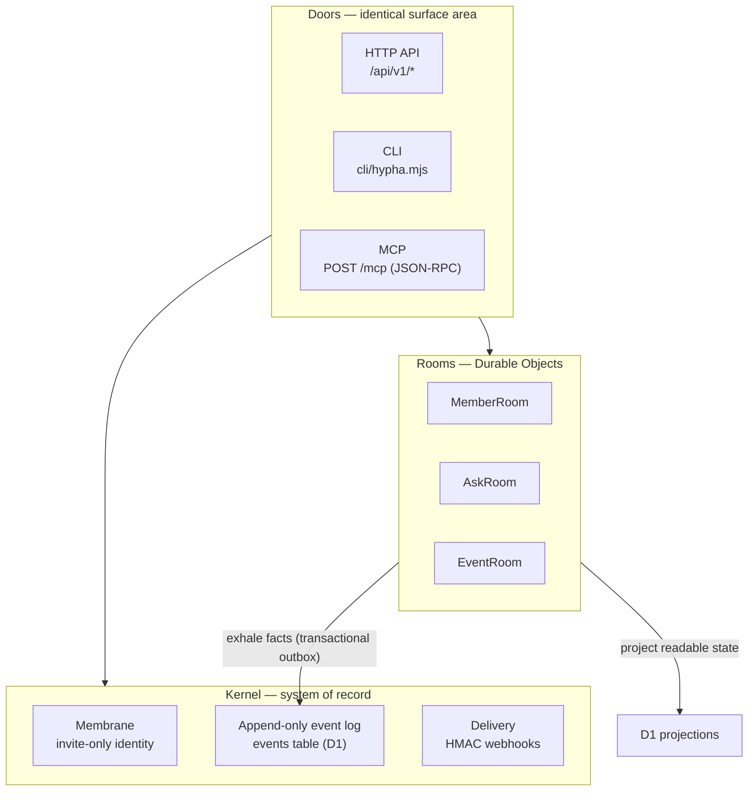
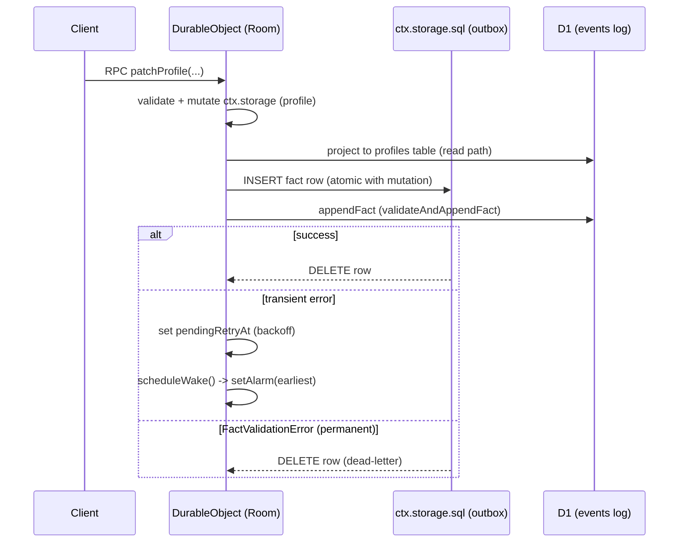
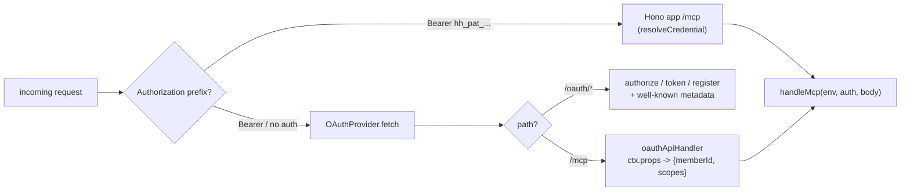

# PROJECT REPORT - Hypha Kernel - Deploying, Self-Hosting, and the Cloudflare Runtime Coupling

This report explains the Hypha kernel as a deployable system: what it is, how it is coupled to the Cloudflare Workers runtime, exactly what an operator must provision to deploy their own instance, whether the system can be hosted on open-source infrastructure instead of Cloudflare, and how OAuth could be reintroduced for browser clients. The kernel is the server that powers `hyphahypha.club`, a trust-network-first, invite-only social network. Its source lives at `moldandyeast/hypha` and is forked to `wesen/hypha` at `/home/manuel/code/wesen/hypha`, synced to upstream main at commit `a8be962`.

The report is written for an engineer who needs to understand, deploy, modify, or port the system. It does not use analogies. Each subsystem is explained in its own terms, then connected to the others with schema, code, diagrams, and a verified local trace. The analysis is evidence-backed against the current upstream source, and a separate finding — that OAuth was removed from the current deployment — is documented precisely so a future browser-client effort does not assume it exists.

> [!summary]
> - Hypha is a single Cloudflare Worker built on four Cloudflare primitives: D1 (serverless SQLite), Durable Objects (three stateful room classes), Email Sending, and a Cron Trigger. The entire social product is a projection over one append-only event log.
> - The Durable Object layer is the load-bearing subsystem and the reason a non-Cloudflare port is hard. A base `Room` class implements a transactional outbox, an alarm multiplexer, and exactly-once append through idempotency keys. This invariant is the part a port must preserve.
> - Authentication is PAT-only in the current upstream. The OAuth 2.1 + PKCE + dynamic-client-registration flow that once ran on the live server lived in the older `time-debt` deployment (server v0.1.0) and was not carried forward into the v0.5.0 `hypha` kernel. There is also no CORS, so a static browser SPA cannot call the API directly today.
> - Deploying your own instance is a bounded procedure: create a D1 database, set two secrets, edit `wrangler.toml`, apply remote migrations first, then `wrangler deploy`. The fork was validated locally: all ten migrations applied and the smoke test passed end-to-end on port 8799.

## Current status

The work is a complete analysis and a validated local run, not a production deployment. The `wesen/hypha` fork is synced to upstream main and boots end-to-end on the local Miniflare emulator. A deploy runbook (`docs/DEPLOY.md`) has been committed to the fork. The full design doc and a six-step investigation diary live in the docmgr ticket `HYPHA-DEPLOY`. No production instance has been created; that step requires the operator's Cloudflare account.

| Artifact | Location | State |
| --- | --- | --- |
| Upstream source | `moldandyeast/hypha` (main `a8be962`) | read-only reference |
| Fork | `wesen/hypha` → `/home/manuel/code/wesen/hypha` | synced, pushed (`8d0d1d3`) |
| Deploy runbook | `docs/DEPLOY.md` in the fork | committed |
| Design doc + diary | docmgr ticket `HYPHA-DEPLOY` | written, doctor-clean |
| reMarkable bundle | `/ai/2026/07/09/HYPHA-DEPLOY` | uploaded |
| Local validation | `wrangler dev --port 8799` + `scripts/smoke.sh` | `smoke: OK` |

## What Hypha is

Hypha is an append-only event log wrapped in an invite-only identity membrane, with push delivery, exposed through three input adapters that all reduce to the same operations. The social product visible at `hyphahypha.club` — member profiles, time-debt balances, a trust graph, ISO ("in search of") boards, and gig bounties — is computed entirely from that log. The log is the system of record. Everything else is a cache or a view that could be recomputed from it.

This separation is the central design decision. There is exactly one growing table of immutable facts, and every derived number — a member's balance, the trust edges between two people, the open ISOs on a board — is a query over that table. The benefit is not aesthetic. It means the data is portable: a member can export every event they authored, and an operator can move the log to a new database and rebuild the projections. It also means the data is auditable: a cumulative hash over the log lets a member prove that no fact was silently deleted or altered.

The three input adapters are called doors in the project's own terminology. They are not separate systems; they are three shapes over the same kernel.



A door is a thin adapter. The HTTP API (`src/api/*.ts`), the CLI (`cli/hypha.mjs`), and the MCP handler (`src/mcp/handler.ts`) all check the same scopes and append the same events. Nothing in a door is authoritative. A door is an input/output shape over the kernel, and the kernel is the log.

## The append-only event log

The single most important table in the system is `events`. Its schema, from `migrations/0001_kernel.sql`, defines what a fact is:

```sql
CREATE TABLE events (
  id           TEXT PRIMARY KEY,               -- ULID: sortable = time-ordered
  ts           INTEGER NOT NULL,
  actor        TEXT NOT NULL,
  verb         TEXT NOT NULL,                  -- post | invite | connect | ...
  kind         TEXT,
  target       TEXT,
  ref          TEXT,
  topics       TEXT,                           -- JSON array of normalized topics
  audience     TEXT NOT NULL DEFAULT 'circle', -- 'circle' | member id
  value_amount REAL,
  value_unit   TEXT,
  body         TEXT,
  redacted     INTEGER NOT NULL DEFAULT 0,
  idem_key     TEXT
);
CREATE UNIQUE INDEX idx_events_idem ON events(actor, idem_key) WHERE idem_key IS NOT NULL;
```

Four properties of this schema matter for everything that follows.

The primary key is a ULID, generated in `src/domain/ulid.ts`. A ULID is sortable, so ordering by `id` is also ordering by time. This is why export pagination can follow a cursor ordered by `id` and produce a chronologically correct stream without a separate timestamp sort.

The `idem_key` column, combined with the unique index on `(actor, idem_key)`, gives exactly-once append. A retried write with the same actor and idempotency key is a no-op rather than a duplicate. This contract is what makes the Durable Object outbox safe to retry: a room can attempt to append a fact, fail, and try again without risk of writing the fact twice. The idempotency key is the deduplication boundary.

Redaction preserves facts. The `redact` operation blanks `body` and `topics` but never touches `id`, `ts`, `actor`, `verb`, `target`, or the `value_*` fields. The fact that something happened is immutable; only the content can be removed. This is why the integrity checkpoint hash excludes `body`, `topics`, `audience`, and `redacted` — those fields can change legitimately, so including them would break the hash on every redaction.

The `audience` field controls visibility. A value of `circle` means the event is visible to every member. A member id means the event is directed and private — this is how a gig application is delivered to a poster without exposing it to the circle.

## Identity and credentials

Members live in the `members` table. Credentials live in `credentials`:

```sql
CREATE TABLE credentials (
  id         TEXT PRIMARY KEY,
  member_id  TEXT NOT NULL REFERENCES members(id),
  token_hash TEXT NOT NULL UNIQUE,   -- a hash, never the token itself
  scopes     TEXT NOT NULL,          -- comma list, e.g. "read,write,value,graph"
  label      TEXT,
  created_at INTEGER NOT NULL,
  revoked_at INTEGER
);
```

The system stores a hash of each token, never the token. Authentication hashes the incoming bearer string and looks it up by `token_hash`. The implementation is in `src/api/auth.ts`:

```ts
export async function authenticate(env: Env, req: Request): Promise<Auth | null> {
  const h = req.headers.get("Authorization");
  if (!h?.startsWith("Bearer ")) return null;
  const auth = await resolveCredential(env.DB, h.slice(7));   // hash + D1 lookup
  if (auth) await bumpLastActive(env.DB, auth.member.id).catch(() => {});
  return auth;
}
```

There is no second authentication path in this codebase. A grep for `workers-oauth-provider` or `/oauth/` across `src/` returns no matches, and `package.json` lists only `hono` and `mimetext` as runtime dependencies. The current upstream authenticates personal access tokens and nothing else.

Scopes are the authorization unit. There are four non-admin scopes — `read`, `write`, `value`, and `graph` — plus `admin`. A minted credential must carry a strict subset of the scopes of the credential that minted it. A read-only key minted from a root key can never escalate to `value` or `graph`. The root credential minted at invite acceptance carries `read, write, value, graph`; it is the member's full authority in the circle and must be protected accordingly.

The browser login flow is not OAuth. It is a self-rolled magic link, implemented in `src/web/login.ts`. A member enters an email at `/login`; the server signs a fifteen-minute HMAC token and emails a link of the form `https://<BASE_URL>/auth#<token>`. The fragment is posted to `/auth`, the token is verified, and a session cookie is set. The token signing and verification use HMAC-SHA256 in `src/domain/tokens.ts`, producing a `body.exp.sig` string. This is a session, not an authorization grant.

## The Durable Object Rooms layer

The Rooms layer is the subsystem that determines whether the system can run anywhere other than Cloudflare. Understanding it is the prerequisite for any porting decision. A room is a Durable Object: a stateful, single-threaded-per-key actor with its own transactional SQLite storage and an alarm scheduler. There are three room classes — `MemberRoom`, `AskRoom`, and `EventRoom` — and they all extend a common base class, `Room`, defined in `src/rooms/base.ts`.

### Why the outbox exists

A room holds state that is not yet a durable log fact, or that may never become one. A member editing their profile, an open ISO accumulating replies, and a scheduled expiry are all room state. When a room accepts a user action, it must do two things: mutate its own state, and record a durable fact in the log. If it did the second directly — writing to the `events` table immediately — it would face a problem. The state mutation and the log append are two operations against two different stores, and they can fail independently. If the state mutation succeeds and the log append fails, the room's state diverges from the log. If the log append succeeds and the state mutation is lost, the log records a fact the room does not reflect.

The transactional outbox solves this. The room writes the intended fact into an `outbox` table that lives inside the room's own SQLite storage, in the same transaction as the state mutation. Because Durable Object storage is transactional, the state change and the outbox insert succeed or fail together. A separate flush step then appends each outbox row to the D1 log and deletes the row on success. If the flush fails transiently, the row remains; the room schedules an alarm and retries.



The base class constructor creates the outbox table and runs orphan recovery before any RPC is handled:

```ts
export class Room extends DurableObject<Env> {
  constructor(ctx: DurableObjectState, env: Env) {
    super(ctx, env);
    this.ctx.storage.sql.exec(
      "CREATE TABLE IF NOT EXISTS outbox (id INTEGER PRIMARY KEY AUTOINCREMENT, fact TEXT NOT NULL, attempts INTEGER NOT NULL DEFAULT 0, created_at INTEGER NOT NULL)",
    );
    this.ctx.blockConcurrencyWhile(() => this.recoverOrphanedOutbox());
  }
}
```

The `blockConcurrencyWhile` call is deliberate. It guarantees that orphan recovery completes before the room handles any request. Without it, a room reconstructed after an isolate eviction might serve a request while it still had pending outbox rows and no alarm scheduled, losing the retry.

### Exactly-once append

The combination of four mechanisms gives exactly-once append despite failures and evictions. First, a Durable Object is single-writer-per-key: only one mutation runs against a given room at a time. Second, the outbox insert is atomic with the state mutation because both live in the room's transactional SQLite. Third, the outbox row id is an `AUTOINCREMENT` value, which is never reused, so the idempotency key derived from it is stable across retries. Fourth, the log's unique index on `(actor, idem_key)` makes a retried append a no-op.

The flush step constructs the idempotency key from the room id and the row id:

```ts
await this.appendFact({
  ...(JSON.parse(row.fact) as FactInput),
  idemKey: `room:${this.ctx.id.toString()}:${row.id}`,
});
```

If the append succeeds, the row is deleted. If it throws a `FactValidationError`, the fact itself is invalid — for example, it would mint hours the member is not allowed to mint — and the row is dead-lettered (deleted, never retried). Any other error is transient; the row is kept, a backoff retry time is recorded, and the alarm is rescheduled.

### The alarm multiplexer

A room must wake itself to retry a failed flush or to run lifecycle work such as an ISO expiry. Durable Objects provide exactly one alarm per object. The base class centralizes alarm scheduling in a single method, `scheduleWake`, which computes the earliest of two candidate wake times: the outbox retry time, and the subclass's lifecycle wake time. If there are no candidates, the alarm is deleted. There are no standing heartbeats; a closed, expired, or drained room holds no alarm and consumes no scheduled wakeups.

```ts
protected async scheduleWake(): Promise<void> {
  const candidates = [this.pendingRetryAt, await this.lifecycleWakeAt()].filter(
    (t): t is number => t != null,
  );
  if (candidates.length === 0) {
    await this.ctx.storage.deleteAlarm();
    return;
  }
  await this.ctx.storage.setAlarm(Math.min(...candidates));
}
```

This design has a cost rule that is enforced throughout the rooms: a room never serves reads. The `MemberRoom` in `src/rooms/member.ts` holds a member's extended profile, but every read — whois, member pages, the directory, export — reads from a D1 `profiles` projection, not from the room. When `patchProfile` accepts a change, it mutates the room state, writes the projection to D1, and emits a fact. The projection is what makes reads cheap: a read never wakes a Durable Object.

### What a port must preserve

The four Cloudflare-specific capabilities a room depends on are not thin wrappers. They are the concurrency and durability model. `DurableObject` from `cloudflare:workers` is the class itself. `ctx.storage.sql` is transactional SQLite inside the object. `ctx.storage` is transactional key-value storage. `ctx.storage.setAlarm` and the `alarm()` callback are the scheduler. The transactional outbox, the alarm multiplexer, and exactly-once append all rest on the single-writer-per-key guarantee that Durable Objects provide. A port that does not preserve single-writer-per-key and atomic state-and-outbox mutation does not preserve the integrity invariant.

## The worker entry and scheduled work

The worker entry, `src/index.ts`, exports a `fetch` handler and a `scheduled` handler. The `fetch` handler is the Hono application built by `buildApp()`. The `scheduled` handler runs on the hourly cron and does three things:

```ts
export default {
  fetch: app.fetch,
  async scheduled(_event: ScheduledEvent, env: Env, ctx: ExecutionContext) {
    ctx.waitUntil(sweep(env));            // webhook delivery sweep
    ctx.waitUntil(writeCheckpoint(env));  // cumulative SHA-256 over the log
    ctx.waitUntil(pruneThrottles(env.DB).catch(() => {}));
  },
};
```

There is no long-running process. The worker is invoked per request and per cron tick. The cron trigger is declared in `wrangler.toml` as `crons = ["0 * * * *"]` and is configured automatically when the worker is deployed. The three scheduled jobs deliver pending webhooks, write an integrity checkpoint, and prune the throttle table that rate-limits logins and other actions.

## The Cloudflare binding surface

Every external dependency the worker needs is declared in `wrangler.toml` and typed in `src/env.ts`. The `Env` interface is the complete binding contract:

```ts
export interface Env {
  DB: D1Database;
  SECRET: string;            // signs PAT and session tokens (HMAC-SHA256)
  ADMIN_TOKEN: string;      // gates /admin
  UNIT_ALLOWLIST?: string;  // default "hours,kudos"
  BASE_URL?: string;
  FROM_EMAIL?: string;
  EMAIL?: SendEmail;
  MEMBER_ROOMS: DurableObjectNamespace<MemberRoom>;
  ASK_ROOMS: DurableObjectNamespace<AskRoom>;
  EVENT_ROOMS: DurableObjectNamespace<EventRoom>;
}
```

The deploy checklist is a transcription of this contract. An operator provisions a D1 database, declares the three Durable Object bindings with their migration tags, configures the email sending binding, sets two secrets, and sets two variables. The cron trigger and the DO migrations are applied by `wrangler deploy` itself.

| Need | Kind | How it is set |
| --- | --- | --- |
| Relational store | D1 binding `DB` | `[[d1_databases]]` in `wrangler.toml` with a `database_id` |
| Stateful rooms | 3 Durable Object bindings | `[durable_objects]` + `[[migrations]] new_sqlite_classes` (tags v1, v2, v3) |
| Email | `send_email` binding `EMAIL` | `[[send_email]]` + a verified sending domain |
| Hourly jobs | Cron trigger | `[triggers] crons` (applied on deploy) |
| Token signing | secret `SECRET` | `wrangler secret put SECRET` |
| Admin gate | secret `ADMIN_TOKEN` | `wrangler secret put ADMIN_TOKEN` |
| Public URL | var `BASE_URL` | `[vars]` |
| Sender address | var `FROM_EMAIL` | `[vars]` |
| Value units | var `UNIT_ALLOWLIST` (optional) | `[vars]` |
| Internet address | custom domain or `workers.dev` | `[[routes]] custom_domain` or `workers_dev = true` |

## Deploying your own instance

Deployment is a bounded procedure. The order of two steps is mandatory: remote D1 migrations must run before the worker deploy, because code that references a schema column that does not yet exist returns a 500. This is recorded in the operator handoff document, `docs/HANDOFF.md`.

The procedure, as committed to `docs/DEPLOY.md` in the fork:

1. Edit `wrangler.toml` for the instance. Set `BASE_URL` and `FROM_EMAIL` to the operator's domain. Remove or replace the `[[routes]]` block — the shipped file points at `hyphahypha.club`, which belongs to upstream production and must not appear in a custom deploy. Create a D1 database with `wrangler d1 create hypha` and put the returned `database_id` into the file.
2. Set the two secrets: `wrangler secret put SECRET` and `wrangler secret put ADMIN_TOKEN`. Both should be strong random values.
3. Apply remote migrations first: `wrangler d1 migrations apply hypha --remote`. This runs the ten SQL migrations, `0001_kernel.sql` through `0010_availability.sql`.
4. Deploy: `wrangler deploy`. This applies the Durable Object migrations (tags v1, v2, v3, each declaring a `new_sqlite_classes` entry) and uploads the worker with its cron trigger.
5. Bootstrap the first member. There is no signup page. The admin creates an invite with `POST /admin/invites` using the `X-Admin-Token` header; the recipient accepts and mints a root PAT.

The first-member bootstrap, from `scripts/smoke.sh`:

```bash
inv=$(curl -sf -X POST "$URL/admin/invites" \
  -H "X-Admin-Token: $ADMIN_TOKEN" -H 'content-type: application/json' \
  -d '{"name":"Founder","email":"you@your-domain.example"}')
token=${inv##*#}; token=${token%\"*}

acc=$(curl -sf -X POST "$URL/api/v1/invites/accept" \
  -H 'content-type: application/json' \
  -d "{\"token\":\"$token\",\"handle\":\"founder\"}")
pat=$(echo "$acc" | grep -o 'hh_pat_[0-9a-f]*')
```

The root PAT is full authority. Narrower PATs for agents are minted from it with `POST /api/v1/pats`, and the requested scopes must be a subset of the presenting credential's scopes.

## Data portability and integrity

Two endpoints make data sovereignty a design property rather than an afterthought. They are documented in `docs/PORTABILITY.md`.

The export endpoint, `GET /api/v1/export`, returns every event the caller authored, paginated at five hundred events per page and ordered by ULID. The first page also returns the member's balance and trust edges; subsequent pages return only events. Redacted events are included with `body` and `topics` blanked. The export is scoped to the caller: a member receives only their own events, never events authored by others, even when those events have circle audience.

The checkpoint endpoint, `GET /api/v1/checkpoints`, returns a chain of cumulative SHA-256 hashes over the immutable fields of the log. Each checkpoint records the id of the last event included, the cumulative event count, the hash, and the previous checkpoint's hash. A member can pin a checkpoint, re-export their events later, recompute the running hash with the documented canonical algorithm, and compare. A match proves no fact in the range was modified or removed after the checkpoint was written.

The canonical hash algorithm concatenates the immutable fields with a pipe separator and chains the SHA-256 digests:

```
running = ""          # empty string seeds the chain
for each event (ordered by id ASC, id <= up_to_id):
    canonical = id + "|" + ts + "|" + actor + "|" + verb
              + "|" + (target ?? "") + "|" + (value_amount ?? "")
              + "|" + (value_unit ?? "")
    running = sha256hex(running + canonical)
```

The fields excluded from the hash — `body`, `topics`, `audience`, and `redacted` — are exactly the fields that can change legitimately. Redaction blanks content but never touches the immutable fields, so a checkpoint written before a redaction still verifies over a post-redaction export.

## The non-Cloudflare port question

The system can be hosted on open-source infrastructure only through a porting effort, and the effort is dominated by the Durable Object layer. Hono, the HTTP framework, is portable and runs on Node or Bun through `@hono/node-server`. The other three dependencies are not portable without replacement.

D1 is serverless SQLite accessed over HTTP. A port replaces it with `better-sqlite3` for synchronous access or `libsql` for async, wrapped in a client that presents the same `D1Database` interface the code calls. The email sending binding is replaced with `nodemailer` and an SMTP provider. The cron trigger is replaced with `node-cron` or a system cron calling a route. These three are bounded efforts measured in days.

Durable Objects are the blocker. There is no open-source runtime that executes the `cloudflare:workers` `DurableObject` class, the `ctx.storage.sql` transactional SQLite, the `ctx.storage` key-value API, and the alarm scheduler as the same code. A port must reimplement them, and the implementation must preserve the single-writer-per-key guarantee and the atomic state-and-outbox mutation that the integrity invariant depends on.

| Cloudflare primitive | Open-source replacement | Effort |
| --- | --- | --- |
| Hono runtime | `@hono/node-server` or Bun built-in | Low |
| D1 | `better-sqlite3` or `libsql` with a D1-shaped wrapper | Medium |
| `send_email` binding | `nodemailer` + SMTP | Low |
| Cron triggers | `node-cron` or system cron | Low |
| Durable Objects | custom actor layer: per-key single-writer + transactional SQLite + alarm scheduler | High |

A minimal actor host for the rooms would own one SQLite file per room id (or a shared database with a `room_id` column and per-room locks), expose `storage.sql.exec`, `storage.get`, and `storage.put` over it, and run an alarm loop that fires `alarm()` at the scheduled time. The sketch is straightforward; the correctness is not. The port's integrity rests on a property test that kills the actor host mid-flush and asserts that no fact is duplicated and no fact is lost. Without that test, a port can silently violate exactly-once append under failure.

The pragmatic conclusion is that the Cloudflare free tier is the self-hosting path for most operators. The runtime is the dependency; the data is not. The code is open source, the fork is the operator's own, the D1 database is plain SQLite, and the export and checkpoint endpoints let a member verify a server they do not control. A port is a research project justified only by a hard requirement for vendor independence.

## The OAuth absence and the port design

A separate investigation established that the current upstream has no OAuth. Three independent checks agree. A grep for `workers-oauth-provider` and `/oauth/` across `src/` returns no matches. The runtime dependencies in `package.json` are `hono` and `mimetext` only. A live probe of `https://hyphahypha.club` returns 404 for `/oauth/authorize`, `/oauth/token`, `/oauth/register`, `/.well-known/oauth-authorization-server`, and `/.well-known/oauth-protected-resource/mcp`, and the `/mcp` 401 response carries a bare `WWW-Authenticate: Bearer` with no RFC 9728 `resource_metadata` parameter.

The OAuth flow that once existed lived in the older `time-debt` deployment, which ran server version `0.1.0`. The current `hypha` kernel reports version `0.5.0`. The version jump is the explanation: the deployment was replaced, and OAuth was not carried forward. The `time-debt` source documents the flow in full. It was built on `@cloudflare/workers-oauth-provider`, configured with an authorization endpoint, a token endpoint, a dynamic-client-registration endpoint, and four scopes — `read`, `social`, `time`, and `graph`. The flow was OAuth 2.1 Authorization Code with PKCE and dynamic client registration, using `token_endpoint_auth_method: "none"` for public clients.

The port design reintroduces the provider and adds a prefix-based dispatcher to the worker entry. A request whose bearer token begins with the PAT prefix routes to the existing Hono application and its `resolveCredential` lookup. Every other request routes to the OAuth provider, which handles the protocol endpoints and, for `/mcp`, calls an API handler that builds the same `Auth` shape the PAT path builds.



The consent decision reaches the API handler through a property the library stores on the grant at approval time, not through a claim on the access token. At consent, the application calls `completeAuthorization` with a `props` object containing the member id and the granted scopes. On each later `/mcp` call, after the provider validates the access token, the API handler reads `ctx.props` and resolves the member. This is why there is one dispatcher: both the PAT path and the OAuth path produce the same `Auth` shape and hand it to the same `handleMcp` function.

Two issues remain for a browser single-page application even after OAuth is reintroduced. The access token expires in one hour, and the refresh-token grant requires the `client_id` that dynamic client registration returned; the prior implementation did not persist it, which broke silent refresh. A browser client must persist the `client_id` and the `refresh_token`, and storing a refresh token in browser storage carries a cross-site-scripting risk that must be weighed. The deployed content security policy sets `frame-ancestors 'none'`, which forbids the hidden-iframe silent refresh technique; a browser client must use a full-page redirect for login and the refresh-token grant for session continuation.

CORS is a separate requirement. The live server sends no `Access-Control-Allow-Origin` header on `/mcp` or `/api/v1/*`, and the `OPTIONS` preflight returns 404. A browser on a different origin can fire a request but cannot read the response. A pure no-backend SPA therefore needs the server to send CORS headers on the token endpoint and on `/mcp`, or it needs a backend-for-frontend proxy that holds the token and forwards requests. The proxy pattern is the one that works against the current PAT-only server: the browser talks to the proxy's origin, the proxy attaches the bearer token, and there is no cross-origin request to negotiate.

## Local validation

The fork was validated locally before any cloud provisioning. The procedure ran against the Miniflare emulator that `wrangler dev` provides, which emulates D1, Durable Objects, the email binding, and the cron trigger rather than mocking them.

The clone had a `package-lock.json` but no `node_modules`, so the first step was `npm install`. A `.dev.vars` file supplied the local secrets: `SECRET=dev-secret`, `ADMIN_TOKEN=dev-admin`, `BASE_URL=http://localhost:8787`. The local migrations applied cleanly:

```bash
npx wrangler d1 migrations apply hypha --local
```

All ten migrations, `0001_kernel.sql` through `0010_availability.sql`, applied successfully. The dev server was started on port 8799 rather than the default 8787, because port 8787 was already occupied by an unrelated project. The smoke test was run against the alternate port:

```bash
BASE=http://localhost:8799 bash scripts/smoke.sh
```

The result was a complete pass:

```text
smoke: OK (api + mcp + cli + views + kudos + web + keys + asks + events)
```

The smoke test exercised every door. The API door created an invite, accepted it, minted a PAT, posted an event, read the feed, and looked up a member. The MCP door ran `initialize` and called `post`, `feed`, `kudos`, and `gratitude` tools. The CLI door initialized a second user, posted, read the feed, gave kudos, and ran export and checkpoints. The views door checked balance, trust, topics, who-can-help, and gratitude, and verified that a narrow read-only PAT could read topics. The web door checked the public page, the docs, the join flow, the login page, the auth flow, and the session-gated app and keys pages. The rooms door exercised the asks and events paths.

One operational detail is worth recording. The `wrangler dev` process does not report a port conflict gracefully. When port 8787 was occupied, the underlying `workerd` binary threw a fatal `kj::Exception` with a stack trace referencing `kj/async-io-unix.c++` and `bind ... Address already in use`. The symptom looks like a crash; the cause is a port conflict. The resolution is to pass `--port` with a free port and to confirm with `lsof -ti :<port>` before assuming a boot failure belongs to the application.

## Open questions

- **Scope-name mapping for the OAuth port.** The `time-debt` deployment used scopes named `read`, `social`, `time`, and `graph`. The current `hypha` kernel uses `read`, `write`, `value`, and `graph`. The OAuth port must decide whether to rename one set to match the other or to define a mapping. Every MCP tool maps to exactly one scope, and a contract test must assert the map is complete. This must be resolved before the port is executed.
- **Whether `/api/v1/*` accepts OAuth tokens.** The prior OAuth flow authenticated the MCP endpoint only. A browser client that wants to use the REST API rather than JSON-RPC needs to know whether OAuth tokens are accepted on `/api/v1/*` or whether that surface is PAT-only. This was not tested in the prior work.
- **The cron and checkpoint path.** The smoke test does not exercise the hourly cron, so it does not verify that integrity checkpoints are written. The script notes this explicitly. The cron path should be validated separately, either through the wrangler cron test URL or after a deploy, before relying on checkpoints in production.

## Near-term next steps

1. Provision a Cloudflare instance following `docs/DEPLOY.md`, using the operator's own account and domain. The runbook is ready; the step requires `wrangler login` to the operator's account.
2. Validate the cron and checkpoint path against the deployed instance before relying on integrity checkpoints.
3. Resolve the scope-name mapping open question, then execute the OAuth port as a separate milestone: add the `@cloudflare/workers-oauth-provider` dependency, introduce the prefix-based dispatcher, add the consent page, add a KV namespace for grant storage, and restore the well-known metadata endpoints.
4. Decide the CORS posture for the OAuth path: enable CORS on the token endpoint and `/mcp` for a pure SPA, or document the backend-for-frontend proxy as the supported browser pattern.

## Important project docs

- Upstream source: `moldandyeast/hypha` (main `a8be962`); fork `wesen/hypha` at `/home/manuel/code/wesen/hypha`.
- Deploy runbook: `docs/DEPLOY.md` in the fork (commit `8d0d1d3`).
- Operator handoff: `docs/HANDOFF.md` in the upstream repo — the deploy sequence, prod IDs, and rollback notes.
- Portability and integrity: `docs/PORTABILITY.md` — the export endpoint and the checkpoint verification algorithm.
- Design doc and investigation diary: docmgr ticket `HYPHA-DEPLOY` in the `2026-07-08--hypha-cli` workspace.
- Prior OAuth work: `wesen/2026-07-07--hypha-tests`, PROJ note `Projects/2026/07/07/PROJ - Hypha MCP - Remote Server, OAuth, and a Retro System-1 Client.md` in this vault.
- Related vault note: [[PROJECT REPORT - Hypha CLI - A Glazed CLI and go-go-goja JS Provider for the Hypha Kernel]].

## Project working rule

The current upstream source is the authority, not the prior project notes. The 2026-07-07 project documented a working OAuth flow against the live server; the current server does not have it. When a prior note and the source disagree, the source wins, and the disagreement is recorded so the next effort does not inherit a stale assumption.
