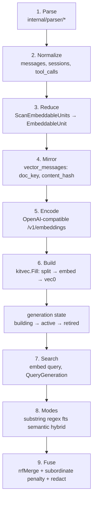
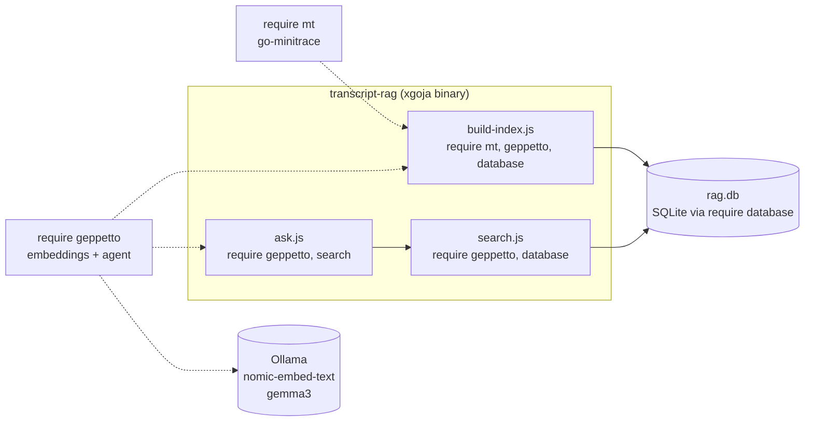

# PROJECT REPORT - Transcript RAG - Analyzing agentsview's Vector Search and Recreating It in JavaScript on the go-go-golems Stack

This report explains a system that performs semantic search over AI coding-agent transcripts and answers questions from them. It has two halves. The first half is a reverse-engineering of `agentsview`, a local-first Go application that embeds conversation text into vectors and queries them by meaning. The second half is a faithful recreation of that pipeline, built entirely in JavaScript on the go-go-golems toolchain: a custom `xgoja` binary that wires `geppetto` for embeddings and inference, `go-minitrace` for transcript parsing, and the `go-go-goja` host modules for SQLite storage. The recreation was implemented and validated end-to-end against real Pi session transcripts using local Ollama models, with no external API keys.

The report is written for an engineer who needs to understand, modify, or reproduce the system. It does not use analogies. Each component is explained in its own terms — what state it holds, what invariants it preserves, and why those invariants exist — then connected to the others with code, diagrams, and a verified end-to-end trace.

> [!summary]
> - `agentsview`'s retrieval pipeline is nine stages: parse transcripts, normalize into SQLite, reduce messages into embeddable "units", mirror them content-addressedly, encode via an OpenAI-compatible endpoint, build a generation-fingerprinted `vec0` index, search by embedding the query, and fuse lexical plus semantic rankings with reciprocal-rank fusion. The two ideas worth copying are the content-hash revision (incremental builds) and the generation fingerprint (safe model changes).
> - The recreation replaces agentsview's 128-file Go parser and private `kit` vector package with JavaScript modules: `go-minitrace` normalizes transcripts, `geppetto` provides `gp.embeddings(settings).embed`/`embedBatch`, and `require("database")` stores vectors in a plain SQLite table with brute-force cosine search.
> - One `xgoja` binary composes four providers (`geppetto`, `go-minitrace`, `go-go-goja-core`, `go-go-goja-host`) via a declarative `xgoja.yaml` spec. Inputs reach scripts through `globalThis.RAG_*` globals because goja exposes no `process.argv` or `process.env`.
> - The pipeline was validated live: a 391-line Pi transcript indexed in 2m11s (37 chunks embedded by local `nomic-embed-text`), real 768-dimensional float32 vectors stored and retrieved, cosine-ranked search across sessions, and a grounded answer from local `gemma3`.

## Current status

The system is a working, validated prototype. The binary builds with `xgoja build`, all four provider modules load, and the three commands (`index`, `search`, `ask`) run against real transcripts with local Ollama. Incremental re-indexing is a no-op for unchanged transcripts, which is the correctness invariant the design copies from agentsview.

| Component | File | Role |
| --- | --- | --- |
| Binary spec | `scripts/xgoja.yaml` | Wires providers and runtime modules; pins local source via `module.replace` |
| Profiles | `scripts/profiles.yaml` | Self-contained `ollama-chat` profile for the fail-closed OpenAI provider |
| Config | `scripts/lib/config.js` | Central config read from `globalThis.RAG_*` |
| Schema | `scripts/lib/schema.sql` | Mirror, chunks, vectors, generations, metadata tables |
| Store helpers | `scripts/lib/db.js` | Mirror upsert, pending-doc detection, generation lifecycle |
| Units | `scripts/lib/units.js` | Run reducer, document identity, run-hit anchoring |
| Chunking | `scripts/lib/chunks.js` | Split, cosine, float32 BLOB (de)serialization |
| Index | `scripts/build-index.js` | Parse → units → embed → store → activate |
| Search | `scripts/search.js` | Embed query → cosine → rollup → hydrate |
| Ask | `scripts/ask.js` | Retrieve → stuff context → LLM answer |
| CLI | `bin/rag` | Wrapper that injects args as JSON-encoded globals |

## Why this project exists

AI coding agents write transcripts to disk as JSONL. A single engineer accumulates hundreds of these sessions across weeks. Keyword search fails on them because the relevant turn rarely contains the exact word the engineer remembers; the engineer remembers meaning. The problem is semantic retrieval over transcripts, solved by embedding the conversation text into a vector space and querying that space.

`agentsview` already solves this in Go, and solves it carefully. The immediate problem this project addresses is narrower: the go-go-golems toolchain already contains a JavaScript runtime (`xgoja`), an LLM and embeddings framework (`geppetto`), and a transcript normalizer (`go-minitrace`). The question is whether those pieces can be composed in JavaScript to reproduce the architecture that makes agentsview's retrieval correct, without writing Go and without the private `go.kenn.io/kit` vector package that agentsview depends on. The report that follows is the answer: yes, and the exercise clarifies which parts of agentsview's design are load-bearing and which are incidental.

## Background: agentsview's retrieval pipeline

This section is the analysis half. It traces a conversation turn from raw JSONL on disk through to a search hit, naming the file and symbol at each stage. The goal is to separate the design decisions that matter (content addressing, generation fingerprinting, run grouping) from the implementation details that are specific to agentsview's Go and `kit` dependencies.

### The nine stages



Stages 1 through 3 turn raw transcripts into embeddable text. Stage 1 is a parser per agent format (`internal/parser/claude.go`, `codex.go`, and 126 others). Stage 2 writes a normalized schema: `sessions`, `messages`, `tool_calls`, `tool_result_events`. Stage 3 is the one that matters for retrieval quality, and it deserves a paragraph of its own.

### Run-grouped units

`internal/db/messages.go` defines `ScanEmbeddableUnits`. Rather than embedding each message individually, it reduces the message stream into embedding units. A unit is either a single user message or a run of contiguous assistant messages, joined with `"\n\n"`.

```go
type EmbeddableUnit struct {
    Kind        string        // "user" | "run"
    Ordinal     int           // first member's ordinal
    OrdinalEnd  int           // last member's ordinal
    Content     string        // members joined with "\n\n"
    Offsets     []UnitOffset  // one per member; locates each inside Content
}
```

The reducer closes a run whenever it meets an embeddable user message, a session boundary, or an `is_sidechain` transition. The `Offsets` slice records where each member sits inside the joined content, measured in runes and bytes. This is not decorative metadata. When a vector hit lands on a run, the search code uses `Offsets` to anchor the hit back to the specific member message whose text contains the matched chunk, and to slice the snippet down to that member. Without run grouping, the embedding model would see isolated fragments such as "Sure, here is the function:" with no attached context. Grouping assistant turns together gives the model a question immediately followed by the answer that addresses it, which is the unit of meaning the retrieval system needs.

### The content-addressed mirror

`internal/vector/mirror.go` defines the `UnitSource` interface and the mirror table. The mirror is agentsview's own copy of embeddable content, stored in `vectors.db` so the embedding index is self-contained and rebuildable from a single file.

```sql
CREATE TABLE vector_messages (
    doc_key      TEXT PRIMARY KEY,
    session_id   TEXT NOT NULL,
    ordinal      INTEGER NOT NULL,
    ordinal_end  INTEGER NOT NULL,
    content      TEXT NOT NULL,
    content_hash TEXT NOT NULL,
    embed_gen    TEXT
);
```

Two fields do the load-bearing work. `doc_key` is the document identity. `DocKey(kind, sessionID, sourceUUID, ordinal, occurrence)` prefers a `source_uuid` over an ordinal so the key stays stable when compaction or resync shifts ordinals. `content_hash` is a hash of the content. The embedding store stamps each document with its `content_hash` as a revision. A document whose content changed since it was last embedded is treated as pending re-embed, not as already done. This is the mechanism that makes builds incremental.

`Refresh` reconciles the mirror against `ScanEmbeddableUnits` and tracks a `refresh_watermark` — the maximum `ended_at` seen — so the next incremental scan visits only newer sessions. A separate metadata key, `scope_include_automated`, records whether automated sessions are in scope; changing it forces a full reconciliation, because scope is part of the mirror's identity, not the embedding fingerprint.

### The generation fingerprint

The single most valuable idea in agentsview's design is the generation. `cmd/agentsview/embeddings.go` constructs it:

```go
kitvec.Generation{
    Model:      c.Model,
    Dimensions: c.Dimension,
    Params: map[string]string{
        "max_input_chars":     strconv.Itoa(c.MaxInputChars),
        "doc_unit_scheme":     "run_v1",
        "chunk_overlap_chars": strconv.Itoa(vector.ChunkOverlap(c.MaxInputChars)),
    },
}
```

A generation's fingerprint is a hash of model, dimensions, and chunking parameters. It is the embedding-space identity: vectors are only comparable to vectors from the same fingerprint. Each generation has a state — `building`, `active`, or `retired` — and `Build` in `internal/vector/build.go` implements the state machine. It refreshes the mirror, resolves a build target (top up the active generation, or start a new building one), calls `kitvec.Fill` to split pending documents into chunks and embed them, and then `maybeActivate` promotes a building generation to active once its coverage reaches zero missing documents. The previous active generation is retired in the same transaction, so two generations can never be active simultaneously.

This matters because embedding models change. If the configuration switches from a 1536-dimensional OpenAI model to a 768-dimensional local model, the stored vectors are no longer comparable to query vectors. A naive index would silently rank queries against the wrong vector space. The generation fingerprint forces a new building generation, and search queries only the active one. The cost of this safety is a small state machine and one extra table. The benefit is that a model change can never produce silently wrong results.

### Search and hybrid fusion

`internal/vector/search.go` implements `Index.Search`. It embeds the query with the same encoder, calls `store.QueryGeneration` for approximate-nearest-neighbor search over the active generation's `vec0` table, rolls multiple chunk hits on the same document up to the best score, and hydrates each hit by looking up its mirror row. For a run document, `resolveRunHit` anchors the hit to the member message whose rune span contains the matched chunk's center rune.

`internal/db/search_content.go` exposes five modes: `substring`, `regex`, `fts`, `semantic`, and `hybrid`. The hybrid mode runs both an FTS leg and a vector leg, each over-fetched to `k` results, and fuses them at unit granularity with reciprocal-rank fusion:

```go
const rankConstant = 60
const subordinatePenalty = 5
score[key] += 1.0 / float64(rankConstant + rank)
```

Subordinate units — sidechain runs and subagent sessions — are penalized by shifting their effective rank, so top-level conversations win ties. The two legs share a unit key derived from `(session_id, ordinal_start)`, so a lexical hit and a semantic hit on the same conversation unit fuse into one result. Snippets are built from the message's full content and passed through `secrets.RedactWindow`, so a secret that straddles a truncation boundary cannot leak a fragment.

## The recreation toolchain

The recreation replaces four agentsview dependencies with JavaScript-callable equivalents. The mapping is direct.

| agentsview | Recreation | Tool |
| --- | --- | --- |
| 128-file multi-agent parser | Normalized SQLite via `mt.session()` | `go-minitrace` |
| `db.ScanEmbeddableUnits` | `buildUnits(rows)` over transcript rows | hand-written JS |
| `vector_messages` mirror | `rag_docs` table | `require("database")` |
| `vector/encoder.go` HTTP client | `gp.embeddings(settings).embed` | `geppetto` |
| `kitvec.Split` chunking | `splitChunks(text, max, overlap)` | hand-written JS |
| generation fingerprint + state | `rag_generations` table + `fingerprint()` | `require("database")` |
| `vec0` ANN index | `rag_vectors` table + brute-force cosine | `require("database")` + JS |
| `Index.Search` | `search(query)` | hand-written JS |
| (not present) answer generation | `gp.agent().session().next().run()` | `geppetto` |

The recreation gains answer generation, which agentsview's search does not perform, and loses native approximate-nearest-neighbor search, which the JavaScript stack does not have a `vec0` module for. Brute-force cosine is acceptable for the corpus sizes a single engineer accumulates, and the design records a migration path to a Bleve-backed index at scale.

One `xgoja` binary holds all of this together. `xgoja` is a compiler: it reads a declarative `xgoja/v2` YAML spec, selects Go provider packages, generates a Go program that imports them, and compiles it with the normal Go toolchain. The generated binary exposes the selected modules through `require()`. This is the same mechanism `pinocchio` uses to expose `geppetto`; see [[ARTICLE - xgoja - Generated Goja Applications Provider Architecture and Runtime Profiles]].

## Architecture



The binary exposes three commands through a `bin/rag` shell wrapper. The wrapper exists because `xgoja`'s `run` command accepts only a JavaScript file and the goja runtime exposes no `process.argv` or `process.env`. The wrapper passes inputs by setting `globalThis.RAG_*` in an `eval` expression, JSON-encoding string arguments with `python3` so that quotes, newlines, and backslashes in a query cannot break the expression.

## Implementation details

### The xgoja spec

The spec selects four providers and the runtime modules they expose. Providers are Go packages with a `Register` function. Each entry pins to the local go-go-golems source through `module.replace`, because no published version pins are used and the binary must match the analyzed source.

```yaml
providers:
  - id: geppetto
    import: github.com/go-go-golems/geppetto/pkg/js/modules/geppetto/provider
    register: Register
    module:
      replace: /home/manuel/code/wesen/go-go-golems/geppetto
  - id: go-minitrace
    import: github.com/go-go-golems/go-minitrace/pkg/minitracejs/provider
    register: Register
    module:
      replace: /home/manuel/code/wesen/go-go-golems/go-minitrace
  - id: go-go-goja-core
    import: github.com/go-go-golems/go-go-goja/pkg/xgoja/providers/core
    register: Register
    module:
      replace: /home/manuel/code/wesen/go-go-golems/go-go-goja
  - id: go-go-goja-host
    import: github.com/go-go-golems/go-go-goja/pkg/xgoja/providers/host
    register: Register
    module:
      replace: /home/manuel/code/wesen/go-go-golems/go-go-goja
```

A provider's `id` must match its Go `PackageID`. The runtime module entries reference providers by that id, and resolution fails at runtime if they diverge. The `database` and `fs` modules come from the `host` provider, not `core`. The `core` provider registers only `path`, `yaml`, `crypto`, `time`, `timer`, and `events`; the `host` provider registers the modules that touch the filesystem and database, and each requires explicit config: `database` needs `allowConfigure: true`, and `fs` needs `allow: true`. This separation is intentional in go-go-goja — host-capability modules are guarded so that a runtime cannot touch the filesystem or open a database without an explicit opt-in.

The geppetto module carries a `config` block that wires the profile registry:

```yaml
- provider: geppetto
  name: geppetto
  as: geppetto
  config:
    defaultProfileRegistries:
      - /home/manuel/.config/pinocchio/profiles.yaml
      - /home/manuel/code/wesen/2026-07-09--transcript-rag/ttmp/.../scripts/profiles.yaml
    defaultProfile: ollama-nomic-embedding
```

With this config, `gp.inferenceProfiles.resolve("ollama-nomic-embedding")` works without an explicit `.load()` call. The profile resolution model is documented in [[geppetto-engine-config-vs-runtime-behavior]].

### The SQLite schema

The schema reproduces agentsview's mirror, chunk map, and generation bookkeeping in plain SQLite. The `vec0` virtual table becomes a normal `BLOB` table.

```sql
CREATE TABLE rag_docs (
  doc_key      TEXT PRIMARY KEY,
  session_id   TEXT NOT NULL,
  kind         TEXT NOT NULL,
  ordinal      INTEGER NOT NULL,
  ordinal_end  INTEGER NOT NULL,
  content      TEXT NOT NULL,
  content_hash TEXT NOT NULL,
  offsets      TEXT NOT NULL DEFAULT '[]',
  embed_gen    TEXT
);
CREATE TABLE rag_vectors (
  gen_key     TEXT NOT NULL,
  doc_key     TEXT NOT NULL,
  chunk_index INTEGER NOT NULL,
  vec         BLOB NOT NULL,
  PRIMARY KEY (gen_key, doc_key, chunk_index)
);
CREATE TABLE rag_generations (
  gen_key   TEXT PRIMARY KEY,
  model     TEXT NOT NULL,
  dimensions INTEGER NOT NULL,
  state     TEXT NOT NULL,
  created_at TEXT NOT NULL
);
CREATE TABLE rag_meta (key TEXT PRIMARY KEY, value TEXT NOT NULL);
```

The `content_hash` column and a `rag_meta` stamp key together reproduce agentsview's incremental invariant. A document is pending if no stamp `stamp:<gen>:<doc>` equals its current `content_hash`. The query that finds pending documents is the heart of incremental indexing:

```sql
SELECT d.doc_key, d.content, d.content_hash FROM rag_docs d
WHERE NOT EXISTS (
  SELECT 1 FROM rag_meta s
  WHERE s.key = 'stamp:' || ? || ':' || d.doc_key
    AND s.value = d.content_hash)
```

When `content_hash` changes, the stamp no longer matches, the document becomes pending, and the next build re-embeds only it. This is why re-indexing an unchanged transcript is a no-op.

### Run-grouped units in JavaScript

`buildUnits` mirrors agentsview's `unitReducer`. It walks the transcript rows in conversation order, closes a run on a user message or session boundary, and joins run members with `"\n\n"`.

```js
function buildUnits(rows) {
  const units = [];
  let run = null;
  const closeRun = () => {
    if (!run) return;
    run.ordinalEnd = run.members[run.members.length - 1].ordinal;
    run.content = run.members.map(m => m.text).join("\n\n");
    run.offsets = memberOffsets(run.members);
    units.push(run); run = null;
  };
  for (const r of rows) {
    if (r.role === "user") {
      closeRun();
      units.push({ kind: "user", sessionId: r.session_id,
        ordinal: r.ordinal, ordinalEnd: r.ordinal, content: r.text, offsets: [] });
    } else if (r.role === "assistant") {
      if (!run || run.sessionId !== r.session_id) { closeRun(); run = { ... }; }
      run.members.push(r);
    }
  }
  closeRun();
  return units;
}
```

One detail required a departure from the agentsview model. go-minitrace's `Transcript()` view returns rows in conversation order, but its `ordinal` field is a turn-level ordinal, not a unique message index. Many assistant messages share ordinal 0. If `buildUnits` used that field directly, run members would appear out of order and the offset table would be wrong. The fix is to use the array index of each row as the stable, monotonic message ordinal:

```js
const raw = session.view().Transcript().IncludeTools().Run();
const rows = raw.map((r, i) => ({
  session_id: r.session_id, role: r.role, ordinal: i, text: r.text || "",
}));
const us = units.buildUnits(rows);
```

The array index is stable for a given file. A transcript that grows appends new ordinals at the end, which is correct. A mid-transcript edit changes the affected unit's `content_hash`, which re-embeds that unit, which is also correct.

### Chunking and vector serialization

Chunking reproduces `kitvec.Split` with a 15 percent overlap, derived the same way agentsview derives it: `overlap = floor(maxInputChars * 0.15)`.

```js
function splitChunks(text, maxRunes, overlap) {
  const runes = [...text];
  if (maxRunes <= 0 || runes.length <= maxRunes) return [text];
  const stride = maxRunes - Math.min(Math.max(overlap, 0), maxRunes - 1);
  const chunks = [];
  for (let start = 0; start < runes.length; start += stride) {
    chunks.push(runes.slice(start, start + maxRunes).join(""));
    if (start + maxRunes >= runes.length) break;
  }
  return chunks;
}
```

Vectors are stored as little-endian float32 bytes, the same encoding agentsview requests from its embeddings endpoint with `encoding_format: "base64"`. The go-go-goja `database` module returns `BLOB` columns as JavaScript arrays of byte numbers, not as Node `Buffer` objects, and the goja `Buffer` lacks the static `byteLength` and `isBuffer` methods. The serialization code handles both shapes:

```js
function toBlob(vec) {
  const ab = new ArrayBuffer(vec.length * 4);
  const dv = new DataView(ab);
  for (let i = 0; i < vec.length; i++) dv.setFloat32(i * 4, vec[i], true);
  return Buffer.from(ab);
}
function fromBlob(blob) {
  const bytes = Array.isArray(blob) ? blob
    : (blob.length !== undefined && typeof blob !== "string" ? Array.from(blob) : blob);
  const ab = new ArrayBuffer(bytes.length);
  const u8 = new Uint8Array(ab);
  for (let i = 0; i < bytes.length; i++) u8[i] = bytes[i] & 0xff;
  const dv = new DataView(ab);
  const out = new Array(ab.byteLength / 4);
  for (let i = 0; i < out.length; i++) out[i] = dv.getFloat32(i * 4, true);
  return out;
}
```

Cosine similarity is the dot product divided by the product of the norms. Search loads every vector for the active generation, scores each against the query vector, and keeps the top `k` after rolling up by document. This is `O(n * d)` per query, which is the accepted trade-off for a teaching implementation that avoids a native vector extension.

### The build and activate lifecycle

`build-index.js` reproduces agentsview's `Build` flow. It resolves the embedding generation and its fingerprint, retires any active generation whose fingerprint differs, ensures a new building generation, mirrors units, embeds pending chunks in batches, stamps them, and activates the generation when coverage is complete.

```js
const emb = embeddings(gp);
const { name: model, dimensions } = emb.model();
const genKey = ch.fingerprint({ model, dimensions, maxInputChars, overlap, scheme: "run_v1" });

const active = libdb.metaGet(db, "active_gen");
if (active && active !== genKey) libdb.setState(db, active, "retired");
libdb.ensureGeneration(db, genKey, model, dimensions, "building");
libdb.retireActive(db, genKey);

for (const batch of chunked(pending, batchSize)) {
  const texts = [];
  for (const d of batch) {
    const chunks = ch.splitChunks(d.content, maxInputChars, overlap);
    libdb.storeChunks(db, d.doc_key, chunks);
    texts.push(...chunks);
  }
  const vectors = emb.embedBatch(texts);
  // store each vector, stamp each doc with its content_hash
}
if (libdb.countMissing(db, genKey) === 0) {
  libdb.setState(db, genKey, "active");
  libdb.metaSet(db, "active_gen", genKey);
}
```

The `embedBatch` call is where the cost lives. A first build of 37 chunks against local `nomic-embed-text` took 2 minutes 11 seconds. geppetto's file cache makes subsequent runs of unchanged text free, which compounds with the content-hash invariant: only changed units re-embed.

### Search and the ask command

`search.js` embeds the query, scores every stored vector, rolls up by document, and hydrates the top hits with snippets. For a run document it re-derives the chunk window and uses `anchorMember` to pin the snippet to the member message that contains the match, exactly as agentsview's `resolveRunHit` does.

`ask.js` is the half agentsview does not have. It calls `search`, stuffs the snippets into a context block, and runs a geppetto agent session:

```js
const agent = gp.agent().name("rag").inference(chatSettings(gp)).build();
const session = agent.session().id("ask-" + Date.now()).build();
const result = session.next()
  .system("Answer using ONLY the provided context. If absent, say 'I don't know'.")
  .user(`Context:\n${context}\n\nQuestion: ${question}`)
  .run({ timeoutMs: 120000 });
```

The geppetto session model is documented in [[ARTICLE - go-go-goja Context Management - Runtime Request and Async Call Context]] and the runtime ownership model in [[goja-runtime-ownership-and-context-propagation]].

### The local chat profile

The pinocchio `ollama-openai-base` chat profile sets an OpenAI-compatible base URL pointing at `http://localhost:11434/v1` but provides no API key. geppetto's OpenAI provider is fail-closed by default: it rejects plain HTTP, rejects local-network targets, and requires the `openai-api-key`, `client`, and `openai` settings to be present. A self-contained profile opts in explicitly:

```yaml
profiles:
  ollama-chat:
    inference_settings:
      api:
        api_keys: { openai-api-key: ollama }
        base_urls: { openai-base-url: http://localhost:11434/v1 }
        allow_http: { openai: true }
        allow_local_networks: { openai: true }
      chat: { api_type: openai, engine: gemma3 }
      openai: {}
      client: { timeout_seconds: 120 }
```

`allow_http` and `allow_local_networks` are maps keyed by API type, not booleans. The dummy key `ollama` satisfies the provider's non-empty requirement; Ollama's OpenAI-compatible endpoint ignores it.

## Key integration findings

These are the points where the implementation diverged from the design, recorded because each one would stop an intern who reproduced the design verbatim.

- **`database` and `fs` are in the host provider, not core.** The `core` provider registers only `path`, `yaml`, `crypto`, `time`, `timer`, and `events`. Host-capability modules are guarded and require explicit `allow` config.
- **Provider `id` must match the Go `PackageID`.** Runtime modules resolve by the spec id, which must equal the provider's registered `PackageID` (`go-go-goja-host`, not a custom `host`).
- **Providers need `module.replace` to local source.** Without version pins, `xgoja` writes `v0.0.0` to the generated `go.mod`, which fails to resolve.
- **goja is not Node.** `fs.statSync` returns `isFile` and `isDir` as boolean properties, not methods. `Buffer` has no `byteLength` or `isBuffer`. The `database` module returns `BLOB` columns as byte arrays. There is no `process`, `module`, or `exit` global.
- **go-minitrace `Transcript()` ordinals are not unique.** The `ordinal` field is a turn-level value; many assistant messages share ordinal 0. The array index is the stable message ordinal.
- **FTS5 is unavailable in the linked `mattn/go-sqlite3`.** The schema init makes the FTS5 table optional. The hybrid lexical-plus-semantic leg is deferred until an FTS5-capable driver or `modernc.org/sqlite` is used.
- **CLI arguments pass through `globalThis`.** xgoja `run` takes only a file; goja has no argv or env. The `bin/rag` wrapper injects JSON-encoded globals and strips the goja console timestamp prefix.

## Validated results

The pipeline was validated end-to-end against a 391-line Pi session transcript that had not been indexed before. The geppetto embedding cache was cleared before the run to force genuine Ollama calls.

| Stage | Evidence |
| --- | --- |
| Embedder live | `curl http://localhost:11434/api/embeddings` returned a 768-dimensional vector |
| Index | 32 units, 37 chunks, 2m11s wall time (real CPU embedding, cache cleared) |
| Stored vector | 768 dimensions, 3072 bytes, `[-0.257, 0.461, -2.752, …]` |
| Search | Novel query embedded fresh, cosine-ranked hits returned across the session |
| Ask | `gemma3` grounded answer: the SQL lowercase-alias fix in `internal/sqltool/schema.go` for MySQL |
| Incremental | Re-indexing an unchanged transcript reports `0 pending doc(s)` |

A second run over a directory of three transcripts indexed 132 units and 141 chunks, and search returned hits spanning all three sessions.

## Current commands

```bash
make build                              # xgoja build → dist/transcript-rag
bin/rag index ~/.pi/agent/sessions/<dir-or-file>
bin/rag search "how did I debug sqlite-vec" --limit 5 --json
bin/rag ask    "What was the task in this session?"
```

The commands require a local Ollama with `nomic-embed-text` and `gemma3` pulled, and the pinocchio profiles at `~/.config/pinocchio/profiles.yaml` for the embedding profile. The `RAG_EMBED_PROFILE` and `RAG_CHAT_PROFILE` globals override the defaults.

## Important project docs

- `/home/manuel/code/wesen/2026-07-09--transcript-rag/ttmp/2026/07/09/TRANSCRIPT-RAG--analyze-agentsview-rag-and-recreate-with-xgoja-goja-repl-pinocchio-go-minitrace/design-doc/01-transcript-rag-analysis-design-and-implementation-guide.md` — the full design doc with decision records and phased plan
- `/home/manuel/code/wesen/2026-07-09--transcript-rag/ttmp/2026/07/09/TRANSCRIPT-RAG--analyze-agentsview-rag-and-recreate-with-xgoja-goja-repl-pinocchio-go-minitrace/reference/01-investigation-diary.md` — the implementation diary with verbatim errors
- `/home/manuel/code/others/llms/agentsview/internal/vector/` — the agentsview source analyzed in the first half

## Open questions

- At what corpus size does brute-force cosine become too slow, and does the `goja-bleve` provider close the gap without losing the content-hash incremental invariant?
- Can the hybrid reciprocal-rank-fusion leg be added without an FTS5-capable SQLite driver, by using a JavaScript lexical ranker over `rag_chunks.text` instead?
- Should the `ask` command cite real `session:ordinal` pairs from the retrieved hits rather than echoing the citation instruction literally?

## Near-term next steps

- Add the hybrid FTS5-plus-RRF leg once an FTS5-capable driver is linked, or implement a JS lexical ranker as a fallback.
- Benchmark brute-force cosine against a Bleve index at 10,000 and 100,000 chunks to validate the migration threshold.
- Tune the `ask` context size for `gemma3`, which returned empty on an eight-hit context and reliable answers on a three-to-four-hit context.

## Project working rule

> [!important]
> Reproduce agentsview's invariants before reproducing its features. The content-hash revision and the generation fingerprint are what make the index correct under change; brute-force cosine and a missing hybrid leg are acceptable gaps that do not affect correctness.

## Related notes

- [[ARTICLE - xgoja - Generated Goja Applications Provider Architecture and Runtime Profiles]] — the xgoja spec model and provider resolution this binary builds on
- [[geppetto-engine-config-vs-runtime-behavior]] — profile registries and the `inferenceProfiles.resolve` model
- [[ARTICLE - go-go-goja Context Management - Runtime Request and Async Call Context]] — the geppetto session and runtime ownership the `ask` command uses
- [[goja-runtime-ownership-and-context-propagation]] — why a goja runtime is single-goroutine and how that shapes module design
- [[rag-evaluation-pipeline-architecture]] — the broader RAG evaluation context this project sits inside
