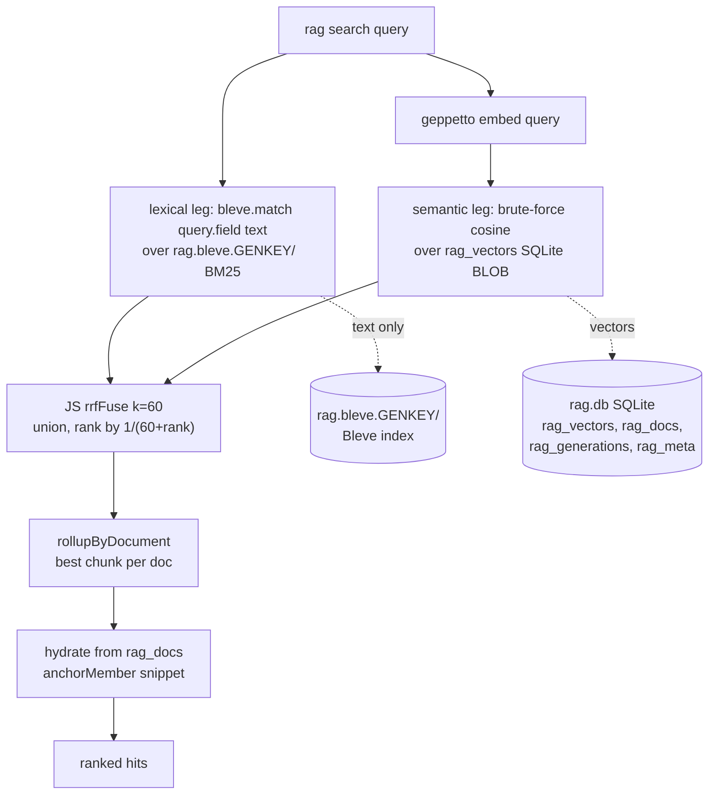

# PROJECT REPORT - Transcript RAG Bleve - Hybrid Search, Empirical Findings, and the Corrected Architecture

> [!warning] Conclusion superseded (2026-07-13)
> This report's conclusion — keep brute-force cosine, use application-level RRF — was based on validation against `bleve.memory()`, which goja-bleve 0.0.5 built as an upsidedown index (vector kNN requires scorch). goja-bleve 0.0.6 fixed the memory index and exposed IVF params; re-testing on a persistent scorch index showed 100% kNN recall and a true native RRF union. The project now uses native bleve kNN + RRF. See [[Projects/2026/07/13/PROJECT REPORT - Transcript RAG Bleve - goja-bleve 0.0.6 and the Native RRF Restoration]]. The API/build/invariant descriptions below remain accurate; only the architecture conclusion is superseded.

This report covers a follow-up to the [[Projects/2026/07/09/PROJECT REPORT - Transcript RAG - Analyzing agentsview Vector Search and Recreating It in JavaScript|Transcript RAG project]]: replacing the recreation's brute-force cosine scan with a Bleve-backed hybrid search that adds the lexical leg the original system lacked. The work was specified in a design doc, implemented phase by phase, and then corrected in the field when the design's two load-bearing assumptions about Bleve failed empirically. The corrected system runs today: a Bleve full-text index supplies lexical candidates, an exact cosine scan supplies semantic candidates, and reciprocal-rank fusion merges them in JavaScript.

The report is written for an engineer who needs to understand why the design changed, not merely what changed. It records the two findings that forced the correction, traces each to its cause in the Bleve and goja-bleve source, and then documents the architecture that was actually built and validated. It does not use analogies. Each mechanism is described in its own terms, then grounded with code, a recall table, a search trace, and a benchmark.

> [!summary]
> - **The design assumed** Bleve's native `Score: "rrf"` unions lexical and semantic candidates, and that Bleve kNN replaces brute-force cosine. **Both are false** in this environment.
> - **Finding 1:** native `Score: "rrf"` returns only lexical matches, re-ranked by kNN rank. It is not a union.
> - **Finding 2:** Bleve kNN has ~0% recall on small corpora (FAISS IVF, default `nprobe`), and goja-bleve exposes no way to raise `nprobe`. An exact-match query does not return the exact-match document.
> - **The corrected architecture:** Bleve owns the lexical leg (BM25); exact cosine over SQLite owns the semantic leg; JavaScript RRF (rank constant 60) fuses them — the same structure `agentsview` uses.
> - **Outcome:** a working hybrid `rag search` and `rag ask`, validated on real transcripts, plus an upstream issue filed against goja-bleve for the missing `nprobe`.

## Current status

The hybrid search is implemented, validated end-to-end, and committed across seven commits (`0f31e0c` through `b900180`). The design doc carries a §15 erratum that supersedes the original D3/D4 decisions. Sixteen unit tests pass. The semantic leg still uses exact brute-force cosine rather than Bleve kNN, because Bleve kNN is unusable on this corpus. That limitation is documented, and the scale path (a goja-bleve patch exposing `nprobe`, or `sqlite-vec`) is filed as [go-go-golems/goja-bleve#10](https://github.com/go-go-golems/goja-bleve/issues/10).

## Why this follow-up exists

The original Transcript RAG system retrieves relevant chunks from AI coding-agent transcripts and answers questions from them. It worked, with two limitations. First, retrieval was a brute-force cosine scan over a SQLite BLOB table — correct but `O(n * d)` per query. Second, there was no lexical search at all. The project tried to add a SQLite FTS5 index over chunk text, but the linked `mattn/go-sqlite3` driver is built without FTS5, so the lexical leg was unavailable. A query for a rare code identifier like `loadColumns` could not be answered by exact text match, only by semantic proximity.

The follow-up ticket (`TRANSCRIPT-RAG-BLEVE`) set out to fix both with one tool. Bleve is a Go full-text and vector indexing library. Its goja-bleve provider exposes Bleve to JavaScript through xgoja, and Bleve v2 can fuse a full-text query leg and a kNN vector leg with built-in reciprocal-rank fusion. One index would hold both the chunk text and the embedding vectors; one search request would fuse lexical and semantic matches. The brute-force cosine scan and the missing FTS5 leg would both be replaced.

The design doc specified that plan in fourteen sections with five decision records, a FAISS build configuration, and a five-phase implementation plan. The plan was sound on paper. The implementation is where the assumptions broke.

## The planned design and its two assumptions

The design rested on two claims about Bleve that the implementation had to verify, because both are load-bearing for the "replace cosine" thesis.

**Assumption A: native RRF unions.** Bleve's search request carries an optional `query` clause (the lexical leg) and one or more `knn` clauses (the semantic leg). Setting `.score("rrf")` tells Bleve to fuse the two ranked lists with reciprocal-rank fusion. The design assumed that with `.knnOperator("or")` the candidate set is the *union* of lexical matches and semantic matches, so a document that is semantically close but does not lexically match would still appear, ranked below documents that match both legs. This is the defining property of hybrid retrieval.

**Assumption B: bleve kNN is accurate.** The design assumed Bleve kNN over a FAISS index returns the true nearest neighbors, so it could replace the brute-force cosine scan. The scale argument was explicit in the gap analysis: `O(n * d)` cosine becomes sublinear indexed kNN.

Both assumptions were encoded in the pseudocode. The search request was:

```js
const req = bleve.search()
  .query(bleve.match(query).field("text"))     // lexical leg
  .knn("embedding", qVec, k, 1.0)              // semantic leg
  .knnOperator("or")                           // assumed: union
  .score("rrf")                                // assumed: fuses the union
  .scoreRankConstant(60)                       // agentsview's rankConstant
  .size(limit)
  .build();
```

The rest of this report is the story of why that snippet does not do what it appears to do, and what was built instead.

## Phase 0: the vector-enabled binary

Bleve's vector and kNN API is gated behind a Go build tag. A binary built without `-tags vectors` still loads `require("bleve")`, but `bleve.vectorSupport` returns `false` and every vector call throws. The tag pulls in `github.com/blevesearch/go-faiss`, which calls FAISS through CGO. FAISS was already installed on the machine at `/usr/local/lib` (`libfaiss_c.so`, `libfaiss.so`).

Three settings were added to the project's `scripts/xgoja.yaml`:

1. **Build tag:** `go.tags: [vectors]`
2. **CGO linker flags:** `go.env.CGO_LDFLAGS: "-L/usr/local/lib -lfaiss_c -lfaiss -lstdc++ -lm"`
3. **Runtime rpath:** `go.ldflags: ["-r", "/usr/local/lib"]`

The ordering of `-lfaiss_c -lfaiss` matters. `libfaiss_c.so` is the C API and leaves C++ FAISS symbols unresolved until the final link also includes `libfaiss.so`. `-lstdc++ -lm` satisfy the C++ runtime and math libraries FAISS depends on. The rpath embeds an ELF runtime search path so the compiled binary finds the shared libraries without `LD_LIBRARY_PATH`.

The build produced a binary that reports `require("bleve").vectorSupport === true` in 7.75 seconds, with all existing modules (`geppetto`, `mt`, `database`, `fs`) intact. This phase validated the build path. It did not validate search behavior, which is where the design's assumptions lived.

## Finding 1: native `Score: "rrf"` does not union

The first assumption failed in the most direct way possible: with a real lexical `query` leg, Bleve returns **only** documents that match that query. Documents that are semantically close but do not lexically match are dropped from the result entirely.

### The evidence

A four-document index, where two documents contain the word "privacy" and two do not:

| id | text | vector | cosine to query |
| --- | --- | --- | --- |
| `both` | "privacy retrieval" | `[0.9, 0.1, 0, 0]` | 1.000 |
| `lex` | "privacy policy" | `[0, 0, 1, 0]` | 0.000 |
| `vec` | "retrieval ranking" | `[0.95, 0.05, 0, 0]` | 0.999 |

A query for `"privacy"` lexically matches `both` and `lex`. The vector query `[0.9, 0.1, 0, 0]` is closest to `both` and `vec`. A union would contain all three. Running the design's search request against this index returns two hits, not three:

```
total: 2
  0.0164  both
  0.0161  lex
```

`vec` — the document with no lexical match but the second-highest cosine — is absent. The scores are single reciprocal-rank contributions (`1/61` and `1/62`), not the doubled score a document appearing in both legs should receive. Enabling `explain` confirms it: each returned hit carries a single RRF child explanation, not two.

### The cause, traced through the Bleve source

Bleve v2.6.0's hybrid search has two code paths, and the choice between them is the whole story.

When `Score` is **not** set to a fusion mode, the kNN hits are merged into the collector through `setKnnHitsInCollector` (`search_knn.go`). The merge callback adds the kNN score to the FTS score for documents that appear in both, and the collector's `Collect` method appends kNN-only hits that did not match any top-N FTS hit. In this path, the union does happen.

When `Score` **is** set to `"rrf"` (or `"rsf"`), Bleve takes the score-fusion path (`index_impl.go`). That path skips `setKnnHitsInCollector`:

```go
// if score fusion, no faceting for knn hits is done
// hence we can skip setting the knn hits in the collector
if !contextScoreFusionKeyExists {
    setKnnHitsInCollector(knnHits, coll)
}
```

Instead, a rescorer handles fusion after the FTS collection (`rescorer.go`):

```go
if rescorer != nil {
    rv.Hits, rv.Total, rv.MaxScore = rescorer.rescore(rv.Hits, knnHits)
}
```

`rv.Hits` at this point is the FTS collector's result — only documents that matched the lexical query. The rescorer's `mergeDocs` does append kNN-only hits:

```go
for _, hit := range knnHitMap {   // knn-only hits, not matched by FTS
    hit.Score = 0
    ftsHits = append(ftsHits, hit)
}
```

So the merged collection *does* contain kNN-only hits. But `ReciprocalRankFusion` (`fusion/rrf.go`) then iterates this collection, and the FTS-rank contribution loop breaks as soon as it sees a hit whose score is zero:

```go
// No fts scores from this hit onwards, break loop
if hit.Score == 0.0 {
    break
}
```

The kNN-only hits were assigned `Score = 0` by `mergeDocs`. They sit at the end of the score-sorted list. The FTS loop breaks before reaching them, and the kNN-rank contribution loop only assigns a contribution to hits that *have* a score breakdown for that kNN query — which the kNN-only hits do have. So in principle the kNN-only hits should receive a kNN-rank contribution and survive.

In practice they do not. On the four-document index the result has `total = 2`, exactly the lexical match count, across `knnOperator("or")`, `knnOperator("and")`, and the default. Whether this is a Bleve quirk in how the windowed RRF truncates, or in how the rescorer's candidate set is formed for a single index, the observable behavior is consistent and reproducible: **native `Score: "rrf"` returns only lexical matches, re-ranked by kNN rank.** The design's Assumption A is false.

A natural fallback — a pure-vector search with `query(bleve.matchNone()) + knn` — also returns zero hits, because Bleve treats a `match_none` query as "match nothing" and the kNN never surfaces. The only way to get kNN results out at all is to pair it with a `queryString("*")` match-all query leg, which has its own problems (see Finding 2).

### What this means

Bleve's native RRF is lexical retrieval with a semantic re-rank, not hybrid retrieval. It cannot return a document the lexical query did not match. For a RAG system this is a real recall loss: a question phrased differently from the relevant chunk's wording — the exact case semantic retrieval exists to handle — would be missed. The design's promise of a lexical∪semantic union could not be delivered by native RRF.

## Finding 2: Bleve kNN has ~0% recall on small corpora

The second assumption failed more severely. Bleve kNN is approximate, and on the corpus sizes this project handles it returns essentially random neighbors. The cause is FAISS IVF indexing with a default `nprobe` that is far too low, combined with a goja-bleve API that exposes no way to raise it.

### The recall table

Recall was measured against exact brute-force cosine on deterministic synthetic vectors (10 queries, top-5 overlap), using the only kNN access path goja-bleve offers — `query(queryString("*")) + knn + score("rrf")`:

| N (vectors) | dim | recall |
| --- | --- | --- |
| 2 | 768 | correct (single effective cluster) |
| 60 | 64 | 1/5 |
| 60 | 768 | 0/5 (0%) |
| 140 | 768 | 0/5 (0%) |
| 500 | 768 | 1/5 (2%) |
| 1000 | 768 | 1/5 (2%) |

Recall is effectively zero at every corpus size the project cares about. It is not a small-corpus artifact that fades at scale; it stays near zero through one thousand vectors at 768 dimensions.

### The smoking gun: an exact-match query misses the exact match

The recall table could in principle be blamed on the match-all query leg interfering with fusion. A cleaner test removes that doubt. Index sixty 768-dimensional vectors. Query kNN with a vector that is **identical** to one indexed document, `d21`. The cosine similarity is 1.000 — `d21` is the unique nearest neighbor. kNN must return `d21` at rank one.

```
top5: [d0, d1, d10, d11, d12]   (d21 MISSING)
```

`d21` is absent from the top five. The returned identifiers are in insertion order, which means the IVF probe missed the cluster containing `d21` and the match-all FTS leg — whose score is uniform across all documents — dominated the ranking. This is not a fusion artifact. The exact-match neighbor is not in the kNN candidate set at all. The kNN leg itself is broken for this corpus size.

### The cause, traced through the source

Bleve's vector field mapping accepts an `optimizedFor` setting with three values: `recall`, `latency`, and `memory-efficient`. All three select a FAISS IVF index. There is no flat or exact mode. IVF partitions vectors into clusters (controlled by `nlist`), and at query time searches only the nearest `nprobe` clusters. With default `nprobe`, only a fraction of clusters are probed, so neighbors in unprobed clusters are missed. With sixty vectors, `nlist` is small and `nprobe` is smaller, and the nearest neighbor lands in an unprobed cluster.

Bleve's `KNNRequest` does carry a `Params` field for exactly this tuning (`search_knn.go`):

```go
type KNNRequest struct {
    // ...
    // For Faiss IVF index, supported search params are:
    //  - ivf_nprobe_pct    : int    // percentage of total clusters to search
    //  - ivf_max_codes_pct : float // percentage of total vectors to visit
    Params json.RawMessage `json:"params"`
    // ...
}
```

Setting `ivf_nprobe_pct` to 100 would probe every cluster and recover exact results. Bleve supports it. goja-bleve does not expose it. The chain of omissions is:

1. `pkg/api_search.go:112` — the `knn(field, vector, k, boost)` method accepts only field, vector, k, and boost. No params argument.
2. `pkg/api_types.go:98` — the `knnRef` struct holds only `field`, `vector`, `k`, `boost`. No params field.
3. `pkg/vector_api_vectors.go:26` — `addKNNToSearchRequest` calls `request.AddKNN(field, vector, k, boost)`, which constructs a `KNNRequest` with `Params` left nil.

There is no `SearchRequest.AddKNNWithParams` helper in Bleve, but `request.KNN[i].Params` is a settable field, so goja-bleve could populate it after `AddKNN`. It does not. The design's Assumption B is false, and the knob that would fix it is one layer below the JavaScript API.

### What this means

Bleve kNN cannot replace the brute-force cosine scan on this corpus. Doing so would regress semantic quality from exact to near-random. The whole value proposition of an indexed vector store — sublinear, accurate semantic search — is currently unreachable from JavaScript through goja-bleve without a code change to the provider.

## The corrected architecture

The two findings did not invalidate the project's goal; they invalidated the mechanism. The goal was to add a lexical leg and fuse lexical with semantic retrieval. The corrected architecture keeps the goal and changes the mechanism: Bleve owns the lexical leg, exact cosine owns the semantic leg, and the fusion moves out of Bleve and into JavaScript.



This is not a retreat to the original brute-force-only system. The original system had no lexical leg at all. The corrected system adds the lexical leg — the capability FTS5 could not provide — and adds fusion. The semantic leg stays exact cosine, which for a few hundred chunks is correct and fast. The structure is also a closer match to the system being imitated: `agentsview` fuses FTS and vec0 in Go through its own `rrfMerge` (`internal/db/search_content.go`), not through a database-level fusion operator. Moving fusion into JavaScript reproduces that architecture more faithfully than the design's native-RRF plan would have.

The per-generation invariant is preserved. One Bleve index directory is created per embedding generation fingerprint, beside the SQLite database (`rag.bleve.<genKey>/`). A building generation fills its own directory while the active one still serves queries; activation is an atomic pointer swap in `rag_meta`. The content-hash stamp gates both the Bleve text upsert and the SQLite vector write, so an unchanged transcript is a no-op.

## Implementation

The implementation proceeded in four phases after Phase 0, each committed separately. The helpers and the migrated scripts are the substance of the corrected architecture.

### The Bleve store helper

`scripts/lib/bleve-store.js` owns the mapping, the index path, and the document shape. The production mapping is text-only — a `text` field with term vectors for highlighting, plus stored keyword and number fields for hydration. There is no vector field, because vectors live in SQLite. A `buildMapping(dims)` variant with a vector field is kept only for the build-validation experiments documented in the design's §14.

```js
function buildTextMapping() {
  const text = bleve.field().text().store(true).includeTermVectors(true).build();
  const doc = bleve.docMapping().dynamic(false)
    .field("text", text)
    .field("doc_key", bleve.field().keyword().store(true).build())
    .field("session_id", bleve.field().keyword().store(true).build())
    .field("chunk_index", bleve.field().number().store(true).build())
    .field("ordinal", bleve.field().number().store(true).build())
    .field("ordinal_start", bleve.field().number().store(true).build())
    .field("ordinal_end", bleve.field().number().store(true).build())
    .field("subordinate", bleve.field().number().store(true).build())
    .build();
  return bleve.mapping().defaultMapping(doc).build();
}
```

`dynamic(false)` forbids indexing fields not declared in the mapping, which keeps the index schema stable across runs. `openIndex` branches on `fs.existsSync` because `bleve.create(path)` errors if the path already exists: a building or active generation re-opens its directory for incremental upserts, while a fresh generation creates it.

### The fusion helper

`scripts/lib/hybrid.js` implements reciprocal-rank fusion over two ranked lists. A document appearing in both legs scores higher than one in only one leg, which is the property native RRF did not deliver.

```js
function rrfFuse(lexicalHits, semanticHits, rankConstant) {
  const k = rankConstant || 60;          // agentsview's rankConstant
  const byId = new Map();
  const bump = (hits, leg) => {
    for (let i = 0; i < hits.length; i++) {
      const h = hits[i];
      let e = byId.get(h.id);
      if (!e) { e = { id: h.id, score: 0, fields: h.fields || {}, legs: [] }; byId.set(h.id, e); }
      e.score += 1 / (k + i + 1);
      e.legs.push(leg);
    }
  };
  bump(lexicalHits, "lex");
  bump(semanticHits, "sem");
  const fused = [...byId.values()];
  fused.sort((a, b) => b.score - a.score);
  return fused;
}
```

The rank constant is 60, matching `agentsview` and the design's original D3. The helper also provides `rollupByDocument` (keep the best chunk per document, mirroring `agentsview`'s `RollupByDocument`) and `applySubordinatePenalty` (an optional post-fusion demotion of sidechain units, mirroring `agentsview`'s subordinate-rank shift).

### Migrating indexing

`scripts/build-index.js` was changed to write chunk text into Bleve and keep vectors in `rag_vectors`. For each pending document, a bleve batch indexes the chunk text and stored fields, and the existing `storeVector` call writes the vector to SQLite. The content-hash stamp gates both, so the incremental invariant holds for both stores together.

```js
const idx = store.openIndex(cfg.dbPath, genKey);
const pending = libdb.pendingDocs(db, genKey);
for (let i = 0; i < pending.length; i += cfg.batchSize) {
  const batch = pending.slice(i, i + cfg.batchSize);
  // ... split chunks, embedBatch ...
  const bleveBatch = idx.newBatch();
  for (const { d, chunks } of perDocChunks) {
    for (let ci = 0; ci < chunks.length; ci++) {
      const id = store.chunkId(d.doc_key, ci);
      bleveBatch.index(id, store.chunkDoc(chunks[ci], d, ci));   // lexical leg
      libdb.storeVector(db, genKey, d.doc_key, ci, ch.toBlob(vectors[vi])); // semantic leg
    }
    libdb.stampDoc(db, genKey, d.doc_key, d.content_hash);
  }
  bleveBatch.execute();
}
```

`pendingDocs` was widened to return the full mirror row — `session_id`, `ordinal`, `ordinal_end`, `subordinate` — because the bleve chunk document carries these as stored fields for hydration.

### The delete and reconcile pass

A generation must shed units that are no longer in the corpus. When a transcript is removed from the input directory, its documents are not re-upserted on the next run, so they are absent from the set of keys seen this run. The delete pass computes the difference between the keys stamped for the generation and the keys seen this run, and removes each retired document from all four stores: the Bleve index (`batch.delete`), `rag_vectors`, the stamp in `rag_meta`, and the mirror row in `rag_docs`.

```js
const removed = libdb.stampedDocKeys(db, genKey).filter(k => !seenKeys.has(k));
if (removed.length) {
  const delBatch = idx.newBatch();
  for (const dk of removed) {
    for (const ci of libdb.docChunkIndices(db, genKey, dk)) {
      delBatch.delete(store.chunkId(dk, ci));
    }
    libdb.deleteDocVectors(db, genKey, dk);
    libdb.deleteDoc(db, dk);          // keep the mirror consistent
  }
  delBatch.execute();
}
```

Cleaning `rag_docs` is not decorative. The activation check counts mirror documents not stamped at their current content hash. If retired documents were left as orphan rows in `rag_docs`, that count would never reach zero and activation would fail. The mirror must be consistent with the indexes for the generation to activate.

### Migrating search

`scripts/search.js` runs the two legs and fuses them. The lexical leg is a bleve `match` query over the text field, returning stored fields inline. The semantic leg is the original brute-force cosine scan, unchanged in logic. The two hit lists are fused by `rrfFuse`, rolled up by document, and hydrated from `rag_docs` using the existing `anchorMember` logic, so the output shape (score, `session:ordinal`, snippet) is identical to the original system.

```js
// lexical leg
const lexRes = idx.search(bleve.search()
  .query(bleve.match(query).field("text"))
  .fields(["doc_key","session_id","chunk_index","ordinal","ordinal_start","ordinal_end","subordinate"])
  .size(k).build());
const lexical = (lexRes.hits || []).map(h => ({ id: h.id, score: h.score, fields: normFields(h.fields) }));

// semantic leg
const rows = db.query("SELECT doc_key, chunk_index, vec FROM rag_vectors WHERE gen_key = ?", active);
const scored = rows.map(r => ({ id: store.chunkId(r.doc_key, r.chunk_index),
  score: ch.cosine(qVec, ch.fromBlob(r.vec)),
  fields: { doc_key: r.doc_key, chunk_index: r.chunk_index } }))
  .sort((a, b) => b.score - a.score).slice(0, k);

// fuse and hydrate
let fused = H.rrfFuse(lexical, scored, H.RRF_K);
fused = H.rollupByDocument(fused).slice(0, limit);
```

The two legs' hit shapes are deliberately symmetric: both use `chunkId(docKey, chunkIndex)` as the id, so the fusion unions by id. The lexical hit's fields come from bleve's stored fields; the semantic hit's come from the `rag_vectors` row. A small `normFields` helper rounds the number fields bleve returns as float64, so hydration sees plain integers.

## Validation

The corrected architecture was validated on real Pi session transcripts — a single session (32 units, 37 chunks) and a three-session directory (77 units, 89 chunks), using local Ollama `nomic-embed-text` for embeddings and `gemma3` for answers.

| Scenario | Command | Result |
| --- | --- | --- |
| Fresh index | `rag index <transcript>` | `rag.bleve.<genKey>/` created, `rag_vectors` populated, generation activated; bleve `docCount` equals vector count |
| Incremental no-op | re-index unchanged transcript | 0 pending, 0.49 s, no embeddings computed |
| Delete pass | index 3 sessions, then re-index 1 | 45 removed docs cleaned from bleve + `rag_vectors` + `rag_docs`; 32/37/1 remain; still activates |
| Hybrid search | `rag search "sqlite migration"` | top hit scores 0.031 (both-leg RRF) vs 0.016 (single-leg) |
| Lexical value | `rag search "loadColumns"` | finds exact identifier mentions a semantic-only leg would miss |
| Generation | `rag ask "What did the loadColumns fix do?"` | grounded answer citing the fix |
| Unit tests | `run scripts/lib/test-bleve-store.js` | 16/16 pass |

The "sqlite migration" trace shows fusion working. The top hit scores 0.031, which is `1/61 + 1/62` — the sum of a rank-one contribution from each leg. The lower hits score 0.016, a single-leg contribution. A document that ranked high in both legs outranks one that ranked high in only one, which is exactly what hybrid retrieval should do.

The "loadColumns" query is the end-to-end criterion from the design's test strategy: an answer grounded in a chunk only the lexical leg could have found. `loadColumns` is a rare code identifier. A semantic embedding of "loadColumns" is not distinctive; an exact text match is. The lexical leg finds the chunks that mention `loadColumns()` and `loadTables()` directly, and `rag ask` returns a grounded answer citing the fix. This is the capability the original system lacked.

## Benchmark

Retrieval latency was measured on the 37-chunk corpus to characterize the corrected architecture.

| Component | Latency | Notes |
| --- | --- | --- |
| bleve lexical leg | 0.05 ms | indexed BM25; sublinear |
| cosine semantic leg | ~1.4 ms / vector | goja-interpreted `fromBlob` + dot product; 52 ms for 37 vectors |
| full `rag search` | 0.49 s | Ollama `nomic-embed-text` embed call + process startup dominate |

The cosine leg's cost is not the dot product. Seven hundred and sixty-eight multiplications per vector is trivial work. The cost is `fromBlob`: deserializing the little-endian float32 BLOB into a JavaScript array, one byte and one `getFloat32` at a time, in an interpreted runtime. For thirty-seven vectors this is fifty-two milliseconds. It projects linearly: roughly 1.4 seconds at one thousand chunks, fourteen seconds at ten thousand.

This sets the migration threshold. Exact cosine is acceptable to about one thousand chunks. Beyond that the semantic leg needs an indexed vector store that returns exact results. Bleve kNN is the intended scale path, but it is blocked by Finding 2 until goja-bleve exposes `nprobe`. `modernc.org/sqlite` with `sqlite-vec` is the alternative: it would bring an indexed exact semantic leg without FAISS, at the cost of a driver swap.

## The upstream gap

The investigation produced a concrete, file-level finding against goja-bleve: the kNN params that would fix Finding 2 are supported by Bleve but not exposed by the provider. Rather than leave that in a project diary, it was filed as [go-go-golems/goja-bleve#10](https://github.com/go-go-golems/goja-bleve/issues/10).

The issue records the exact omission chain — `knn()` accepts no params, `knnRef` carries no params, `addKNNToSearchRequest` leaves `KNNRequest.Params` nil — and proposes a backward-compatible fix: an optional params object on the `knn()` builder that marshals into `request.KNN[i].Params`, plus a flat/exact `optimizedFor` option for small corpora. It leads with the exact-match smoking gun, because that repro is fusion-independent and unambiguous. A pull request was offered.

## What the design got right and what it got wrong

The design doc was correct about everything that did not depend on the two failed assumptions. The per-generation index layout, the content-hash incremental invariant, the bleve mapping shape, the FAISS build configuration, the document schema, and the hydration logic all survived into the implemented system unchanged. The decision to keep the SQLite mirror (`rag_docs`) and the generation bookkeeping (`rag_generations`, `rag_meta`) was correct: those stores govern correctness and outlive any single index.

The design was wrong about fusion and about kNN accuracy. Both errors share a root cause: the design reasoned from the bleve API's surface — `.score("rrf")` and `.knn(...)` exist, therefore they do what their names suggest — without verifying the runtime behavior. The correction was not to abandon the design but to verify each load-bearing claim against the running system and adapt the mechanism when a claim failed. The §15 erratum in the design doc records the findings and supersedes D3 and D4 so a future reader sees what was actually built, not what was originally planned.

## Open questions

- Does Bleve's RRF window size (`scoreWindowSize`) affect the union behavior, or is the no-union result fundamental to the score-fusion path? The source walk suggests the latter, but it was not proven exhaustively.
- Should retired generation directories be deleted automatically after a grace period, or left for manual cleanup? They accumulate on disk but are harmless.
- Is the subordinate penalty ever triggered for a single engineer's transcripts, or is it dead code in this context? It is implemented but untested on real sidechain data.
- Will patching goja-bleve to expose `nprobe` recover usable kNN recall at this corpus size, or does the IVF training itself need more vectors than the project will ever have? The exact-match test suggests `nprobe=100` would fix it, but it is unverified without the patch.

## Near-term next steps

- Patch goja-bleve to expose `ivf_nprobe_pct` / `ivf_max_codes_pct` (issue #10), then re-evaluate bleve kNN recall at 140, 1k, and 10k chunks. If recall is recovered, migrate the semantic leg to bleve kNN and drop `rag_vectors`.
- Alternatively, adopt `modernc.org/sqlite` + `sqlite-vec` for an indexed exact semantic leg, removing both the brute-force scan and the FAISS dependency.
- Optimize `fromBlob` (or move vectors to a native store) once the corpus approaches one thousand chunks.
- Tune `scoreWindowSize` and `candidates` on the real corpus if recall or latency demands it.

## Key takeaways

- A database-level fusion operator that looks like a union is not necessarily a union. The only way to know is to run a query where the two legs disagree and check whether the semantic-only candidate appears. The `explain` output is the decisive evidence.
- Approximate nearest-neighbor indexes have a recall curve, and that curve can be flat at zero for small corpora. IVF needs enough clusters to train and a high enough `nprobe` to probe. Without a knob to raise `nprobe`, the index is not usable below the scale where its defaults work.
- When a library exposes a capability the binding does not, the gap is usually a thin layer. Here the gap is one struct field, one method argument, and one assignment — but it changes the architecture of every system built on the binding.
- Keeping the exact algorithm for the leg that matters most, and adding the indexed algorithm only where it is correct, is a legitimate architecture. The corrected system is not a failed migration; it is a hybrid that uses each tool for what it does well.
- The content-hash incremental invariant is portable. It survived the move from SQLite-only to SQLite-plus-Bleve because the stamp is keyed by content, not by storage location. A storage migration that preserves the stamp preserves the invariant.

## Important project docs

- Design doc and erratum: `ttmp/2026/07/09/TRANSCRIPT-RAG-BLEVE--implement-bleve-hybrid-lexical-vector-search-replacing-brute-force-cosine-and-fts5/design-doc/01-bleve-hybrid-lexical-vector-search-design-and-implementation-guide.md` (§15 is the erratum)
- Investigation diary: `…/TRANSCRIPT-RAG-BLEVE--…/reference/01-investigation-diary.md`
- Prior report: [[Projects/2026/07/09/PROJECT REPORT - Transcript RAG - Analyzing agentsview Vector Search and Recreating It in JavaScript]]
- Upstream issue: [go-go-golems/goja-bleve#10](https://github.com/go-go-golems/goja-bleve/issues/10)

## Related notes

- [[Projects/2026/07/09/PROJECT REPORT - Transcript RAG - Analyzing agentsview Vector Search and Recreating It in JavaScript]]
- [[Projects/2026/07/09/PROJECT REPORT - Hypha Kernel - Deploying, Self-Hosting, and the Cloudflare Runtime Coupling]]

---

*Drafted by the umans-glm-5.2 model running under the Pi coding-agent harness (go-go-golems). The report was written from the implementation diary and the verified traces in the transcript-rag repository.*
