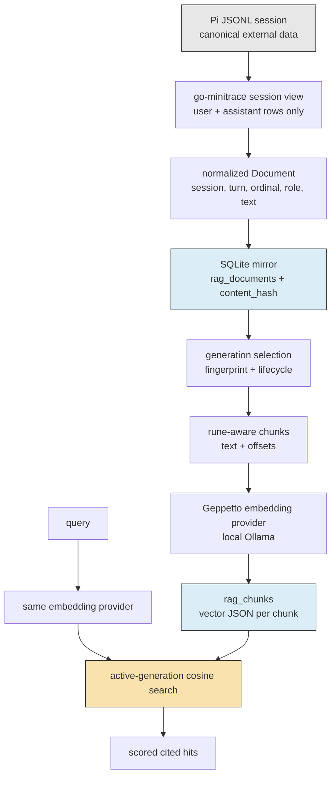
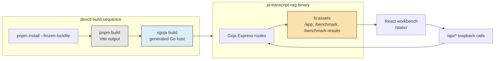
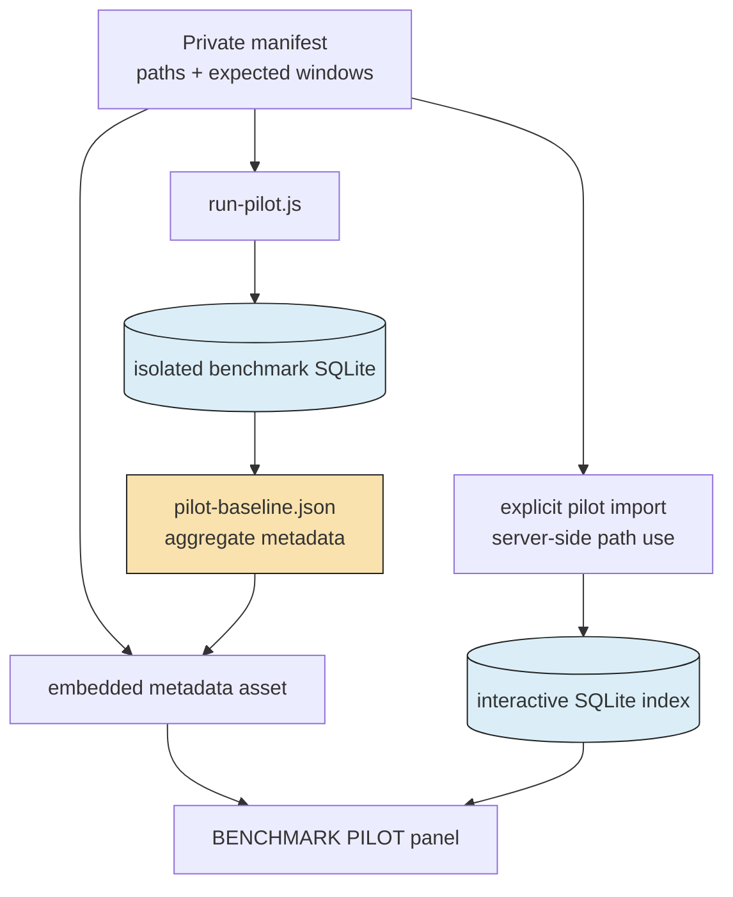

# Transcript RAG Workbench: Durable Retrieval, Embedded UI, and Private Evaluation

This report explains the completed local transcript-retrieval application in `/home/manuel/code/wesen/2026-07-09--transcript-rag-sol`. It is a system for indexing Pi coding-agent sessions, searching their user and assistant messages semantically, reading the indexed transcript, and evaluating retrieval against a small private benchmark. The important result is not merely that vectors can be stored and searched. The result is a system with explicit source identity, content revisions, embedding-space identity, a browser interface embedded in one generated binary, and a repeatable real-data evaluation loop.

> [!note]
> This report was authored with GPT-5.6-terra.

The preceding vault report, [[PROJECT REPORT - Transcript RAG - Analyzing agentsview Vector Search and Recreating It in JavaScript]], analyzes the original AgentsView design and the first JavaScript recreation. This report covers the next implementation stage: a reusable Go RAG store exposed to Goja, a Pi-focused workbench, a native multi-file import path, browser-local saved state, devctl supervision, and a benchmark that remains isolated even when its sources are imported for interactive exploration.

> [!summary]
> - The RAG store is a derived SQLite index. Pi JSONL remains canonical outside the database; the database mirrors normalized user and assistant documents, content revisions, chunks, and one active embedding generation.
> - The workbench is a React/TypeScript frontend built by Vite, embedded by xgoja `fs:assets`, and served by a Goja Express application. The browser has no filesystem capability; selected files are posted as content and parsed by go-minitrace on the server.
> - Real validation used the local `nomic-embed-text` Ollama profile and substantive Pi sessions. The interactive index contained 350 documents across six sources after importing the 344-document benchmark pilot corpus alongside three small manually chosen sessions.
> - The benchmark records a fixed isolated baseline of R@1 0.50, R@5 1.00, and MRR@5 0.75 over four cases. The workbench may display and import its sources, but it never rewrites the benchmark database or baseline artifact.

## Why this project exists

Coding-agent transcripts contain decisions, rejected approaches, implementation details, validation evidence, and operational history. Their raw JSONL form is suitable for the agent runtime but not for retrieval. A user looking for the reason a design changed usually remembers the concept, a subsystem name, or an outcome; the exact words in the transcript are often unknown. Semantic retrieval is useful because the query and the relevant message do not need identical vocabulary.

This problem has two separate responsibilities. First, the system must preserve retrieval correctness when a transcript changes, a model changes, or a new source is added. Second, it must let a human inspect the evidence behind a result rather than presenting only a similarity score. A system that solves only the first responsibility is an index. A system that solves both is a usable local research tool.

The project deliberately stays local-first. Canonical Pi sessions remain in `~/.pi/agent/sessions/`. Local inference profiles remain in `~/.config/pinocchio/profiles.yaml`. The derived database is `/tmp/pi-transcript-rag-real.db` during the current workbench run. The application binds to loopback and is not an authenticated network service.

## Current project status

The application is implemented and was exercised against real local Pi sessions and a local Ollama embedding model. The devctl-supervised server serves the generated application at `http://127.0.0.1:8791/static/` while it is running. It supports explicit path import, native multi-file selection, debounced retrieval, indexed-transcript browsing, localStorage-backed pins and bookmarks, and a benchmark panel.

The principal implementation artifacts are ticket-local so that the research, scripts, and UI remain traceable:

| Concern | Main location | Responsibility |
| --- | --- | --- |
| Durable store | `pkg/transcriptrag/` | Mirror reconciliation, generation lifecycle, chunk persistence, cosine search |
| Goja module | `pkg/gojamodules/transcriptrag/module.go` | JavaScript-facing `open`, `sync`, `search`, `documents`, and `status` API |
| Generated application spec | `ttmp/.../transcript-rag-workbench-ui.../scripts/real-app/xgoja.yaml` | Providers, embedded assets, runtime modules, generated binary |
| Local HTTP application | `.../scripts/real-app/verbs/pi-rag.js` | Mintrace import, Geppetto embedding, Express routes, benchmark boundary |
| Browser application | `.../scripts/real-app/web/src/` | React UI, Redux/RTK Query client, local storage, retro monochrome styling |
| Local supervision | `.devctl.yaml` and `.../scripts/devctl/pi-transcript-rag.py` | Build sequence, free loopback port, health-checked server process |
| Benchmark suite | `ttmp/.../transcript-rag-benchmark-suite.../scripts/` | Private case manifest, isolated runner, metadata-only baseline result |

The `v0.0.0` module version in the xgoja spec is intentional. It identifies the current repository as a local replacement during generated-host resolution; it is not a published semantic-release claim. The `replace` path names the source tree that the generated Go module must compile against. External go-go-golems dependencies use their actual tagged versions while also resolving to the local checkout for this development environment.

## The core model: canonical data and a rebuildable derived index

The central design decision is that the RAG SQLite database is not the transcript authority. A document in `rag_documents` is a normalized mirror of a user or assistant message that was selected from a Pi session. This distinction determines how import, deletion, and reindexing behave.

Each mirrored document has a stable identity assembled from session, turn, ordinal, and role. Its SHA-256 content hash is its revision. The identity says which logical document this is; the hash says whether its text is still the same. Both are required. A changed message must retain its identity so it replaces the old row, but it must become pending for re-embedding because its old vector represents different text.



The store operates on a completed source scan. `ReconcileDocuments` makes the mirror exactly equal to the provided document set. That behavior is correct for a complete canonical scan and dangerous for a naive "add one file" API: if the caller supplies only one new session, an exact reconciliation would delete every previously mirrored session. The workbench addresses this explicitly. Before importing a source, it calls `store.documents()`, merges existing and incoming documents by canonical identity, and then synchronizes the full merged set. Adding a source is therefore additive at the application layer while the store retains a simple exact-mirror contract.

```text
function indexIncomingDocuments(store, incoming):
    require incoming contains at least one user or assistant message
    existing = store.documents()
    corpus = mergeBy(sessionId, turnIndex, ordinal, role, existing, incoming)
    provider = geppetto.embedder(profile)
    spec = generationSpec(provider.model())
    return store.sync(corpus, spec, provider)
```

This separation is valuable because it keeps the durable store easy to reason about. The store does not need an implicit concept of an "incremental request." It receives a corpus and reconciles it. The HTTP layer owns the decision that a request means "extend the interactive corpus."

## Generation identity is a correctness boundary

Semantic comparison is valid only within one embedding space. The system records a `GenerationSpec` containing the model name, dimensionality, unit scheme, chunk size, chunk overlap, and source-scope hash. A deterministic fingerprint identifies that specification. The store has three generation states:

| State | Meaning | Searchable? |
| --- | --- | --- |
| `building` | A new embedding space is receiving chunks and vectors. | No |
| `active` | Every current mirrored document has coverage in this generation. | Yes |
| `retired` | A former active generation retained for lifecycle history. | No |

The active-generation invariant prevents a query vector from being compared with stale chunks. A model change, dimension change, scope change, or chunk-policy change creates a different fingerprint. The new generation remains `building` until all current documents have vector coverage. Only then does it become active; the former active generation is retired. The partial unique index in the SQLite schema enforces that no more than one generation can be active.

```text
sync(documents, spec, embedder):
    reconcile mirror with documents
    generation = findOrCreateGeneration(fingerprint(spec))
    mark changed or missing documents pending for generation
    for each pending document:
        chunks = splitByRunes(document.text, spec.maxChunkRunes, spec.overlapRunes)
        vectors = embedder.embedBatch(chunks.text)
        persist chunk text, rune offsets, and vectors
        stamp document's current content hash in generation
    if every mirrored document has a current stamp:
        transactionally set generation active
        transactionally retire previous active generation
```

The project currently stores vectors as JSON in SQLite and calculates cosine similarity in the application. This is intentionally direct and inspectable. It is appropriate for the current personal corpus and avoids introducing an approximate-nearest-neighbor dependency before corpus size requires it. It also means the current scaling limit is explicit: search work grows with active chunk count. A larger corpus should add an ANN backend only after retaining the same document, generation, and citation contracts.

## From Pi JSONL to indexed documents

`go-minitrace` is the parser boundary. The workbench does not implement a parallel JSONL importer. For a path import, `mt.session().File(path).InteractiveCache(cache).Open()` reads the selected session. For browser-selected files, the server uses `mt.session().Content(content).Name(name)` because a browser deliberately does not expose usable absolute paths for chosen files. Both paths then use the same minitrace transcript view:

```javascript
const rows = source.view()
  .Transcript()
  .IncludeTools(false)
  .IncludeThinking(false)
  .Run();

const documents = rows
  .filter((row) => row.role === "user" || row.role === "assistant")
  .filter((row) => typeof row.text === "string" && row.text.trim() !== "")
  .map((row) => ({
    sessionId: row.session_id,
    turnIndex: row.turn_index,
    ordinal: row.ordinal || 0,
    kind: row.role,
    content: row.text,
    sourcePath,
  }));
```

The exclusion of tools and thinking is a scope decision rather than a parser limitation. It constrains what the user sees in the reader to the text that was embedded and searched. If tools become useful for diagnostics, they should be added under a new `scopeHash`; silently adding them would change the corpus without changing generation identity.

The multi-file endpoint accepts a bounded batch of up to 32 selected JSONL files. The browser reads each `File` object, then posts `{name, content}` records to `/api/index-files`. The Go HTTP host caps the JSON body at 64 MiB. This is enough for intentional local batches, but it is not a discovery mechanism. Automatic scanning of all Pi history would be both a privacy and operational mistake because it removes the user's source-selection boundary.

## The generated application: xgoja, Goja Express, and embedded assets

The workbench is not a Node server. `xgoja` reads `xgoja.yaml`, generates a Go main package that imports the selected provider packages, and builds one binary. The resulting runtime exposes native modules to JavaScript through `require()`. The workbench composes:

- `require("transcript-rag")` for the durable index.
- `require("minitrace")` for Pi session normalization.
- `require("geppetto")` for profile resolution and embeddings.
- `require("express")` for the local Goja HTTP application.
- `require("fs:assets")` for a read-only embedded asset filesystem.

The frontend lives in separate HTML, CSS, TypeScript, and TSX source files under `scripts/real-app/web`. Vite emits static assets into `scripts/real-app/assets/public`. xgoja embeds those assets and mounts them read-only at `/app`; the Express application serves them under `/static`. The separate build and embed stages are important. Browser code is compiled before the Go binary is generated, and the generated binary then contains exactly the frontend artifact set it serves.



The browser architecture uses Redux Toolkit for local UI state and RTK Query for HTTP data. Pins and bookmarks are persisted under the localStorage key `pi-transcript-rag.workbench.v1`. This is intentionally browser-local state. No user account, server-side bookmark table, or shared synchronization protocol is implied. A bookmark stores the relevant result metadata and text in that browser profile, so the privacy consequence is visible and bounded.

The user-facing API is narrow:

| Route | Contract |
| --- | --- |
| `GET /api/status` | Returns the active generation and indexed source summaries. |
| `GET /api/search?query=...` | Embeds the query and returns up to 24 active-generation hits with cosine scores and source coordinates. |
| `GET /api/transcripts/:sessionId` | Returns ordered documents from the persisted mirror for one indexed session. |
| `POST /api/index` | Imports an explicitly supplied local Pi path and merges it into the interactive corpus. |
| `POST /api/index-files` | Imports a bounded browser-selected content batch through minitrace. |
| `GET /api/benchmark` | Returns private benchmark metadata and aggregate baseline values, never raw transcript content. |
| `POST /api/benchmark/index-pilot` | Explicitly imports the pilot source sessions into the interactive index. |

Similarity percentages in the UI are display values derived from cosine score. They are not calibrated relevance probabilities. A high score means that the query vector and a chunk vector are close under the current embedding model; it does not establish that the result answers the user's question. The transcript reader and the benchmark exist because score alone is insufficient evidence.

## Benchmark design: evaluate retrieval without publishing sessions

The benchmark ticket defines 11 private cases and four pilot cases. A case holds a query, an expected session ID, and an inclusive relevant turn range. Its source path is local-only. The committed manifest and baseline result contain metadata necessary to rerun and inspect the evaluation without committing transcript prose.

The pilot runner uses the same minitrace normalization, Geppetto embedder, and transcript-rag module as the application, but it writes to a separate SQLite database with a benchmark-specific scope hash. It deduplicates source paths before indexing because two frontend questions refer to one session. It then searches each query and finds the first hit whose session and turn overlap the expected range.

```text
for each unique pilot source path:
    documents += normalizeUserAssistantRows(minitrace.open(path))

benchmarkStore.sync(documents, benchmarkGenerationSpec, embedder)

for each case:
    hits = benchmarkStore.search(case.query, embedder, 5)
    rank = first rank whose session and turn overlap case.expected
    record rank

R_at_1 = count(rank == 1) / caseCount
R_at_5 = count(rank <= 5) / caseCount
MRR_at_5 = mean(1 / rank for ranks 1..5; otherwise 0)
```

The recorded real baseline contains 344 documents and 397 chunks using the local 768-dimensional `nomic-embed-text` embedding model.

| Cases | R@1 | R@5 | MRR@5 | Interpretation |
| ---: | ---: | ---: | ---: | --- |
| 4 pilot cases | 0.50 | 1.00 | 0.75 | Every pilot case had relevant material in the top five; two were ranked second rather than first. |

The workbench mounts only the manifest and result assets. Its benchmark panel shows the aggregate values and pilot query text. The operator can explicitly index the pilot corpus for hands-on exploration, but that import targets the interactive database. It neither changes `pilot-baseline.json` nor touches the isolated benchmark database. This separation prevents casual browsing and manual imports from being misrepresented as evaluation evidence.



## Real validation and what it established

The project was not validated only through compilation. The exercised path used real local profile configuration, real Pi sessions, a running Ollama embedder, and the generated xgoja binary served through devctl. Tests covered both small additive imports and a meaningful pilot corpus.

| Validation layer | Evidence established |
| --- | --- |
| Go store and Goja module tests | `Store.Documents` can enumerate the mirror for safe corpus extension; module behavior remains valid. |
| Vite build | React, TypeScript, HTML, and CSS become distinct static assets. |
| `xgoja doctor` | The provider graph and all embedded asset sources resolve. |
| Generated binary | xgoja compiles the workbench host with minitrace, Geppetto, HTTP, RAG, and asset modules. |
| Real local embedding | `nomic-embed-text` supplied 768-dimensional vectors through the configured local profile. |
| Real API import | Three manually chosen two-document sessions remained present while the pilot imported 263, 52, and 29 documents from three substantive sessions. |
| Live status | The resulting interactive corpus reported 350 documents across six sources and an active generation. |
| Isolated pilot | Four real queries produced R@1 0.50, R@5 1.00, MRR@5 0.75. |
| devctl | The server was rebuilt, health checked, and supervised on a loopback port. |

The small manually imported sessions were useful for testing source-addition behavior but not for understanding retrieval quality. The benchmark import made the UI suitable for exploration without changing the benchmark result. That distinction is operationally important: the interactive index is allowed to grow; the benchmark corpus and its result must remain controlled.

## Failure modes and operating rules

The design has several constraints that should remain explicit when the application evolves.

- **Do not treat a single imported source as the full mirror.** `ReconcileDocuments` removes absent rows by design. The workbench must merge current `store.documents()` with incoming rows before calling `sync`.
- **Do not search a building generation.** Partial coverage produces inconsistent retrieval. Search only the unique active generation.
- **Do not compare scores across generations as though they were a common scale.** A model or chunk-policy change changes the vector space and can change cosine-score distribution.
- **Do not parse Pi JSONL independently in the browser application.** Reuse go-minitrace so the app and the benchmark share source semantics.
- **Do not expose the loopback HTTP server remotely without an access-control design.** The import path can read a local transcript path, and retrieval may return private local text.
- **Do not add tool or thinking rows under the existing source scope.** Give a changed inclusion policy a new scope hash and evaluate it as a distinct corpus definition.
- **Do not overwrite the recorded pilot baseline during manual exploration.** Record each controlled experiment as a new metadata-only result artifact.

## A practical improvement loop

The next stage should optimize retrieval deliberately rather than by changing several parameters at once. The benchmark already gives a small fixed pilot suitable for repeated tests. A useful experiment changes one variable, rebuilds a fresh isolated generation, records the result, and inspects the affected hits in the reader.

1. Choose one hypothesis, such as reducing chunks from 900/120 runes to 500/80 runes for narrow API questions.
2. Keep the source manifest, role filter, embedding model, and query set fixed.
3. Give the experiment a distinct generation specification and result filename under the benchmark ticket's `scripts/results/` directory.
4. Run the pilot and compare R@1, R@5, MRR@5, per-case rank, and the actual retrieved turn neighborhood.
5. Promote a change only when it improves the intended cases without introducing unacceptable regressions in the others.
6. Run the extended tier only after a human reviews its expected relevance windows.

The two pilot frontend cases that ranked second are the immediate evidence to inspect. They may indicate broad session-opening chunks, adjacent architectural passages, or a chunk-boundary effect. They do not by themselves prove that a new model is necessary. The result reader should establish whether rank two is practically useful before a metric alone drives a change.

## Reproducing the current application

The normal local development command is:

```bash
cd /home/manuel/code/wesen/2026-07-09--transcript-rag-sol
devctl up --force --timeout 4m
```

devctl runs the required sequence: install locked browser dependencies, build Vite assets, build the generated xgoja host, then launch `dist/pi-transcript-rag serve pi-rag site` on a free loopback port. The supervised logs identify the actual port; a prior `devctl plan` port is not a permanent reservation.

Useful validation commands are:

```bash
go test ./pkg/transcriptrag ./pkg/gojamodules/transcriptrag

pnpm --dir \
  ttmp/2026/07/09/2026-07-09-transcript-rag-workbench-ui--build-an-embedded-pi-transcript-rag-workbench-ui/scripts/real-app/web \
  build

xgoja doctor -f \
  ttmp/2026/07/09/2026-07-09-transcript-rag-workbench-ui--build-an-embedded-pi-transcript-rag-workbench-ui/scripts/real-app/xgoja.yaml

curl http://127.0.0.1:8791/api/benchmark
curl http://127.0.0.1:8791/api/status
```

The final two commands assume the current devctl-selected port is 8791. Inspect the supervised service log after a restart and substitute its actual address when necessary.

## What to read next

- [[PROJECT REPORT - Transcript RAG - Analyzing agentsview Vector Search and Recreating It in JavaScript]] explains the earlier AgentsView analysis and the first JavaScript implementation.
- `/home/manuel/code/wesen/2026-07-09--transcript-rag-sol/README.md` gives the top-level RAG store contract.
- `ttmp/2026/07/09/2026-07-09-transcript-rag-workbench-ui--build-an-embedded-pi-transcript-rag-workbench-ui/design-doc/01-embedded-pi-transcript-rag-workbench-implementation-guide.md` is the implementation-level guide for the UI and server.
- `ttmp/2026/07/09/2026-07-09-transcript-rag-benchmark-suite--create-a-real-pi-transcript-rag-benchmark-suite/design-doc/01-pi-transcript-rag-benchmark-suite-design-and-implementation-guide.md` is the benchmark design, privacy model, and experiment protocol.
- `pkg/transcriptrag/store.go` and `pkg/transcriptrag/embeddings.go` define the durable correctness invariants in code.

## Project working rule

> [!important]
> Preserve the canonical-source boundary and the active-generation invariant. Every new ingestion mode must normalize through the same source contract, and every quality change must be measured in a separate controlled benchmark run before it becomes the default.
