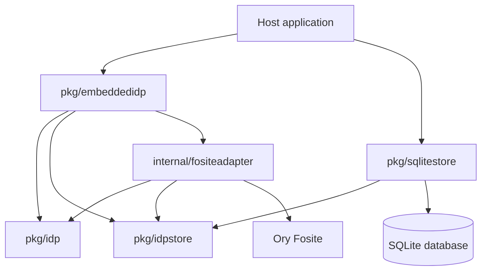
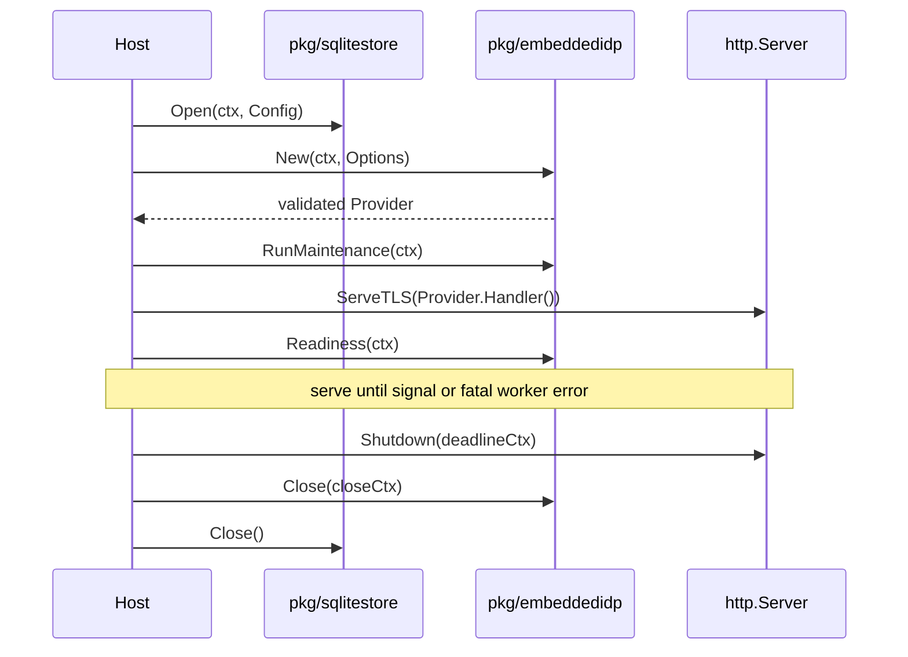

# tiny-idp: Production Embedding API, Security Hardening, and Release Evidence

This is the current embedding and release-hardening branch of the [[tiny-idp]] project map.

This report explains the second production-engineering stage of `tiny-idp`: the work required after a protocol-capable OpenID Provider existed, but before that provider could be treated as a production release. The repository already had a strict Ory Fosite engine, durable SQLite protocol state, server-side sessions, consent, signing keys, and successful hosted OpenID Foundation Basic OP evidence. The July 9 review then evaluated the assembled product at its public API, persistence, authentication, operations, and release boundaries. That review correctly returned a no-go decision.

The subsequent implementation program replaced the unusable embedding boundary, made security transitions transactional, replaced WAL-unsafe backup with verified SQLite online backup, bounded password work, made abuse controls and audit mandatory, separated liveness from readiness, added maintenance and key-retention lifecycles, implemented a hardened production host, and built repository-specific static and runtime analysis tooling. Candidate commit `29309814f1fcdad3a5134674fc27a8938cb39c6a` passed the complete local engineering gate. It remains intentionally **not approved for production** because exact-artifact hosted conformance, signed release artifacts, SBOM/provenance output, license reconciliation, target-environment proof, independent review, and release-owner approval are still open.

This document is written as a technical project report for an engineer joining the repository. It is self-contained, but it follows the earlier report [[PROJECT REPORT - tiny-idp - Strict Fosite Provider and Hosted OIDF Conformance]], which explains how the strict engine and hosted Basic OP conformance work were built.

> [!summary] Project result
> - `tiny-idp` now has an externally consumable production embedding API built entirely from public Go packages.
> - Production construction fails closed when persistence, schema, keys, token secret, cookies, audit, rate limiting, client-address resolution, password policy, or maintenance contracts are unsafe.
> - SQLite security transitions use explicit transactions and named invariant operations; live backup uses the SQLite backup API and verifies the result before atomic publication.
> - Password authentication uses NIST-aligned acceptance rules, Argon2id, atomic lockout accounting, layered request limits, trusted-proxy parsing, and a capacity-two password-work semaphore with metrics.
> - Signing rotation, JWKS overlap, audit delivery, retention, liveness, readiness, and incident response have executable lifecycle semantics.
> - Custom `go/analysis` analyzers, external-module flows, security probes, fuzzers, load instrumentation, recovery drills, and CI workflows provide review evidence.
> - Candidate `2930981` is a strong local release candidate, not an approved production release.

## Report scope and evidence

The report synthesizes three docmgr workspaces and their diaries rather than describing only the final source tree:

| Ticket | Role in the project | Principal documents |
| --- | --- | --- |
| `TINYIDP-PROD-001` | Built the strict Fosite engine and production-oriented domain model. | `design-doc/01-production-embeddable-idp-design-and-implementation-guide.md`, `reference/01-oidc-intern-textbook.md`, `reference/02-investigation-diary.md`, hosted OIDF summary. |
| `TINYIDP-PROD-REVIEW-001` | Performed an adversarial production review and created Go AST analysis, failure probes, fuzzing, and runtime instrumentation. | `design-doc/01-tiny-idp-production-readiness-architecture-and-code-review.md`, `reference/01-investigation-diary.md`, `scripts/`, runtime and scanner evidence. |
| `TINYIDP-PROD-IMPL-001` | Remediated the review findings in phases and assembled the release-candidate evidence packet. | implementation guide, 13,000-word diary, operations runbook, runtime summary, release ledger, CI and release workflows. |

The final candidate contains 31 commits after the review baseline `a4b67c8`. Excluding ticket material, the change spans 90 files with 6,601 insertions and 1,631 deletions. Those numbers describe surface area, not correctness. Correctness comes from the stated invariants, automated tests, executable probes, and explicit release gate.

The report uses four evidence classes:

1. Source inspection of the public packages, Fosite adapter, authentication code, storage implementation, admin operations, production host, and workflows.
2. Chronological diary entries recording commands, failed attempts, corrections, and review concerns.
3. Executable evidence from tests, fuzzing, race detection, custom analyzers, vulnerability scanning, external-module use, runtime metrics, and recovery drills.
4. Primary guidance captured in ticket `sources/`, including OpenID Connect Core, RFC 9700, SQLite backup/WAL documentation, Go HTTP/security documentation, NIST SP 800-63B-4, and OWASP authentication/password-storage guidance.

## Project chronology

The implementation history matters because the current architecture was not designed in isolation. Each phase closed a reproduced failure or an externally visible gap.

| Stage | Principal commits | Result |
| --- | --- | --- |
| Strict-provider foundation | Work through `a4b67c8` and the `TINYIDP-PROD-001` diary | Separated mock and strict engines; integrated Fosite; added durable protocol storage, server-side sessions, consent, key rotation, hardening, and hosted Basic OP automation. |
| Production review | `bcca18c` through `7053b2a` | Built analyzers and probes, reproduced P0/P1 defects, and issued the explicit no-go report. |
| Phase 0: release graph | `a2c86a9`, `5882634`, `886b763` | Selected Go 1.26.5 and a fixed JOSE graph, rebuilt validation tools, obtained zero reachable vulnerability findings, and recorded a clean committed gate. |
| Phase 1: public API | `92e0821` through `88e29fd` | Published `pkg/idp`, `pkg/idpstore`, and `pkg/sqlitestore`; replaced construction with `New(ctx, Options)`; proved an outside-module TLS OIDC flow. |
| Phase 2: durable invariants | `df72fdd`, `7cd13b4`, `9a7f540` | Added transactions, named atomic operations, migration checksums, online backup, read-only verification, offline restore, and failure tests. |
| Phase 3: authentication | `7022e7d`, `caf9e2e` | Added NIST-aligned password acceptance, bounded Argon2 work, layered limiting, trusted proxy resolution, atomic lockout, and password-change revocation. |
| Phase 4: lifecycle | `f8c35bb` | Added durable audit semantics, effective cookie/TTL/route contracts, exact readiness, maintenance, signing overlap, and downgrade refusal. |
| Phase 5: release candidate | `2a0b287`, `5e23978`, `2930981` | Added production host, local load/recovery evidence, release workflows, reproducible binary command, license collection, runbook, and approval ledger. |
| Documentation delivery | `babf302`, `f31058f` | Committed the final ticket bundle and delivered the release review to reMarkable without changing the not-approved decision. |

The earlier hosted Basic OP work used plan `Geeb9MBn659ah` and recorded `PASSED=21`, `WARNING=6`, `SKIPPED=4`, and `REVIEW=4`. It exposed concrete protocol issues involving ID Token claim scoping, CSP form behavior, `prompt=none`, `max_age`, unsupported request objects, and distinct-client refresh-token binding. That evidence applies to the earlier strict implementation. The current release gate still requires a fresh plan run bound to the exact candidate artifact hash because later production hardening changed the public host, persistence, authentication, routing, TTL, and lifecycle paths.

### What the diaries add beyond the final source

The diaries preserve failed attempts that materially influenced the final contracts:

- A golangci-lint binary built with Go 1.25 rejected the Go 1.26.5 target. The cache path now includes the builder toolchain, not only the linter version.
- Mechanical public-package migration accidentally rewrote receiver selectors and missed an external-test package name. Full compilation and typed analysis exposed both problems before the API gate.
- The original backup test encountered a temporary directory that was not owner-only. Backup now corrects dedicated directories to `0700` while refusing dangerous roots such as `/` and the shared system temp directory.
- The backup implementation required careful `SQLiteBackup.Finish` ownership; an unconditional second close was invalid. BUSY/LOCKED also appears as an incomplete step without an error in the driver, so the loop includes context-aware delay rather than hot spinning.
- The refresh-reuse path initially conflicted with generic rollback semantics. Separating committed security outcome from storage error preserved revocation evidence.
- The first lifecycle analyzer runs reported both real server defects and analyzer false positives. Type-aware package qualification plus explicit development/transaction directives made the tool actionable instead of suppressing broad file classes.
- The first reproducibility comparison differed because Git checkout builds embedded VCS data while archive builds did not. Both workflows now use `-buildvcs=false`, with commit identity carried by provenance.
- The first dependency-license collector emitted literal `\t` text and collected zero module directories. Emitting real tab delimiters produced 354 notice-bearing module directories and eight explicit follow-ups.

These events are part of the evidence. They show where the implementation relied on tests, type checking, external fixtures, and clean-archive reruns to correct assumptions.

## 1. The system being released

### 1.1 The identity-provider responsibilities

An OpenID Provider authenticates a resource owner and issues statements that an OAuth client can validate and use. In the supported `tiny-idp` profile, the client starts an Authorization Code request, the browser authenticates with the provider, the provider returns a one-time code to an exact registered redirect URI, and the client exchanges that code with a PKCE verifier. The resulting ID Token contains identity claims; the access token authorizes UserInfo; a refresh token can extend the session when `offline_access` was granted.

The strict implementation divides responsibility deliberately:

- Ory Fosite owns OAuth/OIDC protocol mechanics: request parsing, client validation, exact redirect handling, grant processing, PKCE, code consumption, token exchange, refresh rotation, session serialization, and standards-shaped errors.
- `tiny-idp` owns product policy: users, password verification, account state, browser sessions, CSRF, consent, claim selection, audit, rate limiting, signing-key lifecycle, storage, readiness, and embedding.
- The host application owns network and process concerns: listener, TLS, trusted proxies, HTTP limits, timeouts, signal handling, maintenance scheduling, and graceful shutdown.
- SQLite owns durable single-node state, but only within a documented local-filesystem and single-active-process envelope.

This division prevents protocol library types from becoming the public product API and prevents an embedded handler from pretending it controls deployment properties that only its host can enforce.

### 1.2 Two engines with different purposes

`tiny-idp` is intentionally a dual-engine project.

| Engine | Primary use | State and controls | Production status |
| --- | --- | --- | --- |
| Mock engine (`internal/server`) | Relying-party development, scenario injection, malformed tokens/JWKS, device and DPoP experiments, debug flows. | Development-oriented, mainly in-memory, permissive where tests require it. | Must not be exposed as the production IdP. |
| Strict engine (`internal/fositeadapter`) | Authorization Code + PKCE OIDC, durable identities and protocol state, real browser authentication and consent. | Fosite plus public policy contracts and durable SQLite. | The only production-shaped engine. |

The strict engine is not “the mock engine with more flags.” Keeping the engines separate prevents test-only behavior from entering the production route set. The mock engine remains valuable precisely because it can generate invalid and unusual conditions. The strict engine must reject those same conditions.

### 1.3 Supported strict HTTP surface

The strict provider registers the following issuer-scoped routes:

| Route | Responsibility |
| --- | --- |
| `/.well-known/openid-configuration` | Publish the canonical issuer, endpoints, supported grant/response types, scopes, token auth methods, signing algorithm, and PKCE method. |
| `/jwks` | Publish the active RSA verification key and retired keys still inside the verification-overlap window. |
| `/authorize` | Validate the authorization request, handle browser session reuse, perform login and consent, then create an authorization code. |
| `/token` | Exchange a code or rotate a refresh token. |
| `/userinfo` | Return scope-governed claims for a valid access token. |
| `/healthz` | Report lifecycle-only liveness. |
| `/readyz` | Report dependency- and invariant-aware readiness. |

If the issuer is `https://idp.example.test/auth`, only `/auth/...` routes exist. Earlier code also registered root aliases, which made discovery and actual reachability disagree. Phase 4 removed those aliases.

## 2. Why the July 9 production review returned no-go

Protocol conformance is necessary, but it does not prove that a Go library can be embedded safely, that committed state survives backup, that concurrent authentication cannot bypass lockout, or that an artifact can be reproduced and approved. The review therefore tested the assembled system rather than repeating only happy-path OIDC flows.

### 2.1 Release-blocking findings

The review identified six P0 families:

| Finding | Demonstrated consequence | Required remediation |
| --- | --- | --- |
| Exported API referred to `internal/` types. | A different Go module could not construct the production provider. | Move stable identity, policy, store, and SQLite contracts into public packages; replace the API directly. |
| Reachable vulnerabilities existed in the selected Go/JOSE graph. | The candidate could include reachable known security defects. | Pin a patched Go toolchain and fixed JOSE edge; require zero reachable findings. |
| Backup copied only the SQLite main file. | A readable backup silently omitted committed WAL data. | Use SQLite online backup, verify read-only, fsync, and publish atomically. |
| Multi-write security transitions were not atomic. | Crashes or statement errors could leave orphan users, partial token revocation, or broken key/JWKS state. | Put each invariant inside a database transaction and test statement-boundary failures. |
| Abuse controls failed open. | Nil controls were allowed, ephemeral ports changed limiter identity, and concurrent failures lost lockout increments. | Require production controls, normalize trusted client identity, atomically count failures, and bound Argon2 work. |
| SQLite permissions depended on ambient umask. | Password hashes and private signing keys could be created with mode `0644`. | Enforce owner-only database, sidecar, backup, audit, and secret files. |

The review also identified P1 lifecycle and release problems: password acceptance did not enforce its declared minimum, unsupported must-change state was ignored, signing-key validity could fail open, audit could silently disappear, retention and schema operations were incomplete, `SameSite` and per-client TTL fields were ineffective, no executable hardened host existed, and CI/release evidence was incomplete.

### 2.2 Why the public API defect mattered

The old exported `pkg/embeddedidp.Options` included types from `internal/storage`, `internal/audit`, and `internal/fositeadapter`. Go enforces `internal` package visibility at compile time. An application outside `github.com/manuel/tinyidp` therefore received:

```text
use of internal package github.com/manuel/tinyidp/internal/store/sqlite not allowed
```

This was not a documentation defect. The intended production integration was impossible. Preserving the old API with aliases or compatibility adapters would preserve no working external behavior, so the implementation replaced it directly.

### 2.3 Why the backup defect was severe

SQLite WAL mode commits changes to the `-wal` file before those pages necessarily reach the main database file. Copying only `idp.db` can therefore produce a syntactically valid database representing an older logical state. The review probe placed a committed sentinel in WAL, copied the main file, opened the copy successfully, and observed that the sentinel was missing.

An identity provider backup must preserve users, credentials, clients, signing keys, grants, protocol requests, refresh state, and migration history as one coherent snapshot. “The backup opens” is not sufficient evidence.

### 2.4 Why method-level locks were insufficient

Several workflows called two or more persistence methods in sequence. A mutex inside each method serializes individual calls, but it does not roll back a sequence or protect it across connections. Representative examples included:

```text
create user
create password credential

deactivate old signing key
activate new signing key
retire old signing key

mark refresh token inactive
create replacement token
revoke family on reuse
```

Each sequence has an old valid state and a new valid state. Intermediate states are invalid. The durable store therefore needed transaction-scoped APIs and named operations expressing the complete invariant.

## 3. Final package architecture

The production packages now form a public boundary above internal Fosite composition:



The packages have narrow ownership:

| Package | Stable responsibility |
| --- | --- |
| `pkg/idp` | Audit, consent, limiter, trusted-address, authenticator, password-policy, password-work, readiness, and maintenance-status contracts. It contains no Fosite types. |
| `pkg/idpstore` | Durable records, sentinel errors, read/transaction interfaces, schema/maintenance capabilities, and named security operations. |
| `pkg/sqlitestore` | Supported SQLite configuration, migrations, transactions, backup, verification, restore, maintenance, and diagnostics. |
| `pkg/embeddedidp` | Context-aware construction, fail-closed preflight, HTTP handler, liveness, readiness, maintenance invocation, password metrics, and close. |
| `internal/fositeadapter` | Translation between public product contracts and Fosite request/session/storage behavior. |
| `internal/authn` | Password verification, dummy work, rehash, lockout transitions, and security audit. |
| `internal/admin` and `internal/cmds` | Administrative invariants and Glazed CLI wiring, including `serve-production`. |

This architecture allows an external host to depend on product concepts without importing Fosite or raw `database/sql` types.

## 4. The production embedding API

### 4.1 Construction options

The public constructor is `embeddedidp.New(ctx, Options)`. The principal configuration is:

```go
type Options struct {
    Issuer         string
    Mode           idpstore.Mode
    Store          idpstore.Store
    Cookie         CookieConfig
    Token          TokenConfig
    Audit          idp.Sink
    Consent        idp.ConsentPolicy
    RateLimiter    idp.RateLimiter
    ClientAddress  idp.ClientAddressResolver
    Authenticator  idp.PasswordAuthenticator
    PasswordPolicy idp.PasswordAcceptancePolicy
    PasswordWork   idp.PasswordWorkConfig
    Maintenance    MaintenanceConfig
}

func New(ctx context.Context, opts Options) (*Provider, error)
```

The provider exposes:

```go
func (p *Provider) Handler() http.Handler
func (p *Provider) Liveness(ctx context.Context) idp.ReadinessReport
func (p *Provider) Readiness(ctx context.Context) idp.ReadinessReport
func (p *Provider) RunMaintenance(ctx context.Context) (idpstore.MaintenanceReport, error)
func (p *Provider) MaintenanceStatus() idp.MaintenanceStatus
func (p *Provider) PasswordWorkStats() (idp.PasswordWorkStats, bool)
func (p *Provider) Close(ctx context.Context) error
```

`New` does bounded validation before returning a handler. `Close` is idempotent. The host owns the injected store and closes it after closing the provider. Maintenance is host-driven rather than hidden in a provider goroutine; the supported production command runs it before serving and schedules subsequent passes through an `errgroup` lifecycle.

### 4.2 Production preflight

Production construction rejects:

- a non-HTTPS or non-canonical issuer;
- invalid registered clients, redirects, scopes, or PKCE policy;
- an in-memory/nonpersistent store;
- a schema version different from the binary's exact supported version;
- a token secret shorter than 32 bytes;
- insecure cookies or unsupported `SameSite` configuration;
- nil or non-production audit, rate-limiter, or address-resolver controls;
- a password policy below the production minimum or without a blocklist;
- unbounded password work;
- an absent, expired, not-yet-valid, malformed, weak, or non-unique active key;
- a store without maintenance support;
- retention shorter than live token/key lifetimes require.

Preflight can be summarized as:

```text
validate context and canonical issuer
load and validate every registered client
derive minimum maintenance retention from client TTLs
require persistent store and exact migration version
require secure cookie and strong token-secret policy
require durable audit, limiter, and trusted-address contracts
require NIST-aligned password acceptance and bounded work
load active signing key and all published verification keys
parse RSA material; require RS256, >=2048 bits, current time window
require exactly one active key and valid retired-key metadata
construct internal Fosite provider
return only if the production contract is satisfied
```

### 4.3 Ownership and lifecycle



The host owns the `http.Server`, listener, TLS configuration, request limits, trusted proxy deployment, and shutdown deadline. The provider owns OIDC behavior and its lifecycle state. This makes resource ownership reviewable and prevents double close or hidden goroutine leaks.

## 5. Authorization Code plus PKCE through the system

The principal browser flow is:

```mermaid
sequenceDiagram
    participant RP as Relying party
    participant Browser
    participant IdP as tiny-idp strict handler
    participant Auth as authn/consent
    participant Fosite
    participant DB as SQLite

    RP->>Browser: authorization URL + state + nonce + S256 challenge
    Browser->>IdP: GET /authorize
    IdP->>Fosite: validate client, exact redirect, scopes, PKCE
    Fosite->>DB: read client and request state
    IdP-->>Browser: login/consent form + CSRF cookie
    Browser->>IdP: POST credentials + consent + CSRF
    IdP->>Auth: rate limit and authenticate
    Auth->>DB: read credential; atomically update account state
    IdP->>DB: persist hashed browser session and consent
    IdP->>Fosite: finish authorization
    Fosite->>DB: persist one-time code/PKCE/OIDC session
    IdP-->>Browser: 303 exact redirect + code + state
    Browser-->>RP: callback
    RP->>IdP: POST /token + code + verifier
    IdP->>Fosite: authenticate client; consume code; verify PKCE
    Fosite->>DB: atomic protocol state transition
    IdP-->>RP: ID token + access token + optional refresh token
    RP->>IdP: GET /userinfo with access token
    IdP-->>RP: claims allowed by granted scopes
```

Important invariants are enforced at different layers:

- Fosite requires code-flow protocol semantics and S256 PKCE.
- Exact redirect comparison prevents redirect prefix/suffix confusion.
- CSRF uses a random nonce plus HMAC, duplicated in an `HttpOnly` cookie and form field.
- Browser sessions send a random handle but persist only its keyed hash.
- Password verification does equivalent expensive work for unknown accounts.
- Consent is stored server-side against normalized exact scope sets.
- Claims are derived from granted scopes, not merely requested scopes.
- Authorization codes are one-time state and refresh tokens rotate.
- Client-specific access, ID, and refresh TTLs survive request serialization and restoration.
- Cryptographic randomness errors propagate instead of silently accepting zero or partial values.

## 6. Transactional persistence and invariants

### 6.1 Public store model

`pkg/idpstore` separates reads from transaction-scoped mutation. The public interface does not expose `*sql.Tx`:

```go
type Store interface {
    ReadStore
    View(ctx context.Context, fn func(ReadStore) error) error
    Update(ctx context.Context, fn func(TxStore) error) error

    CreateUserWithCredential(ctx context.Context, user User, credential PasswordCredential) error
    ReplacePasswordAndSecurityState(ctx context.Context, credential PasswordCredential, state AccountSecurityState) error
    RecordFailedLogin(ctx context.Context, userID string, now time.Time, policy LockoutPolicy) (AccountSecurityState, error)
    RotateSigningKey(ctx context.Context, next SigningKey, now time.Time) (RotationResult, error)
    // Additional named lifecycle operations omitted here.
}
```

The callback rules are explicit:

- a callback error rolls back and remains the returned cause;
- commit errors are returned even when callback work succeeded;
- a scoped transaction object cannot be used after callback return;
- nested transactions return `idpstore.ErrNestedTransaction`;
- context cancellation aborts waits and SQL work;
- audit does not claim success before commit;
- expected security outcomes that require committed evidence are returned only after commit.

### 6.2 Transition inventory

| Transition | Required atomic result |
| --- | --- |
| User plus credential creation | Both records exist, or neither exists. |
| Password replacement | New verifier, reset security state, and revocation of all user sessions/grants/protocol state commit together. |
| Failed login | Counter, failure window, and derived lockout reflect one serial update. |
| Successful login | Security reset and any paired session state cannot partially commit. |
| Authorization-code consumption | Exactly one consumer changes the code from active to used. |
| Refresh replacement | Old refresh state is revoked only if replacement state is durable. |
| Refresh reuse | Reuse evidence and whole-family revocation commit before `ErrRefreshReuseDetected` returns. |
| Signing rotation | New key insertion, activation, old-key retirement, and verification overlap form one transition. |
| Fosite refresh/access revocation | Related protocol-token classes cannot diverge after failure. |

The refresh-reuse control flow deserves attention. If a transaction callback returned `ErrRefreshReuseDetected` directly, the generic `Update` contract would roll back the family revocation. The implementation records the expected security outcome separately, lets the callback return `nil`, commits the evidence and revocations, and returns the sentinel afterward.

```text
begin transaction
inspect refresh token and family
if token was already consumed:
    mark reuse detected
    revoke every active family member
    commit
    return ErrRefreshReuseDetected
else:
    consume old token
    create linked replacement
    commit
    return replacement
```

### 6.3 Migration ledger and key uniqueness

Migrations use contiguous numeric versions `001` through `005`. The store records version, filename, SHA-256 checksum, and application timestamp in `schema_migrations`. Existing checksum mismatches fail reopening; failed SQL does not receive a ledger row; a database newer than the binary fails closed.

Migration `003_signing_key_invariants.sql` adds a partial unique index for the active key. Migration `004_subject_revocation.sql` adds indexed subject columns needed to revoke a user's Fosite state during password replacement. Migration `005_maintenance_timestamps.sql` adds protocol creation timestamps used by conservative retention.

The supported SQLite configuration is intentionally narrow:

```go
type Config struct {
    Path               string
    BusyTimeout        time.Duration // default 5s
    JournalMode        string        // default WAL
    Synchronous        string        // default FULL
    MaxOpenConnections int           // exactly 1
}
```

One connection is part of the first production topology, not a general performance recommendation. It keeps connection-local PRAGMAs deterministic and gives in-process security transitions and backup one ordering point. The supported filesystem must provide SQLite locking, atomic same-filesystem rename, file fsync, and directory fsync. NFS, SMB/CIFS, distributed filesystems, object-store mounts, multiple active processes, and active/active operation are outside this release envelope.

## 7. Correct live backup and offline restore

The implementation in `pkg/sqlitestore/backup.go` uses `github.com/mattn/go-sqlite3.SQLiteConn.Backup` rather than copying the database file. It reserves the single source connection, captures a logical source manifest, copies pages in bounded batches, and checks the request context between steps.

```mermaid
flowchart LR
    Live[(Live SQLite DB<br/>main + WAL)] -->|sqlite3_backup<br/>128-page steps| Temp[(0600 temporary DB)]
    Temp --> Integrity[Read-only immutable open<br/>integrity_check]
    Integrity --> Schema[Exact schema and<br/>migration checksums]
    Schema --> Manifest[Compare all table counts,<br/>version, checksums, active key IDs]
    Manifest --> Sync[fsync file and directory]
    Sync --> Rename[Atomic rename to final path]
    Rename --> FinalSync[fsync destination directory]
    FinalSync --> Published[(Verified published backup)]
```



The manifest includes every domain and Fosite table, the migration ledger, the highest schema version, and ordered active-key identifiers. This is stronger than an integrity check: a database can be internally consistent while representing the wrong snapshot.

Failure behavior follows the “preserve the last known good artifact” rule:

```text
validate source and destination differ
create 0700 destination directory and 0600 temporary file
copy SQLite pages with cancellation and busy handling
close/finalize the backup handle exactly once
verify the temporary artifact without migration or mutation
if any error, cancellation, ENOSPC, or manifest mismatch:
    delete only the temporary artifact
    leave an existing final backup unchanged
otherwise:
    fsync temporary file
    fsync directory
    atomically rename temporary to final
    fsync directory again
```

`VerifyBackup` opens with `mode=ro&immutable=1`. It does not call normal `Open`, run migrations, create a journal, or update metadata. It requires `PRAGMA integrity_check = ok`, an exact supported schema, matching migration checksums, and an optional expected manifest.

Restore is intentionally offline. It refuses a destination with a live `-wal` or `-shm`, stages a verified owner-only database in the destination directory, verifies it again, preserves the current database as `.pre-restore-<timestamp>`, installs atomically, and fsyncs the directory. The operator keeps the rollback database until the reopened provider passes `doctor`, readiness, and an external strict OIDC flow.

The regression suite covers:

- a nonempty committed WAL whose sentinel survives backup and restore;
- concurrent writers and a self-consistent backup;
- callback/statement failures that leave no partial state;
- corrupt source rejection;
- cancellation without temp-file leakage or final-artifact replacement;
- a held connection respecting context deadline;
- injected `ENOSPC` preserving the last good backup;
- restore rollback preservation;
- newer-schema/downgrade refusal.

## 8. Password authentication and abuse controls

### 8.1 Password acceptance is separate from hashing

The repository previously treated hash parameters and acceptance policy as if they were one concern. They answer different questions:

- Acceptance decides whether a proposed password may be established.
- Hashing decides how accepted normalized bytes are encoded and how expensive verification is.

`pkg/idp.PasswordAcceptancePolicy` applies NFC normalization, requires valid UTF-8, enforces character and byte ceilings, checks a blocklist, and includes deployment context words. The production default follows the captured NIST SP 800-63B-4 single-factor guidance:

| Property | Production default |
| --- | ---: |
| Minimum length | 15 Unicode characters |
| Maximum accepted length | 1,024 characters |
| Maximum normalized bytes | 4,096 bytes |
| Normalization | Unicode NFC |
| Blocklist | Required; bundled baseline plus context-derived terms |
| Composition rules | Not imposed |

Creation, reset, and replacement use the same policy. The unsupported `MustChangeAtLogin` state was deleted because no complete restricted password-change flow existed; leaving the field while ignoring it would be a false security contract.

### 8.2 Argon2id and bounded work

The password verifier uses salted Argon2id with the project defaults:

```text
memory:      64 MiB
iterations:  3
parallelism: 2
salt:        16 random bytes
key:         32 bytes
admission capacity: 2 concurrent operations
```

Hashing, verification, dummy unknown-account verification, and opportunistic rehash all pass through the same context-aware capacity gate. Otherwise an attacker could select the path that bypasses the semaphore. The reporter exposes capacity, in-flight work, waiters, saturations, context rejections, completions, aggregate wait, and aggregate Argon duration.

Authentication pseudocode is:

```text
resolve the client address through the configured trust policy
consume account, OAuth-client, and network-address limiter buckets
acquire a password-work permit using the request context
load user, credential, and security state
if account is unknown or unusable:
    perform dummy Argon2id verification
    return generic credentials failure
verify the stored Argon2id value
if malformed storage or persistence failure:
    return authentication unavailable (HTTP 503)
if password is wrong:
    atomically increment failure window and derive lockout
    emit stable audit outcome
    return generic credentials failure
if hash parameters require update:
    generate and persist replacement; fail closed on error
atomically reset successful-login security state
return authenticated identity
```

The distinction between invalid credentials and authentication infrastructure failure matters. A database error must not be converted into a normal failure if doing so bypasses state updates or makes operations believe lockout remains reliable.

### 8.3 Layered rate-limit keys

Production consumes three independent fixed-window keys:

- `SHA-256(normalized login)` so the key is stable without exposing the login;
- OAuth client identifier;
- resolved client network address.

All three are consumed even if one rejects, avoiding behavior that depends on which bucket is already exhausted. Responses remain generic and do not reveal whether the account exists.

The direct resolver trusts only the immediate TCP peer and ignores forwarding headers. `TrustedProxyResolver` accepts `X-Forwarded-For` only when the immediate peer belongs to an explicit CIDR. It parses every address, rejects overlong chains, appends the immediate peer, and walks right-to-left until it finds the first untrusted address. Taking the leftmost value without proving the trusted suffix would let a client choose its own limiter identity.

The built-in limiter is in-process and resets on restart. That is consistent with the documented single-active-node topology but remains a release risk to accept or replace with an injected durable/distributed implementation.

### 8.4 Password-change revocation

Replacing a password atomically changes the credential and security state while revoking:

- server-side browser sessions;
- domain grants, authorization codes, access tokens, and refresh families;
- Fosite authorization-code, PKCE, OIDC, access-token, and refresh-token rows.

Migration 004 introduced indexed subjects for Fosite tables so this security operation does not depend on scanning opaque JSON blobs.

## 9. Signing-key lifecycle and JWKS

The provider signs ID Tokens with RS256. Production startup requires exactly one current active signing key, a parseable RSA private key of at least 2048 bits, consistent metadata, and parseable published verification keys.

Normal rotation is atomic:

```text
generate next RSA key as inactive
begin transaction
insert next key
deactivate current active key
activate next key
mark previous key inactive with retirement timestamp
commit
```

The old key remains in JWKS until every ID Token it may have signed has expired plus five minutes of skew. The minimum retention is derived from the maximum registered client ID-token TTL. Maintenance removes the retired private key only after that overlap.

```mermaid
stateDiagram-v2
    [*] --> Staged: generated, inactive
    Staged --> Active: atomic rotation
    Active --> RetiredPublished: next rotation; retirement timestamp
    RetiredPublished --> Deleted: maintenance after max ID TTL + skew
    RetiredPublished --> EmergencyPurged: compromise response
```



Planned rotation and compromise response are different operations. Planned overlap preserves valid token verification. `keys purge-retired` intentionally removes a compromised retired key before overlap ends. It refuses the active key and a staged key with no retirement timestamp. Emergency purge causes otherwise unexpired tokens signed by that key to fail, which is the intended compromise response.

## 10. Audit semantics

Production requires an audit sink implementing durable health reporting. `pkg/idp.FileAuditSink` uses a deliberately explicit policy:

- JSON Lines, one event per append;
- synchronous file append and `fsync` before `Emit` returns success;
- owner-only file permissions;
- no memory buffer and no intentional drop path;
- caller backpressure while I/O completes;
- delivered, failed, and dropped counters;
- stable event/reason codes;
- no passwords, client secrets, raw tokens, authorization codes, cookies, or private keys.

An administrative mutation can commit before its audit append fails. Generic rollback is no longer possible at that point. Admin methods therefore return the committed value plus `idp.ErrAuditDelivery`, instructing the caller to reconcile state rather than blindly retrying a non-idempotent operation.

HTTP response paths have another constraint: OAuth output may already have been written when audit delivery fails. The provider records a monotonic failure, fails readiness, and does not attempt to replace a partially written protocol response. The incident runbook then removes the node from traffic and reconstructs the evidence gap.

The synchronous policy is correct but not free. `fsync` latency directly affects callers, and a full audit volume makes the provider unready. A future transactional outbox could couple database mutation and audit intent more tightly. An in-memory queue without durable loss/backpressure semantics would weaken the current contract.

## 11. Maintenance, liveness, and readiness

Maintenance deletes expired sessions, terminal domain codes/tokens, old Fosite protocol state, consent where policy permits, expired JTI records, and signing keys whose verification overlap has ended. It runs inside one store transaction and returns counts by record family.

Default derivation is:

```text
expired domain retention = 24 hours
protocol retention = maximum configured refresh-token TTL + expired retention
signing-key retention = maximum configured ID-token TTL + 5 minutes skew
maintenance interval = 15 minutes
readiness deadline = 2 × maintenance interval
```

The host calls `RunMaintenance`. One mutex serializes cleanup passes; a separate short-held mutex stores status so `/readyz` never blocks for an entire cleanup.

Liveness and readiness answer different operational questions:

| Signal | Checks | Intended action |
| --- | --- | --- |
| Liveness | Provider lifecycle is not closed. | Restart only when the process/provider cannot function. |
| Readiness | Lifecycle, store, exact schema, signing keys, token secret, audit, limiter, and maintenance status. | Remove from traffic while dependencies or invariants are unsafe. |

Readiness has eight stable components:

| Component | Evidence |
| --- | --- |
| `lifecycle` | Provider is open. |
| `store` | A bounded client-list query succeeds. |
| `schema` | Database version equals the binary's embedded migration count. |
| `signing_key` | Exactly one current 2048-bit+ RS256 signer and every published key parses. |
| `token_secret` | Secret meets production length policy. |
| `audit` | Durable sink is healthy and no delivery failure was recorded. |
| `rate_limiter` | Injected limiter declares production readiness. |
| `maintenance` | Cleanup support exists and the last successful pass is not overdue. |

The initial maintenance state is degraded, then becomes unready after two missed intervals or after a failed run. An audit failure or temporary store problem makes readiness return HTTP 503 while liveness remains HTTP 200. This prevents restart loops from obscuring a storage or audit incident.

## 12. The executable production host

`internal/cmds/serve_production.go` implements `tinyidp serve-production` using Glazed fields and the existing command/help/logging system. It does not read the token secret from a literal CLI value or environment variable. It requires an owner-only secret file of at least 32 bytes, an HTTPS issuer, certificate and key paths, durable SQLite, and a durable audit file.

The host enforces:

- TLS 1.2 minimum;
- explicit certificate/key loading;
- `http.MaxBytesHandler` around the IdP handler;
- read-header, read, write, and idle timeouts;
- a one-megabyte default header and request-body ceiling;
- direct-peer or configured trusted-proxy client-address policy;
- fixed-window login limiting;
- initial maintenance before listening and scheduled maintenance afterward;
- SIGINT/SIGTERM cancellation through `errgroup`;
- graceful `http.Server.Shutdown` with a bounded deadline.

A simplified host is:

```go
srv := &http.Server{
    Addr:              listenAddress,
    Handler:           http.MaxBytesHandler(provider.Handler(), maxBody),
    ReadHeaderTimeout: 5 * time.Second,
    ReadTimeout:       15 * time.Second,
    WriteTimeout:      30 * time.Second,
    IdleTimeout:       60 * time.Second,
    MaxHeaderBytes:    1 << 20,
}

g, runCtx := errgroup.WithContext(ctx)
g.Go(func() error { return srv.ListenAndServeTLS(certPath, keyPath) })
g.Go(func() error {
    <-runCtx.Done()
    shutdownCtx, cancel := context.WithTimeout(context.Background(), 30*time.Second)
    defer cancel()
    return srv.Shutdown(shutdownCtx)
})
```

The local exact-candidate smoke ran this command in tmux with an ephemeral RSA certificate and owner-only files. It negotiated HTTPS/HTTP2, returned green liveness and all eight readiness checks, wrote the maintenance audit event, stopped cleanly on SIGINT, and left the port unreachable.

## 13. Repository-specific static analysis

The production review did not rely only on general linters. The ticket contains a `multichecker` built with `go/ast`, `go/types`, `go/token`, `golang.org/x/tools/go/analysis`, `inspect.Analyzer`, and `analysistest`. It encodes project-specific errors that ordinary style tools cannot infer reliably.

| Analyzer | Enforced rule |
| --- | --- |
| `tinyidpinternalapi` | Exported public API types must not depend on Go `internal/` packages. |
| `tinyidprand` | Errors from `crypto/rand.Read` must not be discarded. |
| `tinyidphttpserver` | Package-level serving patterns that prevent timeout/shutdown configuration are rejected. |
| `tinyidpsecuritydefault` | Silent `NoopSink` and `AllowAllRateLimiter` defaults require an explicit development-only directive. |
| `tinyidpratelimitkey` | Raw `http.Request.RemoteAddr`, including ephemeral port, must not become a limiter key. |
| `tinyidpconfiguse` | Exported configuration fields that their defining public package never reads are reported. |
| `tinyidpauditdelivery` | Explicitly ignored `Sink.Emit` errors are reported. |
| `tinyidpatomicity` | Functions with multiple persistence mutations require a transaction or named atomic boundary. |
| `tinyidpbackupcopy` | Raw file copying inside SQLite backup code is reported. |

The analyzer evolved with the implementation. Early negative runs correctly reported the unusable public API, ignored randomness, no-op security defaults, raw addresses, discarded audit errors, open-coded multi-write transitions, and raw backup copy. Later refinements restricted public API checks to exported fields, distinguished package functions from methods, and introduced visible source directives:

```go
// tinyidp:development-default
// tinyidp:transaction-scoped
```

These are reviewable exceptions, not hidden filename allowlists. The final analyzer run is clean across `./pkg/...` and `./internal/...`, and its own rules have `analysistest` fixtures.

Static analysis is a regression barrier rather than a proof of full correctness. `tinyidpatomicity`, for example, detects suspicious syntax and known method families; transaction tests still prove rollback and concurrency semantics. Its value is that a future contributor receives an immediate diagnostic before a reviewer must rediscover the old defect.

## 14. Dynamic probes, fuzzing, and instrumentation

The review ticket preserves purpose-built tools under `scripts/`:

| Tool | Purpose |
| --- | --- |
| `external-consumer/flow_test.go` | Compile from a different module using only public packages and complete a TLS Authorization Code + S256 PKCE flow. |
| `sqlite-backup-probe.go` | Reproduce the original main-file-copy/WAL data-loss defect. |
| `security-invariants-probe` | Initially reproduce unsafe permissions/lockout/control defaults; later assert the protections. |
| `runtime-probe` | Exercise strict HTTP, password, token, refresh, UserInfo, readiness, SQLite, audit, and Go runtime paths while emitting NDJSON and profiles. |
| `runtime-analyze` | Aggregate HTTP latency/status, password-work, audit, runtime, and SQL pool observations into Markdown. |
| `fuzz_parsers_test.go` | Fuzz issuer, redirect, and Argon encoding parsers from seeded valid/invalid corpora. |
| `static-surface-audit.sh` | Search source/configuration surfaces for risky patterns and review changes. |

Application instrumentation was selected instead of eBPF for this phase. The required questions concern password admission, authentication result, protocol operation, SQLite pool queueing, audit delivery, Go heap/GC/goroutines, and readiness. Application-level counters and profiles observe those states directly, run without kernel privileges, and work in CI. eBPF could later investigate syscall, scheduler, network, or disk latency on a specific deployment, but it would not replace these semantic metrics.

## 15. Runtime evidence for candidate `2930981`

The bounded mixed run exercised 5,125 HTTP requests and emitted 129 audit events with zero HTTP errors.

| Operation | Count | Result | p50 | p95 | p99 |
| --- | ---: | --- | ---: | ---: | ---: |
| Discovery reads | 1,250 | all 200 | 105 µs | 236 µs | 848 µs |
| JWKS reads | 1,250 | all 200 | 2.51 ms | 10.46 ms | 15.75 ms |
| Readiness reads | 1,250 | all 200 | 12.76 ms | 26.12 ms | 34.67 ms |
| Concurrent UserInfo reads | 1,250 | all 200 | 5.68 ms | 15.73 ms | 22.53 ms |
| Authorization GET | 25 | all 200 | 505 µs | 1.72 ms | 2.06 ms |
| Password authorization POST | 25 | all 303 | 492.43 ms | 546.74 ms | 631.01 ms |
| Code exchange | 25 | all 200 | 8.15 ms | 10.90 ms | 20.57 ms |
| Refresh exchange | 25 | all 200 | 6.30 ms | 11.39 ms | 15.80 ms |
| Flow UserInfo | 25 | all 200 | 491 µs | 695 µs | 801 µs |

Password admission stayed inside its configured bound:

| Capacity | Completed | Saturations | Rejected | Aggregate wait | Aggregate Argon duration |
| ---: | ---: | ---: | ---: | ---: | ---: |
| 2 | 25 | 22 | 0 | 8.00 s | 3.46 s |

The process had 19 goroutines before and after. The run added 55 GC cycles, approximately 1.84 GB of cumulative allocations, and approximately 68 MB of live heap. The SQLite pool kept one open connection and recorded 8,827 waits totaling approximately 28.4 seconds in the generated summary; the evidence ledger later cites 8,847 waits from its final observation. The important conclusion is not a precise throughput claim. It is that the bounded password-work contract held, no request failed, no goroutine remained, audit delivery completed, and one-connection queueing was visible rather than hidden.

> [!warning] Interpretation boundary
> The runtime probe used `httptest` and a temporary local SQLite database. The TLS host smoke separately proved the executable host. Neither result predicts the first production filesystem, reverse proxy, CPU quota, cgroup memory limit, audit volume, or service-level objectives. Target-environment load and restore proof remain release gates.

## 16. Test and release-engineering gate

The exact local candidate passed:

- `go test ./... -count=1` and `go build ./...` from a clean archive;
- `go vet ./...`;
- full `go test -race ./... -count=1`;
- pinned golangci-lint v2.12.2 built with Go 1.26.5, with zero issues;
- Glazed lint;
- the custom AST multichecker;
- `govulncheck` v1.5.0 with zero reachable vulnerabilities;
- external-module production OIDC;
- production TLS host smoke;
- backup, restore, migration, downgrade, signing rotation, and token-secret drills;
- three 10-second fuzz campaigns: issuer 474,734 executions, redirect 514,796, Argon parser 442,681.

`govulncheck` still reported two advisories in imported packages and fourteen in required modules that the candidate does not call. The gate is zero reachable findings, not a misleading claim that the module graph contains no advisory metadata.

The supported toolchain is Go 1.26.5 with CGO enabled because `go-sqlite3` requires it. A linter built with Go 1.25 initially rejected the Go 1.26.5 target; the Makefile cache key now includes both linter version and builder toolchain. This diary incident is an important release lesson: the tool used to validate a source version is itself part of the reproducible toolchain.

The release binary command is:

```bash
go build -trimpath -buildvcs=false -o tinyidp-linux-amd64 ./cmd/tinyidp
```

Two clean archive builds produced the same SHA-256:

```text
1df7b90b9365fb8ad0b55473db93a050a71e86c11b3156616f1f9388b102f2ae
```

`-buildvcs=false` is intentional: an archive lacks `.git` while a GitHub checkout normally embeds VCS metadata. The commit identity belongs in artifact metadata and provenance; both build environments must execute the same binary command.

Three workflows separate continuously runnable checks from privileged/manual release evidence:

| Workflow | Role |
| --- | --- |
| `.github/workflows/ci.yml` | Build, unit, vet, lint, custom analysis, vulnerability, fuzz seeds, external consumer, and recovery checks. |
| `.github/workflows/release-gates.yml` | Expected-hash binding, race, longer fuzzing, injected faults, recovery drills, and hosted OIDF. |
| `.github/workflows/release-evidence.yml` | Binary/checksum, toolchain manifest, SPDX SBOM, module graph, license notices, GitHub provenance, and Sigstore keyless signatures. |

The workflows are implemented but not equivalent to completed runs. Production approval requires the actual generated artifacts and retained verification evidence.

## 17. Operations and incident model

The operations runbook makes the single-node safety boundary explicit. A normal deployment performs migration dry-run, migration, `doctor`, diagnostics export, initial maintenance, TLS startup, readiness validation, external OIDC smoke, and a verified backup. The deployed binary hash must equal the approved evidence packet.

The principal incident procedures are:

### SQLite corruption or I/O failure

Remove the node from traffic, stop it, preserve DB/WAL/SHM/audit/service evidence, record filesystem state, verify backups newest-to-oldest without mutation, restore to a stopped destination, and never merge a stale WAL into a restored main database. Recovery requires `doctor`, readiness, external OIDC, and a fresh verified backup.

### Signing private-key compromise

Preserve current JWKS and audit evidence, rotate atomically, confirm the new `kid`, emergency-purge the compromised retired key, notify relying parties, and review issuance after the earliest compromise time. Planned overlap is explicitly bypassed.

### Token-secret rotation

Stop traffic and the process, atomically install a new owner-only secret, restart once, prove fresh OIDC, and prove old access/refresh tokens fail. Old- and new-secret instances cannot serve concurrently because each rejects the other's opaque tokens and browser sessions.

### Audit delivery failure

Remove the node from traffic when readiness reports audit failure. Determine whether any admin operation returned `ErrAuditDelivery`, reconcile committed state before retry, restore capacity/permissions, and document the evidence gap.

### Rollback and downgrade

Code rollback is allowed only when the previous binary supports the current migration ledger. Never delete migration rows or rewrite checksums. Otherwise restore a verified pre-upgrade backup and accept its RPO, or roll forward with corrected code.

## 18. Candidate identity and current release decision

| Field | Value |
| --- | --- |
| Candidate source | `29309814f1fcdad3a5134674fc27a8938cb39c6a` |
| Branch during review | `task/prod-tiny-idp` |
| Local Linux/amd64 SHA-256 | `1df7b90b9365fb8ad0b55473db93a050a71e86c11b3156616f1f9388b102f2ae` |
| Toolchain | Go 1.26.5, CGO enabled |
| Schema | Version 5, checksummed migrations 001–005 |
| Local engineering gate | Passed |
| Production approval | **Not approved** |

The following gates remain blocking:

1. Run the intended hosted OpenID Foundation plan against an externally deployed binary whose SHA-256 equals the workflow input and evidence ledger.
2. Run the release-evidence workflow and retain actual checksums, SPDX SBOM, GitHub provenance, Sigstore signature, module graph, and license bundle.
3. Reconcile eight module-cache entries whose downloaded directories lacked a conventional top-level license file.
4. Repeat deployment, load, backup, restore, and recovery proof on the actual target filesystem, proxy, cgroup limits, and audit destination.
5. Obtain an independent security/code review that dispositions every blocker and residual risk.
6. Obtain a named release owner who verifies artifact identity, accepts residual risk with dates, records rollback authority, and signs approval.

The open license rows are `github.com/agnivade/levenshtein`, `github.com/aymanbagabas/go-udiff`, `github.com/chzyer/logex`, `github.com/josharian/intern`, `github.com/kr/pretty`, `github.com/kr/text`, `github.com/mattn/go-localereader`, and `github.com/niemeyer/pretty`. Their absence from the collector does not prove they are unlicensed; it requires checking authoritative upstream repositories and recording the notice before distribution.

### Residual risks requiring ownership

| Risk | Why it matters | Present control | Required release disposition |
| --- | --- | --- | --- |
| Hosted edge cases remain untested on this exact artifact. | Local flows do not replace official external conformance. | Runner and workflow exist. | Blocking pass with plan/test IDs and artifact hash. |
| No independent review. | The implementation and threat model have not received separate adversarial judgment. | Extensive docs, analyzers, tests. | Blocking named review and signed disposition. |
| Artifact lacks actual signature/SBOM/provenance. | Source-to-binary and supply-chain claims are not retained. | Workflow is wired. | Blocking generated and verified artifacts. |
| Audit append is not in the SQLite mutation transaction. | A committed mutation can have an evidence gap. | Synchronous fsync, typed error, readiness failure. | Accept with owner/expiry or design durable outbox. |
| Signing private keys live in SQLite, not KMS/HSM. | Database compromise exposes signing authority. | Owner-only local files and rotation. | Decide before internet exposure. |
| Built-in limiter is process-local. | Restart clears buckets; active/active is unsupported. | Single-node topology and Argon capacity bound. | Accept or inject stronger limiter. |
| Audit file has external rotation/shipping responsibility. | Full disk fails readiness and local-only logs reduce resilience. | Explicit health and owner-only fsync file. | Configure operations before launch. |
| SQLite is one active node. | No transparent HA and visible queueing under concurrency. | Verified backup/restore and failover envelope. | Record RPO/RTO and target SLO proof. |
| Token-secret rotation forces reauthentication. | All browser/access/refresh sessions become invalid. | Tested and documented procedure. | Communicate and accept impact. |
| Client-secret rotation has no overlap. | Confidential clients need coordinated immediate cutover. | One-time generated secret and runbook. | Client-owner acceptance. |

The approval algorithm is intentionally simple:

```text
if any blocking gate lacks exact-candidate evidence: NOT APPROVED
if the independent reviewer has not signed: NOT APPROVED
if any P0 or unaccepted P1 remains: NOT APPROVED
if deployed, conformance, signed, and recorded hashes differ: NOT APPROVED
otherwise:
    release owner records accepted residual risks and rollback criteria
    mark the Phase 5 gate complete
    approve the exact artifact, not merely the source branch
```

## 19. What an intern should review first

The most efficient reading order follows control flow rather than directory order.

1. Read `pkg/embeddedidp/options.go` to understand construction invariants and derived retention.
2. Read `pkg/embeddedidp/provider.go` for lifecycle, readiness, maintenance status, password metrics, and close ownership.
3. Read `pkg/idp/contracts.go`, `password.go`, `ratelimit.go`, and `audit.go` for host-injected policy and health semantics.
4. Read `pkg/idpstore/types.go` and `interfaces.go` to understand durable records and transaction capabilities.
5. Read `internal/fositeadapter/provider.go` while following one `/authorize` and `/token` request.
6. Read `internal/authn/password.go` together with `pkg/sqlitestore/transaction_test.go` to understand fail-closed lockout and password work.
7. Read `pkg/sqlitestore/store.go`, migrations 003–005, `backup.go`, and `maintenance.go` as one durability subsystem.
8. Read `internal/cmds/serve_production.go` for the host boundary.
9. Run and inspect the ticket multichecker, external consumer, runtime probe/analyzer, and recovery drills.
10. Finish with the release evidence ledger; do not infer approval from green local tests.

When reviewing a security mutation, use this checklist:

```text
identify every record/table changed
state the old valid state
state the new valid state
list every invalid intermediate state
locate the transaction or named invariant boundary
inject failure after each mutation
verify old-or-new state, never intermediate state
verify audit timing relative to commit
verify readiness/metrics expose post-commit failure
verify recovery and retry behavior are unambiguous
```

## 20. Design conclusions

Several conclusions from this project generalize to future work in the repository without requiring the exact same implementation.

First, protocol conformance and production readiness are separate gates. The strict provider could pass substantial OIDC testing while its public constructor was impossible to import and its backup could silently lose committed state.

Second, a public API is defined by the complete transitive type graph, not by whether the constructor name begins with an uppercase letter. An external-module fixture is the appropriate acceptance test for an embedding boundary.

Third, security transitions should be named at the storage boundary. Entity CRUD APIs make partial update sequences easy to write and difficult to audit. Named atomic operations make the invariant visible and portable across memory and SQLite implementations.

Fourth, SQLite production support requires an explicit topology. WAL, PRAGMAs, pool size, filesystem semantics, backup, restore, schema compatibility, and file modes are part of the product contract. “Uses SQLite” is not a sufficient operations design.

Fifth, expensive authentication primitives need both cryptographic parameters and resource admission. Argon2id protects stored passwords while a semaphore, limiter, context deadline, and metrics protect runtime capacity.

Sixth, liveness, readiness, and audit failure must produce distinct actions. A process can remain alive while it should not receive authentication traffic. Restarting on every dependency failure can destroy context and amplify an incident.

Seventh, release automation must distinguish implemented workflows from generated evidence. A YAML file that could produce an SBOM or signature is not itself an SBOM or signature. The exact candidate hash must connect build, deployment, conformance, signing, and approval.

Finally, a professional release process preserves the ability to say no after extensive successful work. Candidate `2930981` has strong local evidence because the release ledger records both passes and missing authority. The correct current decision is not a qualified “probably ready”; it is **not approved until the remaining evidence and human decisions exist**.

## 21. Key repository references

### Public API and runtime

- `/home/manuel/workspaces/2026-07-07/prod-tiny-idp/tiny-idp/pkg/embeddedidp/options.go`
- `/home/manuel/workspaces/2026-07-07/prod-tiny-idp/tiny-idp/pkg/embeddedidp/provider.go`
- `/home/manuel/workspaces/2026-07-07/prod-tiny-idp/tiny-idp/pkg/idp/`
- `/home/manuel/workspaces/2026-07-07/prod-tiny-idp/tiny-idp/pkg/idpstore/`
- `/home/manuel/workspaces/2026-07-07/prod-tiny-idp/tiny-idp/pkg/sqlitestore/`
- `/home/manuel/workspaces/2026-07-07/prod-tiny-idp/tiny-idp/internal/fositeadapter/`
- `/home/manuel/workspaces/2026-07-07/prod-tiny-idp/tiny-idp/internal/authn/password.go`
- `/home/manuel/workspaces/2026-07-07/prod-tiny-idp/tiny-idp/internal/cmds/serve_production.go`

### Ticket documentation and evidence

- `ttmp/2026/07/09/TINYIDP-PROD-REVIEW-001--production-readiness-review-for-tiny-idp/design-doc/01-tiny-idp-production-readiness-architecture-and-code-review.md`
- `ttmp/2026/07/09/TINYIDP-PROD-REVIEW-001--production-readiness-review-for-tiny-idp/reference/01-investigation-diary.md`
- `ttmp/2026/07/09/TINYIDP-PROD-REVIEW-001--production-readiness-review-for-tiny-idp/scripts/`
- `ttmp/2026/07/09/TINYIDP-PROD-IMPL-001--production-embedding-api-and-release-hardening/design-doc/01-production-embedding-api-and-release-implementation-guide.md`
- `ttmp/2026/07/09/TINYIDP-PROD-IMPL-001--production-embedding-api-and-release-hardening/reference/01-implementation-diary.md`
- `ttmp/2026/07/09/TINYIDP-PROD-IMPL-001--production-embedding-api-and-release-hardening/reference/02-phase5-runtime-load-summary.md`
- `ttmp/2026/07/09/TINYIDP-PROD-IMPL-001--production-embedding-api-and-release-hardening/reference/03-release-candidate-evidence-packet-and-approval-ledger.md`
- `ttmp/2026/07/09/TINYIDP-PROD-IMPL-001--production-embedding-api-and-release-hardening/playbook/01-production-operations-and-incident-response-runbook.md`

### Primary standards and guidance

- [OpenID Connect Core 1.0](https://openid.net/specs/openid-connect-core-1_0.html)
- [OAuth 2.0 Security Best Current Practice, RFC 9700](https://www.rfc-editor.org/rfc/rfc9700.html)
- [SQLite Online Backup API](https://www.sqlite.org/backup.html)
- [SQLite Write-Ahead Logging](https://www.sqlite.org/wal.html)
- [SQLite: How To Corrupt Your Database Files](https://www.sqlite.org/howtocorrupt.html)
- [Go security best practices](https://go.dev/doc/security/best-practices)
- [Go `net/http` package](https://pkg.go.dev/net/http)
- [NIST SP 800-63B-4: Authentication and Authenticator Management](https://pages.nist.gov/800-63-4/sp800-63b.html)
- [OWASP Authentication Cheat Sheet](https://cheatsheetseries.owasp.org/cheatsheets/Authentication_Cheat_Sheet.html)
- [OWASP Password Storage Cheat Sheet](https://cheatsheetseries.owasp.org/cheatsheets/Password_Storage_Cheat_Sheet.html)

## Related vault notes

- [[PROJECT REPORT - tiny-idp - Strict Fosite Provider and Hosted OIDF Conformance]] — the preceding strict-engine and hosted Basic OP implementation report.
- [[ARTICLE - tinyidp - From Mock OIDC Provider to Reusable Auth Test Fixture]] — earlier extraction of the reusable testing boundary.
- [[ARTICLE - Mock OIDC IdP - Building a Test Identity Provider with Glazed and Scenario Registries]] — the original mock-provider architecture.
- [[ARTICLE - Mock OIDC IdP - Sessions, Claims, Refresh Tokens, and the Multi-Client Registry]] — the mock engine's session and token evolution.
- [[ARTICLE - tinyidp - Native Device Authorization Grant Implementation]] — device-flow work belonging to the development/test surface rather than the current strict production profile.

> [!important] Current working rule
> Treat `2930981` as a reviewed local candidate, not as a production release. Do not tag, distribute, deploy to production traffic, or check the final phase gate until hosted exact-hash conformance, signed artifacts and supply-chain evidence, license reconciliation, target-environment proof, independent review, and release-owner approval are recorded in the evidence ledger.
