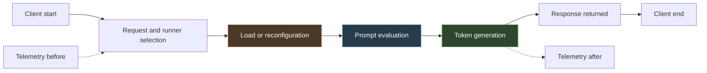
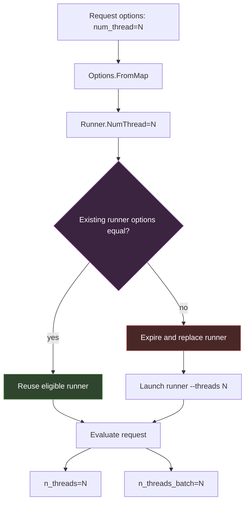

# Tiny-Model CPU Inference: Thread Settings, Runner Replacement, and the Limits of Local Benchmark Evidence

This report presents the technical research conducted in the `P-CPU-INFERENCE` program. The program asked whether changing Ollama’s request-level `num_thread` setting could improve one fixed, synchronous CPU inference workload for the locally installed `qwen3:0.6b` model. The work began with a small timing observation, continued through source-level analysis of Ollama and llama.cpp, and attempted a controlled paired repetition with semantic correctness, telemetry, randomized schedules, and a held-out workload.

The research did not establish that four threads are faster than one. It established a narrower mechanism result: in the archived Ollama 0.6.6 source, `num_thread` configures both prompt/batch and generation thread ceilings and participates in runner-reuse decisions; in the live transition probe, changing between one and four threads replaced the Ollama runner, while repeating the same setting retained it. The controlled performance phase never began because the host crossed the experiment’s thermal threshold, and the collector failed to stop immediately after the first recorded breach. The performance outcome is therefore **inconclusive**, and the process audit is **implementation-not-faithful**.

This report complements [[PROJ - Research Lab - Filesystem-First Evidence Infrastructure]], which explains the laboratory architecture and methods. Here the subject is the inference research itself: the measurement model, source chain, observations, failed execution, hypotheses, and exact limits on what may be concluded.

> [!summary]
> - E-CPU-0001 observed lower four-thread medians in three requests per setting, but the response was semantically incomplete, host state was uncontrolled, and the audit required repetition.
> - Archived Ollama 0.6.6 source maps request `num_thread` to runner `--threads`, assigns the value to both llama.cpp thread fields, and predicts runner replacement when the setting changes.
> - E-CPU-0002 observed same-setting runner persistence and cross-setting runner replacement, but produced **0/16 primary pairs** and **0/8 held-out pairs**.
> - The host crossed the locked 90 °C threshold after the first transition request; five additional probe requests ran because a safety check was missing from that control-flow path.
> - There is no valid speedup estimate, confidence interval, practical-effect decision, held-out transfer result, or recommended thread count.

## 1. The research question

The program’s question was intentionally bounded:

> Which local, reversible runtime settings improve reproducible single-request CPU inference for the installed `qwen3:0.6b` Ollama model without changing the prompt, generation budget, or deterministic output policy?

This wording excludes several adjacent questions. The program did not test concurrent serving throughput, batch throughput across several requests, model quantization, prompt quality, GPU execution, another model, another host, or a universal thread recommendation. It studied one synchronous local HTTP request at a time.

The initial intervention was request `num_thread:1` versus `num_thread:4`. The host had an Intel i7-1165G7 with four physical cores, two hardware threads per core, and eight logical CPUs. That topology motivated the candidate value, but it did not establish that four would be optimal. A requested thread count can interact with model kernels, batch shape, memory traffic, SMT sharing, operating-system scheduling, turbo policy, temperature, and process reconfiguration. The program’s purpose was to measure the bounded system behavior, not infer a universal rule from the CPU topology.

## 2. Evidence classes

The research uses three distinct evidence classes. Keeping them separate prevents static implementation intent, live observations, and causal inference from being combined into a stronger claim than the packet supports.

### Source evidence

Source evidence describes archived documentation or source code. For example, the Ollama 0.6.6 files show how `num_thread` is decoded and passed to the runner in that source version. This does not prove that the installed executable was built unmodified from those exact bytes.

### Observed evidence

Observed evidence is supported directly by retained local artifacts: request payloads, response bytes, duration fields, process identities, telemetry, manifests, and hashes. A live command line containing `--threads 4` is observed fidelity evidence. It does not prove that four workers ran simultaneously throughout evaluation.

### Unsupported interpretation

An interpretation remains unsupported when neither source nor observations establish it. Current unsupported claims include:

- four threads are generally or optimally faster;
- four workers executed concurrently or were assigned one per physical core;
- thread parallelism alone caused the lower E-CPU-0001 medians;
- the API’s `load_duration` is exactly process startup time;
- the response timing fields form a complete partition of server or client time;
- endpoint frequency snapshots establish request-average clock rate;
- thermal-zone values prove throttling or explain a duration;
- the archived tag proves installed-binary provenance.

The report uses “source shows,” “the run observed,” and “the evidence does not establish” deliberately.

## 3. A request contains several timing quantities

A synchronous Ollama Generate request is not represented by one timing mechanism. The client observes wall time. The response reports `total_duration`, `load_duration`, `prompt_eval_count`, `prompt_eval_duration`, `eval_count`, and `eval_duration`. These fields support different comparisons.



This sequence is a measurement model, not proof that every nanosecond belongs to exactly one bracket. The Ollama API documentation names fields but does not define an exhaustive accounting identity. The correct analysis therefore keeps them separate.

| Quantity | Operational use | What it does not establish alone |
|---|---|---|
| Client wall time | End-to-end completion as observed by this client. | Which internal phase changed. |
| `total_duration` | Server-reported aggregate. | Equality with wall time or exact inclusion boundaries. |
| `load_duration` | Evidence that loading or runner reconfiguration may matter. | Exact disk I/O, process startup, or model-load semantics. |
| `prompt_eval_duration` / count | Prompt-processing time and normalized prompt rate for equal work. | Generation performance or transfer to another prompt length. |
| `eval_duration` / count | Token-generation time and normalized generation rate for equal work. | Prompt processing or results with unequal output work. |

For equal positive counts, normalized rates can be computed as:

```text
prompt_rate     = prompt_eval_count / prompt_eval_duration_seconds
generation_rate = eval_count / eval_duration_seconds
```

Rate normalization does not repair a semantically invalid workload or an uncontrolled state transition. Correctness, fixture identity, runner state, and environment remain separate gates.

## 4. What `num_thread` means in archived Ollama 0.6.6

The initial experiment treated `num_thread` as a runtime option that might affect CPU evaluation. Source research later established a more precise, version-bounded chain.

All files described here were archived before E-CPU-0002 measurement under:

`programs/P-CPU-INFERENCE/experiments/E-CPU-0002-controlled-ollama-cpu-thread-policy-repetition/sources/sol-review/`

### 4.1 JSON option decoding

In archived Ollama v0.6.6, `num_thread` names `Runner.NumThread`. `Options.FromMap` constructs a mapping from JSON tags to Go fields and converts the JSON numeric value into the integer field. Runner options are described as settings that must be applied when the model is loaded.

The server applies model options first and request options second. Therefore a request-level `num_thread` overrides the corresponding model default in this source path before scheduling obtains a runner.

### 4.2 Runner launch

A positive `Runner.NumThread` becomes a runner command argument:

```text
--threads N
```

The runner parses that argument and places it in `BackendParams.NumThreads`. In the archived Ollama llama binding, the same value initializes both llama.cpp context fields:

```go
params.n_threads = C.int(threads)
params.n_threads_batch = params.n_threads
```

The pinned llama.cpp API distinguishes their roles:

- `n_threads` controls the thread ceiling for single-token generation work;
- `n_threads_batch` controls the thread ceiling for prompt and multi-token batch processing.

For this archived binding, request `num_thread` is therefore intended to affect both prompt evaluation and generation. It is not limited to one of the two phases.

### 4.3 Runner reuse and replacement

The scheduler stores the loaded runner’s options. Its `needsReload` logic copies the existing and requested runner-option structures and compares them with `reflect.DeepEqual`. Because `NumThread` belongs to that structure, changing from 1 to 4 or from 4 to 1 makes the requested options unequal in the reviewed source path. The scheduler expires the existing runner rather than reusing it.



This finding changed the experiment’s interpretation. Alternating one and four threads was not necessarily a warm, in-place switch inside one stable runner. It predicted a process-level replacement on every cross-setting transition. Load and reconfiguration therefore had to remain distinct from prompt and generation measurements.

### 4.4 Source boundary

The source chain does not establish:

- that the installed executable was built from unmodified v0.6.6 source;
- which backend path the installed binary selected;
- how many workers were active at any instant;
- worker affinity or operating-system scheduling;
- whether every kernel scales with the configured ceiling;
- whether the setting was clamped later;
- the exact accounting boundary of the API timing fields.

The live experiment needed process and command-line evidence to test whether the installed system behaved consistently with the archived prediction.

## 5. CPU frequency, topology, and thermal state

Thread-count experiments interact with CPU state. More configured workers can expose additional parallel work while changing active-core frequency, package power, shared-cache pressure, memory bandwidth, SMT contention, and heat. Duration records the combined system behavior. It does not isolate one of those components automatically.

### 5.1 Logical CPUs are not a causal optimum

The host reported four physical cores and eight logical CPUs. A descriptive peak at four would be compatible with several mechanisms, but it would not prove that physical-core count caused the optimum. Effective affinity, active workers, kernel parallelism, memory traffic, and frequency behavior were not measured in E-CPU-0001.

A future `{1,2,4,8}` curve can report the host-local response to requested settings. Attributing its shape specifically to physical cores requires stronger affinity and interval-counter evidence.

### 5.2 `powersave` is not a fixed low clock

The recorded governor was `powersave`. On Intel systems using `intel_pstate` in active mode, familiar governor names do not necessarily have the generic CPUFreq semantics associated with them. With hardware-managed P-states, the hardware selects operating points subject to driver constraints and preferences.

The `scaling_cur_freq` value is periodically updated. Reading it before and after a short request gives two endpoint samples; it does not provide the request’s average active frequency. The E-CPU-0002 telemetry correctly retained these values as observations without treating them as a controlled clock.

Linux `turbostat` documents interval quantities that are better aligned with this question:

- `Bzy_MHz` estimates average clock while the CPU is non-idle;
- `Avg_MHz` includes idle time;
- both depend on interval counter deltas and stated TSC assumptions;
- collection is non-atomic, and very short intervals can be inconsistent.

Even interval counters would not prove that frequency caused an effect. They would make frequency variation more observable than two sysfs endpoint reads.

### 5.3 Thermal-zone evidence

Linux thermal sysfs exposes zone paths, names, temperatures, and platform-specific relationships. A label such as `TCPU` or `x86_pkg_temp` is the identity exposed by the driver. It should be retained as raw metadata rather than promoted automatically to a claim about a specific physical sensor or throttling state.

E-CPU-0002 used a conservative operational rule: stop when **any accessible normalized thermal-zone reading was at least 90,000 m°C**. The stop did not require proving that the zone represented the package or that hardware throttling had begun. A preregistered safety threshold is an execution rule, not a diagnostic conclusion.

## 6. E-CPU-0001: the initial observation

### 6.1 Fixed request

E-CPU-0001 compared one local synchronous request under two settings. Both variants used:

```text
model:        qwen3:0.6b
prompt:       Return exactly the word amber and no other text.
stream:       false
keep_alive:   10m
think:        false
temperature:  0
seed:         17
num_predict:  16
num_ctx:      512
```

The sole requested difference was:

```text
baseline:  num_thread = 1
candidate: num_thread = 4
```

One warmup per setting preceded three measured requests per setting. The measured order was B→C, C→B, B→C. Requests were issued serially.

### 6.2 Comparison-equivalence gate

The baseline and candidate matched on returned text, completion reason, prompt-token count, and generated-token count:

```text
response:          <think>\nOkay, the user wants me to return exactly the word "amber"
done_reason:       length
prompt_eval_count: 18
eval_count:        16
```

This established equal returned work for comparison. It did **not** establish semantic success. The generation budget ended in internal reasoning before the model returned the requested word. Calling the fixture “correct” without this qualification would conflate equivalence between variants with successful completion of the requested task.

### 6.3 Observed medians

| Metric, three measured runs per setting | `num_thread:1` | `num_thread:4` |
|---|---:|---:|
| Command wall-clock median | 2384.446 ms | 1713.062 ms |
| Command wall-clock range | 988.429–2409.716 ms | 603.416–1834.414 ms |
| Server `total_duration` median | 2142.438 ms | 1497.354 ms |
| Server `load_duration` median | 1088.101 ms | 1084.182 ms |
| Server `prompt_eval_duration` median | 376.935 ms | 129.368 ms |
| Server `eval_duration` median | 675.360 ms | 299.196 ms |
| Prompt tokens | 18 | 18 |
| Generated tokens | 16 | 16 |

The descriptive candidate reductions were 28.16% for command wall median, 30.11% for server total, 65.68% for prompt evaluation, and 55.70% for generation. These numbers describe six measured requests. They are not confidence-bounded effect estimates.

### 6.4 Why the result required repetition

Several alternatives remained credible:

- only three samples existed in each arm;
- observed ranges were wide;
- CPU frequency, temperature, affinity, and background load were not controlled or captured;
- the order was deterministic rather than drawn from a committed randomized schedule;
- `load_duration` remained approximately one second in both arms despite `keep_alive`;
- the source-level runner-replacement mechanism had not yet been investigated;
- only one short prompt, seed, model, and requested output budget were tested;
- the fixture did not complete its semantic task.

The correct outcome was **`requires-repetition`**. E-CPU-0001 supplied a reason to run a stronger experiment. It did not establish a thread recommendation.

## 7. Why the controlled repetition was different

E-CPU-0002 retained the same central 1-versus-4 intervention but replaced the simple benchmark with a preregistered paired design.

### 7.1 Semantic fixtures and oracles

The primary fixture asked for the single word `saffron`; the held-out fixture asked for the capital of France and required `paris`. Both variants had to produce a completed response with `done_reason=stop`, the expected normalized answer, required timing fields, and matching prompt/evaluation counts.

Preflight established:

| Fixture | Required answer | Prompt tokens | Evaluation tokens | Completion |
|---|---|---:|---:|---|
| Primary | `saffron` | 21 | 8 | `stop` |
| Held-out | `paris` | 26 | 6 | `stop` |

Rejected attempts remained in the dossier. Some exhausted their generation budget; some produced punctuation that changed counts; another answered the wrong task. The final oracle was variant-independent: it judged the response without knowing whether one or four threads produced it.

### 7.2 Randomized paired schedule

The primary phase required 16 adjacent usable pairs, balanced between eight B→C and eight C→B orders. The held-out phase required eight usable pairs, balanced four and four. Both schedules were generated from fixed seeds before measurement and could not be reshuffled at runtime.

Pairing made nearby requests the unit of inference. Balanced randomized order prevented one treatment from always occupying the same position. Neither control made host state identical; request-bound telemetry and readiness checks were still required.

### 7.3 Locked estimands

For usable pair $i$, the primary component estimands were:

$$
L_{prompt,i} = \log\left(\frac{p_{C,i}}{p_{B,i}}\right)
$$

$$
L_{eval,i} = \log\left(\frac{e_{C,i}}{e_{B,i}}\right)
$$

where $p$ denotes positive `prompt_eval_duration` and $e$ denotes positive `eval_duration` under matched completed work.

The protocol preregistered a Hodges–Lehmann location estimate, paired whole-row bootstrap with 10,000 resamples and seed `2026071004`, and a 10% smallest practical reduction. A positive component finding required its entire primary 95% interval below both zero and $\log(0.90)$, plus a same-direction held-out result with passing semantic oracles.

The statistical rule could not create evidence when no pairs existed. Seeds, estimators, and thresholds define how observations will be interpreted; they are not substitutes for observations.

### 7.4 Telemetry and transition diagnosis

Before and after each request, the collector retained available or explicitly unavailable observations for:

- CPUFreq policy, governor, and endpoint frequency values;
- every accessible thermal zone’s path, type, and raw temperature;
- load average, memory, and swap;
- power state;
- Ollama daemon and runner identities;
- experiment-lock state.

Before warmups, a fixed non-measured transition sequence would test runner behavior:

```text
B, B, C, C, B, C
```

The design intentionally included same-setting and cross-setting transitions. The probe was not part of the paired performance sample.

### 7.5 Exclusive execution and stopping

Only the Q4 operator could issue Ollama requests. All inference, correctness, warmup, transition, and profiler work was serialized. The protocol required a stop before or after every request, and during readiness waits, whenever any accessible normalized thermal-zone value reached 90,000 m°C.

## 8. E-CPU-0002 execution chronology

### 8.1 First preflight stop

The first preflight stopped before any Ollama request after shell-observed values were reported above threshold. The JSON record was created only after the host cooled and contained values near 82 °C. The dossier includes a correction explaining that the JSON is evidence of the stop reason and timestamp, not exact machine evidence for the earlier reported 92.05/92.00 °C values.

Because the collector had not begun and no request record existed, one supervisor-approved retry was allowed after cooling.

### 8.2 Retry and first unhandled breach

Retry1 began the six-request transition probe. After sequence 0, the retained after-request telemetry recorded:

```text
TCPU:          92,050 m°C
x86_pkg_temp:  92,000 m°C
threshold:     90,000 m°C
```

The protocol required an immediate stop before sequence 1. The collector did not stop. Its post-request thermal enforcement covered the paired measurement path but not the single-position transition and warmup path. It issued transition requests 1 through 5.

### 8.3 Final stop before warmup

After transition sequence 5, immediately before `warmup-00`, the collector wrote the authoritative atomic stop record:

```text
TCPU:          96,050 m°C
x86_pkg_temp:  96,000 m°C
```

The warmup manifest contains one header and no request rows. Primary and held-out manifests do not exist. The final phase counts are:

| Phase | Collected | Required |
|---|---:|---:|
| Transition probe | 6 non-measured requests | 6 |
| Warmup | 0 requests | 4 non-measured requests planned |
| Primary | 0 usable pairs | 16 |
| Held-out | 0 usable pairs | 8 |

The collector was corrected later so future transition and warmup requests also execute post-request thermal enforcement. That code change does not validate, reopen, or authorize a restart of E-CPU-0002.

## 9. The transition probe

The offline derivation recomputed all declared links from the raw manifest. Six rows each referenced exact payload, response, before-telemetry, and after-telemetry artifacts. All **24/24 SHA-256 digests matched**.

Every response passed the semantic oracle with `done_reason=stop`, 21 prompt tokens, and 8 generated tokens.

| Seq. | Setting and class | Wall | Load | Prompt | Eval | Runner observation |
|---:|---|---:|---:|---:|---:|---|
| 0 | B/1, initial | 1425.140 ms | 711.076 ms | 377.042 ms | 270.798 ms | None before; PID 4090627, `--threads 1` after. |
| 1 | B/1, B→B | 375.875 ms | 14.155 ms | 39.625 ms | 281.501 ms | PID 4090627 retained. |
| 2 | C/4, B→C | 1084.569 ms | 773.471 ms | 145.574 ms | 123.399 ms | PID 4090627/1 → 4090701/4. |
| 3 | C/4, C→C | 197.069 ms | 17.704 ms | 15.619 ms | 122.375 ms | PID 4090701 retained. |
| 4 | B/1, C→B | 1475.216 ms | 766.856 ms | 396.494 ms | 270.040 ms | PID 4090701/4 → 4090766/1. |
| 5 | C/4, B→C | 1409.746 ms | 1048.978 ms | 184.068 ms | 135.881 ms | PID 4090766/1 → 4090864/4. |

### 9.1 What the trace establishes

The same-setting transitions retained runner PID, process start ticks, command line, and `--threads` value. The three cross-setting transitions changed PID, start ticks, command, port, and thread argument. Their reported load durations—773.471, 766.856, and 1048.978 ms—were materially larger than the two same-setting rows—14.155 and 17.704 ms.

This is strong live evidence that the observed runner was configured with the requested command-line value and replaced when the setting changed. It is consistent with the archived source path.

### 9.2 What the trace does not establish

The trace is not a valid performance comparison because:

- its order was fixed for transition diagnosis, not randomized for inference;
- the first request already crossed the safety threshold;
- five later requests violated the immediate-stop rule;
- cross-setting rows include runner replacement;
- thermal state changed across the sequence;
- no paired readiness units exist;
- the probe was preregistered as non-measured.

The visibly lower four-thread prompt/evaluation values cannot be pooled or compared as a speedup estimate. Doing so would change the protocol’s inference unit after observing results.

The trace also lacks an executable digest and an independent retained daemon-version record. Archived source and observed command lines agree, but installed-binary provenance remains partial.

## 10. Formal outcomes

Two labels describe different dimensions.

### Inferential outcome: `inconclusive`

There are no primary or held-out pairs. Therefore the paired log ratios, Hodges–Lehmann estimates, bootstrap intervals, practical-effect rule, and transfer check cannot be computed. The program has no evidence for or against a 4-versus-1 evaluation-time effect under the controlled protocol.

### Process outcome: `implementation-not-faithful`

The execution continued after the first retained thermal reading above the locked threshold. Although it eventually stopped before warmup and preserved the evidence, it did not realize the protocol’s immediate-stop requirement.

This is not a negative performance result. It is a process failure that prevents performance inference.

> [!warning]
> E-CPU-0002 supplies runner-transition evidence and a safety/process audit. It supplies no thread-performance estimate.

## 11. The hypothesis portfolio

The researchers did not respond to the first observation by testing arbitrary settings. They developed a ranked portfolio designed to distinguish mechanism, workload dependence, runner state, and environmental sensitivity.

### H1 — Controlled four-versus-one evaluation effect

**Claim:** Four requested threads reduce prompt and generation durations relative to one under matched completed work and observed host state.

**Status:** Neither supported nor falsified. E-CPU-0002 collected zero inferential pairs.

### H2 — Evaluation effect versus load/reconfiguration artifact

**Claim:** Any thread benefit persists in prompt/generation components after runner/load state is treated separately.

**Status:** The source and live probe support runner replacement as a real alternative. No controlled evaluation data exist to resolve the effect.

### H3 — Host-local `{1,2,4,8}` curve

**Claim:** Evaluation improves from one to two to four threads, then plateaus or worsens at eight.

**Status:** Prepared as E-CPU-0003 but blocked. The later source review weakened the original physical-core causal wording: even if four were best, the curve alone would not distinguish core topology from frequency, SMT contention, memory behavior, or kernel scaling.

### H4 — Prompt-length interaction

**Claim:** Four threads provide a larger prompt-rate advantage for a longer prompt because more batch work exposes additional parallelism.

**Status:** Prepared as E-CPU-0004 but blocked. It must control prompt-cache state, actual prompt counts, semantic answer, generation work, and runner replacement.

### H5 — Generation-length interaction

**Claim:** The 4-versus-1 generation-rate effect changes with actual generated work.

**Status:** Hypothesis only. A future design must use returned `eval_count`, not assume that requested `num_predict` equals completed work.

### H6 — Runner residency dominates end-to-end time

**Claim:** Verified warm versus transition residency changes load, total, and wall time more than the thread setting, while normalized evaluation rates remain separately attributable.

**Status:** Hypothesis only. “Warm” and “cold” cannot be inferred from a requested `keep_alive`; they need direct state evidence.

### H7 — CPU state explains residual variation

**Claim:** Interval frequency, thermal state, and load explain a material portion of within-setting variation and determine the smallest effect this host can resolve.

**Status:** Existing endpoint snapshots are inadequate for frequency mediation. A future interval-counter experiment would require separate approval and overhead validation.

## 12. Planned E-CPU-0003: thread curve

E-CPU-0003 is a non-executable draft for requested thread settings `{1,2,4,8}`.

The planned design includes:

- 12 randomized complete blocks;
- one request for each setting per block;
- 48 measured requests total;
- schedule seed `2026071005`;
- whole-block 10,000-resample bootstrap seed `2026071006`;
- adjacent within-block contrasts for 2/1, 4/2, and 8/4;
- prompt and generation durations as separate primary components;
- load, total, wall, counts, and rates as secondary outcomes;
- a fixed non-measured transition sequence covering same-setting and upward/downward changes;
- eight symmetric warmups;
- at most four complete replacement blocks;
- inherited telemetry, readiness, semantic oracle, serialization, and thermal stop.

The design’s strongest improvement is that it tests a curve rather than selecting one favorable pair. Its interpretation remains host-local. It cannot claim that a peak reflects physical cores without additional topology, affinity, and interval-state evidence.

**Execution remains blocked.** E-CPU-0002 did not pass the dependency audit. No transition request, warmup, correctness request, measurement, or profiler capture is authorized.

## 13. Planned E-CPU-0004: prompt-length interaction

E-CPU-0004 asks whether the four-versus-one prompt-evaluation rate advantage is larger for a longer prompt than for the canonical prompt.

The draft holds fixed:

- model `qwen3:0.6b`;
- deterministic generation policy;
- `num_predict:16`;
- `num_ctx:512`;
- semantic answer and generation work;
- all non-thread options within a pair.

It varies prompt length and `num_thread`. The primary within-length quantity is:

$$
R_i(length) = \frac{prompt\_rate_{C,i}}{prompt\_rate_{B,i}}
$$

The interaction compares the location of $\log R$ between longer and canonical prompts. Raw prompt duration alone is not comparable across different token counts.

The planned design uses 12 usable pairs per prompt length, 24 pairs total, randomized across prompt-by-thread cells. It reports runner/load state separately and makes no cold-cache claim because upstream prompt caching can affect observed prompt work.

This draft is less complete than E-CPU-0003. Its measured token counts, numeric practical interaction margin, schedule seed, exact randomization algorithm, and replacement caps remain unresolved. It cannot be promoted to a locked protocol until those fields and the dependency gate are resolved.

**Execution remains blocked.** Even fixture-feasibility endpoint calls are forbidden under the current gate.

## 14. What the research currently establishes

### Established by archived source

- In reviewed Ollama v0.6.6 source, `num_thread` maps to `Runner.NumThread`.
- A positive value becomes runner `--threads N`.
- The reviewed llama binding assigns that value to both generation and batch/prompt thread fields.
- Changed runner options predict replacement rather than reuse.
- Linux `powersave` naming does not by itself establish a fixed low clock under `intel_pstate`.
- Endpoint `scaling_cur_freq` values are not request-interval average active frequency.

### Established by local observations

- E-CPU-0001 retained equal returned text and token counts and observed lower four-thread medians in three requests per setting.
- The E-CPU-0001 prompt did not complete semantically; it stopped at the token limit.
- E-CPU-0002’s six probe responses completed semantically with matched work.
- Same-setting probe requests retained the observed runner.
- Cross-setting probe requests replaced the observed runner and changed `--threads`.
- The first retained post-request thermal breach occurred after sequence 0.
- Five additional probe requests ran in violation of the immediate-stop rule.
- The collector stopped before the first warmup at 96.05/96.00 °C.
- No primary or held-out performance pairs exist.

### Not established

- A causal or practical four-thread speedup.
- A null effect.
- An optimal thread count.
- Actual simultaneous worker count.
- Stable or controlled CPU frequency.
- Thermal throttling or thermal causation of any duration.
- A complete API timing partition.
- Transfer to another prompt, output length, model, host, Ollama version, or serving workload.
- Permission to run the queued experiments.

## 15. Requirements for any future episode

A future performance episode must use a new experiment identity rather than restart E-CPU-0002. At minimum it must:

1. Run only under a thermally suitable and otherwise quiet host condition.
2. Demonstrate immediate stopping after the first threshold breach on every request path.
3. Record executable, daemon, model, fixture, oracle, protocol, and schedule identity.
4. Prove semantic completion and matched work before timing.
5. Separate same-setting reuse from cross-setting replacement.
6. Commit randomized schedules and estimands before execution.
7. Assign one operator and serialize all endpoint activity.
8. Append and flush exact request, response, telemetry, and outcome records before advancing.
9. Retain invalid and partial records with reasons.
10. Derive only from closed manifests.
11. Treat frequency snapshots as snapshots; use interval counters only after permission and overhead validation.
12. Require an independent audit before opening any dependent experiment.

The most important unresolved scientific question remains the original one: after controlling semantic work, runner replacement, order, and host state, does requested thread count change prompt or generation evaluation enough to matter for this fixed workload? The current corpus does not answer it.

## 16. Source and evidence map

The complete local corpus is under:

`/home/manuel/code/wesen/2026-07-10--research-lab/programs/P-CPU-INFERENCE/`

### Program and hypotheses

- `program.md` — central question, scope, exclusions, and evidence standard.
- `hypotheses/H-CPU-0001-...md` — original thread-policy hypothesis.
- `hypotheses/H-CPU-0002-...md` — controlled four-versus-one effect.
- `hypotheses/H-CPU-0003-...md` — evaluation versus load/reconfiguration.
- `hypotheses/H-CPU-0004-...md` — thread curve.
- `hypotheses/H-CPU-0005-...md` — prompt-length interaction.

### E-CPU-0001

- `experiments/E-CPU-0001-.../fixture.json`
- `experiments/E-CPU-0001-.../result.md`
- `experiments/E-CPU-0001-.../derived/ollama-response-timings.csv`
- `experiments/E-CPU-0001-.../derived/ollama-response-summary.json`
- `experiments/E-CPU-0001-.../benchmarks/20260710T180641Z/raw/samples.csv`

### E-CPU-0002

- `experiments/E-CPU-0002-.../protocol.md` — locked paired design.
- `experiments/E-CPU-0002-.../instrument-contract.md` — telemetry semantics.
- `experiments/E-CPU-0002-.../sources/index.md` — primary documentation archive.
- `experiments/E-CPU-0002-.../sources/sol-review/index.md` — pinned source archive.
- `experiments/E-CPU-0002-.../analysis/sol-fundamentals-and-hypotheses.md` — mechanism analysis.
- `experiments/E-CPU-0002-.../derived/transition-probe-summary.md` — raw-linked live trace.
- `experiments/E-CPU-0002-.../result.md` — bounded outcome.
- `experiments/E-CPU-0002-.../audit.md` — formal process and inference audit.
- `experiments/E-CPU-0002-.../raw/control/thermal-stop-1783712995861212752.json` — authoritative final stop.

### Queued experiments

- `experiments/E-CPU-0003-controlled-ollama-thread-curve/protocol-draft.md`
- `experiments/E-CPU-0003-controlled-ollama-thread-curve/dependency-gate.md`
- `experiments/E-CPU-0004-controlled-ollama-prompt-length-interaction/protocol-draft.md`
- `experiments/E-CPU-0004-controlled-ollama-prompt-length-interaction/dependency-gate.md`

## 17. Final assessment

The first episode produced a plausible local observation: four requested threads coincided with lower prompt and generation medians under equal returned work. The evidence was too small and uncontrolled to support a performance conclusion. The source investigation then showed that the intervention also changed runner configuration and predicted process replacement, materially changing the causal model.

The second episode validated that mechanism prediction on the live system: same-setting requests retained the observed runner, while cross-setting requests replaced it and changed the runner command. It did not validate performance. Thermal conditions prevented the measured phase, and incomplete safety enforcement made the transition execution itself non-faithful to protocol.

The current scientific position is therefore precise:

> Request `num_thread` is a consequential runner configuration in the reviewed Ollama 0.6.6 path, and the live system exhibited setting-aligned runner replacement. Whether one or four requested threads improves prompt or generation evaluation for the controlled workload remains unknown.

That statement is narrower than the original optimization hypothesis. It is the strongest conclusion supported by the retained evidence.
