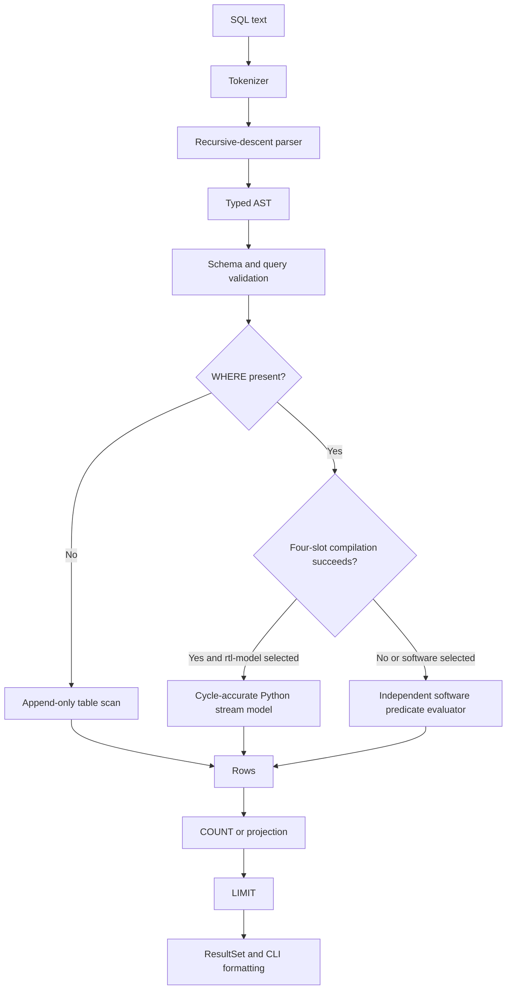
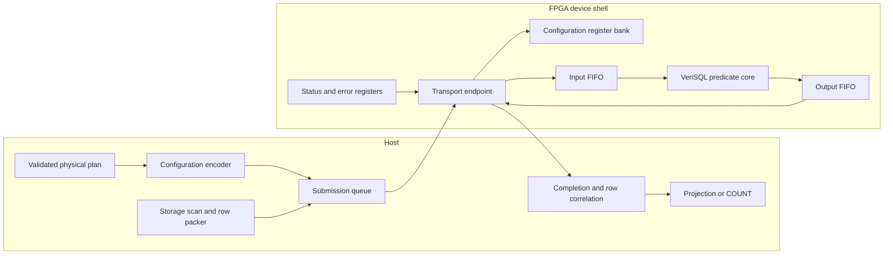
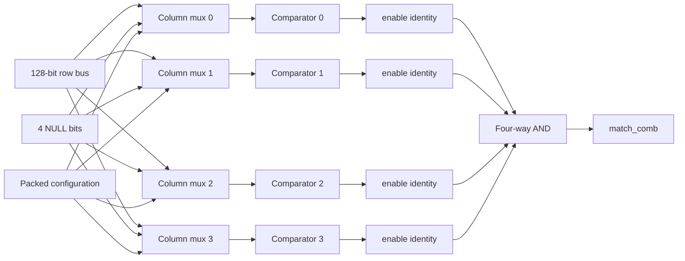
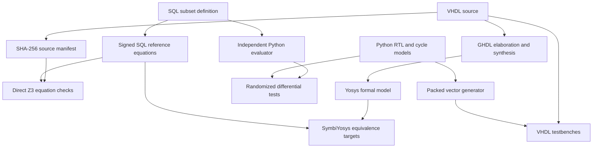

# VeriSQL-HW: SQL Semantics, Streaming VHDL, and the Boundary of Formal Assurance

VeriSQL-HW is a vertically integrated research prototype that connects a small persistent SQL database to a fixed four-predicate hardware contract. The repository contains a hand-written SQL parser, append-only table storage, a planner with explicit software fallback, a cycle-accurate Python model, synthesizable VHDL, direct Z3 proofs, VHDL testbenches, and source-level SymbiYosys targets. Its most valuable property is not feature breadth. It is the ability to trace a restricted SQL statement from text, through semantic validation and predicate compilation, into exact packed bit fields and a one-entry valid/ready state machine.

The project should not be described as a formally verified database. The formal evidence covers the signed comparison cell, NULL behavior, packed lane and predicate selection, disabled-slot identity, four-way conjunction, and one-step stream-control equations. The parser, planner, storage engine, host runtime, transport to an FPGA, synthesized timing, clock-domain crossing, external memory, and board integration remain outside the proof boundary. The shipped `vhdl` execution backend is also not a live FPGA backend: it is a Python model of the VHDL contract. This distinction determines how the implementation should be evaluated and what must be built next.

> [!summary]
> - The prototype defines a precise hardware-offload contract: four signed 32-bit columns, four NULL bits, four predicate slots, eight opcodes, conjunction-only reduction, and a one-entry valid/ready output register.
> - Eligible SQL scans execute through a cycle-accurate Python model. The synthesizable VHDL exposes the same logical interface, but no DMA, MMIO, PCIe, AXI, board shell, or live device driver is included.
> - The completed formal evidence is strong within its stated scope: seven universal Z3 counterexample queries are UNSAT and are bound to five reviewed RTL files by SHA-256. The supplied synthesized-VHDL equivalence targets were not run on the available host.
> - A planner defect permits an out-of-range integer constant in queries with more than four predicates because fallback is selected before constant validation. Semantic validation must precede backend selection.

## 1. Executive assessment

The central design decision is to accelerate selection predicates rather than attempt to implement a DBMS in programmable logic. SQL parsing, schema lookup, projection, aggregation, persistence, and result formatting stay in software. Hardware receives a stream of fixed-width rows and a compact query configuration, evaluates as many as four leaf predicates, reduces their results with AND, and emits one match bit for each accepted row. This division keeps the hardware finite, parameterizable at run time, and amenable to exhaustive bit-vector reasoning.

The restriction is technically coherent. A table has one to four `INT32` columns. A query may contain up to four comparisons or NULL tests joined by `AND`. Every hardware-visible scalar has a fixed representation. Every predicate occupies one statically sized slot. Disabled slots contribute TRUE, so one, two, three, and four predicates use the same reduction network. A NULL comparison contributes FALSE because a SQL `WHERE` clause retains only rows whose condition evaluates to TRUE. For conjunction-only conditions, collapsing both FALSE and UNKNOWN to zero at each leaf preserves the final row-retention decision.

The repository also handles unsupported plans correctly in principle. It does not truncate a five-predicate condition, reinterpret a wide integer, or remove an unsupported operator to make a query fit. It selects an independent software evaluator. The README states the intended rule directly: “Queries outside that contract execute with the reference software evaluator rather than being approximated in hardware.” That policy is a sound basis for incremental hardware coverage because semantic preservation takes precedence over offload rate.

The current implementation demonstrates the contract, but it does not yet demonstrate acceleration. A SQL query using `backend="vhdl"` calls `StreamAcceleratorModel().filter_rows(...)`. Rows remain Python tuples, configuration remains a tuple of Python dataclasses, and the query path does not invoke `pack_row` or `pack_config`. The packed ABI is tested and formally modeled elsewhere, but the database engine does not serialize a row stream to a device. A deterministic local microbenchmark confirms the role of the backend: the direct software evaluator processed about 1.59 million rows per second, while the cycle-accurate Python model processed about 272 thousand rows per second on the same generated input. Those numbers say nothing about FPGA performance. They show that the backend is an executable specification and verification instrument.

The formal-assurance structure is more substantial than a normal hobby RTL test suite. The direct proof creates symbolic 32-bit operands, symbolic NULL bits, symbolic opcodes, symbolic packed buses, and symbolic stream-control inputs. It asks Z3 for counterexamples to equivalence or safety properties. The solver reported UNSAT for all seven checks. The proof script refuses to run when any of five reviewed RTL files differs from the checked manifest, and it verifies the VHDL and Python opcode maps and dimensions. Three additional SBY harnesses are supplied to synthesize actual VHDL through GHDL and compare it against independent VHDL references. The limitation is operational rather than hidden: GHDL, Yosys, and SymbiYosys were unavailable on the original build host and on the present analysis host, so these stronger targets remain prepared but unexecuted evidence.

The database portion is intentionally small and has corresponding limits. Storage is persistent and detects malformed headers and partial trailing records. Appends are fsynced, catalog replacement uses a temporary file and rename, and a directory fsync is attempted. There is no transaction protocol, WAL, redo, rollback, checkpoint, page checksum, row checksum, multi-process catalog lock, or repair operation. The system is best described as an append-only persistent query prototype. Calling it a transactional database would imply guarantees it does not implement.

The immediate technical priorities are therefore clear. First, move all SQL semantic validation ahead of planning so fallback cannot bypass type and range checks. Second, rename the current execution backend to make its model status unambiguous. Third, add a real transport boundary with explicit configuration lifetime, row framing, byte order, result correlation, completion, errors, and reset behavior. Fourth, run and archive source-level VHDL proofs and simulations in a pinned toolchain. Fifth, measure synthesized resource use, timing, sustained transfer rate, selectivity-dependent return traffic, and end-to-end query latency. These steps would convert a coherent contract prototype into an evaluated hardware/software system.

## 2. The problem the project solves

A database scan combines several responsibilities that should not be conflated. SQL establishes the meaning of the predicate. Storage establishes how values and NULLs are represented. Planning decides whether a physical operator preserves that meaning. The accelerator implements a finite predicate function. The stream protocol determines which input and output events correspond. A proof can establish properties only after these boundaries are made explicit.

General SQL is a poor first formal target because its semantic and physical state space is broad. Expressions may contain multiple data types, collations, arithmetic, casts, functions, subqueries, joins, aggregates, ordering, three-valued Boolean logic, and implementation-defined resource decisions. A claim such as “the FPGA evaluates SQL correctly” has little technical content until the accepted grammar, type domains, NULL behavior, plan boundary, row layout, and transfer protocol are fixed.

VeriSQL-HW narrows each dimension:

| Dimension | Implemented restriction | Consequence |
|---|---|---|
| Schema | One to four columns | A row always fits a four-lane hardware contract. |
| Scalar type | Signed `INT32` or `NULL` | Comparison semantics map to 32-bit bit-vector operations. |
| Predicate form | Column compared with integer constant, or `IS [NOT] NULL` | No expression evaluator, arithmetic unit, or type coercion is required in RTL. |
| Boolean form | Conjunction only | Four predicate bits reduce through one AND network. |
| Predicate count | Up to four in hardware | Configuration buses remain statically sized. |
| Query operations | Scan, projection, `COUNT(*)`, `LIMIT` | Hardware performs filtering; software owns result semantics. |
| Flow control | One-entry valid/ready output register | Backpressure behavior has a compact next-state equation. |
| Unsupported plans | Software evaluator | Hardware coverage can remain incomplete without changing query results. |

This scope makes several important questions answerable.

1. Does the VHDL comparison implementation agree with mathematical signed 32-bit ordering for every bit pattern?
2. Does each opcode treat NULL consistently with the supported SQL `WHERE` semantics?
3. Do the packed lane selectors, opcode slices, constants, and enable bits map to the intended logical predicate slots?
4. Does the output register retain its payload under backpressure and accept a replacement only when safe?
5. Does the planner send only eligible queries to the accelerator path?
6. Are the software and model paths observationally equivalent for supported queries?

The first four are finite hardware properties. The fifth and sixth cross into unproved Python code and are addressed by tests rather than a machine-checked end-to-end theorem. That division is acceptable when it is stated precisely.

The project belongs to a long line of database systems that push selection toward data and use software fallback or plan splitting. Ibex describes a hybrid engine with hardware expression evaluation and software fallback:

> “dedicated hardware that evaluates SQL expressions at line-rate and a software fallback”  
> — Woods et al., *Ibex*, [local PDF](_assets/verisql-hw-report/sources/external/ibex-intelligent-storage-engine.pdf)

IBM’s database accelerator uses software-programmed control blocks to configure predicate engines without FPGA reconfiguration. Farview splits query plans between compute nodes and smart disaggregated memory. VeriSQL-HW implements a much smaller version of the same architectural principle: software retains the complete query language; hardware receives a constrained physical operator.

The important engineering result is the explicit semantic boundary. The project does not need to accelerate every query before the interface becomes useful. It needs to guarantee that every offloaded query is representable and that every nonrepresentable query stays correct in software.

## 3. Current implementation status

The repository is complete enough to execute, inspect, and test as a software package. It is not complete enough to deploy on an FPGA board. The following table separates present artifacts from absent integration work.

| Area | Present | Not present |
|---|---|---|
| SQL frontend | Tokenizer, recursive-descent parser, AST, semicolon-separated statements | Quoted identifiers, strings, floats, casts, expressions, `OR`, `NOT`, joins, subqueries, updates, deletes |
| Storage | Directory catalog, fixed-width table files, schema digest, append fsync, file locks, corruption checks | WAL, transactions, rollback, redo, page cache, indexes, checksummed rows, repair, multi-process catalog coordination |
| Planner | Structural eligibility and explicit fallback | Cost model, selectivity estimates, statistics, index selection, plan alternatives |
| Execution | Table scan, model filter, software filter, projection, `COUNT(*)`, `LIMIT`, `EXPLAIN` | Iterator pipeline, early LIMIT termination, zero-copy buffers, parallel scan, device scheduling |
| Python hardware model | Bit-accurate comparator, four-slot model, cycle-accurate elastic register | Four-state logic, clock uncertainty, transport latency, synthesized timing |
| RTL | Synthesizable VHDL comparator, datapath, next-state block, top-level register | Device shell, DMA, AXI/PCIe interface, memory controller, query IDs, row tags, board constraints |
| Verification | 15 Python tests, seven UNSAT Z3 checks, VHDL grammar record, three testbenches, three SBY targets | Executed SBY logs on this revision, coverage report, mutation testing, timing proof, CDC/RDC analysis |
| Performance evidence | Python model microbenchmark | FPGA clock, Fmax, LUT/FF/BRAM use, transfer bandwidth, end-to-end speedup, energy measurement |

The package supports the following user-visible SQL subset:

```sql
CREATE TABLE readings (
    id          INT NOT NULL,
    temperature INT,
    pressure    INT,
    quality     INT
);

INSERT INTO readings VALUES
    (1, 18, 1012, 90),
    (2, NULL, 1008, 72),
    (3, -5, NULL, 88),
    (4, 25, 995, NULL),
    (5, 25, 1001, 95);

EXPLAIN
SELECT id, temperature
FROM readings
WHERE temperature >= 20
  AND pressure IS NOT NULL
  AND quality > 80;
```

The recorded and independently reproduced plan is:

```text
operator            | details
--------------------+----------------------------------------------------------
VHDL_PREDICATE_SCAN | 3 conjunctive predicate(s), four-lane INT32/NULL contract
```

That operator name identifies the model contract, not a device invocation. In the current source, the plan reaches this call:

```python
rows = StreamAcceleratorModel().filter_rows(source, config)
```

A precise product description should therefore use three separate terms:

- **software backend**: the independent Python SQL predicate evaluator;
- **RTL model backend**: the bit-accurate and cycle-accurate Python implementation used by the query engine;
- **FPGA backend**: a future transport-backed implementation that serializes packed rows and configurations to synthesized hardware.

This naming change would remove the largest source of ambiguity in the repository without changing behavior.

## 4. End-to-end architecture

The system is organized around a physical scan boundary. SQL is parsed into immutable AST nodes. Schema lookup resolves column names and validates projections. The planner attempts to compile the conjunction into four predicate slots. A successful compilation selects the RTL model; an unsuccessful compilation selects the software evaluator. Both paths produce full Python rows, after which projection, aggregation, and LIMIT are applied.



The hardware artifacts implement only the shaded conceptual block represented by predicate compilation and row filtering. A future real device path needs a host shell around it:



The repository contains `CORE`. It does not contain `T`, `CF`, `IF`, `OF`, `ST`, a device driver, or the host submission/completion protocol. This is not a minor packaging omission. In database accelerators, integration determines data movement, framing, backpressure, result ordering, failure handling, and much of end-to-end performance.

### 4.1 Responsibility boundaries

A useful way to read the repository is to assign one invariant to each layer.

| Layer | Primary invariant |
|---|---|
| Parser | Every accepted token sequence maps to one AST in the documented grammar. |
| Query validator | Every referenced table and column exists; values obey the SQL subset’s type and range constraints. |
| Planner | Hardware is selected only for a representable physical predicate conjunction. |
| Storage | Every yielded row agrees with the table schema and fixed record geometry. |
| Packer | Every logical lane, NULL bit, predicate slot, opcode, selector, and constant occupies the documented bit slice. |
| Predicate datapath | `match_o` equals the conjunction of enabled SQL leaf predicates. |
| Stream register | Accepted rows produce stable, ordered result bits without overwrite under backpressure. |
| Host correlation | Each result bit is associated with the corresponding accepted row. |
| Result layer | Projection, count, and limit preserve SQL-visible behavior. |

Only some of these invariants are proved. The architecture remains valid because the unproved boundaries can be tested and strengthened independently.

### 4.2 Why selection is an appropriate first operator

Selection is row-local. The predicate result for one row does not depend on prior rows, future rows, shared aggregate state, sorting state, or a second input stream. A fixed selection datapath therefore has no internal data-dependent memory other than the output register. This keeps the combinational function and transition system small enough for exhaustive reasoning.

Selection can also reduce data movement when placed before an expensive transport or memory boundary. The literature repeatedly treats this as a principal benefit. Ibex inserts FPGA logic between storage and the host so filtered data, rather than raw data, crosses the remaining path. Farview applies selection and projection in smart disaggregated memory so compute nodes receive reduced streams. VeriSQL-HW does not yet realize this placement, but its contract is compatible with it.

The design is less compelling when rows are already in Python objects and the model executes in the same process. That configuration provides semantic evidence, not acceleration. A deployable implementation must place the predicate core where rejected rows avoid a meaningful downstream cost.

## 5. SQL frontend and semantic model

The parser is intentionally small. It tokenizes whitespace, line comments, comparison operators, signed decimal integers, identifiers, and punctuation. Keywords are recognized case-insensitively. Non-keyword identifiers are normalized to lower case. The parser then consumes tokens with a recursive-descent implementation and returns frozen dataclasses.

A compact grammar for the accepted language is:

```ebnf
statement      ::= create | insert | select | "EXPLAIN" select
create         ::= "CREATE" "TABLE" ident "(" column_def ("," column_def)* ")"
column_def     ::= ident ("INT" | "INTEGER") ("NULL" | "NOT" "NULL")?
insert         ::= "INSERT" "INTO" ident "VALUES" value_tuple ("," value_tuple)*
value_tuple    ::= "(" value ("," value)* ")"
value          ::= signed_decimal | "NULL"
select         ::= "SELECT" projection "FROM" ident where? limit?
projection     ::= "*" | ident ("," ident)* | "COUNT" "(" "*" ")" alias?
where          ::= "WHERE" predicate ("AND" predicate)*
predicate      ::= ident comparison signed_decimal
                 | ident "IS" "NULL"
                 | ident "IS" "NOT" "NULL"
comparison     ::= "=" | "!=" | "<>" | "<" | "<=" | ">" | ">="
limit          ::= "LIMIT" nonnegative_decimal
```

This grammar has several deliberate consequences.

First, every scalar predicate has a column on the left and a literal on the right. The planner never needs to commute operands, lower arithmetic, infer a cast, evaluate a function, or inspect a complex expression tree. Second, Boolean structure is represented directly as a tuple of predicates because only conjunction is accepted. Third, `IS NULL` and `IS NOT NULL` are separate AST operations rather than comparisons against a NULL literal. Fourth, the integer parser accepts arbitrary Python integers; signed-32-bit enforcement occurs later in the storage or predicate compiler.

The AST contains only six semantic record types:

```python
@dataclass(frozen=True, slots=True)
class Predicate:
    column: str
    op: PredicateOp
    rhs: int | None = None

@dataclass(frozen=True, slots=True)
class Select:
    table: str
    columns: tuple[str, ...] | None = None
    count_star: bool = False
    predicates: tuple[Predicate, ...] = ()
    limit: int | None = None
```

Frozen nodes prevent accidental mutation during planning. Slots reduce per-object overhead and make fields explicit. The design is appropriate for the current grammar, although a larger SQL language would need explicit expression nodes, source spans, type annotations, and a binder phase.

### 5.1 What the parser validates

The parser validates syntactic shape. It rejects unsupported characters, statements, operators, negative limits, and malformed sequences. It does not validate that a table exists, a column exists, a row has the right number of values, an integer fits `INT32`, or a predicate is hardware-eligible. Those checks belong to later layers.

This separation is normal, but the implementation currently spreads semantic validation across storage and predicate compilation. Insert values are checked by `Storage._validate_value`. Predicate constants are checked by `compile_predicates`. Column references are checked by `Database._validate_query`. That distribution creates the fallback bug discussed later: when compilation returns early because the predicate count exceeds four, it also skips the constant range check.

A safer structure is:

```python
def bind_and_validate(query: Select, schema: TableSchema) -> BoundSelect:
    projection = resolve_projection(query, schema)
    bound_predicates = []
    for predicate in query.predicates:
        column_index = schema.column_index(predicate.column)
        if predicate.op.is_scalar:
            require_int32(predicate.rhs)
        bound_predicates.append(
            BoundPredicate(column_index, predicate.op, predicate.rhs)
        )
    return BoundSelect(projection, tuple(bound_predicates), query.limit)


def choose_plan(bound: BoundSelect, backend: Backend) -> PhysicalPlan:
    if backend.supports(bound.predicates):
        return HardwareFilterPlan(encode(bound.predicates))
    return SoftwareFilterPlan(bound.predicates)
```

Validation in the first function is backend-independent. Planning cannot weaken or skip it.

### 5.2 Result semantics

The engine handles projection and `COUNT(*)` after filtering. `LIMIT` applies after the count row is formed, so `SELECT COUNT(*) ... LIMIT 0` returns no rows. Named projection rejects duplicate columns. `SELECT *` preserves schema order. The aggregate name is fixed as `count`; an optional SQL alias is parsed but intentionally discarded.

These are reasonable prototype choices, but they should be documented as language semantics rather than implementation accidents. In particular, accepting an alias and then dropping it is surprising. A future binder should retain the output name or reject aliases until they are supported completely.

### 5.3 Parser assurance

Parser tests cover representative statements and rejection cases, but the parser is outside the formal proof boundary. There is no grammar-based fuzzing, property-based round trip, ambiguity proof, or parser differential test against another SQL implementation. Because the language is small, adding a generated corpus is feasible. A practical next step is to define the EBNF as data, generate accepted and near-miss statements, and assert both AST shape and stable error locations.

## 6. Persistent storage format

Each database is a directory. The catalog is a JSON file named `catalog.json`. Each table is a separate `<table>.vsql` file. A table file starts with a 44-byte header and is followed by fixed-width records.

```text
Header, 44 bytes
┌───────────────┬──────────────┬──────────────┬───────────────────────────────┐
│ magic, 8 B    │ columns, 1 B │ reserved, 3 B│ SHA-256 schema digest, 32 B  │
└───────────────┴──────────────┴──────────────┴───────────────────────────────┘

Record, 1 + 4N bytes
┌────────────────────┬────────────┬────────────┬─────┬────────────┐
│ NULL bitmap, 1 B   │ col 0, i32 │ col 1, i32 │ ... │ col N-1    │
└────────────────────┴────────────┴────────────┴─────┴────────────┘
```

The record struct is constructed as `"<B" + "i" * column_count`. Values are little-endian signed 32-bit words. A NULL lane is physically stored as zero, and the bitmap carries its meaning. This representation is deterministic and easy to scan.

A concrete two-column table with rows `(1, -2)` and `(3, NULL)` produced a 62-byte file:

```text
44-byte header + 2 × 9-byte records = 62 bytes

5653514c54423031  # VSQLTB01
02                # two columns
000000            # reserved
2a5a...27b107     # schema SHA-256
00 01000000 feffffff  # no NULLs, 1, -2
02 03000000 00000000  # column 1 NULL, 3, physical zero
```

The schema digest is computed from canonical JSON containing the table name, column names, and nullability. When a table is opened, the storage layer checks magic, column count, and digest against the catalog. This detects a catalog/table schema mismatch. It does not detect arbitrary row corruption, record substitution, or bit flips that preserve record length.

### 6.1 Durability operations

Catalog replacement follows this sequence:

```text
write temporary catalog
flush user-space buffer
fsync temporary file
replace catalog path with os.replace
fsync database directory where supported
remove any remaining temporary path
```

Table creation writes and fsyncs the header before adding the table to the catalog. Table append validates the existing header and record alignment, writes all encoded rows, flushes, and fsyncs the file. POSIX advisory locks are taken on table files for shared reads and exclusive appends when `fcntl` is available.

These operations improve persistence, but they do not create a transaction protocol. SQLite’s atomic-commit documentation defines a stronger property: either every change in a transaction occurs or none occurs, including across crashes. PostgreSQL’s WAL rule writes and flushes log records before the corresponding data-file changes so recovery can redo incomplete propagation. VeriSQL-HW has no journal or redo record connecting catalog and table operations.

The exact storage claims should therefore be:

- completed table appends are explicitly fsynced;
- completed catalog replacements are explicitly fsynced, including the directory where possible;
- partial trailing records are detected;
- schema/header disagreement is detected;
- atomic multi-statement, multi-row, or multi-file transactions are not provided;
- recovery from arbitrary interruption is not provided.

### 6.2 Crash windows and concurrency

Several failure windows remain.

**Table creation before catalog replacement.** The implementation catches an exception from `_write_catalog` and unlinks the newly created table file. A process or power failure between file creation and catalog replacement can still leave an orphan file because the exception handler never runs. On restart, the catalog omits the table while a file with its name exists. A later `CREATE TABLE` fails at exclusive file creation.

**Catalog replacement between processes.** Each `Storage` object loads the catalog once into memory. There is no catalog file lock and no refresh before update. Two processes can start from the same catalog, each add a different table to its private copy, and then replace the catalog. The last writer can erase the other process’s entry. Table-file locks do not protect catalog state.

**Append interruption.** A crash can leave a partial final record. Reads and future appends detect this condition and raise `CorruptTable`; they do not truncate to the last complete record or recover the intended rows.

**Row corruption.** There is no record checksum or page checksum. A changed value is accepted if the file length and header remain valid.

**NULL bitmap high bits.** Tables have at most four columns, but the entire byte is stored. Bits above the column count are ignored during decode. A strict decoder could reject nonzero unused bits as corruption.

**Filesystem and lock assumptions.** Advisory locks depend on process cooperation and filesystem behavior. Fsync and rename guarantees depend on the operating system, filesystem, storage stack, and hardware. The project correctly avoids a universal durability claim, but production work would need an explicit support matrix.

### 6.3 Storage-to-hardware mismatch

The disk record is not the hardware bus. A table with two columns stores two words per record, while the accelerator input is always 128 bits plus four NULL bits. The packer pads absent lanes with physical zero and marks them NULL. This is semantically safe because no bound predicate can reference a nonexistent schema column, but it requires a host transformation.

The current query engine does not execute that transformation. It passes variable-length tuples to the Python model, which pads them internally. A real backend must choose a byte-level transfer format. `pack_row` returns a Python integer where lane zero occupies the least-significant 32 bits. A driver still needs to define how that integer becomes bytes on the transport, including endianness, alignment, burst boundaries, and row framing.

## 7. Planning, fallback, and SQL truth semantics

The planner has one structural choice. With no predicates, it returns `TABLE_SCAN`. With predicates, it calls `compile_predicates`. If the selected backend is `vhdl` and compilation succeeds, it returns `VHDL_PREDICATE_SCAN`; otherwise it returns `SOFTWARE_FILTER_SCAN`.

The compilation algorithm is:

```python
if len(predicates) > 4:
    return None

for predicate in predicates:
    column = resolve_column(predicate.column)
    opcode = lower_operator(predicate.op)
    rhs = 0 if predicate has no scalar RHS else predicate.rhs
    validate scalar RHS is INT32
    append enabled PredicateConfig(column, opcode, rhs)

append disabled slots until exactly four exist
return four slots
```

This is a capability planner, not a cost planner. It does not estimate selectivity, transfer cost, startup cost, table size, or model/device load. Every structurally eligible query is offloaded when the backend permits it.

### 7.1 Fallback is part of correctness

Fallback is not an error path. It is one of the physical implementations of the same validated logical query. This has several consequences.

- The software evaluator must be maintained as an independent reference, not implemented by calling the same comparator helper used by hardware.
- Validation must happen before the physical choice so all backends accept the same logical domain.
- `EXPLAIN` must report why a query stayed in software.
- Tests must compare complete result sets across paths, including NULLs, extreme integers, projection, aggregation, and LIMIT.
- Adding hardware operations must not change software-visible behavior.

The current project follows most of these rules. `software_compare` uses ordinary Python integer comparisons and separate NULL tests. The randomized differential test generates 200 rows, extreme signed values, NULLs, one to four predicates, three projection forms, and optional limits; it compares 100 generated queries across model and software backends.

The planner’s reason reporting is incomplete. When the model backend is selected and compilation returns `None`, the explanation always says “predicate count exceeds four hardware slots.” That happens to be the only current `None` case after schema validation, but the compiler contains other representability checks. A scalable planner should return a typed rejection reason rather than `None`:

```python
@dataclass(frozen=True)
class CapabilityDecision:
    eligible: bool
    reason: EligibilityReason | None
    config: PackedConfig | None
```

### 7.2 SQL NULL semantics

SQL ordinary comparison with a NULL operand yields UNKNOWN, not TRUE or FALSE. PostgreSQL states the rule directly:

> “Ordinary comparison operators yield null … when either input is null.”  
> — PostgreSQL 18, [comparison documentation](https://www.postgresql.org/docs/current/functions-comparison.html)

`IS NULL` and `IS NOT NULL` are Boolean predicates and do not yield UNKNOWN for scalar inputs.

VeriSQL-HW’s comparator has a one-bit output, so it cannot represent all three SQL truth values. It uses the following mapping for a leaf predicate:

| SQL leaf result | Hardware predicate bit |
|---|---:|
| TRUE | 1 |
| FALSE | 0 |
| UNKNOWN | 0 |

This is not a general Boolean-expression encoding. It is correct for the supported final operation: a `WHERE` clause containing only AND-connected leaves.

Let `keep(E)` mean that expression `E` retains a row in `WHERE`. SQL defines:

```text
keep(TRUE)    = true
keep(FALSE)   = false
keep(UNKNOWN) = false
```

For a conjunction of leaves `p1 AND ... AND pn`, the row is retained exactly when every leaf is TRUE. Therefore:

```text
keep(p1 AND ... AND pn)
    = keep(p1) AND ... AND keep(pn)
```

when `keep` maps TRUE to one and both FALSE and UNKNOWN to zero. The hardware reduction implements the right-hand side.

This equivalence fails as a representation of intermediate values once `NOT` or general expression output is required. For example, `NOT UNKNOWN` remains UNKNOWN in SQL, but negating a collapsed zero produces one. `OR` also has cases where TRUE dominates UNKNOWN, so a leaf-level collapse must be justified against the final retention function and expression structure. The project avoids these problems by rejecting `OR` and `NOT` syntactically.

### 7.3 Disabled predicates

A disabled slot contributes TRUE:

```vhdl
predicate_pass_s(p) <= (not cfg_enable_i(p)) or compare_s(p);
```

The final match is the AND of four `predicate_pass_s` bits. This gives a uniform datapath for all predicate counts. It also gives a simple identity rule to prove: changing the selector, opcode, RHS, or selected row lane of a disabled slot cannot change the final result.

Zero-predicate scans do not enter the accelerator path in the current engine, although a configuration with all enables cleared would match every row. Keeping the table-scan operator separate makes `EXPLAIN` clearer and avoids model overhead.

### 7.4 The five-predicate validation defect

The documented language says predicate constants must fit signed 32-bit range. The implementation enforces this inside `compile_predicates`, after the initial predicate-count check. The resulting control flow is:

```python
if len(predicates) > 4:
    return None                 # semantic constant validation never runs

for predicate in predicates:
    ...
    if rhs outside INT32:
        raise SchemaError
```

The following query is therefore accepted:

```sql
SELECT *
FROM t
WHERE a >= 0
  AND a >= 0
  AND a >= 0
  AND a >= 0
  AND a < 2147483648;
```

The reproduced trace is:

```text
predicate_count=5
compile_predicates=None
plan=SOFTWARE_FILTER_SCAN
query_result=((1,),)
```

A one-to-four-predicate query containing the same constant raises `SchemaError`. The logical language therefore depends on the physical plan, which violates the fallback principle.

The fix is not to add one check before the early return. The robust fix is to bind and validate every query independently of backend capability, then pass a bound predicate sequence to the planner. A regression test should assert that out-of-range constants fail in both software and model modes at every predicate count.

## 8. Packed hardware contract

The contract is defined by constants shared conceptually across Python and VHDL:

```text
DATA_WIDTH      = 32
COLUMN_COUNT    = 4
PREDICATE_COUNT = 4
```

The top-level ports are:

| Signal | Width | Interpretation |
|---|---:|---|
| `cfg_enable_i` | 4 | One enable bit per predicate slot |
| `cfg_column_i` | 8 | Four 2-bit column selectors |
| `cfg_opcode_i` | 12 | Four 3-bit opcode fields |
| `cfg_rhs_i` | 128 | Four signed-INT32 bit patterns |
| `in_row_i` | 128 | Four 32-bit row lanes |
| `in_null_i` | 4 | One NULL bit per row lane |
| `in_valid_i` / `in_ready_o` | 1 / 1 | Input transfer handshake |
| `out_valid_o` / `out_ready_i` | 1 / 1 | Output transfer handshake |
| `out_match_o` | 1 | Conjunction result for one accepted row |

Lane zero and slot zero occupy the least-significant slices. The opcode map is dense:

```text
000 EQ           001 NE
010 LT           011 LE
100 GT           101 GE
110 IS NULL      111 IS NOT NULL
```

A concrete row and configuration produce these bit fields:

```text
row=(5, -7, NULL, -2147483648)
in_row     = 0x8000000000000000fffffff900000005
in_null    = 0b0100

slot 0: column 1, GE,      rhs -10, enabled
slot 1: column 2, IS NULL, rhs   0, enabled
slot 2: disabled
slot 3: column 0, LT,      rhs 100, enabled

cfg_enable = 0b1011
cfg_column = 0x09
cfg_opcode = 0x435
cfg_rhs    = 0x000000640000000000000000fffffff6
```

The row word can be decomposed as:

```text
bits  31:0   lane 0 = 0x00000005
bits  63:32  lane 1 = 0xfffffff9
bits  95:64  lane 2 = 0x00000000, NULL bit set
bits 127:96  lane 3 = 0x80000000
```

The packed representation is compact and deterministic, but a hardware/host ABI requires more than bit positions. The next specification revision should define:

- transfer byte order;
- alignment and stride;
- how batches are framed;
- whether configuration and rows share a queue;
- how configuration becomes active;
- whether configuration may change while rows are in flight;
- how a batch ends;
- how errors are reported;
- how output bits are packed or expanded;
- how rows and output bits are correlated;
- how reset affects queued work;
- version negotiation for future opcodes or widths.

Without those rules, the VHDL entity is a reusable core interface rather than a complete accelerator ABI.

## 9. Signed comparator design

`sql_cmp32.vhd` implements equality with bitwise vector equality and signed order with sign inspection plus unsigned comparison. For two 32-bit bit patterns `lhs` and `rhs`:

```text
if sign(lhs) != sign(rhs):
    lhs < rhs := sign(lhs) == 1
else:
    lhs < rhs := unsigned(lhs) < unsigned(rhs)
```

This equation is valid for two’s-complement signed integers. When signs differ, every negative value is less than every nonnegative value. When signs are equal, unsigned order agrees with signed order within the negative range and within the nonnegative range. Greater-than is implemented by reversing operands. Less-or-equal and greater-or-equal combine order with equality.

The VHDL process computes all three relations before dispatching on opcode:

```vhdl
equal_v := lhs_i = rhs_i;

if lhs_i(31) /= rhs_i(31) then
  less_v := lhs_i(31) = '1';
else
  less_v := unsigned(lhs_i) < unsigned(rhs_i);
end if;

if rhs_i(31) /= lhs_i(31) then
  greater_v := rhs_i(31) = '1';
else
  greater_v := unsigned(rhs_i) < unsigned(lhs_i);
end if;
```

NULL handling precedes scalar opcode dispatch. `IS NULL` returns the NULL bit. `IS NOT NULL` returns its inverse. Every ordinary comparison returns false when `is_null_i='1'`. Unrecognized opcodes also return false, although every three-bit value is assigned in the current map.

### 9.1 Four-state behavior

The formal models use two-state Booleans and bit-vectors. Synthesizable VHDL uses `std_logic`, which can represent values such as `U`, `X`, `Z`, `W`, `L`, and `H` in simulation. The RTL process includes `when others` branches, but the Z3 claim does not establish behavior for unknown or high-impedance logic states.

This is normal for a post-reset synchronous contract, but it creates integration requirements:

- reset must be asserted before outputs are consumed;
- configuration and row inputs must be driven to `0` or `1` when valid work is accepted;
- CDC logic must prevent metastability from reaching the core interface;
- simulation should include assertions that accepted signals are binary;
- gate-level or vendor simulation may be needed for reset and uninitialized-state checks.

### 9.2 Timing structure

The comparator is combinational. Four comparators operate in parallel, followed by a four-input AND and one output register. The stated protocol throughput of one accepted row per cycle assumes this path meets timing at the selected clock and that `out_ready_i` remains asserted. The repository does not contain synthesis results, so no supported clock frequency can be inferred.

If timing fails at a target frequency, the natural change is to add pipeline stages. That change alters latency and stream state, so the model, correlation logic, testbenches, and formal properties must evolve together. The current one-stage design is small enough that timing may be straightforward on many devices, but an engineering report should not make that claim without synthesis evidence.

## 10. Four-slot predicate datapath

The combinational datapath instantiates the scalar comparator four times. Each predicate slot extracts one 2-bit column selector, one 3-bit opcode, and one 32-bit right-hand-side field. A selector chooses one of four row lanes and the corresponding NULL bit. The comparator result is ORed with the inverse enable bit, and all four slot results are ANDed.



The selectors cover all four 2-bit values, so the VHDL `when others` branch is unreachable for a binary selector. It remains relevant only in four-state simulation. The default selected NULL value is one, causing an invalid selector state to reject ordinary comparisons while making `IS NULL` true. Since no binary selector is invalid, this behavior is not part of the two-state functional contract.

The datapath has no query state. Configuration is read combinationally for every input row. This permits one query configuration to be reused over an arbitrary stream without reconfiguration latency inside the core. It also means that changing configuration while a row is being accepted changes the meaning of that row. A real shell must define configuration lifetime. A minimal rule is:

```text
A configuration becomes active only when no prior rows are in flight.
It remains stable from the first accepted row of a batch through the last
accepted row of that batch.
```

A stronger interface would attach a configuration or query identifier to each row. That supports interleaving but increases bus width and proof complexity.

### 10.1 Predicate duplication and ordering

The compiler permits multiple predicates on the same column and preserves SQL source order in slot assignment. Because AND is commutative and every predicate is pure, slot order does not change the match result. It does change the packed configuration and may matter for debug traces or future short-circuiting designs.

The current hardware evaluates all enabled predicates in parallel. There is no short-circuit power optimization. A future implementation could gate comparator activity based on earlier results, but a serial or staged short-circuit design would alter latency, throughput, and possibly data-dependent power. The present parallel form is easier to reason about and has constant per-row service structure.

### 10.2 Output content

The core outputs only `out_match_o`. It does not output the row, selected columns, a row index, or a tag. The Python cycle model maintains a deque of accepted tuples and pops one when a result is emitted. That deque is host-side correlation state, not represented in VHDL.

A real integration has three principal choices:

| Correlation design | Mechanism | Advantages | Costs |
|---|---|---|---|
| Lockstep host FIFO | Retain every submitted row in an ordered FIFO; consume one row for every result bit | Minimal core changes; preserves current interface | Host memory traffic remains high; FIFO depth must cover all in-flight rows |
| Device pass-through | Emit the row or selected payload with the match bit | Simple downstream filtering; rejected rows can be dropped in the shell | Wider output path and more device buffering |
| Explicit row tag | Attach a sequence number or opaque tag to each row and return it with the result | Supports deeper pipelines and interleaving | Wider interface, wraparound rules, tag storage, stronger ordering proof |

For a scan accelerator intended to reduce host transfer, device-side row suppression is usually more useful than returning one bit per row and retaining every row on the host. The current core can remain unchanged inside such a shell: the shell can buffer input payloads, consume match bits, and forward only matching rows.

## 11. Valid/ready stream control

The output stage is a one-entry elastic register. The state consists of `valid_q` and `match_q`. Combinational readiness is:

```text
in_ready = not valid_q or out_ready
```

This equation allows input when the register is empty or when the current output will be consumed on the present edge. The next-state function is:

```text
if reset:
    next_valid = 0
    next_match = 0
else if in_ready:
    next_valid = in_valid
    if in_valid:
        next_match = match_comb
else:
    next_valid = valid_q
    next_match = match_q
```

A transfer occurs on a rising edge when the producer asserts valid and the consumer asserts ready. AMD’s READY/VALID documentation uses the same edge-based event definition. The core has independent input and output transfer events:

```text
accepted = in_valid and in_ready and not reset
emitted  = out_valid and out_ready and not reset
```

Simultaneous emission and acceptance are legal. The old output is consumed, and the result for the new input becomes the next registered output.

### 11.1 State transition table

| Current valid | Output ready | Input valid | Input ready | Next valid | Next payload |
|---:|---:|---:|---:|---:|---|
| 0 | 0 | 0 | 1 | 0 | unchanged |
| 0 | 0 | 1 | 1 | 1 | new match |
| 0 | 1 | 0 | 1 | 0 | unchanged |
| 0 | 1 | 1 | 1 | 1 | new match |
| 1 | 0 | 0 | 0 | 1 | held |
| 1 | 0 | 1 | 0 | 1 | held; input not accepted |
| 1 | 1 | 0 | 1 | 0 | old output drains |
| 1 | 1 | 1 | 1 | 1 | old output drains; new match replaces it |

Reset overrides the table and clears both state bits. Reset is synchronous because the top-level register has no asynchronous reset branch. The combinational next-state block sees `rst_i`, but state changes only on the next rising edge.

### 11.2 Concrete stalled trace

The following trace uses the predicate `column0 >= 0` and rows `-3`, `0`, `7`, and `NULL`. Output readiness is deasserted for two cycles while the result for `0` is pending.

```text
cycle  in_valid  in_ready  accepted  out_valid  out_ready  emitted  out_match  input
    0         1         1         1          0          1        0          0    (-3,)
    1         1         1         1          1          1        1          0     (0,)
    2         1         0         0          1          0        0          1     (7,)
    3         1         0         0          1          0        0          1     (7,)
    4         1         1         1          1          1        1          1     (7,)
    5         1         1         1          1          1        1          1  (NULL,)
    6         0         1         0          1          1        1          0     none
```

Cycles 2 and 3 demonstrate the central safety property. `out_valid` and `out_match` remain stable, `in_ready` is zero, and row `7` is not accepted. At cycle 4 the pending result is emitted and row `7` is accepted on the same edge.

### 11.3 Throughput and latency

At the core interface, with output ready continuously asserted:

- the first accepted row produces a visible registered result on the following cycle;
- every subsequent cycle may emit one result and accept one replacement row;
- the protocol service rate is one row per cycle after startup;
- the final result requires one drain cycle after the final accepted input.

These are cycle-count properties, not wall-clock performance. Sustained rows per second equal clock frequency only if the combinational path meets timing and the source and sink sustain one transfer per cycle. A board-level system must also account for row packing, memory access, transport width, batch setup, output suppression or return traffic, and software overhead.

### 11.4 Liveness boundary

The safety proof establishes that a stalled result is not overwritten. It does not establish that a result will eventually be consumed. If `out_ready` remains low forever, the register remains valid forever and input remains blocked. A liveness property requires an environmental fairness assumption such as “the consumer eventually asserts ready.” The project explicitly lists this as a non-claim.

## 12. The Python model and its role

The Python accelerator module contains three related implementations:

1. `rtl_compare`, which reproduces the scalar VHDL equations;
2. `VhdlPredicateModel.evaluate`, which applies four predicate slots combinationally;
3. `StreamAcceleratorModel.step`, which reproduces the output-register transition system.

The query engine uses the third implementation. `filter_rows` resets the model, submits rows with no output stalls, tracks accepted rows in a deque, consumes emitted results, and returns matching tuples. This design tests the one-cycle ordering contract even though the normal query path never generates backpressure.

The model has two distinct purposes.

**Executable semantics.** It lets SQL tests exercise the same signedness, NULL, slot, and state rules as the RTL without requiring an HDL simulator.

**Integration reference.** It defines how a future driver should interpret accepted and emitted events. A device backend can be differential-tested against the model using identical packed batches.

The model does not reproduce physical hardware behavior in several dimensions:

- Python integers and `None` represent logical values before packing;
- only binary logic states exist;
- combinational delay is zero;
- clock frequency is absent;
- configuration changes are ordinary function arguments;
- no transport, reset synchronizer, or external queue exists;
- no resource contention exists;
- output readiness in the database path is always true.

These differences are acceptable when the backend is named as a model. They become misleading when the name implies device execution.

### 12.1 Packed ABI is outside the live SQL path

The package includes `pack_row` and `pack_config`, and tests verify least-significant lane placement and field extraction. The vector generator emits 1,000 deterministic packed cases for a VHDL file-driven testbench. The direct Z3 datapath proof constructs the packed buses symbolically. These are meaningful checks.

However, the live query path compiles to `PredicateConfig` objects and sends tuple rows directly to the cycle model. It does not round-trip through packed integers. A bug in a future byte serializer would not be exposed by ordinary SQL differential tests unless the device backend used the serializer.

A stronger software architecture would make the ABI explicit even for the model:

```python
class AcceleratorBackend(Protocol):
    def execute_batch(
        self,
        config: PackedConfigBytes,
        rows: Iterable[PackedRowBytes],
    ) -> Iterable[bool]: ...

class RtlModelBackend:
    def execute_batch(self, config, rows):
        decoded_config = decode_config(config)
        for row_bytes in rows:
            row = decode_row(row_bytes)
            yield cycle_model(row, decoded_config)
```

Then software-model, simulator, and FPGA backends would share the same serialized boundary. The model would remain slower but would validate the actual host ABI.

### 12.2 Materialization behavior

`Database._filtered_rows` returns a full list. Projection and LIMIT occur afterward. As a result:

- `SELECT ... LIMIT 1` scans and filters the entire table;
- `COUNT(*)` with no predicate materializes every row instead of using `Storage.row_count`;
- a selective predicate still stores all matches before projection;
- memory use grows with table size or result cardinality;
- backpressure from the consumer cannot propagate to storage or the accelerator.

An iterator-based executor would preserve the architecture while improving behavior:

```python
def execute_select(plan):
    rows = storage.iter_rows(plan.table)
    rows = plan.filter_operator.apply(rows)

    if plan.count_star:
        return count_stream(rows)

    rows = project_stream(rows, plan.projection)
    if plan.limit is not None:
        rows = take(rows, plan.limit)
    return rows
```

A real accelerator backend should also accept and produce bounded batches, not require all rows in memory.

## 13. Formal-assurance architecture

The repository uses two verification paths and several testing paths. They should be understood as layers, not merged into one claim.



The completed evidence on the analyzed revision is:

| Evidence | Status | Scope |
|---|---|---|
| Python tests | 15 passed | Parser, storage, planning, persistence, differential semantics, packing, stream behavior |
| Direct Z3 checks | 7 UNSAT | Scalar comparator/NULL, packed datapath, five stream safety transitions |
| RTL hash manifest | Passed for 5 files | Detects source drift relative to reviewed proof transcription |
| VHDL grammar parsing | Recorded as 11 files passed | Syntax/style parser coverage, not elaboration or behavior |
| GHDL testbenches | Supplied; recorded environment lacked GHDL | Comparator, accelerator protocol, 1,000 file-driven vectors |
| GHDL synthesis check | Supplied; not run on available hosts | Synthesizability of top-level accelerator |
| SBY VHDL equivalence | Three targets supplied; not run on available hosts | Comparator, packed datapath, elastic next-state component |

### 13.1 Direct Z3 proof method

The direct proof does not enumerate test vectors. It creates free symbolic variables and asks whether the implementation equation can differ from an independent specification. For the scalar comparator:

```python
lhs = BitVec("scalar_lhs", 32)
rhs = BitVec("scalar_rhs", 32)
opcode = BitVec("scalar_opcode", 3)
is_null = Bool("scalar_is_null")

solver.add(
    rtl_compare(lhs, rhs, is_null, opcode)
    != sql_spec_compare(lhs, rhs, is_null, opcode)
)
assert solver.check() == unsat
```

Z3’s official guide states that the ordinary relational operators on bit-vectors in Z3Py are signed, while `ULT`, `ULE`, `UGT`, and `UGE` are unsigned. The proof uses this distinction deliberately: the implementation equation uses sign bits and `ULT`; the specification uses signed `<`, `<=`, `>`, and `>=`.

An UNSAT result means no assignment to the symbolic operands, opcode, and NULL bit makes the two equations differ. The domain includes every pair of 32-bit patterns and every three-bit opcode. This is stronger than randomized edge testing for the modeled equation.

### 13.2 Packed datapath proof

The packed proof creates four symbolic row words, four symbolic NULL flags, four enables, four selectors, four opcodes, and four constants. It concatenates them into buses in the same least-significant-slot convention as the RTL. For each slot it compares:

- physical extraction from packed buses;
- logical selection from arrays indexed by the symbolic selector;
- the RTL comparator equation;
- the independent signed-SQL equation;
- enable-as-TRUE identity;
- final four-way conjunction.

The counterexample is:

```text
AND(physical packed slot equations)
    !=
AND(logical specification slot equations)
```

Z3 reported UNSAT. This covers all selectors, all opcodes, all constants, all rows, all NULL masks, and all enable combinations in the two-state model.

### 13.3 Stream transition proof

The stream proof encodes the next-state equations and checks five separate counterexample conditions:

1. reset fails to clear output state;
2. backpressure fails to preserve valid or payload;
3. an accepted row fails to appear as next valid/payload;
4. drain without replacement fails to clear valid;
5. stalled input is incorrectly reported ready and can overwrite output.

All five were UNSAT. These are one-step transition properties over arbitrary current state and arbitrary inputs. Because the state machine is memoryless beyond two state bits and the claims describe the full next-state relation, they provide strong local safety assurance.

They do not prove sequence-level row identity by themselves. The VHDL state contains only the match bit, not a row tag. Ordering of row/result association depends on the environment respecting valid/ready and correlating one output per accepted input. The Python test exercises this with a deque and stalls, but a formal end-to-end FIFO property would require modeling tags or a sequence abstraction.

### 13.4 Source binding

A manually transcribed proof can remain green after RTL changes unless the proof is tied to source revision. VeriSQL-HW addresses this with `formal/rtl_manifest.json`. Before solving, `prove.py`:

- verifies the manifest schema;
- verifies that exactly five expected RTL paths are listed;
- recomputes SHA-256 for each file;
- parses opcode constants from `sql_pkg.vhd`;
- parses width and count constants;
- compares VHDL constants with expected proof constants;
- imports Python constants and compares them as well.

This prevents an unreviewed source edit from silently reusing old proof output. It does not establish semantic equivalence between the VHDL and the handwritten Z3 equations. A developer can change both RTL and manifest while leaving an incorrect transcription untouched. The workflow correctly instructs developers to update the manifest only after reviewing the proof models and harnesses.

### 13.5 Synthesized-VHDL targets

The stronger path uses GHDL as the VHDL frontend and Yosys/SymbiYosys for formal verification. GHDL’s documentation describes the Yosys plugin as a conversion from GHDL’s synthesis representation into Yosys and gives the following workflow guidance:

> “it is suggested to check the designs with `--synth` before running synthesis with Yosys.”  
> — GHDL, [synthesis documentation](https://ghdl.github.io/ghdl/using/Synthesis.html)

The repository follows this structure with separate `vhdl-synth` and `formal-rtl` targets.

The three SBY jobs are depth-one combinational or next-state equivalence checks:

- `cmp_formal.sby` compares the synthesized `sql_cmp32` output with a VHDL reference using `numeric_std.signed` relations;
- `datapath_formal.sby` compares the synthesized packed four-slot datapath with an independent signed VHDL process;
- `stream_formal.sby` compares `elastic_match_step` with independent ready and next-state equations.

These targets reduce the risk of a mismatch between handwritten Z3 and actual VHDL. They also introduce a larger trusted computing base: GHDL parsing and synthesis, the GHDL-Yosys plugin, Yosys lowering, SymbiYosys orchestration, and the SMT engine.

The targets were not executed on the available hosts. A report must not convert their presence into completed proof evidence. The next CI revision should run them in a pinned container and publish logs as build artifacts.

### 13.6 Trusted computing base and non-claims

The direct proof depends on Z3, its Python bindings, the proof transcription, and the human interpretation of the SQL subset. The source-level path additionally depends on the HDL and synthesis tools. Neither path proves the database as a whole.

The following components remain unproved:

- tokenization and parsing;
- name binding and query validation;
- plan selection and fallback reasoning;
- storage encode/decode and filesystem behavior;
- Python runtime semantics;
- projection, count, and limit;
- host/device serialization;
- driver and transport behavior;
- row/result correlation;
- reset release and CDC;
- synthesis timing and physical implementation;
- external memory ordering;
- liveness without environmental fairness;
- behavior outside the documented grammar.

A precise assurance statement is therefore:

> For the reviewed RTL revision and the modeled two-state contract, the direct Z3 checks found no counterexample to signed-INT32 comparison, supported NULL behavior, packed four-slot conjunction, or the stated one-entry stream safety transitions. Source-level synthesized-VHDL equivalence targets are supplied but require execution in the HDL formal toolchain.

## 14. Test strategy

The test suite combines examples, edge cases, randomized differential checks, persistence reopening, corruption detection, packing assertions, deterministic vector generation, and explicit backpressure.

### 14.1 Python tests

The 15 passing tests cover:

- parser construction and syntax errors;
- persistent create/insert/select/count behavior;
- reopening a database directory;
- equality between model and software backends on representative queries;
- software fallback for a fifth predicate;
- NOT NULL enforcement;
- signed-INT32 validation for inserts and an eligible predicate;
- LIMIT and projection;
- 100 deterministic randomized queries over 200 generated rows;
- partial-record corruption detection;
- comparator edge and random values;
- four-predicate NULL semantics;
- valid/ready stalls and output stability;
- row and configuration packing;
- deterministic VHDL vector generation.

The randomized differential test is the strongest end-to-end software check. It includes `INT32_MIN`, `INT32_MAX`, negative values, positive values, NULLs, every comparison opcode, `IS NULL`, `IS NOT NULL`, one to four predicates, `SELECT *`, named projection, `COUNT(*)`, and optional LIMIT.

### 14.2 VHDL testbenches

Three testbenches are supplied:

- scalar comparator cases;
- streaming accelerator behavior;
- a file-driven packed-vector test generated by Python.

The Makefile generates 1,000 vectors with a fixed seed before running the file test. This tests agreement between Python packing/reference logic and VHDL simulation on a broad sample. It is not exhaustive, but it crosses the language and serialization boundary that ordinary Python tests do not.

### 14.3 Missing tests

The discovered fallback-range defect identifies a general missing category: semantic invariants must be tested across every physical plan. Recommended additions include:

| Test class | Required cases |
|---|---|
| Backend-independent validation | Out-of-range constants with 0–6 predicates and both backend settings |
| Catalog concurrency | Two processes create distinct tables from the same initial catalog |
| Crash injection | Interrupt after table header fsync, after append write, during catalog replacement |
| Corruption | Header bit flips, row bit flips, unused NULL bits, orphan table files |
| ABI round trip | SQL row → packed bytes → decoded model → result, across endianness fixtures |
| Configuration lifetime | Attempted config change with rows in flight |
| Sequence proof/test | Tags through random stalls and simultaneous consume/replace |
| Empty and large inputs | Empty tables, large batches, LIMIT 0/1, all-match, no-match, all-NULL |
| Planner explanation | Exact rejection reason for every unsupported capability |
| Mutation testing | Deliberate comparator, selector, enable, and stream-state faults must fail tests/proofs |

Mutation testing is especially useful for assurance infrastructure. A proof harness that still passes after reversing a selector slice or changing a stream equation is not checking the intended property.

## 15. Performance interpretation

The repository states a protocol capacity of one row per cycle under no stalls. That statement follows from the state machine. It is not an end-to-end benchmark.

A complete acceleration measurement must separate at least these terms:

```text
T_total = T_parse
        + T_plan
        + T_storage_read
        + T_pack
        + T_submit
        + T_device_start
        + T_transfer_in
        + T_core
        + T_transfer_out
        + T_correlate
        + T_project_or_count
```

The core term may be small while transfer or storage dominates. Predicate selectivity changes output traffic. Row width changes input bandwidth. Batch size amortizes setup. A device that returns one bit per input has a different transport profile from a device that returns only matching rows.

### 15.1 Python model benchmark

A deterministic local benchmark generated 200,000 four-column rows with NULLs and evaluated two predicates. Every path selected 60,486 rows.

| Path | Median time | Approximate throughput |
|---|---:|---:|
| Independent software evaluator | 0.126 s | 1.59 million rows/s |
| Combinational Python RTL model | 0.529 s | 378 thousand rows/s |
| Cycle-accurate Python stream model | 0.735 s | 272 thousand rows/s |

These timings are intentionally not presented as hardware results. They establish that the current `vhdl` backend pays Python modeling overhead and should be interpreted as a semantics path. They also motivate a backend abstraction that lets tests select model, HDL simulation, and physical device explicitly.

### 15.2 Required FPGA measurements

A defensible board evaluation should report:

- FPGA family and exact device;
- tool versions and synthesis constraints;
- achieved clock after place and route;
- LUT, FF, BRAM, URAM, and DSP use;
- combinational critical path;
- idle and active power if available;
- host link type and effective bandwidth;
- batch setup latency;
- sustained accepted rows per cycle;
- stall behavior and FIFO occupancy;
- selectivity from 0% to 100%;
- row widths and table sizes;
- software baseline implementation and compiler settings;
- core-only, offloaded-operation, and end-to-end times;
- CPU utilization and bytes transferred;
- correctness comparison for every measured query.

The IBM accelerator paper is useful as an evaluation model because it reports both offloaded-computation speed and end-to-end improvement, along with CPU savings. Its numerical results are specific to its hardware and commercial DBMS and cannot be transferred to VeriSQL-HW. The relevant lesson is methodological: core acceleration, host resource savings, and full-query performance are separate measurements.

### 15.3 Cost-based offload

Once a real device exists, structural eligibility is insufficient. A simple cost model can estimate whether offload is beneficial:

```text
software_cost = rows × software_predicate_cost

hardware_cost = setup
              + input_bytes / input_bandwidth
              + rows / core_row_rate
              + output_bytes(selectivity) / output_bandwidth
              + completion_overhead
```

The planner should offload only when `hardware_cost < software_cost` with a safety margin. Statistics needed for this decision include row count, row width, predicate count, estimated selectivity, device queue depth, and recent measured bandwidth. A fallback-capable architecture supports this naturally: cost affects placement, not semantics.

## 16. Position in database-acceleration research

VeriSQL-HW is smaller than historical database accelerators, but its design choices can be evaluated against them.

| System | Placement | Programming model | Supported work | Relevance to VeriSQL-HW |
|---|---|---|---|---|
| IBM database analytics accelerator | PCIe-attached FPGA integrated with a DBMS | Query control blocks interpreted by fixed logic | Predicate evaluation, decompression, reduction | Demonstrates that control structures, DMA, jobs, and DBMS integration are first-class components. |
| Ibex | FPGA between SSD and MySQL storage engine | Runtime parameters with hybrid software fallback | Multi-predicate filtering and aggregation | Closest conceptual precedent for fixed hardware plus fallback and data-path placement. |
| Q100 | Domain-specific database processor | Coarse-grained spatial and temporal instructions | Selection, projection, join, aggregation, partition, sort-related primitives | Shows how a broader relational ISA introduces resource scheduling and intermediate-result management. |
| Dynamically reconfigurable SQL processing | Host-controlled partial FPGA reconfiguration | Compose presynthesized operator modules per query | Restrictions, aggregation, joins, sorting, row/column paths | Contrasts fixed parameterization with query-specific hardware composition and reconfiguration cost. |
| Caribou | FPGA-based intelligent distributed storage | Network key-value interface with predicate parameters | Conditional reads, scans, selection, replication | Shows that a regular service interface and fault tolerance are necessary around near-data logic. |
| Farview | FPGA smart NIC with disaggregated memory | Dynamic operator pushdown on concurrent streams | Selection, projection, aggregation, regex, encryption | Shows plan splitting, concurrency, memory/network integration, and data-movement reduction. |
| VeriSQL-HW | In-process model today; standalone VHDL core for future integration | Four packed predicate slots | Signed-INT32 selection and NULL tests | Provides an inspectable minimal contract and formal core, but lacks the deployment shell and measurements. |

Two design axes are especially important.

### 16.1 Fixed parameterization versus reconfiguration

VeriSQL-HW and IBM’s control-block approach keep a fixed circuit and change operands, selectors, and opcodes at run time. This gives low query setup cost and a simple static timing target. Dynamic partial-reconfiguration systems can compose broader operator graphs but must manage module libraries, placement, reconfiguration latency, and intermediate storage.

For a four-predicate selection core, fixed parameterization is the correct choice. Partial reconfiguration would add complexity without increasing the value of the current operator. A broader system could use a static shell with multiple parameterized operators before considering dynamic reconfiguration.

### 16.2 Coprocessor versus near-data placement

A PCIe coprocessor requires explicit movement to and from the device. Ibex places the FPGA in the storage path so input data is already passing through it. Caribou and Farview place computation at storage or disaggregated memory. These placements differ in integration complexity and in which data movement can be eliminated.

VeriSQL-HW’s one-bit output core is compatible with several placements, but the best shell depends on the objective:

- **Host-attached coprocessor:** easiest to prototype; useful only if batches are large enough to amortize transfer.
- **Storage-path filter:** reduces data reaching the host; requires integration with storage framing and reliability.
- **Smart NIC or disaggregated memory:** reduces network traffic; requires concurrency, isolation, and memory-service semantics.
- **CPU/FPGA SoC:** shares memory more directly; requires cache/coherency and software-runtime design.

The project should choose one deployment model before extending SQL coverage. Otherwise, operator design may proceed without a realistic data path.

## 17. Technical findings and failure modes

The code base is coherent, but several findings determine its next engineering phase.

### 17.1 The current backend name overstates implementation

`backend="vhdl"` invokes Python. The README discloses this, but API names and plan names carry stronger implications than prose qualifications. Rename it to `rtl-model` and add `fpga` only when device I/O exists. `EXPLAIN` should report `RTL_MODEL_PREDICATE_SCAN` until then.

### 17.2 Validation depends on plan eligibility

The five-predicate constant bug is a semantic correctness defect. It should be fixed before adding features because it exposes the wrong layer boundary. Parsing, binding, type checking, and range checking define the language. Hardware capability does not.

### 17.3 The packed ABI is not exercised end to end

Packing functions, vectors, and proofs exist, but SQL execution bypasses serialization. Introduce one serialized backend protocol and make all backends consume it. This turns ABI tests into execution tests.

### 17.4 Result correlation is external and unspecified

A one-bit output is insufficient to reconstruct selected rows unless another component preserves order and payload. The Python deque demonstrates one valid strategy but does not define the hardware shell. The protocol specification must make this state explicit.

### 17.5 Configuration has no handshake

Configuration ports are asynchronous inputs to the combinational datapath from the core’s perspective. There is no `cfg_valid`, `cfg_ready`, query ID, version, or active/busy status. The shell must prevent configuration changes while associated rows are accepted or in flight.

### 17.6 Reset state depends on a clock edge

`valid_q` and `match_q` have no declaration-time initialization and no asynchronous reset. Before the first rising edge with reset asserted, simulation may show unknown outputs. Integration must provide a defined synchronous reset sequence and ignore output until reset has completed.

### 17.7 Formal proof and source proof are distinct

The direct Z3 proof is completed but handwritten. Hash binding detects drift, not mistranscription. The SBY targets address actual synthesized VHDL but were not executed. CI should make source-level proof completion a required status rather than an optional manual target.

### 17.8 Stream proof is local safety, not full transaction ordering

The next-state proof is appropriate for the two-bit state machine. It does not prove that an arbitrary sequence of rows remains associated with an arbitrary sequence of results through a real FIFO, transport, reset, or error. Add tags to a formal wrapper or prove a FIFO refinement property at the shell level.

### 17.9 No timing or physical evidence exists

“One row per clock” is a transfer-capacity statement. There is no clock target, synthesis report, place-and-route result, or board measurement. The project should avoid `line-rate`, `speedup`, or throughput claims until these artifacts exist.

### 17.10 Storage persistence is not transaction durability

Fsync and rename are useful, but they do not coordinate catalog and table files into transactions. Add a WAL or narrow the public description to append-only persistence. The latter is the correct description today.

### 17.11 Catalog concurrency can lose metadata updates

Per-object mutexes do not coordinate processes. Catalog updates require a database-level lock, reload-under-lock, conflict check, and atomic replacement. Tests should use multiple processes, not threads in one `Storage` instance.

### 17.12 Query execution materializes unnecessary data

The engine scans all rows before LIMIT and materializes all matches before projection. This obscures the streaming value of the accelerator. Convert operators to iterators or bounded batches so LIMIT, count, and backpressure can influence execution.

### 17.13 `COUNT(*)` misses a metadata fast path

`Storage.row_count` exists but `SELECT COUNT(*) FROM table` without a predicate builds a list of every row and then computes its length. The engine can use record geometry directly after header validation. For predicates, count match bits without retaining rows.

### 17.14 Planner explanations are not typed

The compiler returns `None`, and the planner infers a textual reason. Replace this with structured capability results. This becomes necessary as soon as new types, operators, widths, or device limits are added.

### 17.15 Four-state and physical concerns are unmodeled

The proof assumes binary signals. Unknown configuration bits, metastability, reset-domain crossing, and timing violations are outside scope. Add interface assertions and CDC/RDC checks in the shell.

## 18. Recommended implementation sequence

The next version should preserve the narrow operator while making the hardware boundary real. The following phases minimize simultaneous uncertainty.

### Phase 1 — Correct the software semantics boundary

1. Add bound AST types with resolved column indices.
2. Validate all scalar constants as signed `INT32` before planning.
3. Return typed capability decisions instead of `None`.
4. Rename `vhdl` to `rtl-model`.
5. Add regression tests for fallback-domain equivalence.
6. Stream rows rather than materializing full result lists.
7. Use `row_count` for unfiltered `COUNT(*)`.

A possible type shape is:

```python
@dataclass(frozen=True, slots=True)
class BoundPredicate:
    column_index: int
    opcode: PredicateOp
    rhs: int | None

@dataclass(frozen=True, slots=True)
class BoundSelect:
    table: TableSchema
    projection: tuple[int, ...]
    count_star: bool
    predicates: tuple[BoundPredicate, ...]
    limit: int | None
```

### Phase 2 — Make the serialized contract authoritative

Define fixed byte records for configuration, rows, and results. Include a version field and batch identifier. Make the model backend decode the same bytes that hardware receives.

```text
Configuration record
- protocol version
- batch ID
- enabled mask
- four column selectors
- four opcodes
- four RHS words
- row count or explicit end marker
- option flags

Input row record
- batch ID or implicit current batch
- row sequence number
- four 32-bit words
- four NULL bits

Result record
- batch ID
- row sequence number or ordered bit position
- match bit
- status/error flags
```

The exact layout can remain compact, but versioning and framing should exist from the first device implementation.

### Phase 3 — Build a simulator-backed device interface

Before choosing a board, implement the host backend against GHDL or another HDL simulator through a file, pipe, socket, or VPI/VHPI bridge. This exercises:

- byte serialization;
- reset sequence;
- configuration activation;
- batched input;
- random output stalls;
- result correlation;
- protocol errors;
- differential comparison with the Python model.

The simulator backend closes the gap between SQL execution and actual VHDL without adding board-specific variables.

### Phase 4 — Complete source-level formal CI

Create a pinned container containing GHDL, the GHDL-Yosys plugin, Yosys, SymbiYosys, and Z3. Run:

```bash
make vhdl-test
make vhdl-synth
make formal-rtl
```

Archive tool versions, logs, generated SMT/BTOR artifacts where useful, and proof status. Add deliberate mutation jobs or a documented mutation suite to demonstrate that each harness fails on representative defects.

Extend formal scope with a tagged wrapper:

```text
Assume monotonically increasing input tags on accepted rows.
Assert output tags appear in the same order.
Assert each accepted tag appears exactly once unless reset cancels the batch.
Assert no unaccepted tag appears.
```

### Phase 5 — Implement a minimal FPGA shell

Select one board and one transport. A practical first shell can use AXI-Stream internally and a vendor-supported DMA path externally. Required blocks are:

- control/status register interface;
- configuration register bank;
- input DMA and FIFO;
- row unpacker;
- predicate core;
- payload or tag FIFO;
- output compactor;
- output DMA;
- counters for accepted, emitted, matched, stalled, and errored rows;
- reset and clock management.

The first hardware mode should return match bits and tags for observability. A second mode can forward only matching rows to demonstrate data reduction.

### Phase 6 — Measure and add a cost model

Measure core-only and end-to-end behavior over a matrix of table sizes, batch sizes, predicate counts, selectivities, NULL rates, and row widths. Use results to calibrate a planner model. Preserve the software path for small or unfavorable queries.

### Phase 7 — Strengthen storage or decouple it

There are two valid directions.

**Research DBMS direction.** Add database-level locking, WAL, recovery, page organization, checksums, and transaction tests.

**Accelerator-library direction.** Treat VeriSQL-HW as a scan-operator library and integrate it with an existing DBMS or columnar engine. This avoids building transaction processing and focuses research effort on hardware offload.

The second direction is more likely to produce meaningful accelerator results quickly. Existing database engines already provide mature parsing, planning, storage, concurrency, and recovery. The accelerator can attach at a scan or foreign-data boundary.

## 19. Working rules for continued development

The following rules preserve the project’s strongest property: a narrow, inspectable semantic contract.

1. **Validate before planning.** Every backend receives the same bound, type-checked query.
2. **Fallback preserves meaning.** Unsupported hardware shapes execute unchanged in software or fail explicitly; they are never approximated.
3. **One serialized contract.** Model, simulator, and FPGA backends consume the same bytes.
4. **Proof claims name their boundary.** Separate equation proof, synthesized-source proof, protocol proof, and system tests.
5. **Source changes invalidate evidence.** Keep manifest binding and add required source-level formal CI.
6. **Cycle capacity is not performance.** Publish clock, transfer, resource, and end-to-end measurements before acceleration claims.
7. **Reset and configuration are protocol events.** Do not leave them as undocumented side conditions.
8. **Correlation state is part of the design.** Match bits are useful only when tied to rows or tags.
9. **Storage guarantees use database terminology precisely.** Persistent append is not atomic commit, isolation, or recovery.
10. **Expand one semantic dimension at a time.** For example, add `OR` only with an explicit three-valued representation or a proved WHERE-retention transformation.

## 20. Open questions

### 20.1 What is the intended deployment point?

A PCIe coprocessor, storage-path filter, smart NIC, and CPU/FPGA SoC have different transfer and memory constraints. The core interface can support any of them, but the shell and evaluation plan cannot remain deployment-neutral indefinitely.

### 20.2 Should the output be match bits, tags, or rows?

Match bits minimize core width but leave payload retention elsewhere. Tags support correlation. Matching rows demonstrate data reduction. The choice determines the transport design and the value proposition.

### 20.3 Is the research target formal hardware or database acceleration?

A formal-hardware project should deepen refinement proofs, protocol verification, and generated RTL/spec consistency. A database-acceleration project should prioritize integration, data movement, cost modeling, and workload measurement. Both can coexist, but one should determine the next milestone.

### 20.4 How should SQL Boolean coverage expand?

Adding `OR` and `NOT` requires either explicit three-valued logic or a verified transformation that preserves final WHERE retention. Adding `BETWEEN` can be lowered to two comparisons and AND, subject to slot count. `IS DISTINCT FROM` has two-valued NULL semantics and may fit one opcode or a small lowering. Each extension should begin with a semantic truth table and a capability proof.

### 20.5 How should wider schemas be handled?

The current selector addresses four physical lanes. Wider rows could be handled by projecting required columns into four lanes before transfer, widening selectors and buses, or processing multiple passes. Projection before transfer often reduces bandwidth but requires a host or storage engine capable of gathering columns efficiently.

### 20.6 Can configuration be generated from a shared specification?

Opcode constants, widths, packers, VHDL declarations, proof constants, and documentation are manually synchronized with checks. A machine-readable interface description could generate Python enums, VHDL package constants, serializers, test vectors, and documentation, reducing transcription risk.

### 20.7 What proof closes the SQL-to-RTL gap?

The current proof starts at logical row lanes and predicate slots. An end-to-end theorem would need a semantics for the accepted SQL AST, a verified binder/compiler, a storage decode relation, a serialization relation, and a stream refinement theorem. This is feasible for the small language but materially larger than the current datapath proof.

## 21. Conclusion

VeriSQL-HW succeeds as a compact hardware/software contract prototype. It presents a complete path from a restricted SQL grammar to a parameterized VHDL predicate core, and it treats software fallback as a semantic mechanism rather than a failure. Its packed buses, signed comparison rule, NULL mapping, enable identity, and one-entry stream state are sufficiently explicit to test and reason about exhaustively.

The strongest completed evidence is the direct Z3 proof over full finite domains, reproduced with the source manifest intact, together with differential and backpressure tests. The strongest uncompleted evidence is the supplied source-level GHDL/Yosys/SymbiYosys flow. The largest implementation gap is the absence of a real host–FPGA transport and result-correlation shell. The largest discovered correctness issue is the backend-dependent constant validation caused by an early fallback decision.

The project should now resist adding broad SQL features. Its next useful result is a verified serialized interface exercised by the SQL engine, an HDL simulator, and a physical FPGA backend, followed by source-level proof logs and end-to-end measurements. That sequence preserves the project’s precise semantics while converting the VHDL core from a prepared integration target into an actual database scan accelerator.

## 22. Reproduction commands

The software and direct proof checks used for this report are:

```bash
cd /mnt/data/verisql-hw-src/verisql-hw

PYTHONPATH=. /mnt/data/verisql-report-venv/bin/python -m pytest -q
PYTHONPATH=. /mnt/data/verisql-report-venv/bin/python formal/prove.py
PYTHONPATH=. /mnt/data/verisql-report-venv/bin/python -m verisql \
  --db /tmp/verisql-demo.db \
  --file demo.sql
```

Expected high-level results:

```text
15 passed
RTL integrity: PASS (5 files)
7 proof claims: UNSAT
All contract proofs discharged.
```

With the HDL toolchain installed:

```bash
make vhdl-test
make vhdl-synth
make formal-rtl
```

These latter commands were not executed in the present environment because `ghdl`, `yosys`, and `sby` were absent.

## 23. References and source collection

### 23.1 Project sources

| Source | Purpose |
|---|---|
| [README](_assets/verisql-hw-report/sources/project/README.md) | Public scope, SQL subset, interface, and verification claims |
| [Architecture note](_assets/verisql-hw-report/sources/project/docs/architecture.md) | Storage layout, planner boundary, comparator, stream state |
| [Formal claims](_assets/verisql-hw-report/sources/project/docs/formal_claims.md) | Claim table, trusted computing base, explicit non-claims |
| [AST](_assets/verisql-hw-report/sources/project/verisql/ast.py) | Logical statement and predicate data types |
| [Parser](_assets/verisql-hw-report/sources/project/verisql/parser.py) | Tokenizer and recursive-descent grammar |
| [Storage](_assets/verisql-hw-report/sources/project/verisql/storage.py) | Catalog, table format, fsync, locking, validation |
| [Accelerator model](_assets/verisql-hw-report/sources/project/verisql/accelerator.py) | Opcodes, compiler, packing, comparator, stream model |
| [Execution engine](_assets/verisql-hw-report/sources/project/verisql/engine.py) | Planning, fallback, filtering, projection, count, limit |
| [VHDL package](_assets/verisql-hw-report/sources/project/rtl/sql_pkg.vhd) | Widths and opcode encoding |
| [VHDL comparator](_assets/verisql-hw-report/sources/project/rtl/sql_cmp32.vhd) | Signed scalar predicate cell and NULL handling |
| [VHDL datapath](_assets/verisql-hw-report/sources/project/rtl/sql_predicate_datapath.vhd) | Four selectors, comparators, enable identity, AND reduction |
| [Elastic next-state block](_assets/verisql-hw-report/sources/project/rtl/elastic_match_step.vhd) | Ready and next-state equations |
| [VHDL accelerator top](_assets/verisql-hw-report/sources/project/rtl/sql_predicate_accel.vhd) | Datapath integration and output register |
| [Direct Z3 proof](_assets/verisql-hw-report/sources/project/formal/prove.py) | Manifest checks and universal counterexample queries |
| [Comparator formal harness](_assets/verisql-hw-report/sources/project/formal/cmp_formal.vhd) | Synthesized VHDL against signed VHDL reference |
| [Datapath formal harness](_assets/verisql-hw-report/sources/project/formal/datapath_formal.vhd) | Packed datapath equivalence reference |
| [Stream formal harness](_assets/verisql-hw-report/sources/project/formal/stream_step_formal.vhd) | Elastic next-state equivalence reference |
| [Python engine tests](_assets/verisql-hw-report/sources/project/tests/test_engine.py) | Persistence, planning, differential queries, corruption |
| [Python accelerator tests](_assets/verisql-hw-report/sources/project/tests/test_accelerator.py) | Comparator, packing, stalls, vector determinism |
| [CI workflow](_assets/verisql-hw-report/sources/project/.github/workflows/ci.yml) | Python/Z3 and GHDL simulation/synthesis jobs |

### 23.2 Primary database-acceleration literature

| Source | Local copy | Relevance |
|---|---|---|
| Woods et al., “Ibex: An Intelligent Storage Engine with Support for Advanced SQL Off-loading,” PVLDB 2014 | [PDF](_assets/verisql-hw-report/sources/external/ibex-intelligent-storage-engine.pdf) · [text](_assets/verisql-hw-report/sources/external/ibex-intelligent-storage-engine.txt) | Hybrid hardware/software engine, data-path placement, multi-predicate offload |
| Wu et al., “Q100: The Architecture and Design of a Database Processing Unit,” ASPLOS 2014 | [PDF](_assets/verisql-hw-report/sources/external/q100-database-processing-unit.pdf) · [text](_assets/verisql-hw-report/sources/external/q100-database-processing-unit.txt) | Relational operator ISA, spatial pipelines, temporal scheduling |
| Sukhwani et al., “Database Analytics Acceleration Using FPGAs,” PACT 2012 | [PDF](_assets/verisql-hw-report/sources/external/ibm-database-analytics-acceleration-fpga.pdf) · [text](_assets/verisql-hw-report/sources/external/ibm-database-analytics-acceleration-fpga.txt) | Query control blocks, DMA, DBMS integration, end-to-end evaluation |
| Ziener et al., “FPGA-Based Dynamically Reconfigurable SQL Query Processing,” TRETS 2016 | [PDF](_assets/verisql-hw-report/sources/external/dynamically-reconfigurable-sql-processing.pdf) · [text](_assets/verisql-hw-report/sources/external/dynamically-reconfigurable-sql-processing.txt) | Query-specific module composition and communication bottlenecks |
| István, Sidler, and Alonso, “Caribou: Intelligent Distributed Storage,” PVLDB 2017 | [PDF](_assets/verisql-hw-report/sources/external/caribou-intelligent-storage.pdf) · [text](_assets/verisql-hw-report/sources/external/caribou-intelligent-storage.txt) | Near-data selection, network service interface, replication |
| Korolija et al., “Farview: Disaggregated Memory with Operator Off-loading for Database Engines,” CIDR 2022 | [PDF](_assets/verisql-hw-report/sources/external/farview-operator-offloading.pdf) · [text](_assets/verisql-hw-report/sources/external/farview-operator-offloading.txt) | Smart-NIC plan splitting, concurrent streams, operator pushdown |

### 23.3 Official semantic and verification references

| Reference | Local note | URL |
|---|---|---|
| Microsoft, Online Z3 Guide, bit-vector signed and unsigned operations | [note](_assets/verisql-hw-report/sources/external/z3-bitvector-guide.md) | https://microsoft.github.io/z3guide/programming/Z3%20Python%20-%20Readonly/Introduction/ |
| GHDL documentation, synthesis and Yosys plugin | [note](_assets/verisql-hw-report/sources/external/ghdl-synthesis.md) | https://ghdl.github.io/ghdl/using/Synthesis.html |
| YosysHQ, SymbiYosys documentation | [note](_assets/verisql-hw-report/sources/external/symbiyosys-documentation.md) | https://yosyshq.readthedocs.io/projects/sby/en/latest/index.html |
| PostgreSQL 18, comparison and NULL semantics | [note](_assets/verisql-hw-report/sources/external/postgresql-null-semantics.md) | https://www.postgresql.org/docs/current/functions-comparison.html |
| PostgreSQL 18, three-valued logical operators | [note](_assets/verisql-hw-report/sources/external/postgresql-three-valued-logic.md) | https://www.postgresql.org/docs/current/functions-logical.html |
| AMD, READY/VALID handshake | [note](_assets/verisql-hw-report/sources/external/amd-ready-valid.md) | https://docs.amd.com/r/en-US/pg286-v-demosaic/READY/VALID-Handshake |
| SQLite, atomic commit | [note](_assets/verisql-hw-report/sources/external/sqlite-atomic-commit.md) | https://www.sqlite.org/atomiccommit.html |
| PostgreSQL 18, write-ahead logging | [note](_assets/verisql-hw-report/sources/external/postgresql-wal.md) | https://www.postgresql.org/docs/current/wal-intro.html |

### 23.4 Verification records generated for this report

| Record | Description |
|---|---|
| [Current pytest run](_assets/verisql-hw-report/verification/pytest.txt) | Fifteen passing tests |
| [Current Z3 proof run](_assets/verisql-hw-report/verification/z3-proof.txt) | Five-file manifest pass and seven UNSAT checks |
| [HDL tool availability](_assets/verisql-hw-report/verification/hdl-tool-availability.txt) | GHDL, Yosys, and SBY absent |
| [Technical experiments](_assets/verisql-hw-report/verification/technical-experiments.txt) | Packed ABI, cycle trace, storage bytes, fallback validation defect |
| [Python model benchmark](_assets/verisql-hw-report/verification/model-microbenchmark.txt) | Software/model comparison with explicit non-hardware caveat |
| [Current demo](_assets/verisql-hw-report/verification/demo-current.txt) | Persistent CLI query and plan output |
| [Failed aggregate check](_assets/verisql-hw-report/verification/make-check-current.txt) | `make check` stopped because `ruff` was unavailable |

