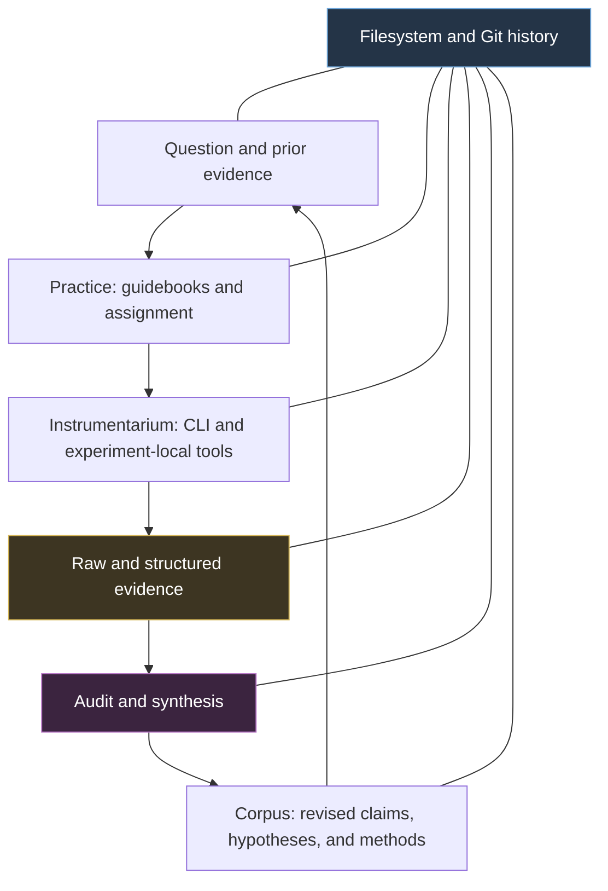
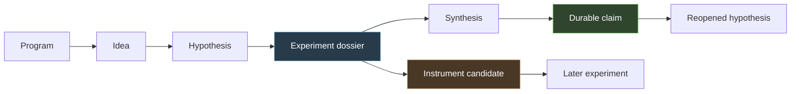
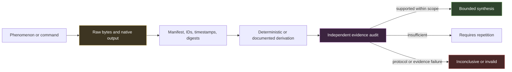
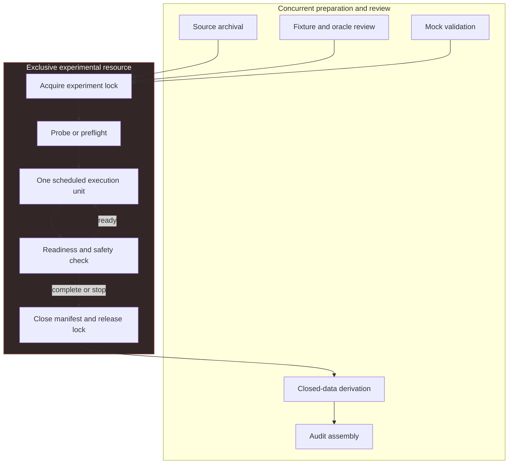

# Research Lab: Filesystem-First Evidence Infrastructure for Independent Technical Research

The Research Lab is a local, Git-versioned system for conducting technical research as a sequence of inspectable records. It combines a Markdown corpus, a small Go/Glazed command-line tool, durable guidebooks, experiment-local instruments, and explicit review gates. The project does not attempt to automate scientific judgment. It makes questions, protocols, sources, raw observations, derivations, failures, and conclusions durable enough that another person can reconstruct what happened and decide whether a claim is justified.

This report analyzes the lab itself. The CPU-inference work performed during development appears only where it demonstrates an architectural property or exposed a missing control. A separate report can address that research and its domain findings directly.

> [!summary]
> - The filesystem is authoritative. Markdown carries reasoning; JSON, YAML, CSV, raw bytes, and native reports carry operational evidence; generated indexes remain disposable.
> - The project separates **corpus**, **instrumentarium**, and **practice**. The CLI records and queries; guidebooks define methods; audits retain scientific judgment.
> - Independent work is governed through assignments, non-overlapping write scopes, evidence gates, and serialized ownership of shared experimental resources.
> - The strongest validation of the design was an experiment that stopped without a performance result. Its records preserved a safety violation, the audit rejected protocol fidelity, and the collector was corrected for future runs.

## Why this project exists

Technical research produces more than a final answer. A defensible result depends on the question that was asked, the mechanism that was proposed, the alternatives that were considered, the workload that was fixed, the exact intervention that was applied, the environment that surrounded it, and the transformation from raw observations to prose. If those elements exist only in a terminal scrollback, an agent transcript, or an unstructured benchmark directory, the conclusion cannot be reviewed reliably after the original session ends.

The project therefore optimizes for reconstruction. A future reader should be able to answer six questions from repository files:

1. What question was being investigated, and what was explicitly out of scope?
2. Which hypothesis or competing explanations determined the experiment?
3. Which sources and prior observations shaped the protocol?
4. Which exact commands, fixtures, schedules, and instruments produced the evidence?
5. Which failures, deviations, and exclusions occurred during execution?
6. Why did the audit permit, qualify, reject, or defer the conclusion?

This requirement changes the role of tooling. A research command should not hide the raw records behind a database or reduce an episode to a success flag. It should preserve the information needed for later judgment. The design accordingly prefers ordinary files, stable identifiers, content digests, append-oriented chronology, deterministic derivation, and explicit audit documents.

## Current project status

The repository contains a working first implementation and two completed development tickets. The first ticket established the filesystem model, Go CLI, guidebooks, and a bounded validation episode. The second hardened the workflow for independent contributors, source archival, semantic correctness, randomized protocols, telemetry, append-only evidence, resource serialization, and audit recovery.

The generic Go CLI is intentionally smaller than the strongest experiment-local workflow. It can initialize a lab, scaffold records, append notes, capture commands, run simple interleaved benchmarks, build a disposable index, search, lint, compare descriptive summaries, and package directories. The more demanding controls—committed schedules, semantic oracles, request-bound telemetry, crash-resumable manifests, shared-resource locks, safety checks, and deterministic statistical derivation—currently live in experiment dossiers and guidebooks. This distinction is important: the repository demonstrates those methods, but the core CLI does not yet enforce all of them.

The main repository is:

`/home/manuel/code/wesen/2026-07-10--research-lab`

The principal implementation files are:

- `cmd/lab/main.go` — root Cobra application, logging, help, and command registration.
- `cmd/lab/actions.go` — mutation-oriented commands such as `new`, `note`, `capture`, `bench`, and `package`.
- `cmd/lab/queries.go` — Glazed row-producing commands for `index`, `search`, `lint`, and `compare`.
- `internal/lab/workspace.go` — filesystem records, parsing, scanning, manifests, samples, hashes, and tar packaging.
- `internal/lab/workspace_test.go` — the current unit-test boundary.
- `guidebooks/` — durable research methods.
- `programs/` — inquiry areas and their program-scoped records.
- `ttmp/` — ticket history, diaries, design documents, and implementation provenance.

## 1. The architectural thesis

The lab has three coequal layers: the corpus, the instrumentarium, and the practice. None can replace the other.



### 1.1 The corpus

The corpus is the durable research record. Formal ideas, hypotheses, experiments, and claims use Markdown with small YAML frontmatter. Labbook entries can remain plain Markdown. Machine-oriented material uses formats that match its operations: JSON for request and telemetry records, YAML for compact manifests, CSV for simple sample tables, raw bytes for unmodified responses, PDFs for archived papers, and native profiler formats when a target instrument produces them.

The body of a research document remains authoritative for reasoning. The Go `Frontmatter` type contains only:

```go
type Frontmatter struct {
    ID      string   `yaml:"id"`
    Kind    string   `yaml:"kind"`
    Title   string   `yaml:"title"`
    Status  string   `yaml:"status"`
    Program string   `yaml:"program,omitempty"`
    Related []string `yaml:"related,omitempty"`
    Tags    []string `yaml:"tags,omitempty"`
}
```

This is a deliberate limit. A hypothesis needs prose for assumptions, alternatives, predicted signatures, boundary conditions, and falsifiers. Encoding all of that as a rigid object would make schema maintenance compete with research and would still fail to express many legitimate arguments. Frontmatter supplies stable identity and coarse retrieval; the document body supplies the reasoning.

### 1.2 The instrumentarium

The instrumentarium consists of tools that make phenomena observable and records reproducible. The generic `lab` binary handles common filesystem operations. A specific experiment can add scripts, schemas, fixtures, collectors, or analyzers beside its protocol when the generic commands are insufficient.

This layering prevents a premature universal abstraction. A command-level timer can compare two shell commands, but it cannot automatically understand model residency, semantic output equivalence, runner replacement, CPU-frequency state, thermal policy, or hardware-counter permissions. The generic layer records stable common structure. Target-specific instruments preserve their native concepts until repeated use justifies promotion.

### 1.3 The practice

The practice layer defines how researchers use records and instruments. It is implemented as guidebooks rather than hard-coded orchestration. The current progression is:

```text
lab note
  -> idea generation
  -> hypothesis grounding
  -> experiment design
  -> benchmarking or target-specific observation
  -> evidence audit
  -> synthesis or a reopened question
```

A guidebook is not an assignment. It explains a durable method, including when to use it, what evidence it expects, what failure looks like, and how to hand work to a reviewer. An assignment supplies the local question, input documents, permitted instruments, constraints, output paths, and resource ownership. This separation lets the same method apply to a human, a coding agent, or a mixed team without embedding one worker’s task into the method itself.

## 2. Filesystem authority and rebuildable views

The central storage decision is simple: ordinary files are the source of truth. Generated indexes can improve retrieval, but deleting them must not delete knowledge.

`EnsureLayout` creates this minimum structure:

```text
programs/
labbook/
knowledge/claims/
instruments/candidates/
guidebooks/
artifacts/sha256/
templates/
```

The repository has since developed the following operational shape:

```text
research-lab/
├── cmd/lab/                         Go CLI adapters
├── internal/lab/                    filesystem domain operations
├── guidebooks/                      durable research methods
├── programs/
│   └── P-.../
│       ├── program.md               inquiry scope and evidence standard
│       ├── ideas/                   questions worth grounding
│       ├── hypotheses/              falsifiable scoped claims
│       ├── experiments/
│       │   └── E-.../
│       │       ├── README.md        formal experiment record
│       │       ├── assignment.md    role and scope contract
│       │       ├── protocol.md      locked method
│       │       ├── fixtures/        versioned workloads and oracles
│       │       ├── sources/         archived source corpus and index
│       │       ├── scripts/         collectors, checks, derivations
│       │       ├── raw/             observations, including failures
│       │       ├── derived/         reproducible transformations
│       │       ├── result.md        bounded interpretation
│       │       └── audit.md         independent evidence review
│       └── syntheses/               cross-episode knowledge
├── labbook/YYYY/MM/                 contemporaneous chronology
├── knowledge/claims/                promoted cross-episode claims
├── instruments/candidates/          not-yet-standard instruments
├── artifacts/sha256/                content-addressed large bytes
├── packages/                        portable evidence bundles
├── .lab/index.json                  disposable generated view
└── ttmp/                             ticket docs and implementation history
```

### Why the generated index is secondary

`lab index` scans Markdown and writes `.lab/index.json`. The JSON contains complete parsed documents, including text and paths, while the command emits structured rows through Glazed. The index can be rebuilt from the corpus, so it can be deleted, regenerated under a new schema, or replaced by DuckDB or Parquet without migrating the authoritative reasoning.

`lab search` currently rescans live files instead of reading `.lab/index.json`. It performs case-insensitive substring matching over document text and title and can filter by `kind`. This is basic retrieval, but it has a valuable property: search results cannot become stale because an index job was forgotten. More sophisticated retrieval can be added later as another rebuildable view.

### Corpus boundaries are explicit

A filesystem scanner must define which files belong to the research corpus. `ScanDocuments` skips:

- `.git`
- `.lab`
- `.pi`
- `.pi-subagents`
- `node_modules`
- `bin`
- `ttmp`

This rule emerged from an actual failure. Doc-manager template files under `ttmp` contained placeholder YAML that was not valid research frontmatter, and the original recursive scan attempted to parse them. The fix was not to weaken YAML parsing. It was to state that generated metadata, dependency trees, agent artifacts, binaries, and ticket templates are different document domains.

The consequence is equally important: ticket design documents and diaries influence the implementation but do not appear in `lab index`, `lab search`, or `lab lint`. They are project provenance, not formal program records. A future configurable boundary may be preferable, but the current exclusion is intentional and tested.

## 3. Record types and research relationships

The CLI supports six formal record kinds:

| Kind | Purpose | Default scope |
|---|---|---|
| `idea` | Preserve a question, intuition, possible mechanism, and reasons it may fail. | Program-scoped when `--program` is supplied. |
| `hypothesis` | State a causal claim, assumptions, alternatives, signatures, and falsifiers. | Program-scoped when supplied. |
| `experiment` | Create a dossier directory for protocol, execution, observations, and interpretation. | Program-scoped when supplied. |
| `synthesis` | Integrate evidence across an episode or several related episodes. | Program-scoped when supplied. |
| `claim` | Preserve reusable knowledge with supporting and contradicting evidence. | Lab-wide. |
| `instrument` | Describe a candidate measurement tool, calibration, overhead, and blind spots. | Lab-wide. |

The intended relationship is not a mandatory linear state machine. It is an evidence graph expressed through identifiers, `program`, `related`, Markdown links, manifest references, and content digests.



Several design choices follow from this representation:

- A claim is not created for every result. Promotion is useful when knowledge must be retrieved across episodes.
- An instrument is not trusted because it exists. Its record must describe calibration, overhead, blind spots, and interpretation rules.
- A completed experiment can reopen a hypothesis instead of producing a claim.
- A failed execution remains connected to the protocol and can revise a guidebook even when it produces no domain conclusion.

The current `lab lint` checks only the identity triplet and duplicate IDs. It does not validate relationships, kind vocabularies, state transitions, backlinks, or missing referenced artifacts. Those are explicit extension points rather than hidden existing guarantees.

## 4. Go and Glazed implementation

The implementation uses Cobra for the command tree and Glazed where commands naturally emit structured rows. This division keeps mutation-oriented commands direct while giving query-oriented commands table, JSON, CSV, and YAML output without custom format switches.

### 4.1 Command registration

`cmd/lab/main.go` creates the root command, installs logging and help, defines a persistent `--root`, and registers two command classes:

```text
Cobra action commands:
  init, new, note, capture, bench, package

Glazed row commands:
  index, search, lint, compare
```

Every command resolves the root to an absolute path. The domain package in `internal/lab` does not depend on Cobra or Glazed; it operates on paths and Go values. This keeps storage semantics testable without running the CLI.

### 4.2 Action commands

#### `lab init`

`lab init` creates the minimum folder structure and writes a short root README. It does not initialize Git, create a database, install agent infrastructure, or configure a remote artifact service.

The current implementation writes `README.md` unconditionally. Running it against a populated directory can overwrite an existing README. This is a known hardening requirement, not an intended idempotency guarantee.

#### `lab new`

`lab new` validates `--kind`, `--id`, and `--title`, chooses the scope, writes YAML frontmatter, and inserts a genre-specific prose template. For example:

```bash
lab new \
  --kind hypothesis \
  --id H-CPU-0004 \
  --title "Thread curve near physical core count" \
  --program P-CPU-INFERENCE
```

An experiment differs from the single-file records: it receives its own directory and `README.md`, allowing protocol, fixtures, scripts, evidence, and audit files to remain adjacent.

Creation is scaffolding, not validation. The slugger handles spaces and `/`, but it is not a complete path sanitizer. Existing target paths can be overwritten. A production-hardening pass should add safe creation semantics and explicit replacement flags.

#### `lab note`

`lab note` appends an RFC3339 timestamp and text to the current local-date labbook path selected by the implementation. The entry is intentionally informal:

```bash
lab note --text "Observed a warmup failure before measured execution; stopped the episode."
```

The labbook separates contemporaneous knowledge from later synthesis. It can record an anomaly before its meaning is understood. The implementation is append-oriented but does not currently use a file lock or explicit `fsync`, so it should not be treated as a concurrent transaction log.

#### `lab capture`

`lab capture` executes an argument vector, saves stdout and stderr separately, records a manifest, and returns the child error. Retaining a failed command is part of the contract.

```text
command argv
   ├──> raw/stdout.log
   ├──> raw/stderr.log
   └──> manifest.yaml
          id, experiment, UTC start, argv, exit code,
          hostname, Go version, GOOS, GOARCH
```

The manifest is intentionally basic. Its `StartedAt` field is populated after command execution, so the current value is a post-execution UTC timestamp despite the field name. It does not yet record Git revision and dirty state, a true start or end time, kernel, CPU topology, executable hash, model or fixture digest, or a secret-safe environment allowlist. Non-zero and launch failures also collapse to a coarse exit representation. Target-specific collectors must retain richer provenance when a claim depends on it.

#### `lab bench`

`lab bench` is a small command-level benchmark:

```text
correctness shell command
  -> baseline/candidate warmups
  -> measured alternating order
  -> raw/samples.csv
  -> derived/summary.json
  -> manifest.yaml
```

Each sample contains a variant, global order, duration in nanoseconds, and exit code. The summary reports sample count, median, minimum, maximum, and failure count. The order alternates B→C and C→B on successive iterations.

This command is appropriate for exploratory local comparisons where a one-time shell correctness gate and descriptive timing are sufficient. It is not a controlled experimental engine. Warmup errors are ignored, command stdout/stderr are discarded, order is deterministic rather than drawn from a committed schedule, no pair identifier exists, failures remain in duration summaries, and the manifest is written only after execution. The project learned these limits by attempting to design a stronger repeated experiment; it responded with an experiment-local collector rather than pretending the generic command already satisfied the protocol.

#### `lab package`

`lab package` recursively writes a directory to an uncompressed tar file. It makes an evidence dossier portable, but it does not certify completeness, calculate a package digest, filter secrets, or prove that derived data can be regenerated. Packaging is transport. Integrity and interpretability come from the dossier’s manifests, hashes, commands, and audit.

### 4.3 Glazed query commands

The Glazed commands implement `RunIntoGlazeProcessor`. They decode command settings and emit `types.Row` values; Glazed controls rendering.

```bash
lab index --output json
lab search --query "runner replacement" --kind hypothesis --output csv
lab lint --output table
lab compare --samples programs/P-X/experiments/E-X/benchmarks/<stamp>/raw/samples.csv --output json
```

This gives humans and automation one command surface. A table is useful during exploration; JSON or CSV can feed another tool without a separate API implementation.

`lab compare` remains descriptive. It summarizes literal `baseline` and `candidate` rows and reports a median percentage when the baseline median is positive. It does not compute confidence intervals, paired effects, stopping boundaries, outlier rules, or causal conclusions. That limit is central to the architecture: statistical judgment must remain visible in the protocol and analysis rather than appearing as an unexplained “winner” field.

## 5. Evidence architecture

The lab separates raw observation, derivation, and interpretation because each layer answers a different review question.

| Layer | Review question | Typical material |
|---|---|---|
| Raw | What did the instrument actually emit? | stdout/stderr, response bytes, telemetry, native reports, request payloads, timestamps. |
| Derived | Can the reported table or figure be regenerated? | scripts, normalized rows, summaries, confidence intervals, plots. |
| Interpretation | Does the evidence support the stated scope? | result documents, competing explanations, limitations, audit outcome. |



### Content addressing

`StoreArtifact` computes SHA-256 and stores a file under:

```text
artifacts/sha256/<first-two-hex>/<full-digest>/object
```

The returned identifier is `sha256:<digest>`. This supports stable references to large immutable outputs without naming them by a mutable path. The primitive currently exists in the internal package but has no public CLI command, so its lifecycle remains incomplete.

### Append-only evidence for high-risk execution

The generic CLI does not implement an append-only event store. The hardened experiment demonstrated a stronger dossier-local rule:

```text
for every request:
    capture before-state
    save exact request bytes
    execute once
    save exact response bytes
    capture after-state
    validate the semantic oracle
    append the request record
    flush durable records before the next request
```

Resume logic refuses existing request IDs and continues only from an unstarted scheduled unit. Invalid and interrupted records remain in the packet with machine-readable reasons. Derivation reads only a closed manifest. These rules prevent a crash or exclusion decision from silently rewriting the sample history.

The general lesson is not that every research project needs the same JSON schema. It is that the persistence order must match the cost of losing or repeating an observation. A high-risk, stateful, or safety-constrained experiment needs durable progress before it advances the system again.

## 6. Guidebooks as durable method

The guidebook library captures the practices that the CLI deliberately does not decide.

### Lab note

The lab-note guidebook separates what happened, what was observed, what was inferred, and what was decided. It requires failures and deviations to remain chronological. This prevents later understanding from replacing the record of what the researcher knew at the time.

### Idea generation

The idea-generation guidebook encourages multiple mechanisms and failure modes before ranking implementation paths. The purpose is not maximum idea count. It is to avoid selecting a convenient intervention before defining why it might change the phenomenon.

### Hypothesis grounding

The grounding guidebook expands a claim into a dependency sequence:

```text
bottleneck exists
  -> intervention changes the relevant mechanism
  -> opposing effects do not dominate
  -> implementation actually applies the intervention
  -> integrated system exhibits the predicted signature
  -> transfer is bounded to tested conditions
```

A grounded hypothesis states competing explanations, observable signatures, fidelity evidence, falsifiers, and the minimum discriminating experiment. This structure separates a mechanism failure from an implementation failure. If the requested setting never reached the target process, the experiment did not falsify the mechanism.

### Experiment design

The experiment-design guidebook now requires load-bearing primary sources to be archived before protocol lock. It also covers semantic correctness, seeded schedules, explicit estimands, stopping and invalidation rules, transition probes, shared-resource ownership, and role-scoped gates.

This source-first order was learned from practice. Static source inspection showed that a supposedly simple runtime option could trigger process replacement. That changed the measurement model before execution: loading and reconfiguration had to remain separate from evaluation. The domain detail belongs in the separate research report; the methodological result belongs here. Fundamentals research can alter what an experiment measures, so it must occur before the measurement contract becomes immutable.

### Benchmarking

The benchmarking guidebook treats environment and instrumentation as part of the observation. Comparable outputs must represent comparable work. Shared resources must be serialized when concurrency would change the question. Missing telemetry is represented as missing with an explicit reason, not converted to zero or “stable.” Native profiler reports remain primary evidence even when normalized summaries are generated.

### Evidence audit

The audit guidebook verifies links among protocol, raw evidence, derivation, and prose. It distinguishes observation, mechanism, and generalization. It also handles agent-specific operational failure: empty output, missing structured acceptance, scope drift, and partial completion are not positive gates and are not scientific negative results. The parent or reviewer must inspect files and rerun a bounded role when necessary.

## 7. Independent work without concurrent corruption

The project uses agents as replaceable researchers, reviewers, and implementers rather than as the storage or control plane. The generic execution model is:

```text
worker
  + selected guidebook
  + explicit context packet
  + permitted instruments
  + bounded write scope
  + named acceptance evidence
  -> inspectable artifact
```

Independent work becomes reliable only when independence is defined precisely. Four constraints matter.

### 7.1 Non-overlapping write scopes

A protocol custodian should not edit raw results. An execution operator should not revise the fixture after seeing outcomes. A derivation analyst should not repair missing raw evidence. An auditor should not convert an invalid run into a valid one by editing the conclusion alone.

The advanced workflow assigned fixed stages:

| Stage | Responsibility | Typical write scope |
|---|---|---|
| Q0 | Lock estimand, schedule, stopping, and replacement rules. | Protocol and schedule files. |
| Q1 | Archive foundations and validate telemetry availability. | Sources and instrumentation contract. |
| Q2 | Create fixtures and variant-independent semantic oracles. | Fixture and oracle files. |
| Q3 | Implement collector, schemas, derivation, and mock checks. | Scripts and schemas. |
| Q4 | Execute the sole shared-resource run. | Raw manifests and request artifacts. |
| Q5 | Derive results from closed raw records. | Derived outputs and observations. |
| Q6 | Audit protocol fidelity and claim scope. | Audit document. |

The labels are local; the pattern is general. Definition, execution, derivation, and audit should not silently overwrite one another’s evidence.

### 7.2 Evidence gates

A stage opens on named artifacts and validation, not on a worker saying it is finished. A source gate can require URLs, retrieval dates, local files, hashes, and limitations. A collector gate can require deterministic mock scenarios that prove crash recovery and duplicate refusal without touching the real endpoint. An execution gate can require locked digests, a passing semantic oracle, and exclusive resource ownership.

This distinction proved necessary because delegated tasks sometimes returned incomplete acceptance metadata, timed out after writing most files, or produced only an initial progress sentence. The parent inspected the actual artifacts, recovered narrowly, and did not reinterpret orchestration failure as evidence about the hypothesis.

### 7.3 Serialized shared resources

Parallel preparation does not imply parallel experimentation. The local CPU and model server can be the treatment environment itself. Concurrent access would add queueing, cache interference, memory-bandwidth contention, thermal drift, or runner transitions to the question.

The lab therefore separates two execution categories:



Only the execution operator can touch the resource during the episode. Research, coding, and audit can continue concurrently when they do not consume or mutate it.

### 7.4 Parent and reviewer authority

Independent contributors generate evidence and proposals. The parent selects the hypothesis queue, resolves scope, approves resource use, and decides whether a failed agent run should be resumed or replaced. The auditor evaluates the packet independently. This avoids two opposite errors: centralizing all work in one long-lived context, and allowing several workers to make incompatible changes to the same experimental contract.

## 8. How the design changed under real use

The project did not begin with the complete gated workflow. Its development history shows why each layer exists.

### 8.1 The minimum implementation established the corpus boundary

The first implementation created document round-tripping, sample summaries, evidence packaging, and Glazed queries. Several ordinary engineering failures sharpened the model:

- Plain README and labbook files were initially treated as malformed formal records. The fix established that unstructured Markdown is valid corpus material and only frontmatter-bearing records require an identity triplet.
- Packaging failed when the destination parent did not exist. The fix became a unit test.
- Recursive scanning reached ticket templates with placeholder YAML. The fix introduced explicit excluded trees and a regression test.
- The installed Glazed API differed from an assumed API, requiring implementation against the actual pinned dependency rather than a remembered interface.

These are not domain-research results. They are evidence that a filesystem-first tool still needs explicit parser, mutation, and corpus-boundary semantics.

### 8.2 The first research episode validated retention but not causal strength

A small local experiment exercised the path from idea to hypothesis, fixed fixture, raw output, derivation, and audit. The descriptive result looked favorable, but sample size, host-state controls, workload completion, and intervention fidelity were insufficient. The audit returned `requires-repetition` instead of publishing an optimization claim.

For the lab, this was a successful test of one property: attractive numbers did not override the evidence standard. It also exposed weaknesses in the generic benchmark abstraction and in loosely bounded delegation.

### 8.3 Repetition required a new protocol, not a larger loop

The follow-up work began with an important correction: repetition was not defined as increasing `--runs`. Researchers archived primary sources, generated several falsifiable hypotheses, critiqued the methodology, selected a queue, locked estimands and schedules, created semantic oracles, designed telemetry, and built a crash-resumable collector with mock tests.

The workflow changed in several durable ways:

- Fundamentals research moved before protocol lock.
- Semantic completion replaced byte equality as the correctness criterion.
- Schedules were generated and committed before outcomes existed.
- Telemetry represented unavailable observations explicitly.
- Shared CPU and server use received one owner.
- Every request obtained immutable identity and raw links.
- Derivation consumed closed manifests only.
- Prepared follow-on experiments remained blocked until their dependency audit passed.

This is the project’s main architectural evolution: the minimal CLI remained thin, while the practice layer and experiment-local instrument became more exact because a concrete question required it.

## 9. The safety-stop episode as architectural evidence

The strongest project lesson came from an execution that produced no inferential samples. A thermal rule required immediate stopping when any monitored zone reached the locked threshold. The collector eventually stopped before the measured phase, but a post-request check was missing from the transition-probe path. Five additional probe requests ran after the first recorded threshold breach.

The preserved packet made this visible. Raw telemetry established the chronology; the derivation retained the bounded transition records; the audit compared execution with the locked protocol and assigned `implementation-not-faithful`. The performance outcome remained `inconclusive`. The collector was corrected for future runs, but the fix did not retroactively validate the closed episode.

This outcome establishes four properties of the lab design:

1. **A prose rule is not an implemented control.** Every safety and readiness requirement must be traced through every execution path and tested where possible.
2. **Stopping without the desired measurement is valid.** Safety and protocol fidelity outrank sample completion.
3. **Partial evidence can remain useful without being promoted.** Mechanism observations from the probe were retained descriptively while performance inference was rejected.
4. **An audit evaluates the process as well as the numbers.** A semantically correct response and intact hashes do not repair an execution that violated its stop rule.

The example also clarifies the role of failure preservation. If the operator had deleted the partial records and restarted until a complete sample existed, the repository would conceal both the environmental constraint and the collector defect. Append-oriented evidence and a closed audit converted a failed episode into actionable method improvement without converting it into a domain claim.

## 10. What the system deliberately does not enforce

The current lab is not an autonomous research platform. It has no workflow scheduler, authorization service, hosted agent runtime, graph database, web interface, or distributed artifact store. It does not encode scientific prose into a comprehensive schema.

The following boundaries are deliberate:

- `lab compare` does not decide whether a candidate won.
- `lab lint` does not assess whether a hypothesis is falsifiable or a protocol is adequate.
- `lab index` does not become authoritative merely because it is machine-readable.
- The CLI does not automatically advance records through statuses.
- Guidebook rules are not automatically enforced unless an experiment implements and tests them.
- A package is not proof of completeness or integrity.
- An agent completion message is not an acceptance gate.
- A submitted runtime option is not proof that the target applied it.
- A missing sensor is not interpreted as a zero value or stable environment.
- A prepared experiment is not authorized to run merely because its files exist.

These limits preserve inspectability, but they also create obligations. Researchers and reviewers must read the protocol, inspect raw links, reproduce derivations, and state claim boundaries. The project chooses visible judgment over opaque automation. Future commands should automate mechanical checks without absorbing decisions that require scientific interpretation.

## 11. Verification and quality posture

The Go test suite currently covers:

1. Markdown document write/scan round-trip.
2. Exclusion of malformed ticket-template content from corpus scans.
3. CSV sample round-trip and descriptive summary behavior.
4. Package creation when the output parent is absent.

The repository builds and the program records pass the current lint command. The experiment-local collector also has mock validation for schedule realization, append visibility, crash resume, duplicate refusal, invalid retention, digest tampering, held-out gating, readiness recovery, timeout, thermal stop, and deterministic derivation.

Coverage remains narrow at the generic CLI level. Missing tests include:

- malformed and unterminated frontmatter behavior;
- duplicate-ID lint integration;
- existing-path overwrite refusal;
- capture launch and exit-code fidelity;
- benchmark warmup and measured failure semantics;
- benchmark ordering and raw-output retention;
- CSV header and variant validation;
- artifact content-addressing through a public command;
- package filtering, manifesting, and deterministic reproduction;
- CLI-level Glazed output smoke tests.

The quality posture should therefore be described accurately: the architectural boundary is established, the core package has focused unit coverage, and one experiment dossier has much stronger local validation. The generic tooling is not yet a hardened multi-program laboratory runtime.

## 12. Failure modes and limitations

### Overwrite behavior

`lab init`, `lab new`, and capture paths can overwrite existing files or run directories. Stable IDs require creation commands that fail closed unless replacement is explicit.

### Shell trust

`lab bench` uses `sh -c` for flexible local commands. It must not receive untrusted command strings. A future structured command specification could preserve argv boundaries and environment allowlists.

### Sparse provenance

The generic run manifest lacks the details needed for strong performance or systems claims. Provenance should be extended carefully so it records relevant state without copying credentials or an uncontrolled environment dump.

### Scan failure scope

One malformed frontmatter-bearing Markdown file outside excluded directories aborts index, search, and lint. This is strict and visible, but large corpora may benefit from an error-row mode that reports all malformed documents without publishing a partial authoritative-looking index.

### Search truncation

Search snippets are flattened and byte-truncated. This can split UTF-8 and does not preserve the most relevant local context around a match. Retrieval improvements should keep search rebuildable from files.

### Benchmark statistics

The generic summary includes durations from failed commands, recognizes only literal `baseline` and `candidate`, and has no uncertainty model. Researchers must not use it as a substitute for an experiment-specific analysis.

### Package semantics

The tar writer transports every file under the selected directory, including anything generated or sensitive that the caller failed to remove. A future package command should support an explicit packet manifest, exclusions, digest output, and verification mode.

### Guidebook maturity

The broader design describes guidebook states such as draft, revised from experience, validated across programs, contested, and reopened. The current files do not encode or query that lifecycle. Git history and ticket prose currently carry the evolution.

## 13. Recommended implementation sequence

The next phase should consolidate controls that have already proved useful rather than expand immediately into a large platform.

### Phase 1: Safe mutation and provenance

- Make `init`, `new`, and capture fail on existing authoritative paths unless an explicit replacement option is given.
- Extend run manifests with Git revision and dirty state, start/end timestamps, kernel, CPU identity, executable/tool versions, and selected input digests.
- Define a secret-safe environment allowlist rather than capturing the complete process environment.
- Preserve exact child exit codes and launch errors.

### Phase 2: Mechanical gate validation

Add a generic `lab gate` command for checks that do not require scientific judgment:

```text
required paths exist
  -> no unresolved placeholders
  -> referenced digests resolve
  -> schemas validate
  -> schedules have declared balance and unique IDs
  -> raw manifests are closed before derivation
  -> generated-artifact hygiene passes
  -> dependency status permits the requested phase
```

The command should report structured findings and never silently repair evidence.

### Phase 3: Program-level resource instruments

Promote shared-resource locks, ownership records, and stop-event schemas from one experiment into reviewed reusable instruments. The instrument should define how to acquire, inspect, refuse, release, and audit a lock. Target-specific safety policies can remain in experiment protocols.

### Phase 4: Richer but rebuildable retrieval

Introduce backlinks, relation validation, and optional DuckDB or Parquet views generated from the filesystem. The files remain authoritative. Index schema changes should require regeneration, not migration of the only copy of knowledge.

### Phase 5: Instrument promotion

When two or more programs repeat the same collector pattern, extract it into `instruments/candidates/`. Document its phenomenon, inputs, outputs, calibration, overhead, blind spots, permissions, and replay mode. Promote it to a lab standard only after cross-program validation.

## 14. How to operate the lab today

A new research episode should begin with a bounded program or an existing program record. The following sequence is the current practical operating model:

```text
1. Read the program scope and relevant guidebooks.
2. Append the motivating observation to the labbook.
3. Create an idea and preserve why it might fail.
4. Ground one or more hypotheses with alternatives and fidelity checks.
5. Archive load-bearing sources with URLs, retrieval metadata, limitations, and hashes.
6. Select the hypothesis queue; do not authorize every generated idea.
7. Write an assignment with inputs, output paths, permitted instruments, and resource ownership.
8. Lock fixtures, oracles, schedules, estimands, invalidation, stopping, and safety rules.
9. Validate collectors and gates without consuming the experimental resource.
10. Give one operator exclusive ownership of stateful execution.
11. Append and flush raw evidence before advancing the system.
12. Derive only from closed manifests.
13. Audit fidelity, correctness, environmental control, and claim scope independently.
14. Publish a bounded result, require repetition, or close inconclusive.
15. Revise guidebooks only when the episode supplies a concrete motivating incident.
```

The most important operational rule is that incomplete, invalid, or inconclusive work remains part of the corpus. The purpose of the lab is not to maximize positive findings. It is to preserve enough structure that the standing of a finding can be evaluated later.

## 15. Important project documents

The design and history are recorded in two ticket workspaces:

- `/home/manuel/code/wesen/2026-07-10--research-lab/ttmp/2026/07/10/RESEARCH-LAB-001--filesystem-centered-research-lab-and-tooling/`
  - architecture and implementation guide;
  - operating guidebooks;
  - detailed investigation diary;
  - imported research-lab vision.
- `/home/manuel/code/wesen/2026-07-10--research-lab/ttmp/2026/07/10/RESEARCH-LAB-002--controlled-cpu-inference-repetition-and-research-practice-hardening/`
  - controlled-workflow design and outcome;
  - detailed investigation diary;
  - changelog and completed tasks.

The reusable method starts at:

- `/home/manuel/code/wesen/2026-07-10--research-lab/guidebooks/README.md`
- `/home/manuel/code/wesen/2026-07-10--research-lab/guidebooks/lab-note/SKILL.md`
- `/home/manuel/code/wesen/2026-07-10--research-lab/guidebooks/idea-generation/SKILL.md`
- `/home/manuel/code/wesen/2026-07-10--research-lab/guidebooks/hypothesis-grounding/SKILL.md`
- `/home/manuel/code/wesen/2026-07-10--research-lab/guidebooks/experiment-design/SKILL.md`
- `/home/manuel/code/wesen/2026-07-10--research-lab/guidebooks/benchmarking/SKILL.md`
- `/home/manuel/code/wesen/2026-07-10--research-lab/guidebooks/evidence-audit/SKILL.md`

The CPU program under `programs/P-CPU-INFERENCE/` is the first worked example. Its domain findings, mechanism research, and planned experiments are intentionally deferred to the second report.

## Open questions

- Which experiment-local controls have now repeated often enough to become generic commands or reusable instruments?
- Should corpus exclusions remain hard-coded, become configuration, or be derived from explicit roots?
- How should relationship validation report broken references without forcing all useful prose links into a schema?
- Which guidebook maturity states should be machine-readable, and which should remain narrative Git history?
- What is the minimum safe package manifest for sharing evidence outside the repository?
- How should a generic resource lock represent stale ownership and host/process identity across different target systems?
- Which provenance fields are broadly useful without collecting secrets or irrelevant host data?
- When should an experiment-specific Python analyzer become a reusable Go/Glazed reporting command?

## Near-term next steps

1. Add safe, non-overwriting creation semantics and broader CLI integration tests.
2. Implement structured mechanical gate checks without encoding scientific verdicts.
3. Promote the proven shared-resource locking pattern into a reviewed candidate instrument.
4. Add package manifests and verification while keeping original dossiers authoritative.
5. Add rebuildable relation and backlink views.
6. Apply the workflow to a second research domain before declaring guidebooks lab standards.

## Project working rules

> [!important]
> The filesystem record outranks generated views and conversational memory. Preserve raw evidence and failed attempts, derive from closed inputs, and state the narrowest conclusion the audit permits.

> [!warning]
> Do not describe a guidebook requirement as an implemented control. A control exists only when the relevant execution path enforces it and its validation evidence is retained.

> [!success]
> An episode can succeed as research infrastructure even when its domain result is inconclusive. Preserved failure evidence, a correct audit, and a justified method revision are durable outputs.
