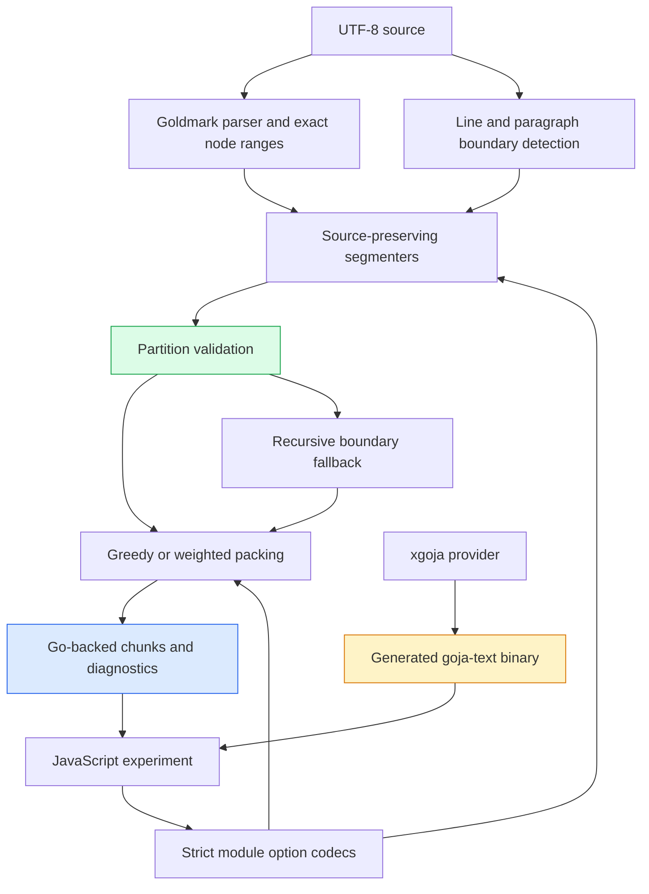
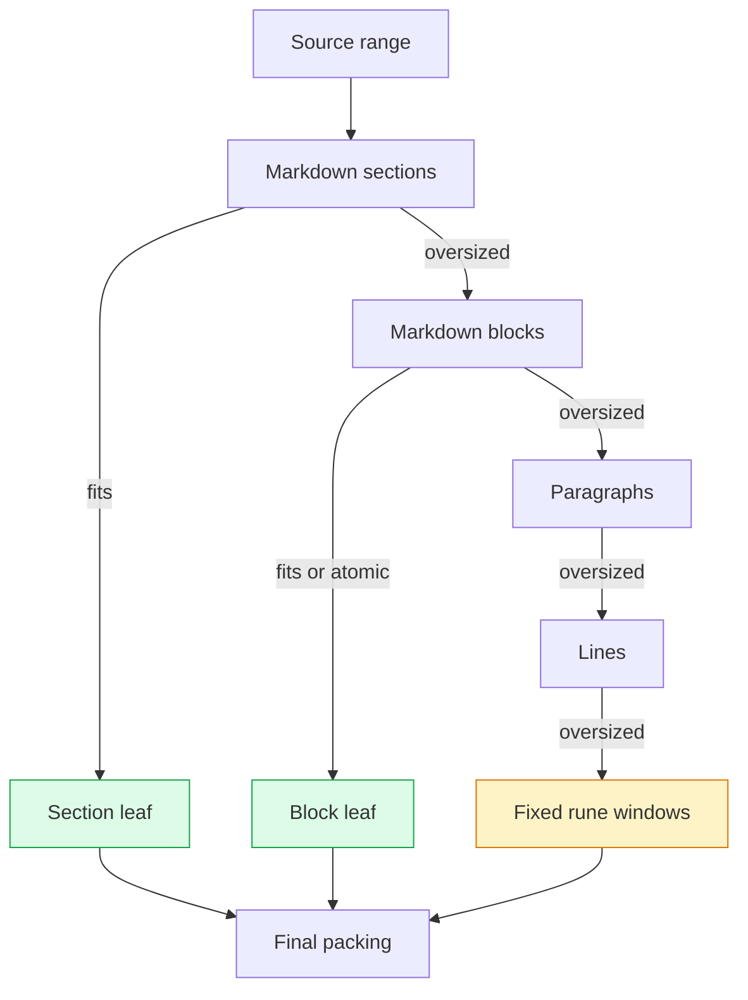

# goja-text — Source-Preserving Chunking for JavaScript RAG Pipelines

This is the current retrieval/provenance branch of the [[goja-text]] project map.

Chunking becomes a systems problem when the output must support retrieval, citations, reproducible experiments, and multiple embedding models. A string splitter can produce pieces of text. It cannot, by itself, prove that every source byte survived, identify the original byte range of each piece, preserve a Markdown fence, or explain why a chunk exceeded a model budget. PR [go-go-golems/goja-text#10](https://github.com/go-go-golems/goja-text/pull/10) adds those missing semantics to `goja-text` through a new Go-backed JavaScript module named `chunking`.

The implementation separates two operations that are often combined prematurely. Segmentation identifies source boundaries and returns a lossless partition. Packing combines complete spans under a byte, rune, word, or caller-supplied weight budget. JavaScript composes these operations, while Go owns source coordinates, validation, progress guarantees, and diagnostics.

> [!summary]
> - Every built-in segmenter returns exact UTF-8 source spans whose concatenated text equals the original input.
> - Markdown structure informs boundaries without replacing original syntax or injecting derived context into source text.
> - Packing supports deterministic measures, external tokenizer weights, complete-span overlap, explicit oversized policy, and recursive fallback.
> - The feature is delivered as a real `require("chunking")` module with TypeScript declarations, xgoja commands, embedded help, examples, golden tests, fuzz tests, and generated-host smoke coverage.

## Why this project exists

The immediate consumer is a JavaScript transcript-RAG playground. That playground needs to iterate over unit grouping, chunking, embeddings, vector search, lexical search, rank fusion, and evaluation without recompiling a custom Go application for every experiment. JavaScript is well suited to describing those experiment plans. It is less suitable as the sole authority for UTF-8 coordinates and cross-strategy source invariants because JavaScript string indexing counts UTF-16 code units rather than UTF-8 bytes or Unicode code points.

The existing `goja-text` repository already exposed Markdown parsing through Goldmark. JavaScript could call `markdown.parse()`, walk a Go-backed AST, and inspect node types. It could not obtain exact source envelopes for every structural node, and it had no reusable segmenting or packing operations. Downstream scripts therefore faced three undesirable choices:

- Write fixed-window JavaScript splitting and accept that citations use a different coordinate system from stored UTF-8 data.
- Walk the Markdown AST and reconstruct source ranges independently in each application.
- Add application-specific chunking code directly to a transcript or retrieval system, coupling text semantics to one experiment.

PR #10 moves the reusable part into `goja-text`. Transcript grouping, embedding providers, vector indexes, generation manifests, and retrieval evaluation remain outside the module. This boundary is deliberate. A text library can define exact spans and deterministic packing without selecting a model or imposing a retrieval policy.

## The central contract: source preservation

The module is organized around one equation:

```text
join(span.Text for span in result.Spans) == source
```

This equality is stronger than preserving semantic content. Markdown markers, indentation, blank lines, CRLF terminators, fence delimiters, and trailing source bytes are part of the input and must appear in exactly one segment. A heading span may include the blank lines before the next block because those bytes require deterministic ownership. A code block span includes its original fence syntax rather than only the rendered code body.

The validator implements the contract directly:

```go
func ValidatePartition(source string, spans []Span) error {
    position := 0
    var joined strings.Builder
    for ordinal, span := range spans {
        if span.Ordinal != ordinal {
            return fmt.Errorf("chunking: invalid_range: span ordinal %d is %d", ordinal, span.Ordinal)
        }
        if span.StartByte != position || span.EndByte < span.StartByte || span.EndByte > len(source) {
            return fmt.Errorf("chunking: invalid_range: span %d has range [%d,%d), expected start %d",
                ordinal, span.StartByte, span.EndByte, position)
        }
        if source[span.StartByte:span.EndByte] != span.Text {
            return fmt.Errorf("chunking: source_range_mismatch: span %d text does not match source", ordinal)
        }
        joined.WriteString(span.Text)
        position = span.EndByte
    }
    if position != len(source) || joined.String() != source {
        return fmt.Errorf("chunking: source_range_mismatch: spans cover %d of %d bytes", position, len(source))
    }
    return nil
}
```

Three independent conditions are enforced. Ordinals must be contiguous. Byte ranges must be monotonic and gapless. Each `Text` value must equal its original source slice. The final comparison verifies both coverage and reconstruction.

This contract determines the rest of the design. Heading breadcrumbs cannot be prepended to `Text`, because they are derived context rather than bytes from the selected range. Paragraph separators cannot disappear. Overlap may duplicate complete spans across packed chunks, but segmentation itself may not duplicate or omit anything.

## The data model carries evidence

The public `Span` type contains the source text, two offset systems, user-facing positions, and structural metadata:

```go
type Span struct {
    Ordinal int
    Kind    string
    Text    string

    StartByte int
    EndByte   int
    StartRune int
    EndRune   int

    StartLine   int
    StartColumn int
    EndLine     int
    EndColumn   int

    Atomic       bool
    HeadingLevel int
    HeadingPath  []string
    Language     string
    Level        string
}
```

Byte and rune ranges are zero-based and half-open. Lines and columns are one-based, with end positions pointing immediately after the range. The distinction is necessary because the same document can be processed by different classes of consumer:

| Coordinate | Primary use | Example |
| --- | --- | --- |
| Byte offsets | Exact UTF-8 storage slices and citations | `source[StartByte:EndByte]` in Go |
| Rune offsets | Deterministic Unicode-aware budgets | Maximum 1,200 code points |
| Line and column | Human navigation and diagnostics | `18:1` through `20:1` |

`Kind`, `Language`, `HeadingLevel`, and `HeadingPath` describe structure without changing source text. `Atomic` tells recursive splitting to preserve a block even when it exceeds the current budget. `Level` records the fallback strategy that produced a recursive leaf.

Results also carry a `StrategySpec`. The spec records the strategy name, version, and normalized options. A downstream experiment can persist this information alongside embeddings rather than treating chunk generation as an undocumented preprocessing step.

## Architecture

The implementation has four boundaries. Goldmark supplies syntax structure. The pure Go chunking package owns source and packing invariants. The native module translates JavaScript calls into typed options. The xgoja provider packages the module into a generated application.



The pure Go package does not import Goja. This makes segmenters and packers directly testable and prevents runtime-specific behavior from entering the text model. `module.go` is an adapter: it validates JavaScript values, invokes domain functions, and projects returned Go structs into the VM.

## Extending Markdown nodes with exact ranges

The first implementation problem existed below chunking. Goldmark nodes do not all expose source text through the same mechanism. Text leaves have direct source segments. Block nodes may expose content lines that omit syntax. Containers derive their extent from children. A fenced code block separates fence markers from body lines. A thematic break occupies source bytes despite having no meaningful text child.

A probe stored in the ticket demonstrated that a `Lines()`-only implementation would omit heading markers and fences. The resulting helper uses direct segments for exact leaves and structural boundaries for containers:

```go
func nodeSourceRange(node goldast.Node, source []byte) (int, int) {
    if node.Kind() == goldast.KindDocument {
        return 0, len(source)
    }

    start, ok := nodeSourceStart(node)
    if !ok {
        return 0, 0
    }

    switch value := node.(type) {
    case *goldast.Text:
        return clampRange(value.Segment.Start, value.Segment.Stop, len(source))
    case *goldast.RawHTML:
        // Use the first and last exact raw-HTML segments.
    }

    end := len(source)
    for current := node; current != nil; current = current.Parent() {
        if next := current.NextSibling(); next != nil {
            if nextStart, found := nodeSourceStart(next); found {
                end = nextStart
                break
            }
        }
    }
    // Structural AST envelopes exclude trailing inter-block whitespace.
    return trimTrailingWhitespace(start, end)
}
```

The sibling search walks outward through ancestors. This matters for a last child whose enclosing container has a following sibling. If no following structural boundary exists, source end becomes the outer limit.

The Markdown AST range and the Markdown block segment are related but not identical abstractions. AST structural envelopes exclude trailing whitespace. The block segmenter partitions at consecutive top-level starts and therefore assigns all inter-block whitespace. Keeping these responsibilities separate prevents AST nodes from claiming separators while still preserving every byte in chunking results.

## Four segmentation strategies

The module exposes line, paragraph, Markdown-block, and Markdown-section segmentation. Each strategy answers a different boundary question.

### Lines

Line segmentation recognizes LF and CRLF. With `keepTerminators: true`, the terminator belongs to its line. With `false`, the body and terminator become separate spans. CRLF remains a single `lineTerminator` span; splitting it into a trailing carriage return and an LF span would preserve bytes but violate the declared boundary semantics.

### Paragraphs

Paragraph segmentation detects blank-line runs and makes separator ownership explicit:

- `trailing` attaches the blank run to the preceding paragraph.
- `separate` emits a `paragraphSeparator` span.
- `leading` attaches the run to the following paragraph.

All three modes reconstruct the same source. The difference is policy, not data retention.

### Markdown blocks

Markdown blocks use top-level AST node starts as partition boundaries. The algorithm is short because exact coordinate infrastructure already exists:

```go
for childIndex, child := range root.Children {
    start := 0
    if childIndex > 0 {
        start = child.StartByte
    }
    end := len(source)
    if childIndex+1 < len(root.Children) {
        end = root.Children[childIndex+1].StartByte
    }
    span := index.span(start, end, len(spans), child.Type)
    span.Atomic = atomic[child.Type]
    span.HeadingLevel = headingLevel(child)
    span.Language = child.Language
    spans = appendNonEmpty(spans, span)
}
```

The first block begins at byte zero even if the first AST node starts after leading whitespace. The last block ends at source length. The strategy preserves headings, lists, block quotes, HTML, and fenced code in their original form.

### Markdown sections

Sections create a flat partition beginning at accepted headings. Text before the first heading becomes a `preamble`. Each section stores a derived heading path such as `['Release 2.4', 'Migration']`.

The result is flat rather than a hierarchy of overlapping ranges. Overlapping parent and child section spans could not satisfy the source-partition equation. Hierarchy is metadata; `Text` remains a unique source slice.

## Packing complete spans

Segmentation says where boundaries exist. Packing decides which neighboring spans fit into one chunk. The ordinary packer measures each span in bytes, runes, or Unicode-whitespace words and greedily appends complete spans until the next span would exceed the budget.

```text
current = []

for each source span:
    validate weight

    if span exceeds budget:
        emit current
        emit span alone as oversized, or return an error
        continue

    if current plus span fits:
        append span
        continue

    emit current
    retain requested trailing complete spans
    remove oldest retained overlap until the new span fits
    append the new span

emit current
```

Oversized handling occurs before the ordinary fit branch. This ordering was corrected after the generated CLI exposed a list span of weight 194 under a budget of 180 but reported `Oversized: false`. The first implementation only recognized an oversized span when the accumulator was empty at loop entry. When an oversized span arrived after a full chunk, the code flushed the old chunk and appended the large span through the normal path. The fixed order handles oversized input on every iteration and emits `span_exceeds_budget` when policy is `allow`.

Packing validates its input spans before measuring them. Ordinals must be contiguous. Byte length must equal `len(Text)`. Rune length must equal `utf8.RuneCountInString(Text)`. Adjacent ranges must meet. This prevents a JavaScript caller from constructing a Go-shaped object whose text and citation range disagree.

## Weighted packing keeps tokenization outside the library

Token counts depend on a model, tokenizer vocabulary, normalization rules, and special-token policy. `goja-text` does not select any of those. `packWeighted` accepts one nonnegative integer weight per span:

```javascript
const weighted = chunking.packWeighted(
  blocks.Spans.map((span) => ({
    span,
    weight: tokenizer.count(span.Text),
  })),
  {
    maxWeight: 512,
    overlapWeight: 64,
    oversized: "allow",
  }
);
```

This interface makes tokenizer integration explicit and keeps the packing algorithm reusable. Reproducible downstream generations must record the tokenizer identity and the supplied weights or enough configuration to recompute them.

Weighted overlap introduced one of the two formal review findings on PR #10. The initial backward scan used `continue` when a recent trailing span was too heavy. Given prior ordinals `[0, 1, 2]` and weights `[1, 100, 1]`, an overlap allowance of 2 could select `[0, 2]`. The resulting `Text` omitted span 1 while the aggregate range extended from span 0 through the next chunk.

The corrected scan tracks the immediately preceding expected ordinal and stops at the first gap or overweight span:

```go
expectedOrdinal := firstOrdinal - 1
for j := len(prior.SpanOrdinals) - 1; j >= 0; j-- {
    ordinal := prior.SpanOrdinals[j]
    if ordinal > expectedOrdinal {
        continue
    }
    if ordinal != expectedOrdinal ||
        weights[ordinal] > options.OverlapWeight-overlapWeight {
        break
    }
    overlap = append([]int{ordinal}, overlap...)
    overlapWeight += weights[ordinal]
    expectedOrdinal--
}
```

The regression fixture uses weights `[1, 100, 1, 1]`. The only valid overlap into the second chunk is `[2, 3]`, producing text `cd` and range `[2,4)`.

## Recursive fallback preserves stronger boundaries first

Recursive chunking accepts an ordered list of segmentation levels. The default order is:

```text
markdownSections → markdownBlocks → paragraphs → lines → runes
```

Only oversized spans advance to the next level. A section that fits remains a section. An oversized section is divided into blocks. Only oversized blocks continue to paragraphs or lines. Fixed rune windows are the final deterministic fallback for byte and rune measurement.



Every nested segmenter receives a substring, so its coordinates begin at zero. `translateSpan` shifts byte, rune, line, and first-line column positions back into the original document before final packing. This is what makes recursive output usable as a citation source rather than only as text.

PR review found a metadata problem in this transition. `markdownSections` computed a `HeadingPath`, but the next boundary strategy returned children with empty paths. Refined chunks therefore lost section ancestry. Recursive translation now inherits the parent path only when the child does not have a more specific one:

```go
child.Level = level
if len(child.HeadingPath) == 0 && len(parent.HeadingPath) > 0 {
    child.HeadingPath = append([]string(nil), parent.HeadingPath...)
}
translated = append(translated, translateSpan(child, parent, len(translated)))
```

The slice copy avoids aliasing parent metadata. A regression test begins at `markdownSections`, forces fallback through smaller boundaries, and verifies that every final chunk retains `['Heading']`.

Atomic blocks stop refinement. A fenced code block marked atomic may remain oversized, but the result exposes that condition through `Oversized` and diagnostics. The library does not silently violate atomic policy to satisfy a budget.

## The JavaScript boundary

The native module exports seven lower-camel functions:

```text
lines
paragraphs
markdownBlocks
markdownSections
pack
packWeighted
recursive
```

Options are plain lower-camel JavaScript objects. Results are Go-backed values whose fields use exported PascalCase names:

```javascript
const chunking = require("chunking");

const blocks = chunking.markdownBlocks(source, {
  atomic: ["fencedCodeBlock", "codeBlock", "htmlBlock"],
});

const packed = chunking.pack(blocks.Spans, {
  maxUnits: 220,
  measure: "runes",
  overlap: { unit: "spans", value: 1 },
  oversized: "allow",
});

console.log(blocks.Spans[0].StartByte);
console.log(packed.Chunks[0].SpanOrdinals);
```

Strict codecs reject unknown keys, numeric strings, non-integral numeric values, and arrays of the wrong element type. Missing optional properties require care because Goja may return `nil`, JavaScript `undefined`, or `null`. The adapter centralizes those cases in `missingValue` before calling `ToObject` or `Export`.

The TypeScript declaration combines structured function descriptors with `RawDTS` interfaces. Optional parameters use `spec.Param.Optional`, which renders `options?: LineOptions`. An initial attempt assumed a nonexistent `spec.Optional(type)` helper. That failure led to [go-go-goja#92](https://github.com/go-go-golems/go-go-goja/issues/92), which proposes richer structured TypeScript type nodes and declaration builders. PR #10 does not depend on that future enhancement.

## A real application surface

The feature is not limited to a library package. `cmd/goja-text/xgoja.yaml` selects the module and produces a generated binary that supports scripts, TypeScript output, embedded documentation, and root-mounted JavaScript verbs.

The primary commands are:

```bash
./dist/goja-text run examples/js/chunking-demo.js
./dist/goja-text chunking blocks examples/markdown/chunking-sample.md
./dist/goja-text chunking pack examples/markdown/chunking-sample.md --max-units 180
./dist/goja-text chunking recursive examples/markdown/chunking-sample.md --max-units 140
./dist/goja-text help goja-text-chunking-user-guide
./dist/goja-text help goja-text-chunking-api-reference
./dist/goja-text types
```

The demo prints `sourcePreserved: true`, exact block ranges, packing weights, oversized status, span ordinals, and recursive fallback levels. The fixture includes a fenced shell block and a list larger than one smoke-test budget, so normal and exceptional behavior remain visible in the generated application.

## Validation as a layered argument

No single test proves this subsystem. The implementation uses several validation levels because each boundary has different failure modes.

```mermaid
flowchart LR
    Unit[Pure Go unit tests] --> Golden[Golden source and metadata fixture]
    Golden --> Fuzz[Fuzz preservation and progress]
    Fuzz --> Runtime[Real Goja runtime tests]
    Runtime --> Provider[Provider and TypeScript validation]
    Provider --> Generated[xgoja regeneration and build]
    Generated --> Smoke[Demo, help, types, and jsverbs]
    Smoke --> Release[GoReleaser snapshot]

    style Fuzz fill:#dcfce7,stroke:#16a34a
    style Smoke fill:#dbeafe,stroke:#2563eb
    style Release fill:#fef3c7,stroke:#d97706
```



The validation matrix includes:

- Unit coverage for LF, CRLF, Unicode, empty input, whitespace-only input, paragraphs, nested headings, lists, fences, HTML, exact budgets, overlap, and oversized policy.
- A golden JSON fixture that locks Markdown block syntax, byte ranges, heading levels, atomic status, and language metadata.
- Fuzz targets that reconstruct arbitrary valid UTF-8 lines and verify packing produces no empty unmarked-overbudget chunks or lost source.
- Runtime tests that call `require("chunking")`, pass Go-backed `Spans` back into Go, exercise weighted records, and reject misspelled options.
- Provider validation that checks every selected TypeScript descriptor.
- `make check`, which runs normal and standalone tests, regenerates xgoja, builds the binary, executes examples, and runs help and command smoke checks.
- Pre-push lint, tests, and a single-target GoReleaser snapshot.

The final review-fix validation included 54,978 packing fuzz executions. The exact count is not a quality target by itself; the relevant result is that the invariant held across all generated inputs.

## Failures that changed the implementation

The implementation diary is valuable because several errors clarified architectural requirements rather than only exposing typographical mistakes.

### Goldmark content lines are not source envelopes

The initial range investigation showed that `Lines()` excludes syntax for several node types. Production ranges therefore use direct segments for leaves and sibling-based structural boundaries for containers.

### Generated-host output found an oversized-policy error

Focused tests originally covered an oversized span as the first input. The generated CLI exercised an oversized list after a full chunk and showed that it was not marked. Oversized handling moved ahead of ordinary packing logic, and the new test fixes the exact sequence.

### CRLF preservation was necessary but insufficient

An early line splitter retained both CR and LF bytes but assigned CR to line content and LF to a terminator span. The byte-level invariant passed while the semantic line-boundary contract was wrong. The corrected implementation treats CRLF as one terminator.

### Runtime codecs exposed Goja absence semantics

Omitted object properties can arrive as `nil`, not only `undefined`. Calling object methods before recognizing that case caused a runtime panic. `missingValue` now handles all absent forms uniformly.

### Generated code must be validated from a clean generation

The pre-push release hook created the required `pkg/chunking/logcopter.go` file. It was committed separately so `go generate ./...` leaves the branch clean. This ensures the PR contains the same generated state that release validation expects.

### Review found continuity and metadata errors

The weighted-overlap and recursive-heading findings passed the original tests because the test shapes did not isolate those cases. Both corrections now have small, behavior-specific regressions. The important lesson is not that review replaces tests. Review supplies new counterexamples, and those counterexamples become permanent executable specifications.

## How this changes transcript-RAG experimentation

The chunking module deliberately stops before embedding. That makes it a suitable substrate for the transcript-RAG playground, where multiple representation strategies can be compared under one evaluation harness.

The immediate integration path is:

```text
minitrace rows
  → transcript unit grouping
  → goja-text source-preserving chunking
  → raw, summary, or structured representations
  → embedding provider
  → lexical/vector index
  → rank fusion
  → graded retrieval evaluation
```

`packWeighted` is the key interface for production model limits. A transcript application can count tokens with the embedding model's tokenizer and pass those counts into the same complete-span packing algorithm. The generation manifest should record the chunking `StrategySpec`, tokenizer identity, model identity, and overlap policy.

Summarization should be added after chunking as a representation stage, not inside `goja-text`. A source chunk may produce multiple indexed representations:

```json
{
  "representationKind": "summary",
  "parentChunkKey": "unit:v1/assistant-run/session/12-16/chunk/0",
  "text": "The assistant implemented exact Markdown source ranges and validated Unicode offsets.",
  "citation": {
    "sessionId": "session",
    "ordinalStart": 12,
    "ordinalEnd": 16
  },
  "generator": {
    "model": "...",
    "promptHash": "sha256:...",
    "schemaVersion": "summary/v1"
  }
}
```

Raw chunks, concise summaries, synthetic questions, and structured decision/action records can each receive embeddings while pointing to the same source range. Retrieval can fuse these channels and hydrate the raw chunk for final evidence. This preserves the rule established by PR #10: derived context is metadata or a separate representation, never falsely presented as contiguous source text.

## Current status

PR #10 is open and contains the complete implementation, generated host, documentation, ticket, validation artifacts, and the two review corrections. The feature branch is `task/goja-text-chunking`. GitHub issue #9 is closed by the PR description when merged.

The project currently provides:

- exact Markdown node start and end coordinates;
- four source-preserving segmenters;
- greedy and preweighted complete-span packing;
- overlap and explicit oversized policies;
- recursive fallback with absolute coordinates and heading metadata;
- strict JavaScript APIs and generated TypeScript;
- a generated CLI, examples, jsverbs, help, tests, fuzzing, and release validation;
- an intern-facing design guide and chronological implementation diary under `GOJA-TEXT-006`.

## Open questions and next steps

The module is ready for transcript-RAG use, but several boundaries remain intentionally open:

- Large-document benchmarks should determine whether rune-prefix computation requires optimization.
- Sentence segmentation needs a separate Unicode and language requirements analysis.
- Word-budget recursion cannot guarantee a split for one whitespace-free range; exact model limits should use `packWeighted`.
- Goldmark extensions require source-range fixtures when they are enabled.
- The transcript-RAG playground needs an adapter from transcript units to `chunking.recursive` and `packWeighted`.
- Summary, synthetic-question, and structured-memory representations should be evaluated independently before their rankings are fused.

The near-term engineering sequence is:

1. Merge or locally consume PR #10 in the transcript-RAG xgoja build.
2. Replace the custom rune-window-only chunker with a goja-text adapter while retaining the old strategy as a baseline.
3. Add a representation stage after chunking for raw text, summaries, and synthetic questions.
4. Cache generated representations by source content hash, model identity, prompt hash, and schema version.
5. Compare raw-only, summary-only, and fused retrieval with the existing precision, recall, MRR, and nDCG evaluation harness.
6. Hydrate raw source chunks for final RAG answers even when a derived representation produced the retrieval hit.

## Important implementation locations

| Path | Responsibility |
| --- | --- |
| `/home/manuel/workspaces/2026-07-10/goja-text-chunking/goja-text/pkg/markdown/source_ranges.go` | Goldmark node source envelopes |
| `/home/manuel/workspaces/2026-07-10/goja-text-chunking/goja-text/pkg/chunking/validate.go` | Lossless partition and packing-input invariants |
| `/home/manuel/workspaces/2026-07-10/goja-text-chunking/goja-text/pkg/chunking/segment_markdown.go` | Markdown blocks, sections, and heading paths |
| `/home/manuel/workspaces/2026-07-10/goja-text-chunking/goja-text/pkg/chunking/pack.go` | Greedy, weighted, overlap, and oversized packing |
| `/home/manuel/workspaces/2026-07-10/goja-text-chunking/goja-text/pkg/chunking/recursive.go` | Ordered fallback and absolute coordinate translation |
| `/home/manuel/workspaces/2026-07-10/goja-text-chunking/goja-text/pkg/chunking/module.go` | JavaScript codecs, exports, and TypeScript declaration |
| `/home/manuel/workspaces/2026-07-10/goja-text-chunking/goja-text/examples/js/chunking-demo.js` | Runnable end-to-end demonstration |
| `/home/manuel/workspaces/2026-07-10/goja-text-chunking/goja-text/ttmp/2026/07/10/GOJA-TEXT-006--source-preserving-structure-aware-chunking-javascript-api/` | Design guide, diary, tasks, experiment, and changelog |

## Related notes

- [[PROJ - Goja Text - Go-Backed Markdown AST Bindings]]
- [[PROJ - Goja Text - Sanitizing and Extracting Structured Data from Messy Text]]
- [[PROJ - goja-text - Template and HTML Rendering Module]]
- [[ARTICLE - Fluent Builders with Go-Backed Objects for JavaScript]]
- [[ARTICLE - TypeScript Declarations from xgoja Generated Binaries]]
- [[ARTICLE - Goja Fluent-Builder DSLs - Designing Typed Composable Grammars in Go for JavaScript]]

## Project working rules

> [!important]
> Preserve source text before adding retrieval context. Derived summaries, heading paths, synthetic questions, and model-specific token counts must remain explicit metadata or separate indexed representations.

The implementation establishes four rules for future work:

- A segmenter must prove that it preserves the original source.
- A packer must never produce a range that covers text omitted from the chunk.
- A recursive strategy must preserve absolute coordinates and inherited structural metadata.
- A generated product surface must be executed through tests, help, TypeScript output, commands, and release generation before it is considered complete.
