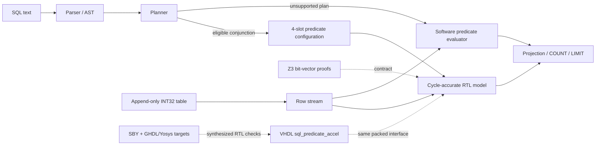

# VeriSQL-HW

A runnable research prototype of a persistent SQL database with a synthesizable,
formally checked VHDL predicate accelerator.

The project is deliberately narrow enough that its hardware contract is precise:
up to four signed `INT32` columns, one NULL bit per column, and up to four
conjunctive `WHERE` predicates. Queries outside that contract execute with the
reference software evaluator rather than being approximated in hardware.

## What is included

- A dependency-free Python SQL parser and executor.
- Append-only persistent table files with schema hashes and fixed-width rows.
- `CREATE TABLE`, multi-row `INSERT`, `SELECT`, `COUNT(*)`, `WHERE ... AND ...`,
  `IS [NOT] NULL`, `LIMIT`, and `EXPLAIN`.
- A bit-accurate and cycle-accurate accelerator model used by the query engine.
- Synthesizable VHDL-2008 RTL with valid/ready flow control.
- Z3 proofs over the complete 32-bit input space.
- VHDL grammar parsing, GHDL testbenches (including 1,000 Python-generated packed vectors), and GHDL/Yosys/SymbiYosys RTL proof targets for the comparator, packed datapath, and stream next-state block.
- Unit and differential tests for parser, storage, planner, SQL semantics,
  persistence, packing, and backpressure.

## Architecture



The accelerator has a one-entry elastic output register. With `out_ready_i='1'`,
it accepts one row per clock after startup. A stalled output remains valid and
its match bit remains stable until consumed.

## Quick start

```bash
python3 -m venv .venv
. .venv/bin/activate
python -m pip install -e '.[dev,formal]'
make check
make demo
```

Direct CLI use:

```bash
verisql --db ./example.db --command '
  CREATE TABLE t (id INT NOT NULL, x INT);
  INSERT INTO t VALUES (1, 10), (2, NULL), (3, -5);
  EXPLAIN SELECT id FROM t WHERE x >= 0;
  SELECT id FROM t WHERE x >= 0;
'
```

Expected plan and result:

```text
operator            | details
--------------------+---------------------------------------------------------
VHDL_PREDICATE_SCAN | 1 conjunctive predicate(s), four-lane INT32/NULL contract
(1 row(s))

id
--
1
(1 row(s))
```

Use `--backend software` to force the independent reference evaluator. The
`vhdl` backend in this prototype is the cycle-accurate RTL contract model; the
same packed buses are exposed by `rtl/sql_predicate_accel.vhd` for FPGA
integration.

## Supported SQL subset

| Feature | Status |
|---|---|
| `CREATE TABLE name (col INT [NULL|NOT NULL], ...)` | 1–4 columns |
| `INSERT INTO name VALUES (...), (...)` | Supported |
| `SELECT *` or named projections | Supported |
| `COUNT(*)` | Supported |
| `=`, `!=`, `<>`, `<`, `<=`, `>`, `>=` | Hardware eligible |
| `IS NULL`, `IS NOT NULL` | Hardware eligible |
| Predicates joined by `AND` | Up to 4 in hardware; otherwise software |
| `LIMIT n` | Supported |
| `EXPLAIN SELECT ...` | Supported |
| Strings, floats, joins, updates, deletes, indexes, transactions | Not implemented |
| SQL `OR`, arithmetic expressions, subqueries | Not implemented |

Identifiers are unquoted and normalized to lower case. Integer values and
predicate constants must fit signed 32-bit range.

## RTL interface

The fixed hardware contract is defined in `rtl/sql_pkg.vhd`.

| Signal | Width | Meaning |
|---|---:|---|
| `in_row_i` | 128 | Four packed words; column 0 is bits 31:0 |
| `in_null_i` | 4 | One NULL bit per column |
| `cfg_enable_i` | 4 | Predicate-slot enables |
| `cfg_column_i` | 8 | Four packed 2-bit column selectors |
| `cfg_opcode_i` | 12 | Four packed 3-bit operation codes |
| `cfg_rhs_i` | 128 | Four packed signed INT32 constants |
| `in_valid_i/in_ready_o` | 1/1 | Input transfer handshake |
| `out_valid_o/out_ready_i` | 1/1 | Output transfer handshake |
| `out_match_o` | 1 | AND reduction of enabled predicates |

Opcode map:

```text
000 EQ          001 NE          010 LT          011 LE
100 GT          101 GE          110 IS NULL     111 IS NOT NULL
```

## Verification

Run the executable contract proofs:

```bash
make prove
```

The checked claims are:

1. The sign-bit/unsigned-comparison implementation is equivalent to signed
   `INT32` equality and ordering for every pair of 32-bit operands.
2. SQL NULL behavior is correct for every opcode.
3. Packed lane selection, predicate-slot extraction, disabled-slot identity,
   and four-way AND reduction match the logical specification; an RTL-level
   target checks the synthesized VHDL datapath against an independent signed
   reference.
4. Reset, accepted-row, drain, and backpressure transition properties hold for
   the one-entry stream register.

`formal/prove.py` refuses to run if the reviewed RTL files differ from the
SHA-256 values in `formal/rtl_manifest.json`.

To grammar-parse all VHDL sources without requiring a simulator:

```bash
make vhdl-parse
```

To elaborate and simulate all three testbenches with GHDL, then run GHDL's
built-in synthesis front end on the accelerator top level:

```bash
make vhdl-test
make vhdl-synth
```

To run proofs against the synthesized VHDL through the GHDL Yosys plugin:

```bash
make formal-rtl
```

That target requires GHDL with the Yosys plugin, Yosys, SymbiYosys, and an SMT
solver. The included GitHub Actions workflow runs `make check`, all three GHDL
testbenches, and the GHDL synthesis check on GHDL 6.0.0. See `formal/README.md` and
`docs/formal_claims.md` for the proof boundary and trusted computing base.

## Repository map

```text
verisql/     SQL parser, storage, planner, engine, RTL models, CLI
rtl/         Synthesizable VHDL package, comparator, streaming accelerator
tb/          VHDL-2008 testbenches
formal/      Z3 proofs, RTL manifests, SBY harnesses
tests/        Python unit, randomized, differential, and persistence tests
docs/        Architecture and assurance notes
tools/       Deliberate RTL-manifest update utility
```

## Research limitations

This is not a production DBMS. It has no write-ahead log, rollback, concurrent
transaction protocol, authorization layer, query optimizer, index, DMA engine,
or board-specific shell. The formal claims cover the predicate datapath and
stream-control contract, not the SQL parser, filesystem, Python runtime, FPGA
place-and-route, clock-domain crossing, or external memory system. Unsupported
query shapes are rejected by the parser or executed in software; they are never
silently weakened to fit the hardware.
