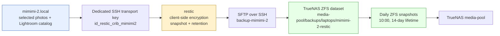

# Recoverable Mac Photo Backups with Restic, TrueNAS, and launchd

A backup is not established when data has been copied somewhere else. It is established when the destination is isolated from the source, the repository can be authenticated and decrypted, retention is bounded, a scheduler can execute the work under the intended operating conditions, and a restore has been demonstrated. This report documents a Mac photo and Lightroom backup system built around those requirements.

The protected source is `mimimi-2.local`. The first recovery unit is deliberately narrow: selected Dropbox photo folders and the Lightroom catalog directory. The destination is a dedicated TrueNAS ZFS dataset, accessed through a dedicated SSH-only account and encrypted by restic. The initial snapshot completed, repository integrity checks passed, and an isolated restore produced byte-identical representative files. The recurring job now runs as a macOS system LaunchDaemon rather than requiring a logged-in GUI session.

The system is operational, but it is not a complete 3-2-1 design. Its primary remaining gap is the absence of an offsite copy. The report treats that gap as a property of the current system, not as a footnote.

> [!summary]
> - The first backup protects 561.468 GiB of photos and Lightroom catalog data, not the entire 2.7T Mac home directory.
> - Restic repository `f95a9f8ef8` is stored in the dedicated TrueNAS dataset `media-pool/backups/laptops/mimimi-2-restic`.
> - The first snapshot, `b9ba1402`, completed in 5:39:42 and stored 496.954 GiB.
> - `restic check`, a 5% randomized read-data check across 1,503 packs, and a byte-for-byte restore test passed.
> - The Mac runs the job daily at 01:15 through `dev.crib.restic-mimimi2-lightroom-daemon`; TrueNAS takes a daily ZFS snapshot at 10:00 and retains it for 14 days.
> - The repository has a 1.50T reference quota. It currently uses about 498G, leaving about 1.01T under that quota.
> - No TrueNAS replication, cloud sync, or offsite repository copy is configured yet.

## 1. Start with the recovery unit, not the filesystem

The Mac home directory measured about 2.7T. At the time of design, TrueNAS had 3.09T available at the pool level. Copying the full home directory would have left approximately 390G before considering history, restic pack rewrite space, ZFS snapshots, unrelated pool consumers, and future source growth. A first full copy might succeed while creating a system that cannot safely retain incremental history or perform maintenance.

That capacity constraint changes the correct design. The first protected unit is not “the Mac.” It is the data that currently needs a tested recovery path: photo originals and Lightroom catalog state.

The selected paths are:

```text
/Users/manuel/Dropbox/Photos                         458G
/Users/manuel/Dropbox/Manfred/Photos                  28G
/Users/manuel/Dropbox/Mac/Desktop/Raw-Photos          24M
/Users/manuel/Pictures/Lightroom                      76G
----------------------------------------------------------
Selected logical source total                         561.468 GiB
```

This boundary has practical consequences.

- The backup includes photo data that is locally present in Dropbox and the Lightroom catalog directory needed to interpret and manage that data.
- The backup does not claim to be a complete machine image, a complete user-home backup, or a backup of every Dropbox item.
- A future expansion requires a fresh capacity calculation. Adding directories because they appear important is not sufficient; the repository quota, ZFS snapshot retention, and restic retention policy must continue to fit together.

The scope is also a statement of recovery expectations. A restored photo collection must include both image assets and catalog files. Restoring only raw images may preserve content but lose catalog organization, edits, collections, and application-level state. Restoring only a catalog may preserve metadata but leave it disconnected from the asset files it references.

## 2. Storage topology and trust boundaries

The system uses TrueNAS, not the Proxmox host or the k3s node, as the backup target. This distinction prevents a live workload mount from becoming an unstructured backup location.



The relevant network roles are intentionally separated.

| System | Address / role | Backup responsibility | Not used for |
|---|---|---|---|
| `mimimi-2.local` | macOS source machine | Select source paths, encrypt, send snapshots, perform restores | TrueNAS administration during backup |
| TrueNAS VM 106 | `192.168.0.25` | Hold the repository in a dedicated ZFS dataset; take local ZFS snapshots | Serving the repository through the Jellyfin media SMB share |
| Proxmox host | `192.168.0.227` | Host the TrueNAS VM | Mac backup destination |
| k3s VM 301 | `192.168.0.212` | Run k3s and mount live Jellyfin media over NFS | Mac backup destination |
| `media-pool/media` | TrueNAS live media dataset | Serve Jellyfin media through NFS | Mac backup storage |

The last row is important. Jellyfin consumes `192.168.0.25:/mnt/media-pool/media` through the k3s node. That is a live serving dataset. A Mac backup repository placed in that dataset would couple backup lifecycle, permissions, media-serving behavior, and capacity. The backup instead lives at:

```text
media-pool/backups/laptops/mimimi-2-restic
```

This dataset has no SMB share. It is not exposed through the existing `media` SMB share. The backup protocol is SFTP over SSH, chosen because it matches an existing isolated TrueNAS restic pattern: `media-pool/backups/laptops/f-restic` owned by a different restricted account.

## 3. What restic contributes, and what it does not

Restic provides encrypted, versioned snapshots. The Mac reads selected files, divides them into encrypted data, stores those encrypted objects in the repository, and records a snapshot describing the source state. TrueNAS can store and snapshot the repository without learning the plaintext contents from restic repository files alone.

The core repository target is:

```text
sftp:backup-mimimi-2@192.168.0.25:/mnt/media-pool/backups/laptops/mimimi-2-restic
```

The TrueNAS account is deliberately limited:

```text
username:             backup-mimimi-2
uid/gid:              3002 / 3002
home:                 /mnt/media-pool/backups/laptops/mimimi-2-restic
SSH password login:   disabled
account password:     disabled
SMB access:           disabled
SSH key:              dedicated Mac public key only
```

The account can authenticate and write its repository. It is not a TrueNAS administrator, does not need access to the Jellyfin media dataset, and does not need the administrative SSH key used to provision storage.

### 3.1 Transport authentication and repository encryption are distinct

Two secrets serve different functions:

| Material | Location | Function | Exposure if lost or copied |
|---|---|---|---|
| `~/.ssh/id_restic_crib_mimimi2` | Mac, mode 0600 | Authenticates the Mac to the restricted TrueNAS SFTP account | An attacker could access this one repository path, but not administer TrueNAS or decrypt repository content without the restic password. |
| `~/.config/restic/mimimi-2/password` | Mac, mode 0600 | Decrypts and modifies the restic repository | Losing it makes the encrypted backup unrecoverable. Copying it must be controlled. |

The restic password initially was intended for macOS Keychain storage. The first headless run failed with:

```text
security: SecKeychainItemCreateFromContent (<default>): User interaction is not allowed.
```

This is a macOS execution-context constraint. Keychain item creation may require a GUI-associated security session. A job launched through non-interactive SSH cannot assume that such interaction is possible. The operational solution was a protected local password file created with mode 0600. It keeps the repository password off TrueNAS and out of Git, while allowing unattended backups.

That solution creates a separate recovery obligation: the restic password must have a recovery-safe copy outside the repository and outside the same failure domain as the Mac. A password manager is an appropriate candidate. Storing it next to the repository on TrueNAS would weaken the encryption boundary.

## 4. Initial snapshot: transfer is evidence, not the conclusion

The first backup initialized repository `f95a9f8ef8` and transferred the selected source set. Restic reported:

```text
Files:       133700 new,     0 changed,     0 unmodified
Dirs:        25807 new,     0 changed,     0 unmodified
Added to the repository: 539.176 GiB (496.954 GiB stored)

processed 133700 files, 561.468 GiB in 5:39:42
snapshot b9ba1402 saved
```

The source total in the completed snapshot is 561.468 GiB. Restic stored 496.954 GiB. The difference is consistent with restic compression and deduplication behavior, but it should not be treated as a stable compression ratio. Future changes depend on photo formats, catalog data, new files, and whether content overlaps with existing repository objects.

The snapshot records four roots:

```text
/Users/manuel/Dropbox/Mac/Desktop/Raw-Photos
/Users/manuel/Dropbox/Manfred/Photos
/Users/manuel/Dropbox/Photos
/Users/manuel/Pictures/Lightroom
```

A completed snapshot proves that restic reached the source paths, encrypted data, and committed repository metadata. It does not alone prove that a later restore can retrieve usable content. Repository verification and a restore test are separate required operations.

## 5. Recovery validation: repository structure, sampled content, and restored files

Validation was performed in three layers.

### 5.1 Structural repository check

The standard check validates repository indexes, snapshots, trees, blobs, and pack structure:

```bash
restic check
```

Result:

```text
check all packs
check snapshots, trees and blobs
[0:00] 100.00%  1 / 1 snapshots
no errors were found
```

This validates the repository's internal references and metadata. It does not read all stored file-data blobs.

### 5.2 Randomized stored-data check

A 5% read-data check was then run:

```bash
restic check --read-data-subset=5%
```

Result:

```text
read 5.0% of packfiles
[6:20] 100.00%  1503 / 1503 packs
no errors were found
```

This tests a randomly selected portion of stored pack data. It provides stronger evidence than structural validation alone while avoiding an immediate full read of approximately 497G. It is not equivalent to `restic check --read-data`, which should still be scheduled during a maintenance window as a periodic full scan.

### 5.3 Isolated restore and byte comparison

The validation script restored one representative PNG and the primary Lightroom catalog to a new temporary directory. It did not write into the live source directories.

```text
Photo:
/Users/manuel/Dropbox/Photos/Pyxis/f0019a4c-e6c7-4208-9350-878d1cd0f871.png

Catalog:
/Users/manuel/Pictures/Lightroom/Lightroom Catalog.lrcat
```

The restore operation reported:

```text
Summary: Restored 9 / 2 files/dirs (108.090 MiB / 108.090 MiB) in 0:02
```

The restored photo and catalog each passed `cmp -s` against their current source file. That is a byte-for-byte comparison, not a superficial filename or size check.

The remaining validation limits are explicit:

1. The 5% data check is sampled, not exhaustive.
2. The restored `.lrcat` was compared as a file but was not manually opened in Lightroom from the temporary restore location.
3. A backup cannot protect a Dropbox file that is only a cloud placeholder and has no local content available when restic reads it.

## 6. Capacity policy: quota, retention, and ZFS snapshot interaction

Capacity policy is part of backup correctness. The repository dataset was assigned a TrueNAS `refquota` of 1.50T:

```text
1,649,267,441,664 bytes = 1.50 TiB
```

After the first backup, the dataset reports about 498G used and about 1.01T available under that quota. The quota limits this Mac's repository independently of the pool. It protects pool capacity for existing backups, Jellyfin media, and other TrueNAS consumers.

Restic applies the following retention policy after a successful backup:

```bash
restic forget --prune \
  --keep-daily 14 \
  --keep-weekly 8 \
  --keep-monthly 12
```

The initial snapshot was retained by all three categories in a dry run:

```text
keep 1 snapshots:
b9ba1402 ... daily snapshot
           weekly snapshot
           monthly snapshot
```

This policy does not guarantee that the repository stays below the quota. It describes which snapshot history restic should retain. Repository growth depends on the amount of changed source data and the temporary storage required to prune/rewrite packs. The quota creates a hard boundary, so capacity must be monitored before routine growth reaches the limit.

TrueNAS adds a second local history layer:

```text
Dataset:        media-pool/backups/laptops/mimimi-2-restic
Task:           periodic snapshot task ID 1
Schedule:       every day at 10:00
Lifetime:       14 days
Naming schema:  restic-mimimi-2-%Y-%m-%d_%H-%M
Recursive:      false
```

ZFS snapshots preserve historical blocks in the repository dataset. That is valuable when a repository is accidentally changed or deleted, but it affects storage reclamation. Restic `forget --prune` may make old repository data unreachable at the restic layer while a recent ZFS snapshot still retains the underlying blocks. The 14-day ZFS lifetime and 1.50T quota make that interaction bounded, but they do not remove the need to observe growth.

## 7. Scheduling: why the final job is a LaunchDaemon

The backup first used a per-user LaunchAgent. That arrangement was appropriate for initial testing because it ran in Manuel's user context and could access the user-private SSH key and password file. It had one unacceptable operational limit: it ran only while the GUI login session existed.

The final scheduler is a system LaunchDaemon:

```text
Label:      dev.crib.restic-mimimi2-lightroom-daemon
Domain:     system
UserName:   manuel
Command:    /bin/bash /Users/manuel/.local/bin/restic-mimimi2-lightroom
Schedule:   daily at 01:15
```

The root-owned plist is installed at:

```text
/Library/LaunchDaemons/dev.crib.restic-mimimi2-lightroom-daemon.plist
```

It is owned by `root:wheel` with mode 0644. The daemon explicitly supplies:

```text
HOME=/Users/manuel
PATH=/usr/bin:/bin:/usr/sbin:/sbin
```

Those values are not cosmetic. The backup script resolves its restic binary, SSH key, password file, cache, and source paths from the user home. A system scheduler should not depend on a GUI-shell environment being inherited implicitly.

The LaunchDaemon runs as `manuel`, not root. That preserves the access boundary established for the restic key and password. The root privilege is limited to registering the system job. The backup itself does not need administrative TrueNAS access and does not receive it.

The old GUI LaunchAgent was unloaded after successful daemon bootstrap. This avoids duplicate 01:15 backups and duplicate `forget --prune` operations.

At installation verification, launchd reported:

```text
type = LaunchDaemon
domain = system
username = manuel
state = not running
runs = 0
```

`runs = 0` was expected because the daemon was installed after the day's scheduled trigger. The first actual daemon run remains an important operational verification: it must prove that the non-GUI daemon context can read the Dropbox and Lightroom source trees under macOS privacy controls.

A LaunchDaemon removes the logged-in-GUI requirement. It does not solve every availability condition:

- It cannot run while the Mac is powered off.
- After a FileVault-protected reboot, the encrypted startup volume must be unlocked before `/Users/manuel` and its credentials are available.
- A laptop that sleeps through the scheduled interval may miss the run; the job is scheduled, not guaranteed to wake the machine.

## 8. The recurring backup algorithm

The backup script is intentionally small enough to audit. Its operational sequence is:

```text
1. Create the log and cache directories.
2. Acquire a directory-based lock; skip a second run if the recorded PID is alive.
3. Verify that the four source paths, restic binary, and SSH key exist.
4. Ensure a mode-0600 restic password file exists on the Mac.
5. Confirm the restricted SFTP account can reach only the expected repository path.
6. Initialize the repository if it is absent.
7. Create a restic snapshot tagged laptop-mimimi-2 and lightroom-photos.
8. List matching snapshots.
9. Apply restic retention and prune only after the backup succeeds.
10. Remove the lock on exit.
```

The lock has two responsibilities. It prevents two scheduler invocations from writing to the repository simultaneously, and it handles a stale lock after a terminated process by checking the recorded PID before removing the lock directory. This does not eliminate every failure mode, but it prevents a routine long backup from overlapping with the next calendar trigger.

The backup and daemon logs are expected at:

```text
~/Library/Logs/restic/mimimi-2-lightroom.log
~/Library/Logs/restic/mimimi-2-daemon.stdout.log
~/Library/Logs/restic/mimimi-2-daemon.stderr.log
```

The first file records restic's operational output. The latter two are launchd's process streams and are useful for distinguishing scheduler startup failures from restic failures.

## 9. Operational procedures

### Check scheduler state

```bash
launchctl print system/dev.crib.restic-mimimi2-lightroom-daemon
```

Expected properties include `type = LaunchDaemon`, `domain = system`, `username = manuel`, `Hour = 1`, and `Minute = 15`. After the first run, inspect `runs` and `last exit code` as well as the restic logs.

### Trigger a real incremental run now

This starts an actual backup. It can scan a large source tree and should be run in tmux if interactive observation is needed.

```bash
sudo launchctl kickstart -k system/dev.crib.restic-mimimi2-lightroom-daemon
```

### Inspect snapshots

```bash
export RESTIC_REPOSITORY='sftp:backup-mimimi-2@192.168.0.25:/mnt/media-pool/backups/laptops/mimimi-2-restic'
export RESTIC_PASSWORD_FILE="$HOME/.config/restic/mimimi-2/password"
export RESTIC_SFTP_ARGS="-i $HOME/.ssh/id_restic_crib_mimimi2 -o BatchMode=yes -o IdentitiesOnly=yes"

$HOME/.local/bin/restic -o "sftp.args=$RESTIC_SFTP_ARGS" snapshots
```

### Perform a full repository data scan

A full scan reads all stored data and may take substantial time on this repository.

```bash
$HOME/.local/bin/restic -o "sftp.args=$RESTIC_SFTP_ARGS" check --read-data
```

### Restore into an isolated target

Never restore directly over live source paths. Restore into a new directory, inspect the output, then copy selected data into its intended recovery location.

```bash
mkdir -p /tmp/restic-recovery
$HOME/.local/bin/restic -o "sftp.args=$RESTIC_SFTP_ARGS" \
  restore b9ba1402 \
  --target /tmp/restic-recovery \
  --include '/Users/manuel/Pictures/Lightroom/Lightroom Catalog.lrcat'
```

The validated automated version of this procedure is preserved in the ticket script `03-validate-mimimi-2-lightroom-restic-backup.sh`.

## 10. Decisions, constraints, and remaining work

| Decision | Result | Rationale |
|---|---|---|
| Use TrueNAS, not Proxmox or k3s | Accepted | TrueNAS is the established storage service with available capacity; k3s is a constrained workload VM and its large mount serves live Jellyfin media. |
| Use restic over SFTP, not Time Machine over SMB | Accepted | The NAS already had an isolated per-machine restic pattern; restic adds encrypted snapshots and a tested restore workflow without exposing a backup SMB share. |
| Create one account and ZFS dataset per machine | Accepted | Limits the account's repository scope and keeps the Mac backup separate from both `backup-f` and live media. |
| Back up selected photo/catalog sources first | Accepted | Whole-home data size was too close to available NAS capacity for safe retention. |
| Use a local mode-0600 password file | Accepted | Headless Keychain item creation failed; the file enables unattended encryption without putting the password on TrueNAS. |
| Use a LaunchDaemon rather than only a LaunchAgent | Accepted | The daemon can run outside an active GUI session while still executing the backup as `manuel`. |
| Add a 1.50T refquota | Accepted | Limits this repository's impact on the shared TrueNAS pool. |
| Add 14-day ZFS snapshots | Accepted | Adds a local repository rollback layer, bounded by a short retention window. |
| Configure offsite replication | Not yet implemented | No target or credentials have been selected. |

The following work remains before the system should be described as resilient against site loss:

1. **Verify the first real LaunchDaemon run.** Confirm that macOS privacy controls allow source reads from Dropbox and `~/Pictures` outside a GUI session. Review both daemon and restic logs after 01:15.
2. **Create an offsite copy.** Replicate the ZFS dataset/snapshots to a separate system or store an independent restic copy in a separate provider/account. The offsite design must include encryption, retention, capacity, and restore testing.
3. **Define health reporting.** A daily job that fails silently is not operationally sufficient. Record a success timestamp or send an alert when a scheduled run fails or becomes stale.
4. **Run periodic full data validation.** Retain the short sampled checks and schedule `restic check --read-data` during planned maintenance windows.
5. **Test Lightroom at the application level.** Restore the catalog to a durable isolated location and open it with Lightroom, verifying that the expected catalog state and photo references are usable.
6. **Reassess scope deliberately.** Before adding the rest of the Mac home directory, measure source size, expected churn, restic retention, ZFS snapshot space, and the 1.50T quota together.

## Key points to retain

- A dedicated repository dataset is not an administrative detail. It is the boundary that prevents backup history from becoming part of live Jellyfin media storage.
- A completed restic snapshot is necessary but insufficient. Repository checks and an isolated restore are separate required evidence.
- Transport authentication and repository encryption are different controls. The restricted SSH key does not replace the restic password, and the restic password must have an independent recovery-safe copy.
- Capacity policy must account for source size, changed data, restic pruning, ZFS snapshots, and unrelated pool consumers. A repository quota protects the shared storage pool but requires ongoing observation.
- A macOS LaunchDaemon is a recurring system job. It avoids the GUI-login dependency of a LaunchAgent but cannot run while the device is powered off or before FileVault is unlocked after reboot.
- Local ZFS snapshots protect against some repository-level mistakes. They do not provide offsite disaster recovery.

## Evidence and implementation references

- Ticket: `/home/manuel/code/wesen/crib-k3s/ttmp/2026/07/11/CRIB-OPS-20260711--check-crib-runtime-and-establish-documented-backup-and-recovery-baseline/`
- Detailed diary: `reference/01-investigation-diary.md`, especially Steps 16–24
- Backup design baseline: `design-doc/01-crib-runtime-health-nfs-recovery-and-backup-baseline.md`
- TrueNAS provisioning: `scripts/01-provision-mimimi-2-restic.sh`
- Mac backup and retention: `scripts/02-mimimi-2-lightroom-restic-backup.sh`
- Integrity/restore validation: `scripts/03-validate-mimimi-2-lightroom-restic-backup.sh`
- Earlier LaunchAgent installer: `scripts/04-install-mimimi-2-restic-launchagent.sh`
- TrueNAS quota and ZFS snapshot configuration: `scripts/05-configure-mimimi-2-restic-truenas-protection.sh`
- Final LaunchDaemon installer: `scripts/06-install-mimimi-2-restic-launchdaemon.sh`

## Related notes

- [[PROJECT REPORT - Tailscale on TrueNAS - Making Restic Backups Work From Any Network]] — Tailscale installation on TrueNAS that makes this backup reachable from any network. The Mac backup should be updated to use `truenas-scale` instead of `192.168.0.25` for the same benefit.
- [[PROJECT REPORT - Restic Backup Scope Design - From 1.7T Home to a 247G Recovery Unit]] — scope investigation for the Ubuntu laptop `f` backup, with a verified 247G scope and 99-line excludes file.
- [[PLAYBOOK - Restic Backups to the Crib NAS]] — generalized playbook with parameterized scripts extracted from this and the Ubuntu implementation.
