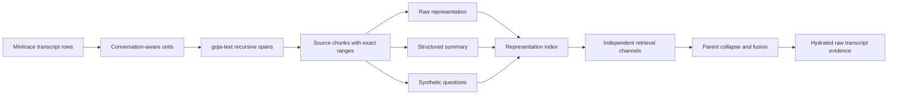

# Transcript RAG Summarization: Multi-Representation Retrieval and Local Structured Generation

This article documents the current redesign of the JavaScript transcript-RAG playground at `/home/manuel/code/wesen/2026-07-09--transcript-rag-sol2`. The central change is architectural: retrieval is no longer defined as “split a transcript into chunks and embed those chunks.” A source chunk is now an evidence object from which the system can derive several separately searchable representations: the raw source text, a structured summary, and synthetic questions. The system retains the source chunk as the citation target throughout the pipeline.

The article was written by GPT-5.6 - sol from the repository’s design documents, implementation diary, code, test fixtures, commit history, and a completed local Ollama smoke run. It is an original technical analysis of the implemented system and its remaining work.

> [!summary]
> - The playground preserves source ranges first, then creates raw, summary, and question representations with stable parent links.
> - A local Geppetto agent using Ollama `qwen3:4b` now produces validated structured summaries and synthetic questions, stored in a content-addressed cache.
> - The completed checkpoint proves chunking, generation, cache invalidation, and local end-to-end execution. Persistent multi-representation Bleve indexing and controlled retrieval evaluation are the next implementation phase.

## Why chunk-only retrieval is insufficient

Agent transcripts contain several kinds of information in the same passage: requirements, design decisions, code locations, tool failures, commands, results, and unresolved questions. A raw chunk is necessary because it contains the original evidence. It is not always sufficient as the only retrieval text. A later query may use terms that do not occur in the source passage even when the passage contains the answer. For example, a passage can record that an index was changed from an in-memory mapping to persistent Scorch storage without using the query terms that a future developer chooses.

The baseline transcript-RAG playground addressed the mechanics of transcript ingestion, conversation-aware units, chunking, embedding identity, persistent generations, lexical search, vector search, and reciprocal-rank fusion. Its index schema still assumed that one source chunk implied one indexed document. That assumption prevents the system from measuring whether a summary or a user-shaped question improves retrieval for a particular query class.

The new design introduces an explicit representation stage. A source chunk remains immutable evidence. Generated text becomes a retrieval aid whose provenance is recorded and whose result is never presented as a quotation from the transcript.



This ordering is important. The system creates source identity before any model call. A generation failure can therefore be associated with one exact source chunk. A retrieval hit from a synthetic question can be traced back to one exact transcript range. The generated text does not replace the source text at any stage.

## The source chunk is the evidence boundary

The implementation uses `require("chunking")` from goja-text `v0.1.2`. The adapter in `ttmp/2026/07/10/TRANSCRIPT-RAG-SUMMARIZATION--multi-representation-transcript-rag-with-summaries/scripts/playground/verbs/lib/rag.js` calls recursive chunking over conversation-aware units. It records rune and byte ranges returned by the provider and validates that each chunk is an exact slice of its parent unit.

The chunker is not merely a convenience for controlling input length. It establishes the evidence boundary that every later object must retain. A source chunk contains a stable key, a parent unit key, session and ordinal information, byte and rune ranges, the exact text, and a content hash. The hash identifies the text that was actually sent to the summarizer and embedder.

The conceptual construction is:

```text
unit = group transcript turns into one user turn or one assistant run
spans = chunking.recursive(unit.content, configured limits)

for each span:
    assert unit.content[span rune range] == span.text
    sourceChunk = {
        key: stableKey(unit.key, span.ordinal),
        parentUnitKey: unit.key,
        byteRange: [span.StartByte, span.EndByte],
        runeRange: [span.StartRune, span.EndRune],
        text: span.text,
        textHash: sha256(span.text)
    }
```

The local contract suite verifies this invariant with Unicode-bearing fixture content. This matters because JavaScript slicing uses UTF-16 code units, while the chunking API reports rune and byte ranges. The test code uses `Array.from` when checking rune offsets, and it independently verifies byte positions. A system that retains a correct-looking substring but mislabels its byte range cannot provide reliable evidence citations.

## Representation records separate retrieval text from evidence

Each source chunk produces one or more `transcript-rag-representation/v2` records. The implemented kinds are `raw`, `summary`, and `question`.

| Representation kind | Text indexed later | Evidence flag | Purpose |
| --- | --- | --- | --- |
| `raw` | Exact source-chunk text | `true` | Preserves original terminology and provides a direct lexical/vector retrieval route. |
| `summary` | Deterministically rendered structured summary | `false` | Normalizes decisions, problems, actions, artifacts, and keywords into compact retrieval text. |
| `question` | One generated question per record | `false` | Adds likely user query language without multiplying a chunk’s score inside one channel. |

All three kinds retain `parentChunkKey`, `parentUnitKey`, citation data, a text hash, and generator provenance where applicable. This is deliberately different from concatenating raw text, summary text, and questions into one large embedding input. Concatenation makes it impossible to determine which representation caused a hit, hides the cost of extra generated text, and prevents controlled raw-only or summary-only experiments.

The generated-representation path is conceptually small:

```text
summary = summarizer.summarize(sourceChunk)

emit representation(kind="summary", text=renderSummary(summary))
for each question at ordinal n:
    emit representation(kind="question", ordinal=n, text=question)
```

The eventual persistent index will store one document per representation rather than one document per source chunk. Retrieval will then issue explicitly named channels such as `raw.lexical`, `raw.vector`, `summary.vector`, and `question.vector`, collapse duplicate representations by parent inside each channel, and fuse the channel results. This work is designed but not yet implemented in the persistent Bleve layer.

## Structured generation through Geppetto

The live summarizer is implemented in `scripts/playground/verbs/lib/rag.js` as `geppettoSummarizer`. It resolves a named inference profile with `gp.inferenceProfiles.resolve(profile)`, builds a Geppetto agent with those settings, and creates an independent session for each source chunk. Independent sessions are required because a summary of one chunk must not acquire conversational context from an earlier chunk.

The local profile lives in `scripts/playground/profiles.yaml`:

```yaml
ollama-summary-qwen3-4b:
  inference_settings:
    api:
      api_keys:
        openai-api-key: ollama
      base_urls:
        openai-base-url: http://127.0.0.1:11434/v1
      allow_http:
        openai: true
      allow_local_networks:
        openai: true
    chat:
      api_type: openai
      engine: qwen3:4b
      temperature: 0
      max_response_tokens: 1200
    client:
      timeout: 120
```

The explicit HTTP and loopback permissions matter. Local Ollama is an OpenAI-compatible HTTP service, but the profile system defaults to restrictive outbound URL policy. The profile documents that this experiment has intentionally authorized a loopback endpoint. It does not make that decision globally for every Geppetto user.

The system prompt requires one JSON object using `transcript-rag-summary/v1`:

```json
{
  "schema": "transcript-rag-summary/v1",
  "abstract": "A factual account of the passage.",
  "decisions": ["..."],
  "problems": ["..."],
  "actions": ["..."],
  "artifacts": ["..."],
  "questions": ["..."],
  "keywords": ["..."]
}
```

The schema is part of the system contract, not a presentation preference. It lets the application distinguish malformed model output from valid output with an empty category. It also permits deterministic rendering of the summary into index text and preserves the unrendered structured object for cache validation and diagnostics.

## Reasoning output is a transport concern, not source content

The first local Qwen3 run completed its OpenAI-compatible streaming request but failed at strict parsing with:

```text
SyntaxError: invalid character '<' looking for beginning of value at parse (native)
```

The model had emitted a leading `<think>…</think>` reasoning block before the JSON payload. The repair does not search arbitrary model text for the first brace. That would make malformed output appear valid and could silently discard relevant text. Instead, `parseStructuredSummaryResponse` applies two narrowly defined transformations before calling `JSON.parse`:

1. If the response begins with `<think>`, it requires a matching `</think>` and removes that complete leading block.
2. If the remaining payload is wrapped in one Markdown code fence, it removes that wrapper.

Anything else remains a parse error. Unterminated reasoning blocks and invalid summary schemas are explicit failures. The offline suite includes a regression case with both a reasoning block and a JSON fence.

```javascript
function parseStructuredSummaryResponse(text) {
  let payload = String(text || "").trim();
  if (payload.startsWith("<think>")) {
    const end = payload.indexOf("</think>");
    if (end < 0) throw new Error("unterminated <think> block");
    payload = payload.slice(end + "</think>".length).trim();
  }
  if (payload.startsWith("```")) {
    const firstNewline = payload.indexOf("\n");
    if (firstNewline < 0) throw new Error("incomplete Markdown fence");
    payload = payload.slice(firstNewline + 1).trim();
    if (payload.endsWith("```")) payload = payload.slice(0, -3).trim();
  }
  return JSON.parse(payload);
}
```

The important boundary is that reasoning text is neither a source representation nor a cached summary. The cache stores only a parsed and schema-validated summary object.

## Content-addressed caching defines reproducibility

Generation is slower and less deterministic than chunking. Re-running the entire transcript should not call the model again when the source text and generator configuration are unchanged. At the same time, a cache that keys only on source text is incorrect: it would reuse an old result after changing the model profile, prompt, output schema, or requested question count.

The cache key combines the source text hash with the complete generator identity:

```text
cacheKey = SHA-256({
  schema: "transcript-rag-representation-cache-key/v1",
  parentTextHash,
  representationKind: "structured-summary",
  generator: {
    profile,
    resolvedChatSettings,
    promptHash,
    outputSchema,
    questionCount,
    settingsFingerprint
  }
})
```

Cache files are sharded by digest prefix, written to a temporary file, and atomically renamed into place. On read, the code checks the cache schema, cache key, and summary schema. Invalid JSON, identity mismatches, and schema-invalid values are treated as invalid cache entries; the summarizer regenerates the result instead of reusing it.

This is a useful rule for any generated retrieval representation: cache valid semantic objects, not opaque transport text, and include every input that can change their meaning.

## The runnable experiment and its evidence

The playground exposes the live generator through:

```bash
cd /home/manuel/code/wesen/2026-07-09--transcript-rag-sol2/ttmp/2026/07/10/TRANSCRIPT-RAG-SUMMARIZATION--multi-representation-transcript-rag-with-summaries/scripts
./06-run-live-summary-smoke.sh
```

The script performs five operations:

1. Confirms that Ollama and `qwen3:4b` are available.
2. Runs `xgoja doctor` and rebuilds the host.
3. Runs `playground rag summarize` over a one-passage minitrace fixture.
4. Asserts that the first result has one source chunk, five representations, one cache miss, one cache write, one summary, and three questions.
5. Runs the same command again and asserts one cache hit with no model-driven write.

The completed live smoke returned `exit=0`. Its generated summary identified the fixture’s in-memory mapping failure, the decision to use persistent Scorch storage, the `bleve-rag.js` artifact, and the next semantic-retrieval smoke action. The second invocation reported one cache hit and zero writes. This is evidence that the full local path works: profile resolution, Geppetto agent construction, streamed Ollama execution, reasoning-block extraction, schema validation, representation creation, cache write, and cache read.

The implementation also exposed an integration requirement outside the transcript-RAG repository. The generated xgoja host compiles against local source replacements. Its Geppetto checkout was eight commits behind `origin/main` even after Geppetto `v0.13.5` had been released. The stale checkout lacked the sparse inference-profile normalizer and failed with `GoError: no openai settings` when the session builder ran. Fast-forwarding that checkout to `v0.13.5` corrected the host dependency. The goja-text replacement similarly had to move from a deleted development worktree to the released `v0.1.2` checkout.

## Validation layers

The project uses several validation layers because each layer proves a different property.

| Layer | What it proves | Current result |
| --- | --- | --- |
| `xgoja doctor` | The generated host resolves the required providers and local module replacements. | The host resolves released goja-text `v0.1.2`, Geppetto, go-minitrace, and goja-bleve. |
| Offline contract suite | Source ranges, representation shape, parser behavior, cache invalidation, and in-memory parent fusion are deterministic. | Ten checks pass. |
| Live one-passage smoke | The actual local model/profile path yields validated generated records and cache behavior. | Passed with Qwen3/Ollama. |
| Future persistent-index smoke | Separate representation documents, channel filters, persisted vector search, fusion, and hydration operate together. | Not implemented yet. |
| Future experiment matrix | Summary and question representations improve measurable retrieval outcomes enough to justify their cost. | Not run yet. |

The distinction between the last two rows matters. A valid summary is not evidence that summary embeddings improve retrieval. The system must still build a multi-representation index and run the controlled raw-only, summary-only, question-only, and fused comparisons against stable judgments.

## What remains before a retrieval conclusion is justified

The current persistent Bleve code is still a v1 chunk index. It indexes one document per source chunk and uses the old `rag.pipeline()` and rune-window contracts. The v2 representation pipeline is implemented in parallel and has not yet replaced that storage path. The next hard-cut task will change the mapping and generation manifest to store one document per representation with fields such as `representationKind`, `parentChunkKey`, `parentUnitKey`, source citation data, `textHash`, generator fingerprint, and embedding.

Once the mapping exists, each search channel must add an exact `representationKind` filter. That prevents a summary-only experiment from silently retrieving raw documents. The retrieval layer then needs to collapse multiple question documents for the same parent chunk within the question channel before applying reciprocal-rank fusion. Without this step, generating more questions would increase a chunk’s score merely by increasing document multiplicity.

The final hit must be hydrated from the raw source chunk. A summary or question can explain why a result matched, but it cannot become the cited evidence. The result should retain component diagnostics, for example:

```text
parent chunk: chunk:v2/...
fused score: 0.0325
components:
  raw.lexical: rank 4
  summary.vector: rank 1
  question.vector: rank 7
evidence:
  exact source chunk text and transcript citation
```

## Working rules for future changes

- Create and validate a source chunk before generating any derived text. Every later record must retain its parent key.
- Treat raw transcript text as evidence and generated text as a retrieval representation. Do not cite generated text as if it were source text.
- Include the full generation configuration in cache and generation identity. Model, profile, prompt, schema, and question count all change the result.
- Use a strict, provider-aware response boundary. Accept a documented wrapper only when the code can remove it precisely; otherwise fail validation.
- Keep offline tests deterministic and use a small live fixture to validate provider integration. Do not infer retrieval quality from one successful model call.
- Require channel-local parent collapse before cross-channel fusion. Representation multiplicity must not become an accidental ranking policy.

## Related notes and source material

- [[ARTICLE - Transcript RAG Playground - Conversation Units, Immutable Generations, and Embedding Identity]] describes the preceding JavaScript playground and its generation/embedding invariants.
- [[PROJ - goja-text - Source-Preserving Chunking for JavaScript RAG Pipelines]] documents the released chunking module used by this experiment.
- [[PROJECT REPORT - Transcript RAG Bleve - Hybrid Search, Empirical Findings, and the Corrected Architecture]] records an earlier persistent retrieval implementation and its empirical corrections.
- The active ticket is `/home/manuel/code/wesen/2026-07-09--transcript-rag-sol2/ttmp/2026/07/10/TRANSCRIPT-RAG-SUMMARIZATION--multi-representation-transcript-rag-with-summaries`.
- The source implementation is concentrated in `scripts/playground/verbs/lib/rag.js`, `scripts/playground/verbs/playground.js`, `scripts/playground/verbs/selftest.js`, `scripts/playground/profiles.yaml`, and `scripts/06-run-live-summary-smoke.sh`.
