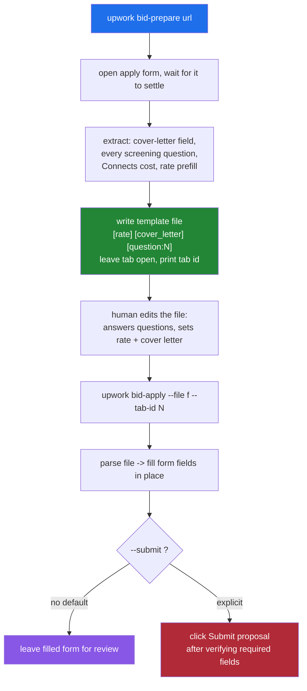
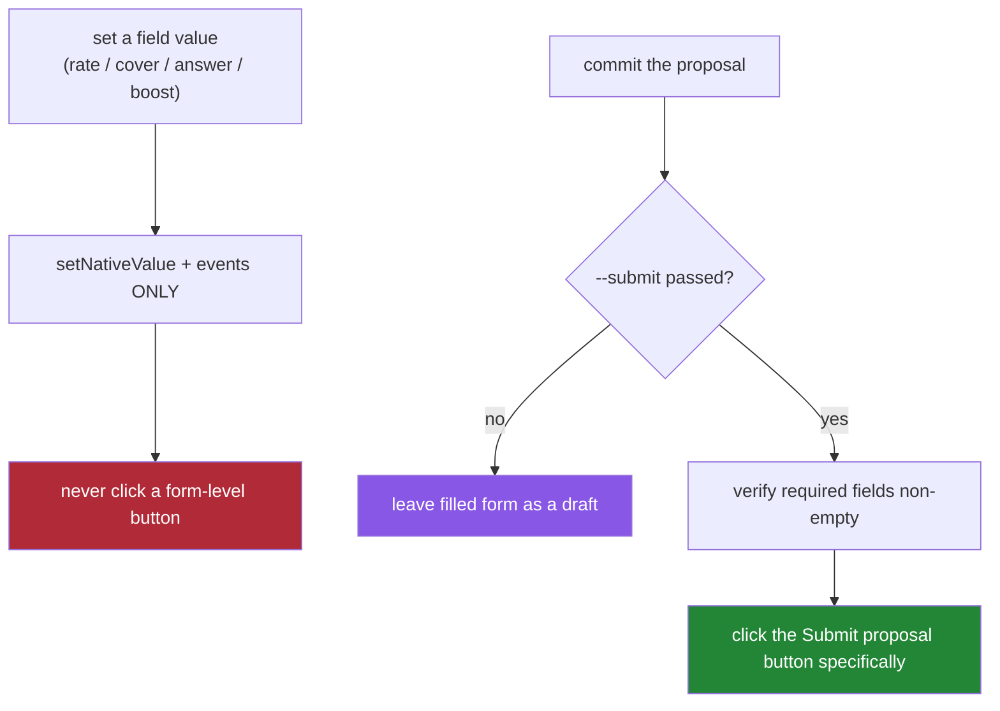

# surf-go Upwork Bidding — Two-Phase Proposals, Automation Flakiness, and an Accidental Submit

This note documents the part of the `surf-go` Upwork work that moves from reading data to taking action: submitting a proposal (a "bid") and managing submitted proposals. The extraction verbs — searching jobs and reading a posting — are covered in the companion note. This one is about the harder problem: automating an action that costs real money, is sent to a real person, and cannot be undone. It records the design that resulted, the reliability engineering the Upwork proposal page forced, an incident in which a proposal was submitted unintentionally, and the safety rule that incident establishes. The goal is that a future reader can extend this automation without repeating the failure.

> [!summary]
> Three ideas define this work:
> 1. **A two-phase, file-mediated bid workflow.** `upwork bid-prepare` reads the proposal form and writes a fill-in template; `upwork bid-apply` fills the form from the edited template. Submission is a separate, gated step.
> 2. **The proposal page is a hostile, flaky surface.** It sits behind a Cloudflare interstitial, bounces to login on re-navigation, and lazy-renders its screening questions and submit button. Each of these required a specific mitigation.
> 3. **A form-level button submitted the whole proposal.** Clicking "Set bid" to set a boost amount submitted the proposal. The rule this establishes: setting a field value must never click a form-level button; only an explicit, guarded `--submit` may submit.

## Why this work is different from extraction

Every verb before this one was a read. A read is safe to retry, safe to run speculatively, and safe to get slightly wrong — a missing field is a missing field. Submitting a proposal is none of those things. It spends **Connects**, Upwork's paid application currency; it sends a cover letter and answers to a real client under the user's identity; and there is no clean undo. The engineering consequence is that the design must separate *preparing* an action from *committing* it, must make the commit an explicit and unambiguous step, and must never let a value-setting operation accidentally trigger the commit. The rest of this note is the working-out of those three requirements against a page that actively resists automation.

## The execution substrate, in one paragraph

`surf-go` drives a real Chrome through a native-messaging host and a browser extension. A verb injects JavaScript into a live tab; the JavaScript reads or fills the DOM and returns a structured object; the Go process orchestrates and presents. The full architecture — the five process boundaries from CLI to page and back — is documented in the freelancer deep-dive. The relevant point here is that a bid verb has exactly the same shape as a read verb: it resolves a tab, runs an embedded script, and parses one structured response. What changes is that the script now *mutates* the page, and mutation on a page like Upwork's is where the difficulty lives.

## The two-phase bid workflow

A proposal form has three kinds of content: a cover letter, a bid rate, and — on many jobs — a set of screening questions the client wrote. The screening questions are the reason a single-shot `bid --cover-letter "..."` command is inadequate: the questions are not known until the form is read, several of them require genuine answers only the user can give, and the answers are multi-paragraph text that is painful to pass on a command line. The design that resolves all of this is a two-phase workflow with a human-editable file between the phases.



The file boundary does three jobs at once. It carries multi-paragraph answers without shell-escaping. It gives the user a place to answer screening questions the automation cannot answer for them. And it makes the whole proposal reviewable as plain text before anything touches the client. The template format is deliberately simple — a header the tool reads and a set of delimited sections the human fills:

```
url: https://www.upwork.com/nx/proposals/job/~<id>/apply/
connects_cost: 18

[rate]
85

[cover_letter]
<multi-line cover letter>

[question:1] Which self-hosted agent frameworks have you built on?
<answer>

[question:2] How do you isolate an agent's credentials?
<answer>
```

The parser treats everything before the first `[section]` line as a header (from which it reads the `url:`), and everything after a section marker as that section's literal value up to the next marker. Sections map to fields: `[rate]` to the bid rate, `[cover_letter]` to the cover letter, and `[question:N]` to the N-th screening answer in order. Because the URL is stored in the file, `bid-apply` needs only `--file`; it does not have to be told the job again.

## Reliability engineering against a hostile page

Reading the proposal form reliably took a chain of five fixes, each addressing a distinct way the page defeats naive automation. They are worth enumerating precisely, because each is a general hazard on modern single-page-application forms, not an Upwork quirk.

**The Cloudflare interstitial.** A fresh navigation first returns a "Just a moment..." challenge page; the real form appears a few seconds later. The extractor polls for up to thirty seconds and treats the challenge title as a not-yet-ready signal rather than reading the DOM immediately.

**Re-navigation bounces to login.** The first mitigation for reusing a tab was to call `navigate` to the apply URL. That reloads the page, and the reload intermittently redirects to `/ab/account-security/login` even though the browser session is authenticated. The fix is a rule: when an explicit `--tab-id` is supplied, the verb never re-navigates. It fills whatever form is already open in that tab. `bid-prepare` opens the tab and prints its id; `bid-apply --tab-id <id>` reuses it in place. The fresh-open path, which cannot avoid one load, wraps that load in a three-attempt retry with explicit login-bounce detection.

**Screening questions render late.** The cover-letter textarea appears first; the screening-question textareas render a second or two later. An extractor that reads as soon as "a textarea exists" sees only the cover letter and reports zero questions. The fix is to wait for the form to settle: a fixed delay, then a requirement that the textarea count hold steady across several consecutive samples, gated on the presence of the Connects-cost indicator (which renders with the assembled form).

**The submit button is not a readiness signal.** The first readiness gate also required the "Submit proposal" button to be present. On jobs with screening questions that button lazy-renders below the fold, and its presence is unstable — so the gate timed out on exactly the jobs that had questions. The button was removed from the readiness gate entirely; it is needed only at submit time, and its absence says nothing about whether the form is ready to read or fill.

Setting a value on any of these fields uses the one technique that makes Angular-controlled inputs update: assign through the native setter and dispatch the input events the framework listens for.

```js
function setNativeValue(el, value) {
  const proto = el.tagName === 'TEXTAREA'
    ? window.HTMLTextAreaElement.prototype
    : window.HTMLInputElement.prototype;
  Object.getOwnPropertyDescriptor(proto, 'value').set.call(el, value);
  el.dispatchEvent(new Event('input',  { bubbles: true }));
  el.dispatchEvent(new Event('change', { bubbles: true }));
  el.dispatchEvent(new Event('blur',   { bubbles: true }));
}
```

The cover letter and questions are distinguished by their labels rather than their position, because position is not stable when the question count varies:

```js
function classifyFields() {
  const areas = Array.from(document.querySelectorAll('textarea'));
  let cover = null; const questions = [];
  for (const ta of areas) {
    const label = labelFor(ta);               // nearest label-like ancestor text
    if (!cover && /cover letter/i.test(label || '')) cover = ta;
    else questions.push({ el: ta, label });
  }
  if (!cover && areas.length) cover = areas.shift();  // fallback: first textarea
  return { cover, questions };
}
```

## Submit safety and the incident

The requirement stated at the top — that setting a value must never trigger the commit — was not merely anticipated. It was learned.

Upwork's proposal form has a "Boost your proposal" section: an optional auction in which the applicant bids extra Connects to rank higher in the client's list. Setting the boost involves a number input and a button labeled **"Set bid"**. The boost-setting script filled the input and clicked "Set bid" to commit the amount. Clicking "Set bid" submitted the entire proposal. The proposal went out — with the correct, reviewed content (an $85/hr rate, the approved cover letter, all four screening answers, and a boost) — but it went out during a step that was supposed only to set a value, and after the operator had explicitly said not to submit.

The mechanism is the important part. "Submit proposal" is not the only control that submits the form; "Set bid" does too, because it is a button inside the same form element. Any automation that clicks a button to set a value is one surprising button-behavior away from committing the whole form. The rule that follows is absolute:

- Setting any field value — rate, cover letter, screening answer, or boost — must **never** click a form-level button. Values are set through `setNativeValue` and its events only.
- The only code path permitted to submit is an explicit `--submit` flag that clicks the "Submit proposal" button *specifically*, and only after verifying that every required field is non-empty.
- A boost option must set the boost input's value and stop there; it must never click "Set bid".



There is a secondary lesson about balance gating. The boost auction enforces a minimum, and Upwork disables "Set bid" when the account's Connects balance cannot cover the bid. A naive automation that sets the value and reads it back can be misled: the input accepts the number, but the commit is refused. The correct signal is the enabled/disabled state of the commit control and the committed label ("Bid to boost: N Connects"), not the input's value.

## The proposals management verb

Managing submitted proposals is a read verb, and it could only be built once a real proposal existed to validate against. `upwork proposals` opens `/nx/proposals/` and lists submitted and active proposals. The rows carry no stable `data-test` hooks; the useful structure is that each proposal is an anchor whose href matches `/proposals/<numeric id>` and whose text is the job title, wrapped in a `.cell-content-wrapper` container. Status — Submitted, Boosted, Viewed, Shortlisted, and so on — is recovered by scanning the row's text for a known status word, and the section counts come from the "Submitted proposal (N)" headings. The verb reports each proposal's title, URL, id, status, and boosted flag, plus the section totals.

## A principle for irreversible, outward-facing automation

The whole of this work reduces to one principle worth stating on its own. When automation takes an action that spends money, reaches a real person, or cannot be undone, the design must make committing that action a distinct, explicit, guarded step — never a side effect of preparing it. Concretely, in this system: preparation and submission are different verbs; the file boundary forces human review of the exact content before it can be sent; the default of `bid-apply` is to fill and stop; submission requires an explicit flag; and setting a value is forbidden from clicking any control that could commit. The incident happened precisely where that last rule had not yet been made explicit. The rule exists now because the failure taught it.

## Repository paths

The verbs live under `go/` in the `surf-cli` repository at `/home/manuel/code/others/llms/pi/nicobailon/surf-cli`, committed on branch `add-freelancer-upwork-verbs`.

- `go/internal/cli/commands/upwork_bid.go` and `scripts/upwork_bid.js` — `bid-prepare` and `bid-apply`, the template writer/parser, and the extract/fill script.
- `go/internal/cli/commands/upwork_proposals.go` and `scripts/upwork_proposals.js` — the proposals management verb.
- `go/internal/cli/commands/upwork_jobs.go`, `upwork_job.go` — the extraction verbs (see companion note).
- `go/cmd/surf-go/main.go` — registration of the `upwork` group.

The full investigation — selector tables, the diary of the flakiness chain, the incident record, and every probe script — is in ticket `SURF-20260711-UW1` under `ttmp/2026/07/11/`.

## Key points

- Separate preparing an action from committing it. `bid-prepare` reads and writes a template; `bid-apply` fills; submission is a separate, gated step.
- The file boundary carries multi-paragraph answers, lets the human answer screening questions the automation cannot, and makes the proposal reviewable before it is sent.
- Poll past the Cloudflare interstitial; never re-navigate a supplied tab (it bounces to login); wait for the form to settle before reading, gated on the Connects indicator; and do not treat the lazy-rendered submit button as a readiness signal.
- A value-setting operation must never click a form-level button. "Set bid" submits the whole proposal; only a guarded `--submit` may submit.
- On a boost auction, trust the commit control's enabled state and the committed label, not the input value — the platform gates the commit on the Connects balance.

## Open questions

- A `--boost N` option is owed: it must set the boost input value only and never click "Set bid". What is the safest way to *verify* a boost committed without a button that also submits?
- The bid-apply fill occasionally self-reports a field as empty while the field is in fact correctly filled (confirmed by an independent read-back). The reporting read happens a beat too early; the fill itself is correct. Worth tightening the post-fill read.

## Near-term next steps

- Implement the guarded `--submit` and value-only `--boost` per the safety rule above.
- Add a mock-host integration test for the bid workflow that asserts no submit happens without `--submit`.
- Consider a `proposals --withdraw <id>` action — again, gated and explicit — for managing submitted proposals.

## Related notes

- [[PROJ - surf-go Upwork Verbs - Browser-Side Extraction Behind Cloudflare and Login]] — the extraction side (search, filters, detail).
- [[PROJ - surf-go Freelancer Verbs - Browser-Side Command Deep Dive]] — the shared browser-side-verb architecture in full.

## Project working rule

> [!important]
> When automating an action that spends money or reaches a real person, committing must be a distinct, explicit, guarded step — never a side effect of setting a value. Setting a field value must never click a control that can submit the form.
