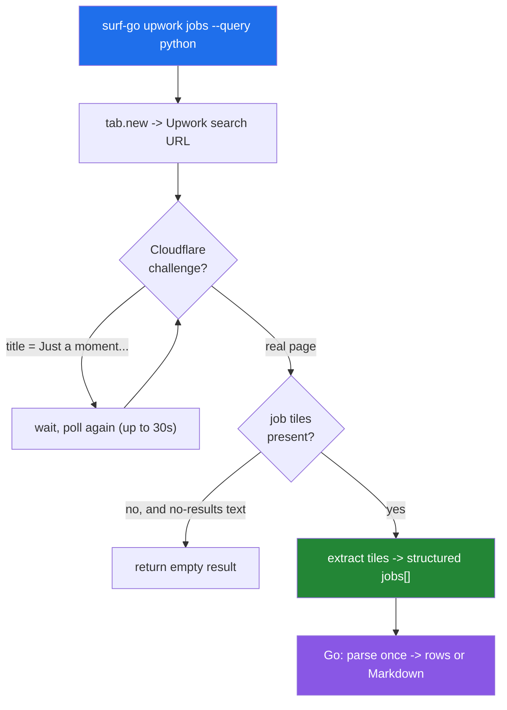

# surf-go Upwork Verbs — Browser-Side Extraction Behind Cloudflare and Login

This note explains two `surf-go` verbs that read Upwork job data from a live browser, and it uses them to isolate the two problems Upwork adds that freelancer.com did not: a Cloudflare interstitial that delays the real page, and content that changes depending on whether the browser session is signed in. The verbs share the browser-side-verb skeleton documented in the companion freelancer note; the value here is the delta — what changed, why, and which extracted fields are trustworthy versus best-effort.

> [!summary]
> This project added two verbs to `surf-go`, in a new `upwork` command group:
> 1. `upwork jobs` — search the job board and extract job tiles (robust, clean attribute selectors).
> 2. `upwork job <url>` — open one posting and extract title, description, client statistics, and a best-effort budget.
> The durable lessons are Upwork-specific: poll past the Cloudflare challenge, use whitespace-token attribute selectors because `data-test` values contain spaces, report the login state because it changes the data, and omit a field rather than return a guessed value.

## Why this project exists

`surf-go` drives a real Chrome or Chromium browser from the command line through a native-messaging host and a browser extension. A browser-side verb injects JavaScript into a live tab; the JavaScript reads the DOM and returns a structured object; the Go process turns that object into a Markdown report or structured rows. The freelancer.com verbs established this pattern. Upwork is the next target, and it is a more demanding one because its pages are protected by Cloudflare and gated by authentication. This makes it a good case for studying how a browser-side verb behaves when the page does not render immediately and does not render the same content for every visitor.

## What Upwork adds over freelancer.com

Two properties distinguish Upwork, and both change the extractor design.

The first is a **Cloudflare interstitial**. The initial response to a fresh navigation is a challenge page whose title is "Just a moment..."; the real page replaces it a few seconds later. A verb that reads the DOM immediately after navigation reads the challenge page and finds no job tiles. The correct response is to poll: wait for job tiles to appear, or for an explicit no-results state, and treat the challenge title as a not-yet-ready signal rather than an error.

The second is **login-gated content**. Upwork requires a session. The public, signed-out view still renders job tiles with most fields, but a signed-in session adds proposal counts and payment-verified markers on the listing, and skills on the detail page. The verbs run against the user's real signed-in browser through the extension socket, so in practice they see the richer view and pass Cloudflare transparently on an established session. The extractor still reports a `loggedIn` field so the caller knows which view produced the data.



## The listing verb: `upwork jobs`

The listing verb is the robust, fully validated deliverable. Its URL is query-string based, unlike freelancer.com's path-based scheme:

```
https://www.upwork.com/nx/search/jobs/?q=<query>&page=<n>&sort=<order>
```

The tile container is `article.job-tile`, equivalently `article[data-test="JobTile"]`. Each tile exposes clean `data-test` attributes, and the extractor reads them directly.

| Field | Selector | Example |
|-------|----------|---------|
| title + link | `a[data-test~="job-tile-title-link"]` | href `/jobs/<slug>_~<id>/?referrer_url_path=…` |
| description | `[data-test~="JobDescription"]` | first paragraphs of the posting |
| job type + rate | `[data-test="job-type-label"]` | `Hourly: $25.00 - $50.00`, `Fixed price` |
| experience | `[data-test="experience-level"]` | `Intermediate` |
| duration | `[data-test="duration-label"]` | `Est. time: 1 to 3 months, Less than 30 hrs/week` |
| posted | `[data-test="job-pubilshed-date"]` | `Posted yesterday` |
| proposals | `[data-test="proposals-tier"]` | `20 to 50` (signed in only) |
| skills | `[data-test~="token"]` | `Python`, `Django`, … |

Three parsing details are worth stating precisely, because each was a defect waiting to happen.

The **`data-test` values contain spaces**. Several markers are multi-token, such as `data-test="job-tile-title-link UpLink"` and `data-test="UpCLineClamp JobDescription"`. A single-value CSS selector such as `[data-test="JobDescription"]` matches the entire attribute string and therefore matches nothing. The whitespace-token selector `[data-test~="JobDescription"]` matches when the attribute contains that token among others, which is the correct behavior here.

The **`job-pubilshed-date` marker is a genuine misspelling** in Upwork's markup. The selector keeps the typo, because the attribute is what it is.

The **published-date node sometimes wraps the proposals tier**, producing text like `Posted yesterday · Proposals: 20 to 50`. The extractor splits on the bullet and keeps only the date, then reads the proposal count separately from `[data-test="proposals-tier"]`. Without the split, the posted date would carry a proposal fragment.

The title href is site-relative and carries a `?referrer_url_path=…` query. The extractor strips the query and resolves the path against `location.origin` to produce the canonical posting URL, and it pulls the job id from the `~<id>` segment of the path.

### Server-honored search filters

Upwork's search page honors several filter parameters server-side, which means the verb does not have to fetch everything and filter in Go — it can push the filter into the URL and let Upwork return a smaller, correct result set. Each parameter was confirmed by navigating to the parameterized URL and checking that every returned tile matched the filter. The verb exposes friendly flags that map to the confirmed parameters.

| Flag | Upwork param | Confirmation |
|------|--------------|-------------|
| `--job-type hourly` / `fixed` / `both` | `t=0` / `t=1` / `t=0,1` | `t=0` returned 10/10 hourly tiles; `t=1` returned 10/10 fixed |
| `--experience entry,intermediate,expert` | `contractor_tier=1,2,3` | `contractor_tier=3` returned 10/10 expert tiles |
| `--min-rate` / `--max-rate` | `hourly_rate=min-max` | `hourly_rate=30-` returned tiles whose max rate is ≥ 30 |
| `--min-budget` / `--max-budget` | `amount=min-max` | accepted for fixed-price searches |

The rate and budget filters use range-overlap semantics: a job matches when its rate or budget range overlaps the requested interval, not when its lower bound clears the minimum. The filters compose — `?q=python&t=0&contractor_tier=3&hourly_rate=40-` returned ten tiles that were simultaneously hourly, expert, and priced at forty dollars an hour or above.

The URL builder validates the friendly values before any browser work begins. An invalid `--job-type weekly` or `--experience guru` returns an error immediately, rather than constructing a malformed URL and discovering the problem after opening a tab. Category filtering exists on Upwork but keys on numeric category identifiers rather than names, so it is not exposed as a friendly flag.

```
surf-go upwork jobs --query python --job-type hourly --experience expert --min-rate 40
surf-go upwork jobs --query "web scraping" --job-type fixed --min-budget 1000 --max-budget 5000
```

## The detail verb: `upwork job <url>`

The detail verb takes a posting URL as a positional argument and returns a single row. The detail page is where login-gating bites hardest: the public view exposes only two useful `data-test` markers, `Description` and `about-client-container`. The verb therefore mixes stable attribute reads with deliberate text parsing, and it records which fields are trustworthy.

| Field | Source | Robustness |
|-------|--------|------------|
| title | `document.title` minus trailing ` - <category>` | stable |
| description | `[data-test="Description"]` (strip leading "Summary") | stable |
| client stats | parse `[data-test="about-client-container"]` text with anchored regexes | stable |
| job type + budget | body-text regex (`$X - $Y Hourly`, `Fixed-price … $Z`) | best-effort |
| experience level | body-text regex (`Entry` / `Intermediate` / `Expert`) | best-effort |
| skills | absent in the public view | login-gated, omitted |

The client statistics parse cleanly from the panel's text with anchored patterns rather than positional selectors, which are not stable on this Angular page:

```js
function extractClient() {
  const node = document.querySelector('[data-test="about-client-container"]');
  if (!node) return null;
  const t = normalizeText(node.textContent || '');
  const grab = (re) => { const m = t.match(re); return m ? normalizeText(m[1]) : null; };
  return {
    paymentVerified: /payment method verified/i.test(t),
    rating:      grab(/Rating is ([\d.]+) out of/i),
    totalSpent:  grab(/\$([\d.,]+[KM]?) total spent/i),
    hireRate:    grab(/(\d+)% hire rate/i),
    jobsPosted:  grab(/(\d+) jobs? posted/i),
  };
}
```

Two design decisions here are worth generalizing. The budget and experience level are read from page text because Upwork does not mark them with stable attributes on the public detail page; the verb labels these as best-effort and they validated correctly live, but they may drift if the copy changes. The skills are **omitted entirely** rather than extracted with a fragile heuristic, because the skills section is login-gated and its container was not reliably present. A field that is sometimes wrong is worse than an absent field: a caller can handle a missing value, but a silently incorrect one propagates.

## The shared skeleton, unchanged

Everything else follows the browser-side-verb pattern already documented for the freelancer verbs. Both Upwork verbs are dual-mode Glazed commands: they implement `RunIntoWriter` for Markdown and `RunIntoGlazeProcessor` for rows, register with `buildDualModeCommand`, and toggle to rows with `--with-glaze-output`. Both use the owned-tab strategy — create a tab with `tab.new` when the user supplies no target, run the extractor against it, and close it by default unless `--keep-tab-open` is set. Both prepend a `SURF_OPTIONS` JSON literal to the embedded script so runtime options cross the Go-to-JavaScript boundary, and both decode the host response exactly once before fanning out into rows or Markdown.

One small but instructive difference appears in URL validation. `normalizeUpworkJobURL` must accept a listing href verbatim and reject the search URL, and both contain the substring `/jobs/`. The search URL is `/nx/search/jobs/`, and a listing href carries a `?referrer_url_path=/nx/search/jobs/` query. The validator therefore strips the query string first, then rejects any path containing `/search/`. Validating before stripping the query rejected valid listing hrefs, because their referrer value contains `/search/`; stripping first fixes it. This is the kind of ordering bug that only a table of URL cases in a unit test surfaces reliably.

## Testing at three layers

The verbs are validated at the same three layers as the freelancer verbs. Unit tests exercise the pure functions with no browser: the query-string URL builder, the `SURF_OPTIONS` prelude, row shaping including flattening the skills list and the nested client object into columns, Markdown rendering, and the URL normalizer with its rejection cases. Mock-host integration tests open a real Unix socket and assert the exact tool sequence — `tab.new`, a `js` readiness probe, a `js` extraction call carrying the expected prelude, and a `tab.close` with the correct id. Real-browser validation ran the exact embedded script bodies against live Upwork through Playwright; the listing returned clean job objects with proposals, rates, and skills, and the detail page returned title, budget, description, and complete client statistics.

## Repository paths

The verbs live under `go/` in the `surf-cli` repository at `/home/manuel/code/others/llms/pi/nicobailon/surf-cli`.

- `go/internal/cli/commands/upwork_jobs.go` and `scripts/upwork_jobs.js`
- `go/internal/cli/commands/upwork_job.go` and `scripts/upwork_job.js`
- `go/cmd/surf-go/main.go` — registration of the `upwork` group and its two subcommands
- `go/cmd/surf-go/integration_test.go` — mock-host tests for both verbs
- `go/pkg/doc/tutorials/01-building-browser-side-verbs.md` — the canonical browser-side-verb tutorial

The full page analysis, selector tables, and diary are in ticket `SURF-20260711-UW1` under `ttmp/2026/07/11/`. The freelancer verbs and the deep-dive guide to the shared pattern are in ticket `SURF-20260706-FL1`.

## Key points

- Poll past the Cloudflare challenge. The first response is an interstitial; wait for job tiles or a no-results state, and treat the challenge title as not-ready.
- Report the login state. Upwork renders more to a signed-in session, so the extractor records `loggedIn` to tell the caller which view produced the data.
- Use whitespace-token attribute selectors. Upwork's `data-test` values contain spaces, so `[data-test~="token"]` is required where `[data-test="token"]` would fail.
- Keep the site's typos. The `job-pubilshed-date` marker is misspelled in the markup; the selector matches it as written.
- Omit a field you cannot extract reliably. The detail verb drops skills rather than guess, and labels budget and experience as best-effort.

## Open questions

- The detail page's budget and experience are text-parsed. Would a signed-in session expose stable attributes for them that the public view hides?
- Category filtering keys on numeric category identifiers rather than names. Is there a stable name-to-id mapping worth embedding so a `--category` flag could accept human names?

## Near-term next steps

- Consider a watch wrapper over the listing fetch that polls and diffs by job id for new postings.
- Exercise the verbs against a live extension socket, not only Playwright, once a session is available.

## Resolved

- **Server-honored search filters** (2026-07-11): confirmed `t`, `contractor_tier`, `hourly_rate`, and `amount` are honored, and wired them to `--job-type`, `--experience`, `--min-rate`/`--max-rate`, and `--min-budget`/`--max-budget` on `upwork jobs`.

## Related notes

- [[PROJ - surf-go Freelancer Verbs - Browser-Side Command Deep Dive]] — the companion note that documents the shared browser-side-verb pattern in full.

## Project working rule

> [!important]
> Prove every selector against the live page before writing the Go wrapper, and when a page renders differently for signed-in and signed-out visitors, record which state produced the data.
