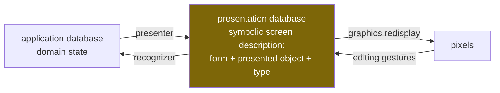

# Presentation-Based UIs — Porting the CLIM Interaction Model to React

This article explains how a presentation-based user interface works and how to implement one on a modern React stack, at the level of actual data structures, state machines, and code. It is written from a working implementation (the `@pbui` packages in `/home/manuel/code/wesen/2026-07-12--clim-jsx`), and every code excerpt below is real code from that repository, trimmed only for length. The subject is the pattern, not the project: which parts of the 1984 design survive unchanged, which parts a modern framework gives you for free, which parts must be rebuilt explicitly, and which parts the modern environment forces you to add. A companion project note, [[PROJ - PBUI - Presentation-Based UIs in TypeScript and React]], covers the repository itself.

> [!summary]
> 1. A presentation-based UI keeps a symbolic, queryable record of *what is on screen and which domain object each thing presents*. Input is interpreted against that record, so every rendered object is simultaneously output and a potential input.
> 2. React replaces exactly one component of the 1984 model — incremental redisplay — and none of the others. The presentation database, the type lattice, the command loop, and the recognizer must be built explicitly, because the virtual DOM records *how to draw*, not *what is meant*.
> 3. The whole engine is small: a registry (~150 lines), an interaction engine with the accept-loop state machine (~700 lines), a typed command builder (~280 lines), and one React hook (~180 lines). Everything the user sees during a command — highlighting, menus, prompts, the documentation line — derives from one piece of state.
> 4. Modern constraints add three things the original never needed: an explicit render-cost model (hover-frequency vs. accept-frequency invalidation), participation modes that relax the input context's modality, and a keyboard/accessibility path that reuses the pointer documentation line as a screen-reader live region.

## Why this note exists

The presentation-based interaction model solves a problem that modern UI frameworks still leave to convention: connecting what the user sees to what the program knows. In a conventional React application, a table cell showing a customer's name is a string in a DOM node; any behavior — click to open, right-click for actions, drag to assign — is wired by hand, per call site, and each wiring knows nothing about the others. The result is familiar: the same customer is clickable here, dead text there, and differently-behaved in a third place.

Eugene Ciccarelli's MIT thesis (*Presentation Based User Interfaces*, AITR-794, 1984) and its descendants — Symbolics Genera's Dynamic Windows and CLIM — invert the arrangement. Every rendered form records the domain object it presents and the type under which it presents it. Behavior then attaches to *types*, once: what a customer's context menu offers, what clicking a customer does, and whether a customer can answer a command's pending question are all consequences of "this pixel region presents a CUSTOMER," established at render time. This note records how to build that arrangement on React: the concrete data structures, the state machine, the render-integration mechanics, and the places where the port required judgment rather than translation.

## The original model, precisely

The thesis describes an interface as two databases and three processes.



The **presentation database** is the load-bearing element. It is symbolic — text strings, shapes, regions, not pixels — and every entry records its *presented domain object*. The **presenter** derives it from application state; the **recognizer** interprets the user's actions on presentations as application commands. Redisplay — diffing the presentation database against the screen — is a separate mechanical layer, which the thesis implements with per-record timestamps and dirty propagation: a 1984 virtual DOM.

CLIM added the machinery that makes the model practical for command-driven applications: presentation **types** forming a subtype lattice distinct from implementation classes; **commands** with typed parameters, where an unfilled parameter creates an **input context** in which exactly the type-matching presentations are sensitive; **translators** mapping gestures on types to commands, so the right-click menu is computed rather than wired; and **output records**, under which an object printed to the interactor three commands ago is still sensitive and can answer the question the current command is asking. The whole pattern is in that last clause: output and input are the same objects, mediated by the same record store.

## Core mental model for the modern port

The single most important decision in the port is recognizing what React's virtual DOM is and is not. It is a superb implementation of the thesis's *graphics redisplay* layer: it diffs a declarative description against the screen and applies minimal updates. It is not a presentation database, because it records elements and props — how to draw — and is deliberately opaque to queries like "which regions currently present order #1012?" The semantic layer must be rebuilt as an explicit store. Everything else follows from that.

| 1984 / CLIM concept | Modern counterpart | Built or free? |
|---|---|---|
| graphics redisplay (timestamps, dirty subtrees) | React reconciliation | free — do not rebuild |
| presentation database | explicit registry of records with by-ref / by-type / by-point indexes | built |
| presented-object link | `ObjectRef {kind, id}` + application-supplied `Resolver` | built |
| presentation type, `present`/`accept` methods | ptype record: lattice edges + `print`/`parse` codec + `describe` + default command | built |
| presenter (domain collector / semantic / organizational) | selector over the store / the component's render / layout components | free (it *is* React code) |
| recognizer (gesture → command) | one gesture router + command table + accept-loop state machine | built |
| translators | derived menus, per-type default commands, type coercions | built |
| output records | transcript lines as typed part arrays; object parts mount real presentations | built |
| pointer documentation line | pure derivation of (input context, hover) — also the screen-reader live region | built |
| command applications (invocations with state) | invocation log; the substrate for undo and auditable history | built |

Two consequences deserve emphasis. First, the presenter needs no framework: writing a PBUI presenter *is* writing a React component, provided the component registers what it presents — the library's entire render-side API is one hook. Second, the recognizer shrinks relative to the thesis, which parsed free-form *editing actions* (sketched curves, textual annotations, spatial arrangements). The CLIM subset — gestures on typed presentations plus a typed command line — covers command-driven applications and is what this port implements.

## The data structures

Four types carry the entire system. They are worth reading before any of the machinery, because every later mechanism is a function over them.

```ts
// how presentations refer to domain objects — never by holding them
type ObjectRef =
  | { kind: string; id: string }          // entities: {kind:"order", id:"o-3"}
  | { kind: "value"; value: unknown };    // immediates: numbers, enum choices

interface Resolver {
  resolve(ref: ObjectRef): unknown | undefined;   // undefined = object is gone
}

// one registry entry — the unit of the presentation database
interface PresentationRecord {
  id: PresId;                // registry-assigned, stable for the mount
  type: string;              // ptype name
  ref: ObjectRef;
  label: string;             // used in echoes, menus, the doc line
  paneId?: string;
  mode?: "gated" | "active" | "fallthrough";  // participation during accepts
  bounds?: () => Rect | null;                 // lazy geometry for hit-testing
}

// a collected command argument, whether it came from a click, the
// keyboard parser, or a menu choice — uniform shape for echo and execution
interface ArgValue { type: string; ref: ObjectRef; label: string }
```

The decision embedded in `ObjectRef` is that **staleness is a defined state, not an accident**. Domain state changes underneath presentations — simulation ticks, deletions — so records store references and resolution happens at gesture and execution time. `undefined` from the resolver is an answer, and it is handled in exactly one place (Section "The typed command builder") rather than in every command body.

## The registry: the presentation database, and also the invalidation channel

The registry is a map of records plus three indexes and two subscription channels. The whole file is ~190 lines; these are the parts that do the work:

```ts
export class PresentationRegistry {
  private recs = new Map<PresId, PresentationRecord>();
  private byRefIdx = new Map<string, Set<PresId>>();   // refKey -> ids

  register(rec: Omit<PresentationRecord, "id">): PresId {
    const id = `p${nextId++}`;
    this.recs.set(id, { ...rec, id });
    this.indexRef(full);                     // byRefIdx[refKey(rec.ref)] += id
    this.emit({ kind: "register", rec: full });
    return id;
  }

  /** every presentation of the given object — cross-pane highlighting */
  byRef(ref: ObjectRef): PresentationRecord[] { /* O(k) via byRefIdx */ }

  /** smallest hit-testable presentation containing the point (canvas path) */
  at(x: number, y: number): PresentationRecord | undefined { /* area scan */ }

  /* per-presentation invalidation: hover-paced flag changes notify
   * exactly the affected presentations */
  notifyPres(id: PresId): void;                       // bump version, wake
  notifyAllPres(): void;                              // accept transitions
  subscribePres(id: PresId, fn: () => void): Unsubscribe;
}
```

The registry serves two masters. As the *presentation database* it answers semantic queries: `byRef` powers cross-view highlighting (hover an order number in a transcript and every other presentation of that order outlines itself), `byType` feeds keyboard cycling, `at(x, y)` supports renderers that have no DOM nodes. As the *invalidation channel* it carries per-record subscriptions, which is what makes the render-cost model of a later section possible. One store earning its existence twice is the strongest sign the port has the right shape.

## Registration: how a pixel region acquires meaning

Application code renders domain objects through a wrapper:

```tsx
<Presentation type="customer" object={{ kind: "customer", id: c.id }} label={c.name}>
  {c.name}
</Presentation>
```

The wrapper is sugar over a headless hook, and the hook is where the render integration actually happens. Its core, from `packages/react/src/use-presentation.ts`:

```ts
export function usePresentation(input: UsePresentationInput): PresentationHandle {
  const engine = useEngine();
  const elRef = useRef<Element | null>(null);
  const idRef = useRef<string | null>(null);
  const [, force] = useReducer((n: number) => n + 1, 0);

  useEffect(() => {
    if (disabled) return;
    const id = engine.registry.register({
      type, ref, label, paneId: pane, mode,
      bounds: () => {
        const el = elRef.current;
        if (!el) return null;
        const r = el.getBoundingClientRect();
        return { x: r.x, y: r.y, w: r.width, h: r.height };
      },
    });
    idRef.current = id;
    const unsub = engine.registry.subscribePres(id, force);  // MY id only
    force();                       // flags may differ now that the record exists
    return () => { unsub(); idRef.current = null; engine.registry.unregister(id); };
  }, [engine, type, key, label, pane, mode, disabled]);

  // flags computed per render, reading engine state directly
  const hovered  = id != null && st.hover?.id === id;
  const eligible = engine.eligible({ id: id ?? undefined, type, ref, label });
  const inert    = inContext && !quiet && mode === "gated";
  const passthru = inContext && mode === "fallthrough";
  ...
```

Four implementation details here repay attention:

- **Geometry is lazy.** `bounds` is a thunk over `getBoundingClientRect`, invoked only when hit-testing demands it. Registering a thousand presentations costs a thousand map inserts and zero layout reads.
- **The subscription is to the record's own id.** The hook does not subscribe to engine state; it subscribes to `subscribePres(id, force)`. Which renders happen is therefore decided by whoever calls `notifyPres` — the engine — not by React's diffing.
- **The subscribe-before-register chicken-and-egg** is resolved by doing both inside the same effect and calling `force()` once after registration, so the first paint (which rendered before the record existed) corrects its flags immediately. This is why the hook uses a `useReducer` force-update rather than `useSyncExternalStore`, whose subscribe function must exist before the id does.
- **Class names are the entire visual protocol.** The hook emits `pbui-hover`, `pbui-eligible`, `pbui-inert`, `pbui-passthru`, `pbui-related`, `pbui-kbd-target`; the theme package styles them. SVG needs ring rectangles instead of CSS outlines, so `<SvgPresentation>` draws them; a canvas renderer paints its own from the same flags.

The gesture props the hook returns route everything into one engine method — and the same protocol is bound twice, once for the mouse and once for the keyboard:

```ts
onMouseMove:   (e) => { e.stopPropagation(); engine.gesture("enter", rec(), e.clientX, e.clientY); }
onClick:       (e) => { e.stopPropagation(); engine.gesture("click", rec(), ...); }
onAuxClick:    (e) => { if (e.button === 1) engine.gesture("aux", rec()); }      // middle: describe
onContextMenu: (e) => { e.preventDefault(); engine.gesture("context", rec(), ...); }
onKeyDown:     Enter/Space -> "click"; m / Shift+F10 -> "context"; d -> "aux";
               Tab during accept -> engine.moveFocusEligible(±1); arrows -> engine.moveFocus(±1)
```

`stopPropagation` on mouse-move is what makes **nested presentations resolve innermost-first**: a tag chip inside an image card is its own presentation; hovering the chip documents the tag, hovering the card around it documents the image. The DOM's event routing replaces CLIM's output-record-tree hit testing at zero cost. Mouse-enter/leave events are deliberately not used: React's non-bubbling enter/leave semantics lose the parent's hover when the pointer leaves a nested child, which is the same reason the 1990s-style prototypes this library was extracted from routed hover through `mousemove`.

## The type lattice and the round-trip codec

A ptype declares its supertypes and both halves of a codec:

```ts
ptypes.define<Order>({
  name: "order",
  print: (o) => `#<ORDER #${o.number} ${o.status} ${fmtMoney(orderTotal(o))}>`,
  parse: (text, world) => {
    const t = text.trim().replace(/^#/, "");
    const o = world.store.get().orders.find((x) => String(x.number) === t);
    return o ? { ok: true, value: o, ref: orderRef(o), label: `#${o.number}` }
             : { ok: false, err: `${text} does not name an ORDER (try #1004)` };
  },
  describe: (o, world) => [ /* typed output parts, incl. live references */ ],
});
```

`print` is the presenter's textual form; `parse` is the keyboard path of `accept` — the user can always type the argument instead of clicking it, and prefix matching in `parse` is the recognizer tolerance the thesis calls for. The thesis's coherence invariant — input accepted by the recognizer, re-presented, lands where the user put it, with the recognizer accepting a superset of what the printer emits — stops being folklore here and becomes a property test: `parse(print(x))` must equal `x`, and tolerated variants must normalize.

Subtype matching is a stack walk over declared supertypes with `"any"` as the implicit top. Lateral movement between types goes through **coercions**, and the two mechanisms compose in one function that converts a presentation into the `ArgValue` a parameter wants:

```ts
// engine.ts — the funnel every pointing supply passes through
private coerceFor(spec: ArgSpec, pres: PresentationRecord): ArgValue | null {
  if (this.ptypes.subtypep(pres.type, spec.type)) {
    return { type: pres.type, ref: pres.ref, label: pres.label };
  }
  for (const c of this.coercions) {
    if (this.ptypes.subtypep(pres.type, c.from) &&
        this.ptypes.subtypep(c.to, spec.type)) {
      return c.coerce(pres);      // e.g. pin -> its snapped LOCATION
    }
  }
  return null;
}
```

Coercions are the modern residue of CLIM's object-producing translators. In the schematic-editor demo, a `pin` presentation coerces to a `location`, so a command accepting a LOCATION lights up the pins: clicking a pin supplies the pin's snapped coordinates, while clicking bare canvas supplies the pointer position.

## The accept loop, in code

Commands are data. The v1 runtime shape (the builder in the next section compiles down to it):

```ts
interface CommandSpec<W> {
  name: string;
  args?: ArgSpec[];          // {name, type, input?, distinct?, where?, validate?, default?, options?}
  appliesTo?: (pres, world, resolve?) => boolean;   // state-sensitive menus
  isDefaultFor?: string[];   // left-click default for these ptypes
  global?: boolean;          // background menu instead of object menus
  duringAccept?: boolean;    // may run without aborting a pending context
  run: (args: ArgValues, api: CommandApi<W>) => void | Promise<void>;
}
```

The engine holds one `AcceptState {cmd, values, spec}` — the input context — and the machine around it is four short methods. `advance` is the pivot:

```ts
// engine.ts:318 — find the next hole or execute
private advance(cmd: CommandSpec<W>, values: ArgValues): void {
  const specs = cmd.args ?? [];
  const next = specs.find((s) => !(s.name in values));
  if (!next) {
    this.setAccept(null);
    void this.execute(cmd, values);
    return;
  }
  this.setAccept({ cmd, values, spec: next });
  if ((next.input ?? "presentation") === "menu") this.openChoiceMenu(next, values);
}
```

`startCommand(cmd, seed?)` echoes `Command: <name>` to the transcript, pre-fills argument zero from the presentation that invoked the menu (the CLIM convention: the object you right-clicked supplies the first parameter), and calls `advance`. `supply(pres)` runs `coerceFor`, then the specification's `where`, `distinct`, and `validate` checks, echoes `  <arg> (a TYPE) ⇒ <label>`, and recurses into `advance`. `submitTyped(text)` does the same through the ptype's `parse`, taking the declared default on empty input. Escape or right-click aborts with `[Abort]`. Three supply paths, one state machine, one echo grammar:

```
[echo] **Command:** New Order
[echo]   customer (a CUSTOMER) ⇒ {customer Bo Lindqvist}
[echo]   product (a PRODUCT) ⇒ {product Diner Mug 12oz}
[echo]   qty (a NUMBER) ⇒ 1
[out ] Created {order #1013}: 1× {product Diner Mug 12oz} for {customer Bo Lindqvist} — $18.00, {order-status pending}.
```

That block is the output of the repository's canonical transcript serializer (`{type label}` marks a live presentation part), and it is pinned by golden-file tests: scripted engine interactions are rendered to text and compared byte-for-byte against checked-in files. The echo grammar is the observable specification of the command loop, and engine refactors are not allowed to move a character of it.

The property that makes the pattern cheap to keep consistent is that **everything the user sees during an accept is a derivation of `AcceptState`**, computed, never wired:

- **Sensitivity** — eligible iff `coerceFor` succeeds and `where`/`distinct`/`validate` pass, checked *before* the click, so the marching-ants highlight never advertises a supply that would be rejected. Cross-argument constraints cost one line because predicates see the already-collected values: `where: (tag, {image}) => image.tags.includes(tag.name)` lights up only the chosen image's own tags during *Untag Image*.
- **Menus** — a presentation's context menu is `applicableCommands(pres)`: commands whose first parameter the presentation can fill (through `coerceFor`) and whose `appliesTo` accepts the *resolved* object. A paid order's menu differs from a pending order's with no menu code anywhere.
- **The prompt line** — rendered from `engine.promptInfo()`: name, collected values, wanted type, default.
- **The documentation line** — the entire function is a readable case analysis and doubles as the accessibility narration (Section "Keyboard and assistive technology"):

```ts
// docline.ts — pure derivation; also what the screen reader hears
export function pointerDoc(engine: PbuiEngine<any>): string {
  const { accept, menu } = engine.getState();
  const hover = engine.getState().hover ?? engine.focusRecord();  // kbd focus counts
  if (menu) return "Choose an item — Mouse-L selects; [Escape] dismisses.";
  if (accept) {
    if (hover && engine.eligible(hover))
      return `⟨${accept.spec.name}⟩ of ${accept.cmd?.name} — L: use ${hover.label}   Esc: abort`;
    if (hover?.mode === "active") { /* "L: Switch To View (the pending New Order keeps waiting)" */ }
    if (hover) return `Accepting a ${WANTED} — ${hover.label} is not applicable here. [Escape] aborts.`;
    return `Accepting a ${WANTED} — Mouse-L on a highlighted presentation supplies it${kbd}. [Escape] aborts.`;
  }
  if (hover) return `${printed} — L: ${defaultCmd}; M: Describe; R: menu of ${n} commands.`;
  return engine.idleDoc;
}
```

## The typed command builder: resolve-then-run

The runtime shape above is honest but noisy to author against: `run` receives `ArgValue` refs, so bodies begin with resolution, staleness guards, and value unwrapping, and the callbacks take `world: unknown`. The production authoring API is a builder that compiles to the runtime shape while giving TypeScript the information the command already declares:

```ts
const c = commandBuilder(commands);
c.define({
  name: "Refund Order",
  args: {
    order:  arg.presentation<Order>("order"),
    reason: arg.text({ prompt: "the refund reason" }),
  },
  appliesTo: (order: Order) => order.status === "paid" || order.status === "fulfilled",
  run: ({ order, reason }, api) => {
    api.snapshotUndo(world.store);          // one-line undo opt-in
    // order: Order — resolved, never stale; reason: string — unwrapped
  },
});
```

Three mechanisms make this work:

```ts
// phantom type carrier on descriptors
interface ArgDesc<T> { ptype: string; kind: "presentation"|"text"|"number"|"choice";
                       opts: Record<string, unknown>; __t?: T }

// mapped type: the args object literal's shape becomes run's parameter type
type ResolvedArgs<A> = { [K in keyof A]: A[K] extends ArgDesc<infer T> ? T : never };

// compilation: wrap run with resolve-then-run
run: async (values, api) => {
  const r = resolveAll(descs, values, resolveRef);   // entities via Resolver,
  if (!r.ok) {                                       // immediates unwrapped
    api.fail(`${r.staleLabel} no longer exists — presentation was stale;`);
    return;                                          // user code never runs
  }
  await built.run(r.resolved as ResolvedArgs<A>, api);
}
```

The argument *object literal's key insertion order* defines the accept order, and the key doubles as the display name in prompts and echoes — which is what allows `ResolvedArgs<A>` to exist as a mapped type at all. `arg.number({min, max, integer, default})` compiles range checks into the runtime `validate`; `arg.choice<T>` compiles to a menu-valued argument whose options open at the last recorded pointer position. Behavioral equivalence with hand-written runtime specs is asserted by rendering both variants' transcripts and comparing bytes.

Migrating the largest demo (23 commands) removed every one of its 31 non-null assertions and 20 manual resolve calls with narrations byte-identical under the end-to-end suite. The honest limitation: descriptor callbacks type the *candidate* value (`where: (tag: Tag, ...)`) but the `soFar` parameter is loosely typed, because descriptors are constructed inside the object literal that defines the argument set — the type does not exist yet at that point. Authors annotate it (`soFar: {image?: Image}`); a curried definition API could close the gap.

## Output records: the transcript is a first-class surface

Transcript lines are arrays of typed parts, and the part vocabulary is deliberately tiny:

```ts
type OutputPart =
  | { t: "text"; s: string }
  | { t: "bold"; s: string }
  | { t: "err";  s: string }
  | { t: "pres"; type: string; ref: ObjectRef; label: string };  // stays live

api.print(orderPart(order), " connected to ", channelPart(channel), ".");
```

The listener's part renderer mounts a real presentation for `pres` parts — the same wrapper, the same hook, the same registration — so transcript mentions are ordinary registry records:

```tsx
// listener/parts.tsx
case "pres":
  return <Presentation type={part.type} object={part.ref} label={part.label}
                       pane="listener">{part.label}</Presentation>;
```

This produces the pattern's signature behavior with no additional machinery: an object printed minutes ago participates in eligibility when a later command needs its type (the eligible-set cache adds mid-context registrations incrementally, so even output printed *during* the accept becomes supplyable), and right-clicking a printed name offers its full menu. Because parts hold refs and resolve at render time, transcript mentions survive domain-state changes and degrade explicitly when the object is gone.

The implementation extends this to command history itself. Every execution records an invocation (`{id, name, argValues, status, undo?, seq, echoLineId}`); the listener looks up `invocations.byEchoLine(line.id)` and wraps matching echo lines in a *quiet* presentation of the invocation (quiet: menuable, but no hover flash over transcript text). Invocation refs resolve from the engine's own log before delegating to the application resolver, so applications get right-click-to-undo on past commands without touching their resolver. Undo itself is linear-only and opt-in — `api.snapshotUndo(store)` captures the previous state object of an immutably updated store (structural sharing makes the capture nearly free and the restore exact), and `api.undoable(capture)` registers an explicit inverse for effects that are not "restore the world."

## What the modern environment forced us to add

### A render-cost model

A naive port lets every presentation subscribe to engine state, at which point one mouse movement re-renders every mounted presentation. The fix is to split invalidation by event frequency, and the split is visible in two small engine methods:

```ts
// hover: mouse-paced, TARGETED — notify old, new, and same-object records
private setHover(next: PresentationRecord | null): void {
  const prev = this.state.hover;
  this.setState({ hover: next });
  const affected = new Set<string>();
  for (const p of [prev, next]) {
    if (!p) continue;
    affected.add(p.id);
    for (const r of this.registry.byRef(p.ref)) affected.add(r.id);  // related-hover
  }
  for (const id of affected) this.registry.notifyPres(id);
}

// accept: user-paced, BROADCAST — recompute the eligible set once, tell everyone
private setAccept(accept: AcceptState | null): void {
  this.setState({ accept });
  this.recomputeEligible();          // one registry scan through the predicate
  this.registry.notifyAllPres();     // an accept legitimately changes all flags
}
```

Per-presentation `eligible()` reads then become O(1) set membership for registered records, with the uncached predicate retained for ad-hoc records (test fixtures, transcript parts rendered before registration completes). Measured with a 2,000-presentation bench page and a Playwright spec reading a render counter: **1.98 presentation re-renders per hover transition** — the old cell and the new one — against an architectural cost of ~2,000 before the split. The first version of that measurement reported zero renders and passed vacuously: React 18 batches synchronously dispatched events and flushes after the loop, so the spec now yields a macrotask per transition and fails if the counter does not move at all. Instrumented performance tests need liveness guards.

### Participation modes: the input context cannot be a wall

CLIM kept frame commands live during accepts; a literal port that swallows every non-supplying click reproduces a modal dialog with better typography. Two applications hit this immediately (tab navigation dead mid-command; canvas clicks blocked by the shapes drawn over it). The resolution is a per-presentation *participation mode*, and the entire semantics fits in the click gate:

```ts
// engine.ts:549 — the gesture router's click case
case "click": {
  if (this.state.accept) {
    if (this.eligible(pres)) { this.supply(pres); return; }
    // active presentations may run duringAccept-safe commands
    // without aborting the pending context
    if (pres.mode === "active") {
      const cmd = this.defaultCommandFor(pres);
      if (cmd?.duringAccept) this.executeImmediate(cmd, pres);
      return;
    }
    return;                       // gated: swallow (the doc line explains why)
  }
  this.defaultAction(pres);
  break;
}
```

`executeImmediate` seeds the command's single parameter from the invoking presentation, echoes, executes — and never touches `AcceptState`, recomputing the eligible set afterwards because the command's effects (mounting a new tab's presentations) may change it. Soundness comes from a define-time refusal: a `duringAccept` command must be *seed-complete* (at most one parameter, supplied by the invoking presentation), which preserves the invariant of exactly one input context at a time and avoids designing a context stack nothing needs yet. `fallthrough` turned out to be pure CSS — `pointer-events: none` without the dimming lets the DOM deliver the click to the canvas natively; eligible presentations behave normally in every mode. The e-commerce demo's tabs are `active` (switch tabs mid-command, supply the argument from the newly opened tab); the schematic editor's component bodies are `fallthrough` (place a new part by clicking on top of an old one).

### Keyboard and assistive technology as a parallel gesture path

The pointer documentation line turns out to be the accessibility strategy, not a nicety: it is already a pure derivation of (context, target), so marking its bar `role="status" aria-live="polite"` narrates the interface's state transitions with no additional strings — "Accepting a SITE…" is announced because it is *displayed*. The engine adds a focus cursor with the same targeted notification as hover, and `pointerDoc` treats a focused presentation exactly like a hovered one (the `?? engine.focusRecord()` in the excerpt above). Presentations carry a roving tabIndex — one Tab stop for the layer, arrow keys move the engine cursor, and a per-render effect moves real DOM focus to follow it so the browser's accessibility tree agrees:

```ts
useEffect(() => {
  const el = elRef.current as HTMLElement | null;
  if (idRef.current && engine.getState().focus === idRef.current &&
      el && document.activeElement !== el)
    el.focus?.();
});
```

Enter/Space is the click gesture, `m` opens the menu (an ARIA menu with wrap-around arrows, type-ahead, and focus return), `d` describes, and Tab during an accept cycles the cached eligible set. The proof is an end-to-end test that completes a two-argument command flow — menu opened with `m`, command chosen by type-ahead, argument supplied by Tab-then-Enter — with zero mouse events. This is arguably closer to the Lisp-machine original than the mouse-only prototypes were.

## What was deliberately not ported

Three thesis mechanisms were left out, with their landing pads noted rather than half-built. Structural recognizers — parsing arrangements and edit histories (sketched circles around presentations, textual annotations on a listing) into commands — require the registry's spatial queries plus an edit-action log that does not exist yet. Planned databases (edit a *proposed* future state, then issue one "do it") map onto a second store instance plus the invocation log; snapshot undo is the first step of that mechanism. Presentation *styles* as runtime-swappable data ("show this object as an icon / a row / a phrase," chosen per context) are approximated today by ordinary component composition; making them first-class would require a presenter registry keyed by (ptype, style name).

## Working rules

- The registry is the pattern. If "which presentations of object X are on screen" cannot be answered by a query, the implementation is decorative, not presentation-based.
- Presentations hold refs; resolution happens at gesture and execution time; staleness is one standardized code path (the builder's resolve-then-run wrapper), never a per-command guard.
- Every ptype that can be typed must have both `print` and `parse`, and `parse(print(x)) ≡ x` belongs in the test suite, not in the documentation.
- Eligibility must be truthful: every predicate that could reject a supply (`coerceFor`, `where`, `distinct`, `validate`) runs before the highlight, not after the click.
- All context-dependent UI — menus, prompts, doc line, sensitivity — derives from engine state by pure functions. Any hand-wired duplicate will eventually disagree with the engine.
- Output goes through typed parts; if printing an object's name does not produce a live presentation, the transcript has stopped being part of the interface.
- Split invalidation by event frequency: targeted for hover, broadcast for accept transitions, and cache the eligible set — per-render predicate evaluation is the hidden O(N·moves).
- Default participation is gated; grant `active` only to navigation whose commands are seed-complete, and `fallthrough` only to decoration over input surfaces.
- Pin the echo grammar with golden transcripts before touching the engine; the transcript is the observable specification of the command loop.
- Keep `where`/`validate` predicates cheap and pure — the eligible-set cache evaluates them eagerly for every candidate presentation on each accept transition.

## Related notes

- [[PROJ - PBUI - Presentation-Based UIs in TypeScript and React]] — the repository this article distills: package layout, demos, verification suite, measurements, and project status.
- Primary sources in-repo: the AITR-794 transcription and its distillation live in the CLIM-JSX-001 ticket (`ttmp/2026/07/12/CLIM-JSX-001--*/sources/aitr-794.md`). The reference implementations for each section: `packages/core/src/registry.ts` (presentation database), `packages/core/src/engine.ts` (gesture router, accept loop, participation modes, focus), `packages/core/src/builder.ts` (typed authoring), `packages/react/src/use-presentation.ts` (render integration), `packages/listener/src/` (output records), `packages/core/src/docline.ts` (derivations). The smallest complete application of the pattern is `apps/demos/src/demos/hello/HelloDemo.tsx` (~250 lines); the richest is the e-commerce back office under `apps/demos/src/demos/ecommerce/`.
