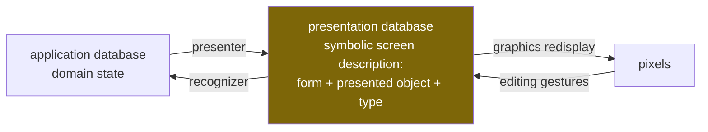
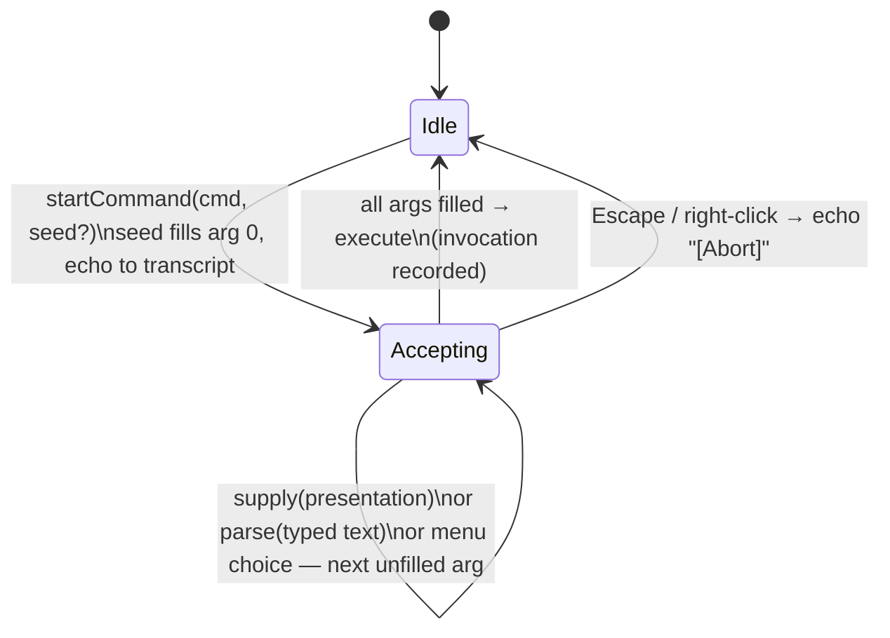

# Presentation-Based UIs — Porting the CLIM Interaction Model to React

This article explains how a presentation-based user interface works and how the 1984 model behind it translates onto a modern React stack. It is written from a working implementation (the `@pbui` packages in `/home/manuel/code/wesen/2026-07-12--clim-jsx`), but the subject is the pattern, not the project: which parts of the old design survive unchanged, which parts a modern framework gives you for free, which parts must be rebuilt explicitly, and which parts the modern environment forces you to add. A companion project note, [[PROJ - PBUI - Presentation-Based UIs in TypeScript and React]], covers the repository itself.

> [!summary]
> 1. A presentation-based UI keeps a symbolic, queryable record of *what is on screen and which domain object each thing presents*. Input is interpreted against that record, so every rendered object is simultaneously output and a potential input.
> 2. React replaces exactly one component of the 1984 model — incremental redisplay — and none of the others. The presentation database, the type lattice, the command loop, and the recognizer all have to be built explicitly, because the virtual DOM records *how to draw*, not *what is meant*.
> 3. The accept loop (a command collecting typed arguments by making matching presentations sensitive) is the heart of the pattern and is implementable as a ~200-line state machine whose entire UI — highlighting, menus, prompts, documentation line — derives from its state.
> 4. Modern constraints add three things the original never needed: an explicit render-cost model (hover-frequency vs. accept-frequency invalidation), participation modes that relax the input context's modality, and a keyboard/accessibility path that doubles the pointer documentation line as a screen-reader live region.

## Why this note exists

The presentation-based interaction model solves a problem that modern UI frameworks still leave to convention: connecting what the user sees to what the program knows. In a conventional React application, a table cell showing a customer's name is a string in a DOM node; any behavior — click to open, right-click for actions, drag to assign — is wired by hand, per call site, and each wiring knows nothing about the others. The result is familiar: the same customer is clickable here, dead text there, and differently-behaved in a third place.

Eugene Ciccarelli's MIT thesis (*Presentation Based User Interfaces*, AITR-794, 1984) and its descendants — Symbolics Genera's Dynamic Windows and CLIM, the Common Lisp Interface Manager — invert the arrangement. Every rendered form records the domain object it presents and the type under which it presents it. Behavior then attaches to *types*, once: what a customer's context menu offers, what clicking a customer does, and whether a customer can answer a command's pending question are all consequences of "this pixel region presents a CUSTOMER," established at render time. This note records how to build that arrangement on React, with the specific mappings, the mechanisms, and the places where the port required judgment rather than translation.

## The original model, precisely

The thesis describes an interface as two databases and three processes.



The **presentation database** is the load-bearing element. It is symbolic — text strings, shapes, regions, not pixels — and every entry records its *presented domain object*. The **presenter** derives it from application state and keeps it current. The **recognizer** interprets the user's actions on presentations as application commands. Redisplay — diffing the presentation database against the screen — is a separate, mechanical layer; the thesis implements it with per-record timestamps and dirty propagation, which a modern reader will recognize as a 1984 virtual DOM.

CLIM added the machinery that makes the model practical for command-driven applications:

- **Presentation types** form a subtype lattice (`milestone ⊂ task ⊂ object`), distinct from the implementation classes of the objects themselves.
- **Commands** declare typed parameters. When a command runs with parameters unfilled, the system enters an **input context**: presentations whose type matches the wanted parameter become *sensitive* (highlighted, clickable) and everything else does not respond. Clicking a sensitive presentation supplies the argument; typing an expression that parses to the wanted type does too.
- **Translators** map gestures on presentation types to commands or argument supplies — the right-click menu is "every translator applicable to this type in this context," computed, not wired.
- **Output records**: everything printed to the interactor is stored structurally, so an object mentioned in output three commands ago is still sensitive and can answer a question the current command is asking.

The whole pattern is in that last sentence. Output and input are the same objects, mediated by the same record store.

## Core mental model for the modern port

The single most important decision in the port is recognizing what React's virtual DOM is and is not. It is a superb implementation of the thesis's *graphics redisplay* layer: it diffs a declarative description against the screen and applies minimal updates. It is not a presentation database, because it records elements and props — how to draw — and is deliberately opaque to queries like "which regions currently present order #1012?" The semantic layer must therefore be rebuilt as an explicit store. Everything else follows from that.

| 1984 / CLIM concept | Modern counterpart | Built or free? |
|---|---|---|
| graphics redisplay (timestamps, dirty subtrees) | React reconciliation | free — do not rebuild |
| presentation database | explicit registry: `{id, type, ref, label, bounds, mode}` records with by-ref/by-type/by-point indexes | built |
| presented-object link | `ObjectRef {kind, id}` + application-supplied `Resolver` | built |
| presentation type + `present`/`accept` methods | ptype record: lattice edges + `print`/`parse` codec + `describe` + default command | built |
| presenter (domain collector / semantic / organizational) | selector over the store / the component's render / layout components | free (it *is* React code) |
| recognizer (gesture → command) | one gesture router + command table + accept-loop state machine | built |
| translators | derived menus, per-type default commands, type coercions | built |
| output records | transcript lines as typed part arrays; object parts mount real presentations | built |
| pointer documentation line | pure derivation of (input context, hover) — also the screen-reader live region | built |
| command applications (invocations with state) | invocation log; the substrate for undo and auditable history | built |

Two consequences of this table deserve emphasis. First, the presenter needs no framework: writing a PBUI presenter *is* writing a React component, provided the component registers what it presents. The library's entire render-side API is one hook. Second, the recognizer shrinks dramatically relative to the thesis, which parsed free-form *editing actions* (sketched curves, textual annotations, drag arrangements). The CLIM subset — gestures on typed presentations plus a typed command line — covers command-driven applications and is what this port implements; the structural recognizers remain future work with the registry as their landing pad.

## Pattern shape

### Registration: how a pixel region acquires meaning

A presentation is created by rendering a domain object through a wrapper that registers a record for the component's lifetime:

```tsx
<Presentation type="customer" object={{kind: "customer", id: c.id}} label={c.name}>
  {c.name}
</Presentation>
```

Underneath is a headless hook. On mount it inserts a `PresentationRecord` into the registry (with a lazy `bounds` thunk reading `getBoundingClientRect`, so geometry is measured only when hit-testing demands it); on unmount it removes the record; and it returns the full gesture protocol as spreadable props. The wrapper exists in an HTML flavor and an SVG flavor (which additionally draws an invisible hit rectangle and highlight rings, since SVG has no CSS outline), and the same record shape supports canvas renderers that emit per-frame hit records instead of DOM nodes. That three-media requirement — HTML, SVG, canvas — is the argument for keeping the hook headless: sensitivity is a *behavior* attached to a record, not a property of a DOM wrapper.

Two details in the record matter more than they look:

- **The record holds a reference, not the object.** Domain state changes under the presentation — simulation ticks, deletions, garbage collection. Resolution happens at gesture time through the application's resolver, and `undefined` is a defined answer meaning the presentation is stale. Staleness is then handled in exactly one place (the command runner prints a standardized message and aborts) instead of in every command body.
- **Nested presentations resolve innermost-first** by stopping mouse-move propagation at the innermost wrapper. A tag chip inside an image card is its own presentation; hovering the chip documents the tag, hovering the card around it documents the image. This replaces CLIM's output-record-tree hit testing with the DOM's own event routing, at zero cost.

### The type lattice and the round-trip codec

A ptype declares its supertypes and, crucially, both halves of a codec:

```ts
ptypes.define<Order>({
  name: "order",
  print: (o) => `#<ORDER #${o.number} ${o.status}>`,
  parse: (text, world) => /* "#1012" or a prefix -> {ok, value, ref, label} */,
  describe: (o, world) => [/* typed output parts, incl. live references */],
});
```

`print` is the presenter's textual form; `parse` is the keyboard path of `accept` — the user can always type the argument instead of clicking it. The thesis states a coherence invariant for this pair: input accepted by the recognizer, re-presented, must land where the user put it, with the recognizer accepting a superset of what the printer emits ("12", "12.0" both parse; the printer always emits one canonical form). On a modern stack this stops being folklore and becomes a property test: `parse(print(x))` must equal `x` for generated values, and tolerated variants must normalize. Subtype matching walks the lattice; a registered **coercion** list extends it laterally (a `panel` presentation can satisfy an `events` parameter; a `pin` can satisfy a `location`), which is the modern residue of CLIM's presentation translators that produced objects rather than commands.

### The accept loop

Commands are data: a name, typed argument specifications, an applicability predicate, and a body that receives resolved values. The interaction engine owns one piece of state — the current input context — and a small machine around it:



Everything the user sees during an accept is *derived* from that one piece of state, and this derivation-not-wiring property is what makes the pattern cheap to keep consistent:

- **Sensitivity**: a presentation is eligible iff its type reaches the wanted type through the lattice or a coercion, and the specification's `where`/`distinct`/`validate` predicates pass — checked *before* the click, so the marching-ants highlight never advertises a supply that would be rejected. Everything else dims.
- **Menus**: the right-click menu of a presentation is the set of commands whose first parameter the presentation can fill and whose applicability predicate accepts the resolved object. A paid order's menu differs from a pending order's with no menu code anywhere.
- **The prompt line**: renders the command name, the arguments collected so far, and the wanted type with its default (`New Order (customer: Bo Lindqvist) (qty: a NUMBER [default 1]) ⇒`).
- **The documentation line**: a pure function of (input context, hovered presentation) producing "Accepting a SITE — Mouse-L on a highlighted presentation supplies it. [Escape] aborts." or, when idle, the hovered object's printed form and its gesture affordances.

Because arguments already collected are visible to the predicates of arguments still pending, cross-argument constraints cost one line: an *Untag Image* command's second parameter lights up only the tags the already-chosen image carries — `where: (tag, {image}) => image.tags.includes(tag.name)`.

### Output records: the transcript is a first-class surface

Transcript lines are arrays of typed parts; a part of kind `pres` mounts a real presentation when rendered:

```ts
api.print(orderPart(order), " connected to ", channelPart(channel), ".");
```

The consequence is the pattern's signature behavior: an object printed minutes ago remains sensitive, participates in eligibility when a later command needs its type, and can be right-clicked for its menu. Because parts hold refs and resolve at render time, transcript mentions survive domain-state changes and degrade explicitly when the object is gone. In the working implementation this extends to the command history itself — each echo line is wrapped in a presentation of its *invocation record*, so undo is reachable by right-clicking the past command in the transcript. History is made of the same material as everything else on screen.

## What the modern environment forced us to add

The 1984 and CLIM designs assumed a single-threaded machine, a captive screen, and a user with three mouse buttons. Three additions were required that the originals never discuss.

### A render-cost model

A naive port lets every presentation subscribe to the engine's state, at which point one mouse movement re-renders every mounted presentation — invisible in a demo, fatal in a thousand-row table. The fix is to split invalidation by event frequency. Hover transitions are mouse-paced and *targeted*: the engine notifies exactly the old target, the new target, and the presentations of the same objects (for cross-view highlighting), through per-record subscription channels on the registry. Input-context transitions are user-paced and may *broadcast*, because an accept legitimately changes every presentation's flags; the eligible set is computed once per transition (with incremental membership for presentations registered mid-context, which is what keeps freshly printed transcript references supplyable). Measured on the reference implementation: 1.98 presentation re-renders per hover transition at 2,000 presentations, against an architectural cost of ~2,000 before the split. The registry doubles as the invalidation channel — the presentation database earns its existence twice.

### Participation modes: the input context cannot be a wall

CLIM kept frame commands live during accepts; a literal port that swallows every non-supplying click reproduces a modal dialog with better typography, and real applications hit it immediately (tab navigation dead mid-command; canvas clicks blocked by the shapes drawn on it). The port resolves this with a per-presentation *participation mode* for foreign input contexts:

| mode | behavior during a foreign accept |
|---|---|
| `gated` (default) | dimmed, gestures swallowed — the legibility of the accept depends on most things being this |
| `active` | fully interactive; left-click may run the presentation's default command *if* that command is declared safe to run during accepts, and the pending context survives |
| `fallthrough` | gesture-transparent; events reach whatever is underneath (`pointer-events: none` without the dimming — the DOM implements the fall-through natively) |

The `active` path is constrained to keep the model sound: a during-accept command must be satisfiable entirely by the presentation that invoked it (at most one parameter), enforced when the command is defined — which preserves the invariant that there is exactly one input context at a time and avoids designing a context stack nothing yet needs.

### Keyboard and assistive technology as a parallel gesture path

The pointer documentation line turns out to be the accessibility strategy, not just a nicety: it is already a pure derivation of (context, target), so pointing a screen reader at it (`aria-live="polite"`) narrates the interface's state transitions with no additional strings. The remaining work is a focus cursor: one roving tab stop over the presentation layer, arrow keys moving an engine-owned cursor that DOM focus follows, Enter as the click gesture, a menu key, and — the piece that completes the loop — Tab during an accept cycling the cached eligible set. With those in place, the accept loop is fully operable without a pointer, which is arguably closer to the Lisp-machine original than the mouse-only prototypes were.

## What was deliberately not ported

Three thesis mechanisms were left out, with their landing pads noted rather than half-built. Structural recognizers — parsing arrangements and edit histories (sketched circles around presentations, textual annotations on a directory listing) into commands — require the registry's spatial queries plus an edit-action log that does not exist yet. Planned databases (edit a *proposed* future state, then issue one "do it") map naturally onto a second store instance plus the invocation log, and undo's snapshot mechanism is the first step of it. Presentation *styles* as runtime-swappable data ("show this object as an icon / a row / a phrase," chosen per context) are approximated today by ordinary component composition; making them first-class would require the presenter registry the design documents sketch but the implementation does not yet contain.

## Working rules

- The registry is the pattern. If "which presentations of object X are on screen" cannot be answered by a query, the implementation is decorative, not presentation-based.
- Presentations hold refs; resolution happens at gesture and execution time; staleness is one standardized code path, never a per-command guard.
- Every ptype that can be typed must have both `print` and `parse`, and `parse(print(x)) ≡ x` belongs in the test suite, not in the documentation.
- Eligibility must be truthful: every predicate that could reject a supply runs before the highlight, not after the click.
- All context-dependent UI (menus, prompts, doc line, sensitivity) is derived from engine state by pure functions. Any hand-wired duplicate will eventually disagree with the engine.
- Output goes through typed parts; if printing an object's name does not produce a live presentation, the transcript has stopped being part of the interface.
- Default participation is gated; grant `active` only to navigation whose commands are seed-complete, and `fallthrough` only to decoration over input surfaces.
- Pin the echo grammar with golden transcripts before touching the engine. The transcript is the observable spec of the whole command loop.

## Related notes

- [[PROJ - PBUI - Presentation-Based UIs in TypeScript and React]] — the repository this article distills: package layout, demos, verification suite, measurements, and project status.
- Primary sources in-repo: the AITR-794 transcription and its distillation live in the CLIM-JSX-001 ticket (`ttmp/2026/07/12/CLIM-JSX-001--*/sources/aitr-794.md`); the reference engine is `packages/core/src/engine.ts`, and a complete small example of the pattern is the Hello PBUI demo (`apps/demos/src/demos/hello/HelloDemo.tsx`).
