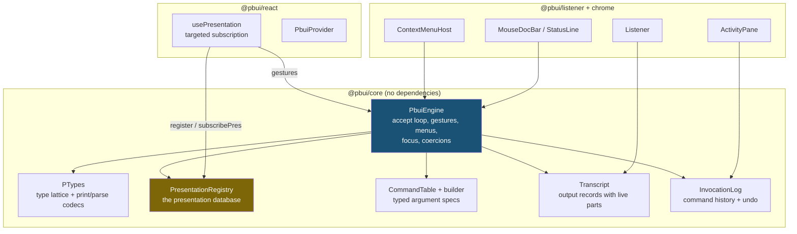
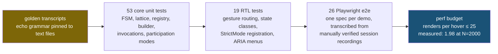

# PBUI — Presentation-Based UIs in TypeScript and React

This project extracts a shared TypeScript/React library — the `@pbui` package family — from twelve hand-written React prototypes that each re-implemented the CLIM / Symbolics Genera "Dynamic Windows" interaction model. In that model, every object drawn on screen remains a live, typed handle to a domain object: hovering it documents it, right-clicking it offers exactly the commands applicable to its type, and clicking it can supply it as a typed argument to a partially entered command. The project ran from source analysis through library design, implementation, seven demo applications, and a second design-and-implementation round that added typed command authoring, undo, keyboard accessibility, non-modal input contexts, and a CI-enforced verification suite — all in one day's ticketed work on 2026-07-12.

> [!summary]
> 1. `@pbui` is a five-package monorepo implementing presentation-based UIs: a framework-free interaction engine, React bindings, a listener/transcript component, window chrome, and a Genera-style theme.
> 2. The design is grounded in evidence: four analysis agents read ~12,200 lines of prototype JSX and one read Ciccarelli's 1984 MIT thesis (AITR-794); every architectural decision cites file-and-line sources.
> 3. Seven demos run on it, including two product-shaped applications (an are.na-style gallery and a five-tab e-commerce back office) whose development fed gaps back into the engine.
> 4. The v2 round is measured, not asserted: 1.98 presentation re-renders per hover transition at 2,000 presentations, 53 core unit tests, 19 React Testing Library tests, 26 Playwright end-to-end tests, and golden-transcript tests that pin the echo grammar character-for-character.

## Why this project exists

The repository began as an archaeology problem. Twelve single-file React prototypes (~680–1,600 lines each) had accumulated in `~/Downloads`, all imitating the same interaction paradigm from different angles: a metrics dashboard in four revisions, a Gantt scheduler, a schematic editor, a control-graph simulator, a multiprocessor console, two REPL notebooks, and a Lisp-machine demo. At least six of them contained a near-identical, independently re-typed implementation of the same machinery — an accept-loop state machine, a command table with typed argument specifications, a presentation wrapper, a mouse-documentation line, a context menu, a listener pane, and a monochrome theme. Bugs fixed in one prototype never propagated; features appeared in one file and regressed in the next.

The paradigm itself predates the prototypes by four decades. Eugene Ciccarelli's MIT thesis *Presentation Based User Interfaces* (AITR-794, 1984) models any interface as two databases and three processes: an application database, a **presentation database** (a symbolic, queryable description of what is on screen, where every form records which domain object it presents), a *presenter* that derives presentations from domain state, a *recognizer* that translates the user's edits of presentations back into domain commands, and the screen itself. CLIM and Genera's Dynamic Windows later made the input side central: presentation *types* form a lattice, commands declare typed arguments, and an active "input context" makes exactly the type-matching presentations sensitive. The project's first deliverable was a design document that maps thesis vocabulary through CLIM vocabulary to React constructs, and the library holds one principle above the rest: React's virtual DOM is not the presentation database. React provides cheap redisplay, but the registry — which presentations of which objects are on screen right now — must be an explicit, queryable store.

## Current project status

The monorepo is functional and verified. All planned phases of the two v2 design tickets (CLIM-JSX-004 and CLIM-JSX-005) are implemented.

- Packages: `@pbui/core` (framework-free engine), `@pbui/react`, `@pbui/listener`, `@pbui/chrome`, `@pbui/theme-genera`.
- Demos (`pnpm demos`, port 5199): Hello PBUI (tutorial), CARE Examiner, Dynamic Windows Scheduler, Presenta Metrics, Schema Schematic Editor (ports of the originals), plus two new applications — Gallery (are.na-style image browser) and Storefront Back Office (five-tab e-commerce admin) — and a hidden `#bench` performance harness.
- Verification: 53 core unit tests including golden transcripts, 19 RTL tests, 26 Playwright e2e tests, a render-budget perf test, and a GitHub Actions workflow running all of it.
- Documentation: five docmgr tickets under `ttmp/2026/07/12/` with design documents, implementation diaries, and screenshots; the two v2 design documents are also on reMarkable.

## Project shape

```
/home/manuel/code/wesen/2026-07-12--clim-jsx/
├── sources/                  # the 12 original prototypes (deduplicated, preserved)
├── packages/
│   ├── core/                 # engine: ptypes, registry, commands, accept loop,
│   │                         #   builder, invocations/undo, transcript, doc line
│   ├── react/                # PbuiProvider, usePresentation, <Presentation>,
│   │                         #   <SvgPresentation>, RTL test suite
│   ├── listener/             # transcript + morphing prompt + command line
│   ├── chrome/               # menus, doc bar, status line, panes, ActivityPane
│   └── theme-genera/         # monochrome theme as CSS custom properties
├── apps/demos/               # launcher + 7 demos + e2e suite + PORTING-NOTES.md
└── ttmp/2026/07/12/          # CLIM-JSX-001 … 005 tickets (design docs, diaries)
```

## Architecture

The system divides into a framework-free core and thin React bindings. The core owns all interaction semantics; React components subscribe and render.



Five vocabulary items carry the whole design:

- A **presentation type** (ptype) is a named node in a lattice (`milestone ⊂ task ⊂ any`) carrying a printer, a keyboard parser, a describer, and optionally a default command. The printer and parser form a round-trip codec; the thesis's coherence invariant — recognized input re-presents to where the user put it — is a property test in this codebase.
- An **ObjectRef** (`{kind: "order", id: "o-3"}` or `{kind: "value", value: 42}`) is how presentations refer to domain objects without holding them. A `Resolver` turns refs back into live objects; `undefined` means the object is gone, and the engine handles that staleness centrally.
- A **PresentationRecord** is the registry entry: id, ptype, ref, label, optional pane, participation mode, and lazily measured bounds. The registry indexes records by ref, by type, and by screen point, and it is the render-invalidation channel.
- A **command** declares typed arguments. Invoking one with missing arguments starts an **input context**: the engine computes the set of eligible presentations once, they grow marching-ants outlines, everything else dims, and clicking an eligible presentation (or typing at the listener prompt, or choosing from a menu-valued argument) supplies the value.
- An **output record** is a transcript line made of typed parts; a `pres` part mounts a real presentation, so objects mentioned in output remain sensitive indefinitely and can supply later commands' arguments.

## Implementation details

### The accept loop

The engine's center is a small state machine. A command with unfilled arguments installs an `AcceptState {cmd, values, spec}`; every route into and out of it passes through two methods.

```
startCommand(cmd, seedPresentation?):
    echo "Command: <name> (<arg0>) <seed label>"     # seed = right-clicked object
    values[arg0] = coerce(seed) if compatible
    advance(cmd, values)

advance(cmd, values):
    spec = first argument not in values
    if none:      setAccept(null); execute(cmd, values)
    else:         setAccept({cmd, values, spec})
                  if spec.input == "menu": open choice menu at last pointer position

supply(presentation):                                 # left-click on eligible
    v = coerceFor(spec, presentation)                 # subtype walk + coercions
    reject unless distinct/where/validate pass
    echo "  <arg> (a TYPE) ⇒ <label>"
    advance(cmd, values + {spec.name: v})

abort():                                              # Escape, right-click
    setAccept(null); echo "[Abort]"
```

Eligibility is the visible half of this machine. `coerceFor` first walks the subtype lattice, then a registered coercion list (a `panel` presentation can satisfy an `events` argument; a `pin` can satisfy a `location`). The `where` and `validate` callbacks receive the already-collected arguments, which is how a gallery's *Untag Image* lights up only the tags the chosen image actually carries, and how *Adjust Stock* rejects a delta that would take the already-chosen product's inventory negative. All three checks run before the click is possible, so the highlighting never lies.

The echo grammar produced by this machine is treated as a specification. A canonical serializer renders transcripts to text (`[echo] **Command:** Compare Sites (site-a) {site SITE-ALPHA}`), and golden-transcript tests compare scripted interactions against checked-in files. Refactors of the engine may not move a character of it.

### The registry and the render-cost model

The first implementation had every `usePresentation` hook subscribe to the entire engine state, which meant one hover movement re-rendered every mounted presentation — acceptable at demo scale, fatal at table scale. The v2 rework split the notification model by frequency:

- **Hover transitions are mouse-paced and targeted.** `setHover` notifies exactly the old target, the new target, and every presentation of the same objects (for the related-hover outline), using a refKey index that makes by-object lookup proportional to the number of presentations of that object.
- **Accept transitions are user-paced and broadcast.** `setAccept` recomputes an eligible-id set once (a full registry scan through the predicate) and notifies all presentations, because an input context legitimately changes everyone's flags. Presentations registered mid-context — transcript lines printed during the accept — join the set incrementally, which preserves the property that freshly printed object references are immediately supplyable.

Each hook subscribes to its own presentation id only. The measurement, taken by a hidden bench demo with 2,000 presentations and a Playwright perf spec that reads a render counter: **1.98 presentation re-renders per hover transition** — the old cell and the new one — against a CI budget of 25 and a pre-rework architectural cost of roughly 2,000. The first version of that measurement reported zero renders and passed vacuously, because React 18 batches synchronously dispatched events and flushes after the loop; the spec now yields a macrotask per transition and fails loudly if the counter does not move at all.

### The typed command builder

Command tables originally used a runtime-shaped API: `run(args, api)` received raw `ArgValue` records, so every body began by resolving refs, guarding against staleness (57 hand-written guards across the demos), unwrapping `{kind: "value"}` immediates, and casting `world: unknown` back to its real type. The v2 builder removes all four costs without changing the runtime: argument descriptors carry TypeScript types as phantom parameters, an object literal's key insertion order defines the accept order, and a mapped type derives the resolved shape of `run`'s first parameter.

```ts
c.define({
  name: "Refund Order",
  args: {
    order:  arg.presentation<Order>("order"),
    reason: arg.text({ prompt: "the refund reason" }),
  },
  appliesTo: (order: Order) => order.status === "paid" || order.status === "fulfilled",
  run: ({ order, reason }, api) => {
    api.snapshotUndo(world.store);      // one-line undo opt-in
    ...                                  // order: Order — resolved, never stale
  },
});
```

The builder compiles descriptors down to the v1 `CommandSpec` and wraps `run` with resolve-then-run: entity refs resolve through the engine's resolver, and any stale entity aborts the command with one standardized message before user code runs. Behavioral equivalence with hand-written v1 specs is asserted by rendering both variants' transcripts and comparing bytes. Migrating the largest demo (the e-commerce back office, 23 commands) removed 30 lines, all 31 non-null assertions, and all 20 manual resolve calls, with narrations byte-identical under the e2e suite. One honest limitation remains: descriptor callbacks type the candidate value but leave the `soFar` (already-collected arguments) parameter loosely typed, because descriptors are constructed inside the object literal that defines the argument set — the type does not exist yet at that point. Authors annotate the parameter; a curried API could close the gap.

### Invocation records and undo

Every executed command becomes a `CommandInvocation` — name, argument refs, lifecycle status (`executing → completed | failed | undone`), a monotonic sequence number (the core is deliberately clock-free), and a link to its transcript echo line. Undo is opt-in with two flavors. `api.snapshotUndo(store)` captures the previous state object of an immutably updated store; because state is replaced rather than mutated, the snapshot shares structure with its successor and restores exactly. `api.undoable(capture)` registers an explicit inverse for commands whose effects are not "restore the world." Undo is linear-only: only the most recent undoable invocation can be undone, which sidesteps the dependency analysis that selective undo requires.

The interesting part is that invocations are themselves presentations. Invocation refs resolve from the engine's own log before delegating to the application resolver, so no application changes are needed; the listener wraps each echo line in a quiet presentation of its invocation, and right-clicking a past command in the transcript offers *Undo Invocation* when applicable. Command history is made of the same material as everything else on screen.

The known semantic caveat is documented rather than hidden: snapshot undo restores the whole store, including unrelated mutations from concurrent simulation ticks. Applications with live ticks should prefer explicit inverses.

### Participation modes: dismantling the modal wall

The original input context was fully modal — the engine swallowed every click that did not supply the pending argument. Two applications hit this wall and recorded it in their file headers: the schematic editor needed clicks to pass through component bodies to the canvas during LOCATION accepts, and the e-commerce admin could not switch tabs mid-command. CLIM kept frame navigation live during accepts; the v2 engine restores that with three per-presentation participation modes.

| Mode | During a foreign accept | Intended use |
|---|---|---|
| `gated` (default) | dimmed, `pointer-events: none`, clicks swallowed | almost everything — the dimming is what makes accepts legible |
| `active` | fully interactive; left-click runs the presentation's default command **if** that command is marked `duringAccept`, and the pending context survives | navigation chrome (tabs) |
| `fallthrough` | gesture-transparent; events reach whatever is underneath | canvas overlays |

Two constraints keep this sound. A `duringAccept` command must be *seed-complete* — at most one argument, supplied by the invoking presentation — enforced by a define-time error, which preserves the invariant that there is exactly one input context at a time. And after an `active` command executes, the engine recomputes the eligible set, because the command's effects (mounting a new tab's presentations) may change it. `fallthrough` turned out to be pure CSS: `pointer-events: none` without the dimming lets the DOM deliver the click to the canvas natively. Eligible presentations behave normally in every mode.

Both formerly recorded gaps now have end-to-end proofs: the e-commerce spec switches to the Customers tab mid-*New Order* and supplies the customer there; the schema spec asserts an instance body carries the passthrough class, clicks dead-center on it, and the new component places at that point.

### The keyboard layer

Keyboard support was retrofitted as a parallel gesture path rather than a bolt-on. The engine holds a focus cursor with the same targeted notification as hover, and the documentation line treats a focused presentation exactly like a hovered one — the doc line is simultaneously the screen reader's context, via a polite live region. Presentations carry a roving tabIndex (one Tab stop for the layer; arrow keys move the cursor; DOM focus follows the engine cursor so the browser's accessibility tree agrees). Enter and Space are the click gesture, `m` opens the command menu, `d` describes, and — the piece that makes the paradigm work without a mouse — Tab during an accept cycles the cached eligible set. Menus are ARIA menus with wrap-around arrows, type-ahead, and focus return to the invoking element. The proof is an end-to-end test that completes a two-argument command flow in the CARE Examiner demo with zero mouse events, including selecting the command from the menu by type-ahead.

### The verification pyramid

The test strategy was designed before the v2 engine surgery, on the grounds that the two historical core bugs had been found only by driving a real browser.



The suite paid for itself within hours of existing. A cosmetic relabel of the menu footer ("Abort" → "Dismiss") broke three specs that pin exact menu contents before the change ever reached a browser, and the golden files prevented the invocation-record work from perturbing the echo grammar. The e2e specs are transcriptions of interactions that had already been verified by hand during development, with two operational rules encoded in their shared helpers: reload after hash navigation (same-document navigation does not remount the application), and select menu items by exact text ("Tag Image …" and "Untag Image …" collide under substring matching).

## Failure modes worth remembering

- **Defensive test fixtures mask contract bugs.** The doc line crashed any ptype printer that dereferenced its object, because it passed `undefined` where the contract promised a resolved object. The unit fixture's printer used optional chaining and hid the bug; a strict demo printer exposed it in the browser. Fixtures should be as strict as real application code.
- **Validation must be enforced at every entry path.** Positional command-line arguments bypassed `validate` and `distinct` even though click-supply and typed-supply enforced them; `set update interval 50` executed below its documented minimum. Argument constraints belong in one function that every supply path calls.
- **Synchronous event loops measure nothing in React 18.** Batching flushed all 100 synthetic hover events after the measurement loop, producing a passing perf test that had measured zero renders. Instrumented measurements need a liveness guard that fails when the counter does not move.
- **Live regions change DOM-query semantics.** Adding an aria-live mirror of the newest transcript line broke four RTL tests that had implicitly relied on text uniqueness; assistive-technology structure and test selectors need to be designed together.
- **HMR and browser automation do not mix.** Elements detach mid-click when Vite hot-reloads during a Playwright interaction. The suite runs against a production preview build; the dev server is for humans.

## Important project docs

- `ttmp/2026/07/12/CLIM-JSX-001--…/design-doc/01-…` — the founding analysis: thesis distillation, per-prototype evidence with line anchors, the `@pbui` architecture, eight decision records, the original phased plan.
- `CLIM-JSX-002` and `CLIM-JSX-003` — diaries of the gallery and e-commerce applications, where the authoring pain, missing undo, and modal-context gaps were first recorded.
- `CLIM-JSX-004` and `CLIM-JSX-005` — the v2 design documents (typed builder / a11y / undo, and interactivity / performance / verification), each with implementation diaries recording deviations and measurements. Both are also on reMarkable under `/ai/2026/07/12/`.
- `apps/demos/PORTING-NOTES.md` — the recipe for writing a new PBUI application on the current API.

## Open questions

- The `soFar` parameter in builder descriptor callbacks is loosely typed (the chicken-and-egg described above); a curried argument-definition API could make it precise.
- Accept transitions still broadcast to all presentations by design; if an application ever shows cost there, per-flag diffing inside the registry's notification layer is the contained next step.
- Redo and selective undo are deliberately absent; the invocation log is their substrate if they become worth their complexity.
- A real screen-reader session and an axe-core CI pass are outstanding; the ARIA structure is in place but has only been verified mechanically.
- The packages export raw TypeScript (`main: src/index.ts`); publishing to npm requires a build step (tsup or similar) and versioning policy.

## Near-term next steps

- Run one manual screen-reader session and wire axe-core into the RTL suite.
- Flip the CI perf job from calibration (`continue-on-error`) to enforcing once two weeks of runs confirm the budget.
- Consider porting the remaining unported prototypes (design-kit, the 3D metrics variant with its canvas hit-record adapter, the metrics(2) window manager) as further engine stress tests.

## Project working rule

Every engine change lands behind the verification suite: goldens pin the transcript grammar, the e2e specs pin the demos' observable behavior, and any new capability ships with the test that proves it — preferably one transcribed from a real interaction rather than invented for coverage.
