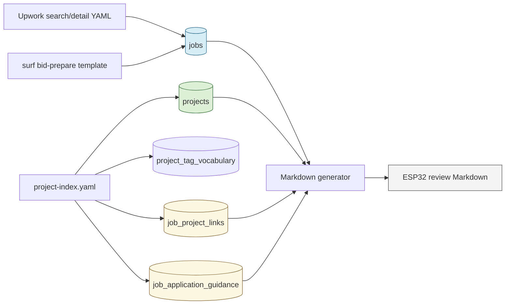
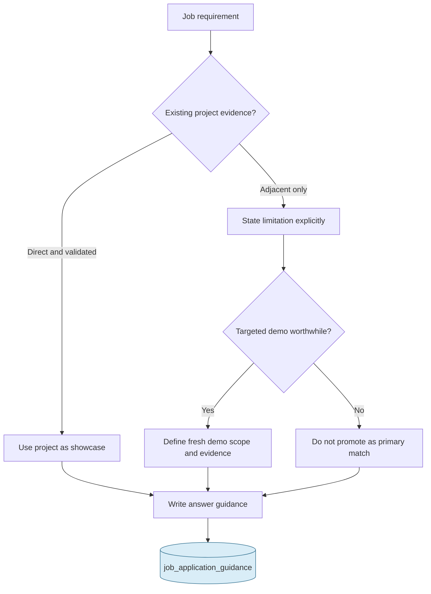

# SQLite-Backed Opportunity Research: Project Evidence and Proposal Metadata

This report documents the information system built around a local Upwork tracker and a separate ESP32 project repository. The work did not prepare or submit proposals. Its purpose was to turn browser-derived opportunity data, locally authored project evidence, application-form requirements, and human application guidance into a queryable local database that can regenerate a review document without relying on a manually maintained Markdown summary.

The immediate output is an ESP32-oriented review, but the important result is the model: opportunities, proposal forms, portfolio projects, controlled tags, project-to-opportunity links, and application guidance are distinct data with explicit ownership. Once those data are stored independently, Markdown becomes a view of the data rather than the only place where knowledge exists.

> [!summary]
> - The tracker database now stores 65 jobs, 75 indexed embedded projects, 58 controlled project tags, 35 job-to-project links, and 11 application-guidance records.
> - `surf upwork bid-prepare` supplied apply URLs, Connects costs, proposal-rate prefills, and screening questions without filling or submitting a proposal.
> - A database-backed generator now rebuilds the ESP32 review from SQLite, including job details, recommended projects, fresh-demo plans, questions, answer guidance, and rejected opportunities.

## Why this work exists

A job board is not useful merely because it contains postings. A useful local research system has to preserve the distinctions that matter during a later decision: what the client asks for, what the application form asks for, what evidence already exists, what evidence is only adjacent, what must be built before a claim can be made, and what should be rejected because it is out of scope.

A Markdown document can record all of this, but it is a poor primary store. It is difficult to answer questions such as “which project supports this opportunity?”, “which application form has fetched screening questions?”, or “which proposals have a rate prefill inconsistent with the listing?” when those facts only appear in prose. It is also easy for a document to become stale after a fresh browser inspection.

The local tracker already had `jobs`, observations, tags, and status transitions. The work extended it in two directions. First, it made proposal-form data durable. Second, it imported an independent catalog of embedded projects and expressed the relationship between a project and a job in the database.

The result is not a recommendation engine. It is an evidence system. Human judgment remains necessary for fit, truthfulness, feasibility, and whether a new demo is worth building. The database makes that judgment inspectable and repeatable.

## The source material

The system integrates three sources with different reliability and update behavior.

| Source | What it contributes | Update method | Reliability boundary |
|---|---|---|---|
| `upwork/upwork.db` job records | Job descriptions, compensation text, status, stars, tags, client information | YAML search/detail importer and targeted updates | A job record is a captured observation, not a permanent truth about a live listing. |
| `surf upwork bid-prepare` | Apply URL, Connects cost, proposal-rate prefill, screening questions | Read-only browser form inspection | Form requirements may change between inspections; no proposal is submitted by this command. |
| `esp32-s3-m5/docs/project-index.yaml` | Project summaries, controlled tags, source evidence, showcase assessment, crosswalk guidance | Project-index importer | Project claims must be grounded in repository evidence and hardware validation status. |

The embedded-project catalog lives at `/home/manuel/workspaces/2025-12-21/echo-base-documentation/esp32-s3-m5/docs/project-index.yaml`. It indexes 75 numbered projects. The catalog includes direct firmware work such as device-hosted web UIs, WebSocket control planes, event-driven ESP-IDF systems, sensor acquisition, display work, e-ink UI systems, and embedded QuickJS experiments. It also records whether a project is only a scaffold, a demo, an active system, or blocked.

That status distinction is essential. A scaffold may be useful as evidence of code organization or exploration, but it cannot be represented as completed production capability. The crosswalk therefore includes both existing-project recommendations and optional fresh-project recommendations. The latter is an explicit statement that existing evidence is insufficient for a particular claim.

## The data model

The initial `jobs` table represented the opportunity itself. Proposal metadata was added as columns because it is one-to-one with a job at the time the tracker is used:

```sql
ALTER TABLE jobs ADD COLUMN screening_questions TEXT NOT NULL DEFAULT '[]';
ALTER TABLE jobs ADD COLUMN connects_cost INTEGER;
ALTER TABLE jobs ADD COLUMN apply_url TEXT;
ALTER TABLE jobs ADD COLUMN proposal_template_path TEXT;
ALTER TABLE jobs ADD COLUMN proposal_rate_prefill TEXT;
```

`screening_questions` is stored as JSON because the questions are ordered and their wording must be preserved. A normalized `screening_questions` table would be reasonable if answers, revisions, reviewer state, or per-question audit history became first-class requirements. At the current scale, JSON preserves the form’s ordered prompt list while keeping the job record easy to inspect.

Project data is structurally different from job data. A project can support multiple jobs, and a job can be supported by multiple projects. That relationship requires separate tables:

```sql
CREATE TABLE projects (
  project_key TEXT PRIMARY KEY,
  project_id TEXT NOT NULL,
  slug TEXT NOT NULL,
  name TEXT NOT NULL,
  path TEXT NOT NULL,
  title TEXT NOT NULL,
  summary TEXT NOT NULL,
  status TEXT NOT NULL,
  targets_json TEXT NOT NULL,
  boards_json TEXT NOT NULL,
  tags_json TEXT NOT NULL,
  repository_evidence_json TEXT NOT NULL,
  showcase_json TEXT NOT NULL,
  job_mapping_json TEXT NOT NULL,
  notes TEXT NOT NULL,
  source_index_path TEXT NOT NULL,
  updated_at TEXT NOT NULL
);

CREATE TABLE job_project_links (
  job_id TEXT NOT NULL REFERENCES jobs(job_id) ON DELETE CASCADE,
  project_key TEXT NOT NULL REFERENCES projects(project_key) ON DELETE CASCADE,
  recommendation_rank INTEGER NOT NULL,
  fit TEXT NOT NULL,
  strategy TEXT NOT NULL,
  recommendation TEXT NOT NULL,
  rationale TEXT NOT NULL,
  source_index_path TEXT NOT NULL,
  PRIMARY KEY(job_id, project_key)
);

CREATE TABLE job_application_guidance (
  job_id TEXT PRIMARY KEY REFERENCES jobs(job_id) ON DELETE CASCADE,
  fit TEXT NOT NULL,
  strategy TEXT NOT NULL,
  project_recommendation TEXT NOT NULL,
  fresh_project_json TEXT NOT NULL,
  screening_questions_json TEXT NOT NULL,
  answer_guidance_json TEXT NOT NULL,
  cover_letter_guidance TEXT NOT NULL,
  known_questions INTEGER NOT NULL,
  source_index_path TEXT NOT NULL,
  updated_at TEXT NOT NULL
);
```

The `projects` table stores project facts and project-review metadata. `job_project_links` stores the many-to-many relationship and its job-specific meaning. `job_application_guidance` stores advice that belongs to a particular opportunity rather than to a project. This separation prevents a project summary from being polluted by one client’s requirements and prevents job-specific cover-letter guidance from becoming an implicit project claim.



## Controlled tags and project identity

The project index contains a tag vocabulary grouped by domain: board, platform, connectivity, hardware I/O, and application. There are 58 controlled tags in the imported catalog. Tags such as `esp-idf`, `wifi`, `websocket`, `e-ink`, `quickjs`, `sensor`, and `web-ui` are useful because they express capabilities that recur across projects without forcing every reader to rediscover them from source code.

The vocabulary is deliberately part of the source YAML rather than an unbounded set of free-form tags. A controlled vocabulary has two practical benefits. First, it makes filtering stable: `websocket` refers to one capability everywhere. Second, it makes omissions visible: if a new project requires a new capability label, adding the label is a deliberate model change rather than an accidental spelling variation.

The catalog also uses `project_key` as the canonical identity. Numeric tutorial IDs are retained for readability, but they are not sufficient keys because two directories share the sequence `0095`. The folder name is unique and maps directly to an on-disk path. Any cross-reference imported into SQLite therefore resolves an ID through the project catalog and stores the full key.

## Import mechanics

The Go importer is `upwork/cmd/import-upwork/main.go`. It now accepts a project index in addition to job-search YAML and proposal templates:

```text
import-upwork \
  --db upwork.db \
  --source /path/to/search-or-detail.yaml \
  --proposals . \
  --project-index /path/to/docs/project-index.yaml
```

The importer applies three important rules.

First, it initializes tables idempotently. Existing databases created before proposal metadata receive additive migrations. The migration checks `pragma_table_info('jobs')` before issuing `ALTER TABLE`, so a repeated run does not fail merely because a column already exists.

Second, it treats proposal templates as read-only form captures. `importProposal` parses only the `url`, `connects_cost`, `[rate]`, and `[question:n]` sections. It does not interpret a cover letter, does not invoke `bid-apply`, and does not create any state indicating that an application was sent.

Third, project-index import replaces links and guidance from the same source file inside one transaction. Projects are upserted by `project_key`; vocabulary entries are upserted by `(category, tag)`; stale links and guidance from that YAML source are deleted before the current source is inserted. This gives the index file clear ownership of its derived database rows.

The critical transaction shape is:

```text
begin transaction
  delete old links/guidance for this source index
  upsert vocabulary
  upsert projects
  for each crosswalk job:
    upsert application guidance
    resolve project references
    insert ranked job-project links
commit transaction
```

A failed project reference does not create a dangling foreign key. The importer checks that both job and project records exist before inserting the link. That is preferable to silently writing a string that later cannot be joined to a project summary.

## The YAML identifier failure

The most instructive failure occurred in the YAML boundary. Upwork job IDs are 21-digit strings beginning with `0`. A YAML serializer emitted an unquoted ID such as:

```yaml
- job_id: 022073369925690315084
```

One parser treated this as a large floating-point number. At that point the identifier had already lost information: the leading zero was absent and the remaining integer could no longer be represented exactly in an IEEE-754 `float64`. The importer then found no matching job row, so no application-guidance records or project links were inserted.

This was not a database problem. It was an identifier typing problem at serialization time. The corrective rule is simple: identifiers are strings, and YAML identifiers must remain quoted.

```yaml
- job_id: '022073369925690315084'
  recommended_projects:
    - '0017'
    - '0029'
```

The importer also has a limited defensive normalization for an already-decoded 20-digit job ID by restoring a leading zero. That fallback is not a general fix for floating-point loss. It cannot recover a 21-digit value that was rounded. The durable fix is to quote IDs in the YAML source and validate their types after every YAML rewrite.

This failure led to a useful validation rule:

```python
assert all(isinstance(job["job_id"], str) for job in index["job_crosswalk"])
```

A project index is not merely descriptive YAML. It is import input. Its identifier fields need the same type discipline as an API payload.

## Form inspection and concurrency

The application-form inspection used `surf upwork bid-prepare`. The command opens an Upwork proposal form, reads its required fields, writes a human-editable template, and leaves the tab open. It does not fill the form and does not submit it.

The first parallel inspection pass returned incomplete captures for several jobs. A sequential retry produced stable values: 11 inspected forms, 161 Connects across them, and eight screening questions in total. The final form data includes three classes of result:

| Form class | Count | Meaning |
|---|---:|---|
| No screening questions | 8 | The proposal still needs a cover letter and contract-appropriate price/rate. |
| One screening question | 1 | The HTTP/WebSocket role asks for recent similar experience. |
| Multi-question forms | 2 | The RAK11160 and BME688 roles ask for comparable experience, certifications, framework experience or QA/feedback process. |

The important operational conclusion is not that browser automation must always be sequential. It is that a browser-backed workflow should validate its capture output before treating it as a database update. A zero-question result can be correct, but an unexpected zero-question result after a prior non-zero capture is a reason to retry and compare. The final importer persisted the form templates only after the sequential inspection yielded stable data.

## From evidence to guidance

The crosswalk does not infer competence from tag overlap alone. It records a human-authored explanation of why an existing project is useful, what it does not prove, and whether a fresh demo should be built.

For example, an embedded HTTP/WebSocket opportunity can cite an AtomS3R Web UI, a M5Dial WebSocket remote, and event-driven ESP-IDF projects. The guidance distinguishes these evidence sources by role:

- The device-hosted Web UI supports claims about embedded HTTP and browser interaction.
- The M5Dial remote supports claims about firmware, server, and browser WebSocket coordination.
- The event-bus projects support claims about asynchronous device architecture.
- None of these automatically proves TLS configuration or REST-to-WebSocket migration. Those claims remain conditional until supported by direct evidence.

A reliability-oriented firmware opportunity receives a different treatment. Existing Wi-Fi and event-loop projects demonstrate adjacent patterns, but a fresh `esp32-s3-network-reliability-lab` is recommended because it would directly exercise reconnect state, watchdog-safe task ownership, MQTT backoff, OTA error reporting, and memory telemetry. The fresh-demo record includes a scoped deliverable rather than a vague suggestion to “build a demo.”



This model is deliberately conservative. It makes the system more useful because it avoids a common failure: a plausible-sounding project list that overstates what the underlying repository actually proves.

## Generating Markdown from SQLite

The final Markdown is generated by `scripts/generate_upwork_esp32_overview.py` in `/home/manuel/code/wesen/claw-stuff`. The script joins `jobs`, `job_application_guidance`, `job_project_links`, and `projects`; decodes JSON fields; groups opportunities into long-term and project-based sections; and writes a review document.

```python
jobs = conn.execute(
    """
    SELECT j.*, g.fit, g.strategy
    FROM jobs j
    JOIN job_application_guidance g ON g.job_id = j.job_id
    WHERE j.status != 'rejected'
    ORDER BY j.starred DESC, j.last_seen_at DESC
    """
).fetchall()

for job in jobs:
    projects = linked_projects(conn, job["job_id"])
    guidance = guidance_for(job["job_id"])
    render_job(job, projects, guidance)
```

The generator has a narrow responsibility. It does not scrape the browser, create a project index, decide fit, or mutate a job status. It reads durable data and produces a view. Keeping those responsibilities separate means the document can be regenerated at any time without destroying editorial reasoning.

The output includes an overview table, per-job project evidence, fresh-demo suggestions, questions, question-specific guidance, cover-letter guidance, and rejected PCB-dependent records. The generated document is useful for review because it retains the path back to the underlying project directory and the job’s application metadata.

Regeneration is one command:

```bash
python3 scripts/generate_upwork_esp32_overview.py
```

## Tests and validation

The importer has focused Go tests in `upwork/cmd/import-upwork/main_test.go`. The tests cover:

- Search/detail job import idempotence.
- Proposal-template parsing, including application URL, Connects, rate prefill, and a screening question.
- Project-index import, including vocabulary, project upsert, application guidance, and a project link.

The operational validation sequence was:

```bash
cd /home/manuel/code/wesen/claw-stuff/upwork

gofmt -w cmd/import-upwork/main.go cmd/import-upwork/main_test.go
go test ./cmd/import-upwork

go run ./cmd/import-upwork \
  --db upwork.db \
  --source /dev/null \
  --proposals . \
  --project-index /home/manuel/workspaces/2025-12-21/echo-base-documentation/esp32-s3-m5/docs/project-index.yaml

python3 ../scripts/generate_upwork_esp32_overview.py
```

At the end of this run, the local database contained 65 jobs, 75 indexed projects, 58 controlled tags, 35 project links, 11 application-guidance records, and 11 proposal-form templates. These counts are not business metrics. They are a snapshot of the imported local research state and should be expected to change as jobs expire, project evidence evolves, and more forms are inspected.

## Working rules

The system now has a few rules worth preserving.

- Treat job IDs and project IDs as strings at every serialization boundary. Quote them in YAML and test their types after loading.
- Store browser-captured proposal requirements separately from job-listing observations. A listing and an application form are different views of the same opportunity.
- Use a project’s repository evidence and status when drafting an answer. A tag indicates relevance; it does not certify a claim.
- Record an adjacent match as adjacent. When the proof project does not exist, define a narrow fresh demo or decline to use that role as a primary showcase.
- Keep Markdown generated from the database. Hand-authored Markdown is appropriate for the source project index and guidance, but the final overview should be reproducible.
- Validate browser captures before import when an empty result is surprising. Browser state and parallel tabs can produce incomplete reads.
- Never call a submission command as part of research or import. Proposal submission remains an explicit human-approved action.

## Important files

| File | Role |
|---|---|
| `/home/manuel/code/wesen/claw-stuff/upwork/cmd/import-upwork/main.go` | SQLite schema initialization, migrations, job/form import, project-index import. |
| `/home/manuel/code/wesen/claw-stuff/upwork/cmd/import-upwork/main_test.go` | Importer tests for idempotence, proposal parsing, and project-index linking. |
| `/home/manuel/code/wesen/claw-stuff/upwork/upwork.db` | Local source of truth for the tracker and derived overview. |
| `/home/manuel/code/wesen/claw-stuff/scripts/generate_upwork_esp32_overview.py` | Database-to-Markdown view generator. |
| `/home/manuel/code/wesen/claw-stuff/upwork/esp32-starred-overview.md` | Generated review document. |
| `/home/manuel/workspaces/2025-12-21/echo-base-documentation/esp32-s3-m5/docs/project-index.yaml` | Project catalog, vocabulary, project evidence, and human-authored crosswalk guidance. |

## Next steps

The immediate implementation is sufficient for informed review. The next useful improvements are modest and concrete:

1. Add a generator test that creates a temporary SQLite database and verifies essential Markdown sections.
2. Add an explicit `captured_at` field for proposal-form metadata so the review can show how old a form capture is.
3. Store answer drafts separately from guidance if proposal composition becomes a repeated workflow; drafts have a different lifecycle from factual guidance.
4. Add a query or tracker page that filters projects by tag and shows every linked job, including the guidance rationale.
5. Keep the project index conservative. A stronger portfolio is created by validated demonstrations and accurate descriptions, not by expanding a tag list.

The central lesson is straightforward. Research becomes durable when its components are modeled independently, linked explicitly, validated at their boundaries, and rendered into documents only after the underlying data is complete enough to support the document’s claims.
