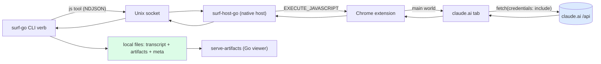

# claude.ai Artifact Archival

> [!warning] Deprecated
> This report is deprecated. The current state of the claude.ai → artifacts.yolo pipeline — refreshing the export, diffing against the live site, pushing renderable artifacts through the API, and backfilling conversation provenance — is documented in [[PROJ - claude.ai Artifact Import to artifacts.yolo - Export Diff, the Push API Provenance Gap, and Syncing the Live Gallery]].
> The extraction and reconstruction sections below remain technically accurate for those stages; they are the input to the production sync documented in the new report.

This project builds a pipeline that extracts a claude.ai account's conversations and the code artifacts they produced, reconstructs each artifact's final source from the conversation record, writes everything to local files, and serves the results as a browsable, runnable gallery. It spans two repositories: the browser-automation verbs live in `surf-cli` (`/home/manuel/code/others/llms/pi/nicobailon/surf-cli`), and the local viewer lives in `serve-artifacts` (`/home/manuel/code/wesen/2026-03-29--serve-claude-experiments`).

The work is worth writing up not because listing conversations is hard, but because one sub-problem turned out to be genuinely subtle: **the final source code of a modern Claude artifact is not stored anywhere as a single value.** It has to be reconstructed by replaying the file-manipulation tool calls in the conversation, and those tool calls use enough different mechanisms that a naive replay silently produces wrong files. Most of this note is about that reconstruction and how it was made correct.

> [!summary]
> - Claude's web app exposes an internal REST API (same-origin, cookie-authenticated). Conversations, projects, and artifacts are all reachable from a logged-in browser tab; the `surf-cli` extension injects `fetch()` calls into that tab.
> - The conversation-detail endpoint hides all tool/artifact content behind a placeholder unless the query parameter `render_all_tools=true` is passed. That flag is the entire difference between a 38 KB transcript and a 135 KB one.
> - A modern artifact is a sandbox file built incrementally by `create_file`, `str_replace`, `bash_tool` heredocs, `cp`/`mv`, and validated by `view`. Reconstructing its final content requires replaying those operations, reconciling against `view` snapshots, skipping edits the model itself failed, and resolving deliverables by basename when a build step is opaque.
> - The extension truncates any single JavaScript result at ~50 KB (later raised to ~900 KB, bounded by Chrome's 1 MB native-messaging limit); large payloads are transferred in base64 chunks reassembled on the Go side.
> - The viewer needed three fixes to run the exported artifacts: do not double-inject `import React`, extend the import map to non-React libraries, and scan the export tree recursively. A 21-artifact export then rendered 21/21.

## Why this project exists

An account had accumulated 2894 conversations, many of which produced code artifacts — React components, HTML documents, data files. Those artifacts are valuable output, but they are trapped inside the web app: there is no bulk export, and the UI shows them one conversation at a time. The goal was to pull them out as real files, keep the metadata that gives them meaning (which conversation, which project, when), and be able to browse and run them locally at the scale of thousands.

The project decomposes into three stages, each of which is its own technical problem:

1. **Extraction** — talk to claude.ai's internal API from a logged-in browser and page through the account.
2. **Reconstruction** — turn a conversation's tool-call history into the final bytes of each artifact file.
3. **Serving** — render the exported artifacts locally, which surfaced incompatibilities between the viewer's assumptions and the real artifact format.

## Architecture

The extraction stage reuses the `surf-cli` browser-side verb architecture. A verb is a Go command that injects JavaScript into a browser tab through a four-hop chain, and the injected code runs in the page's main world with the page's cookies and origin. This is why it can call claude.ai's internal API directly: the code *is* the page as far as same-origin policy is concerned.



The reconstruction stage is pure Go, operating on the JSON the extraction stage returns, so it is unit-testable without a browser. The serving stage is a separate Go server that reads the exported directory tree and renders each artifact through a host page that compiles JSX in the browser.

## Extraction: the claude.ai internal API

Reconnaissance against the live app established the following surface. All paths are under `https://claude.ai`, same-origin, with `credentials: 'include'`; `{org}` is the organization UUID.

| Purpose | Request |
|---|---|
| Account + organizations | `GET /api/bootstrap` |
| List conversations (paged) | `GET /api/organizations/{org}/chat_conversations_v2?limit=&offset=` → `{data, has_more}` |
| Conversation detail **with tools** | `GET /api/organizations/{org}/chat_conversations/{uuid}?tree=True&rendering_mode=messages&render_all_tools=true` |
| Legacy artifact versions | `GET /api/organizations/{org}/artifacts/{uuid}/versions?source=w` → `{artifact_versions}` |
| Projects | `GET /api/organizations/{org}/projects` |
| Rename / move (mutations) | `PUT /api/organizations/{org}/chat_conversations/{uuid}` with `{name}` / `{project_uuid}` |

Two findings from this stage shaped everything downstream.

**Only some organizations hold conversations.** An account can belong to several organizations; the verb must read `bootstrap` and select the membership whose capabilities include `chat`, not hard-code an id. On the target account one org had `chat` + `claude_max` (2894 conversations) and another was API-only (zero).

**`render_all_tools=true` is mandatory.** The conversation-detail endpoint, by default and under every `rendering_mode` value tried, replaces each tool and artifact block with a text block reading `This block is not supported on your current device yet.`. Sending the web app's client headers did not change this. The unlock is purely the `render_all_tools=true` query parameter. With it, one conversation's response grew from 38 KB to 135 KB; the extra 97 KB is the tool content that the placeholder was standing in for. Without this flag, the entire reconstruction stage has nothing to work with.

## Reconstruction: the core problem

Here is the fact that makes this project interesting. When you fetch a conversation with `render_all_tools=true`, you get the model's tool calls, but **the final content of an artifact file is never present as a single field.** The file is built up by a sequence of operations, and to know its final state you must apply them in order. This would be trivial if the only operations were "create file with this text" and "replace this substring." They are not.

### The mechanisms Claude uses to write a file

Across real conversations, a single output file (say `/mnt/user-data/outputs/Calendar.jsx`) is produced by some combination of:

- **`create_file`** — `input.file_text` is the initial content.
- **`str_replace`** — `input.old_str` / `input.new_str`, a first-occurrence substring replacement.
- **`bash_tool`** — an arbitrary shell command. In practice the model writes files with a heredoc, `cat > path << 'EOF' … EOF`, and it also `cp`s and `mv`s files between a working directory (`/home/claude/…`) and the deliverable directory (`/mnt/user-data/outputs/…`).
- **`view`** — reads a file back; the tool *result* contains the full file content with `cat -n`-style line numbers.
- **`present_files`** — `input.filepaths` names the files that are the actual deliverables. Its result carries a `local_resource` per file with a version UUID.
- **`rewrite`** — a full overwrite of a file.

A naive implementation that only handles `create_file` + `str_replace` fails badly. The failure is silent: it produces a file, just the wrong one. The first real export made this concrete. `Calendar.jsx` came out as a 3.9 KB stub whose only successful edit was the first `str_replace`; the remaining eleven edits referenced text that was never in the captured `create_file` content, because a `bash_tool` heredoc had rewritten the file in between. Eleven edits were dropped with a warning that a human could have ignored, and the "artifact" was an early skeleton, not the working component.

### Why the diffs alone are not enough

The tempting fix is to find a "final content" endpoint. There isn't one for these files. Probing the artifact-versions endpoint returned empty for file-based conversations; opening the artifact panel in the UI issued no content fetch, which means the app renders the file from data already in the conversation payload. So the payload does contain the truth — but only as the cumulative effect of the operations, including the `bash_tool` ones whose bodies are arbitrary shell.

The reconstruction therefore has to model the sandbox filesystem well enough to replay those operations, and it has to be defensive about the cases it cannot model perfectly.

### The reconstruction algorithm

The implementation lives in `go/internal/cli/commands/claude_artifacts.go`. It processes the conversation's tool calls in message order against an in-memory `map[path]content`, with a first pass that indexes every tool *result* by its `tool_use_id` so a tool call can consult its own outcome.

```
index results[tool_use_id] = { text, isError }

for each tool_use block in message order:
  create_file | rewrite:
      files[path] = input.file_text
  bash_tool:
      for each `cat > path << MARK … MARK` in the command:   # heredoc write
          files[path] = body           (>> appends)
      for each `cp SRC DST` / `mv SRC DST` (incl. inside `a && b && c`):
          files[DST] = files[SRC]       (mv also deletes SRC)
  str_replace:
      if results[id].isError: skip            # the model's own edit failed
      i = indexOf(files[path], old_str)
      if i < 0: warn (target not found); keep prior content
      else: files[path] = splice(old_str -> new_str)
  view (no view_range, path under outputs):
      files[path] = stripLineNumbers(results[id].text)   # ground-truth snapshot
  present_files:
      deliverables |= input.filepaths

# select deliverables
for p in present_files (sorted):
    if p in files: emit
    else:
        # a deliverable built by an opaque step; match by unique basename
        c = files where basename == basename(p)
        if exactly one c: emit files[c] under p
        else: warn "deliverable could not be reconstructed"
```

Four ideas in that algorithm do the real work, and each was added in response to a concrete failure observed in the export:

**View reconciliation.** Whenever the model does a full `view` of an output file, the tool result is the authoritative content of that file at that moment, straight from the sandbox. Setting `files[path]` to the de-numbered view content resets the reconstruction to ground truth and lets subsequent edits apply on top. This single mechanism self-corrects drift from any `bash_tool` write the parser did not fully understand, and it is why `Calendar.jsx` went from a 3.9 KB stub to the correct 10.2 KB component.

**Skipping errored edits.** The model sometimes issues a `str_replace` whose result is an error, most often `String to replace found multiple times, must be unique`, and then retries. A replayer that applies the errored edit corrupts the file. Consulting `results[id].isError` and skipping those edits matches what the sandbox actually did.

**Heredoc, `cp`, and `mv` parsing.** Files are frequently written with `cat > f << 'EOF'` and then copied from a scratch directory into the deliverables directory, often inside a compound command such as `mkdir -p out && cp a out/ && cp b out/`. The parser splits commands on `&&`, `;`, `|`, and newlines, tokenizes arguments with quote awareness, and applies each write/copy/move. A line-anchored regex missed the compound-command case initially, which is exactly why one deliverable went missing until the parser was generalized.

**Basename fallback for deliverables.** The last resort. When `present_files` names `/mnt/user-data/outputs/X` but the reconstruction only has `/home/claude/work/X` (because the build/copy step was opaque — an `esbuild` invocation, a Python `open().write()`), the code adopts the uniquely-matching file by basename. If there is no unique match, it emits an explicit warning rather than silently dropping the deliverable. Honesty about incompleteness is a design goal: a missing artifact must be visible, never a silent stub.

The reconstruction is validated by unit tests covering each mechanism (heredoc write, view reconciliation, errored-edit skip, copy-then-edit, missing-deliverable warning) and, end to end, by exporting twenty conversations and confirming every `present_files` deliverable is present and brace-balanced with zero warnings.

### A transfer problem sits underneath reconstruction

Before any of this runs, the payload has to cross from the page to Go. The extension caps a single injected-JavaScript result at 50 000 characters — a hardcoded `substring(0, 50000)` in `src/service-worker/index.ts`. A 135 KB conversation therefore arrived truncated, as invalid JSON. Two changes addressed this. The cap was raised to 900 000, which is safe under Chrome's hard ~1 MB limit on messages from an extension to its native-messaging host and covers most conversations in one call. For anything larger, the export script slims the payload to only the fields reconstruction needs, base64-encodes it, and returns it in ~40 KB chunks keyed on window state; the Go side loops over offsets, reassembles, and decodes. Chunking is size-independent and remains the fallback above 1 MB.

## The verb surface

The extraction and mutation operations are exposed as `surf claude` subcommands (`go/internal/cli/commands/claude_*.go`):

- `sessions` — page `chat_conversations_v2`, one row per conversation keyed by `uuid`.
- `projects` — list projects (move targets).
- `export <uuid>` — write `<out>/<uuid>/` containing `conversation.md` (transcript), `conversation.json` (the slim structured payload), `meta.json` (ids, model, dates, artifact list, warnings), and `artifacts/<name>` for each reconstructed deliverable.
- `export-all` — page the account and export each conversation, resumable (skip a conversation whose `meta.json` `updated_at` is unchanged) with a JSONL manifest.
- `rename <uuid> --name` and `move <uuid> --project` — mutations, gated so they never run as a side effect of a read path.

The mutation gating follows a rule established earlier on this project after an automation accidentally submitted a form: value-setting and read code never trigger a write, and writes happen only behind explicit flags. The rename contract was confirmed with a no-op `PUT` (renaming a conversation to its current name returned 202); `move` was implemented against the same endpoint but deliberately not exercised destructively, because moving a conversation out of a project is not cleanly reversible through the API.

## Serving: making the exports run

The exported artifacts are `.jsx` and `.html` files. `serve-artifacts` renders them: HTML directly, JSX through a host page that loads React via an import map and compiles the JSX in the browser with Babel standalone, then mounts the default export into `#root`. Running the real exports through it revealed three incompatibilities, none of them in the export.

**Double `import React`.** The server unconditionally prepended `import React from "react";` to every JSX file. That suited older artifacts that relied on a global `React`, but modern file-based artifacts include their own `import React, { … } from "react";`, frequently spanning several lines. Two `React` declarations produce `Identifier 'React' has already been declared`, and nothing mounts. The fix injects the import only when the source lacks a default React import (matched across newlines) and gives the auto-mount aliased, namespaced bindings so it cannot collide with the artifact's own imports.

**Import map limited to React.** One artifact imported `recharts`, which the import map did not map, producing `Failed to resolve module specifier "recharts"`. The map was extended with `recharts` (pinned to the shared React so hooks work), plus `d3`, `framer-motion`, `lucide-react`, `clsx`, `three`, and `date-fns`.

**Flat directory scan.** The scanner read a single directory, but exports are nested as `<uuid>/artifacts/<file>`. It was changed to walk the tree, key each artifact by its slash-path relative to the root without extension (so top-level files keep bare names and nested files get unique ones), skip noise directories, and match multi-segment names with a `{name...}` route. The viewer can now be pointed straight at the export directory with no staging.

After these three changes, a 21-artifact export rendered 21 of 21 — eighteen JSX components and three HTML documents — verified by loading each in headless Chromium and confirming a non-empty mount with no console errors beyond a missing favicon. The fixes are committed on the branch `support-modern-claude-artifacts`.

## Current project status

The pipeline is functional end to end. `surf claude sessions/projects/export/export-all` are implemented, tested, and installed; the reconstruction is unit-tested and validated on a twenty-conversation export that produces complete, correct artifacts with zero warnings. The viewer serves those exports directly from the download directory. Mutations (`rename`, `move`) exist and are gated; `rename` is confirmed live, `move` is implemented but untested against a real move.

## Important project docs

- `surf-cli` ticket `SURF-20260713-CLAUDEAI` — the API reconnaissance, the reconstruction design, and the changelog of the hardening work, under `ttmp/2026/07/13/`.
- `go/internal/cli/commands/claude_artifacts.go` — the reconstruction implementation and its tests.
- `serve-artifacts` `cmd/serve-artifacts/doc/improvements-for-scale.md` — the design note for growing the viewer to thousands of artifacts.

## Open questions

- Is there a claude.ai endpoint that returns the final bytes of a sandbox file directly? None was found; reconstruction from the tool history is currently the only route, and it is correct but not provably complete for every conceivable build step.
- Does the `move` mutation behave as the `PUT {project_uuid}` convention suggests, and how does the API model removing a conversation from a project (a null `project_uuid` is ignored server-side)?
- How should identical artifacts re-exported across conversations be deduplicated, and how should successive versions of the same artifact be represented?

## Near-term next steps

- Introduce a persistent index (SQLite) in the viewer and ingest the exporter's `meta.json`, which immediately supplies real titles, projects, and dates and removes per-request filesystem scanning.
- Layer full-text and faceted search, tags, favorites, and collections over that index.
- Generate cached thumbnails by headless-rendering each artifact, for visual browsing at scale, and add an automated health check that flags artifacts which fail to render.

## Project working rule

Reconstruct from ground truth wherever the record provides it (a `view` snapshot, a `present_files` name), model the rest defensively, and make any incompleteness explicit. A wrong artifact that looks right is worse than a missing one that is labeled missing.
