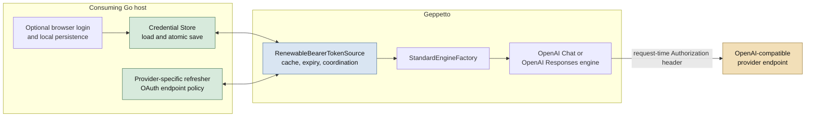
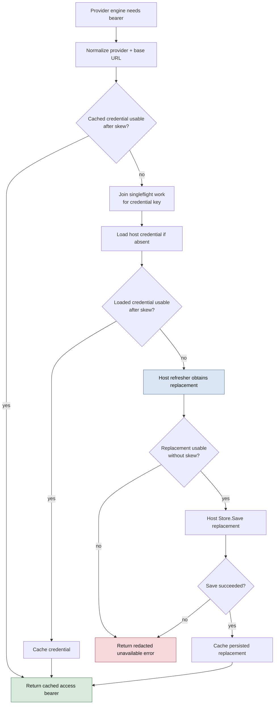
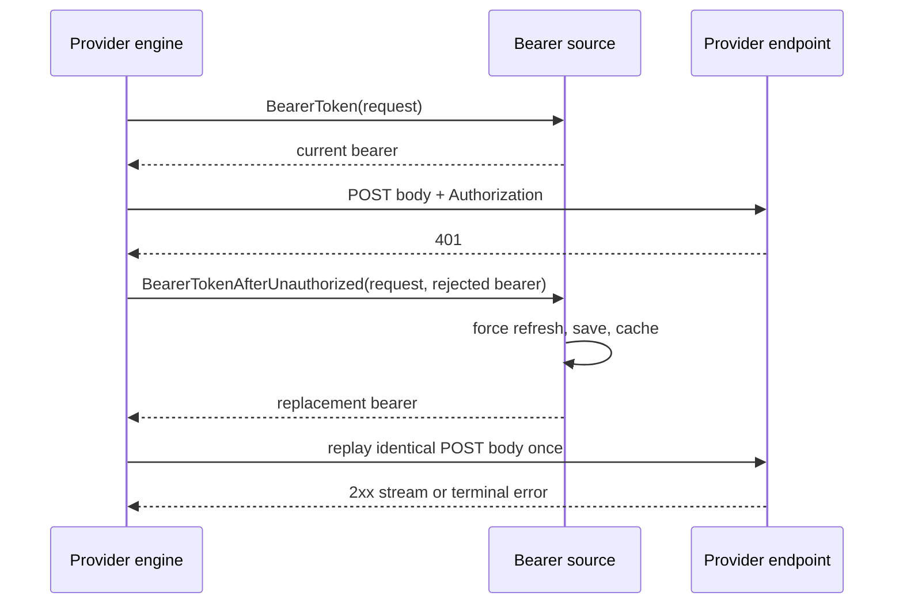

# Geppetto: Renewable Bearer Credentials and Host-Owned OAuth Refresh

Geppetto originally treated provider authentication as static configuration: an inference profile supplied a value in `InferenceSettings.API.APIKeys`, and an OpenAI-compatible engine placed that value in an outbound `Authorization` header. That model is appropriate for long-lived API keys. It fails when the value is an OAuth access credential with a finite lifetime. A running application eventually sends a credential that the provider rejects even though the application still has the information necessary to renew it.

The merged implementation changes the boundary rather than adding more fields to profile settings. Geppetto now accepts a host-owned `credentials.BearerTokenSource` at engine construction time. The source resolves a usable bearer immediately before an outbound OpenAI Chat or OpenAI Responses request. The reusable `RenewableBearerTokenSource` can load a host-stored credential, refresh it before expiry, persist rotated state, collapse concurrent refreshes, and perform one tightly bounded recovery after a pre-stream `401`. Geppetto does not own an OAuth browser flow, a refresh-token database, a vendor token endpoint, or profile persistence. Those remain responsibilities of the consuming host.

> [!summary]
> - Renewable credential state never enters `InferenceSettings`, profile API-key maps, JavaScript values, metadata, or logs.
> - A request-time source is authoritative when configured. Static API keys are used only when no source is present.
> - Refresh work is coordinated per provider and base URL, persists rotated state before caching it, and survives cancellation of an initiating waiter.
> - OpenAI Chat and Responses may replay exactly one pre-stream `401` only when the source explicitly implements the optional unauthorized-recovery interface.
> - JavaScript-created engines support the feature through a Go host registration option; JavaScript receives neither bearer strings nor refresh callbacks.

## 1. The problem: a static configuration value is not a credential lifecycle

The initial operational failure was ordinary but consequential. An OpenAI-compatible provider rejected a bearer held in a profile. Replacing the local value with a current host credential made normal inference and SSE streaming succeed. The provider route, model mapping, encrypted BYOK configuration, and stream parser were functioning. The failing assumption was that a profile value could represent an authentication relationship indefinitely.

An OAuth-backed access credential has a different lifecycle from an API key. It is issued at a particular time, often has a short expiry, may be revoked early, and may be paired with a refresh credential that rotates when used. A process handling inference must ask for a usable access credential at the point where it makes a provider request. It must not attempt to infer refresh policy from a copied string in a profile document.

The old configuration shape makes the mismatch visible:

```go
type APISettings struct {
    APIKeys            map[string]string
    BaseUrls           map[string]string
    AllowHTTP          map[string]bool
    AllowLocalNetworks map[string]bool
}
```

These maps are configuration data. They are merged between profile layers, cloned during resolution, inspected by diagnostics, and potentially serialized back to YAML. Adding `access_token`, `refresh_token`, or expiry fields would make renewable credentials part of those operations. Redaction would reduce some accidental disclosure, but it would not change the ownership model. The correct fix is to keep renewable state out of this structure entirely.

The report is about that boundary. It does not describe a generic OAuth implementation. It explains how Geppetto became able to *consume* a renewable bearer source while preserving host control of credential storage and provider policy.

## 2. The core ownership model

The implementation separates work between the host application, Geppetto, and the provider endpoint. Each layer has information and authority that the other layers should not acquire.



The host owns secrets and policy. It decides how credentials are encrypted, where they are stored, which provider endpoint is valid, what client configuration is permitted, and how an OAuth refresh response is interpreted. In the Pinocchio integration, the host also owns browser login and secure direct-YAML persistence. Another host can use a keychain, database, operating-system secret service, or a custom source implementation. Geppetto does not need to know which one.

Geppetto owns generic request-time mechanics. It identifies an outbound provider request using a non-secret `Provider` and `BaseURL` pair, asks the source for a bearer, adds the header after outbound URL validation, and applies the narrowly defined 401 recovery policy. It also provides a reusable cache-and-refresh implementation for hosts that want the standard behavior.

The provider endpoint owns authentication acceptance. It may accept a bearer, reject it before expiry, rotate refresh state, or return a response stream. Geppetto cannot make provider-specific decisions from a generic library package, so it defines the interfaces through which the host performs those decisions.

### 2.1 The non-negotiable invariant

The important rule is not merely “avoid printing tokens.” The stronger rule is:

```text
Renewable credential material is host-owned runtime state,
not inference configuration.
```

This rule excludes access credentials, refresh credentials, authorization codes, and client secrets from:

- `InferenceSettings.API.APIKeys`;
- engine-profile YAML and profile merge data;
- profile provenance and inspection output;
- engine metadata and observability payloads;
- JavaScript objects created by the Geppetto module;
- error wrapping that might copy host/provider response text;
- singleflight identifiers and persistent coordination keys.

The design makes the safe path easier to follow than a manual profile rewrite. A host creates a source once, injects it into a factory or native module registration, and leaves ordinary provider settings free to describe endpoint, model, and non-secret behavior.

## 3. The public contract is small on purpose

The main engine-facing contract lives in `pkg/steps/ai/credentials/bearer.go`:

```go
type Request struct {
    Provider string
    BaseURL  string
}

type BearerTokenSource interface {
    BearerToken(context.Context, Request) (string, error)
}
```

This interface is intentionally smaller than an OAuth client. It says only: given an execution context and a non-secret provider identity, return a bearer suitable for this request. A host that already has a credential cache can implement this interface directly. A host that wants Geppetto’s standard renewal behavior can use `RenewableBearerTokenSource`.

The companion types define the host-owned persistence and refresh boundary:

```go
type Credential struct {
    AccessToken  string
    RefreshToken string
    ExpiresAt    time.Time
}

type Store interface {
    Load(context.Context, Request) (Credential, error)
    Save(context.Context, Request, Credential) error
}

type Refresher interface {
    Refresh(context.Context, Request, Credential) (Credential, error)
}
```

A `Store` receives and returns a complete credential because a successful refresh may rotate the refresh credential as well as the access credential. A `Refresher` receives the previous credential because its implementation may need the previous refresh value. These interfaces are public, but their implementations remain host code. Geppetto does not open a token endpoint and does not load any fixed credential path.

### 3.1 Why `Request` uses provider plus base URL

Multiple OpenAI-compatible services can use the same provider type while requiring different credentials. A cache key based only on `openai` would merge identities that must remain separate. A model name is also wrong: models do not identify the endpoint or account that owns a credential.

The source normalizes the provider name, trims the base URL, and creates a local key from the pair:

```text
lowercase(trim(provider)) + NUL + trim(baseURL)
```

The key is internal process state. Hosts must use the same convention in their stores. A multi-account system that needs account identity in addition to provider/base URL should provide a custom source or a host-owned resolver; it should not overload user information into a URL or make JavaScript select identities.

### 3.2 Errors are categories, not copied provider messages

The built-in source returns `ErrUnavailable` when it cannot load, refresh, save, or validate a credential. Its error includes a provider and an operation category but not the original host error text.

```go
type ErrUnavailable struct {
    Provider  string
    Operation string
}
```

This matters because a provider adapter can accidentally include a bearer, refresh value, HTTP body, or authorization response in an ordinary Go error. Passing that error through layers of context wrapping would make a security boundary depend on every host adapter’s error hygiene. The generic source instead emits a stable, secret-free failure category. Chat and Responses preserve `context.Canceled` and `context.DeadlineExceeded` so callers can distinguish their own canceled work from a credential failure, but they do not propagate arbitrary source errors.

## 4. Engine construction: source authority and static compatibility

The `StandardEngineFactory` owns provider selection. It received an optional factory option:

```go
factory := enginefactory.NewStandardEngineFactory(
    enginefactory.WithBearerTokenSource(source),
)
engine, err := factory.CreateEngine(inferenceSettings)
```

The factory propagates the source to OpenAI Chat and OpenAI Responses engines. It does not send it to Claude or Gemini, which have separate authentication semantics and were intentionally outside the initial audit.

The source changes validation as well as construction. Previously, the factory rejected an OpenAI-compatible engine lacking `<provider>-api-key`. Once a source is configured, this check would reject a correct runtime configuration before any source call could occur. The factory therefore accepts a missing static key when a non-nil source exists. Base-URL validation remains required where it was required before.

This creates an explicit precedence rule:

| Source configured? | Static key required? | Credential used for request |
| --- | ---: | --- |
| No | Yes, subject to existing Responses aliases | Static profile key |
| Yes | No | Source result only |

Source authority is a safety property. A fallback from a failed source to a stale profile key could silently send a revoked credential after the host intended renewal to be authoritative. The implementation instead fails the request if the configured source cannot return a usable bearer.

The direct provider constructors expose equivalent options:

```go
openai.NewOpenAIEngine(settings, openai.WithBearerTokenSource(source))
openai_responses.NewEngine(settings, openai_responses.WithBearerTokenSource(source))
```

The factory is the common application-level path. The direct options are useful for embeddings that build engines explicitly or for tests that focus on one provider implementation.

## 5. Request-time resolution: where the bearer is obtained

An access credential is not retrieved when a profile is loaded. It is retrieved immediately before an outbound request. This timing ensures the source sees the current expiry state and can refresh only when necessary.

The OpenAI Chat path in `pkg/steps/ai/openai/chat_stream.go` follows this order:

```text
resolve base URL
  -> compute chat-completions endpoint
  -> validate outbound URL and network policy
  -> ensure HTTP client
  -> source.BearerToken(ctx, Request) or static-key lookup
  -> construct request
  -> set Authorization header
  -> perform request
```

The outbound URL is validated before source lookup. This ordering prevents an untrusted endpoint configuration from causing a host source to release a bearer to an endpoint that has not passed the configured outbound-network policy.

The Chat resolver has two paths:

```go
if source != nil {
    token, err := source.BearerToken(ctx, credentials.Request{
        Provider: string(apiType),
        BaseURL:  baseURL,
    })
    // preserve cancellation/deadline; otherwise return a redacted error
    return token, nil
}
return staticAPIKey(apiSettings, apiType)
```

OpenAI Responses has an independent request path and therefore an independent resolver in `pkg/steps/ai/openai_responses/provider_settings.go`. It normalizes `openai`, `openai-responses`, and `open-responses` aliases to the canonical Responses identity before querying the source. This is essential: Chat and Responses must not accidentally address the same endpoint with different cache identities merely because profile configuration used an alias.

## 6. The normal request path: cache first, refresh only when needed

A source must run for every provider request, but an OAuth token endpoint must not. The normal operation is a local cache lookup and time comparison.

A credential is usable when it has an access value and either has no expiry or expires after `now + skew`:

```go
func (c Credential) Usable(now time.Time, skew time.Duration) bool {
    if strings.TrimSpace(c.AccessToken) == "" {
        return false
    }
    return c.ExpiresAt.IsZero() || now.Add(skew).Before(c.ExpiresAt)
}
```

The default skew is thirty seconds. It treats a credential close to nominal expiry as unusable before an inference request reaches the provider. Hosts with high latency, significant clock drift, or unusually short access lifetimes can choose another skew through `credentials.WithRefreshSkew`.



The important persistence ordering is `refresh -> validate -> save -> cache`. It prevents a process from using a newly refreshed access credential while losing a rotated refresh credential on restart. If `Save` fails, the source returns a redacted error and does not cache the replacement. A later call may try the host-managed refresh again; it does not continue using state known not to be durable.

### 6.1 Singleflight is about a logical credential identity

Many inference requests can discover an expired credential simultaneously. A mutex protects the cache map itself, but it does not prevent each caller from independently starting a refresh after observing the same expired value. `singleflight.Group` supplies that second property.

All callers for the same normalized provider/base-URL key wait for one load/refresh/save operation. The leader rechecks cache state after joining the group because another caller may have completed work between the initial cache read and leadership. The result is one refresh and one durable save per shared expiry event instead of a refresh stampede.

### 6.2 Caller cancellation does not cancel shared durable work

The merged implementation hardened an important concurrency detail after review. A caller waiting for a bearer should be able to stop waiting if its request context is canceled. That cancellation must not abort the shared operation that other callers joined.

The source starts shared load/refresh/save work with `context.WithoutCancel(ctx)`, then lets each caller select between its own `ctx.Done()` and the shared singleflight result:

```go
result := s.refreshGroup.DoChan(key, func() (any, error) {
    return s.loadOrRefresh(context.WithoutCancel(ctx), key, request)
})

select {
case <-ctx.Done():
    return "", ctx.Err()
case response := <-result:
    return accessFrom(response)
}
```

This is a precise split of responsibility. The caller owns its wait. The source owns the shared state transition: loading, refreshing, persisting, and caching a credential. A canceled waiter returns cancellation, while a concurrent caller can still receive the durable result.

The design does not promise that shared work is unbounded. `context.WithoutCancel` removes the initiating caller’s cancellation signal; the host’s store and refresher still need their own appropriate timeouts and resource bounds. That is the correct place for refresh-operation policy because it belongs to the host integration.

## 7. A rejected bearer is different from an expired bearer

Expiry is a prediction based on stored time. A provider can reject an apparently valid bearer before the recorded expiry because a token was revoked, superseded, or invalidated by provider-side policy. The normal cache path will return that bearer again unless the source receives evidence that it was rejected.

The implementation therefore adds a distinct optional interface:

```go
type UnauthorizedBearerTokenSource interface {
    BearerTokenSource
    BearerTokenAfterUnauthorized(
        context.Context,
        Request,
        string, // rejected bearer, process memory only
    ) (string, error)
}
```

The separation is deliberate. Ordinary `BearerTokenSource` implementations do not automatically become eligible for a replay. Static-key wrappers, custom sources without forced-refresh semantics, and unsupported provider paths do not gain retry behavior merely because they satisfy the base interface.

### 7.1 The bounded recovery algorithm

Chat and Responses use the extension only after the first HTTP `401`, only before returning a successful response or SSE event, and only once. They reuse the marshalled request body for the replay.

```text
send request with source bearer
  -> non-401 response: follow ordinary success/error path
  -> first 401 and source supports unauthorized recovery:
       close first response body
       ask source for a replacement based on rejected bearer
       replay the same request bytes once
  -> otherwise: return provider error
```



A second `401` is returned as an error. The engine never starts a third request. It does not retry after a successful response exists, and it does not retry after streaming output has been exposed. Those boundaries are necessary because an inference operation can carry cost or side effects. The feature is a recovery for a known stale-credential condition, not a general HTTP retry framework.

### 7.2 Forced refresh must distinguish rejected values

A forced refresh has a more subtle coordination requirement than ordinary expiry. Two callers may reach the same provider/base URL but hold different rejected bearers. They must not necessarily share one forced refresh result: one caller may be reporting an old bearer while another reports a newer value that became invalid independently.

The source constructs a forced-refresh singleflight key from the credential identity and an ephemeral keyed HMAC fingerprint of the rejected bearer. The random HMAC key is generated per source instance, remains only in process memory, and is never logged or persisted.

```text
normal refresh coordination key:
  provider + base URL

forced refresh coordination key:
  provider + base URL + "unauthorized" + HMAC(process-random-key, rejected bearer)
```

This solves two problems at once. Calls that rejected the same bearer coalesce. Calls that rejected different bearers remain independent. The implementation does not use an unkeyed SHA-256 digest of the bearer, because a reusable unkeyed digest is an unnecessary credential-derived identifier and was flagged during security review. The HMAC result is only an opaque, per-process coordination value.

The source compares bearer values with `subtle.ConstantTimeCompare` when deciding whether a cached value differs from the rejected one. The code does not claim to turn a local process comparison into a remote timing defense; the constant-time comparison keeps the secret-handling discipline explicit and avoids a casual equality path around credentials.

## 8. JavaScript support: configure in Go, build in JavaScript

The first implementation deliberately did not expose renewable credentials to the Goja JavaScript module. That was an omission in construction plumbing, not a reason to pass a bearer string or refresh callback into JavaScript.

The JavaScript builder already supports a valuable declarative path:

```javascript
const engine = require("geppetto")
  .engine()
  .inference(resolvedSettings)
  .build();
```

Its old `build()` method cloned settings, applied provider defaults, and called `factory.NewEngineFromSettings(settings)`. That helper creates a standard factory with no options, so JavaScript-created engines could not receive a host bearer source. Requiring hosts to prebuild every engine in Go would preserve safety but would unnecessarily bypass the existing profile-to-engine JavaScript flow.

The merged solution adds a Go-only registration option:

```go
geppetto.Register(registry, geppetto.Options{
    BearerTokenSource: source,
    // Other host-owned registries and services.
})
```

`Options.BearerTokenSource` is copied into a private `moduleRuntime` field. The builder then chooses the original helper for a nil source or a source-aware standard factory for a non-nil source:

```go
func (m *moduleRuntime) newEngineFromSettings(
    settings *aistepssettings.InferenceSettings,
) (engine.Engine, error) {
    if m.bearerTokenSource == nil {
        return enginefactory.NewEngineFromSettings(settings)
    }
    return enginefactory.NewStandardEngineFactory(
        enginefactory.WithBearerTokenSource(m.bearerTokenSource),
    ).CreateEngine(settings)
}
```

No method, property, metadata entry, callback, or selector is exported to JavaScript. JavaScript receives an engine wrapper exactly as before. The Go host retains the source capability and decides which account it represents.

This design was tested with the same OpenAI profile containing an explicitly empty API-key map. A native module registered with a non-nil host source builds the engine successfully. A zero-value module options struct using the same profile fails with the existing missing-static-key validation. The test also asserts that neither the module export object, engine wrapper, nor engine metadata carries a bearer-source property.

The result is an important extension rule: if a future product needs multiple identities, it must introduce a host-authorized resolver or separate module runtimes. It must not add a script-visible source selector that lets arbitrary JavaScript discover or choose credential capabilities.

## 9. Security decisions that shaped the implementation

The code is compact compared with the number of decisions it encodes. The following table maps each decision to the failure it prevents.

| Decision | Failure prevented | Concrete implementation |
| --- | --- | --- |
| Keep credentials out of settings | Secrets copied, merged, inspected, or serialized as profile data | Runtime `BearerTokenSource` option, not `APISettings` fields |
| Source is authoritative | Silent fallback to a stale static key after renewal failure | Factory and resolvers use static keys only when source is nil |
| Validate URL before source lookup | Source releases bearer for an unvalidated endpoint | Chat validates computed outbound URL before `BearerToken` |
| Save before cache | Rotated refresh state lost after restart | `Store.Save` precedes `putCached` |
| Singleflight by endpoint identity | Refresh stampede for one expired credential | `singleflight.Group` keyed by provider/base URL |
| `WithoutCancel` for shared work | One canceled caller aborts all waiters | Individual wait select; shared operation detached from waiter cancellation |
| Optional 401 extension | All credential sources become retry-capable by accident | `UnauthorizedBearerTokenSource` is separate from base interface |
| One pre-stream replay | Repeated requests, duplicate cost, or post-output corruption | First 401 only, byte-identical body, second 401 terminates |
| Keyed ephemeral fingerprint | Rejected bearer becomes a reusable digest/loggable coordination key | Per-source random HMAC key |
| Go-only JS injection | Tokens/callbacks become script-observable | `Options.BearerTokenSource`, private runtime field, no JS export |

These decisions should be evaluated together. For example, a design that caches refreshed access credentials but writes refresh rotation asynchronously would fail the persistence invariant. A design that uses a generic `Retry()` interface but does not distinguish pre-stream output would fail the bounded-replay invariant. The system stays understandable because each boundary is named and tested.

## 10. Implementation map and reading order

A new contributor should read the source in the order that the system executes it.

### 10.1 Credential core

```text
pkg/steps/ai/credentials/bearer.go
pkg/steps/ai/credentials/bearer_test.go
```

Start here. The file defines the public contracts, `Credential.Usable`, the cache, normal refresh coordination, forced refresh after rejection, redacted errors, and the keyed fingerprint. The tests document cache hits, expiry refresh, persistence ordering, concurrent callers, caller cancellation, forced refresh, and error redaction.

### 10.2 Provider request construction

```text
pkg/steps/ai/openai/engine_openai.go
pkg/steps/ai/openai/chat_stream.go
pkg/steps/ai/openai/chat_stream_test.go
pkg/steps/ai/openai_responses/provider_settings.go
pkg/steps/ai/openai_responses/streaming.go
pkg/steps/ai/openai_responses/provider_settings_test.go
```

These paths show where a request becomes an HTTP operation. Read the source resolver before the header-setting code. Then read the 401 loop and its tests. Confirm that the source path and static path are mutually exclusive and that error paths do not expose values returned by the host source.

### 10.3 Construction and factory validation

```text
pkg/inference/engine/factory/factory.go
pkg/inference/engine/factory/helpers.go
```

The factory records the construction-level source option and determines which provider implementations consume it. It also explains why source presence permits absent static keys without weakening the no-source path.

### 10.4 JavaScript host integration

```text
pkg/js/modules/geppetto/module.go
pkg/js/modules/geppetto/api_engine_builder.go
pkg/js/modules/geppetto/api_engine_builder_test.go
pkg/doc/playbooks/08-use-renewable-bearer-credentials.md
```

These files show the Go-only module option, private runtime copy, source-aware build helper, and no-exposure regression tests.

## 11. Validation evidence and implementation history

The work was developed in focused commits and later review hardening commits. The key implementation sequence is:

| Commit | Contribution |
| --- | --- |
| `8ac6832e` | Added the renewable bearer source, factory wiring, Chat/Responses request-time resolution, and initial concurrency/redaction tests |
| `7d873d1d` | Added the optional pre-stream 401 forced-refresh and one-replay behavior |
| `54425ed5` | Preserved `context.Canceled` and `context.DeadlineExceeded` from bearer-source resolution |
| `669a193e` | Isolated concurrent normal and forced refresh work from initiating caller cancellation and separated rejected bearer coordination |
| `8e674e9f` | Replaced an unkeyed rejected-bearer digest with a process-local keyed HMAC fingerprint |
| `13621922` | Added Go-host bearer injection for JavaScript-created engines |
| `f962653d` | Added JavaScript source/no-source and non-exposure regression coverage |
| `351f5cbb` | Published host-registration guidance for the JavaScript path |

Focused normal and race suites passed for the credential, Chat, Responses, factory, and JavaScript changes. Repository pre-commit checks passed full tests and lint. Pre-push security and vulnerability hooks passed; the hook used `GOWORK=off` for isolated security/vulnerability validation.

Two baseline conditions were recorded rather than hidden:

- A full repository race run previously exposed an unrelated race in `pkg/js/runtime.TestNewRuntime_DefaultJSEventsInitializerLogsListenerErrors`, involving concurrent buffer access through logging. The changed credential packages passed their focused race tests.
- An earlier toolchain-selected Go version was affected by a standard-library TLS advisory reported by `govulncheck`; rerunning under Go 1.26.5 reported no called vulnerabilities. The feature did not change the repository toolchain manifest.

This distinction matters in a technical report. A focused pass is evidence for the code under review. It is not evidence that every unrelated package is race-free.

## 12. Failure modes and operational guidance

### 12.1 Missing or malformed credential identity

An empty provider is rejected before the store or refresher runs. Hosts should treat provider and base URL as non-secret routing data and should avoid user information or credentials embedded in URLs.

### 12.2 Expired, absent, or near-expiry credential

The source loads from the host store and refreshes only if the loaded credential is unusable after skew. A host store should make `Load` and `Save` atomic with respect to its own storage medium. The source guarantees only the order in which it invokes them.

### 12.3 Refresher returns unusable state

A replacement without an access bearer or one already expired is rejected. The source does not save or cache it. This avoids turning an incomplete provider response into a persistent broken state.

### 12.4 Store save fails after refresh

The refreshed value is not cached. This protects refresh-token rotation. A host may observe an `ErrUnavailable` category and handle the operational failure according to its own UI or retry policy, but it does not receive credential text through Geppetto’s error path.

### 12.5 Provider returns 401

A first pre-stream `401` can trigger one forced refresh only for an `UnauthorizedBearerTokenSource`. The second request either succeeds or follows the normal HTTP error path. A static key never receives this replay behavior through the generic source mechanism.

### 12.6 Request cancellation

A canceled request returns promptly from its own `BearerToken` wait. The shared refresh may still finish and cache/persist a replacement for another request. Hosts should bound refresh network activity independently rather than relying on an inference request’s context to terminate shared durable work.

### 12.7 Source is present for unsupported providers

The factory consumes the source only for the OpenAI-compatible branches audited in this work. Claude, Gemini, embeddings, transcription, and other request paths require separate protocol and replay analysis before they can claim equivalent support.

## 13. What this project intentionally did not build

The library does not provide:

- a universal provider OAuth flow;
- an OAuth browser callback listener;
- provider client IDs or secrets;
- a Geppetto-owned credential database;
- refresh-token fields in profile YAML;
- static-key fallback after a configured source fails;
- unbounded retries;
- retry after an SSE event or other response output is exposed;
- script-visible bearer values, source callbacks, or identity selectors;
- automatic support for every provider and every OpenAI-related HTTP endpoint.

These omissions reduce the chance that a generic inference package becomes an accidental secret store or a partial OAuth client with unclear operational ownership.

## 14. A host integration sequence

A host should assemble the feature in the following order.

1. Define secure storage for the credential lifecycle. The store must atomically retain a rotated refresh credential together with its replacement access credential and expiry.
2. Implement provider-specific refresh logic in a `Refresher`. It should make a TLS request to a host-selected endpoint, parse only the values it needs, and return secret-free errors.
3. Construct a `RenewableBearerTokenSource` or another `BearerTokenSource` implementation.
4. Resolve ordinary non-secret inference settings from profiles. Do not copy credential values into API-key maps.
5. Pass the source to `StandardEngineFactory` or, for a Goja host, to `geppetto.Options.BearerTokenSource` at module registration.
6. Test normal cache use, proactive refresh, rejected-bearer replay, persistence failure, and cancellation with a fake/local provider endpoint.
7. Add metrics and user-facing recovery behavior in the host, not by exposing token diagnostics from the library.

The construction code is short because the detailed work remains in the host’s storage and refresher adapters:

```go
source, err := credentials.NewRenewableBearerTokenSource(store, refresher,
    credentials.WithRefreshSkew(45*time.Second),
)
if err != nil {
    return err
}

factory := enginefactory.NewStandardEngineFactory(
    enginefactory.WithBearerTokenSource(source),
)
engine, err := factory.CreateEngine(resolved.FinalInferenceSettings)
```

For a JavaScript host, replace direct factory construction with registration-time injection. The JavaScript program still works with resolved settings and engine wrappers; it never handles a credential value.

## 15. The technical lesson

Bearer refresh is not primarily an HTTP-header problem. The header is the last step in a chain of ownership, persistence, concurrency, and retry decisions. A correct implementation must answer all of the following before it sends the first request:

- Who owns refresh credentials and provider refresh policy?
- Which values are configuration, and which are runtime secret state?
- What identifies one logical credential cache entry?
- When does a cached value become unusable?
- What happens when many requests discover expiry together?
- Can one canceled request interrupt state work that other requests need?
- When is a provider rejection safe enough to retry?
- How does a forced refresh distinguish two rejected values without recording them?
- Which runtime boundaries must not receive source capability at all?

Geppetto’s answer is narrow and composable. It owns request-time consumption and generic coordination. The host owns OAuth state and provider policy. The source boundary is explicit in Go APIs, provider integration, factory validation, JavaScript registration, tests, and documentation. That consistency is what makes renewable bearer credentials maintainable after the original stale-token incident has been forgotten.

## References and source material

### Primary implementation and ticket evidence

- `/home/manuel/workspaces/2026-07-10/refresh-oauth-token-geppetto/geppetto/pkg/steps/ai/credentials/bearer.go` — credential contracts, renewable source, cache, cancellation semantics, forced refresh, and keyed fingerprint.
- `/home/manuel/workspaces/2026-07-10/refresh-oauth-token-geppetto/geppetto/pkg/steps/ai/credentials/bearer_test.go` — unit and concurrency regression coverage.
- `/home/manuel/workspaces/2026-07-10/refresh-oauth-token-geppetto/geppetto/pkg/steps/ai/openai/chat_stream.go` — Chat URL validation, request-time resolution, header injection, and bounded 401 replay.
- `/home/manuel/workspaces/2026-07-10/refresh-oauth-token-geppetto/geppetto/pkg/steps/ai/openai_responses/provider_settings.go` — Responses source/static resolution and canonical provider identity.
- `/home/manuel/workspaces/2026-07-10/refresh-oauth-token-geppetto/geppetto/pkg/inference/engine/factory/factory.go` — factory source propagation and source-aware validation.
- `/home/manuel/workspaces/2026-07-10/refresh-oauth-token-geppetto/geppetto/pkg/js/modules/geppetto/module.go` — Go-only native-module option.
- `/home/manuel/workspaces/2026-07-10/refresh-oauth-token-geppetto/geppetto/pkg/js/modules/geppetto/api_engine_builder.go` — source-aware JavaScript engine construction.
- `/home/manuel/workspaces/2026-07-10/refresh-oauth-token-geppetto/geppetto/pkg/js/modules/geppetto/api_engine_builder_test.go` — JS source/no-source and non-exposure behavior.

### Design and diary records

- `ttmp/2026/07/10/GEPPETTO-REFRESHABLE-CREDENTIALS-387--refreshable-bearer-credentials-for-openai-compatible-providers/design-doc/01-refreshable-bearer-credential-source-analysis-design-and-implementation-guide.md`
- `ttmp/2026/07/10/GEPPETTO-REFRESHABLE-CREDENTIALS-387--refreshable-bearer-credentials-for-openai-compatible-providers/reference/01-implementation-diary.md`
- `ttmp/2026/07/13/GEP-JS-RENEWABLE-BEARER-INJECTION--host-owned-renewable-bearer-sources-for-javascript-engines/design-doc/01-host-owned-renewable-bearer-source-injection-for-javascript-engines.md`
- `ttmp/2026/07/13/GEP-JS-RENEWABLE-BEARER-INJECTION--host-owned-renewable-bearer-sources-for-javascript-engines/reference/01-investigation-diary.md`
- [Geppetto issue #387](https://github.com/go-go-golems/geppetto/issues/387) — tracking issue for refreshable bearer credentials.
