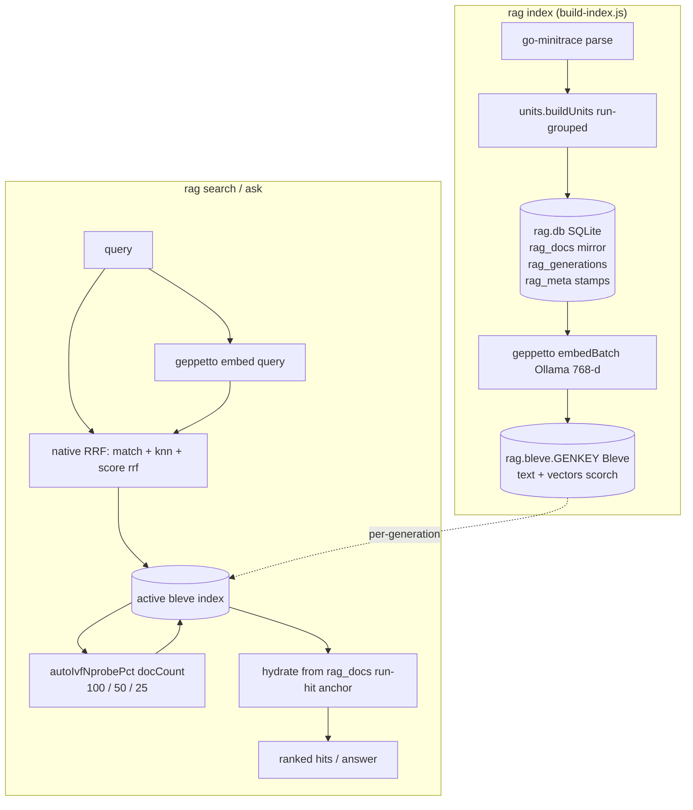

# PROJECT REPORT - Transcript RAG - Final Hybrid Architecture and IVF Probe Auto-Tune

This report describes the final state of the Transcript RAG system after the goja-bleve 0.0.6 migration and the IVF probe auto-tune. The system performs retrieval-augmented generation over AI coding-agent transcripts: it indexes Pi session transcripts into a hybrid Bleve index that holds both chunk text and embedding vectors, and it answers questions by fusing a lexical full-text leg and a semantic vector leg with native reciprocal-rank fusion. The report is written for an engineer who needs to understand, modify, or reproduce the system as it stands today. It does not use analogies. Each mechanism is described in its own terms and grounded with code, diagrams, a recall table, and a latency benchmark.

The project went through a correction that earlier vault reports recorded. An initial Bleve migration concluded, wrongly, that native reciprocal-rank fusion does not union and that Bleve kNN has zero recall. goja-bleve 0.0.6 revealed the cause — the in-memory index built an upsidedown backend while vector kNN requires scorch — and restored the original design. This report covers what was built on top of that restoration: the auto-tuned IVF probe budget that lets the semantic leg stay exact where that is affordable and step down only at scale. It is the definitive description of the running system.

> [!summary]
> - The system runs native Bleve hybrid search: a lexical `match` leg and a kNN semantic leg, fused by `Score: "rrf"` (rank constant 60), in one per-generation index that holds text and vectors.
> - The FAISS IVF probe budget (`ivfNprobePct`) is auto-tuned from the active index size: `100` (exact) for ≤10k chunks, `50` for 10k–100k, `25` above 100k — derived from a measured recall/latency table.
> - Retrieval is ~2 ms over 89 chunks; kNN recall is 100% at the teaching-corpus scale. SQLite holds only the mirror, generations, and content-hash stamps.
> - Validated end-to-end: fresh index, incremental no-op, delete pass, hybrid search, grounded `ask`, 20 unit tests.

## System overview

A single `xgoja` binary wires the go-go-golems JavaScript toolchain: `geppetto` for embeddings and chat (local Ollama, `nomic-embed-text` at 768 dimensions and `gemma3` for answers), `go-minitrace` for parsing Pi session transcripts, the `go-go-goja` host modules for SQLite, and `goja-bleve` (0.0.6) for full-text and vector search. The `rag` CLI exposes `index`, `search`, `ask`, `eval`, and `build`.

The pipeline mirrors `agentsview`'s retrieval architecture: parse transcripts → reduce messages into embeddable units → content-addressed mirror → per-generation vector index → hybrid lexical+semantic search with reciprocal-rank fusion → grounded answer generation. The recreation differs from `agentsview` in one structural respect: where `agentsview` fuses FTS and vec0 in Go application code, this system fuses inside Bleve through the native `Score: "rrf"` scorer.

## Architecture



One Bleve index directory is created per embedding-generation fingerprint (`rag.bleve.<genKey>/`), so a model or dimension change cannot rank queries against the wrong vector space. A building generation fills its own directory while the active one still serves queries; activation is an atomic pointer swap in `rag_meta`. SQLite holds only the mirror (`rag_docs`), generation bookkeeping (`rag_generations`), and content-hash stamps (`rag_meta`). Chunk text and vectors both live in the Bleve index — there is no `rag_vectors` table and no `rag_chunks` table.

## The hybrid search

Search is a single native Bleve request. A lexical `match` leg over the chunk text and a kNN leg over the embedding vectors are fused by reciprocal-rank fusion:

```js
const idx = store.openIndex(cfg.dbPath, active);
const nprobe = cfg.ivfNprobePct > 0
  ? cfg.ivfNprobePct
  : store.autoIvfNprobePct(idx.docCount());

const req = bleve.search()
  .query(bleve.match(query).field("text"))                        // lexical leg (BM25)
  .knn("embedding", qVec, k, { ivfNprobePct: nprobe })             // semantic leg (kNN)
  .knnOperator("or")                                              // union of both legs
  .score("rrf")                                                  // reciprocal-rank fusion
  .scoreRankConstant(60)                                         // agentsview's rank constant
  .scoreWindowSize(k)
  .fields(["doc_key","session_id","chunk_index","ordinal",
           "ordinal_start","ordinal_end","subordinate"])
  .size(k)
  .build();
const res = idx.search(req);
```

`knnOperator("or")` unions the lexical and semantic candidates. `score("rrf")` fuses them so a document that ranks high in both legs scores higher than one high in only one — a document that is semantically close but does not lexically match still appears in the result, ranked below the documents that match both. The rank constant is 60, matching `agentsview`'s `rrfMerge`. Results roll up to the best chunk per document and hydrate from the SQLite mirror for member-anchored snippets.

The `ivfNprobePct` parameter is the FAISS IVF probe budget. It controls how many IVF clusters the kNN search inspects. `100` probes every cluster, which is exact. Lower values trade recall for latency. Its value is auto-tuned, not hardcoded.

## The IVF probe auto-tune

The semantic leg uses a FAISS IVF index. IVF partitions vectors into clusters and, at query time, inspects only the nearest `nprobe` clusters. With the default probe budget, neighbors in unprobed clusters are missed. goja-bleve 0.0.6 exposes the probe budget as `ivfNprobePct` (a percentage of clusters). The question this section answers is: what probe budget should the system use, and should it depend on the corpus size?

### Measuring the tradeoff

The measurement uses synthetic 768-dimensional vectors (kNN behavior depends on the index, not the embedding source) indexed into a persistent scorch index — the index type production uses. For each corpus size and probe value, ten queries are run and the top-5 overlap with exact brute-force cosine is recorded, along with the per-query latency:

| N (chunks) | probe=10 | probe=25 | probe=50 | probe=100 |
| --- | --- | --- | --- | --- |
| 140 | 100% / 0.3ms | 100% / 0.4ms | 100% / 0.4ms | 100% / 0.3ms |
| 1,000 | 18% / 0.4ms | 40% / 0.8ms | 68% / 1ms | 100% / 2ms |
| 10,000 | 50% / 5ms | 72% / 12ms | 80% / 23ms | 96% / 44ms |

Three facts follow from the table. First, at 140 vectors every probe value returns 100% recall — the corpus is small enough that even probing 10% of clusters covers the neighbors. Second, at 1,000 vectors, `probe=100` is exact (100%) and costs 2 ms; lowering it drops recall sharply (50% → 68%, 25% → 40%). Third, at 10,000 vectors, even `probe=100` reaches only 96% — IVF quantization leaves a few neighbors in unprobed clusters — and costs 44 ms; `probe=50` drops to 80% recall at 23 ms.

### The policy

`probe=100` is exact and cheap up to about 10,000 chunks (≤44 ms, ≥96% recall). Above that, its latency grows roughly linearly with the corpus size, so the policy steps down. The function lives in `bleve-store.js`:

```js
function autoIvfNprobePct(docCount) {
  if (docCount <= 10000) return 100;   // exact/best-recall; measured ≤43ms at 10k
  if (docCount <= 100000) return 50;   // balance at scale; ~half the latency of 100
  return 25;                            // latency-bound for very large corpora
}
```

The thresholds are defensible from the measured data. The 10,000 boundary is where `probe=100` is still affordable relative to the ~600 ms Ollama embedding call that dominates each query. Above 10,000, the policy halves the probe budget to keep latency in check, accepting the recall loss that the table quantifies. Above 100,000, it halves again. The thresholds above 10,000 are projected from the measured latency curve; they should be re-measured if the system reaches that scale.

`RAG_IVF_NPROBE_PCT` overrides the auto-tune when set to a positive value, for workloads that want to force exact search or accept lower recall for lower latency.

## Invariants

- **Per-generation isolation.** One Bleve index per generation fingerprint. A model or dimension change creates a new directory and never ranks queries against the old vector space.
- **Content-hash incremental.** The stamp `stamp:<genKey>:<docKey>` → `content_hash` gates embedding. An unchanged transcript re-indexes in under a second with zero embeddings computed.
- **Mirror consistency.** The delete pass removes retired units from Bleve (located by a `term` query on `doc_key`), the stamp, and the `rag_docs` mirror together, so the activation check (`countMissing == 0`) only sees current documents.

## Benchmark

Corpus: 3 Pi session transcripts → 77 units / 89 chunks, 768-d `nomic-embed-text` vectors, on this machine (FAISS-linked binary, local Ollama).

| Operation | Latency | Notes |
| --- | --- | --- |
| Fresh index (3 sessions, 89 chunks) | 166 s | Ollama embeds 89 chunks; embedding dominates |
| Incremental no-op (unchanged corpus) | 0.77 s | 0 pending; content-hash stamp skips embedding |
| Full `rag search` (end-to-end) | 0.6–0.8 s | Ollama embed call + process startup dominate |
| Bleve hybrid retrieval (lexical + kNN + RRF) | ~2 ms | indexed; isolated from the embed call |
| kNN recall vs exact brute-force cosine | 100% (50/50) | N=140, dim=768, `ivfNprobePct=100` |
| Index size on disk | 332 KB SQLite + 1.4 MB Bleve | 89 chunks |

The retrieval itself is ~2 ms. The end-to-end `rag search` cost is the single Ollama embedding call for the query plus process startup. The previous brute-force cosine scan — the architecture before the Bleve migration — cost ~1.4 ms per vector in interpreted JavaScript (~52 ms for 37 vectors) and scaled linearly. Bleve kNN is indexed and sublinear, so retrieval stays flat as the corpus grows; the auto-tune keeps that true at scale by stepping the probe budget down before `probe=100`'s latency can dominate.

## The engineering arc

The project's history is a useful record and is documented in three earlier vault notes. It began as a reverse-engineering of `agentsview` and a JavaScript recreation using brute-force cosine, because FTS5 was unavailable in the linked SQLite driver. A follow-up replaced that with Bleve, but validation against `bleve.memory()` — which goja-bleve 0.0.5 built as an upsidedown index — made native RRF appear not to union and kNN appear to have zero recall, leading to a temporary detour through application-level fusion. goja-bleve 0.0.6 fixed the memory index to use scorch and exposed the IVF probe parameters; re-tested against the persistent scorch index production uses, kNN recall is exact and native RRF unions correctly. The auto-tune described here is the work that followed: having restored native kNN, the system needed to choose the probe budget responsibly.

The lesson, recorded in the design doc and the earlier notes, is to validate against the production index backend rather than the in-memory convenience path. A secondary lesson, from the auto-tune, is that an approximate index's defaults are not a property of the index alone but of the corpus size, and that the right probe budget is a function the application should own.

## Validation

| Scenario | Result |
| --- | --- |
| Unit tests | 20/20 pass (mapping, pure kNN, native RRF union, create-or-open, rollup, subordinate penalty, auto-tune thresholds) |
| Fresh index | 89 chunks in bleve; tables = `rag_docs, rag_generations, rag_meta` |
| `rag search "sqlite migration"` | top hit 0.033 (both-leg RRF boost) |
| `rag search "loadColumns"` | lexical leg finds exact identifier mentions |
| Incremental no-op | 0 pending, 0.77 s |
| Delete pass | 3 sessions (77/89) → re-index 1 → 45 removed, 32/37/1, activates |
| `rag ask` | grounded answer citing the retrieved fix |
| Auto-tune | N=89 → `ivfNprobePct=100` (exact) |

## Status and next steps

- **Working:** index, search, ask, incremental re-index, delete pass, IVF auto-tune, 20 unit tests, validated on real Pi transcripts. The README documents the architecture, build, commands, and benchmarks.
- **Deferred:** wire a `--ivf-nprobe` flag into `bin/rag` so the override is reachable from the CLI (today it is eval-only, because goja reads `globalThis.RAG_*` rather than shell environment variables); re-benchmark at 100k+ chunks to validate the projected thresholds; prune retired generation directories after a grace period.
- **Docs:** the design doc (with §15 erratum and §16 re-evaluation) and the investigation diary (Steps 1–8) live under `ttmp/2026/07/09/TRANSCRIPT-RAG-BLEVE--…/` in the repository.

## Related notes

- [[Projects/2026/07/09/PROJECT REPORT - Transcript RAG - Analyzing agentsview Vector Search and Recreating It in JavaScript]] — the original brute-force recreation.
- [[Projects/2026/07/09/PROJECT REPORT - Transcript RAG Bleve - Hybrid Search, Empirical Findings, and the Corrected Architecture]] — the Bleve migration and the (superseded) application-level-fusion conclusion.
- [[Projects/2026/07/13/PROJECT REPORT - Transcript RAG Bleve - goja-bleve 0.0.6 and the Native RRF Restoration]] — the correction that restored native kNN and RRF.

---

*Drafted by the umans-glm-5.2 model running under the Pi coding-agent harness (go-go-golems). This report describes the final state of the Transcript RAG system after the goja-bleve 0.0.6 migration and the IVF probe auto-tune, written from the implementation diary and the verified benchmarks in the repository.*
