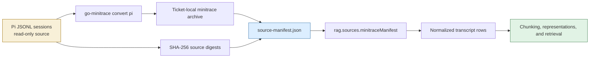
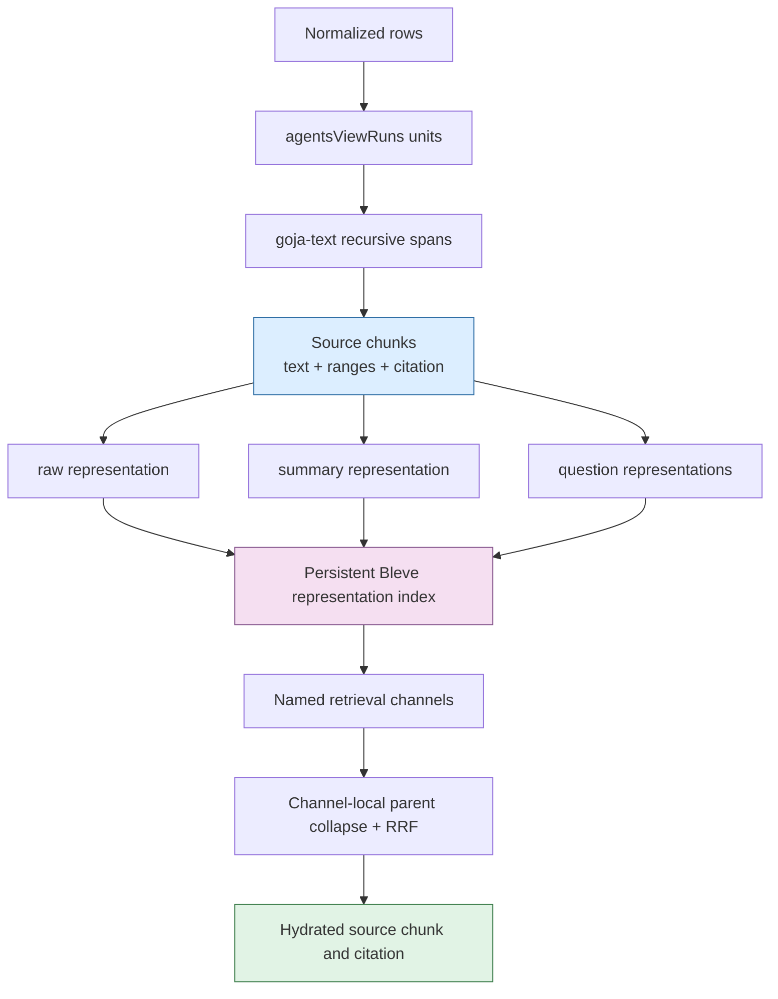

# Transcript RAG: Self-Contained Pi Corpus and Representation Retrieval

This report documents the current implementation of `/home/manuel/code/wesen/2026-07-09--transcript-rag-sol2`. The project has moved from a design for multi-representation transcript retrieval to a runnable, self-contained path: selected Pi session files are converted into a ticket-local normalized corpus, that corpus is chunked with goja-text, raw or generated representations are indexed as separate persistent Bleve documents, and retrieval returns the original transcript evidence with its citation metadata.

The central result is a boundary decision. The raw Pi JSONL files are the source of truth. `go-minitrace` creates a normalized archive, a manifest records the exact selected sources and their hashes, and all generated indexes and model caches live under the ticket-local ignored `work/` directory. The system does not depend on the neighboring transcript-RAG checkout, and it does not use a SQLite database as an authority for the corpus.

This article was written by GPT-5.6 - sol from the repository’s implementation, ticket design documents, diary, validation output, and Git history. It is an original technical analysis of the current implementation and its remaining experimental work.

> [!summary]
> - A Pi-session manifest now gives transcript RAG a reproducible, explicitly bounded real corpus: three sessions, 431 normalized rows, and source hashes.
> - The retrieval index stores representations, not opaque chunks. It searches named channels, collapses representation duplicates at a source parent, applies reciprocal-rank fusion, then hydrates the original source chunk for evidence.
> - The offline real-corpus run is complete and validates the full data path. The live 768-dimensional Ollama comparison is intentionally still pending; no retrieval-quality conclusion has been claimed.

## Why the corpus boundary had to change

Transcript RAG experiments are only comparable when they operate on the same input corpus. A development checkout, a temporary database, or a hand-selected mixture of files makes the experiment hard to reproduce because the input set can change without becoming visible in the result. The project therefore establishes an explicit ingestion contract before retrieval begins.

The source directory is the Pi sessions directory supplied for this experiment:

```text
~/.pi/agent/sessions/--home-manuel-code-gec-2026-03-16--gec-rag--/
```

Those JSONL files are read-only inputs. The ticket script `ttmp/2026/07/13/TRANSCRIPT-RAG-PI-INGESTION--self-contained-pi-session-ingestion-for-transcript-rag/scripts/01-build-gec-rag-corpus.sh` converts the entire chosen directory in one `go-minitrace convert pi` invocation. A single conversion matters because repeatedly converting one file at a time can leave an incomplete archive manifest. The script removes only its own generated output under the ticket’s `work/corpus` directory.

The output is a `transcript-rag-pi-corpus-manifest/v1` document. It names the selected source files, records a SHA-256 digest for each source, and enumerates the normalized minitrace archive paths. The manifest, not an implicit directory traversal, is the contract consumed by the experiment runner.



The manifest adapter lives in `scripts/playground/verbs/lib/rag.js` as `rag.sources.minitraceManifest(path)`. It validates the manifest schema, rejects duplicate archive paths, loads every archive through the existing minitrace reader, normalizes the rows, and sorts them by session and turn index. The companion verb in `scripts/playground/verbs/ingestion.js` checks that the corpus is nonempty and that every row has a session identifier and nonnegative integer turn index.

The completed corpus contains three sessions, 431 normalized turns, 39 user turns, and 392 assistant turns. These figures are not a claim about semantic quality; they are the fixed data facts to which every later experiment refers.

## The system has four distinct data levels

The easiest way to misunderstand this project is to call every object a “chunk.” The system has four separate data levels, and each level exists for a different reason.

| Level | Primary identity | Contents | Why it exists |
| --- | --- | --- | --- |
| Transcript row | Session ID + turn index | One normalized user or assistant turn | Preserves the original event order and role. |
| Conversation-aware unit | `unit:v1/...` | One user turn or an adjacent assistant run | Prevents chunk boundaries from arbitrarily merging unrelated conversational turns. |
| Source chunk | `chunk:v2/...` | Exact text with rune/byte ranges and citation fields | Defines the evidence that a result may cite. |
| Representation | `representation:v2/...` | Raw text, summary, or one synthetic question | Defines the text that can be searched and embedded. |

`rag.units.agentsViewRuns()` converts normalized rows into units. `rag.chunks.gojaTextRecursive({ maxRunes, overlapSpans })` then uses `require("chunking")` from released goja-text `v0.1.2` to split each unit along structured textual boundaries. The implementation carries session ID, ordinal range, byte offsets, rune offsets, text hash, and the exact source text into every source chunk.

That source chunk remains the evidence boundary even when later retrieval uses generated text. A summary can help a query match a passage. A synthetic question can describe likely query wording. Neither becomes a quotation from the original transcript.



## Why representations are indexed independently

The raw transcript is required for evidence and for exact terminology. It is not necessarily the best text for every query. A transcript passage may contain an implementation decision, failure diagnosis, command, and result without using the same language that a later user chooses. The project therefore derives multiple representations while preserving the source parent link.

The representation model has three implemented kinds:

- `raw` is the exact source-chunk text. It is evidence-bearing and keeps the original language available to lexical and vector retrieval.
- `summary` is a schema-validated, structured Geppetto generation rendered into compact search text. It captures decisions, problems, actions, artifacts, questions, and keywords.
- `question` stores one generated question per representation. This provides query-oriented wording without making generated text appear to be source evidence.

The important decision is to index one representation document per representation rather than concatenate raw text, summary text, and questions into one embedding input. Concatenation would hide which text caused a hit, make raw-only and summary-only experiments impossible, and let generated text change the meaning of an evidence record. Separate documents make the experiment inspectable.

```javascript
for (const sourceChunk of sourceChunks) {
  emitRepresentation({
    kind: "raw",
    parentChunkKey: sourceChunk.key,
    text: sourceChunk.text,
    evidence: true,
  });

  const summary = await cachedSummarizer.summarize(sourceChunk);
  emitRepresentation({ kind: "summary", parentChunkKey: sourceChunk.key, text: render(summary) });

  for (const [ordinal, question] of summary.questions.entries()) {
    emitRepresentation({ kind: "question", ordinal, parentChunkKey: sourceChunk.key, text: question });
  }
}
```

The pseudocode illustrates the relationship, not an unconditional execution policy. A raw-only experiment never constructs the summarizer. This is significant because the baseline must not pay model-generation cost that belongs only to generated-representation variants.

## The persistent representation index

The adapter in `scripts/playground/verbs/lib/bleve-rag.js` creates a persistent Scorch index through `require("bleve")`. Its mapping disables dynamic fields and explicitly stores retrieval and provenance fields:

```text
text                    full-text searchable and stored
representationKind      keyword filter: raw | summary | question
parentChunkKey          keyword
parentUnitKey           keyword
sessionId               keyword
ordinalStart/End        stored citation fields
anchorOrdinal           stored citation field
textHash                provenance field
generatorFingerprint    provenance field
embedding               cosine vector, configured dimensions
```

The design does not treat lexical and vector retrieval as one opaque mode. A channel name encodes both a representation kind and a search mode:

```text
raw.lexical       raw transcript text with full-text matching
raw.vector        raw transcript text with KNN matching
summary.lexical   rendered summaries with full-text matching
summary.vector    rendered summaries with KNN matching
question.lexical  generated questions with full-text matching
question.vector   generated questions with KNN matching
```

Each channel applies an exact `representationKind` filter. For vector retrieval, the adapter calls `knnWithFilter("embedding", vector, window, filter, 1.0)`. This is an important correctness condition. A summary-only channel must not accidentally return raw documents because the vector query ignored the representation filter.

### Retrieval sequence

The retrieval operation has four stages. Separating them makes the ranking policy visible and avoids a common representation-multiplicity error.

1. Search each requested channel independently with an overfetch window.
2. Within each channel, keep the first hit for each collapse key. The key is either `parentChunkKey` or `parentUnitKey` according to the experiment.
3. Add one reciprocal-rank contribution from each channel to each surviving parent:

```text
RRF(parent) = Σ channel 1 / (rankConstant + parentRankInChannel)
```

4. Sort fused parents and hydrate each selected result from the in-memory source-chunk map. The returned evidence contains exact source text plus session and ordinal citation fields.

The following pseudocode corresponds closely to `bleve-rag.js`:

```javascript
for (const channel of channels) {
  const hits = searchChannel(channel, query, overfetch);
  const seenParents = new Set();
  let parentRank = 0;

  for (const hit of hits) {
    const key = collapse === "unit" ? hit.parentUnitKey : hit.parentChunkKey;
    if (seenParents.has(key)) continue;
    seenParents.add(key);

    parentRank += 1;
    fused[key].score += 1 / (rankConstant + parentRank);
    fused[key].components[channel.name] = diagnostic(hit, parentRank);
  }
}

return ranked(fused).map(result => ({
  ...result,
  evidence: sourceChunksByKey.get(result.parentChunkKey),
}));
```

Channel-local collapse is required before fusion. If a source chunk has four generated questions and all four appear in the same question channel, that chunk receives only one question-channel contribution. The system does not make a chunk score higher merely because the generator emitted more representations. That rule separates the experiment’s intended ranking policy from an accidental property of document count.

## The real-corpus runner makes experiments explicit

`scripts/playground/verbs/real_corpus.js` is the current application-level experiment runner. It accepts a manifest, an explicit index path, a query, a representation variant, provider profiles, and retrieval limits. It produces a `transcript-rag-real-corpus-experiment/v1` report containing corpus fingerprint, counts, cache statistics, embedding identity, index description, and hydrated retrieval results.

The five supported variants define representation materialization and retrieval channels in one table:

| Variant | Indexed representation kinds | Retrieval channels |
| --- | --- | --- |
| `raw` | raw | `raw.lexical`, `raw.vector` |
| `summary` | summary | `summary.lexical`, `summary.vector` |
| `rawSummary` | raw, summary | raw and summary lexical/vector channels |
| `rawQuestion` | raw, question | raw and question lexical/vector channels |
| `all` | raw, summary, question | all six lexical/vector channels |

The coupling is intentional. A runner that indexes a representation but forgets to search its channel measures nothing useful. A runner that searches a channel absent from the selected representation set is invalid. Keeping both choices in the same `VARIANTS` declaration makes review straightforward.

The standard live configuration selects the local Ollama `nomic-embed-text` embedding profile at 768 dimensions. `profiles.yaml` now enables a file cache for that profile, under `.geppetto/embeddings-cache/ollama-nomic-embed-text`, so repeated runs can avoid unnecessary embedding work. Generated variants use the `ollama-summary-qwen3-4b` Geppetto profile and the existing content-addressed summary cache.

## What the completed validation proves

The project ran the real-corpus runner with the deterministic hash embedder, an explicit `raw` variant, and a persistent ticket-local index. This did not require a model call or network access. The command exercised manifest ingestion, conversation-unit construction, goja-text chunking, raw representation construction, persistent Bleve indexing, lexical/vector channel invocation, reciprocal-rank fusion, unit collapse, and evidence hydration.

```bash
scripts/playground/dist/transcript-rag-representations-vectors playground real-corpus run \
  ttmp/2026/07/13/TRANSCRIPT-RAG-PI-INGESTION--self-contained-pi-session-ingestion-for-transcript-rag/work/corpus/gec-rag/source-manifest.json \
  ttmp/2026/07/13/TRANSCRIPT-RAG-PI-INGESTION--self-contained-pi-session-ingestion-for-transcript-rag/work/indexes/validation-deterministic.bleve \
  'How does the RAG implementation use SQLite and vector search?' \
  --variant raw \
  --embed-profile deterministic-hash-smoke-only \
  --output json
```

The run completed in 4,468 ms and reported:

| Measurement | Result |
| --- | ---: |
| Corpus fingerprint | `sha256:8e24af6380babfebceaccfbe314cfc34872d7487dcced39bca54d735fae58a8a` |
| Normalized rows | 431 |
| Conversation-aware units | 77 |
| Source chunks | 144 |
| Indexed raw representations | 144 |
| Embedding dimensions | 64 deterministic test dimensions |
| Retrieval collapse | unit |

The returned result records both channel diagnostics and original evidence. A result can therefore state that `raw.lexical` and `raw.vector` contributed particular ranks, while the evidence object points to the source chunk’s session, ordinal range, byte/rune positions, and original transcript text.

This is a structural validation, not a quality result. Deterministic hash vectors are useful because they prove that the system handles embeddings consistently without provider variability. They are not a substitute for the planned Ollama 768-dimensional retrieval comparison.

## Failures that clarified the integration contract

The implementation exposed two integration mismatches, both corrected and recorded in the ticket diary.

First, the new runner referred to `rag.embedders`, but the current fluent JavaScript API exports `rag.embeddings`. The failure was explicit:

```text
TypeError: Cannot read property 'geppetto' of undefined or null
```

Updating `scripts/playground/verbs/lib/embedder-profiles.js` to call `rag.embeddings.hash(...)` and `rag.embeddings.geppetto(...)` restored the provider factory. This is not a retrieval-algorithm change; it is a hard API alignment requirement for the experiment host.

Second, the initial offline invocation used `--embed-profile deterministic`. The CLI parsed the flag correctly, but `deterministic` is not a profile. The intended offline identity is `deterministic-hash-smoke-only`. The project verified the parsed fields, then used the declared profile name. The lesson is narrow but useful: distinguish a CLI field’s role from the values registered in the profile factory.

The Geppetto embedding-cache configuration is also deliberately explicit. A cache declaration must survive YAML decoding, not merely appear in a profile file. The associated Geppetto work added YAML tags for cache type, size, entry count, and directory. Without that fix, repeated experiment runs could silently recompute embeddings even though the profile appears to request file caching.

## What remains before judging summary-assisted retrieval

The architecture and its deterministic real-corpus path are now implemented. The requested empirical work is still separate and should proceed only with fixed corpus inputs, fixed queries, and explicit relevance judgments.

The next comparison must run the same query set against five configurations:

1. Raw representations only.
2. Summaries only.
3. Raw plus summaries.
4. Raw plus questions.
5. All representations.

For each configuration, the report should record retrieval quality, query latency, materialization time, embedding and generation cache behavior, index size, and failure counts. The project’s existing experiment matrix calls for metrics such as Recall@5, MRR, and nDCG@5, with a per-query explanation of channel ranks and hydrated evidence. The correct outcome may be that generated representations do not justify their cost. The experimental design explicitly permits that conclusion.

The current runner also constructs a fresh index at the provided path. This is correct for an isolated experiment, but the production-shaped next step should decide whether reusable immutable index generations, report persistence, and measurement collection belong in a small fluent JavaScript DSL. That decision should follow the real-corpus measurements rather than precede them.

## How to review or continue the project

Start from the corpus contract, then follow the runtime path in order:

1. Read the Pi-ingestion design at `ttmp/2026/07/13/TRANSCRIPT-RAG-PI-INGESTION--self-contained-pi-session-ingestion-for-transcript-rag/design-doc/01-pi-session-ingestion-architecture-and-implementation-guide.md`.
2. Read `scripts/01-build-gec-rag-corpus.sh` and inspect the ignored `work/corpus/gec-rag/source-manifest.json` generated from the selected Pi sessions.
3. Read `scripts/playground/verbs/lib/rag.js` for source adapters, units, chunks, and representation contracts.
4. Read `scripts/playground/verbs/lib/bleve-rag.js` for mapping, filters, channel retrieval, parent collapse, RRF, and source hydration.
5. Read `scripts/playground/verbs/real_corpus.js` for the explicit five-variant experiment contract.
6. Run the deterministic command above before using a live provider; it validates the data path without spending generation or embedding budget.

The key working rules are concise:

- Preserve the raw Pi source files as read-only inputs and record their hashes in the manifest.
- Treat source chunks as evidence and generated representations as retrieval aids.
- Apply representation-kind filters to every retrieval channel.
- Collapse by parent within each channel before cross-channel reciprocal-rank fusion.
- Hydrate final results from original source chunks, not generated text.
- Do not claim a quality improvement until the controlled five-variant comparison has produced measurements and relevance judgments.

## Related notes and source material

- [[ARTICLE - Transcript RAG Summarization - Multi-Representation Retrieval and Local Structured Generation]] explains the earlier structured-generation and content-addressed-cache design.
- [[ARTICLE - Transcript RAG Playground - Conversation Units, Immutable Generations, and Embedding Identity]] describes the preceding JavaScript playground and its identity constraints.
- [[PROJ - goja-text - Source-Preserving Chunking for JavaScript RAG Pipelines]] documents the chunking module used to create evidence-preserving source chunks.
- [[PROJECT REPORT - Transcript RAG Bleve - Hybrid Search, Empirical Findings, and the Corrected Architecture]] and [[PROJECT REPORT - Transcript RAG Bleve - goja-bleve 0.0.6 and the Native RRF Restoration]] describe related retrieval work in the sibling project.
- The active implementation lives in `/home/manuel/code/wesen/2026-07-09--transcript-rag-sol2`, with ticket documentation under `ttmp/2026/07/10`, `ttmp/2026/07/13`, and the current GitHub repository at `wesen/transcript-rag-sol2`.
