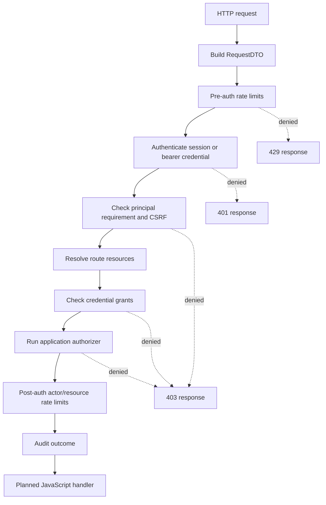
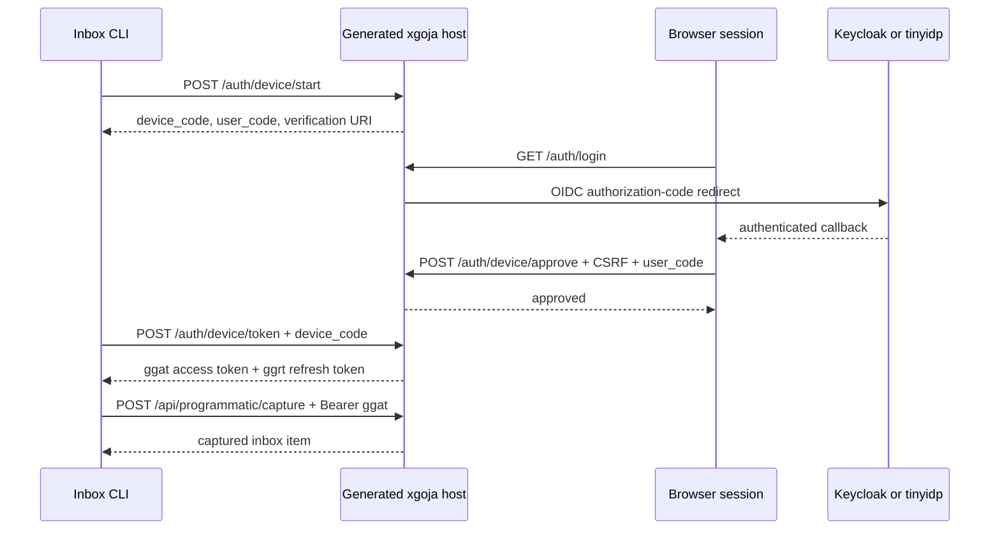

# go-go-goja Personal Inbox Auth, Programmatic Access, and Device Login

PR [#95](https://github.com/go-go-golems/go-go-goja/pull/95), **Add xgoja personal inbox auth and device login tutorial**, turns a set of host-side authentication primitives into a runnable teaching application. Its central result is not merely an inbox example. It defines an end-to-end path from an OIDC-authenticated browser user to a narrowly authorized programmatic client, while preserving a clear distinction between browser sessions, direct automation credentials, short-lived access tokens, refresh credentials, and device codes.

The work spans three connected tickets: the programmatic-auth design and implementation, the guarded JavaScript fetch client, and the personal knowledge inbox tutorial. It also contains the later review-driven hardening needed before the branch could be considered ready: redirect validation, authorization-aware rate-limit charging, refresh rotation recovery, and a Go toolchain update for standard-library vulnerabilities.

> [!summary]
> - The planned-route enforcer now has a typed auth result, grants, principal requirements, two-stage rate limits, audit metadata, and a common authorization pipeline for session and bearer authentication.
> - `programauth` provides durable agents, API tokens, access/refresh-token families, and an RFC 8628-shaped application-owned device authorization flow; raw credentials are issued once and stored only as hashes.
> - The eight-step Personal Knowledge Inbox tutorial introduces each boundary in order: local data, API transport, browser UI, OIDC session login, per-user ownership, then device-token capture.
> - `tinyidp` makes Steps 06–08 fast to smoke-test without Keycloak, but it supplies browser OIDC login only. Step 08 deliberately uses xgoja’s own application-owned device authorization endpoints.

## Why this work exists

A generated xgoja application already had important individual pieces: JavaScript commands, HTTP route builders, browser sessions, OIDC host authentication, and a growing set of Go-owned security services. What was missing was a coherent programmatic-access model and an application that demonstrated why each boundary exists.

A browser session answers one question: which user completed an OIDC login in this browser? It does not give a CLI a safe credential. A long-lived API token answers another question: which provisioned automation agent is calling? It is useful for CI and controlled service integrations, but it does not model a limited-input client that needs a user to approve a request in a browser. A device authorization flow answers that third question. It lets a CLI display a short user code, lets an already authenticated browser session approve that code, and then receives short-lived access credentials without moving the browser cookie or human password into the CLI.

The inbox tutorial is intentionally incremental because an authorization system is hard to understand if transport, identity, persistence, and policy all arrive at once. Each directory is a complete runnable snapshot. Later steps copy an earlier step and add one sharply defined responsibility. This keeps the resulting repository useful both as executable documentation and as a regression suite.

## The security model starts in the planned-route enforcer

The core integration point is `pkg/gojahttp/enforcer.go`. A planned Express route is not a raw JavaScript handler with ad hoc authentication. It is compiled into a `RoutePlan`, then evaluated by the Go-owned enforcer before the JavaScript handler runs. This is where route declarations become runtime security behavior.

The pipeline has an explicit ordering. Cheap rate limits can run before authentication. Authentication establishes an `AuthResult`, optionally followed by CSRF validation for browser-session requests. Resource resolution, grant checks, and the configured authorizer run before resource-aware rate limits are charged. Finally the handler receives a `SecureContext` containing redacted identity and authorization information.



The ordering is a correctness property, not simply a performance choice. Public login or device-start routes need pre-auth protection because they may be expensive before any principal exists. Conversely, a per-resource quota cannot be evaluated until the resource and authorization decision are known. The recent review correction made the final rule explicit: an authorization-denied request must not consume a shared post-auth resource bucket.

```go
// pkg/gojahttp/enforcer.go
if plan.Security.Mode != SecurityModePublic && plan.Action != "" {
    decision, err := e.auth.Authorizer.Authorize(ctx, request)
    if err != nil { /* map failure */ }
    if !decision.Allowed { /* return 403 */ }
}

// A denied caller must not exhaust a shared resource bucket.
if err := e.checkRateLimits(ctx, httpReq, req, plan, sec, RateLimitStagePostAuth); err != nil {
    return sec, statusForAuthError(err), err
}
```

This arrangement also distinguishes authentication method from actor identity. `AuthResult` carries the method (`session`, API token, or access token), principal kind, principal and credential IDs, grants, scopes, and whether CSRF is required. A JavaScript handler may inspect the redacted projection as `ctx.auth`, but it does not receive a raw bearer token, a token hash, refresh-token material, or a device code. Authorization has already been decided before the handler receives that context.

## A credential taxonomy with non-overlapping jobs

The programmatic-auth implementation in `pkg/gojahttp/auth/programauth/` treats credentials as separate state machines rather than variations of one bearer string. The distinction controls which code path is allowed to accept each value.

| Credential | Prefix | Can authenticate a planned route? | Lifecycle purpose |
| --- | --- | ---: | --- |
| API token | `ggpat_...` | Yes | Direct, revocable automation credential. |
| Access token | `ggat_...` | Yes | Short-lived credential issued by a token family or approved device flow. |
| Refresh token | `ggrt_...` | No | Single-use rotating credential that renews an access token. |
| Device code | `ggdc_...` | No | Short-lived polling credential awaiting browser approval. |
| User code | formatted short code | No | Human-entered approval reference. |

Raw opaque values are returned only when issued. The stored records hold a lookup prefix and a hash. Authentication uses the prefix to retrieve candidates and compares hashes with `crypto/subtle.ConstantTimeCompare`. This preserves the practical lookup benefit of a prefix without making the prefix itself a credential.

The access-token and refresh-token structs encode their different roles directly. An access token records its agent, subject user, grant set, family, expiry, and last use. A refresh token also carries a generation number, `UsedAt`, `RevokedAt`, and `ReplacedByID`. The result is a token family rather than an independent collection of permanent keys.

```go
type RefreshToken struct {
    ID           string
    AgentID      string
    SubjectUserID string
    FamilyID     string
    Generation   int
    TokenHash    []byte
    TokenPrefix  string
    ExpiresAt    time.Time
    UsedAt       *time.Time
    RevokedAt    *time.Time
    ReplacedByID string
    Grants       gojahttp.GrantSet
}
```

A refresh request finds the current token, rejects it if it is revoked or expired, and treats prior use as a security event. Reuse revokes the complete family. Exactly one caller may advance a given refresh credential. The store owns the compare-and-transition operation through `RotateRefreshToken`, so the in-memory and SQL implementations can make the single-use rule atomic at their persistence boundary.

The final review adjusted a subtle failure path. The service now persists the replacement access token *before* consuming the current refresh token. If access-token creation fails, the caller still owns a usable current refresh credential and can retry. If refresh rotation then fails, the service deletes the newly created but never returned access token as compensating recovery.

```go
createdAccess, err := s.AccessTokens.CreateAccessToken(ctx, access)
if err != nil { return IssuedOAuthTokenPair{}, err }

_, rotatedRefresh, err := s.RefreshTokens.RotateRefreshToken(ctx, current.ID, nextRefresh, now)
if err != nil {
    // No caller received this access token.
    if deleteErr := s.AccessTokens.DeleteAccessToken(ctx, createdAccess.ID); deleteErr != nil {
        return IssuedOAuthTokenPair{}, fmt.Errorf("rotate refresh token: %w (also failed to roll back access token %q: %v)", err, createdAccess.ID, deleteErr)
    }
    // Handle reuse and the ordinary failed-rotation case.
}
```

This is not a full cross-table database transaction. The ticket design calls out a future combined token-family abstraction as a possible stronger model. It is nevertheless an important improvement over consuming the only usable refresh token before the replacement access credential exists.

## Application-owned device authorization

`DeviceService` is an RFC 8628-shaped device authorization implementation. It is application-owned because the resulting credentials represent xgoja programmatic agents, xgoja grants, and xgoja route permissions. It is not an attempt to make the application an external identity provider.

The flow has two actors and two independent credentials. The CLI receives a high-entropy `device_code` and a displayable `user_code`. The browser user authenticates through the normal OIDC session flow, enters the user code, and approves it through a CSRF-protected endpoint. The CLI polls with the device code until it obtains an access/refresh pair.



The device record tracks request time, expiry, poll interval, last poll, approval, denial, consumption, requested grant set, and the agent/user relationship created by approval. Before approval, polling returns `authorization_pending`. A client that polls too early receives `slow_down`; the interval is increased and persisted. Expired, denied, and consumed codes are terminal states. An approved code is consumed before issuance, so it cannot mint two token pairs.

Approval also narrows rather than expands authority. If the approval request supplies a grant set, `DeviceService.ApproveDeviceAuthorization` intersects it with what the device originally requested. Disjoint grants are rejected. A browser approval screen therefore cannot convert a request for one permission into an unrelated broader agent.

The generated host mounts the native device endpoints ahead of application routes. The sensitive lifecycle—code hashing, polling cadence, token family issuance, state transitions, and protocol-shaped error handling—does not depend on arbitrary application JavaScript. JavaScript supplies an application-specific approval UI and application routes that use the final agent credential.

## Durable state is an explicit part of the design

Memory stores make local examples and focused tests straightforward. They are insufficient for a multi-process deployment where one process starts a device flow, another approves it, and a third receives the next poll. The programmatic-auth ticket therefore added a single `programauth/sqlstore` package that implements the five storage contracts: agents, API tokens, access tokens, refresh tokens, and device authorizations.

The schema stores grant sets as normalized JSON and token material as hash bytes plus lookup prefixes. It includes lookup and lifecycle indexes such as token prefix, token family, agent ID, expiry, user-code hash, device-code prefix, and device state fields. SQL device transitions use conditional updates; refresh rotation runs in a transaction. The Go service APIs do not change when callers move from memory to SQLite or PostgreSQL.

Generated hostauth exposes this as a `programauth` store family alongside session, audit, application-auth, and capability stores. Configuration can inherit the default store policy or use its own driver, DSN, and schema setting. `apply-schema: true` remains useful for a local example. Production guidance recommends externally managed migrations and `apply-schema: false`, plus retention-aware cleanup for expired tokens and device records.

This is an important architectural boundary. Application code works with agents, auth results, grants, and route requirements. Storage code owns durable state transitions. The service layer connects those two layers and preserves invariants regardless of the storage backend.

## Guarded outbound HTTP for JavaScript agents

A programmatic server path also needs a programmatic client path. The companion `modules/fetch` work avoids presenting `exec curl` as the canonical JavaScript integration. `fetch` is a guarded host capability with a policy for allowed URLs/origins, timeout, response-size limits, and credential-source permissions. It exposes a low-level Promise-returning `fetch.fetch()` as well as a fluent `fetch.client()` builder and Go-owned bearer credential builders.

The module validates the destination before creating an HTTP request, applies any credential source inside Go, bounds the response body, and posts resolution or rejection back onto the runtime owner. This matters because outbound HTTP is not an inert JavaScript utility: it can disclose credentials, reach internal services, and outlive the request that initiated it if it is not bound to runtime and call contexts.

```go
u, err := policy.CheckURL(spec.URL)
if err != nil { return responseData{}, err }

req, err := http.NewRequestWithContext(reqCtx, method, u.String(), bytes.NewReader(spec.Body))
if err != nil { return responseData{}, err }

if spec.Credential != nil {
    if err := spec.Credential.apply(reqCtx, req); err != nil {
        return responseData{}, err
    }
}
```

The initial implementation deliberately buffers bounded responses rather than pretending to expose browser-streaming semantics. Its generated server-and-agent example uses two binaries: the host process owns hostauth and server services; the agent process owns only the capabilities it needs to call the server. This split was discovered through implementation rather than assumed. Loading the hostauth JavaScript module into a jsverbs-only agent caused runtime construction to fail because that command does not have generated hostauth services.

## The Personal Knowledge Inbox teaches the boundaries in sequence

The tutorial lives in `examples/xgoja/23-personal-knowledge-inbox/`. Each numbered directory is runnable on its own. That layout duplicates a small amount of code, but the duplication is deliberate: a reader can open any step without reverse-engineering which later changes must be mentally removed.

| Step | New capability | Security or architecture lesson |
| --- | --- | --- |
| 01 | Minimal generated JavaScript verb | A generated xgoja application begins with a declared command surface. |
| 02 | Public HTTP server | A route provider and `serve` command create an application boundary. |
| 03 | SQLite CLI inbox | Storage is local application state before it becomes a shared service. |
| 04 | API server plus fetch-backed client | Transport is now explicit and becomes an authorization boundary later. |
| 05 | Embedded browser assets | Build-time assets and runtime asset mounts are separate concerns. |
| 06 | OIDC browser login | Keycloak owns passwords; generated hostauth owns app sessions and CSRF. |
| 07 | User-scoped inbox | Authentication identifies a user, but handlers must constrain data by that user. |
| 08 | Device authorization | A CLI receives a scoped programmatic credential without receiving browser credentials. |

Step 06 uses OIDC for browser login but keeps identity-provider tokens server-side. The browser receives an opaque application session. Unsafe browser mutations require CSRF because browser cookies are ambient credentials. The direct local CLI commands return to SQLite access in this step because a CLI does not possess a browser session and should not be taught to bypass the session/CSRF boundary.

Step 07 makes the missing ownership rule visible. Its session-protected routes call the per-user storage functions with `ctx.actor.id`. List and archive operations are no longer global inbox operations merely because the user is authenticated.

```js
app.get("/api/inbox")
  .auth(express.sessionUser())
  .allow("user.self.read")
  .handle((ctx, res) => {
    const database = store.openInbox(dbPath);
    try {
      res.json({
        ok: true,
        ownerUserId: ctx.actor.id,
        items: store.listInboxItemsForUser(database, ctx.actor.id, false)
      });
    } finally {
      database.close();
    }
  });
```

Step 08 reuses that same ownership model for a device-created agent. Its programmatic capture route requires `express.agent()` and the relevant grant. It then derives the user-owned inbox boundary from the approved agent’s `ownerUserId` claim. A bearer access token can therefore create an inbox item only for the user who approved its device request; it is not a general application write token.

```js
app.post("/api/programmatic/capture")
  .auth(express.agent())
  .allow("user.self.read")
  .handle((ctx, res) => {
    const ownerUserId = ctx.actor.claims && ctx.actor.claims.ownerUserId;
    if (!ownerUserId) {
      res.status(403).json({ error: "device token is not linked to a user" });
      return;
    }
    // Insert a row owned by ownerUserId.
  });
```

The report should be read carefully at this boundary: the temporary tutorial action remains `user.self.read`, even for capture. The implementation enforces meaningful identity and ownership isolation, but a future tutorial step should introduce application-specific actions such as `inbox.capture`, `inbox.read`, and `inbox.archive`.

## tinyidp makes the browser half fast to validate

Keycloak remains the compatibility target for the OIDC tutorial steps. `tinyidp` provides a fast local replacement for browser OIDC smoke testing. The aggregate target is:

```bash
make -C examples/xgoja/23-personal-knowledge-inbox tinyidp-smoke
```

Its three stages grow in strength:

1. **Step 06** drives authorization-code login through the tinyidp form and confirms that the generated host creates an application session and exposes CSRF state.
2. **Step 07** uses separate browser cookie jars for Alice and Bob, captures an item for each, and confirms that each session can only list its own item.
3. **Step 08** approves one device flow as Alice and another as Bob, captures through each issued access token, and confirms the browser-visible ownership boundary remains intact.

The separation of responsibilities is intentional. tinyidp supplies generic OIDC browser login with seeded users and claims. The generated xgoja host supplies `/auth/device/start`, `/auth/device/token`, and `/auth/device/approve`, then issues application-owned access and refresh tokens. Native tinyidp device authorization and DPoP work were developed separately in the tinyidp repository; this tutorial does not silently replace its application-owned flow with identity-provider-owned endpoints.

The smokes initially exposed several useful operational details. tinyidp’s form requires the `login` field even though it also displays a password field. Backgrounding `go run` left a compiled child process alive after the parent stopped, which caused port collisions; the smoke scripts now build a temporary binary and manage its PID directly. The device smoke must also respect the polling interval after a deliberate pre-approval poll, otherwise the next poll receives the expected `slow_down` response rather than the intended token result.

## Review hardening and operational fixes

The PR received three implementation review findings and a CI vulnerability failure after the main architecture was complete. Addressing them improved correctness rather than adding outward-facing features.

### Redirect targets are local paths, not arbitrary URLs

OIDC login and logout configuration describes destinations within the generated application. Accepting an absolute URL, `//host` scheme-relative value, or `/\\host` authority-style value would convert configuration error into an open redirect. `localRedirectPath` now permits only a same-origin local path, then `absoluteRedirectURL` derives the registered absolute post-logout redirect from the configured callback origin.

```go
func localRedirectPath(value string) string {
    value = strings.TrimSpace(value)
    if value == "" || !strings.HasPrefix(value, "/") ||
        strings.HasPrefix(value, "//") || strings.HasPrefix(value, "/\\") {
        return "/"
    }
    parsed, err := url.Parse(value)
    if err != nil || parsed.IsAbs() || parsed.Host != "" {
        return "/"
    }
    return value
}
```

### Authorization failures no longer spend shared resource quota

As described earlier, post-auth rate limits now run after grant and authorizer checks. The regression test denies a resource-keyed request, then verifies the first authorized request can still use the resource bucket. This preserves the intended meaning of a shared resource quota.

### Refresh failure preserves retryability

The access-token-first plus compensating-delete ordering means a persistence failure does not silently burn a user’s only refresh token. A regression test injects access-token creation failure, then proves the original refresh token remains usable on a retry.

### Go 1.26.5 remediates CI-reported standard-library vulnerabilities

GitHub Actions `govulncheck` identified `GO-2026-5856` in `crypto/tls` and `GO-2026-4970` in `os` when the workflow used Go 1.26.4. The branch updates the `go.mod` toolchain directive to `go1.26.5` in commit `2fce13f`. This is a toolchain update, not an application dependency workaround; the affected packages are part of the Go standard library.

## Validation evidence

The work was built in many focused slices, each recorded in ticket diaries and backed by package tests, generated-help checks, or black-box examples. The branch’s final push also ran the repository pre-push hook successfully: `golangci-lint`, `glazed-lint`, `go generate ./...`, and `go test ./...`.

Important feature-level validation includes:

```bash
# Programmatic auth domain, stores, and generated-host configuration.
go test ./pkg/gojahttp/auth/programauth ./pkg/gojahttp/auth/programauth/sqlstore ./pkg/xgoja/hostauth

# Guarded outbound fetch and its generated provider integration.
go test ./modules/fetch ./pkg/xgoja/providers/host

# Full browser login, user isolation, and device-capture isolation under tinyidp.
make -C examples/xgoja/23-personal-knowledge-inbox tinyidp-smoke

# Generated server-and-agent example.
make -C examples/xgoja/22-programmatic-agent-auth smoke

# Full repository validation, also run by the successful pre-push hook.
go test ./...
```

The aggregate tinyidp smoke produced the expected progression: successful Alice OIDC login, Alice/Bob inbox isolation, and Alice/Bob device capture isolation. Keycloak-specific smoke targets remain available for compatibility coverage.

## What was difficult, and what the work established

Several implementation failures clarified the final boundaries. A direct CLI command cannot load a hostauth JavaScript module that expects serve-time hostauth services. Browser session routes need explicit authorization actions in the planned-route builder chain. OIDC redirect smoke requests must use the endpoint’s supported `GET` method rather than an unsupported `HEAD`. These were corrected in the tutorial rather than hidden behind test-only exceptions.

The durable-store work made another constraint explicit: correctness-sensitive transitions belong at the store boundary. A service-level sequence of “read status, then update status” is insufficient once multiple processes can act on the same device authorization or refresh credential. Conditional SQL updates and transactional refresh rotation make the state transitions observable and enforceable across processes.

The final system therefore establishes these working rules:

- A browser session, an API token, an access token, a refresh token, and a device code are different credentials with different accepting endpoints.
- Human identity verification stays with the OIDC identity provider; application sessions and programmatic agents stay with the generated host.
- Raw credentials are issuance-time values, not handler context or durable plaintext state.
- Browser mutations require CSRF when authenticated through ambient session cookies; bearer credentials do not inherit browser-CSRF semantics.
- Rate limits need both pre-auth and post-auth stages, and an authorization denial must precede charging a shared protected-resource quota.
- A tutorial step should prove its lesson with a runnable smoke, not merely describe the intended outcome.

## Current status and next steps

PR #95 is open at the time of this report. The review fixes and the Go 1.26.5 toolchain update are pushed on `task/api-auth-device-login`; GitHub checks were rerun after the toolchain update.

The implementation is broad enough to be useful as a tutorial and a reusable host-auth foundation, but several follow-ups remain appropriate:

1. Replace the tutorial’s temporary `user.self.read` action with explicit inbox read, capture, and archive permissions.
2. Add a Step 09 or separate tutorial that uses tinyidp’s native `/device_authorization` and DPoP support as an identity-provider-owned flow, clearly distinct from Step 08.
3. Add CI packaging/discovery for tinyidp so the aggregate smoke does not rely on a sibling checkout or manually supplied `TINYIDP_ROOT`.
4. Consider a shared browser-smoke helper to reduce duplicate form parsing and cookie-jar code across Steps 06–08.
5. Decide whether production deployments need a combined token-family persistence abstraction that atomically rotates refresh credentials and creates access tokens in one database transaction.
6. Add metrics and operational dashboards for refresh reuse, device slow-down responses, token-family revocation, and device-code expiration.

## Source map

The primary implementation and design evidence for this report is in `/home/manuel/workspaces/2026-06-12/goja-express-auth/go-go-goja`:

```text
pkg/gojahttp/enforcer.go
pkg/gojahttp/ratelimit.go
pkg/gojahttp/auth/keycloakauth/keycloakauth.go
pkg/gojahttp/auth/programauth/oauth_token.go
pkg/gojahttp/auth/programauth/device.go
pkg/gojahttp/auth/programauth/device_handlers.go
pkg/gojahttp/auth/programauth/sqlstore/schema.go
pkg/gojahttp/auth/programauth/sqlstore/sqlstore.go
pkg/xgoja/hostauth/builder.go
pkg/xgoja/hostauth/stores.go
modules/fetch/fetch.go
examples/xgoja/22-programmatic-agent-auth/
examples/xgoja/23-personal-knowledge-inbox/
ttmp/2026/06/15/XGOJA-PROGRAMMATIC-AUTH-DESIGN--token-and-device-login-programmatic-api-auth-design/
ttmp/2026/06/20/XGOJA-CLIENT-FETCH-AUTH-DESIGN--client-side-fetch-and-authenticated-api-client-design/
ttmp/2026/06/22/XGOJA-PERSONAL-INBOX-TUTORIAL--personal-knowledge-inbox-device-login-tutorial/
```

The ticket diaries are especially valuable for continuation. They retain the command-level validation evidence, failed initial approaches, reasoning behind the storage and handler boundaries, and the implementation order that the final PR diff alone cannot convey.
