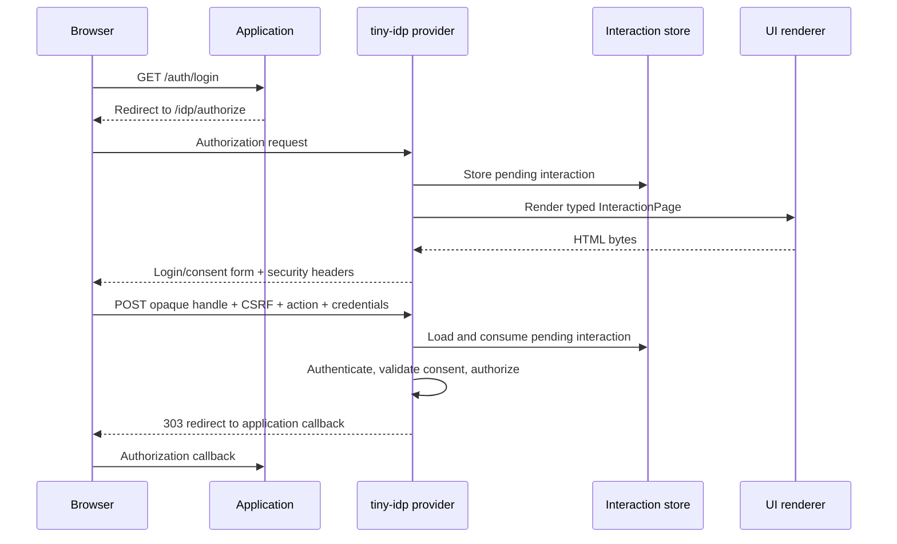
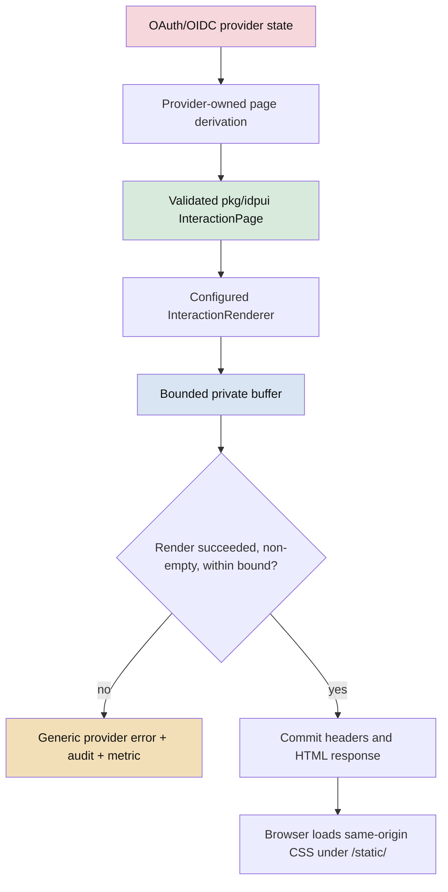
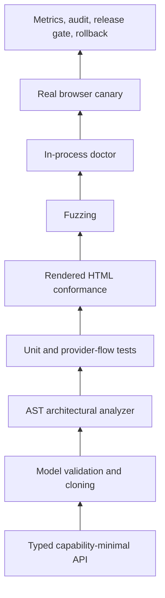

# tiny-idp: Building a Stylable Login and Consent UI Without Weakening the Identity Provider

The visible result of this project is a login screen that can carry an application's visual identity. The engineering result is more substantial. `tiny-idp` now has a constrained presentation interface that permits product-owned HTML and CSS while keeping OAuth and OpenID Connect authority inside the identity provider.

That distinction matters. A login page is not an ordinary application form. It receives credentials, carries an opaque continuation handle, participates in forced reauthentication, presents consent, and determines whether an authorization request proceeds or is denied. A rendering extension that gains control over any of those decisions becomes an authentication extension. The implementation therefore treats styling as a capability-design problem rather than as template replacement.

This report reconstructs the complete work. It explains the original coupling in the provider, the public `pkg/idpui` contract, the default and xapp renderers, the security boundary, the response-commit strategy, the CSP and static-asset policy, the accessibility work, and the assurance tools added around the feature. It also records failed approaches and the concrete lessons extracted from them.

> [!summary]
> The project introduced a typed, validated interaction-page model and a renderer that can write HTML but cannot access the HTTP request, response writer, session, cookie jar, OAuth request, or authorization decision. The provider derives the model, renders into a bounded buffer, and commits the response only after successful validation. The xapp supplies a product-specific `html/template` and same-origin stylesheet under `/static/`. Structural conformance tests, a Go AST analyzer, fuzz targets, metrics, a doctor check, and a real Chromium probe make the boundary continuously testable.

## 1. Report scope and evidence base

The implementation was performed under the docmgr ticket:

```text
ttmp/2026/07/13/
  TINYIDP-UI-001--secure-customizable-login-and-consent-renderer/
```

The principal evidence is distributed across:

- the ticket's analysis, design, and implementation guide;
- the chronological investigation diary;
- the browser accessibility and canary evidence;
- the interaction UI release and rollback runbook;
- the public integration guide in `docs/interaction-rendering.md`;
- the implementation and tests in `pkg/idpui`;
- the provider adapter in `internal/fositeadapter`;
- the xapp renderer in `cmd/tinyidp-xapp/internal/loginui`;
- the ticket-local Go analyzer and browser probe;
- the Git history from `e77158f` through `07722d9`.

The change set added approximately 4,700 lines across 52 files. A large fraction is not product HTML. It is contract definition, validation, tests, analysis tooling, documentation, operational checks, and evidence. That ratio is appropriate for a security-relevant extension point.

The work was delivered in the following commits:

| Commit | Purpose |
|---|---|
| `e77158f` | Add the secure public interaction-renderer contract |
| `62a9847` | Record the renderer-contract implementation |
| `817fb15` | Integrate customizable rendering into the provider |
| `fdd008f` | Enforce the renderer output bound defensively |
| `f577eaf` | Record provider integration and security reasoning |
| `fc16a87` | Add the themed xapp interaction UI |
| `e0107a4` | Record the xapp theme work |
| `8e51f4b` | Add conformance, fuzzing, static analysis, metrics, and doctor tooling |
| `9756606` | Publish release and rollback guidance |
| `07722d9` | Record the initialized xapp handoff |

## 2. The original problem

Before this work, the authorization provider emitted its login and consent HTML directly from `internal/fositeadapter/provider.go`. The handler constructed markup as part of protocol processing. That implementation had three consequences.

First, presentation was coupled to OAuth flow logic. A visual change required editing the provider. The provider therefore had to know labels, document layout, form markup, and styling decisions in addition to session and authorization state.

Second, an embedding application could not supply its own visual language. The xapp could style its authenticated BBS interface, but the user crossed into a visually unrelated identity-provider screen during sign-in.

Third, the natural-looking escape hatch—accepting an arbitrary handler or template function—would have enlarged the security boundary too far. An arbitrary handler receiving `http.ResponseWriter` and `*http.Request` could:

- read cookies and authorization request parameters;
- change status codes and redirects;
- set or overwrite security headers;
- write a partial response and then fail;
- bypass provider validation;
- alter the form target;
- synthesize or omit CSRF state;
- log credentials or opaque continuation values;
- make consent or authorization decisions outside the provider.

The engineering objective was therefore precise:

> Permit controlled presentation substitution while preserving provider ownership of protocol state, validation, decisions, and HTTP side effects.

## 3. Why a login screen is a protocol surface

The browser page participates in a state transition. It is the user-facing projection of an authorization transaction stored by the provider.

The simplified sequence is:



The HTML renderer is involved only in one arrow: producing bytes from an already-derived page model. It does not own any state transition.

This produces an important design rule:

```text
rendering result = presentation(page model)
authorization result = provider(request, interaction, session, policy)
```

These functions must not collapse into one another.

## 4. Security properties the design had to preserve

The implementation was driven by explicit invariants rather than by appearance alone.

### 4.1 Provider authority

Only the provider may:

- create, load, validate, consume, or delete a pending interaction;
- interpret `prompt=login`, `max_age`, session age, and step-up requirements;
- authenticate a username and password;
- enforce forced password change;
- decide whether consent is required;
- approve or deny an authorization request;
- issue an authorization code or token;
- choose redirects and status codes;
- set cookies and protocol security headers;
- emit security audit events.

### 4.2 Renderer confinement

A renderer may:

- choose semantic HTML structure;
- choose product wording within supplied data;
- link an allowed same-origin stylesheet;
- arrange login, consent, scope, action, and error elements;
- add presentation-oriented classes and ARIA attributes.

A renderer may not:

- inspect the inbound HTTP request;
- receive the response writer;
- access session or cookie data;
- receive a Fosite authorization request;
- invent field names or actions;
- change the form method or target;
- receive the submitted password;
- decide authentication or authorization outcomes.

### 4.3 Failure atomicity

If rendering fails, the browser must not receive half of a login page followed by an error message. The provider must either commit one complete valid page or emit a generic error.

### 4.4 Data minimization

The model should contain only values required for presentation. In particular, it must never contain a password value, raw cookie, token, authorization code, or unrestricted protocol object.

### 4.5 Browser containment

The returned document must not introduce script execution, inline styling, active embedded content, remote resource loads, or navigation outside the provider-controlled form action.

## 5. Architecture of the final solution

The feature has four layers.



The layers are:

1. `pkg/idpui` defines a public, application-independent view model and renderer interface.
2. `internal/fositeadapter` translates provider state into that model and controls the HTTP response.
3. `cmd/tinyidp-xapp/internal/loginui` implements the xapp's branded template and static CSS.
4. Assurance tooling verifies the assumptions at type, AST, rendered-document, fuzz, HTTP, and browser levels.

This split makes the customization reusable. Another host can implement `InteractionRenderer` without importing the xapp or modifying provider internals.

## 6. The public `pkg/idpui` contract

The contract begins with a deliberately narrow interface:

```go
type InteractionRenderer interface {
    RenderInteraction(
        ctx context.Context,
        dst io.Writer,
        page InteractionPage,
    ) error
}
```

The interface accepts `io.Writer`, not `http.ResponseWriter`. It accepts `InteractionPage`, not `*http.Request`, a Fosite request, or an internal interaction record. The provider supplies a context so cancellation and deadlines remain available without granting access to transport state.

The interface also carries a concurrency contract. A configured renderer can be used by simultaneous authorization requests and must therefore be safe for concurrent calls.

The absence of capabilities is the main security property:

| Capability | Renderer receives it? | Owner |
|---|---:|---|
| HTTP request | No | provider |
| HTTP response writer | No | provider |
| Cookies | No | provider/browser |
| OAuth request object | No | provider |
| Pending interaction record | No | provider store |
| Typed presentation model | Yes | renderer |
| Byte destination | Yes | provider-owned buffer |
| Status and headers | No | provider |
| Authentication decision | No | provider |
| Authorization decision | No | provider |

### 6.1 A closed page model

`InteractionPage` contains:

- a document title;
- a provider-owned form description;
- an optional login panel;
- an optional consent panel;
- an optional public error.

The optional panels allow three legitimate page shapes:

```text
login only
consent only
login + consent
```

There is no arbitrary map of values. A closed struct makes additions reviewable and lets validation reject incoherent states.

### 6.2 Exact form-field names

The package defines constants for the security-relevant field names:

```text
interaction
csrf_token
action
login
password
```

Templates receive these names rather than inventing them. This prevents drift between provider POST parsing and renderer output.

### 6.3 Closed action values

The page model exposes only typed actions:

```text
continue
approve
deny
```

The provider requires an explicit action. It does not interpret a missing value as approval or continuation. This is a fail-closed rule: malformed or incomplete submissions do not accidentally become authorization decisions.

The deny action includes `SkipsConstraintValidation`. A conforming renderer maps this to HTML's `formnovalidate` attribute. Without it, a required username or password field could prevent the browser from sending a denial. The protocol denial path must remain available even when login fields are empty.

### 6.4 Login reasons

The model can explain why credentials are being requested using a closed reason set:

```text
session_missing
prompt_login
max_age
step_up
```

This was necessary because a page shown for forced reauthentication is semantically different from an initial login page. The renderer can present appropriate copy, but the provider decides which reason applies.

### 6.5 Public errors

Recoverable errors are similarly closed:

```text
missing_login
invalid_credentials
consent_required
```

The public message is generic and does not reveal whether an account exists. Internal authentication errors remain in audit and server logs under controlled reason codes.

### 6.6 Password exclusion

No field in `InteractionPage` can hold a submitted password. A failed login can preserve the normalized username for usability, but the password field is always rendered empty. This prevents accidental retention, logging, template interpolation, or re-display.

## 7. Validation and defensive copying

`InteractionPage.Validate` checks the internal consistency of the model before it crosses the rendering boundary.

Validation includes:

- a valid provider-supplied form action;
- the exact hidden-field contract;
- recognized login reasons;
- recognized public-error values;
- recognized action names;
- no duplicate actions;
- coherent login and consent panel combinations;
- required prompts and labels;
- correct denial behavior.

The provider validates before rendering even though it constructs the model itself. This converts assumptions into executable assertions and protects future changes to the adapter.

`Clone` deep-copies slices and pointer-bearing fields. The provider passes the clone to the renderer. This avoids sharing mutable backing arrays for actions or scopes with untrusted extension code.

The conceptual sequence is:

```text
page := derivePage(providerState)

if err := page.Validate(); err != nil:
    fail closed

rendererInput := page.Clone()
render(rendererInput)
```

Copying is not a substitute for the narrow contract. It is a secondary defense against mutation and future aliasing bugs.

## 8. The default renderer

`pkg/idpui/default_renderer.go` provides the built-in implementation. A host that does not configure a renderer receives this implementation automatically.

The default renderer uses Go's `html/template`, with an embedded template parsed once. This provides contextual escaping for text and attribute positions. The renderer validates its context, destination, and page, clones the model, then executes the template.

The template includes:

- an explicit `<label>` for every interactive field;
- `autocomplete="username"` for login;
- `autocomplete="current-password"` for password;
- no password `value` attribute;
- `required` where appropriate;
- `aria-invalid` and `aria-describedby` for invalid input;
- `role="alert"` for the public error summary;
- explicit submit actions;
- `formnovalidate` on denial.

This renderer serves three roles:

1. It is a safe fallback for embedders that need no branding.
2. It is an executable reference for third-party renderer authors.
3. It provides a stable baseline for golden and conformance tests.

The default renderer is intentionally modest in visual design. Product branding belongs to the embedding host.

## 9. Provider integration

The public embedding options now include a UI configuration:

```go
type UIConfig struct {
    Renderer idpui.InteractionRenderer
}
```

A nil renderer selects the built-in default. A configured renderer is adapted into the Fosite-backed provider.

The important implementation is in `internal/fositeadapter/rendering.go`. It performs two distinct jobs:

1. derive an `idpui.InteractionPage` from provider-owned state;
2. render that page under strict response controls.

Keeping these jobs outside the main authorization handler made the state mapping reviewable without obscuring the protocol path.

### 9.1 Deriving page shape

The adapter determines whether login, consent, or both are required. In simplified pseudocode:

```text
needsLogin = noSession
          or promptLogin
          or maxAgeExpired
          or stepUpRequired

needsConsent = providerPolicyRequiresConsent

page.Login   = loginModel(needsLogin, loginReason)
page.Consent = consentModel(needsConsent, requestedScopes)
page.Form    = providerForm(interactionHandle, csrfToken, allowedActions)
```

The renderer does not repeat this logic. That prevents a theme from hiding a required login panel or converting forced reauthentication into session reuse.

### 9.2 Recoverable authentication errors

Missing credentials and invalid credentials are recoverable. The provider keeps the pending interaction active and renders the same page with a public error model.

The behavior is:

```text
POST interaction
  -> validate handle and CSRF
  -> parse explicit action
  -> if action denies: deny through provider
  -> if credentials required:
       authenticate
       on recoverable failure:
         derive same page with generic error
         render empty password field
         return 200
  -> continue provider authorization
```

This preserves the identity provider's authority while giving the renderer enough state to produce a usable error screen.

### 9.3 Explicit approval and denial

Tests and old fixtures initially omitted the action parameter. The stricter implementation rejected those requests. The correct fix was to update the fixtures to submit `action=approve`, not to add a permissive fallback in production.

This incident validated the design method: tests must adapt to a stronger protocol invariant rather than teaching the implementation to accept ambiguous input.

### 9.4 POST success redirects use 303

After a successful credential POST, the authorization flow redirects the browser. The adapter ensures the response is `303 See Other`, so the browser follows with a GET rather than repeating the credential-bearing POST.

The provider uses a small response-writer adapter for this specific transformation. The renderer remains uninvolved.

## 10. Rendering into a bounded private buffer

Passing the live response writer to a renderer would make failures non-atomic. The renderer might write the opening document, fail, and leave the provider unable to change status or headers.

The provider instead renders into a private bounded buffer.

```text
constant maxInteractionDocumentBytes = 256 KiB

page.Validate()
copy := page.Clone()
buffer := newBoundedBuffer(maxInteractionDocumentBytes)
err := renderer.RenderInteraction(ctx, buffer, copy)

if err != nil:
    record renderer failure
    return generic 500

if buffer.overflowed:
    record oversized output
    return generic 500

if trimSpace(buffer.bytes).isEmpty:
    record empty output
    return generic 500

set provider-owned headers
write status
write complete buffer
```

The bound limits memory consumption by a defective or malicious renderer. The implementation records overflow independently of the `Write` return value. This is necessary because a renderer can ignore a returned short-write error and then return nil.

That detail emerged during implementation. Merely returning an error from the bounded writer did not prove that the renderer propagated it. The provider therefore checks the writer's overflow flag after rendering.

Only after validation, successful rendering, size checking, and non-empty checking does the provider set the HTML content type and commit bytes to the browser.

The response includes cache prevention:

```http
Cache-Control: no-store
Pragma: no-cache
```

This prevents login, consent, error, and interaction state from being retained in ordinary browser caches.

## 11. Content Security Policy and the asset model

The page uses this policy:

```text
default-src 'none';
style-src 'self';
frame-ancestors 'none';
form-action 'self';
base-uri 'none'
```

Each directive supports a concrete invariant.

| Directive | Effect |
|---|---|
| `default-src 'none'` | Deny all resource types unless explicitly opened |
| `style-src 'self'` | Permit external CSS only from the same origin |
| `frame-ancestors 'none'` | Prevent embedding and clickjacking |
| `form-action 'self'` | Prevent forms from posting credentials off origin |
| `base-uri 'none'` | Prevent a `<base>` element from rewriting relative URLs |

No script source is opened. Inline styles are not opened. Remote fonts and images are not opened. The product renderer therefore uses a same-origin stylesheet and ordinary semantic HTML.

The CSS is mounted under:

```text
/static/tinyidp/login.css
```

This follows the repository rule that static assets live under `/static/`, not under an application or administration route. The HTML remains non-cacheable; the immutable-ish stylesheet receives a short cache lifetime.

The distinction is operationally useful:

```text
interaction HTML: security-sensitive, per request, no-store
theme CSS: public static resource, bounded, cacheable
```

## 12. The xapp renderer

The product-specific implementation lives in:

```text
cmd/tinyidp-xapp/internal/loginui/
  renderer.go
  renderer_test.go
  templates/interaction.html
  static/login.css
```

It uses an embedded `html/template` and embedded stylesheet. The renderer accepts limited configuration:

- product name;
- stylesheet URL.

It does not accept raw HTML, raw CSS, template source, arbitrary functions, or protocol values.

### 12.1 Stylesheet URL validation

The stylesheet URL is validated before it can enter the template. It must:

- be root-relative;
- reside below `/static/`;
- not begin with `//`;
- contain no scheme or host;
- contain no user information;
- contain no query or fragment;
- contain no backslash;
- contain no traversal segment.

This prevents a product configuration value from converting the tightly constrained style link into an external or ambiguous URL.

### 12.2 Static handler behavior

The asset handler accepts `GET` and `HEAD` for the exact stylesheet path. It returns the CSS content type and rejects unrelated paths. The xapp mounts this handler before the SPA fallback so that `/static/tinyidp/login.css` cannot be swallowed by client-side routing.

Both development and initialized production composition paths install the renderer and asset handler. This avoids the common failure where a feature works in the development constructor but disappears from the generated or production host.

## 13. The visual system

The requested design was a Macintosh-era retro monochrome page without Chicago font, menu bar, or window chrome. Pastel 1950s accents could be used for foreground emphasis.

The final theme uses:

- a paper-like neutral background;
- dark ink foreground;
- restrained mint, rose, blue, and gold accents;
- a system monospace stack rather than Chicago;
- a single centered document composition;
- no imitation title bar, desktop, window border, or operating-system menu;
- strong one-dimensional reading order;
- compact but touch-usable controls;
- responsive behavior at narrow widths;
- reduced-motion support;
- an explicit visible focus treatment.

The design remains subordinate to semantic form structure. CSS changes the presentation of provider-supplied fields; it does not reorder protocol meaning or hide required decisions.

The template uses classes for stable visual roles, including the page identity, explanatory copy, field groups, scope list, action group, and error summary. Those class names are internal to the host renderer. The public `idpui` contract does not prescribe a CSS framework.

## 14. Accessibility as a protocol requirement

Accessibility work was integrated into the renderer contract and conformance harness rather than left to final visual inspection.

### 14.1 Labels and names

Every username and password input has an explicit label associated by `for` and `id`. Button text identifies its action. Scope entries are rendered as readable list content.

### 14.2 Error identification

The recoverable error summary uses `role="alert"`. Invalid fields use `aria-invalid`, and supporting error text is connected with `aria-describedby` where applicable.

The provider emits generic errors to avoid account enumeration, but generic does not mean inaccessible. The user still needs a clear, programmatically exposed statement that the submitted login could not be accepted.

### 14.3 Autocomplete

The login field uses `autocomplete="username"`. The password field uses `autocomplete="current-password"`. These values support browser and password-manager behavior without exposing credential values to the page model.

### 14.4 Keyboard operation

The Chromium probe verified keyboard reachability for:

- username;
- password;
- approve or continue;
- deny.

The focus indicator measured four CSS pixels and remained visually distinct.

### 14.5 Reflow and zoom

The page was tested at a 320-pixel viewport and separately at 200 percent zoom. No horizontal overflow was observed. These are separate checks: combining a narrow viewport and zoom initially created a test condition that did not represent either requirement cleanly.

### 14.6 Contrast measurements

The browser evidence recorded the following contrast ratios:

| Element | Ratio |
|---|---:|
| body text | 14.12:1 |
| approve button / eyebrow accent | 10.34:1 |
| scope text | 9.92:1 |
| deny action | 8.99:1 |
| footer and lead text | 6.94:1 |

All recorded values exceed the relevant WCAG AA thresholds for the rendered text sizes.

## 15. Structural conformance testing

Unit tests of a template can confirm expected strings, but they do not fully describe the security properties of a rendered document. The project therefore added a reusable conformance harness under `pkg/idpui/idpuitest`.

The harness renders a page, parses the result with `golang.org/x/net/html`, and reports deterministic violations.

It checks that the document contains no:

- `<script>`;
- inline `<style>`;
- iframe;
- object or embed;
- image or active SVG/MathML;
- audio, video, or source;
- meta refresh;
- `on*` event attributes;
- `style` attributes;
- `javascript:`, `data:`, or `vbscript:` URLs.

It also checks form semantics:

- the form method is POST;
- the form action is the exact provider-supplied target;
- no unrelated external origin is referenced;
- hidden fields are exactly the interaction and CSRF fields;
- the required explicit actions are present exactly once;
- denial uses `formnovalidate` when constraints must be skipped;
- the password input has no value;
- the password autocomplete is `current-password`;
- the login autocomplete is `username`;
- inputs have IDs and matching labels;
- counts are coherent;
- public errors have alert semantics.

Both the default renderer and xapp renderer run through this harness. The host renderer is therefore judged by the same structural contract as the built-in renderer.

### 15.1 Why parse instead of search strings

HTML is a tree with case folding, entity decoding, optional syntax, and multiple URL-bearing attributes. Substring checks are fragile. Parsing gives the test a normalized element and attribute model.

The conformance harness is still not a browser security engine. It is a targeted executable policy for the document subset the project intends to allow.

## 16. Static analysis with `go/analysis`

The ticket includes a custom analyzer:

```text
scripts/idpui_analyzer/
  analyzer.go
  analyzer_test.go
  cmd/idpui-analyzer/main.go
  testdata/src/safe/safe.go
  testdata/src/unsafe/unsafe.go
```

The analyzer uses Go AST and `go/analysis` infrastructure. It rejects patterns that could bypass the renderer boundary.

The rules detect:

- use of `text/template` for HTML rendering;
- conversions to trusted template content types such as `template.HTML`, `template.CSS`, or `template.JS`;
- direct HTML writes using formatting or writer calls in protected provider paths;
- renderer methods or interfaces that accept `http.ResponseWriter` or `*http.Request`.

The last rule protects the capability boundary itself. A future refactor cannot casually broaden the renderer API without tripping the analyzer.

The analyzer has positive and negative `analysistest` fixtures. It is exposed as:

```text
make idpui-analyzer
```

and incorporated into `make lint`.

### 16.1 A real finding

The first run found a raw HTML write in `internal/fositeadapter/end_session.go`. That page was not the main interaction renderer, but it lived in the same sensitive provider region. The code was migrated to `html/template` rather than suppressed.

This is evidence that the analyzer was not merely written to approve the new code. It discovered an adjacent pre-existing pattern and improved it.

### 16.2 Limits of the analyzer

The analyzer is intentionally narrow. It does not prove HTML safety or OAuth correctness. It enforces syntactic architectural rules that are cheap, deterministic, and reviewable.

The correct interpretation is:

```text
AST analyzer: prevent known boundary erosion patterns
conformance harness: inspect rendered document structure
provider tests: verify flow semantics
browser probe: verify deployed browser behavior
```

No single layer replaces the others.

## 17. Fuzzing

Three fuzzing surfaces were added.

### 17.1 Default-renderer escaping

The default renderer receives arbitrary Unicode, invalid UTF-8, punctuation, delimiter-like text, and long strings in presentation fields. The fuzz target verifies that rendering does not panic and continues to satisfy the structural contract.

This targets contextual escaping and model-to-template handling rather than cryptographic or OAuth logic.

### 17.2 Conformance parser robustness

The conformance analyzer receives malformed and unusual HTML. The target verifies that the parser and checks do not panic.

During the first fuzzing pass, this target found that the harness accepted a whitespace-only error summary. The check was corrected to use trimmed content, and the reproducing input was preserved in the fuzz corpus.

### 17.3 Bounded-buffer behavior

The bounded writer is fuzzed across chunk sizes, write sequences, and output limits. This verifies the relationship between accepted bytes, short writes, and the overflow flag.

Recorded short fuzz runs executed approximately:

- 13,993 default-renderer cases;
- 61,242 conformance-parser cases;
- 13,873 bounded-buffer cases.

These counts are not a proof of correctness. They demonstrate that the targets are active, inexpensive, and capable of finding edge cases.

## 18. Metrics and audit behavior

`pkg/idpui/metrics.go` defines low-cardinality renderer counters backed by atomics. The adapter records:

- render attempts;
- render successes;
- render failures;
- oversized results;
- empty results;
- downstream write failures;
- total render latency;
- maximum render latency.

The metrics deliberately avoid:

- username;
- client ID labels with unbounded cardinality;
- interaction handles;
- CSRF values;
- request URLs with query strings;
- rendered error text.

Renderer failures also produce audit events with fixed reason categories. The provider does not place arbitrary renderer errors or HTML in security audit records.

This design supports operational diagnosis without turning observability into a credential or protocol-data exfiltration path.

## 19. The interaction doctor

The xapp doctor command includes an in-process interaction check implemented in `cmd/tinyidp-xapp/interaction_doctor.go`.

The check follows the real local route:

```text
/auth/login
  -> /idp/authorize
  -> interaction HTML
  -> declared stylesheet
```

It validates:

- same-origin redirect behavior;
- expected status;
- the exact CSP;
- `no-store` caching behavior;
- the document size bound;
- a safe declared stylesheet path;
- stylesheet status;
- CSS content type;
- stylesheet size bound.

The doctor does not print or return cookies, CSRF values, interaction handles, tokens, or HTML. It reports only the state needed to diagnose composition and delivery.

This check is especially useful because it catches host wiring errors that package tests cannot see, such as mounting the static handler after a SPA fallback.

## 20. Browser-level canary evidence

The ticket includes `scripts/browser_probe.py`, implemented with Playwright and Chromium. It exercised a disposable local xapp canary in tmux.

The observed route was:

```text
/auth/login
  -> /idp/authorize
  -> POST login/consent
  -> /auth/callback
  -> /
```

The probe checked:

- all resource requests remained same-origin;
- zero scripts were present;
- zero inline style blocks or style attributes were present;
- zero event-handler attributes were present;
- exactly one password input existed;
- the password input had no value;
- autocomplete attributes were correct;
- approve and deny controls were both present;
- framing was blocked;
- keyboard navigation reached all required controls;
- visible focus was measurable;
- the page reflowed at 320 pixels;
- the page remained usable at 200 percent zoom;
- computed contrast exceeded thresholds;
- two isolated browser contexts could authenticate as two distinct subjects.

The multi-user check emitted only a Boolean distinction result. It did not copy subject identifiers into the evidence output.

A screenshot was inspected from `/tmp` and deliberately not committed because browser images of identity surfaces can contain sensitive or environment-specific information.

### 20.1 Two corrections made while building the probe

The first framing test looked for an `<h1>` and accidentally found one on Chromium's error document. The probe was corrected to classify the resulting URL and browser error state rather than trusting a generic DOM selector.

The first zoom test combined a 320-pixel viewport with 200 percent zoom. The test was separated into narrow reflow and zoom scenarios so that each requirement had an interpretable result.

## 21. Failures and what they taught us

The implementation diary is valuable because it records where apparently small choices concealed system-level invariants.

### 21.1 Missing action fixtures

Several tests posted credentials without an explicit action. Strict provider code rejected them.

**Resolution:** update fixtures to send `action=approve`.

**Lesson:** do not preserve ambiguous behavior merely because old tests encode it.

### 21.2 Shared consent helper damage

An edit accidentally removed or misplaced a shared consent helper near an adjacent test.

**Resolution:** restore the helper in its correct scope and run focused and full tests.

**Lesson:** protocol-test helpers often encode hidden shared setup; inspect the surrounding test file after structural edits.

### 21.3 A second action omission

Focused provider tests passed, but the full suite found another missing action fixture in `internal/cmds`.

**Resolution:** update the external fixture as well.

**Lesson:** a public invariant propagates beyond the package where it is implemented. Full-repository tests remain necessary.

### 21.4 Bounded writer error propagation

The initial assumption was that returning a write error was enough to reject oversized output.

**Resolution:** add an independently inspected overflow flag.

**Lesson:** extension code can ignore errors. Enforcement must remain in the trusted caller.

### 21.5 Incorrect negative conformance fixture

A negative test expected an inline-style violation but supplied a style element rather than a `style` attribute.

**Resolution:** correct the fixture to match the intended rule.

**Lesson:** each policy rule needs a precise counterexample, not a generally unsafe document.

### 21.6 Fuzz-discovered whitespace error

The conformance harness treated a whitespace-only alert as non-empty.

**Resolution:** trim before checking and preserve the corpus input.

**Lesson:** semantic emptiness differs from byte length.

### 21.7 Multi-user seed regression

Adding a second development user initially changed Alice's display name and stable identifier. Tests caught the display name; review caught the durable actor identity consequence.

**Resolution:** restore the original Alice and `dev-alice` identity while adding the second account separately.

**Lesson:** identity seed data can be coupled to durable-object identity and authorization state. Cosmetic-looking changes may alter data ownership.

### 21.8 Documentation integrity

The first docmgr validation found new documents without file notes.

**Resolution:** add the required relationships and rerun doctor.

**Lesson:** traceability is part of the deliverable, not an optional final annotation.

## 22. Assurance as a layered system

The project does not claim that one tool proves the renderer safe. It uses several overlapping mechanisms.



The layers answer different questions:

| Layer | Question answered |
|---|---|
| Type/API design | What capabilities can a renderer receive? |
| Validation | Is this page model internally coherent? |
| AST analyzer | Has code bypassed or broadened the intended boundary? |
| Unit tests | Does each component implement its local contract? |
| Provider tests | Are login, consent, denial, and reauthentication transitions correct? |
| HTML conformance | Is the rendered document inside the allowed structural subset? |
| Fuzzing | Do malformed and boundary inputs expose panics or semantic gaps? |
| Doctor | Is the assembled host serving the page and CSS with correct headers? |
| Browser probe | Does Chromium observe the intended security and accessibility behavior? |
| Metrics/audit | Can production failures be detected without leaking secrets? |
| Runbook | Can operators gate and reverse deployment safely? |

This is a practical assurance argument: each important invariant is attached to one or more executable checks at the level where it can actually be observed.

## 23. Research and standards context

Several external bodies of work informed the implementation.

### 23.1 Go `html/template`

Go's contextual autoescaping model informed the choice of renderer engine and the prohibition on trusted-content conversions. The analyzer rejects `template.HTML`, `template.CSS`, and related conversions because they opt out of contextual protection.

### 23.2 OpenID Connect Core

OIDC request semantics explain why `prompt=login`, `max_age`, authentication time, consent, and redirect processing remain provider responsibilities. The UI receives derived reasons, not the raw request object.

### 23.3 OAuth 2.0 Security Best Current Practice

OAuth security guidance supports strict redirect handling, explicit state transitions, and conservative browser-facing behavior. The provider continues to own redirects and code issuance, and the POST-success path uses 303 semantics.

### 23.4 OWASP CSRF guidance

CSRF guidance supports the provider-generated token carried as an exact hidden field and validated before state changes. The renderer can display the field supplied by the provider but cannot invent its name or value.

### 23.5 Content Security Policy Level 3

CSP provides browser enforcement for the intended passive document model. `form-action` and `frame-ancestors` are particularly relevant to credential forms; `default-src 'none'` makes later resource additions explicit.

### 23.6 WCAG 2.2

WCAG requirements informed explicit labeling, error identification, keyboard access, focus visibility, contrast measurements, reflow, zoom behavior, and authentication-field autocomplete.

The relationship between research and code is direct:

| Source area | Implementation consequence |
|---|---|
| contextual escaping | use `html/template`; ban trusted conversions |
| OIDC authentication semantics | provider derives login reason and owns `auth_time` behavior |
| CSRF defense | exact provider-owned hidden token field |
| OAuth browser flow | explicit actions and 303 after credential POST |
| CSP | same-origin external CSS; no script or inline style |
| accessibility standards | labels, alerts, autocomplete, focus, reflow, contrast |

## 24. How to build another renderer

An intern implementing a second host theme should proceed in this order.

### Step 1: Read the public contract

Read:

```text
pkg/idpui/renderer.go
pkg/idpui/types.go
pkg/idpui/default_renderer.go
pkg/idpui/templates/interaction.html
docs/interaction-rendering.md
```

Do not begin with the xapp CSS. The contract determines which state exists and who owns it.

### Step 2: Implement a renderer with `html/template`

Parse templates once. Keep the implementation concurrency-safe. Do not introduce template functions that return trusted HTML, CSS, JavaScript, or URLs.

```go
type Renderer struct {
    template *template.Template
}

var _ idpui.InteractionRenderer = (*Renderer)(nil)

func (r *Renderer) RenderInteraction(
    ctx context.Context,
    dst io.Writer,
    page idpui.InteractionPage,
) error {
    if err := ctx.Err(); err != nil {
        return err
    }
    if err := page.Validate(); err != nil {
        return err
    }
    return r.template.Execute(dst, page.Clone())
}
```

### Step 3: Use exact supplied fields and actions

Do not hard-code alternate names. Render the form action, opaque interaction field, CSRF field, and action values from the typed model.

Never add a password value. Preserve `formnovalidate` for denial when requested.

### Step 4: Keep assets same-origin and static

Embed CSS in the host binary and serve it below `/static/`. Validate any configurable stylesheet path. Do not open the CSP for remote fonts, scripts, or inline style merely for convenience.

### Step 5: Run the conformance suite

Use `idpuitest` against representative page shapes:

- login only;
- consent only;
- login plus consent;
- missing login;
- invalid credentials;
- forced reauthentication;
- multiple scopes;
- denial.

### Step 6: Run repository assurance

At minimum:

```text
go test ./...
make idpui-analyzer
make lint
```

Run the renderer, parser, and bounded-buffer fuzz targets for an appropriate duration before release.

### Step 7: Run the assembled host

Use tmux. Verify the doctor command, then exercise the real authorization route in Chromium. Inspect headers and network requests, not just a screenshot.

## 25. Test scenarios that must remain covered

The following matrix captures the security-relevant behavior expected from the provider and renderer together.

| Scenario | Required observation |
|---|---|
| no session | login panel is present |
| valid session, ordinary request | provider may continue without credential form |
| `prompt=login` | credentials are required despite session |
| expired `max_age` | credentials are required; old session is not silently reused |
| step-up request | provider requires the stronger interaction |
| blank login on required reauth | request is rejected or re-rendered; old session is not reused |
| invalid credentials | generic error; no account enumeration; password empty |
| must-change-password result | authorization does not proceed as normal |
| consent required | scope and explicit approve/deny actions are present |
| deny with empty required login fields | browser can submit denial |
| missing action | fail closed |
| bad CSRF | no state transition |
| stale or consumed interaction | no replay |
| renderer error | generic complete error response; no partial page |
| oversized renderer output | generic failure and oversized metric |
| empty renderer output | generic failure and empty metric |
| malicious presentation text | escaped, no active markup |
| external stylesheet configuration | rejected |
| iframe embedding | blocked by CSP |
| successful credential POST | 303 followed by GET |

## 26. Operational release and rollback

The feature is locally complete through the canary stage. The release runbook leaves two environment-dependent tasks open:

- a production TLS and reverse-proxy canary;
- named human release approval.

Those tasks cannot be honestly completed by a local implementation session because they depend on the target deployment and operator authority.

The initialized xapp was restarted in tmux under `tinyidp-xapp-e2e`, serving TLS on `127.0.0.1:19443`. The readiness endpoint and stylesheet returned success after restart.

The presentation rollback is intentionally simple: remove the host renderer configuration or select the built-in renderer, while keeping the provider hardening, explicit actions, bounded rendering, security headers, and assurance tooling.

This separation is valuable. A visual defect should not require reverting authentication security improvements.

## 27. What the project did not do

The renderer is not:

- a general plugin runtime;
- a JavaScript execution environment;
- an authentication policy extension;
- a Fosite adapter exposed to applications;
- a remote theme loader;
- a raw template upload system;
- a mechanism for custom cookies, headers, or redirects;
- a replacement for provider flow tests.

These omissions are intentional. A future requirement for richer interaction behavior should be designed as a separate capability with its own threat model rather than smuggled through presentation.

## 28. Residual risks and future work

The strongest remaining work is operational and evolutionary.

### 28.1 Production proxy behavior

The final deployment must verify that the reverse proxy preserves CSP, cache headers, content type, redirect semantics, and same-origin asset URLs. A locally correct response can be weakened by proxy rewriting.

### 28.2 Contract evolution

New page fields should be typed and additive only when a renderer genuinely needs them. Every addition should answer:

- Is this presentation data?
- Could it contain a secret or stable identifier?
- Could it let the renderer influence a protocol decision?
- How is it validated?
- Which conformance and browser tests cover it?

### 28.3 Localization

Localization may require message identifiers and directionality metadata. It should not introduce arbitrary trusted HTML strings. Error and action semantics should remain closed values.

### 28.4 Stronger mutation testing

Mutation testing could confirm that provider and conformance tests fail when explicit-action checks, CSRF checks, CSP directives, password-value prohibitions, or output bounds are removed.

### 28.5 Analyzer expansion

The analyzer can be extended carefully to identify:

- newly introduced HTML response sites in provider packages;
- unsafe URL construction entering templates;
- response header writes after document commit;
- logging of security-sensitive form constants.

New rules should be based on demonstrated failure modes to keep false positives low.

## 29. File-by-file reading guide

For a new intern, this is the recommended order.

### Public model and renderer

```text
pkg/idpui/doc.go
pkg/idpui/renderer.go
pkg/idpui/types.go
pkg/idpui/default_renderer.go
pkg/idpui/templates/interaction.html
pkg/idpui/metrics.go
```

Start here to understand the capability boundary and legal page states.

### Provider integration

```text
pkg/embeddedidp/options.go
pkg/embeddedidp/provider.go
internal/fositeadapter/rendering.go
internal/fositeadapter/provider.go
internal/fositeadapter/end_session.go
```

Read `rendering.go` before the large provider handler. It isolates model derivation and response controls.

### Assurance code

```text
pkg/idpui/idpuitest/conformance.go
pkg/idpui/default_renderer_test.go
pkg/idpui/default_renderer_fuzz_test.go
pkg/idpui/idpuitest/conformance_test.go
pkg/idpui/idpuitest/conformance_fuzz_test.go
internal/fositeadapter/rendering_test.go
internal/fositeadapter/rendering_fuzz_test.go
internal/fositeadapter/interaction_hardening_test.go
```

These files are the executable specification.

### Xapp presentation and operations

```text
cmd/tinyidp-xapp/internal/loginui/renderer.go
cmd/tinyidp-xapp/internal/loginui/templates/interaction.html
cmd/tinyidp-xapp/internal/loginui/static/login.css
cmd/tinyidp-xapp/internal/loginui/renderer_test.go
cmd/tinyidp-xapp/development_app.go
cmd/tinyidp-xapp/production_app.go
cmd/tinyidp-xapp/serve.go
cmd/tinyidp-xapp/interaction_doctor.go
```

### Ticket-local analysis and evidence

```text
ttmp/2026/07/13/TINYIDP-UI-001--secure-customizable-login-and-consent-renderer/
  design-doc/
  reference/01-investigation-diary.md
  reference/02-browser-accessibility-and-canary-evidence.md
  reference/03-interaction-ui-release-and-rollback-runbook.md
  scripts/idpui_analyzer/
  scripts/browser_probe.py
```

## 30. Commands for reproducing the assurance work

From the `tiny-idp` repository root:

```bash
go test ./pkg/idpui/...
go test ./internal/fositeadapter/...
go test ./cmd/tinyidp-xapp/...
go test ./...
make idpui-analyzer
make lint
```

Representative fuzz commands follow the normal Go fuzzing pattern:

```bash
go test ./pkg/idpui -run '^$' -fuzz 'FuzzDefaultRenderer' -fuzztime 30s
go test ./pkg/idpui/idpuitest -run '^$' -fuzz 'Fuzz' -fuzztime 30s
go test ./internal/fositeadapter -run '^$' -fuzz 'FuzzBounded' -fuzztime 30s
```

Exact fuzz target names should be confirmed with `go test -list Fuzz` before scripting a release run.

The initialized application doctor is invoked with its state root:

```bash
go run ./cmd/tinyidp-xapp doctor --state-root <state-directory>
```

Servers and browser canaries should run in tmux so their output can be inspected with `capture-pane` and the process can be terminated deterministically.

## 31. Review checklist

When reviewing future changes to this subsystem, answer every item.

### Contract

- Does the renderer still receive only context, writer, and typed page data?
- Has any request, response, cookie, session, or Fosite type crossed the boundary?
- Are all new values typed and validated?
- Can any model field contain a credential or token?
- Is the renderer still concurrency-safe?

### Provider

- Does the provider derive login and consent requirements?
- Are forced reauthentication reasons preserved across GET and POST?
- Are explicit action values required?
- Can denial bypass browser validation?
- Are must-change-password and step-up results enforced?
- Does CSRF validation precede state changes?
- Does success after POST use 303?

### Rendering

- Is `html/template` used?
- Are there any trusted-content conversions?
- Is the document rendered into a bounded private buffer?
- Does the provider detect ignored write errors?
- Are empty and oversized results rejected before commit?
- Does the password input remain value-free?

### Browser policy

- Is CSP unchanged or deliberately reviewed?
- Are all resources same-origin?
- Is CSS below `/static/`?
- Are scripts, inline styles, event attributes, and active embeds absent?
- Is framing blocked?
- Is the form action constrained to self?

### Accessibility

- Do fields have explicit labels?
- Are errors programmatically identified?
- Are autocomplete values correct?
- Can every action be reached and activated by keyboard?
- Is focus visible?
- Does the page reflow and zoom without loss?
- Does text retain sufficient contrast?

### Assurance and operations

- Do default and host renderers pass conformance?
- Does the AST analyzer pass?
- Have relevant fuzz targets run?
- Does the doctor pass against the assembled app?
- Has the real browser flow been exercised?
- Are metrics low-cardinality and secret-free?
- Is rollback still independent of protocol hardening?

## 32. Principal design conclusions

The project produced several conclusions that generalize to future identity-provider work.

First, a stylable security page should be designed around a view-model boundary, not around handing a template or handler the live protocol context.

Second, a small interface is only the start of confinement. Provider-owned validation, defensive copying, bounded buffering, CSP, and structural tests are needed to preserve the intended capability boundary over time.

Third, accessibility details such as denial with `formnovalidate`, error alerts, autocomplete, and keyboard reachability are part of correct authorization behavior. They are not decoration.

Fourth, assurance should be attached to invariants at multiple levels. AST checks detect architectural erosion; parsed-document checks detect unsafe output; fuzzing finds boundary cases; doctor checks catch host composition; browser probes observe the actual platform.

Fifth, operational rollback should remove the custom presentation without reverting provider hardening. The built-in renderer makes that possible.

## 33. Final state

`tiny-idp` now supports a product-owned, stylable login and consent screen through a public `pkg/idpui` extension point. The xapp uses that extension to present a coherent retro monochrome interface with pastel accents, responsive layout, strong focus visibility, and accessible form semantics.

The provider continues to own authentication, consent, CSRF, sessions, forced reauthentication, authorization decisions, response headers, status codes, and redirects. Renderer output is validated structurally and operationally, buffered under a 256 KiB limit, constrained by CSP, observed with low-cardinality metrics, and tested in a real browser.

The work required much more than making HTML accept CSS. It required defining exactly what presentation is allowed to know and do, then making that definition executable in types, validation, static analysis, tests, fuzz targets, runtime checks, browser evidence, and a release procedure.

## Related notes

- [[PROJECT REPORT - tiny-idp - Strict Fosite Provider and Hosted OIDF Conformance]]
- [[PROJECT REPORT - tiny-idp - Production Embedding API and Release Hardening]]
- [[ARTICLE - Static Analysis for tiny-idp Security Engineering]]
- [[PROJECT REPORT - tiny-idp - Model Checking and Executable State Assurance]]

## Primary project references

- `docs/interaction-rendering.md`
- `ttmp/2026/07/13/TINYIDP-UI-001--secure-customizable-login-and-consent-renderer/design-doc/01-secure-customizable-login-and-consent-rendering-analysis-design-and-implementation-guide.md`
- `ttmp/2026/07/13/TINYIDP-UI-001--secure-customizable-login-and-consent-renderer/reference/01-investigation-diary.md`
- `ttmp/2026/07/13/TINYIDP-UI-001--secure-customizable-login-and-consent-renderer/reference/02-browser-accessibility-and-canary-evidence.md`
- `ttmp/2026/07/13/TINYIDP-UI-001--secure-customizable-login-and-consent-renderer/reference/03-interaction-ui-release-and-rollback-runbook.md`
