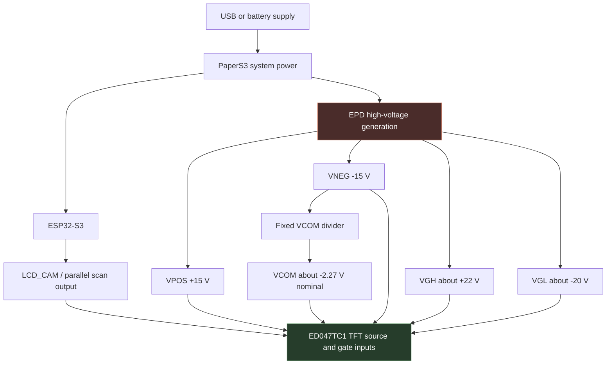
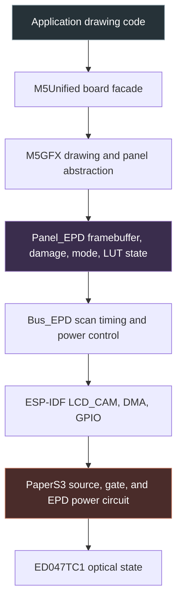
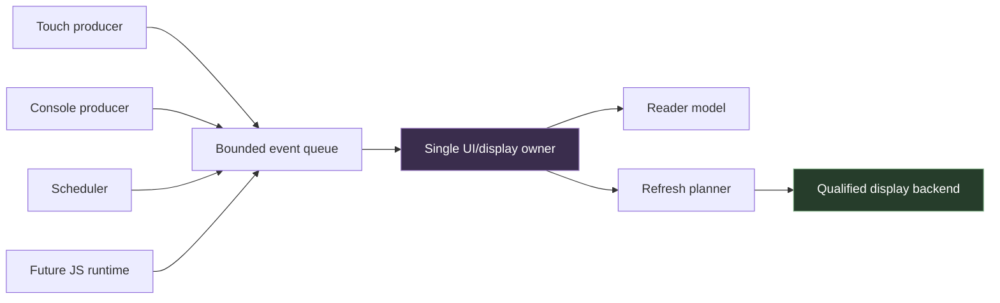

# Driving PaperS3 E-Paper Correctly

## Physics, waveforms, analog rails, and reproducible qualification

> [!info] Project context
> This is the complete technical report behind [[PROJ - PaperS3 E-Reader - Interactive Book Reader on E-Ink]] and the current native-reader qualification effort. It corrects the PaperS3 low-level drive description in [[E-Ink Display Driving]]: PaperS3 directly drives the ED047TC1 source and gate interface; it does not use an IT8951 controller.
>
> The evidence corpus and reproducibility scripts live under `/home/manuel/workspaces/2025-12-21/echo-base-documentation/esp32-s3-m5/ttmp/2026/07/14/ESP-50-PAPERS3-EREADER-PRIMITIVES--papers3-e-reader-native-primitives-and-future-javascript-api/`.

The PaperS3 can draw crisp text while failing to produce a convincing whole-screen black. That result is not contradictory. An electrophoretic display does not assign a stored digital color to each pixel. Software requests a sequence of electrical actions; the panel's pigment particles move in response; the final reflectance depends on the complete voltage history, temperature, common-electrode voltage, generated rails, spatial load, and starting optical state.

This report explains that system from first principles and records a concrete hardware investigation. The work began as Phase 0 of a native e-reader project. The initial objective was to select an ESP-IDF, M5GFX, and M5Unified combination before building text layout, pagination, storage, touch interaction, power management, and a future MicroQuickJS API. The qualification firmware passed its digital and memory-safety tests. Its visual output did not pass. That distinction changed the direction of the project.

> [!summary]
> - PaperS3 directly drives a 540×960 ED047TC1 active-matrix electrophoretic panel. It does not use an IT8951 display controller.
> - ESP-IDF 5.3.4 and 5.4.2 produced the same weak visual endpoints with identical current M5 components, so the IDF version is not the leading cause.
> - Official FactoryTest V0.5 appeared to show a similar whole-black weakness while its final dashboard text remained decently crisp.
> - Factory V0.5 and the current qualification firmware are not independent waveform controls: M5GFX 0.2.15 and 0.2.25 contain identical built-in quality, text, fast, fastest, and eraser LUTs.
> - The next decisive test is an independent PaperS3 driver with explicit cleanup and DC-balance behavior, followed by area-dependent rail and VCOM measurements if broad black still fails.

## 1. Why the reader project stopped at Phase 0

An e-reader is not useful if the display layer has unknown optical behavior or can accumulate damaging electrical imbalance. Text parsing, pagination, book storage, touch zones, and scripting can all be implemented while the display remains underqualified, but doing so compounds uncertainty. Every visual defect then becomes difficult to attribute: the reader layout, dirty rectangles, waveform selection, firmware version, panel state, and analog hardware all change together.

The project therefore defined a strict dependency order:

1. qualify the physical display path;
2. build native rendering, text, storage, pagination, input, and power primitives;
3. ship a native reader vertical slice;
4. generalize the proven primitives into widgets and regions;
5. evaluate MicroQuickJS against a stable native ABI.

This order prevents the JavaScript runtime from becoming part of display diagnosis. It also prevents application architecture from codifying false assumptions such as “quality mode always produces the best monochrome result” or “a successful display call means the panel reached the requested optical state.”

The Phase 0 firmware is `0106-papers3-epd-qualification`. It owns the display through one transaction boundary, exposes deterministic console commands, captures heap and timing diagnostics, and separates automatic success from operator visual acceptance. The harness became necessary because earlier PaperS3 examples proved that frames could be submitted, but did not establish a reproducible optical baseline across component and toolchain versions.

### 1.1 The broader reader program

The long-term product is a battery-aware PaperS3 reader and a native primitive layer that can later support a fluent `s3paper` JavaScript API. The imported browser prototype expresses pages, rows, columns, text, lists, books, and scheduled regions. Its strongest design idea is the transformation pipeline:

```text
builder calls
  -> plain widget description
  -> measured layout
  -> flat draw operations
  -> damage and refresh plan
  -> hardware backend
```

The embedded implementation deliberately starts below the builder syntax. It first needs explicit contracts for geometry, clipping, bounded draw storage, display ownership, touch events, timers, font metrics, UTF-8 decoding, line breaking, stable content locators, atomic persistence, and power transitions. These services remain useful whether the final authoring surface is C++, JavaScript, or generated data.

Earlier repository experiments provide partial evidence:

| Firmware | What it proves | Why it is not the final foundation |
|---|---|---|
| `0075-papers3-touch-draw-demo` | Low-latency touch drawing and clipped fast updates | Direct input-to-display calls do not scale to multiple producers |
| `0078-papers3-gnosis-layout` | Retained nodes, recursive layout, dirty rectangles, waveform hints | Fixed font, weak capacity errors, and simplified cleanup accounting |
| `0080-papers3-ereader` | Library screen, text chunks, page offsets, bookmarks, page-turn zones | Character-count pagination, unstable page-number persistence, tiny SPIFFS, and synchronous pre-pagination |
| `0079-papers3-wamr-assemblyscript-console` | Bounded guest-to-host display intent queue | Experimental WAMR command set rather than a reader ABI |
| `M5PaperS3-UserDemo` | Board initialization, display test, SD, battery, touch, and power references | Product demo with a shared M5GFX waveform family, not an optical specification |

The complete roadmap contains thirteen phases and 160 concrete tasks. Phase 0 covers hardware and driver qualification. Phases 1 through 10 build a fully native reader: one owner task, defensive geometry, a fake backend, refresh planning, normalized input, measured typography, SD content, locator-based pagination, the reader vertical slice, generalized widgets, and coordinated power behavior. Phases 11 and 12 evaluate and then bind MicroQuickJS. Phase 13 performs long-run hardening.

The native architecture centers on one ownership rule: only the UI/display owner mutates the reader model or panel. Touch, console, timers, storage notifications, and future scripts send bounded messages. Rendering produces flat operations in frame-owned memory. A refresh planner maps semantic intents to the waveform and cleanup policy that Phase 0 eventually qualifies.

This report focuses on the display because every later layer depends on it. The full application roadmap is preserved in `design-doc/01-papers3-e-reader-primitives-analysis-design-and-implementation-guide.md` and `tasks.md`.

## 2. What an electrophoretic pixel is

The ED047TC1 is a reflective active-matrix electrophoretic display. Its visible state is produced by pigment particles suspended in a dielectric fluid. The black and white particle populations carry opposite charge. An electric field across a pixel causes one population to move toward the viewing surface and the other to move away. Reversing the field reverses the direction of motion.

The display is reflective because ambient light enters through the viewing side and is scattered primarily by the particles nearest that surface. It is bistable because the particles remain substantially in place after the driving field is removed. Bistability removes the need for continuous refresh power, but it does not make updates digital or instantaneous.

A useful pixel state model has at least these variables:

```text
x(t)       distribution of pigment particles through the capsule depth
Vpixel(t)  pixel-electrode voltage
VCOM(t)    common-electrode voltage
E(t)       effective field, proportional to Vpixel(t) - VCOM(t)
T          panel temperature
H          previous electrical and optical history
R(t)       observed reflectance
```

The requested grayscale value is not one of these state variables. It is an input to a waveform-selection algorithm. The algorithm chooses a sequence of field polarities and durations intended to transform one particle distribution into another.

A simplified expression for particle displacement is:

$$
\Delta x \propto \int_0^\tau \mu(T, E, H)\,E(t)\,dt
$$

Here $\mu$ is an effective mobility that depends on temperature, field strength, particle state, fluid viscosity, and history. This expression is not a complete electrohydrodynamic model. It is sufficient to show why pulse polarity, duration, temperature, and prior state all matter. Two waveforms with equal net signed duration can produce different optical states because mobility is nonlinear and history dependent.

### 2.1 Why particles need multiple phases

A high-quality update commonly includes more than a final write pulse. It can include stages that erase the previous image, activate particles by alternating fields, drive toward a reference extreme, and then write the target state. These stages reduce dependence on the unknown distribution left by earlier updates.

A representative process contains:

1. **erase** — reduce the optical contribution of the previous target;
2. **activation** — move particles through alternating fields to reduce trapping and state dependence;
3. **reference-state drive** — establish a known black or white endpoint;
4. **target write** — apply the calibrated sequence for the final gray level.

The exact stage count and polarity are panel- and waveform-specific. A short direct update can omit several stages and still be useful for transient interaction. It should not be assumed to produce the same endpoint or long-term electrical balance as a calibrated full update.

### 2.2 Why grayscale is temporal

The ED047TC1 specification states that gray-level capability depends on the associated controller and waveform. The panel does not expose a persistent four-bit grayscale register per pixel. During each scan pass, the source driver applies one of a small set of electrical actions. Repeating and combining those actions over time moves the particles to intermediate distributions that produce intermediate reflectance.

M5GFX documents four phase actions in its EPD LUT representation:

```text
0 = end of sequence
1 = drive toward black
2 = drive toward white
3 = no operation
```

Other drivers encode equivalent physical actions with different numbers. The meaning must be read from each implementation rather than inferred from the numeric value.

## 3. Active-matrix scanning on the ED047TC1

The ED047TC1 contains a TFT backplane. A gate scan selects one row at a time. Source data determines the pixel-electrode action for the selected row. The complete panel is updated by repeating that process for every row, then repeating full-panel passes for every waveform phase.


The gate rails must switch the TFT rows fully on and off. The source rails must provide sufficient positive and negative voltage for particle motion. VCOM establishes the common-electrode reference. A correct framebuffer and correct scan coordinates are necessary, but neither is sufficient for correct optics.

### 3.1 The electrical actions at one pixel

For a selected row, the panel sees the difference between the pixel electrode and VCOM. A driver action that moves the panel toward black on one design can use the opposite numerical encoding from another design. The physically relevant value is the field polarity across the electrophoretic layer.

For a non-selected row, the TFT should isolate the pixel storage node. Gate timing, output-enable timing, latch timing, and source shift timing must preserve that isolation. A scan defect can produce stripes, repeated columns, or row-local artifacts even when the waveform table itself is correct.

### 3.2 Full-screen work is an analog load

A full-screen black transition commands the same polarity over a large fraction of the source channels. A checkerboard commands mixed polarity or no-op states across neighboring channels. Sparse text activates a much smaller area. These patterns place different instantaneous loads on the generated source rails and VCOM network.

That distinction is central to the observed evidence:

- sparse text on the factory dashboard was decently crisp;
- a checkerboard under TEXT appeared to contain deep black cells;
- a controlled full-screen TEXT black was almost white;
- whole-screen factory black appeared to have a similar weakness.

A pattern-dependent result can come from waveform transition history, analog load, optical perception, or all three. It cannot be diagnosed by changing only the framebuffer color constant.

## 4. The PaperS3 display hardware

PaperS3 combines an ESP32-S3R8, 8 MB of octal PSRAM, 16 MB of flash, a GT911 touch controller, and a 4.7-inch 960×540 logical display. The physical ED047TC1 panel is specified as 540×960; the common application orientation rotates it into 960×540 landscape coordinates.

The board drives the panel directly from ESP32-S3 peripherals and GPIO control signals. This point corrects an earlier assumption present in some project notes: PaperS3 does **not** use an IT8951 controller. The relevant implementation is M5GFX's `Bus_EPD.cpp` and `Panel_EPD.cpp`, not `Panel_IT8951.cpp`.

### 4.1 High-voltage rails

The ED047TC1 requires several rails beyond the ESP32's logic voltage. The panel specification and PaperS3 schematic indicate approximate operating values in this range:

| Rail | Function | Approximate target |
|---|---|---:|
| VPOS | Positive source drive | +15 V |
| VNEG | Negative source drive | −15 V |
| VGH / VGG | Gate-on drive | +22 V |
| VGL / VEE | Gate-off drive | −20 V |
| VCOM | Common electrode reference | Panel-assigned negative voltage |

The values above are nominal design targets, not measurements from the tested unit. Their loaded behavior remains unmeasured.

The PaperS3 VPOS regulator uses an MT3608-class boost stage and a 120 kΩ / 5.1 kΩ feedback divider. Under the usual feedback relationship, that divider implies approximately +14.7 V. Separate circuitry derives the negative source and gate rails. The schematic has no clearly designated test points for these rails, so physical probing requires fine access and a reviewed safety procedure.

### 4.2 Fixed VCOM

The PaperS3 schematic shows VCOM derived from VNEG through a 5.6 kΩ / 1 kΩ divider. If VNEG is −15 V, the nominal divider output is:

$$
V_{COM} = -15\,\text{V}\times\frac{1\,\text{k}\Omega}{5.6\,\text{k}\Omega+1\,\text{k}\Omega}
\approx -2.27\,\text{V}
$$

The ED047TC1 documentation requires the panel-assigned VCOM value to be respected within approximately ±0.1 V. The assigned value is a property of the panel module and must be read from the panel marking or manufacturing data. PaperS3's VCOM is fixed by resistors rather than adjusted in firmware.

A mismatch does not necessarily produce total failure. It can shift the symmetry of black and white transitions, alter ghosting, bias grayscale, and interact with load and temperature. No resistor change is justified until the actual panel assignment and the loaded board voltage are measured.

### 4.3 Power and scan layers



A software waveform is valid only in combination with the actual rail amplitudes, timing, VCOM, and temperature. Copying a pulse sequence from another board that uses the same panel does not prove equivalence if its power circuit or scan timing differs.

## 5. The PaperS3 software stack

Application code reaches the panel through several layers:



M5Unified identifies the board and exposes `M5.Display`. M5GFX stores drawing results in a panel buffer, tracks modified ranges, quantizes pixels, selects an EPD mode, and queues updates. `Panel_EPD` advances each pixel through eraser and target LUT phases. `Bus_EPD` emits row scans and controls the panel power signals.

### 5.1 Framebuffer state is not physical state

At least three states must be kept distinct:

1. **target framebuffer** — what application code wants to display;
2. **driver transition state** — what phase each pixel is currently executing;
3. **physical panel state** — the actual particle distribution and reflectance.

The driver estimates physical history from previous target values and completed phases. It cannot observe reflectance directly. A reset, interrupted update, rail failure, different driver, or unmodeled particle drift can make the driver's assumed state diverge from the panel.

This is why a driver can report completion and retain heap integrity while the panel remains pale or ghosted. The transaction completed according to software; the optical endpoint did not meet the user's requirement.

### 5.2 M5GFX mode names

M5GFX exposes modes named QUALITY, TEXT, FAST, and FASTEST. These are policy labels, not optical specifications.

| Mode | Relevant implementation behavior | Observed Cell C result |
|---|---|---|
| QUALITY | Long generic grayscale sequence with eraser path | Lightest black, strange gradients |
| TEXT | Special handling for white-sensitive transitions | Light black, texture; full black almost white |
| FAST | Reduced sequence and monochrome quantization | Uniform gray |
| FASTEST | Direct no-erase path for speed | Darkest of four, but textured |

The darker FASTEST result does not make it the best reader mode. Its direct path deliberately sacrifices cleanup and can retain prior state. QUALITY's name does not guarantee a strong solid-black endpoint. The correct mode depends on a qualified transition policy and workload.

### 5.3 Generic target-level LUTs

The PaperS3 M5GFX configuration does not install an ED047TC1-specific origin-to-target waveform. It uses generic built-in arrays from `Panel_EPD.cpp`. The arrays select actions by target level and phase, while a generic eraser mechanism incorporates some previous-state handling.

An ED047TC1 EPDiy waveform has a different representation. It explicitly indexes transitions from an origin gray level to a target gray level and supplies phase programs for those transitions. That structure can express W→B, B→B, B→W, and W→W as different sequences even when the target is the same.

This distinction matters because a requested black reached from white is not physically equivalent to black maintained from black. A target-only pulse count cannot represent every transition-specific correction unless additional state machinery supplies it.

## 6. Waveform correctness, temperature, and DC balance

A useful waveform must satisfy more than immediate contrast. It must produce stable endpoints across supported temperatures, limit ghosting, preserve reasonable update time, and avoid long-term electrochemical or electrical bias.

### 6.1 Temperature

Particle mobility decreases as the fluid becomes more viscous at lower temperature. A waveform calibrated at one temperature can underdrive at another. Longer or additional pulses can compensate, but a fixed extension applied indiscriminately can overdrive at warmer temperatures.

The qualification runs did not yet record panel temperature. This omission does not explain the matching C/D result by itself, but it prevents a complete waveform judgment. Future evidence must include ambient and, preferably, panel-adjacent temperature.

### 6.2 Transition history

The panel retains both optical state and less visible internal state. Repeated partial updates can leave residual charge or particle distributions that alter later transitions. M5GFX maintainers have reported effects lasting tens of minutes after excessive control. A power cycle is therefore not a guaranteed reset of panel history.

A controlled test must specify:

- the cleanup waveform before the test;
- the hold time after cleanup;
- the starting image;
- the exact transition sequence;
- the number of repetitions;
- the temperature;
- the final cleanup.

Without these fields, two photographs of “black” may represent different experiments.

### 6.3 DC balance

DC balance concerns the cumulative signed electrical drive applied to the electrophoretic layer. A sequence that repeatedly favors one polarity can produce charge accumulation, persistent artifacts, or damage. Exact safe limits depend on panel construction and waveform design.

A practical engineering record should track, for each physical pixel or transition class:

```text
cumulative_darkening_dose
cumulative_lightening_dose
no_op_duration
cleanup_generation
assumed_origin_state
```

This record does not replace a vendor waveform, but it prevents a refresh planner from issuing unlimited one-sided updates without cleanup.

> [!warning]
> Increasing darkening pulses until a photograph looks better is not a safe waveform-development method. Immediate darkness does not establish DC balance, endpoint stability, temperature tolerance, or panel lifetime.

## 7. Building a reproducible qualification matrix

The first qualification decision was to compare toolchains and M5 components without allowing local source drift. Four matrix cells were defined:

| Cell | ESP-IDF | M5GFX | M5Unified | Purpose |
|---|---|---|---|---|
| A | 5.3.3 | 0.2.15 | 0.2.10 | Exact official factory-era control |
| B | 5.3.3 | 0.2.25 | 0.2.18 | New M5 stack on factory IDF |
| C | 5.3.4 | 0.2.25 | 0.2.18 | Locally available 5.3 line |
| D | 5.4.2 | 0.2.25 | 0.2.18 | Newer IDF control |

Exact ESP-IDF 5.3.3 was not installed, so Cells A and B failed closed rather than silently substituting 5.3.4. This preserves the meaning of the matrix. Cells C and D built successfully.

The preparation scripts clone or check out exact component tags into isolated matrix directories and reject dirty checkouts. This rule was necessary because the nearby `M5PaperS3-UserDemo/components/M5GFX` repository contains local modifications and therefore cannot serve as reproducible evidence.

### 7.1 Qualification transaction boundary

Every draw operation runs inside a `DrawTransaction` that establishes ordering and captures outcome:

```text
DrawTransaction(scene, mode, geometry):
  wait until the display is idle
  record heap and timing baseline
  set the EPD mode
  start write transaction
  draw deterministic scene
  end write transaction
  wait for physical scan completion
  verify heap integrity
  update full/partial counters and latency statistics
  return explicit pass/fail result
```

The transaction does not claim optical success. It proves that software submitted and completed a bounded operation without detected memory corruption.

### 7.2 Deterministic visual corpus

The harness includes:

- full white;
- full black;
- white→black and black→white transitions;
- sixteen grayscale bars;
- checkerboards;
- mixed text and geometry;
- four-mode simultaneous comparison;
- rotation and boundary scenes;
- partial/full update soak;
- text soak;
- sleep and wake;
- heap and timing status.

The visual corpus intentionally includes pathological area fills and realistic text. Solid black is not the primary reader workload, but it is a strong diagnostic for waveform dose, rail load, uniformity, and scan gradients.

### 7.3 Boundary and memory-safety testing

M5GFX Issue 181 reports two `Panel_EPD` memory corruption classes: odd byte-width processing and rotation-dependent update rectangles. The harness therefore tests widths from 1 through 16 pixels, all corners and edges, and rotations 0 through 3. It checks heap integrity after the corpus.

This separation produced an important result: the current driver can be machine-stable over hundreds of updates while remaining visually unacceptable. Fixing memory safety and qualifying optics are distinct tasks.

### 7.4 Serial ownership

The ESP32-S3 USB Serial/JTAG device is treated as single-owner. The active monitor runs in one tmux pane. Reflash uses the monitor's configured command or the monitor is exited before a separate esptool operation. Parallel monitors and flashers were prohibited because they create write timeouts, missing logs, and false crash evidence.

The first Cell C flash failed after a USB disconnect at 21 percent:

```text
Lost connection, retrying...
serial.serialutil.SerialException: device reports readiness to read but returned no data
(device disconnected or multiple access on port?)
```

Moving the host connection and reducing flash baud to 115200 produced a stable flash. The failure is preserved as transport evidence rather than attributed to panel code.

## 8. What Cells C and D proved

Cell C used ESP-IDF 5.3.4, M5GFX 0.2.25, and M5Unified 0.2.18. Cell D used ESP-IDF 5.4.2 with the same M5 revisions. Both identified the PaperS3 display correctly and exposed 8 MB of PSRAM.

### 8.1 Automatic Cell C results

Cell C completed:

- boundary rotations 0 through 3;
- 260 partial updates;
- multiple full updates;
- sleep and wake;
- prompt continuity;
- heap integrity checks.

A representative final status was:

```text
boundary.rotation=0 result=pass
boundary.rotation=1 result=pass
boundary.rotation=2 result=pass
boundary.rotation=3 result=pass
display_sleep_cycle_ms=2003
heap.integrity=pass
updates.total=271
updates.full=11
updates.partial=260
updates.average_ms=1831
updates.max_ms=2837
```

These values establish a functioning digital path and stable memory behavior for the tested corpus. They do not qualify contrast, ghosting, or panel safety.

### 8.2 Visual Cell C results

The visual findings were consistent enough to reject a naive mode selection:

| Scene | Operator result | Disposition |
|---|---|---|
| QUALITY full black | Washed-out gray with gradients | Fail |
| QUALITY grayscale | Weak black endpoint and ghosting | Fail pending objective measurement |
| TEXT checkerboard | Apparently deep black cells | Ambiguous; pattern dependent |
| TEXT white→black full screen | Very light, almost white, slight ghost | Fail |
| Four-mode comparison: QUALITY | Lightest, strange gradients | Fail |
| Four-mode comparison: TEXT | Light, textured | Fail for solid black |
| Four-mode comparison: FAST | Gray, very uniform | Not final-quality black |
| Four-mode comparison: FASTEST | Deepest, textured | Not clean reader default |

The checkerboard and full-black difference is the strongest clue in the visual corpus. It shows that target color alone does not predict the endpoint.

### 8.3 Cell D result

Cell D reproduced the almost-white TEXT white→black result. It also passed the boundary corpus and heap checks, ending with 267 updates, approximately 305 kB free internal heap, and approximately 7.09 MB free SPIRAM.

Matching C and D behavior lowers the probability that ESP-IDF 5.4.2 introduced this optical problem. It does not prove that every scan signal is identical, but it makes another blind IDF swap a low-value next step.

## 9. The official factory control

M5Stack publishes `C139-PaperS3-FactoryTest-V0.5_0x0.bin` as a merged image. Its release SHA-256 in this investigation is:

```text
d6733a0ca378f95335fa5fba4d4d992fb1dd97c17557b20e9aebfca08ba6d624
```

The upstream source at tag V0.5 performs this boot sequence:

1. draw `FactoryTest: V0.5` in QUALITY mode and hold for one second;
2. fill the screen black in QUALITY mode and hold for two seconds;
3. fill the screen white in QUALITY mode and hold for two seconds;
4. draw sixteen grayscale bars and hold for two seconds;
5. enter the normal factory dashboard.

The official README specifies ESP-IDF 5.3.3. `repos.json` selects M5GFX 0.2.15 and M5Unified 0.2.10. Flashing the published merged binary avoided rebuilding with an unavailable or substituted toolchain.

### 9.1 Factory visual result

The operator reported:

> “i think it looks like it might have had the same kind of issues when doing a whole black view.”
>
> “the final dashboard is decently crisp at least for text and such.”

The black result is tentative because the screen is held for only two seconds and no controlled photograph was taken. The final dashboard result is still informative. The panel can render readable sparse text and structured UI under official firmware. A grossly dead panel, completely broken bus, or universal inability to produce dark pixels is unlikely.

Factory white and grayscale bars were not separately dispositioned. The factory control therefore remains incomplete as an optical dataset.

## 10. Why factory firmware did not clear M5GFX

A factory binary is independent only along the dimensions that actually differ. The V0.5 application and toolchain differ from Cells C/D, but their waveform tables do not.

A reproducible script downloaded `Panel_EPD.cpp` from M5GFX tags 0.2.15 and 0.2.25, normalized each built-in LUT initializer, and hashed it. The result was:

```text
lut_quality=IDENTICAL
lut_text=IDENTICAL
lut_fast=IDENTICAL
lut_fastest=IDENTICAL
lut_eraser=IDENTICAL
```

| LUT | 0.2.15 normalized SHA-256 prefix | 0.2.25 normalized SHA-256 prefix |
|---|---|---|
| quality | `122bd510ae758912` | `122bd510ae758912` |
| text | `645a1b1a8b756a6e` | `645a1b1a8b756a6e` |
| fast | `b586ca3d9c59a4da` | `b586ca3d9c59a4da` |
| fastest | `133e39cdb25f0eee` | `133e39cdb25f0eee` |
| eraser | `7ac381da1078a072` | `7ac381da1078a072` |

The factory result establishes that the concern survives an official application, official merged image, older IDF, and older M5 stack. It does not establish that an ED047TC1-specific or independently calibrated waveform fails on this hardware.

This finding also explains why the factory result looked familiar. Both paths issue the same generic QUALITY pulse table for broad black.

## 11. Similar PaperS3 bug reports

A targeted search found no public report with the exact controlled wording of this experiment. It did find direct PaperS3 reports that constrain the diagnosis.

### 11.1 M5GFX Issue 119: progressive gray under M5GFX

One PaperS3 user compared the same clock workload under a new M5GFX driver and EPDiy. The report states:

> “With the new M5GFX library the areas which are not updated gradually get greyer and greyer.”

The thread also reports faint residue after `clearDisplay()` and several driver adjustments. A later development version became approximately equivalent to EPDiy for that workload. This is direct evidence that software control can materially change PaperS3 optics without changing the panel.

The report concerns gradual drift and partial updates rather than an immediate full-black endpoint. It supports an independent-driver A/B test; it does not prove that M5GFX causes the current area-fill behavior.

### 11.2 M5GFX Issue 152: excessive strain and long-lived history

In Issue 152, the maintainer wrote:

> “v0.2.11 has a fatal control issue that has already been found to place excessive strain on the EPD. The effects of this load can remain for several tens of minutes even after the power is turned off.”

The maintainer further described unnecessary refresh of unchanged pixels and gradation shifting after release. A later comment states that one personally owned PaperS3 has undamaged pixels with unstable gradations that tend toward gray with continued use.

These comments establish two methodological requirements:

- power-off time alone cannot be assumed to erase panel history;
- waveform comparisons need controlled cleanup and recovery periods.

They also justify caution. The project should not run large unbalanced endurance corpora until the endpoint problem is understood.

### 11.3 M5GFX Issue 166: unresolved panel, circuit, or driver cause

For a localized PaperS3 line instability, the maintainer listed three possible causes:

> “There may be a flaw in the M5GFX's control, causing overload on the panel.”
>
> “There may be a flaw in the PaperS3's EPD control circuit, making it more susceptible to damage.”
>
> “The EPD panel itself may be designed to be more susceptible to damage.”

The current board has not shown a fixed line defect. This report is therefore a risk signal, not a symptom match. It shows that upstream does not have a complete causal account for all PaperS3 gradation instability.

### 11.4 M5GFX Issue 160: a real IDF 5.4 scan defect

Issue 160 traced visible stripes under ESP-IDF 5.4+ to GPIO11 and GPIO12 remaining open-drain after an ESP-IDF LCD-driver refactor. Bus speed changed stripe width, and the reporter bisected the behavior to a specific IDF commit.

This report proves that IDF changes can alter physical panel signals. It does not fit the current evidence:

- Cell C under 5.3.4 and Cell D under 5.4.2 looked alike;
- the reported stripe pattern was not observed;
- factory firmware showed a similar broad-black concern;
- current M5GFX contains later control changes.

GPIO mode and logic timing should still be verified if a logic analyzer is attached.

### 11.5 M5GFX Issue 157: M5GFX 0.2.15 canvas regression

Issue 157 reports black/white inversion, blank output, and inability to clean a PaperS3 screen in `Canvas::pushSprite` workloads under M5GFX 0.2.15. Version 0.2.16 fixed that issue.

Factory V0.5 uses 0.2.15, but its boot black and white use direct `fillScreen`, not the reported canvas path. Cells C/D use 0.2.25 and share the broad-black concern. Issue 157 prevents treating every factory drawing path as pristine, but it does not explain the common direct-fill result.

## 12. Analog evidence from another ED047TC1-class board

LilyGo's T5 4.7 S3 uses an ED047TC1-class panel with different board electronics. Its Issue 93 thread contains measured analog failures:

- approximately 3.5 V peak-to-peak ripple on the +22 V rail during update;
- oscillation on a +15 V stage;
- VCOM-dependent corruption;
- untouched regions darkening while refreshed data remained clear.

The report states:

> “I've changed my VCOM voltage by adjusting the potentiometer to ~-1.1V which reduced the corruption significantly.”

That voltage is not a recommendation for PaperS3. The LilyGo board has a different VCOM circuit and panel assignment. The value must not be transplanted.

The relevance is methodological: gate-rail ripple, source-rail regulation, and VCOM can produce spatial and history-dependent artifacts that resemble software defects. PaperS3's own rails must be measured during its own update patterns.

## 13. Ranked causal assessment

The evidence supports a ranked set of hypotheses rather than a single conclusion.

### 13.1 Generic M5GFX waveform or transition-model mismatch

This is the leading hypothesis.

Evidence supporting it:

- PaperS3 installs no ED047TC1-specific M5GFX LUT;
- factory and current M5GFX use identical built-in pulse arrays;
- TEXT full black fails despite checkerboard black appearing deeper;
- mode selection changes density and texture substantially;
- direct PaperS3 reports compare M5GFX unfavorably with EPDiy for some workloads;
- independent drivers publish PaperS3-specific waveforms and explicit cleanup behavior.

Evidence limiting the conclusion:

- no independent driver has yet run on this unit;
- broad-area rail behavior is unmeasured;
- temperature and panel VCOM assignment are unknown.

### 13.2 Full-area rail or VCOM droop and ripple

This is the strongest co-hypothesis.

Evidence supporting it:

- sparse text is crisp while broad black is poor;
- checkerboard and full-area output differ;
- EPD source and gate rails are generated by discrete high-voltage circuitry;
- analogous hardware demonstrates rail-ripple and VCOM-sensitive corruption.

Evidence limiting the conclusion:

- no PaperS3 rail has yet been measured;
- waveform history can produce the same area correlation;
- perceived uniformity of a large dark field is more sensitive than sparse text.

### 13.3 Fixed VCOM mismatch

PaperS3's nominal fixed VCOM is approximately −2.27 V if VNEG is −15 V. The panel expects its assigned value within approximately ±0.1 V. A mismatch is physically credible.

This hypothesis remains untested because the panel assignment has not been identified and loaded VCOM has not been measured. No hardware modification is justified before both values are known.

### 13.4 Temperature and transition history

Both variables are known to influence electrophoretic mobility and endpoint stability. The qualification corpus did not yet record temperature, and earlier mode cycling may have altered panel history. These factors can amplify another defect rather than act as the sole cause.

### 13.5 Unit-specific panel or control-circuit defect

A defective or unusually calibrated unit remains possible. The crisp dashboard argues against total failure, but does not exclude area-dependent weakness or unstable gradation. Comparison with a second physical PaperS3 would be valuable.

### 13.6 Lower-probability explanations

The following causes are now lower probability:

- **ESP-IDF version alone** — Cells C and D match, and factory behavior is similar.
- **rotation or framebuffer geometry** — boundaries and rotations pass, and stock UI geometry is correct.
- **simple color inversion** — modes produce different densities and white remains distinguishable.
- **heap corruption as the visual cause** — repeated integrity checks pass after hundreds of updates.

## 14. Independent drivers and what they can prove

The next control must change the waveform and transition implementation, not only the application.

### 14.1 EPDiy

EPDiy represents waveforms as origin-to-target transition programs. The collected ED047TC1 header contains transition data with multiple phase lengths. This representation can encode explicit W→B, B→W, W→W, and B→B behavior.

Advantages:

- panel-specific waveform structure;
- mature explanation of direct parallel drive;
- explicit temperature and mode concepts in vendor waveform tooling;
- direct relevance to reports comparing it with M5GFX.

Risks:

- integration across ESP-IDF versions has required forks and compatibility changes;
- board scan and power definitions must match PaperS3 exactly;
- a collected waveform's provenance and target panel revision must be verified.

### 14.2 FastEPD

FastEPD's author published a PaperS3-specific 16-gray matrix with 25 actions per target level. The accompanying explanation states that several same-polarity pushes are normally required to reach full black or full white.

FastEPD also had a confirmed 4-bpp backup-buffer overrun triggered by a clear operation on 960×540 hardware. That issue was fixed after the reporter identified the path. Any experiment must pin a revision containing the fix and run heap checks.

FastEPD is useful as a second independent waveform family, but EPD_Painter currently provides a more direct minimal PaperS3 preset and explicit high-quality black setting.

### 14.3 EPD_Painter

EPD_Painter is a current independent driver that explicitly targets M5PaperS3. A pinned snapshot at commit `753c521da8aef59756df07c1a4eb88f1c64c8227` is preserved in the ticket.

Its PaperS3 preset includes:

- explicit board pins;
- direct LCD_CAM DMA;
- fast, normal, and high lighter waveforms;
- fast, normal, and high darker waveforms;
- hard and soft clear operations;
- an explicit DC-balance path;
- a waveform calibration tool;
- `QUALITY_HIGH`, documented as the deepest-black setting.

| Driver | Transition representation | PaperS3-specific data | Cleanup model | Best use in this investigation |
|---|---|---|---|---|
| M5GFX | Generic target LUT plus eraser state | No custom ED047TC1 LUT installed | Generic eraser/mode state | Current baseline |
| EPDiy | Origin→target transition matrix | ED047TC1 waveform available | High-level state and waveform modes | Panel-specific control |
| FastEPD | Target gray matrix with repeated actions | Published M5 matrix | Library-specific full update | Secondary independent control |
| EPD_Painter | Separate lighter/darker tables by quality | Explicit M5PaperS3 preset | Hard/soft clear and DC-balance APIs | Preferred next minimal A/B |

Third-party documentation is not proof of safe behavior. EPD_Painter must be source-reviewed and first run with a minimal bounded sequence, not an animation demo or long soak.

## 15. The next decisive experiment

The next experiment should answer one question: can an independent PaperS3-specific waveform produce a deep, uniform full black on this exact unit after a controlled cleanup?

### 15.1 Minimal EPD_Painter control

The control should contain no Wi-Fi, touch UI, filesystem, animation, or application framework. It should expose serial commands and run one transaction at a time.

```text
boot:
  initialize PaperS3 preset
  print exact driver commit and build metadata
  measure temperature if available
  remain idle without changing panel

command cleanup:
  execute documented hard clear to white
  wait for completion
  hold for fixed recovery interval

command black-high:
  set QUALITY_HIGH
  fill target buffer black
  paint once
  wait for completion
  power down EPD rails according to driver contract

command white-high:
  set QUALITY_HIGH
  fill target buffer white
  paint once
  wait for completion

command area N:
  start from hard-clean white
  render centered black area at N percent coverage
  update once at QUALITY_HIGH

command finish:
  execute documented DC-balanced cleanup
  verify heap integrity
```

The first run should use only cleanup, one full black, one full white, one realistic page, and cleanup. The area series follows only after those operations are understood.

### 15.2 Controlled transition matrix

The complete optical matrix should include:

| Origin | Target | Purpose |
|---|---|---|
| White | White | Measure unnecessary drive and white stability |
| White | Black | Primary darkening endpoint |
| Black | White | Primary erasure and ghosting endpoint |
| Black | Black | Measure maintenance and state drift |
| Checkerboard A | Checkerboard B | Spatial inversion and edge behavior |
| Reader page A | Reader page B | Real page-turn workload |

Every row should be repeated from the same cleanup procedure and temperature range.

### 15.3 Area-dependent test

To separate waveform mismatch from analog load, compare black coverage while holding mode and history constant:

```text
1% sparse marks
5% realistic text
25% centered rectangle
50% half-screen
75% broad field
100% full black
16 sequential tiles totaling 100%
```

The sequential-tile case is especially informative. If sixteen independently refreshed tiles become dark while a simultaneous full-screen update remains pale, rail/VCOM load or scan-current behavior rises sharply in probability. If both remain pale, waveform dose, VCOM offset, temperature, or panel state remain stronger.

### 15.4 Objective optical capture

Human observation is necessary but insufficient. The capture setup should fix:

- camera position and angle;
- illumination position and intensity;
- manual exposure;
- manual white balance;
- focus;
- a matte neutral reference;
- crop coordinates;
- time after update.

For each region, record mean luminance, standard deviation, and scan-direction gradient. Camera values are not absolute reflectance without calibration, but controlled relative measurements can distinguish a weak endpoint from a uniformity defect.

A measurement record should look like:

```json
{
  "driver": "epd-painter",
  "commit": "753c521d",
  "scene": "white-to-black-100pct",
  "quality": "high",
  "temperature_c": 23.4,
  "hold_after_ms": 5000,
  "mean_luma": 61.2,
  "stddev_luma": 8.7,
  "left_right_delta": 14.1
}
```

### 15.5 Rail and VCOM probing

If independent drivers retain the area-dependent failure, measure:

- VPOS during white→black at 5%, 50%, and 100% coverage;
- VNEG during the same transitions;
- VGH and VGL during gate scanning;
- VCOM DC level and ripple;
- input supply droop;
- phase timing relative to source and gate activity.

A multimeter can confirm approximate DC rails. An oscilloscope is required for ripple, transient droop, and pulse timing. The probing procedure must account for rails near +22 V and −20 V, fine-pitch access, and earth-referenced scope ground. An incorrect ground connection can short a generated rail or damage the board.

### 15.6 Logic timing capture

A logic analyzer can verify:

- source clock count per row;
- row-start and frame-start timing;
- latch and output-enable timing;
- phase count;
- whether GPIOs are push-pull rather than open-drain;
- whether full-area and checkerboard scenes differ only in source data.

Logic timing cannot measure VCOM or high-voltage amplitude. It complements rather than replaces analog probing.

## 16. Acceptance criteria for a reader display stack

The reader does not require perfect full-screen black for every interaction. It does require a known and safe policy for text, page turns, cleanup, sleep, and resume.

A candidate display stack should not be accepted until it demonstrates:

### 16.1 Optical criteria

- body text is dark, crisp, and uniform across the page;
- white page background remains stable;
- page A→page B ghosting is bounded and documented;
- periodic cleanup restores a known state;
- grayscale bars are monotonic if grayscale is supported;
- broad fields do not show unexplained scan gradients beyond an accepted limit.

### 16.2 Behavioral criteria

- first render after boot uses a known cleanup path;
- wake and reinitialization restore driver history safely;
- partial updates have explicit budgets;
- route changes and page changes trigger qualified policies;
- display operations have bounded waits and failure reporting;
- power-off waits for display idle and performs required cleanup.

### 16.3 Safety and stability criteria

- heap integrity survives boundary and mixed-update corpora;
- update rectangles are clipped and aligned safely;
- no serial-owner contention contaminates evidence;
- exact component commits and toolchain versions are recorded;
- DC-balance assumptions are documented;
- long-run soak begins only after endpoint behavior is understood.

## 17. Implications for the native reader architecture

The display investigation reinforces several architecture decisions in the broader reader plan.

### 17.1 One display owner

One task should own `M5.Display`, panel state, refresh history, and transaction ordering. Console, touch, timers, storage, and future script callbacks should enqueue commands or events. This avoids concurrent mutation of a stateful physical device and makes every update auditable.



### 17.2 Semantic intents, not raw mode names

Application code should request intents such as:

```text
CleanScreenTransition
ReaderPageTurn
LocalInteractiveFeedback
QuietStatusUpdate
WakeRepaint
ExplicitRecovery
```

The refresh planner maps each intent to a qualified waveform, damage region, cleanup decision, and telemetry record. Application code should not directly choose `epd_text` or `epd_fastest` based on names.

### 17.3 Damage tracking must include dependencies

E-paper damage is not only the rectangle whose pixels changed in a software tree. A changed text block can affect line wrapping, neighboring layout, anti-aliased edges, and cleanup history. The planner should align regions to panel constraints, merge nearby damage, and fall back to a full update when capacity or history requires it.

### 17.4 Native before MicroQuickJS

A script binding should expose stable semantic operations, not unstable driver details. Until text layout, hit testing, refresh planning, storage, pagination, and power behavior are proven natively, a fluent JavaScript API would freeze guesses into a public contract.

The future runtime should emit validated descriptors and events. It should not execute callbacks inside a display transaction or retain unbounded references to panel-owned state.

## 18. What the earlier e-ink documentation got wrong

The vault already contains an “E-Ink Display Driving” on-ramp and earlier PaperS3 project notes. Several statements in those notes must not be carried forward:

1. **PaperS3 does not use IT8951.** It directly drives ED047TC1 source and gate signals through the ESP32-S3 path implemented by M5GFX.
2. **A full refresh is not universally a fixed black→white→black→final sequence.** The actual phases depend on the driver's LUT, transition state, target, mode, and panel waveform.
3. **Partial refresh is not simply “drive changed pixels directly to final state.”** M5GFX can scan full rows or frames while assigning no-op actions to unchanged pixels, and its eraser/state logic varies by mode.
4. **`epd_text` is not currently a qualified default for PaperS3 reader text.** In the controlled full-screen test, its black endpoint was almost white.
5. **Periodic cleanup count cannot be selected by convention alone.** It must follow measured ghosting, area, elapsed time, transition history, and wake state.

The useful architectural principle remains: local updates need a bounded cleanup policy. The physical explanation and PaperS3-specific implementation must be corrected.

## 19. Reproducibility artifacts

The investigation is preserved as source, scripts, primary documents, and live evidence.

### 19.1 Firmware and tools

| Path | Purpose |
|---|---|
| `0106-papers3-epd-qualification/` | Standalone Phase 0 firmware |
| `0106.../matrix/cells.tsv` | A–D toolchain/component matrix |
| `0106.../tools/prepare_matrix_components.sh` | Exact-tag clean checkout preparation |
| `0106.../tools/build_matrix_cell.sh` | Isolated cell builds |
| `0106.../tools/flash_matrix_cell.sh` | Controlled flashing |
| `0106.../tools/run_qualification.py` | Exclusive serial qualification runner |

### 19.2 Ticket evidence

| Path | Purpose |
|---|---|
| `sources/hardware/2026-07-14-cell-C/` | Cell C transcript, metadata, observations |
| `sources/hardware/2026-07-14-cell-D/` | Cell D transcript, metadata, observations |
| `sources/hardware/factory-v0.5/` | Official binary, provenance, flash transcript, observations |
| `sources/hardware/ED047TC1-datasheet.pdf` | Panel electrical and optical specification |
| `sources/hardware/PaperS3-schematic-V1.0.pdf` | Board circuit source |
| `sources/hardware/epdiy_ED047TC1.h` | Independent origin→target waveform reference |
| `sources/code/m5gfx-lut-comparison/` | Exact M5GFX source and LUT hashes |
| `sources/code/epd-painter-753c521.../` | Pinned independent driver reference |
| `sources/web/17-25*.md` | Full related reports and forum captures |

### 19.3 Reproducible research scripts

| Script | Output |
|---|---|
| `scripts/06-download-epd-bug-reports.py` | Full GitHub issue threads as Markdown |
| `scripts/07-download-epd-painter-reference.sh` | Pinned driver source snapshot and hashes |
| `scripts/08-compare-m5gfx-luts.py` | M5GFX 0.2.15/0.2.25 source and LUT comparison |

Downloaded source files are normalized only for trailing whitespace where necessary for repository hygiene. Commit identifiers, URLs, and hashes are preserved in manifests.

## 20. Investigation chronology and commits

| Milestone | Result | Commit |
|---|---|---|
| Reader roadmap and 160-task plan | Native-first architecture and Phase 0 matrix | `9241f60` |
| Qualification harness | Deterministic scenes, boundaries, soak, diagnostics | `62b7b8ec19728dfe8ffc56ca659119b007363277` |
| Cell C evidence | Automatic pass, visual failure documented | `7d2a14d` |
| Physical investigation | Datasheet, schematic, VCOM/rail analysis | `60c3c94` |
| Physical diary record | Commit bookkeeping | `31ce8e9` |
| Factory and related reports | Factory binary, web corpus, independent drivers, LUT proof | `1e25338` |
| Factory diary record | Commit bookkeeping | `5c9430e` |

The board currently runs official FactoryTest V0.5. Cell D can be restored from its existing isolated build when the qualification harness is needed again.

## 21. Decisions reached

### Decision 1: Do not select a production M5GFX mode yet

**Status:** accepted.

The visual corpus does not support QUALITY, TEXT, FAST, or FASTEST as an unqualified reader default. Each has a different failure.

### Decision 2: Treat automatic and visual results separately

**Status:** accepted.

Heap integrity, prompt continuity, and completed scans establish digital stability. They do not establish reflectance, uniformity, ghosting, or safety.

### Decision 3: Factory V0.5 is an official lineage control, not an independent waveform control

**Status:** accepted.

Its application and toolchain differ, but its built-in M5GFX LUTs are identical to the current release used in Cells C/D.

### Decision 4: Run an independent driver before modifying hardware

**Status:** accepted.

An independent waveform can discriminate M5GFX behavior without changing VCOM resistors or probing the board. Hardware modification before that result would combine variables and risk damage.

### Decision 5: Pause endurance cycling

**Status:** accepted.

A long soak would prove transaction stability but would not explain the pale endpoint. Reports of excessive panel strain make undirected cycling undesirable.

### Decision 6: Keep native reader work behind display qualification

**Status:** accepted.

Reader primitives depend on a refresh planner whose policy is not yet known. MicroQuickJS remains a later bounded feasibility phase.

## 22. Open questions

### 22.1 Can EPD_Painter produce deep full black on this unit?

This is the next decisive software experiment. It must use a reviewed minimal sequence and explicit cleanup.

### 22.2 What is the panel's assigned VCOM?

The assignment must be identified from the panel marking or manufacturing data. Without it, nominal −2.27 V cannot be judged.

### 22.3 What are the loaded PaperS3 rails during area transitions?

VPOS, VNEG, VGH, VGL, and VCOM remain calculated or specified values, not measurements. Area-dependent capture will test the rail-load hypothesis.

### 22.4 How much does temperature change the endpoint?

The current runs lack recorded temperature. A controlled sweep or at least room-temperature logging is required.

### 22.5 Did earlier waveform experiments leave long-lived panel history?

A documented cleanup and recovery interval is needed before cross-driver comparison. A second untouched PaperS3 would help separate unit history from design behavior.

### 22.6 Are factory grayscale bars monotonic and is white clean?

The transient factory sequence was not fully dispositioned. A fixed-camera reset capture can answer both questions.

### 22.7 What objective contrast is sufficient for the reader?

The project needs workload-specific acceptance thresholds for text reflectance, white background, uniformity, page ghosting, and cleanup frequency.

## 23. Working rules for the next engineer

- Do not infer physical behavior from an EPD mode name.
- Do not treat framebuffer equality as physical-state equality.
- Do not compare waveforms without controlling origin, cleanup, temperature, area, and hold time.
- Do not run two serial owners on the PaperS3 USB Serial/JTAG port.
- Do not substitute ESP-IDF 5.3.4 for a matrix cell labeled 5.3.3.
- Do not use a dirty M5 component checkout as qualification evidence.
- Do not modify VCOM or add pulses before identifying the panel assignment and DC-balance consequences.
- Do not stage unrelated repository changes.
- Preserve exact commands, failures, component SHAs, transcripts, and operator language.
- Restore the panel to a documented cleanup state after every experimental waveform session.

## 24. Conclusion

The PaperS3 investigation has moved from application-level uncertainty to a constrained physical diagnosis. The digital path works. Current M5GFX is stable under the boundary and soak corpus. ESP-IDF 5.3.4 and 5.4.2 behave similarly. Official FactoryTest V0.5 reproduces a tentative broad-black concern while rendering a readable dashboard. The factory and current software share identical M5GFX EPD pulse tables, so the factory run does not exonerate the waveform.

The remaining problem is specific: determine whether an independent PaperS3 waveform produces a correct broad-black endpoint, and if not, determine whether the failure scales with active area and coincides with rail or VCOM behavior. Those experiments can distinguish software transition design from analog load and unit-specific panel behavior.

Only after that distinction is measured should the project select a refresh policy, resume native reader primitives, or expose display semantics to MicroQuickJS. This is not schedule delay caused by excessive caution. It is the shortest path to a reader whose text quality, cleanup behavior, power transitions, and panel lifetime are understood.

## 25. References

### Primary hardware and software sources

| Source | Local evidence | Purpose |
|---|---|---|
| E Ink, ED047TC1 specification | `sources/hardware/ED047TC1-datasheet.pdf` and `.txt` | Resolution, rails, VCOM tolerance, timing, temperature, optics |
| M5Stack, PaperS3 schematic V1.0 | `sources/hardware/PaperS3-schematic-V1.0.pdf` and rendered crops | High-voltage generation, fixed VCOM, control signals |
| M5Stack, M5PaperS3 UserDemo V0.5 | `sources/hardware/factory-v0.5/` | Official application and merged binary control |
| M5GFX `Panel_EPD.cpp` 0.2.15 and 0.2.25 | `sources/code/m5gfx-lut-comparison/` | Generic LUTs and exact cross-version comparison |
| M5GFX `Bus_EPD.cpp` | `0106.../.component-matrix/current/M5GFX/.../Bus_EPD.cpp` | Scan and power path |
| EPDiy ED047TC1 waveform | `sources/hardware/epdiy_ED047TC1.h` | Origin→target waveform reference |
| EPD_Painter pinned source | `sources/code/epd-painter-753c521.../` | Independent PaperS3 waveforms and cleanup model |

### EPD physics and waveform sources

| Source | Local evidence | URL |
|---|---|---|
| EPDiy, “How pixels are driven in a parallel epaper” | `sources/web/13-epdiy-parallel-pixel-drive.md` | https://github.com/vroland/epdiy/wiki/How-pixels-are-driven-in-a-parallel-epaper-with-epdiy |
| EPDiy, waveform timings | `sources/web/12-epdiy-waveform-timings.md` | https://github.com/vroland/epdiy/wiki/Waveform-timings-for-epdiy |
| EPDiy, vendor waveforms | `sources/web/14-epdiy-vendor-waveforms.md` | https://epdiy.readthedocs.io/en/latest/filegen.html |
| Frontiers, black-reference waveform and DC balance | `sources/web/15-electrophoretic-waveform-dc-balance.md` | https://doi.org/10.3389/fphy.2021.723106 |
| Micromachines, low-power waveform and ghosting | `sources/web/16-electrophoretic-ghosting-low-power-waveform.md` | https://pmc.ncbi.nlm.nih.gov/articles/PMC11433740/ |
| FastEPD PaperS3 grayscale matrix | `sources/web/22-reddit-epd-grayscale-matrix.md` | https://www.reddit.com/r/eink/comments/1jxgkm4/new_only_for_epdiy_fastepd_geeks_i_created_an/ |

### Related bug and field reports

| Report | Local evidence | Relevance |
|---|---|---|
| M5GFX Issue 119 | `sources/web/17-m5gfx-issue-119-full-thread.md` | Progressive gray and M5GFX-versus-EPDiy comparison |
| M5GFX Issue 152 | `sources/web/18-m5gfx-issue-152-full-thread.md` | Excessive strain, long-lived history, unstable gradations |
| M5GFX Issue 157 | `sources/web/19-m5gfx-issue-157-pushsprite-regression.md` | M5GFX 0.2.15 canvas regression |
| M5GFX Issue 160 | `sources/web/20-m5gfx-issue-160-idf54-stripes.md` | ESP-IDF 5.4 GPIO open-drain scan defect |
| M5GFX Issue 166 | `sources/web/21-m5gfx-issue-166-panel-instability.md` | Driver, board-circuit, and panel hypotheses |
| LilyGo EPD47 Issue 93 | `sources/web/24-lilygo-issue-93-rails-vcom-corruption.md` | Analog rail/VCOM mechanism on different hardware |
| FastEPD Issue 29 | `sources/web/25-fastepd-issue-29-4bpp-corruption.md` | Fixed 960×540 buffer corruption |
| PaperS3 EPDiy on ESP-IDF 5.5.1 | `sources/web/23-home-assistant-papers3-epdiy-idf55.md` | Modern independent-driver integration route |

### Project documents

- `design-doc/01-papers3-e-reader-primitives-analysis-design-and-implementation-guide.md`
- `analysis/01-papers3-epd-waveform-and-physical-drive-investigation-plan.md`
- `analysis/02-similar-papers3-epd-bug-reports-and-independent-driver-controls.md`
- `reference/01-investigation-diary.md`
- `sources/README.md`
