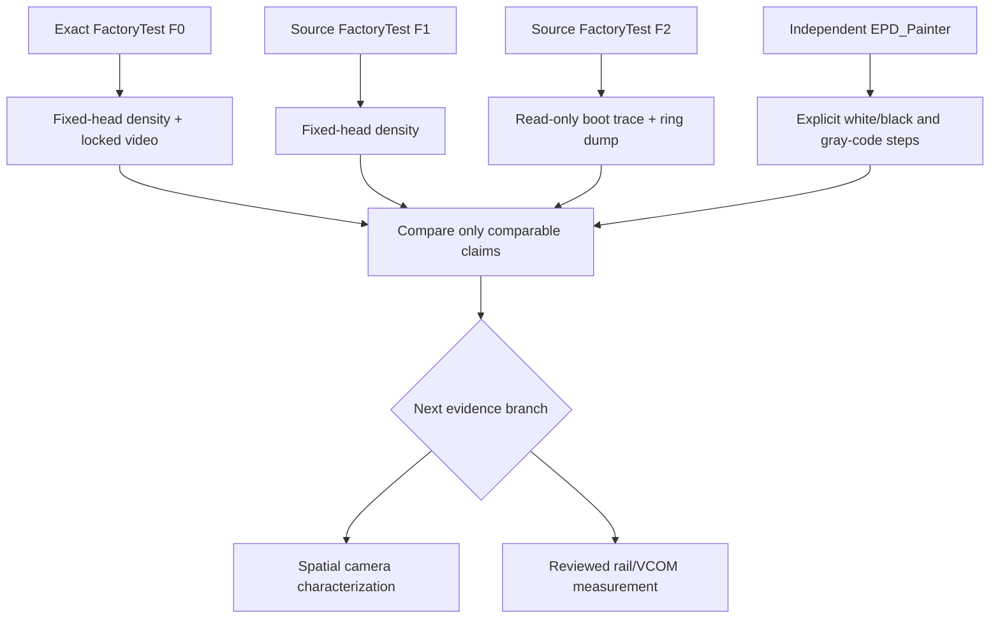

# PaperS3 EPD Qualification: What Software Success Did Not Prove

The PaperS3 e-paper investigation began as preparation for a native e-reader and a later MicroQuickJS layer. It became a hardware qualification effort because the display did not produce a trustworthy white or black endpoint. Firmware could boot, allocate memory, schedule updates, report idle, and preserve its own invariants while the panel remained pale, ghosted, or visually unchanged.

This report records the investigation as a reusable engineering lesson: display software completion, fixed-point optical measurement, spatial appearance, and electrical correctness are separate claims. They need separate evidence. The project is now paused rather than pushed through more waveform variants. The evidence is sufficient to show that the problem survives both the vendor path and a minimal independent direct driver. It is not sufficient to identify an analog cause safely.

> [!summary]
> - FactoryTest, a source-derived M5GFX control, and a pinned independent EPD_Painter driver all completed software transactions without producing the expected fixed-aperture darkening.
> - A Printalyzer provided stable temporal measurements at one fixed aperture, but manual repositioning changed the mean by `0.078067 D`; it cannot certify whole-panel behavior or cross-run absolute density.
> - The correct next branches are spatial camera characterization or reviewed rail/VCOM measurement. More unreviewed waveform cycling would add panel stress without resolving the main uncertainty.

## Why this report exists

An e-reader needs a display contract before it needs pagination, storage, widgets, or a scripting runtime. The contract is not merely an API such as `fillScreen(TFT_BLACK)` or a successful return from `waitDisplay()`. It includes the relationship between requested image data, scheduled waveform work, panel power behavior, optical endpoint, retained-image behavior, and recovery after a failed update.

The initial project plan deliberately put native display primitives ahead of MicroQuickJS. That ordering proved necessary. If an application runtime had been introduced before the display behavior was qualified, later failures could have been attributed incorrectly to JavaScript, memory pressure, layout work, M5GFX, or the panel. The investigation instead isolated those layers in stages.

The central result is concise: **the tested PaperS3 panel did not show expected darkening under several independently successful software paths.** The rest of the report explains how that statement was established, what it does and does not mean, and how to resume without discarding the evidence.

## The claims that must not be merged

A display experiment can be successful in one sense and unsuccessful in another. The table below was the working rule for the investigation.

| Claim | Evidence that supports it | Evidence that does not support it |
| --- | --- | --- |
| Firmware transaction completed | Flash hash, app logs, heap checks, driver return value, `waitIdle()` | A photo alone |
| Fixed-aperture optical response changed over time | Printalyzer samples from an unmoved head | A log, a single screenshot, or a measurement after moving the head |
| Panel looks correct across its surface | Controlled camera/video with stable framing and lighting | One Printalyzer location |
| Driver scheduled a known sequence | Driver ring or explicit semantic markers | A density spike without firmware markers |
| Rails and VCOM are correct | Reviewed electrical measurement | A successful display API call |
| A waveform is safe for continued use | Validated optical endpoints, ghosting behavior, and electrical review | “It did not crash” |

The distinction between the first and last rows is the most important. A driver can preserve heap integrity, finish a task, and shut down panel power while the electrophoretic endpoint is unacceptable. The software reports its own state. It does not measure reflectance or panel chemistry.

## The hardware and software baseline

The work took place in `/home/manuel/workspaces/2025-12-21/echo-base-documentation/esp32-s3-m5` under ticket `ESP-50-PAPERS3-EREADER-PRIMITIVES`.

Three firmware lineages were kept distinct:

| Label | Artifact | Purpose |
| --- | --- | --- |
| F0 | Exact merged vendor FactoryTest V0.5 artifact | Preserve vendor-visible behavior and a video/density baseline |
| F1 | Source-derived FactoryTest with trace disabled | Check whether rebuilding and host observation materially changed the fixed-point response |
| F2 | Source-derived FactoryTest with fixed-ring trace enabled | Prove boot provenance and inspect partial scheduler activity |

F0 was built and run under exact ESP-IDF `v5.3.3`. The independent direct-driver work used the separately pinned EPD_Painter control under ESP-IDF `v5.4.2`, EPD_Painter commit `753c521da8aef59756df07c1a4eb88f1c64c8227`, the M5PaperS3 preset, octal PSRAM, and unmodified HIGH waveform tables. These are not interchangeable environments. The report preserves the distinction because a toolchain or driver change can alter visible timing without proving an analog repair.



## Measurement infrastructure: how the host observed the board safely

The instrument chain had two different serial safety properties. The Printalyzer densitometer required normal host serial control because its raw-sensor stream is a guarded remote-mode diagnostic. The PaperS3 USB Serial/JTAG interface could not be treated the same way.

A prior PaperS3 pyserial attachment produced this exact boot evidence:

```text
ESP-ROM:esp32s3-20210327
rst:0x15 (USB_UART_CHIP_RESET),boot:0x0 (DOWNLOAD(USB/UART0))
waiting for download
```

The likely trigger was serial-library initialization of DTR/RTS modem-control state. The result established a strict operating rule: no pyserial, `idf.py monitor`, or other controlling serial library is used to observe PaperS3 output. The safe observer opens the device with `O_RDONLY | O_NOCTTY | O_NONBLOCK`, reads bytes, and issues no writes or modem-control ioctls. A reconnecting version survives USB disconnect/reopen across a physical reset.

This did not prevent flashing. Flashing and resetting remain esptool-owned operations with exclusive ownership of the port. Capture begins only after the port is released, or it begins before a human Reset when boot-time output is required. This ordering prevented a large class of misleading “firmware crash” reports that were actually two tools competing for the same serial endpoint.

## What the Printalyzer could and could not tell us

The Printalyzer was validated before it became evidence. Passive calibration checks produced repeated CAL-LO and CAL-HI values. A static PaperS3 white-region test then produced:

```text
mean:  0.678142 D
stddev: 0.000625 D
range: 0.002243 D
invalid samples: 0
saturated samples: 0
```

That is good within-run stability. It means that, when the aperture, board, table, cables, and head remain fixed, the instrument can resolve small temporal changes at that exact location.

A manual repositioning test shifted the mean by `0.078067 D`. This is much larger than the static range. The result changes the interpretation of every later chart: a point density is useful for a time series at one position, but it is not an absolute blackness score after the head is reseated. It also cannot detect edges, local gradients, screen-wide nonuniformity, or retained-image geometry outside the aperture.

The raw stream uses a source-derived reproduction of the installed Printalyzer v1.1.0 calculation. Samples with saturation or light-duty mismatch are rejected. The instrument’s reflection LED is an intentional probe during these runs, not ambient light.

## The FactoryTest controls: F0, F1, and F2

The vendor FactoryTest sequence visibly presents a title, black, white, grayscale, and a dashboard. That visual sequence is useful for a baseline, but it is not a precise semantic clock. It includes initialization and scheduling that are not under experimental control.

F0 was recorded with locked video and fixed-head density. F1 then repeated a source-derived trace-off control. Their baseline-subtracted 0–25 second density shapes had Pearson correlation `0.943874` after a `0.5 s` alignment and normalized RMS difference `0.019832 D`. This did not prove that either optical endpoint was acceptable. It did show that rebuilding the source and using the host observer did not create a completely different fixed-point temporal trace.

F2 answered a narrower question: did the trace-enabled source build actually boot, and could safe observation capture its internal record? A physical-reset capture produced normal ESP32-S3 boot output and:

```text
FACTORY_TRACE_DUMP_BEGIN schema=esp50.factory-v05-runtime-trace.v1 begin=0 end=287 overwritten=0
FACTORY_TRACE_DUMP_END total=287
```

The dump contained 287 contiguous, monotonic records. It included display enqueue/dequeue/prepared activity, one power-on interval, and 131 frame begins with 130 frame ends. It did not contain `POWER_OFF_BEGIN`, `POWER_OFF_END`, or `DISPLAY_IDLE`. The missing events are an instrumentation coverage limitation. They do not prove that the panel remained powered, and they do not justify a complete host/device scheduler alignment claim.

The important F2 result is therefore modest but useful: the source-derived trace artifact booted and emitted a real post-display trace. It did not solve the optical problem, and it did not expose enough of the power-off path to diagnose it.

## Independent direct-driver experiments

The most important later decision was to stop treating FactoryTest as the only treatment engine. Project `0107-papers3-epd-painter-control` had already isolated a pinned direct driver from M5GFX, Arduino, network, storage, touch, and application UI. It was initially safety-gated: the board booted without panel work, and a HARD white cleanup was the first permitted action.

That earlier HARD white transaction passed its automatic invariants but failed the visual gate. The operator reported substantial retained FactoryTest ghosting. No immediate sequence of black targets or repeated cleanup was allowed. This prevented a poor endpoint from being hidden by more panel cycling.

The next artifact, `0110-papers3-epd-density-step-response`, made the treatment explicit and boot-driven:

```text
wait 10 seconds for capture
HARD white cleanup
settle 4 seconds
full black
settle 4 seconds
full white
settle 8 seconds
```

Each boundary printed an `EPD_DENSITY_STEP` marker only before work or after `waitIdle()` returned. The marker records semantic phase, target hash, device monotonic time, result, pending stages, panel rail state, and heap values. The display worker does not format or send serial output while it owns the direct-driver operation.

The resulting trace was unambiguous:

```text
cleanup-white: result=ok, pending=0, rails=idle, elapsed=397 ms
full-black:   result=ok, pending=0, rails=idle, elapsed=382 ms
full-white:   result=ok, pending=0, rails=idle, elapsed=382 ms
```

The direct driver therefore accepted the requests and reported a quiescent software state after each one. The fixed-aperture density did not follow the expected blackness direction:

| settled phase | samples | mean density |
| --- | ---: | ---: |
| cleanup white | 43 | `0.621181 D` |
| full black | 43 | `0.617748 D` |
| final white | 78 | `0.614748 D` |

The full-black target was `-0.003433 D` relative to the preceding white-settled measurement. At this aperture, the black command did not produce a sustained density increase.

### The gray-code ladder

A second direct-driver firmware, `0111-papers3-epd-density-gray-ladder`, tested every full-screen packed 2-bit code in one bounded sequence:

```text
00 HARD white → 55 gray-1 → AA gray-2 → FF black → 00 white
```

The code values were real framebuffer values, not labels. `00` fills every two-bit pixel with zero; `55`, `AA`, and `FF` fill the packed framebuffer with successively higher two-bit codes. Each operation returned `result=ok`, `pending=0`, and `rails=idle`. The operator reported no visible screen change during the sequence.

The fixed-aperture measurements were monotonic, but in the opposite direction from expected optical density:

| packed code | nominal target | mean density |
| --- | --- | ---: |
| `00` | white after cleanup | `0.622572 D` |
| `55` | gray level 1 | `0.618283 D` |
| `AA` | gray level 2 | `0.617342 D` |
| `FF` | black | `0.614557 D` |
| `00` | final white | `0.612200 D` |

This is stronger than a single failed black transition. The independent driver accepted four code values, completed its bounded transactions, and produced a small ordered fixed-point response that became *lower* as the commanded code increased. It is not valid to call that ordering a calibrated panel grayscale curve. It is valid to say that the tested aperture did not exhibit the expected darkening response under this direct-driver waveform family.

## The causal sequence now available

The native experiments established the kind of correlation that FactoryTest could not provide. The host receives both a firmware marker and a density sample stream on monotonic clocks. The interpretation is still bounded, but the causal sequence is explicit.

```mermaid
sequenceDiagram
    participant O as Operator
    participant C as Read-only capture
    participant P as Printalyzer
    participant F as Native firmware
    O->>C: Reset after capture armed
    C->>F: Observe boot only; no input or modem control
    P->>P: Begin guarded raw reflection stream
    F->>F: Wait 10 s capture grace
    F-->>C: semantic marker: phase begin
    F->>F: Direct-driver paint and waitIdle
    F-->>C: semantic marker: phase idle
    P-->>C: Timestamped density samples
    F-->>C: semantic marker: phase settled
    C->>C: Join markers and density by host monotonic time
```

The rule is simple: density changes can be discussed relative to a named firmware action only when the marker sequence, capture health, and head placement are intact. A density spike alone is activity evidence, not a semantic phase label.

## What failed, and why the failures matter

Several failures were productive because they invalidated tempting shortcuts.

### A software pass was not an optical pass

The direct-driver app could report successful operations, zero pending stages, idle rails, stable heap, and no timeout while the panel did not visibly darken. This eliminates the claim that the problem was merely FactoryTest UI behavior or a failed command parser. It does not locate the fault below the driver API.

### A serial monitor was not a passive observer

Opening PaperS3 through pyserial was sufficient to reset the device into ROM download mode. A normal development workflow therefore changed the experiment. Replacing it with a read-only file descriptor and explicit reset coordination was necessary before boot traces could be trusted.

### A point density was not a panel score

The repositioning result means that absolute density cannot be compared across manually reseated runs. A fixed head supports within-run temporal analysis. It does not replace camera evidence for spatial structure.

### More waveform cycles were not a better experiment

Once the independent direct driver and all packed gray codes completed without the expected point response, further unreviewed pulse variations would have had low diagnostic value. They could increase retained-image artifacts or DC-balance risk while still failing to distinguish a panel issue, rail issue, VCOM assignment issue, or aperture-placement issue.

## Recommended state of the project

The EPD qualification branch should remain paused. The reader primitives, storage, layout, and MicroQuickJS work should not treat this panel as optically qualified. The native experiments are useful infrastructure and should be retained, not discarded.

The next technical choice should be made deliberately:

1. **Spatial optical characterization.** Use a locked camera, fixed illumination, and a small number of controlled fixtures to determine whether the aperture result reflects a uniform panel failure, a gradient, retained-image geometry, or a localized condition. This branch can characterize appearance; it cannot prove rails.
2. **Reviewed electrical characterization.** Identify safe probe points and measure the relevant rails, VCOM, timing, grounding, voltage range, and loading. This branch can test analog hypotheses; it must not start from speculative resistor or pulse changes.

Neither branch should be started by changing arbitrary waveform tables. A safe experimental plan needs a defined question, a bounded treatment, a predeclared stop condition, and evidence that can distinguish at least two hypotheses.

## Working rules for a future resumption

- Keep firmware artifact identity, ESP-IDF version, component commit, panel setup, and capture scripts in each run record.
- Maintain one owner per serial device. Flash/reset and observation must not own PaperS3 USB Serial/JTAG concurrently.
- Treat `waitIdle()`, heap health, and power-down flags as software state only.
- Treat a fixed Printalyzer head as a temporal point sensor. Do not compare manually repositioned runs as absolute density.
- Do not infer screen-wide behavior from one aperture or semantic update phases from an unmarked density trace.
- Stop rather than repeat a cycle when optical behavior is unexpected and the next treatment would not discriminate a new hypothesis.
- Keep direct-driver source and evidence even while the project is paused. It is the shortest path back to controlled experiments.

## Key evidence and code paths

- Ticket workspace: `/home/manuel/workspaces/2025-12-21/echo-base-documentation/esp32-s3-m5/ttmp/2026/07/14/ESP-50-PAPERS3-EREADER-PRIMITIVES--papers3-e-reader-native-primitives-and-future-javascript-api`
- Native white/black/white firmware: `/home/manuel/workspaces/2025-12-21/echo-base-documentation/esp32-s3-m5/0110-papers3-epd-density-step-response`
- Native gray ladder firmware: `/home/manuel/workspaces/2025-12-21/echo-base-documentation/esp32-s3-m5/0111-papers3-epd-density-gray-ladder`
- Native step evidence: `scripts/experiments/EXP-20260715-016-native-epd-density-step-response/`
- Gray ladder evidence: `scripts/experiments/EXP-20260715-017-native-epd-density-gray-ladder/`
- Main experiment design: `design-doc/03-native-epd-density-step-response-experiment.md`
- Factory F0/F1/F2 ledger: `analysis/04-m5gfx-runtime-waveform-instrumentation-and-scientific-experiment-ledger.md`

The paused state is not an absence of progress. It is the correct result of narrowing the unresolved question to evidence that the current software stack cannot safely provide by itself.
