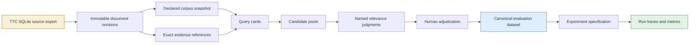
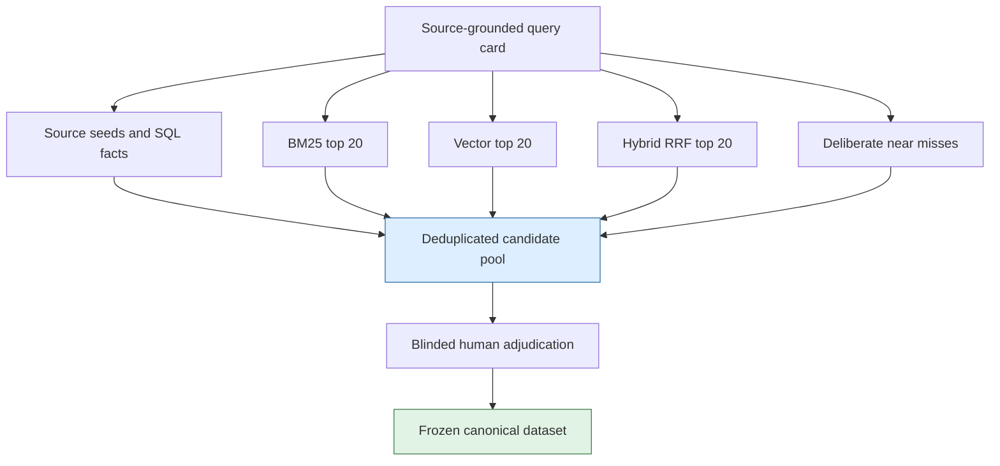

# RAG Evaluation: Building and Validating an Initial Fixed-Truth Dataset

This is the fixed-truth evaluation branch of the [[rag-evaluation-system]] project map.

Retrieval experiments become meaningful only after the expected result is represented as data with the same care given to the corpus, chunking plan, embedding model, and retrieval algorithm. A system can return plausible documents for a plausible query while still being impossible to compare across runs. If the query set is informal, if relevance labels change in place, if a document identifier can refer to different text over time, or if the currently favored retriever supplied every judged candidate, reported metrics do not describe a stable experiment.

This report describes the first fixed-truth evaluation setup for the TTC RAG laboratory in `/home/manuel/workspaces/2026-07-13/rag-eval-ttc/rag-evaluation-system`. The work rebuilt the TTC source corpus, designed an immutable evaluation-data model, created twenty source-grounded candidate query cards through independent corpus reviews, and added a validator that checks the factual footing of the draft. The result is deliberately not yet a benchmark. It is a validated authoring draft that will become `ttc-baseline-eval-v1` only after document revisions, exact evidence ranges, pooled retrieval candidates, and human adjudication exist.

This article was written by GPT-5.6 - sol from the committed ticket design, candidate-card draft, implementation diary, validator, and source-validation output. It is an original technical analysis of the initial evaluation setup.

> [!summary]
> - The baseline starts with a rebuilt, fingerprinted TTC SQLite export rather than an implicit live database state.
> - Relevance is stored as named levels—`0_NOT_RELEVANT`, `1_PARTIAL`, `2_SUBSTANTIAL`, and `3_AUTHORITATIVE`—with `2_SUBSTANTIAL` as the declared binary threshold.
> - Twenty query cards are source-first and evidence-bearing. They are drafts, not frozen truth; a conflicting cancellation policy is intentionally withheld from metrics.
> - A ticket-local read-only validator caught a document-kind mismatch and five overly literal evidence checks before the draft was accepted.

## Why a retrieval benchmark needs immutable truth

An information-retrieval metric has two inputs: an ordered result list and a relevance dataset. The result list is normally visible because the retrieval system produces it. The relevance dataset is often much less visible. A spreadsheet, remembered examples, or a prompt that asks a model whether a result looks good can help during exploration, but it cannot establish a comparison contract.

The TTC laboratory needs to compare chunking strategies, full-text search, complete-scan vector search, and document-collapsed reciprocal-rank fusion. Later it will compare raw text, summaries, and synthetic questions. Each comparison needs a fixed answer to a precise question: for this query, against this corpus snapshot, which document revisions are relevant, at what level, and why?



Every edge represents a dependency that must be preserved. A query card refers to source evidence. A frozen judgment refers to a document revision. An experiment run refers to the frozen dataset ID rather than to mutable labels. If one content byte changes in a source document, the future imported revision changes; the historical judgment remains interpretable because it names its original revision.

An experiment run and an evaluation dataset therefore have distinct identities. A dataset is content-addressed scientific input. A run is one execution attempt. Repeating the same specification creates another run ID for latency and operational variance, without changing the dataset or overwriting an earlier result.

## Rebuild the source artifact before writing questions

The first operational step was not question generation. It was rebuilding `data/ttc-wordpress-rag.sqlite` from the local TTC MySQL source. This establishes a reproducible source artifact that can be inspected without treating a live WordPress or MySQL instance as the experimental corpus.

The existing semantic exporter and validator were run as follows:

```bash
python3 \
  ttmp/2026/06/02/RAGEVAL-TTC-SQLITE-EXPORT--export-ttc-wordpress-data-to-sqlite-for-rag-querying/scripts/07-export-ttc-wordpress-to-sqlite.py \
  --sqlite data/ttc-wordpress-rag.sqlite

ttmp/2026/06/02/RAGEVAL-TTC-SQLITE-EXPORT--export-ttc-wordpress-data-to-sqlite-for-rag-querying/scripts/08-validate-ttc-sqlite.sh \
  data/ttc-wordpress-rag.sqlite
```

The database passed the repository validator and SQLite integrity check. Its relevant facts are:

| Artifact or relation | Value |
|---|---:|
| SQLite export size | 264,314,880 bytes |
| SQLite export SHA-256 | `c55953ee0d9289577062ac11001c25f63c0286ace45dbc6b4b056c11b0ea6db4` |
| Documents | 3,258 |
| Products | 2,600 |
| Posts | 483 |
| Pages | 121 |
| FAQs | 35 |
| TTC guides | 19 |
| `cypress` FTS matches | 198 |

The source dump was also fingerprinted. The export is not the eventual RAG operational database. It is input to a later importer that will create an explicit 200-document snapshot and content-addressed document revisions in `data/rag-eval.db`. That distinction prevents the source export's FTS index from being mistaken for an experiment index.

## Named relevance levels make the data auditable

The first design had an integer `grade` between zero and three. Integers are convenient for nDCG but poor as the primary authoring language. A reviewer reading `grade: 2` must remember an external rubric. A UI that shows `2` cannot explain whether a document is partially useful, materially relevant, or the preferred source. The revised contract stores both a named level and its ordinal rank.

| Relevance level | Rank | Meaning | Binary relevant? |
|---|---:|---|---|
| `0_NOT_RELEVANT` | 0 | The document does not satisfy this information need. It may be unrelated, contradictory, or unsupported. | no |
| `1_PARTIAL` | 1 | The document is related but misses a material required condition or is too indirect. | no |
| `2_SUBSTANTIAL` | 2 | The document materially answers the primary need, although a more direct source may exist. | yes |
| `3_AUTHORITATIVE` | 3 | The document directly and completely answers the need using ideal corpus evidence. | yes |

`0_NOT_RELEVANT` was chosen instead of `0_FAIL`. The label describes the relationship between a document and a query; it does not imply that the document, retrieval engine, or experiment execution failed.

The dataset manifest makes thresholding explicit:

```yaml
relevanceLevels:
  0_NOT_RELEVANT: 0
  1_PARTIAL: 1
  2_SUBSTANTIAL: 2
  3_AUTHORITATIVE: 3
binaryRelevantAtOrAbove: 2_SUBSTANTIAL
gradedGain: "2^rank - 1"
```

Precision@K, Recall@K, HitRate@K, and MRR count only `2_SUBSTANTIAL` and `3_AUTHORITATIVE`. nDCG retains all ranks and uses gain `2^rank - 1`. A `1_PARTIAL` document remains visible in error analysis and contributes a small graded gain, but cannot convert weak topical similarity into a binary success.

The proposed schema keeps the relationship mechanically valid:

```sql
CREATE TABLE relevance_judgments (
    dataset_id TEXT NOT NULL,
    query_id TEXT NOT NULL,
    document_revision_id TEXT NOT NULL,
    relevance_level TEXT NOT NULL CHECK (relevance_level IN (
        '0_NOT_RELEVANT', '1_PARTIAL',
        '2_SUBSTANTIAL', '3_AUTHORITATIVE'
    )),
    relevance_rank INTEGER NOT NULL CHECK (relevance_rank BETWEEN 0 AND 3),
    rationale TEXT NOT NULL,
    evidence_json TEXT NOT NULL,
    adjudication_json TEXT NOT NULL,
    PRIMARY KEY (dataset_id, query_id, document_revision_id)
);
```

The production migration must add the mapping check too: `2_SUBSTANTIAL` is valid only with rank 2, and so on. The schema is a design correction before implementation, not a compatibility layer.

## Query cards define information needs before retrieval

The first twenty records are candidate query cards. A card states the information need and its evidence basis before the laboratory uses retrieval output to measure anything. It has five parts:

1. Natural-language query wording and intent class.
2. Required facets that make the information need testable.
3. Source-seed documents expected to be relevant.
4. Plausible near misses that should remain partial or not relevant.
5. Review requirements: source-revision resolution, exact evidence ranges, and human adjudication.

For example, the constrained product-discovery card does not merely request a cypress. It requires category, sunlight, drought tolerance, hardiness zone, height, and width together:

```yaml
id: ttc-eval-002
query: "Find the privacy-tree cypress that is full sun, very drought resistant,
hardy in zones 6–9, and matures 15–25 feet tall by 6–8 feet wide."
intent: constrained-product-discovery
required_facets:
  - privacy-tree
  - cypress
  - full-sun
  - very-drought-resistant
  - zone-6-9
  - height-15-25
  - width-6-8
provisional_judgments:
  - document_id: wp:549614
    level: 3_AUTHORITATIVE
  - document_id: wp:3709
    level: 1_PARTIAL
    rationale: "It overlaps zone, sun, and drought properties but has different dimensions."
```

The source database confirms that the exact predicate identifies one product:

```sql
SELECT COUNT(*)
FROM view_products
WHERE categories LIKE '%Privacy Trees%'
  AND drought_tolerance = 'Very Drought Resistant'
  AND sunlight = 'Full Sun'
  AND mature_height = '15-25'
  AND mature_width = '6-8';
```

This tests conjunction rather than generic lexical overlap. A retriever that returns a broadly similar privacy tree has not answered the card. The partial candidate makes the intended distinction visible.

## Model assistance must leave an audit trail

A capable language model can inspect structured product details, taxonomy terms, FAQ pages, guides, and editorial posts quickly. It can draft natural query wording, identify varied intent classes, enumerate near misses, and suggest source evidence for review. Those capabilities made it practical to assemble the candidate set through three independent corpus-review passes: product/fact review, care/policy review, and editorial/taxonomy review.

That does not make the model the final authority. It can select a plausible source from conflicting policies, infer a condition from general knowledge, or miss a source outside its immediate context. The protocol treats model output as a draft with provenance, not as a benchmark label.

```text
for each intent stratum:
    sources = inspectStructuredFactsAndDirectSourceText(stratum)
    card = proposeQueryFromExplicitSourceFacts(sources)
    card.requiredFacets = stateWhatTheQueryActuallyRequires(card.query)
    card.sourceSeeds = citeSupportingDocuments(card)
    card.nearMisses = findDocumentsMatchingOnlySomeFacets(card)
    reject card unless each required facet has direct source evidence
```

The authoring prompt forbids completing missing source facts from general knowledge. It also requires a counterfactual: a result that appears related but should not receive a binary-relevant label. This produces the partial and negative cases needed to measure precision. The eventual reviewer sees source text, required facets, and evidence references, but should not see which retriever surfaced a candidate or its rank.

## The initial set exercises different retrieval failures

Twenty cards are practical to review completely and sufficient to exercise the main retrieval modes before a larger holdout exists. The set is not twenty alternate phrasings of product lookup.

| Area | Examples | What it tests |
|---|---|---|
| Exact product facts | Thuja Green Giant dimensions, zone, and sunlight | Field extraction and direct product lookup |
| Constrained discovery | Blue Ice Arizona Cypress with seven facets | Attribute conjunction and precision |
| Comparison | Blue Italian Cypress versus Italian Cypress | Retrieval of multiple individually useful documents |
| Taxonomy | Compact Thuja with 1–2 foot dimensions | Product categories plus dimensions |
| Planting and care | Hole geometry, first-month watering, pruning | Guide retrieval and qualified procedural answers |
| Diagnostic care | Yellow leaves after planting | Distinguishing excess-water content from opposing symptoms |
| Editorial explanation | Privacy screens, acidic soil, shade, drainage, hardiness | Semantic guide retrieval beyond product pages |
| Policy and support | Shipping restrictions, returns, arrival guarantee | Exact FAQ/page conditions |
| Calibrated abstention | Bitcoin payment support | Absence handling without invented facts |

The product comparison card exposes an important document-level distinction. Blue Italian Cypress and Italian Cypress each receive `2_SUBSTANTIAL`, because each page provides one required half of the comparison. No single document is expected to be `3_AUTHORITATIVE`. Retrieval should find both sources; answer synthesis, if added later, is a separate operation. This prevents the benchmark from penalizing retrieval because the corpus distributes facts across documents.

The Bitcoin question is an explicit unanswerable control. The exported FTS index has zero `bitcoin` matches. The correct behavior is not a confident claim that TTC refuses Bitcoin. It is calibrated abstention: TTC documentation does not confirm Bitcoin payment. A payment-method page can be `1_PARTIAL` because it lists several methods, but it is not evidence of a negative claim it never states.

## Pool candidates without allowing one retriever to author the benchmark

Source seeds are necessary but insufficient. A benchmark limited to source-seed documents can miss other relevant sources. A benchmark labeled only from current BM25 results can favor lexical retrieval. A benchmark labeled only from vector results can favor semantic retrieval. The protocol constructs a pool rather than accepting one system’s output as the universe of candidates.

For each query, the future pool is the deduplicated union of source documents, structured SQL/fact-table matches, deterministic source-FTS checks, top twenty BM25 results, top twenty complete-scan vector results, top twenty document-collapsed hybrid RRF results, and deliberately selected near misses.



Pooling is an authoring action, not a mutable side effect of every benchmark run. If a later retrieval plan finds an important unjudged document, the team creates a new dataset version after review. It does not silently alter `ttc-baseline-eval-v1`.

## Validation caught two real mistakes before freeze

The source-validation script lives with the ticket rather than inside the application because it validates a pre-implementation authoring artifact:

```text
ttmp/2026/07/13/RAGEVAL-TTC-LAB-001--ttc-rag-laboratory-baseline-and-immutable-experiment-runs/
  scripts/01-validate-ttc-baseline-evaluation-cards.sh
```

It is read-only. Given `data/ttc-wordpress-rag.sqlite`, it checks that card documents resolve to expected kinds, selected evidence anchors occur in source text, selected product predicates have a single result, and the Bitcoin control has no FTS hit.

The first run failed:

```text
FAIL: all draft-card document IDs resolve to expected kinds (unexpected count: 1)
```

The diagnostic query found that `wp:418694`, *How To Plant Rhododendrons, Azaleas and Camellias*, was a `ttc_guide`, not a `post` as initially recorded. The card idea remained valid, but its metadata assumption was wrong. The expected kind was corrected.

The second run failed:

```text
FAIL: all required source evidence phrases are present (unexpected count: 5)
```

The documents existed. The original checks were overly literal relative to source punctuation and wording. The shipping-date page says “not the date it will arrive,” while the first check expected “not the arrival date.” The guarantee page says “picture and description,” not “photo and description.” The anchors were changed to exact source phrases or durable key terms. The final run passed:

```text
PASS: all draft-card document IDs resolve to expected kinds
PASS: all required source evidence phrases are present
PASS: Blue Ice Arizona Cypress constrained discovery is unique
PASS: Danica Globe Thuja dimensions and taxonomy identify one product
PASS: Bald Cypress wet-soil height constraint identifies one product
PASS: Bitcoin has no corpus FTS hit for the explicitly unanswerable card
PASS: TTC baseline evaluation-card source validation completed
```

This validation does not establish semantic truth. It establishes that the draft remains attached to the source corpus it claims to describe. Exact rune-range validation against immutable document revisions is a later invariant.

## Conflicting policies are withheld, not resolved by convenience

The cancellation-fee query revealed a TTC policy conflict. A newer `Cancellation policy` page (`wp:398597`, modified 2023) says a 20% fee and permits cancellation only before fulfillment begins. An older FAQ, *What if I need to cancel my order?* (`wp:4128`, modified 2019), describes a 10% fee after one hour.

This is not a suitable v1 truth label until a TTC policy owner establishes source precedence. Modification time is evidence about recency, not a complete authority rule. The card is stored as `WITHHELD_PENDING_POLICY_ADJUDICATION`, preserves both sources, and contributes nothing to headline metrics.

This separates three conditions that are often conflated:

- A document is not relevant to the query.
- Relevant sources conflict and no authority rule has been declared.
- The corpus cannot answer the query.

Only the first condition receives `0_NOT_RELEVANT`. The second requires adjudication. The third is a controlled unanswerable case. Treating all three as zero creates misleading metrics and hides source-governance problems.

## The implementation boundary between draft and frozen truth

The current output is source-validated draft data. The remaining implementation sequence is explicit:

```text
draft cards + declared TTC corpus snapshot
    -> resolve stable wp:* IDs to immutable document revision IDs
    -> validate exact evidence rune slices against chosen content variants
    -> pool source, SQL, BM25, vector, hybrid, and near-miss candidates
    -> blind human adjudication
    -> canonical JSON normalization and SHA-256 dataset ID
    -> immutable ttc-baseline-eval-v1
```

The future compiler rejects a dataset if it has fewer than twenty cards, misses a required intent stratum, has duplicate normalized queries, references a document outside the snapshot, contains an invalid level/rank pair, lacks evidence for a `2_SUBSTANTIAL` or `3_AUTHORITATIVE` label, or gives an unanswerable query a positive label.

Once frozen, a correction creates `ttc-baseline-eval-v2`. It does not update v1. Experiments retain a direct, inspectable reference from each run to its corpus snapshot, chunk plan, embedding/index/retrieval plan, evaluation dataset, per-query trace, and terminal metrics.

## Working rules

- Keep query-card authoring source-first. A query is accepted because source evidence supports it, not because a current search system ranks a document highly.
- Store named relevance levels and numeric ranks together. Display names to people; use ranks only for metric arithmetic.
- Use `2_SUBSTANTIAL` as the declared binary threshold and retain `1_PARTIAL` for graded analysis.
- Bind judgments to document revisions, not mutable WordPress IDs.
- Preserve every evidence range, rationale, authoring method, and human adjudication decision in the frozen artifact.
- Keep contradictory-source cards outside metric summaries until a documented authority rule resolves them.
- Do not tune retrieval indefinitely against the only fixed dataset. After v1 stabilizes, create a separate held-out dataset for broader claims.

## Related notes and source material

- [[PROJECT REPORT - Transcript RAG - Self-Contained Pi Corpus and Representation Retrieval]] documents a related corpus-fingerprinting and representation-retrieval workflow.
- [[ARTICLE - Exporting WordPress WooCommerce Data into a RAG SQLite Corpus]] documents the TTC source-export lineage.
- [[ARTICLE - RAG Evaluation System - Workflow-Driven Retrieval Evaluation]] documents the application’s earlier service and workflow foundation.
- The ticket is `RAGEVAL-TTC-LAB-001` under `/home/manuel/workspaces/2026-07-13/rag-eval-ttc/rag-evaluation-system/ttmp/2026/07/13/RAGEVAL-TTC-LAB-001--ttc-rag-laboratory-baseline-and-immutable-experiment-runs/`.
- The detailed protocol is `design-doc/02-evaluation-dataset-authoring-and-adjudication-protocol.md`; the card draft is `reference/02-ttc-baseline-evaluation-dataset-v1-candidate-cards.md`; the validator is `scripts/01-validate-ttc-baseline-evaluation-cards.sh`.
