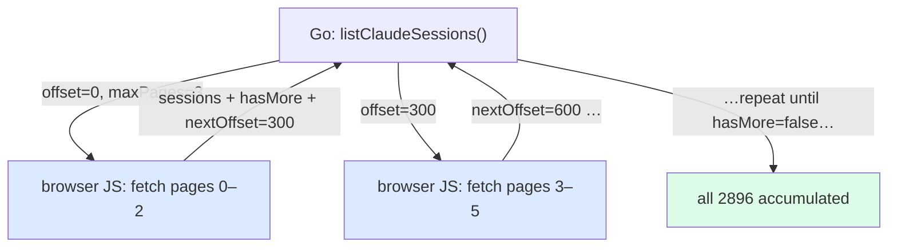
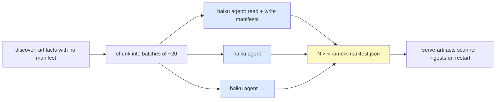
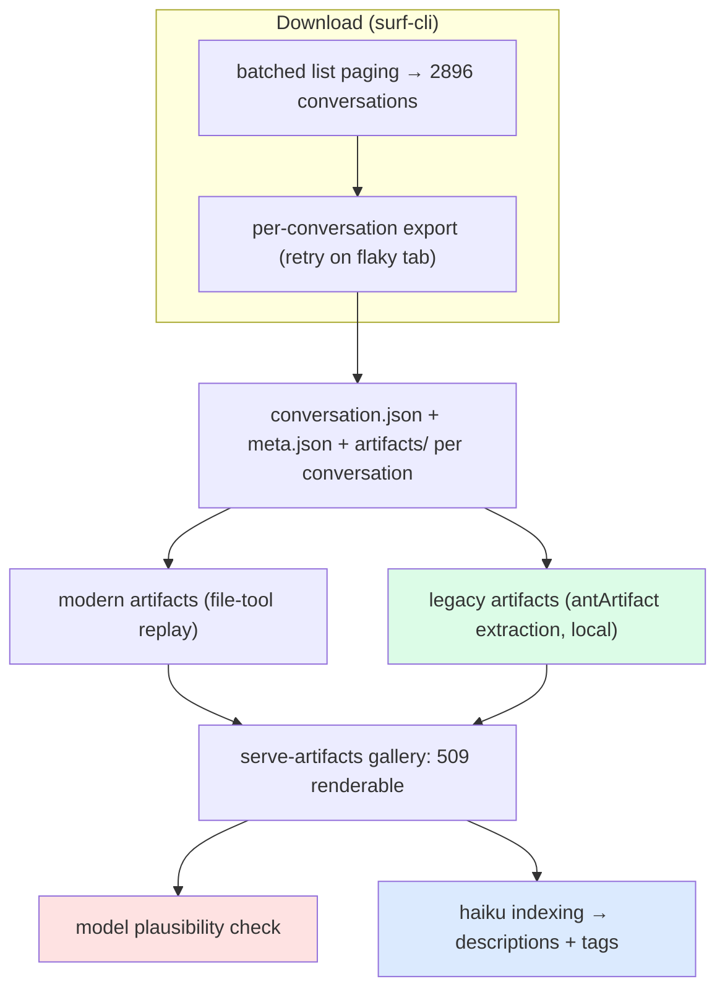

# claude.ai Archive Completion — Deep Paging, Legacy Artifact Recovery, and Model-Quirk Fixes

This note documents the work that turned a partial export of a claude.ai account into a complete one: every conversation the account has ever had, and every code artifact it ever produced, including the artifacts made in a format the exporter did not originally understand. The starting point was a tool that could reliably download the most recent few hundred conversations; the ending point is a local archive of **2,896 conversations spanning 2023-07-18 to 2026-07-14** and a browsable gallery of **509 artifacts reaching back to 2024-06-20**, the day Claude first shipped artifacts.

Three distinct problems stood between those two points, and each is worth writing up because each is a different class of defect. The first is a paging bug: the exporter fetched the entire conversation list in a single browser-side execution that the extension truncated once the list grew past a couple thousand, so the oldest conversations were unreachable. The second is a format-evolution problem: Claude's original artifacts were embedded inline in message text, and the reconstructor only understood the later file-based format, so every pre-2025 artifact was silently skipped. The third is a data-quality problem: claude.ai's API reports the account's *current* default model for old conversations, so a 2024 artifact was labeled with a 2025 model. This note treats each in turn, then covers the indexing pass that gave the whole corpus AI-written descriptions and tags.

This is a continuation of [[claude.ai Artifact Archival]] (the original export-and-reconstruction pipeline) and a companion to [[serve-artifacts]] (the gallery that displays the results). The tooling lives in two repositories: the export verbs in `surf-cli` (`/home/manuel/code/others/llms/pi/nicobailon/surf-cli`, the `surf-go claude ...` commands) and the viewer in `serve-artifacts` (`/home/manuel/code/wesen/2026-03-29--serve-claude-experiments`).

> [!summary]
> - **Deep paging.** `claude export-all` fetched the whole conversation list in one browser-side JS call; past ~2,000 conversations the extension truncated the result and it failed with "unexpected API response shape". The fix fetches one bounded batch of pages per call and loops in Go, so depth is unbounded. This is what made the full 2,896-conversation download possible.
> - **Legacy artifacts.** Claude's original artifacts are `<antArtifact …>…</antArtifact>` blocks inline in assistant message text; the modern format is sandbox files built by `create_file`. The reconstructor only knew the modern format. A local Python pass recovered **864 legacy artifacts** from the already-downloaded transcripts (70 renderable html/jsx grew the gallery 439 → 509).
> - **Model anachronism.** The API returns the account's current default model for old conversations, so 2024 artifacts showed a 2025 model. A plausibility check drops any model whose embedded release date postdates the conversation.
> - **Indexing at scale.** A fleet of cheap (Haiku) agents read each artifact and wrote a description + tags manifest, giving the gallery real summaries and ~650 filterable tag facets.

## Why this work exists

An archive that stops at the most recent few hundred conversations is not an archive; it is a recent-history cache. The account in question has 2,896 conversations going back to mid-2023, and the interesting older material — the first experiments with a new API, the earliest artifacts — is exactly the part a partial export omits. The goal was completeness in two dimensions: every conversation (breadth), and every artifact within them (depth), regardless of which artifact format Claude was using at the time.

Getting there was not a matter of running the existing tool for longer. Each of the three problems below is a hard stop that no amount of retrying fixes on its own.

## Part I — The deep-paging problem

### The symptom and the false leads

`surf-go claude export-all --limit N` downloads the N most-recently-updated conversations. It worked for N up to roughly 1,000–2,000 and then failed with `Error: unexpected claude.ai API response shape`. The failure was easy to misattribute, and several plausible explanations turned out to be wrong:

- `--limit 0` ("all") hits a separate broken path and errors immediately; a large finite limit is required.
- The "unexpected shape" error looked like a server-side cap on how many conversations the API will return, but a run at `--limit 2000` reached offset 2,000 successfully once, which rules out a hard cap.
- A set of export processes that appeared to respawn after every kill turned out to be an artifact of the diagnostic itself: `pgrep -f 'surf-go claude export'` matches its own command line, so the detection was reporting phantom processes. The reliable signal was the on-disk conversation count: if it stops climbing, nothing is running.

The actual cause required reading the socket trace between the CLI and the browser extension.

### The real cause

The conversation list is fetched by injecting JavaScript into a logged-in claude.ai tab. The original script paged the entire list inside a single execution:

```javascript
// original claude_sessions.js (simplified)
let all = [], offset = 0;
while (hasMore && all.length < max) {
  const page = await api(`/api/organizations/${org}/chat_conversations_v2?limit=100&offset=${offset}`);
  all.push(...page.data);
  offset += page.data.length;
  hasMore = page.has_more && page.data.length > 0;
}
return { org, count: all.length, sessions: all.map(...) };
```

For a shallow list this returns quickly and correctly. For a deep one — 2,896 conversations is 29 pages — the single browser-side execution runs long enough that the extension truncates its result, and the Go side receives something that is not the expected object. The error surfaces in `claude_api.go` where the result is asserted to a map:

```go
m, ok := parsed.Data.(map[string]any)
if !ok {
    return nil, fmt.Errorf("unexpected claude.ai API response shape")
}
```

The tab instability made this worse but was not the root cause. The tab does flap — it sits on `/recents` with `readyState=interactive` and only intermittently reaches `complete` — which caused roughly half of the *per-conversation* fetches to error on a first attempt. That is a separate, recoverable problem addressed by fetch-level retries. The list truncation is structural: one execution trying to do too much.

### The fix: batch the paging, loop in Go

The refactor moves the loop out of the browser. The injected script now fetches a small, bounded number of pages for a given offset and returns a cursor; the Go caller loops, advancing the offset and accumulating, so no single execution is long enough to be truncated.

```javascript
// new claude_sessions.js: one bounded batch per call
const maxPages = options.maxPages || 3;         // ≤ 3 pages (300 conversations) per call
let offset = options.offset || 0, raw = [], pages = 0, hasMore = true;
while (hasMore && pages < maxPages) {
  const page = await api(`.../chat_conversations_v2?limit=100&offset=${offset}`);
  raw.push(...(page.data || []));
  offset += page.data.length; pages++;
  hasMore = page.has_more && page.data.length > 0;
}
return { org, sessions: raw.map(...), hasMore, nextOffset: offset };
```

```go
// new listClaudeSessions: loop the batches in Go
func listClaudeSessions(ctx, session, org, limit, project) ([]any, error) {
    var raw []any; offset := 0; resolvedOrg := org
    for {
        data := session.run(`SURF_OPTIONS={org, offset, maxPages:3}` + script)
        resolvedOrg = data.org        // reuse org so later batches skip /api/bootstrap
        raw = append(raw, data.sessions...)
        offset = int(data.nextOffset)
        if limit > 0 && len(raw) >= limit { raw = raw[:limit]; break }
        if !data.hasMore { break }
    }
    return applyProjectFilter(raw, project), nil   // limit-then-filter, matching old semantics
}
```



Two details preserve behaviour. The resolved organization id is threaded back from the first batch so subsequent batches skip the `/api/bootstrap` call. And the global `--limit` and the `--project` filter are applied in Go over the accumulated raw list, reproducing the original "limit the raw list, then filter" semantics rather than filtering per batch.

A point worth stating because it governs the whole deployment: **this is injected JavaScript shipped from the Go binary on every call.** The Chrome extension is generic — it exposes only `tab.new`, `js`, and `tab.close` — and holds no claude-specific logic. Changing the paging behaviour is therefore a `go build` of `surf-go` and nothing else; the extension and native-messaging host are untouched and need no reload. This was confirmed empirically: an edit to the script plus a rebuild took effect on the very next call.

### Result

With the batched paging, one `export-all --limit 3000` pass took the archive from 1,046 to 2,601 conversations (1,555 new, 295 errored on the flaky tab). A second resumable pass retried the 295 and cleared all of them — `295 exported, 2601 skipped, 0 errors`. The account was complete at 2,896.

## Part II — Legacy artifact recovery

### Two artifact formats, one reconstructor

After the full download, the earliest *artifact* in the gallery was dated 2025-10, even though conversations went back to 2023. The reason is that Claude has used two different artifact mechanisms over its lifetime, and the exporter's reconstructor only understood the newer one.

| | Modern artifacts (2025+) | Legacy artifacts (2024–2025) |
|---|---|---|
| Storage | Sandbox files built by tool calls (`create_file`, `str_replace`, `bash_tool` heredocs) under `/mnt/user-data/outputs` | Inline in assistant message text as `<antArtifact …>…</antArtifact>` tags |
| Reconstruction | Replay the file operations (see [[claude.ai Artifact Archival]]) | Parse the tags out of the text |
| Handled originally? | Yes | No — silently skipped |

A legacy artifact looks like this inside the assistant's message text:

```
<antArtifact identifier="excel-structure" type="application/vnd.ant.code"
             language="python" title="Excel Structure for Message Thread">
import openpyxl
...
</antArtifact>
```

Because the reconstructor only replayed file operations, every one of these blocks — 328 conversations' worth — was dropped on the floor. The first legacy artifact appears 2024-06-20, which is the day Claude launched artifacts.

### Recovery without re-downloading

The important realization is that the legacy artifacts were never lost — they were sitting in the `conversation.json` files already on disk, inside the message text. Recovery is therefore a purely local pass, with no browser, no export API, and no re-download. A short Python script walks every `conversation.json`, extracts the blocks, and writes them into each conversation's `artifacts/` directory.

```python
ART_RE  = re.compile(r"<antArtifact\b([^>]*)>(.*?)</antArtifact>", re.DOTALL)
ATTR_RE = re.compile(r'(\w+)\s*=\s*"([^"]*)"')

def extract(conv_json):
    found = {}                                   # identifier -> (type, lang, title, content)
    for text in iter_text_blocks(conv_json):     # every decoded assistant text
        for m in ART_RE.finditer(text):
            attrs = dict(ATTR_RE.findall(m.group(1)))
            ident = attrs.get("identifier") or sha1(m.group(2))[:8]
            found[ident] = (attrs["type"], attrs["language"], attrs["title"],
                            html.unescape(m.group(2)).strip("\n"))   # last block wins
    return found
```

Three details make this robust. First, the regex runs over the **JSON-decoded** text values, not the raw file, so the escaping (`<` for `<`, `\n` for newlines) is handled by the JSON parser rather than by the regex. Second, artifacts are edited in place across a conversation — the same `identifier` recurs — so keeping the last block per identifier reproduces the final version the panel showed. Third, the write is idempotent and never clobbers an existing file, so it is safe to re-run and it will not overwrite a modern artifact.

The `type` and `language` attributes map to a file extension: `application/vnd.ant.code` with `language: html`/`react` becomes `.html`/`.jsx`; `python` becomes `.py`; and so on for the dozen-odd languages present. Only `.html` and `.jsx` are renderable web applications that the gallery displays; the rest are code and documents that are archived but not shown.

### Result

The pass recovered **864 legacy artifacts across 351 conversations**. Of these, **70 are html/jsx**, which grew the gallery from 439 to 509 and pushed the oldest displayed artifact back to 2024-06-20 ("Web Page for Coaching AI Assistant"). The other 794 — 242 markdown documents, 204 YAML files, 73 Ruby scripts, and so on — are legitimate artifacts the account produced, now archived on disk and included in per-conversation session downloads, but not rendered because they are not runnable web pages.

## Part III — The model anachronism

A subtler problem surfaced immediately after recovery: every pre-2025 artifact was labeled with the model `claude-sonnet-4-5-20250929`, a model that did not exist in 2024. This is not a bug in the exporter; it is a property of the data source. claude.ai's API returns the account's *current* default model for an old conversation, at both the conversation and the message level. Reading the raw `conversation.json` for a 2024-12-07 conversation confirms it: the only model string present anywhere in the file is `claude-sonnet-4-5-20250929`. The true historical model is not recoverable from the export, because the API overwrote it.

Since the true value cannot be restored, the correct behaviour is to suppress the false one rather than display an impossibility. The check is precise: if a model's embedded release date is later than the conversation's last activity, the model could not have been used and is dropped.

```go
var modelDateSuffixRe = regexp.MustCompile(`-(\d{8})$`)

func plausibleModel(model, updatedAt string) string {
    m := modelDateSuffixRe.FindStringSubmatch(model)
    if m == nil || len(updatedAt) < 10 {
        return model                              // no parseable date → leave as-is
    }
    conv := strings.ReplaceAll(updatedAt[:10], "-", "")   // YYYYMMDD
    if m[1] > conv {                              // model release postdates the conversation
        return ""                                 // → API default, not history
    }
    return model
}
```

Comparing against `updated_at` (the last activity) rather than `created_at` is the tight bound: a model must have existed by the last time the conversation was touched, so only truly-impossible labels are dropped and legitimate later continuations are kept. Applied to the corpus, this blanked the model on all 70 pre-2025 artifacts, and the model facet's `claude-sonnet-4-5-20250929` count fell from 86 to the 16 genuine 2025 uses. Showing no model is less informative than showing the right one, but it is more truthful than showing a wrong one, and the right one is unavailable.

## Part IV — Indexing the corpus with a cheap-model fleet

With 509 artifacts on disk, the remaining work was to make them findable. Each artifact needed a one-line description and a set of topical tags — content that is cheap to generate per item and expensive to write by hand at this scale. This is a natural fit for a fleet of small, inexpensive models running in parallel, each handling a batch.

The indexing is a workflow: a discovery step lists the artifacts that lack a companion `.manifest.json`, and an indexing step fans out one cheap (Haiku) agent per batch of roughly twenty artifacts. Each agent reads the first ~120 lines of each source file, infers what the application does, and writes a manifest that the gallery's scanner already knows how to consume:

```json
{ "description": "E-ink widget system and layout builder with text, progress bars, lists",
  "tags": ["eink", "ui-component", "canvas", "react"] }
```



Two properties make this safe to run repeatedly. It is **incremental**: the discovery step only selects artifacts missing a manifest, so re-running after each new batch of downloads or recoveries indexes only what is new. And it is **idempotent at the file level**: an agent writes a companion file next to the artifact, and a malformed one is skipped by the scanner rather than breaking the gallery. The result across the full corpus is 509 artifacts with descriptions and roughly 650 distinct tags, all of which become filterable facets in the viewer.

## The complete pipeline

The three fixes and the indexing compose into a single flow from a claude.ai account to a searchable local gallery.



## Current state

The archive is complete: 2,896 conversations on disk spanning 2023-07-18 to 2026-07-14. The gallery displays 509 renderable artifacts (439 modern, 70 recovered legacy) reaching back to 2024-06-20, each with an AI-generated description and tags, with implausible model labels suppressed. The tool changes are committed in `surf-cli` (batched paging; the legacy-extraction script) and the data-quality and viewer changes in `serve-artifacts` (model plausibility; full-resolution lightbox capture). All changes deploy by rebuilding a single binary; the browser extension is never touched.

## Important project docs

- `surf-cli` ticket `SURF-20260714-DEEPPAGE` — the batched-paging fix and the legacy-artifact extractor, with a diary and the `scripts/01-extract-legacy-artifacts.py` script.
- `serve-artifacts` ticket `SERVE-20260713-BROWSEUI` — the viewer work, including the full-resolution lightbox (Step 21) and the model plausibility fix (Step 22).
- Companion vault notes: [[claude.ai Artifact Archival]] (the original export and reconstruction) and [[serve-artifacts]] (the gallery).

## Open questions

- The true historical model for old conversations is unrecoverable from the export because the API overwrites it. Is there any surface that still records the model a message was sent with? If not, "unknown" is the honest label.
- The legacy extractor recovers artifacts from the *existing* archive. Should `surf-go`'s export learn to parse `<antArtifact>` blocks during export, so future exports capture them directly?
- The 794 non-renderable legacy artifacts (code and documents) are archived but invisible in the gallery. Is a source-only browsing mode worth adding for them?

## Near-term next steps

- Teach the exporter to extract legacy artifacts inline during export, folding the one-off Python pass into `surf-go`.
- Consider indexing the non-renderable code/document artifacts so they are searchable even though they do not render.
- Re-render thumbnails for the recovered legacy artifacts so the gallery images fill in.

## Project working rule

Prefer local processing over re-fetching when the data is already on disk; the legacy recovery needed no network at all. When a data source reports a value that is impossible for the record's date, suppress it rather than display it. And keep the browser-injected scripts short enough that a single execution always completes — depth belongs in the Go loop, not in one long JavaScript call.
