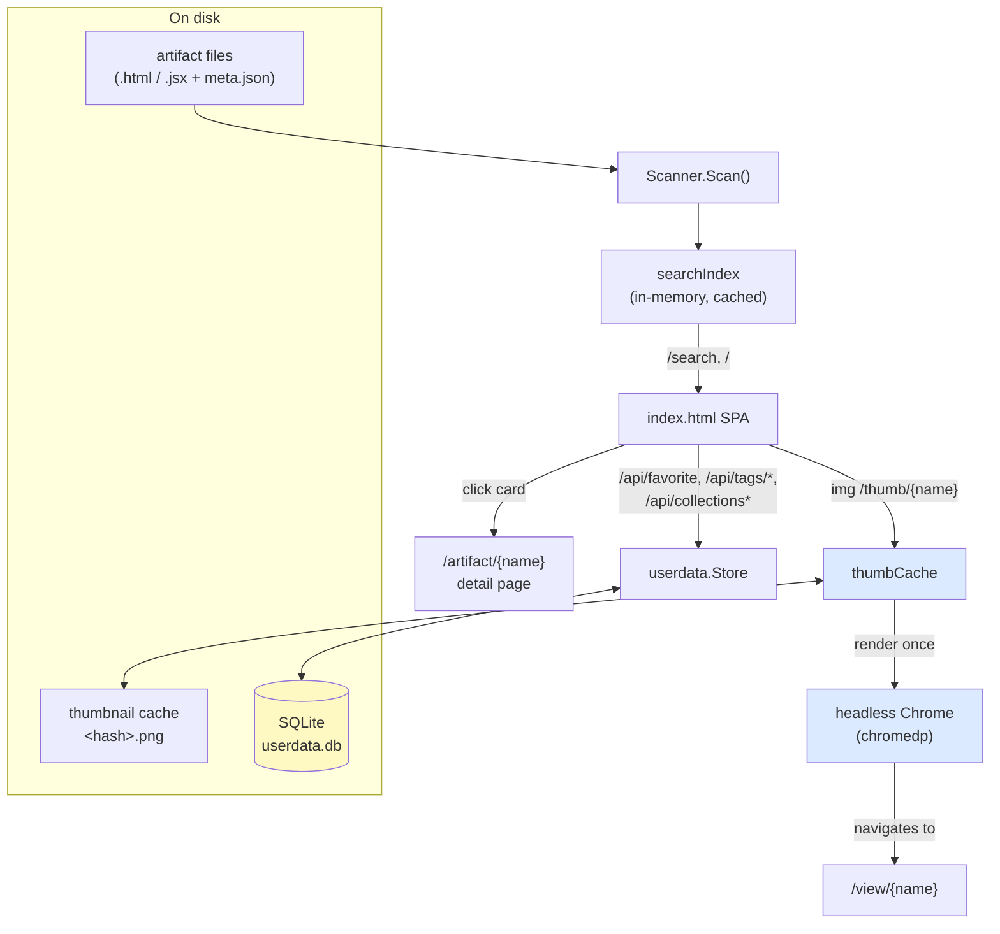
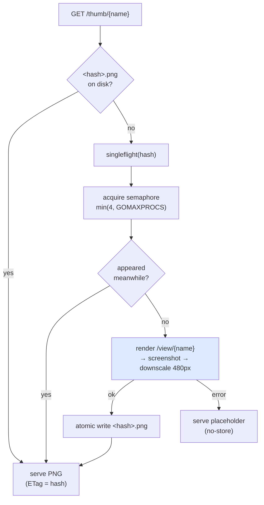

# serve-artifacts — From Static Viewer to Searchable, Organizable, Visual Gallery

`serve-artifacts` is the local web application that displays the code artifacts exported from a claude.ai account. It began as a small Go server that listed a directory of `.html` and `.jsx` files and rendered each one on demand. This note documents the work that turned it into an application built to hold thousands of artifacts: a full-text and faceted search over an in-memory index, a per-user organization layer (favorites, tags, collections) on a multi-user database schema, a visual browsing layer (thumbnails generated by a headless browser, an artifact detail page, a grid/list toggle, and keyboard-driven navigation), and a self-contained Docker image that bundles the headless browser so nothing has to be installed on the host.

This is the serving companion to the extraction and reconstruction work described in [[claude.ai Artifact Archival]]. That note explains how the artifacts get onto disk; this note explains what the server does with them once they are there. The reason the serving side is worth a deep-dive of its own is that one of its subsystems — thumbnail generation — is not ordinary front-end work. Producing a picture of an artifact means running the artifact in a real browser, screenshotting it, and doing that lazily, safely, and exactly once for each distinct version, across a library too large to render eagerly. Most of the engineering weight of the recent work sits there, and most of this note does too.

> [!summary]
> - **Search is served from an in-memory index**, rebuilt at startup and on file changes. Each artifact's source is read once to derive a lowercased full-text haystack, the third-party libraries it imports, a content hash, and a sort timestamp. Faceted counts use a skip-dimension trick so selecting one value of a facet does not zero out its siblings.
> - **Organization lives in SQLite with a multi-user schema, but a single hardcoded user.** Every row carries a `user_id`; `currentUser(r)` returns the constant `"default"`. That one function is the only seam a real identity provider has to replace later.
> - **Thumbnails are screenshots of the running artifact, cached by content hash.** A long-lived headless Chrome (driven by `chromedp`) renders each artifact once; the PNG is stored at `<thumbs>/<hash>.png`. Because the key is the content hash, an edit produces a new key and thus a fresh render with no explicit cache invalidation. Bounded concurrency plus single-flight prevent a render storm when a gallery of cards all request the same missing image.
> - **The whole thing ships as one Docker image** that contains the server and the Chromium it renders with, so a host needs only Docker.

## Why this project exists

The archival pipeline produces a directory of artifacts whose size grows without bound: one folder per conversation, each with the reconstructed source files and a metadata sidecar. A flat list of file names stops being usable after a few dozen entries. The questions a person actually has about such a directory — *which artifacts use recharts, which came from a particular project, which ones failed to reconstruct cleanly, which one was that calendar component* — cannot be answered by scrolling. They require search, filtering by structured metadata, a durable place to record judgments about individual artifacts, and a way to recognize an artifact by sight rather than by reading its title. Each of those is a distinct feature, and each was built as its own ticket:

- **METASEARCH** — ingest the export's own metadata and build search and discovery over it.
- **USERDATA** — organization: favorites, tags, and collections, on a schema that is multi-user from the start.
- **BROWSEUI** — browsing at scale: thumbnails, a detail page, and a grid/list toggle.

A fourth, unticketed step packaged the result as a self-contained container.

## Architecture

The server holds three pieces of state: a `Scanner` that walks the artifact directory, an in-memory `searchIndex` derived from that scan, and a SQLite `Store` for per-user organization data. A fourth component, the thumbnail cache, is a hybrid: its durable state is PNG files on disk, but it is driven by a live headless browser. HTTP handlers read from these and never re-scan the tree on the request path.



The design principle throughout is that the shared index is *user-agnostic and read-mostly*, and everything that varies per user or per request is layered on top of it at read time. This keeps the expensive artifact scan and body-reading out of the hot path and lets one cached structure serve every request.

## The in-memory search index

The index is the foundation the rest of the application reads from, so it is worth understanding first. `searchIndex.rebuild()` runs the scanner, then reads each artifact's source exactly once and derives from it everything search needs:

```go
type indexEntry struct {
    art       artifacts.Artifact // metadata from the scan + export meta.json
    libraries []string           // third-party imports (recharts, d3, ...)
    haystack  string             // lowercased metadata + source + transcript
    hash      string             // sha256(body)[:16] — the thumbnail cache key
    sortTime  int64              // for "recent" ordering
}
```

Reads take a read lock; a rebuild swaps the entire entry slice under a write lock. Because the whole structure is in memory, a query is a linear scan over a few thousand structs — fast enough that no inverted index or external search engine is warranted. The scan reads the body once and derives four things from it, which matters because computing any of them elsewhere would mean reading every file again. The content hash in particular is derived here precisely so that the thumbnail subsystem never has to open the file itself:

```go
func contentHash(body string) string {
    sum := sha256.Sum256([]byte(body))
    return hex.EncodeToString(sum[:])[:16]
}
```

A query is expressed as a `searchQuery` with optional constraints on type, project, model, tags, library, favorite status, collection membership, and a free-text term. The result carries the matching documents plus a facet map: for each dimension, the count of matches per value.

### Faceted counting: the skip-dimension trick

There is one subtlety in faceted search that a naive implementation gets wrong, and it is worth stating precisely because it is the difference between usable and useless facets. When a user has selected `type = jsx`, the facet sidebar should still show how many `html` artifacts exist, so they can switch. If the type-facet counts were computed against the fully-filtered result set, every non-jsx count would be zero and the user could never navigate away from their current selection.

The fix is that when counting a given facet dimension, the query is evaluated with that one dimension ignored. The `matches` method takes a `skip` parameter naming the dimension to disregard:

```go
func (e indexEntry) matches(q searchQuery, uv userView, skip string) bool {
    if skip != "type"    && q.Type != ""    && e.art.Type != q.Type            { return false }
    if skip != "project" && q.Project != ""  && projectFacet(e.art) != q.Project { return false }
    // ... model, tag, library, warnings, favorite, collection ...
    if q.Q != "" { /* every term must be a substring of the haystack */ }
    return true
}
```

The main result set is computed with `skip = ""` (nothing skipped). Each facet's counts are computed with `skip` set to that facet's name. The result is that selecting one value of a facet narrows the results but leaves the sibling values of that same facet visible and counted, while still respecting every *other* active filter.

## Organization on a multi-user schema

Search makes artifacts findable; organization makes judgments about them durable. Favorites, tags, and collections are stored in SQLite (`mattn/go-sqlite3`). The schema is multi-user from the first migration — every table carries a `user_id`, and collections are unique per `(user_id, name)` — but the application resolves every request to a single hardcoded account:

```go
const DefaultUserID = "default"

// The single seam a future identity provider replaces. Today it is constant.
func currentUser(_ *http.Request) string { return DefaultUserID }
```

This is a deliberate decision recorded in the USERDATA ticket: plan for multiple users in the data model so that adding real authentication later is a change to one function rather than a schema migration, but do not build identity-provider integration before it is needed. The tables are `users`, `favorites(user_id, artifact_key)`, `artifact_tags(user_id, artifact_key, tag)`, `collections(id, user_id, name)`, and `collection_items(collection_id, artifact_key, position)`, with `PRAGMA foreign_keys=on` so deleting a collection cascades to its items. Artifacts are referenced by their `Name` (the slash path without extension); there is no artifacts table, because the artifact set is defined by the filesystem, not the database.

The link between the user-agnostic index and the per-user data is a small structure loaded once per request:

```go
type userView struct {
    favorites      map[string]bool     // favorited artifact keys
    tags           map[string][]string // artifact key -> user tags
    collectionKeys map[string]bool     // keys in the collection being filtered
}
```

The search function takes a `userView` and uses it both to filter (a favorites-only query, or a collection view) and to enrich results (marking which documents are favorited, merging manifest tags with the user's own tags). The index itself stores none of this; it is handed the user's view at read time and stays shared. This is the same layering principle as the facets: one cached, user-independent structure, with per-request state applied on top.

## Thumbnails: the subsystem that carries the weight

A thumbnail of an artifact is a screenshot of that artifact actually running. For an HTML file that means loading the HTML; for a JSX file it means loading the server's own `/view/{name}` page, letting an import map fetch React, letting Babel compile the component in the browser, letting it mount, and only then capturing the image. This is a headless-browser operation, and at the scale of thousands of artifacts it must be cached, generated lazily, bounded in concurrency, and invalidated correctly. Everything else in the browsing layer is ordinary front-end work; this is the part that required real design.

### The cache key is the content hash

The thumbnail for an artifact is stored at `<thumbs-dir>/<hash>.png`, where `hash` is the content hash the index already computed. Keying by content, rather than by name, makes the cache self-invalidating:

- An unchanged artifact keeps its hash, so its thumbnail is reused across restarts.
- A changed artifact gets a new hash, so it points at a path that does not exist yet, and the thumbnail is regenerated on next request.

No explicit invalidation logic is needed, and no stale image is ever served, because a stale image would live at a path that a changed artifact no longer references. The thumbnails directory defaults under the user cache directory and is overridable, so it is never written into a possibly read-only artifact tree.

### The request flow



The endpoint resolves the artifact's hash from the in-memory index (falling back to hashing the file only if the index does not yet know it), then serves the cached PNG or generates one. Responses carry `ETag: "<hash>"` with `Cache-Control: no-cache`, so a browser revalidates and receives a 304 for an unchanged artifact, while an edited artifact — now a different hash and therefore a different ETag — is refetched. A generation failure serves a neutral placeholder with `no-store` rather than an HTTP error, so the gallery degrades gracefully when Chrome is unavailable.

### The render engine

The engine is hidden behind an interface so it can be swapped, and so the cache can be unit-tested with a fake that never launches a browser:

```go
type Thumbnailer interface {
    // renderOK reports whether the artifact mounted without a console error
    // or uncaught exception; the reliability check reuses it at no extra cost.
    Render(ctx context.Context, viewURL, hash string) (png []byte, renderOK bool, err error)
    Close()
}
```

The implementation drives headless Chrome through `chromedp`. It starts **one** long-lived browser lazily on the first render — a server that is never asked for a thumbnail never spawns Chrome — and opens a fresh tab per render. Reusing one browser across renders avoids paying Chrome's startup cost on every image. The render navigates to the server's own `/view/{name}`, waits for the document, then best-effort waits for the mount condition (`#root` has children for JSX, or there is no `#root` for a plain HTML page), settles briefly, and captures the screenshot, which is then downscaled to 480 pixels wide so the stored PNGs stay small enough to send a whole gallery at once.

### The concurrency contract

Two protections are mandatory at scale, and the code applies both:

- **Bounded concurrency.** A buffered channel used as a semaphore caps simultaneous renders at `min(4, GOMAXPROCS)`. Each render is a live page; without a bound, a scroll through a large gallery would launch hundreds at once.
- **Single-flight by hash.** When sixty cards all request the same missing thumbnail, only one render should run and the rest should await its result. `golang.org/x/sync/singleflight`, keyed by hash, provides exactly this.

```go
func (c *thumbCache) get(ctx context.Context, name, hash string) ([]byte, error) {
    if p, ok := c.cachedPath(hash); ok { return os.ReadFile(p) }   // fast path
    v, err, _ := c.sf.Do(hash, func() (interface{}, error) {
        if p, ok := c.cachedPath(hash); ok { return os.ReadFile(p) } // re-check in-flight
        c.sem <- struct{}{}; defer func() { <-c.sem }()              // bound
        png, ok, err := c.engine.Render(ctx, c.baseURL+"/view/"+name, hash)
        if err != nil { return nil, err }
        small, _ := downscalePNG(png, thumbWidth)
        writeFileAtomic(c.pathFor(hash), small)                     // temp + rename
        c.recordRenderOK(hash, ok)
        return small, nil
    })
    // ...
}
```

The re-check inside the flight matters: a sequential second caller can arrive just after a first has finished and written the file, and the re-check lets it read that fresh file instead of rendering again. The write is atomic (temp file plus rename) so a crashed render never leaves a truncated PNG in the cache.

The most delicate part is context lifetime. A render tab must be parented to the *browser* context so that it reuses the running Chrome, but it must also honor the caller's timeout and cancellation. Parenting the tab to the caller's context would spawn a new browser; parenting only to the browser would ignore cancellation. The resolution is to create the tab from the browser context and then bridge the caller's context onto it:

```go
tabCtx, cancelTab := chromedp.NewContext(e.browserCtx)
defer cancelTab()
stop := context.AfterFunc(ctx, cancelTab) // caller timeout/cancel aborts the tab
defer stop()
```

### One render pass, two answers

The render already has to load and mount the artifact, which is exactly what a reliability check would do. So the engine also listens for console errors and uncaught exceptions during the render and returns a `renderOK` bit alongside the PNG:

```go
chromedp.ListenTarget(tabCtx, func(ev interface{}) {
    switch e := ev.(type) {
    case *cdpruntime.EventConsoleAPICalled:
        if e.Type == cdpruntime.APITypeError { hadError = true }
    case *cdpruntime.EventExceptionThrown:
        hadError = true
    }
})
```

That bit is surfaced on the search document as `render_ok` and can later drive a "broken" badge or facet, with no additional render pass. A startup background backfill walks the index and pre-renders any artifact whose `<hash>.png` is missing, throttled by the same semaphore as live requests, so scrolling a freshly-started server is smooth and the `render_ok` map warms up on its own.

## The rest of the browsing surface

The remaining browsing features are comparatively small and share the index and organization machinery already described.

- **The detail page** (`GET /artifact/{name}`) is a page *about* one artifact, distinct from `/view`, which is the artifact itself. It embeds the live artifact in an iframe beside a metadata panel — favorite, tags, collections, the claude.ai and local-transcript links, and reconstruction warnings — with the full source below. Its dynamic data comes from `GET /api/artifact/{name}`, which returns the same enriched search document the results grid uses, so the two surfaces stay consistent.
- **The grid/list toggle** reuses the one result container with a modifier class. Grid mode is the thumbnail-card layout; list mode is a compact table (thumbnail, title, type, model, date, size, favorite) that is denser for scanning by name. The render path became a dispatcher over `buildCard` and `buildRow` sharing the thumbnail-URL and lazy-load helpers.
- **Follow-ons**: a command palette (`⌘K` / `Ctrl-K`) that runs `/search` and jumps to an artifact by keyboard; single-key navigation (`/` focuses search, `j`/`k` move the selection, `o` opens, `f` favorites, `d` toggles theme); and a dark mode persisted in `localStorage`.

The gallery uses ``, which means the browser only requests thumbnails for cards near the viewport. This pairs precisely with lazy server-side generation: a thumbnail is rendered the first time it scrolls into view, and a shimmer skeleton shows until it loads.

## Packaging: the self-contained image

Because thumbnail generation depends on a browser at runtime, "install and run" would otherwise require the host to have Chrome. The packaging step removes that requirement by putting Chromium inside the image. The Dockerfile is multi-stage:

- **Build stage** on `golang:1.26-bookworm`. Go 1.26 is required because adding `chromedp` raised the module's minimum Go version. The stage runs the JSX precompile generator and builds with `CGO_ENABLED=1`, which is required by the SQLite driver.
- **Runtime stage** on `debian:bookworm-slim` with `chromium`, `ca-certificates` (HTTPS for the JSX import map), the Liberation and Noto fonts (legible text and emoji in thumbnails), and `tini` as PID 1 to reap the Chrome child processes. Bookworm is used on both stages so the runtime glibc matches the one the cgo build linked against.

Two Chrome flags make headless rendering work inside a container:

- `--disable-dev-shm-usage` is always set, because the default `/dev/shm` in a container is 64 MB and Chrome crashes on larger pages without it. This removes any need to tune `--shm-size`.
- `--no-sandbox` is required because Chrome cannot use its sandbox when running as root inside a container. It is gated behind a `--chrome-no-sandbox` flag and a `SERVE_ARTIFACTS_CHROME_NO_SANDBOX` environment variable, off by default on a normal host; the image sets the variable so it is on only inside the container.

A `/data` volume holds the thumbnail cache and the SQLite database, so both survive restarts; since thumbnails are keyed by content hash, they are only ever regenerated when an artifact actually changes. The image was verified end to end: the running container renders a real 480×302 JSX thumbnail through its bundled Chromium, persists the cache and database to `/data`, and reports `render_ok`.

## Data contracts

The HTTP surface, after all three tickets:

| Endpoint | Purpose |
|---|---|
| `GET /` | the search-driven single-page gallery |
| `GET /search` | `{total, results, facets}` for a query |
| `GET /view/{name}` | the runnable artifact (HTML direct; JSX via a host page + import map) |
| `GET /raw/{name}` | raw source bytes |
| `GET /thumb/{name}` | PNG thumbnail, generated on demand, cached by content hash |
| `GET /artifact/{name}` | detail page for one artifact |
| `GET /api/artifact/{name}` | the artifact's search document + transcript availability |
| `GET /transcript/{name}` | the ingested `conversation.md`, if present |
| `POST /api/favorite` | toggle or set a favorite |
| `POST /api/tags/add`, `/api/tags/remove` | add or remove a user tag |
| `GET/POST/DELETE /api/collections*` | list, create, delete collections and manage their items |

The `SearchDocument` returned by search and the artifact endpoint carries the artifact's name, title, type, size, project, model, source conversation UUID, update timestamp, reconstruction warning count, manifest and user tags, favorite state, content `hash`, and (once rendered) `render_ok`.

## Failure modes and the decisions that avoid them

| Symptom | Cause | Handling |
|---|---|---|
| Stale thumbnail after an edit | cache keyed by name | key by content hash, so a change yields a new path |
| Render storm / memory exhaustion | unbounded concurrent renders | semaphore-bounded workers plus single-flight by hash |
| Blank JSX thumbnail | screenshot taken before mount | wait for `#root` children (JSX) or `load` (HTML), then settle |
| Chrome crash in a container | 64 MB `/dev/shm` | `--disable-dev-shm-usage`, always on |
| Chrome will not start as root | container sandbox restriction | `--no-sandbox`, gated by flag/env, set only in the image |
| Truncated PNG in cache | crash mid-write | temp file plus atomic rename |
| Cache or DB written into a read-only export dir | default path in the served dir | default both under the user cache/config dir, overridable |
| Facet siblings all show zero | facet counted against the filtered set | skip-dimension counting |

## Current project status

All three tickets are implemented, tested, and committed, and the container is verified. The application supports full-text and faceted search, per-user favorites/tags/collections on a multi-user schema, a thumbnail gallery with lazy generation and a background backfill, an artifact detail page, a grid/list toggle, keyboard navigation, a command palette, dark mode, and a self-contained Docker image. The Go test suites for `pkg/server`, `pkg/artifacts`, `pkg/userdata`, and `pkg/jsx` are green, and the browsing surface was validated interactively with a headless browser driver.

## Important project docs

Inside the repo (`/home/manuel/code/wesen/2026-03-29--serve-claude-experiments`):

- `ttmp/2026/07/13/SERVE-20260713-METASEARCH--…` — metadata ingest and search design + diary.
- `ttmp/2026/07/13/SERVE-20260713-USERDATA--…` — organization and multi-user schema design + diary.
- `ttmp/2026/07/13/SERVE-20260713-BROWSEUI--…` — browsing-at-scale design guide + the strict-format implementation diary for all seven steps.
- `DOCKER.md`, `Dockerfile`, `docker-compose.yml` — the container packaging.

The companion note [[claude.ai Artifact Archival]] covers the upstream extraction and reconstruction that produces the artifacts this server displays.

## Open questions

- Should `render_ok` be persisted (a sidecar or a DB column) so a "broken" facet survives a restart without re-rendering, rather than living only in an in-memory map for the current run?
- For a fully offline deployment, is it worth vendoring React and Babel and rewriting the JSX import map to local URLs, so thumbnail generation needs no outbound network?
- When real users arrive, does the `currentUser` seam expand cleanly to session-cookie or bearer-token resolution without touching the schema, as intended?

## Near-term next steps

- Persist the `render_ok` bit and add the "broken" badge and facet it was designed to feed.
- Consider optional server-side syntax highlighting for the detail page's source view.
- Extend the dark-mode theme to the detail page (currently the index page only).

## Project working rule

The shared index stays user-agnostic and read-mostly; everything per-user or per-request is layered on at read time. Thumbnails are content-addressed and generated exactly once per distinct version, always through the bounded, single-flighted path. New capabilities are planned as tickets with an intern-facing design guide and are implemented against a strict-format diary, one committed step at a time.
