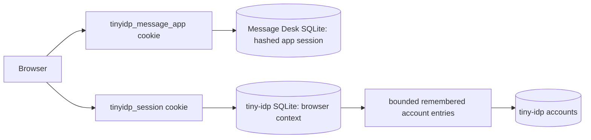

# tiny-idp: Multi-Account Browser Sessions, Account Choice, and Logout Scopes

This report records the work completed after the public-embedding foundations report. The work turns a provider that can authenticate one browser session into a system that can represent a bounded set of remembered identities, let a relying party request a standard account-selection interaction, let the user choose another identity without weakening fresh-authentication policy, and distinguish a relying-party logout from provider-wide browser logout.

> [!summary]
> - tiny-idp now persists opaque browser contexts and remembered-account membership separately from an individual authorization session.
> - `prompt=select_account` has a typed UI contract, a default renderer, a custom Message Desk renderer, and state-bound continuation semantics.
> - Registration creates an application session, not an IdP browser session; the boundary is intentional and documented.
> - The Message Desk demonstrates three distinct actions: change account, log out of the application, and log out everywhere.
> - Focused tests, the full Go suite, a saved Playwright specification, and a direct Playwright MCP run provide executable evidence.

## What changed

The earlier embedding work made it possible to construct a durable provider from public APIs. This increment addresses a different problem: a browser rarely contains exactly one identity for the life of a session. A person may use two local accounts, sign out of one relying party while retaining an identity-provider session, or need to satisfy a relying party that explicitly asks them to select an account. An implementation that represents only “currently authenticated” cannot model those operations safely.

The ticket is `ttmp/2026/07/14/TINYIDP-ACCOUNT-CHOOSER-001--multi-account-browser-sessions-and-account-chooser-apis`. Its design document, sources, task plan, scripts, and 10-step diary are the primary evidence. The implemented checkpoints include storage (`7b4fa5e`), lifecycle (`7b19d58`), renderer contract (`01e96ad`), protocol transitions (`8c5bdc5`, `3ee16cc`), registration continuation (`757f98e`), and local-versus-global logout (`96f531d`).

## The state model

The central design decision is to separate provider browser state from relying-party state. The browser context is an opaque, provider-owned durable record. It has a keyed token hash, bounded remembered members, timestamps, and a host-controlled label policy. It does not store a reusable subject identifier in a cookie. A Message Desk session is a different opaque token, hashed in the application database, with its own CSRF secret and lifetime.



This separation prevents an application endpoint from silently changing provider state. It also gives logout operations precise meanings. The following table should guide both implementation and UI wording.

| User operation | Invalidates | Preserves | Next Sign in |
|---|---|---|---|
| Change account | Nothing before authorization | App session until OIDC callback; provider context | Account chooser |
| Log out of Message Desk | Message Desk session and cookie | Provider browser context and remembered entries | Account chooser |
| Log out everywhere | Message Desk session, IdP session, browser context membership | Durable accounts | Credential page |

## Authorization and interaction semantics

Message Desk requests `prompt=select_account` in `examples/tinyidp-message-app/oidc_client.go`. The provider does not treat the parameter as decoration. It creates a request-bound interaction, reads the current browser context, and either renders an account chooser or presents credentials if no remembered entry exists. A chooser selection activates a fresh authorization-session handle and, where consent is required, carries that fresh session into a new consent interaction. The “Use another account” action also creates a fresh credential interaction rather than reusing the previous authorization state.

```text
authorize(prompt=select_account)
  if browser context has remembered entries:
      render AccountChooserPrompt(entries, opaque values)
  else:
      render credential prompt

choose(entry):
  activate remembered session atomically
  if consent required: render consent bound to fresh session
  else: finish authorization

use_another:
  render fresh credential interaction
```

The invariant is that a chooser value is an opaque one-time capability, not a subject name. The UI may show a label selected by host privacy policy, but it returns the provider-generated opaque value. This avoids turning HTML form values into account identifiers that a caller can forge or replay.

## UI contract and Message Desk presentation

`pkg/idpui` exposes an `AccountChooserPrompt` rather than asking a host template to infer state from an authorization request. The default renderer preserves accessible radio controls and submit names. Message Desk implements the same typed contract in `examples/tinyidp-message-app/loginui/templates/interaction.html` and `loginui/static/login.css`, adding semantic chooser fieldsets and selectable account cards while retaining the provider-generated values and actions.

The visual work exposed an important engineering rule: a custom renderer may style a prompt but must not gain redirect or session mutation authority. Authentication, authorization decisions, CSRF validation, interaction binding, and redirect construction remain in provider code. The renderer is a constrained view over typed state.

## Registration continuation

The Message Desk account-registration endpoint creates a durable tiny-idp account and then establishes a fresh Message Desk session. This produces the user-visible result expected after successful self-registration: the next page is the signed-in application. It does not mint `tinyidp_session`. The provider still owns its browser session and will require the normal authorization interaction later.

```text
POST /api/accounts
  -> validate one-time registration CSRF and password policy
  -> create tiny-idp account
  -> create hashed Message Desk session + CSRF secret
  -> Set-Cookie(HttpOnly, SameSite=Lax)
  -> next: /
```

This order matters. The app session record is stored before its cookie is emitted. A post-account-creation application-store failure returns a clear availability error instead of pretending that account creation failed and inviting duplicate registration.

## Logout scopes

The final increment is implemented in `examples/tinyidp-message-app/app_http.go`. `POST /auth/logout/local` and `POST /auth/logout` share CSRF verification, app-session revocation, and app-cookie clearing through `logoutApplicationSession`. The local route returns `204 No Content`. The global route derives an end-session URL from the canonical public origin and bootstrap-owned client registration, returns JSON, and the React client performs browser navigation. No request-provided redirect URI is accepted.

```mermaid
sequenceDiagram
  participant U as Browser
  participant A as Message Desk
  participant P as tiny-idp
  U->>A: POST /auth/logout/local + app CSRF
  A->>A: revoke hashed app session; clear RP cookie
  A-->>U: 204
  U->>A: GET /auth/login
  A->>P: authorize(prompt=select_account)
  P-->>U: remembered-account chooser

  U->>A: POST /auth/logout + app CSRF
  A->>A: revoke app session; clear RP cookie
  A-->>U: { endSessionUrl }
  U->>P: GET end-session URL with IdP cookie
  P->>P: clear IdP session and browser-context membership
```

## Verification and assurance

The implementation is not justified solely by a UI demonstration. `app_http_test.go` checks that local logout returns no provider navigation and revokes the app session, global logout returns an allowlisted browser-navigable endpoint and revokes the app session, and an already authenticated application session can still start an explicit select-account request. Renderer tests exercise the generic `idpuitest` conformance contract.

`scripts/06-live-account-switch.spec.mjs` is a credential-free Playwright specification: the operator supplies credentials only through environment variables. It covers first login, change-account, use-another, two remembered identities, and local logout followed by chooser. Direct Playwright MCP validation additionally exercised the live server at `127.0.0.1:8090`: local logout produced guest mode followed by “Choose an account”; global logout produced guest mode followed by credential entry. The full `go test ./... -count=1` suite and Message Desk `pnpm build` passed.

## Remaining work

The account chooser feature is usable in the demo, but the ticket is not marked complete. Phase 3 still needs the full removal, maintenance, and audit-event lifecycle review. Phase 6 still needs scheduled race, fuzz, analyzer, browser CI, interoperability, backup, and rollback assurance gates. The saved browser test should be moved into a repository-provisioned Playwright toolchain so that CI can run it without operator setup.

The implementation provides a practical rule for future hosts: define each action by the state it owns. A relying party may revoke its own session. The provider may revoke its browser context. A host may request selection through the standard authorization parameter. Keeping those authorities separate makes the browser behavior explainable, testable, and resistant to accidental scope expansion.

## Related material

- [[PROJECT REPORT - tiny-idp - Public Embedding Foundations]] explains the supported public composition boundary used by embedded applications.
- [[PROJECT REPORT - tiny-idp - Stylable Login and Consent UI]] explains the renderer boundary that the account chooser extends.
- [[ARTICLE - Static Analysis for tiny-idp Security Engineering]] and [[PROJECT REPORT - tiny-idp - Model Checking and Executable State Assurance]] describe the broader assurance strategy that informs this ticket’s invariants and test harnesses.
