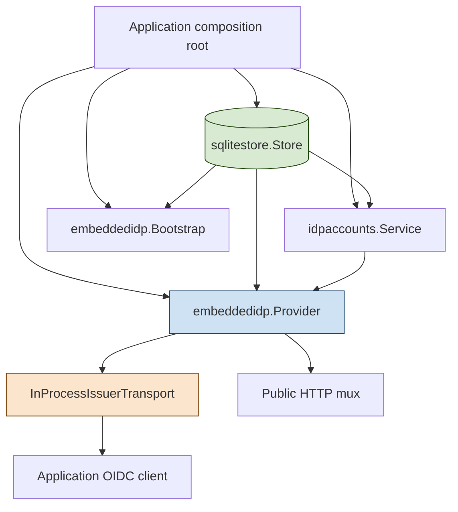
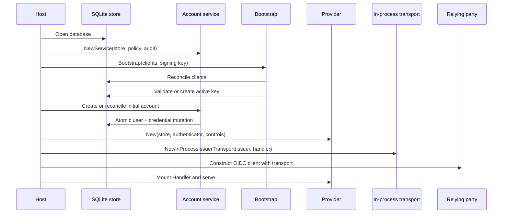
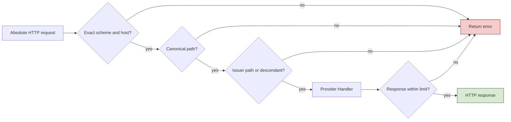
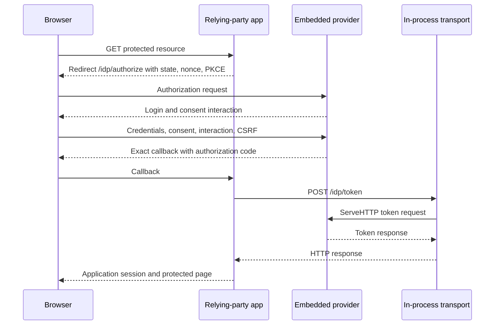

# tiny-idp: Public Embedding Foundations for Browser and Device Applications

A Go package becomes usable when an application can construct it, provision its prerequisites, operate it, test it, and shut it down through supported public contracts. `tiny-idp` already had a strict OpenID Provider, durable SQLite state, production checks, and an embedding constructor. The remaining application path still depended on private account, signing-key, store, and same-process transport details. A host could instantiate the provider, but it could not assemble a complete identity subsystem without reproducing repository internals.

`TINYIDP-EMBED-FOUND-001` closes that gap. It publishes a public account lifecycle service, adds declarative browser and device client bootstrap, provisions the initial signing key without exposing its representation, implements a bounded exact-issuer `http.RoundTripper`, migrates the xapp to the public boundary, and enforces the boundary with a repository-specific Go analyzer. The result is a concrete composition path for a browser application today and a stable client model for a later device-authorization application.

This report explains the project as a system. It covers the ownership graph, public APIs, state transitions, failure semantics, transport security, static enforcement, executable examples, migration work, verification evidence, and remaining release gaps. It follows the earlier reports on strict Fosite conformance, production hardening, static analysis, model checking, and stylable interaction UI. Those reports explain the lower protocol and assurance layers; this report explains how a host application now consumes them.

> [!summary] Project result
> - `pkg/idpaccounts` is the supported public boundary for account creation, password replacement, authentication, durable lockout, dummy verification, bounded Argon2id work, audit, and readiness reporting.
> - `embeddedidp.Bootstrap` reconciles browser, device, or generic client declarations and ensures one usable initial RS256 signing key without overwriting drift or returning private key material.
> - `embeddedidp.InProcessIssuerTransport` routes same-process OIDC back-channel requests to the provider handler only when origin and issuer-path checks pass, with no network fallback and a one-megabyte default response limit.
> - The xapp development host now uses persistent public SQLite identity state and rejects account or credential drift across restarts.
> - A custom `go/analysis` rule prevents applications and examples from importing private tiny-idp identity implementations while permitting an application's own nested `internal` packages.
> - Build, full tests, selected race tests, lint, custom analyzers, formatting, logging generation, vulnerability analysis, and a live HTTP smoke passed under Go 1.26.5.
> - Device-shaped client bootstrap is complete, but the strict provider's RFC 8628 device authorization endpoints remain future work.

## 1. Scope and evidence

The project was executed under:

```text
ttmp/2026/07/13/
  TINYIDP-EMBED-FOUND-001--public-embedding-foundations-for-browser-and-device-applications/
```

The main ticket artifacts are:

- `design-doc/01-public-account-bootstrap-and-in-process-issuer-apis-analysis-design-and-implementation-guide.md`, a 1,333-line accepted design and implementation specification;
- `reference/01-implementation-diary.md`, a 979-line chronological record of decisions, commands, failures, corrections, verification, commits, and delivery;
- `tasks.md`, containing 20 completed tasks across contract, account, bootstrap, transport, assurance, and delivery phases;
- `changelog.md`, recording the phase checkpoints;
- `docs/embedding-foundations.md`, a 488-line public consumer guide;
- executable examples in `examples/embedded/main.go` and `pkg/embeddedidp/example_test.go`.

The implementation sequence is represented by these commits:

| Commit | Result |
|---|---|
| `e569d21` | Accepted the public embedding design and phase plan. |
| `edd1479` | Published account creation, password replacement, and authentication under `pkg/idpaccounts`. |
| `7481ee1` | Added declarative client and initial signing-key bootstrap. |
| `3e17e79` | Added the bounded, networkless in-process issuer transport. |
| `519a4cf` | Published documentation and examples, migrated xapp state, added the import analyzer, and wired assurance into CI. |
| `772d86d` | Completed the ticket diary, task state, relationships, and changelog. |
| `fa72357` | Recorded the successful reMarkable delivery receipt. |

Across the design baseline through the final diary receipt, the work changed 56 files with 4,923 insertions and 794 deletions. The account checkpoint itself replaced or removed substantial private code: 771 insertions and 686 deletions across 28 files. These counts show that the project was a boundary reorganization, not a thin facade added over the old structure.

### Evidence classes

This report relies on five kinds of evidence:

1. **Source contracts.** Public types, constructors, interface assertions, and validation logic define what an embedding host may use.
2. **State-transition tests.** Account, bootstrap, transport, and xapp tests exercise successful transitions, conflicts, cancellation, post-commit failures, and restart behavior.
3. **Static checks.** General Go lint and repository-specific analyzers reject architectural and security regressions.
4. **Runtime evidence.** Race tests and a live tmux HTTP smoke exercise compiled code under realistic process and HTTP behavior.
5. **Chronological records.** The diary preserves false starts, environmental failures, scanner triage, and why the final design differs from the first implementation attempt.

## 2. What a complete embedding boundary requires

Provider construction is only one operation in an embedded identity system. Before a provider can answer an authorization request, the host needs durable state, at least one client, an active signing key, authentication policy, account data, audit behavior, rate limiting, and a mounted HTTP handler. After construction, the host must schedule maintenance, expose readiness, and close resources in an ordered shutdown.

A complete embedding boundary therefore answers these questions:

- Which package creates and authenticates accounts?
- Which component owns password hashing and lockout policy?
- How are clients declared without writing internal records directly?
- How is the first signing key created without exposing private key encoding?
- How does an OIDC relying party in the same process perform discovery and token exchange before the public listener is reachable?
- Which configuration differences are harmless declaration noise, and which are security-relevant drift?
- What state may already be committed when audit delivery fails?
- Which resources belong to the host, and in what order are they closed?
- How does CI prevent an example or application from returning to private packages?
- Which device-flow capabilities exist now, and which remain unimplemented?

Before this project, these questions had partial answers spread across `internal/authn`, `internal/admin`, `internal/keys`, xapp initialization code, go-go-goja transport helpers, and test-only setup. That structure was workable inside the repository because Go's `internal` rule permits imports from descendants of the parent directory. It was not a supported application API.

### 2.1 The original dependency pattern

The earlier xapp composition performed several representation-level operations:

```text
xapp composition
  -> construct internal memory identity store
  -> construct internal password service
  -> build stored user and credential records
  -> generate RSA key through internal key package
  -> write client and key records directly
  -> use go-go-goja in-process OIDC transport
  -> construct tiny-idp provider
```

Every direct record operation transferred implementation knowledge to the host. The host needed to know how password credentials were encoded, which fields made a client public, how PKCE was represented, how token lifetimes were stored, how signing keys were serialized, and which transport validation another repository implemented.

### 2.2 The target dependency pattern

The completed composition uses capability-level public operations:



The host still owns policy and lifecycle. It supplies the issuer, store location, audit sink, rate limiter, secrets, cookie settings, clients, and accounts. It does not construct private representations.

## 3. Package ownership

The public surface is divided by responsibility rather than by one universal service.

| Package | Public responsibility | Deliberately excluded responsibility |
|---|---|---|
| `pkg/sqlitestore` | Durable identity and protocol storage, schema, maintenance, backup, and restore primitives. | Product-specific account authorization and UI. |
| `pkg/idpstore` | Domain records, validation, and store interfaces. | Password hashing and provider HTTP behavior. |
| `pkg/idpaccounts` | Account creation, password replacement, password authentication, lockout, work admission, audit, and readiness. | User disable/delete administration and signing-key operations. |
| `pkg/embeddedidp` | Bootstrap, provider construction, handler, readiness, maintenance, lifecycle, and same-process issuer HTTP. | Host routing, process supervision, TLS termination, and application sessions. |
| `pkg/idp` | Shared policy and operational contracts. | Concrete storage and provider composition. |
| `pkg/idpui` | Constrained login and consent rendering contract. | OAuth decisions, session mutation, and redirect control. |

Private packages remain valid implementation units. `internal/passwordhash` owns the Argon2id implementation. `internal/keys` owns signing-key representation and parsing. `internal/fositeadapter` owns protocol integration. `internal/admin` owns privileged operational actions. The design does not make every useful implementation public. It exposes public operations at the point where a host has a legitimate capability requirement.

### 3.1 Why there is no public hasher injection

An account API that accepted arbitrary encoded password hashes would create several unstable contracts:

- the host would need to know the hash string format;
- the host could bypass password acceptance policy;
- the host could choose parameters below production requirements;
- credential migration would become a public compatibility obligation;
- tests and examples would normalize direct credential-record construction.

The public account service accepts password bytes and applies policy, work admission, hashing, metadata extraction, and atomic persistence internally. The hash implementation remains replaceable inside tiny-idp without changing application code.

### 3.2 Why administration remains separate

Account creation and authentication are application capabilities. Disabling an account, rotating signing keys, repairing storage, exporting state, and performing backup are operational capabilities. Combining them in one public facade would make privilege boundaries unclear and would encourage application request handlers to retain administrative authority they do not need.

The migration removed account creation and password ownership from the old administrative service. Composition roots now construct `idpaccounts.Service` and `internal/admin.Service` from the same store and audit sink when they require both. No compatibility field was added to preserve the older universal facade.

## 4. Construction and lifecycle order

Order matters because provider construction reads clients and keys, because audit failure may follow persistence, and because resources have explicit ownership.

The supported sequence is:

1. Open the SQLite store.
2. Open the durable audit sink and production controls.
3. Construct the account service.
4. Bootstrap declared clients and the initial signing key.
5. Create or reconcile the initial account.
6. Construct the provider against the same store and authenticator.
7. Construct the in-process transport for a same-process relying party.
8. Construct the relying-party OIDC client using that transport.
9. Mount the provider handler under the issuer path.
10. Start supervised maintenance and public serving.
11. On shutdown, stop public traffic, cancel maintenance, close the provider, close audit, and close storage.



Constructing the provider before bootstrap is unsupported. The Fosite client view is assembled during provider startup. Mutating clients behind a running provider would create a mismatch between persisted configuration and the provider's active view.

## 5. The public account service

`pkg/idpaccounts` combines account mutation and password authentication because they share policy, hashing, audit, work admission, and credential persistence. It implements three provider-facing contracts:

```go
var _ idp.PasswordAuthenticator = (*Service)(nil)
var _ idp.PasswordWorkReporter = (*Service)(nil)
var _ idp.ProductionReadyReporter = (*Service)(nil)
```

The same service can therefore create the first application account and satisfy `embeddedidp.Options.Authenticator`.

### 5.1 Construction

```go
accounts, err := idpaccounts.NewService(store, idpaccounts.Options{
    LoginPolicy:    idpaccounts.DefaultLoginPolicy(),
    PasswordPolicy: idp.DefaultPasswordAcceptancePolicy(),
    PasswordWork:   idp.PasswordWorkConfig{MaxConcurrent: 2},
    Audit:          audit,
})
```

Zero values select production-oriented defaults. The acceptance policy and authentication policy are separate:

- Password acceptance decides which new passwords may be established.
- Login policy decides lockout thresholds, windows, duration, and whether development passwordless behavior is allowed.
- Password-work configuration limits concurrent expensive hash operations.

### 5.2 Account creation

The public request carries identity claims and a plaintext password for immediate derivation:

```go
created, err := accounts.Create(ctx, idpaccounts.CreateRequest{
    Login:             "alice",
    Password:          password,
    Email:             "alice@example.test",
    EmailVerified:     true,
    Name:              "Alice",
    PreferredUsername: "alice",
})
```

The method performs a single policy-controlled pipeline:

```pseudocode
function Create(request):
    require live context
    normalize and validate login
    validate password under acceptance policy
    choose or validate opaque user ID
    choose subject = explicit subject or user ID
    construct profile and validate claims

    acquire bounded password-work permit
    derive Argon2id credential
    release permit

    atomically create login, user, credential, security state

    emit identity.account.created after commit
    if audit fails:
        return committed user plus ErrAuditDelivery
    return created user
```

The atomic store operation prevents a login without a user, a user without a credential, or a credential attached to the wrong identity. Duplicate login or explicit ID returns `idpstore.ErrDuplicate`.

### 5.3 Post-commit audit failure

Audit delivery occurs after persistence. This is an explicit failure model, not an accidental ordering detail. If storage commits and audit fails, `Create` returns both the committed user and an error wrapping `idp.ErrAuditDelivery`.

An application must not implement retry as:

```pseudocode
if error:
    assume nothing happened
    retry Create unchanged
```

The correct behavior is:

```pseudocode
if error is AuditDelivery:
    inspect returned user
    reconcile durable state by login or ID
    escalate audit health
    do not create a second identity
```

The same principle applies to bootstrap. Errors need typed interpretation because some report committed state.

### 5.4 Password replacement

```go
err := accounts.SetPassword(ctx, idpaccounts.SetPasswordRequest{
    Login:    "alice",
    Password: replacement,
})
```

Replacement derives a new credential and atomically replaces credential and security state. It emits `identity.account.password_changed` after commit. Account disable, enable, deletion, and forced operational actions remain administrative.

### 5.5 Authentication

The provider invokes:

```go
result, err := accounts.AuthenticatePassword(
    ctx,
    login,
    password,
    idp.LoginMetadata{
        ClientID: clientID,
        RemoteAddr: remoteAddr,
        UserAgent: userAgent,
    },
)
```

The service deliberately collapses existence-sensitive failures. Unknown login, missing credential, and password mismatch return `ErrInvalidCredentials`. Unknown users still receive dummy Argon2id work so timing does not trivially disclose account existence.

The main outcomes are:

| Outcome | Meaning | Caller action |
|---|---|---|
| `ErrInvalidCredentials` | Unknown login, missing credential, or mismatch. | Return a generic login failure. |
| `ErrAccountDisabled` | User or credential is disabled. | Deny and audit without revealing unnecessary detail. |
| `ErrAccountLocked` | Durable lockout is active. | Deny and respect lockout policy. |
| `ErrAuthenticationUnavailable` | Security-state persistence or credential access failed. | Fail closed and surface dependency health. |
| `ErrPasswordWorkRejected` | Context ended while waiting for hash capacity. | Treat as overload or cancellation, not a bad password. |

Successful authentication resets durable failed-login state. A credential may be rehashed when current parameters differ from policy.

### 5.6 Bounded password work

Argon2id consumes memory and CPU by design. Cryptographic cost protects stored passwords, but an unbounded number of concurrent attempts can exhaust the process. The service uses a capacity-limited channel as a semaphore:

```pseudocode
function beginPasswordWork(context):
    try immediate permit
    if full:
        increment saturation and waiting counters
        wait for permit or context cancellation
    if cancelled:
        decrement waiting
        increment rejected
        return ErrPasswordWorkRejected
    increment inFlight
    return release function
```

The release function removes one permit and updates completion and duration metrics. `PasswordWorkStats` exposes capacity, in-flight work, waiters, saturation, rejection, completion, total wait, and total duration. This makes admission pressure observable without logging passwords or hashes.

## 6. Declarative bootstrap

Bootstrap converts host declarations into durable prerequisites. It is conservative: it creates missing resources, validates equivalent resources, and rejects drift. It is not a migration engine and does not overwrite existing configuration.

### 6.1 Public types

```go
type ClientProfile string

const (
    ClientProfileBrowser ClientProfile = "browser"
    ClientProfileDevice  ClientProfile = "device"
    ClientProfileGeneric ClientProfile = "generic"
)

type ClientSpec struct {
    Profile ClientProfile
    Client  idpstore.Client
}

type BootstrapConfig struct {
    Mode         idpstore.Mode
    Clients      []ClientSpec
    SigningKeyID string
    Clock        func() time.Time
    Audit        idp.Sink
}
```

Convenience constructors encode intended shapes:

```go
embeddedidp.BrowserClient(
    "message-app",
    []string{"https://messages.example.test/auth/callback"},
    []string{"https://messages.example.test/"},
    []string{"openid", "profile", "email"},
)

embeddedidp.DeviceClient(
    "message-cli",
    []string{"openid", "profile"},
)
```

### 6.2 Browser profile

The browser constructor produces a public authorization-code client:

```text
Public = true
RequirePKCE = true
RedirectURIs = exact declarations
PostLogoutRedirectURIs = exact declarations
AccessTokenTTL = 1 hour
IDTokenTTL = 1 hour
RefreshTokenTTL = 24 hours
```

It requires at least one redirect URI and the `openid` scope. Production URI validation permits HTTPS and the intended loopback exceptions. Authorization still performs exact redirect matching.

### 6.3 Device profile

The device constructor produces:

```text
Public = true
RequirePKCE = true
RedirectURIs = empty
PostLogoutRedirectURIs = empty
```

The PKCE flag preserves the current stored-client invariant for all public clients. It is dormant in a pure device grant because that grant has no authorization-code redirect. This is a data-shape decision, not a claim that strict device authorization is implemented.

### 6.4 Validate everything before writing

Bootstrap first normalizes and validates every declaration and rejects duplicate IDs. Only then does it perform writes. This avoids a simple class of partial commits in which an early valid client is created before a later declaration is discovered to be malformed.

```pseudocode
function Bootstrap(config):
    normalized = []
    seen = set()

    for spec in config.clients:
        client = normalizeAndValidate(spec)
        reject duplicate client ID
        append client

    sort normalized by client ID

    for desired in normalized:
        reconcileClient(desired)

    validate existing active signing key
    or create one initial key

    return report of created and validated resources
```

### 6.5 Normalization versus drift

Bootstrap removes declaration noise:

- surrounding whitespace;
- empty list entries;
- duplicate scopes and URIs;
- ordering differences;
- zero token lifetimes, which become documented defaults;
- creation and update timestamps during semantic comparison.

It compares security-relevant fields:

- public versus confidential status;
- secret hash bytes;
- redirect URI sets;
- post-logout redirect URI sets;
- allowed scope set;
- PKCE requirement;
- access, ID, and refresh token lifetimes;
- disabled status.

Drift returns `*embeddedidp.ClientConflictError`. Its `Fields` contains stable names such as `redirect_uris`, `allowed_scopes`, or `require_pkce`; it never includes secret contents.

This design prevents startup from silently changing an existing OAuth trust relationship. An operator must use an explicit administrative or migration operation to change a persisted client.

### 6.6 Partial commit semantics

The store interface does not define one transaction spanning an arbitrary client set plus generated RSA key material. Bootstrap therefore returns a report even on later failure:

```go
type BootstrapReport struct {
    ClientsCreated    []string
    ClientsValidated  []string
    SigningKeyCreated bool
    ActiveSigningKey  string
}
```

If the third client fails after two were created, the report names the committed clients. If audit delivery fails after key persistence, `SigningKeyCreated` remains true. Retrying the same declaration converges because committed resources validate as equivalent.

The recovery rule is:

```pseudocode
report, error = Bootstrap(...)
if error:
    inspect report
    reconcile committed resources
    classify conflict, storage, cancellation, key, or audit failure
    retry only when the declaration still matches durable state
```

### 6.7 Signing-key provisioning

Bootstrap checks for an active key. A retained key must be active, use RS256, be within its validity interval, parse as an RSA private key, and contain at least 2,048 bits. If no active key exists, bootstrap creates one initial key using either the supplied key ID or a timestamp-plus-random identifier.

Bootstrap refuses to:

- overwrite a client;
- repair an invalid active key;
- rotate an active key;
- retire verification keys;
- expose private key bytes.

Rotation, repair, retirement, and incident handling remain administrative workflows. Bootstrap establishes prerequisites; it does not absorb the full key lifecycle.

## 7. The in-process issuer transport

A same-process relying party needs OIDC discovery and token exchange before or independently of the public listener. Calling the public URL introduces listener ordering, DNS, proxy, and TLS dependencies into an operation that can be handled directly. Directly calling provider methods would bypass HTTP semantics and couple the relying party to internal protocol APIs.

`InProcessIssuerTransport` retains `net/http` as the integration contract:

```go
transport, err := embeddedidp.NewInProcessIssuerTransport(
    issuer,
    provider.Handler(),
    embeddedidp.InProcessTransportOptions{
        MaxResponseBytes: embeddedidp.DefaultInProcessResponseLimit,
    },
)

oidcHTTP := &http.Client{
    Transport: transport,
    Timeout: 10 * time.Second,
}
```

### 7.1 Security properties

The transport has four defining properties:

1. It accepts only the configured issuer origin.
2. It accepts only the issuer path or a segment descendant.
3. It never falls back to a network transport.
4. It buffers no more than the configured response limit.



### 7.2 Issuer validation

The constructor requires:

- `http` or `https` scheme;
- a non-empty host;
- no user information;
- no query or fragment;
- no opaque URL form;
- a canonical absolute path;
- no non-root trailing slash;
- a positive response limit;
- a remote address without control characters.

The default remote address is `127.0.0.1:0`. It supplies ordinary server-request metadata without claiming a real socket peer.

### 7.3 Request validation

Each `RoundTrip` requires an absolute URL and a live context. It compares lowercase scheme and host against the configured issuer. It rejects user information, opaque form, fragments, backslashes, encoded slashes, encoded backslashes, encoded dots, and paths changed by `path.Clean`.

For issuer `https://id.example.test/idp`:

| Request | Result | Reason |
|---|---|---|
| `/idp` | accepted | Exact issuer path. |
| `/idp/token` | accepted | Segment descendant. |
| `/idp/.well-known/openid-configuration` | accepted | Segment descendant. |
| `/idp-other` | rejected | String prefix is not a segment boundary. |
| other host | rejected | Origin differs. |
| HTTP instead of HTTPS | rejected | Scheme differs. |
| `/idp/%2e%2e/admin` | rejected | Encoded dot ambiguity. |
| `/idp%2ftoken` | rejected | Encoded separator ambiguity. |

The order matters. Encoded ambiguity is rejected before decoded path containment is tested.

### 7.4 Client request to server request

`RoundTrip` clones the client request with the same context, sets `RequestURI`, supplies `RemoteAddr`, clears URL scheme and host, and dispatches synchronously to `ServeHTTP`. The returned `http.Response` points back to the original client request.

This preserves the protocol boundary:

```text
OIDC library
  -> http.Client.Do
  -> InProcessIssuerTransport.RoundTrip
  -> provider.Handler().ServeHTTP
  -> standard HTTP status, headers, and body
  -> OIDC library
```

The provider does not need a second internal API for discovery or token exchange. Tests exercise the same HTTP handler mounted for public traffic.

### 7.5 Bounded response writer

`httptest.ResponseRecorder` buffers without a hard maximum. The project instead implemented a response writer that stores at most `limit` bytes and records overflow independently of the handler's treatment of `Write` errors.

```pseudocode
function Write(bytes):
    if header absent:
        set status 200
    remaining = limit - bufferedLength
    if remaining <= 0:
        overflow = true
        return short write error
    if len(bytes) <= remaining:
        append all
        return success
    append only remaining bytes
    overflow = true
    return short write error
```

After handler return, `RoundTrip` checks the overflow flag. A handler that ignored the short-write error still cannot produce a partial successful response. The default maximum is 1 MiB, sufficient for discovery, JWKS, token, userinfo, and related bounded OIDC responses.

### 7.6 Cancellation and body ownership

The cloned server request uses the original context. A cancelled context prevents dispatch or causes an error after handler return. Handler code remains responsible for observing cancellation during long work, as with ordinary `net/http` serving.

The transport closes the request body according to `RoundTripper` ownership. Tests verify body delivery, closure, cancellation, query-preserving `RequestURI`, repeated headers, status, content length, response bounds, and originating request identity.

## 8. Browser composition

The browser application has two HTTP relationships with the identity provider:

- front-channel navigation through the browser;
- back-channel discovery and token exchange from the relying party.



The transport is used only for the back channel. The browser still navigates to the canonical public issuer. This preserves issuer-visible URLs, cookies, CSP, interaction handling, and exact callback behavior.

## 9. Device-client preparation

The project deliberately separates client declaration from grant implementation. `DeviceClient` allows a no-redirect public client to be stored and reconciled. It does not add `/device_authorization`, user-code verification, approval, denial, or polling to the strict Fosite-backed provider.

The later implementation needs:

- explicit per-client allowed grant capabilities;
- durable hashed device and user codes;
- verification URI and complete verification URI;
- polling interval enforcement;
- `authorization_pending` and `slow_down` behavior;
- browser authentication and approval;
- denial, expiry, client binding, and single consumption;
- discovery metadata;
- rate-limit and audit events;
- conformance and adversarial tests.

The intended state sequence is:

```text
issued
  -> pending
  -> approved or denied or expired
  -> consumed exactly once if approved
```

The future device example can retain the public client constructor and bootstrap report. The missing work belongs in provider and persistence behavior rather than another client declaration API.

## 10. Migrating the xapp

The xapp is the most demanding in-repository consumer because it combines tiny-idp, go-go-goja Express behavior, durable objects, application sessions, login UI, generated runtime integration, and persistent product state.

### 10.1 The import guard found a real defect

After the analyzer was enabled, `cmd/tinyidp-xapp/development_app.go` still imported private memory-store and key-generation packages. This was not a hypothetical rule demonstration. The real consumer violated the intended boundary.

The migration replaced those imports with:

- `pkg/sqlitestore` for development identity persistence;
- `pkg/idpaccounts` for development accounts;
- `embeddedidp.Bootstrap` for the xapp client and signing key;
- `embeddedidp.NewInProcessIssuerTransport` for discovery and token exchange.

Development identity state now lives at:

```text
StateRoot/identity/development.sqlite
```

### 10.2 Resource ownership during construction

Construction can fail after the store opens but before the returned application owns it. The implementation uses a named `retErr` observed by deferred cleanup:

```pseudocode
store = Open(...)
storeOwnedByApp = false

defer:
    if retErr != nil and not storeOwnedByApp:
        close store

construct accounts, clients, keys, provider, transport, runtime
append store.Close to application extras
storeOwnedByApp = true
return application
```

The named result is intentional and documented with a narrow lint directive. Refactoring it away without replacing the ownership state would risk leaking or double-closing partially initialized resources.

### 10.3 Idempotent development-user reconciliation

Persistent development state changes startup semantics. A second start sees an existing user. Ignoring `ErrDuplicate` would silently accept changed configuration, while overwriting the credential would turn every restart into an implicit password reset.

The implementation reconciles:

```pseudocode
result = accounts.Create(declared user)
if success:
    return
if error is not Duplicate:
    return error

stored = GetUserByLogin(login)
compare stable identity fields
if different:
    return identity drift

authenticate configured password
if authentication fails or subject differs:
    return credential drift

return success
```

The regression test performs three constructions:

1. Construct and close with initial credentials.
2. Construct and close again with identical configuration; this must succeed.
3. Construct with a changed password; this must fail with a drift error.

This makes development state durable without allowing startup to mutate security state implicitly.

## 11. Static enforcement with Go analysis

Documentation can state a package boundary, but application code can regress unless the boundary is executable. The existing `auditlint` multichecker gained an `embedding-imports` analyzer.

### 11.1 Rule design

The rule inspects application and example package imports. It permits the xapp to use its own nested implementation packages, such as:

```text
github.com/manuel/tinyidp/cmd/tinyidp-xapp/internal/loginui
```

It rejects root private identity implementations, including the removed or prohibited authentication, key, store, and provider internals.

```pseudocode
for package in xapp and examples:
    if package path ends with ".test":
        skip synthetic test driver package

    for import in package imports:
        if import belongs to xapp's own internal subtree:
            continue
        if import belongs to prohibited tiny-idp identity internals:
            report import and supported public alternative
```

### 11.2 Fixture design

The analysistest fixture contains both sides of the rule:

- an allowed import from `fixture/cmd/tinyidp-xapp/internal/runtime`;
- a forbidden import from `fixture/internal/authn`.

This prevents a broad rule that rejects every `internal` import. Go applications legitimately use their own private subpackages. The policy concerns ownership, not the literal path segment alone.

### 11.3 CI and Make integration

The Makefile defines:

```make
AUDITLINT_DIRS ?= ./pkg/... ./internal/... ./cmd/tinyidp-xapp/... ./examples/...

auditlint:
	@for package in $(AUDITLINT_DIRS); do \
		GOFLAGS=-buildvcs=false go run $(AUDITLINT_PKG) "$$package" || exit $$?; \
	done
```

CI calls `make auditlint`, and `make verify` depends on `auditlint`. Local and CI policy therefore share one entry point.

### 11.4 Analyzer development failures

Several failures improved the tooling:

- The first edit omitted the multichecker `main` function's closing brace. Compilation caught the syntax error before analyzer execution.
- Passing several package patterns in one invocation produced a `matched no packages` failure in the current `go/packages` environment. The Make target now invokes one pattern at a time.
- Linked-worktree VCS stamping failed in restricted execution. The analyzer target uses `GOFLAGS=-buildvcs=false` because VCS metadata is irrelevant to analysis.
- The older atomicity analyzer treated `html/template.Template.Execute` as persistence because its method name begins with `Exec`. The rule now excludes that qualified method and reports classified call names.
- The first import rule diagnosed the synthetic `.test` package. The analyzer now skips test-driver packages while still analyzing source test variants.

These corrections are recorded because an analyzer that emits recurring false positives will be suppressed or ignored. Diagnostic quality is part of security-tool quality.

## 12. Executable examples as API tests

The project publishes two kinds of examples.

### 12.1 Runnable development server

`examples/embedded/main.go` can be run with:

```bash
go run ./examples/embedded
```

It opens SQLite, constructs the account service, creates an idempotent development account, bootstraps a browser client and signing key, constructs the provider, mounts its handler, and serves with explicit HTTP timeouts.

The example is intentionally development-only:

- HTTP issuer on loopback;
- documented example credentials;
- documented static token secret;
- local SQLite database;
- no production audit or proxy topology.

Its purpose is to show composition, not to define production defaults.

### 12.2 External-package examples

`pkg/embeddedidp/example_test.go` uses `package embeddedidp_test`. It cannot access unexported names. The browser example constructs SQLite, accounts, bootstrap, provider, and discovery transport. The device example bootstraps a public no-redirect client and inspects the stored result.

Because Go executes examples with expected output, the documentation is compiled and run by `go test`. A public signature change that breaks the supported composition becomes a test failure.

## 13. Verification evidence

The final assurance matrix covered compilation, behavior, concurrency, static policy, dependency vulnerability, generation consistency, and live HTTP behavior.

### 13.1 Commands that passed

```bash
go test ./pkg/idpaccounts ./pkg/embeddedidp ./cmd/tinyidp-xapp ./examples/embedded
go test -race ./pkg/idpaccounts ./pkg/embeddedidp ./cmd/tinyidp-xapp
make lint
make auditlint
make fmt-check
make logcopter-check
make verify
git diff --check
docmgr doctor --ticket TINYIDP-EMBED-FOUND-001 --fail-on warning
```

`make verify` runs build, full repository tests, lint, repository analyzers, and `govulncheck`. The final run passed under Go 1.26.5.

### 13.2 Lint findings resolved during the phase

The first source-complete lint pass reported:

- unchecked temporary-directory removal in examples;
- a missing explicit `LoginReasonSessionMissing` switch case;
- intentional named returns in development and production constructors.

The examples now make best-effort cleanup explicit, the switch handles the missing-session state directly, and the constructors carry narrow `nonamedreturns` explanations tied to partial-construction cleanup.

### 13.3 Toolchain vulnerability discovery

The first `make verify` reached `govulncheck` and reported reachable `GO-2026-5856` in `crypto/tls`, fixed in Go 1.26.5. The tiny-idp module and CI already selected 1.26.5, but the top-level `go.work` declared Go 1.26.4. Workspace selection therefore overrode the module's intended patched standard library.

The workspace declaration changed to:

```text
go 1.26.5
```

The repeat scan reported zero reachable vulnerabilities. This incident demonstrates that the effective toolchain is a workspace property during local multi-module development. Reading only `go.mod` was insufficient verification.

### 13.4 Gosec triage

A full `gosec ./...` pass reported 41 diagnostics because it included deliberate analyzer fixtures and research scripts. A production-source-only pass over `cmd`, `internal`, and `pkg` reported 28 diagnostics.

The production findings were classified as:

- bounded counter and parsed-length conversions;
- configurable development cookie settings;
- caller-selected administrative file paths;
- validated OAuth redirects requiring manual taint review;
- low-confidence hardcoded-credential string matches;
- a directory permission diagnostic on owner-only mode `0700`.

The project did not add broad `#nosec` suppressions or claim that these findings disappeared. They remain a production-hardening review backlog. The ticket-specific conclusion is narrower: the new boundary work introduced no new scanner category and all custom architectural checks pass.

### 13.5 Live HTTP smoke

The runnable example was started in a disposable tmux session. The smoke verified:

1. Startup log announced the expected issuer.
2. Discovery returned HTTP 200 with issuer, authorization, token, userinfo, JWKS, end-session, authorization-code, refresh-token, and S256 metadata.
3. An authorization request with `state=smoke` was rejected because strict validation requires at least eight characters.
4. A request with `state=smoke-state-123456`, exact callback, and S256 challenge returned the login page.
5. The page contained server-issued `interaction` and `csrf_token` fields.
6. `lsof-who -p 5556 -k` stopped the listener.

This test exercised mounted HTTP behavior beyond package tests. It also found that `go -C` changed the example's working directory, causing SQLite files to be created in the repository root. The known smoke artifacts were removed and not committed.

## 14. Failure semantics and recovery

The public APIs use different atomicity models. A host must interpret each one correctly.

| Operation | Atomic unit | Possible committed state on error | Recovery source |
|---|---|---|---|
| Account create | User, login, credential, security state. | Entire account may exist if audit delivery fails. | Returned user plus store lookup. |
| Password replace | Credential and security state. | Replacement may be committed before audit error. | Authentication/security-state lookup and audit health. |
| Bootstrap | Each client and key operation separately. | Earlier clients or key may be committed. | `BootstrapReport` plus store reconciliation. |
| Transport round trip | One synchronous handler response. | Provider may have processed request before response overflow or cancellation is observed. | Endpoint-specific idempotency and provider state. |
| Xapp construction | Multiple owned resources. | Durable bootstrap/account state may exist even if later runtime construction fails. | Restart reconciliation and explicit cleanup. |

The general rule is not “error means rollback.” The rule is “each API states its commit boundary, reports durable progress, and gives the caller enough information to reconcile.”

### 14.1 Retry classification

```pseudocode
switch error class:
    validation or conflict:
        fix declaration; do not blind retry
    cancellation:
        determine whether operation had reached persistence
    storage failure:
        inspect store health and documented atomic boundary
    audit delivery:
        assume mutation may be committed; reconcile and escalate audit
    transport origin/path violation:
        fix issuer or request construction; never use network fallback
    response overflow:
        inspect handler output; do not accept partial response
```

## 15. Security invariants

The project can be reviewed as a set of invariants rather than a list of files.

### Account invariants

- A persisted login refers to one valid user and credential.
- Password establishment always applies acceptance policy.
- Hash derivation always passes through bounded work admission.
- Unknown users receive dummy verification work.
- Lockout accounting is durable.
- Authentication errors do not disclose account existence.
- Post-commit audit failure is distinguishable from pre-commit failure.

### Bootstrap invariants

- Every declaration is validated before the first write.
- Duplicate client IDs are rejected before persistence.
- Browser clients are public, require PKCE, include `openid`, and have callbacks.
- Device clients are public and have no callbacks.
- Existing security-relevant drift is rejected, not overwritten.
- Reports identify committed resources.
- Initial key provisioning never returns private material.
- Bootstrap does not rotate or repair keys.

### Transport invariants

- Only the configured issuer origin is dispatchable.
- Only the issuer path or a segment descendant is dispatchable.
- Encoded path ambiguity is rejected before containment checks.
- No rejected request reaches a network fallback.
- Response buffering is bounded.
- Overflow cannot become partial success.
- Cancellation and request-body ownership follow `net/http` contracts.

### Consumer invariants

- Application and example packages use supported public identity packages.
- The xapp may use its own nested implementation packages.
- Persistent development state must match declared identity and credentials.
- Bootstrap completes before provider construction.
- Resource cleanup handles partial construction.

## 16. Why the design rejected common alternatives

### Export the old password service unchanged

Moving `internal/authn` to a public path without changing ownership would preserve account creation in the admin facade and expose a constructor shaped around private hashing details. The implemented service owns both establishment and authentication policy and presents application-level requests.

### Let examples write credential records

Direct `PasswordCredential` construction would make hash encoding and parameters part of the consumer contract. It would also permit policy bypass. External examples now call `idpaccounts.Create`.

### Bootstrap raw clients only

A raw `idpstore.Client` remains available through the generic profile, but typed browser and device constructors encode the required shape and allow profile-specific validation. This reduces ambiguous empty fields.

### Add grant types to persisted clients immediately

Explicit allowed grant types are desirable for device authorization. Adding them here would require schema migration, provider enforcement, and compatibility decisions before strict device endpoints existed. The project records that work as a device-flow prerequisite instead of publishing an unused field prematurely.

### Copy the transport into every host

Duplicated transports would diverge on URL normalization, response bounds, cancellation, and request conversion. The primitive belongs with the provider whose issuer rules it enforces.

### Call the public issuer over the network

Public self-calls depend on listener startup, proxy routing, DNS, TLS, and host configuration. They also turn local misconfiguration into unintended egress. The in-process transport has no fallback and preserves HTTP semantics directly.

### Add compatibility adapters

The migration intentionally removed old account methods and private transport use. An adapter would retain two composition paths and weaken the import rule. Consumers were migrated directly in the same change series.

## 17. Intern reading and exercise plan

An engineer joining this part of the repository should read in dependency order.

### Stage 1: domain and persistence

Read:

1. `pkg/idpstore/interfaces.go`
2. `pkg/idpstore/types.go`
3. `pkg/idpstore/validate.go`
4. `pkg/sqlitestore/store.go`

Questions to answer:

- Which operations are entity CRUD and which are named atomic transitions?
- Which client fields are security relevant?
- Which store errors are stable sentinels?
- What state is durable across provider restarts?

### Stage 2: accounts

Read:

1. `pkg/idpaccounts/accounts.go`
2. `pkg/idpaccounts/password.go`
3. their focused tests

Exercises:

- Trace account creation from request normalization through audit emission.
- Identify the exact point after which an audit error means state is committed.
- Trace unknown-user authentication and confirm dummy verification occurs.
- Explain how context cancellation interacts with the password-work semaphore.

### Stage 3: bootstrap

Read:

1. `pkg/embeddedidp/bootstrap.go`
2. `pkg/embeddedidp/bootstrap_test.go`

Exercises:

- Add a declaration-order test and confirm report ordering is stable.
- Change one security-relevant client field and inspect `ClientConflictError.Fields`.
- Simulate audit failure after client creation and explain the report.
- Explain why key rotation is not part of bootstrap.

### Stage 4: transport

Read:

1. `pkg/embeddedidp/inprocess_transport.go`
2. `pkg/embeddedidp/inprocess_transport_test.go`

Exercises:

- Enumerate accepted and rejected paths for an issuer mounted at `/idp`.
- Verify the `/idp-other` segment-boundary case.
- Verify encoded dot and slash rejection.
- Build a handler that ignores `Write` errors and confirm overflow still fails.
- Cancel a request context and trace the returned error.

### Stage 5: composition

Read:

1. `pkg/embeddedidp/example_test.go`
2. `examples/embedded/main.go`
3. `cmd/tinyidp-xapp/state.go`
4. `cmd/tinyidp-xapp/development_app.go`
5. `cmd/tinyidp-xapp/production_app.go`

Exercises:

- Draw the resource ownership graph for successful and failed construction.
- Explain why bootstrap precedes provider construction.
- Run the development application twice and inspect persisted identity state.
- Change the configured password and confirm startup drift rejection.

### Stage 6: assurance

Read:

1. the auditlint analyzer registration and import rule;
2. the allowed and forbidden fixtures;
3. `Makefile` verification targets;
4. `.github/workflows/ci.yml`.

Run:

```bash
make auditlint
go test ./pkg/idpaccounts ./pkg/embeddedidp ./cmd/tinyidp-xapp
go test -race ./pkg/idpaccounts ./pkg/embeddedidp ./cmd/tinyidp-xapp
make verify
```

## 18. Current project status

The embedding-foundations ticket is complete. The public account, bootstrap, and transport APIs are implemented and consumed by the xapp. Documentation, executable examples, static import enforcement, release-quality checks, docmgr validation, commits, and reMarkable delivery are complete.

This does not mean every possible tiny-idp product is ready for production. Current limitations include:

- strict device authorization remains unimplemented;
- the production-only `gosec` backlog requires manual disposition;
- a real host still must supply durable audit, rate limiting, client-address resolution, TLS/proxy configuration, secret management, maintenance supervision, backup, restore, and release approval;
- the earlier production report's exact-artifact conformance and organizational approval gates remain relevant to a release decision;
- account self-registration requires an application authorization and abuse-control design above `idpaccounts.Create`.

### 18.1 The next device phase

The next foundational device ticket should begin with persistent grant semantics and allowed-grant policy, not UI. The implementation order should be:

1. Extend client policy with explicit allowed grants.
2. Design hashed device-code and user-code storage.
3. Define atomic approve, deny, expire, poll, and consume transitions.
4. Implement device authorization and browser verification endpoints.
5. Publish discovery metadata.
6. Add polling interval and `slow_down` behavior.
7. Add audit, rate limiting, and readiness.
8. Add state-machine, concurrency, fuzz, and conformance tests.
9. Only then build the third runnable example.

### 18.2 The next browser application phase

The planned SQLite message application can begin now because its required identity primitives exist. Its application layer still needs:

- self-registration policy and abuse limits;
- application-owned SQLite schema and transaction design;
- relying-party session storage and CSRF;
- exact callback and logout handling;
- authorization rules for creating and reading messages;
- backup coordination between application and identity state;
- production host configuration and operations.

## 19. Engineering conclusions

The project established a complete public composition path rather than expanding one constructor. Account establishment, client and key prerequisites, same-process protocol HTTP, consumer migration, lifecycle, documentation, and static enforcement now form one supported system.

The account service demonstrates why public APIs should expose policy-controlled operations rather than persistence representations. Applications provide identity claims and password bytes. Tiny-idp owns acceptance, admission, hashing, atomic persistence, lockout, audit, and readiness.

Bootstrap demonstrates conservative declarative configuration. Normalization removes irrelevant ordering and whitespace, while semantic comparison rejects trust changes. Partial progress is explicit in `BootstrapReport`, so retry behavior follows the actual store transaction boundary.

The in-process transport demonstrates that networkless integration still requires an HTTP security model. Exact origin, segment-aware path containment, encoded-path rejection, bounded output, cancellation, and body ownership are necessary even when no socket is opened.

The xapp migration demonstrates that static rules are most valuable when applied to real consumers. The new analyzer found actual private-package dependencies, and the implementation changed rather than exempting the consumer.

The verification phase demonstrates that effective build state includes the workspace toolchain. The module and CI selected Go 1.26.5, but local verification remained vulnerable until `go.work` selected the patched standard library.

Finally, the project preserves explicit limits. Device client declaration exists; strict device authorization does not. The embedding ticket is complete; production release approval remains a separate evidence and authority decision. These statements make the current project usable without overstating its guarantees.

## 20. Key repository references

### Public implementation

- `/home/manuel/workspaces/2026-07-07/prod-tiny-idp/tiny-idp/pkg/idpaccounts/accounts.go`
- `/home/manuel/workspaces/2026-07-07/prod-tiny-idp/tiny-idp/pkg/idpaccounts/password.go`
- `/home/manuel/workspaces/2026-07-07/prod-tiny-idp/tiny-idp/pkg/embeddedidp/bootstrap.go`
- `/home/manuel/workspaces/2026-07-07/prod-tiny-idp/tiny-idp/pkg/embeddedidp/inprocess_transport.go`
- `/home/manuel/workspaces/2026-07-07/prod-tiny-idp/tiny-idp/pkg/embeddedidp/options.go`
- `/home/manuel/workspaces/2026-07-07/prod-tiny-idp/tiny-idp/pkg/embeddedidp/provider.go`
- `/home/manuel/workspaces/2026-07-07/prod-tiny-idp/tiny-idp/pkg/idpstore/interfaces.go`
- `/home/manuel/workspaces/2026-07-07/prod-tiny-idp/tiny-idp/pkg/sqlitestore/store.go`

### Consumers and examples

- `/home/manuel/workspaces/2026-07-07/prod-tiny-idp/tiny-idp/docs/embedding-foundations.md`
- `/home/manuel/workspaces/2026-07-07/prod-tiny-idp/tiny-idp/examples/embedded/main.go`
- `/home/manuel/workspaces/2026-07-07/prod-tiny-idp/tiny-idp/pkg/embeddedidp/example_test.go`
- `/home/manuel/workspaces/2026-07-07/prod-tiny-idp/tiny-idp/cmd/tinyidp-xapp/state.go`
- `/home/manuel/workspaces/2026-07-07/prod-tiny-idp/tiny-idp/cmd/tinyidp-xapp/development_app.go`
- `/home/manuel/workspaces/2026-07-07/prod-tiny-idp/tiny-idp/cmd/tinyidp-xapp/production_app.go`

### Assurance

- `/home/manuel/workspaces/2026-07-07/prod-tiny-idp/tiny-idp/ttmp/2026/07/09/TINYIDP-PROD-REVIEW-001--production-readiness-review-for-tiny-idp/scripts/auditlint/main.go`
- `/home/manuel/workspaces/2026-07-07/prod-tiny-idp/tiny-idp/Makefile`
- `/home/manuel/workspaces/2026-07-07/prod-tiny-idp/tiny-idp/.github/workflows/ci.yml`

### Ticket evidence

- `ttmp/2026/07/13/TINYIDP-EMBED-FOUND-001--public-embedding-foundations-for-browser-and-device-applications/design-doc/01-public-account-bootstrap-and-in-process-issuer-apis-analysis-design-and-implementation-guide.md`
- `ttmp/2026/07/13/TINYIDP-EMBED-FOUND-001--public-embedding-foundations-for-browser-and-device-applications/reference/01-implementation-diary.md`
- `ttmp/2026/07/13/TINYIDP-EMBED-FOUND-001--public-embedding-foundations-for-browser-and-device-applications/tasks.md`
- `ttmp/2026/07/13/TINYIDP-EMBED-FOUND-001--public-embedding-foundations-for-browser-and-device-applications/changelog.md`

## Related vault notes

- [[PROJECT REPORT - tiny-idp - Strict Fosite Provider and Hosted OIDF Conformance]] — strict provider architecture, protocol storage, browser interactions, signing keys, and hosted Basic OP evidence.
- [[PROJECT REPORT - tiny-idp - Production Embedding API and Release Hardening]] — production constructor, storage invariants, authentication hardening, operations, and release evidence.
- [[PROJECT REPORT - tiny-idp - Stylable Login and Consent UI]] — constrained renderer capability, product theming, accessibility, and UI assurance.
- [[ARTICLE - Static Analysis for tiny-idp Security Engineering]] — the broader repository-specific Go analysis, fuzzing, instrumentation, and invariant program.
- [[PROJECT REPORT - tiny-idp - Model Checking and Executable State Assurance]] — temporal actions, linearizability, state models, and the model-checking roadmap.
- [[ARTICLE - tinyidp - Native Device Authorization Grant Implementation]] — earlier mock-engine device work and the protocol surface relevant to the future strict implementation.

> [!important] Working rule
> Build host applications through `pkg/idpaccounts`, `pkg/embeddedidp`, `pkg/idpstore`, `pkg/sqlitestore`, `pkg/idp`, and `pkg/idpui`. Bootstrap before provider construction. Treat audit errors and bootstrap reports according to their documented commit boundaries. Do not add network fallback to the in-process transport. Do not describe device-client bootstrap as strict device-grant support.
