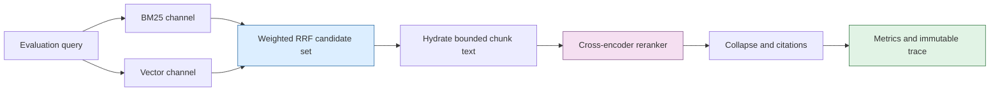
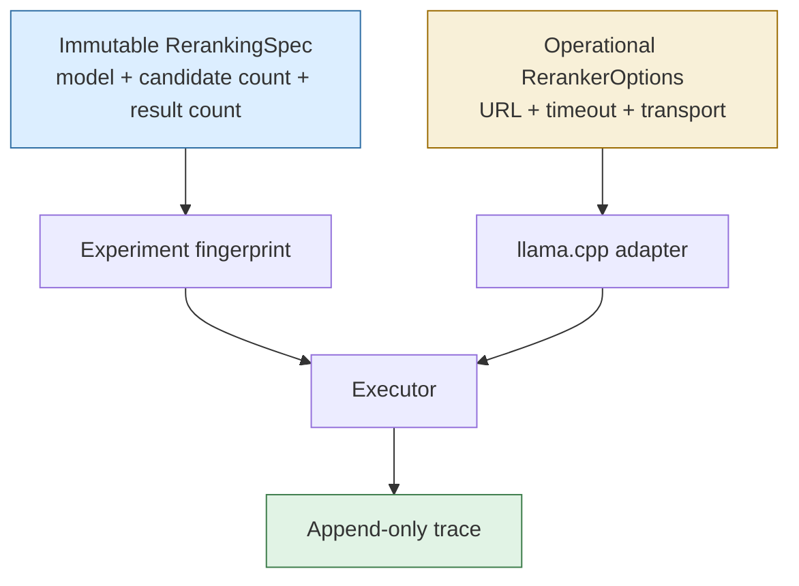

# Cross-Encoder Reranking: A Reproducible Stage for the TTC RAG Laboratory

The TTC RAG laboratory has a working candidate retriever. BM25 and vector search return chunks; weighted reciprocal-rank fusion combines their evidence; document collapse produces final results. The next question is narrower and more demanding: given a query and a bounded candidate set, can a cross encoder reorder those candidates more accurately than the retrieval score alone?

That question requires a dedicated subsystem. Reranking changes ranking semantics, introduces a model-serving dependency, adds latency, and requires per-candidate score evidence. It must be represented as a declared stage of an immutable experiment rather than as an unrecorded HTTP request after retrieval. This article explains the design established in `RAGEVAL-RERANK-001`, including the selected llama.cpp runtime, Go and JavaScript API shape, trace requirements, operational discipline, and evaluation plan.

> [!summary]
> - Reranking is a query–candidate scoring stage after retrieval, not a replacement for the corpus index or the embedding model.
> - The first runtime is llama.cpp’s native `/v1/rerank` API over a private SSH tunnel; Ollama remains the embedding runtime and is not used to emulate reranker scores.
> - A reranked run must persist the original candidate order, score order, model identity, candidate budget, truncation policy, and reranking latency.
> - The first comparison is controlled: raw vector, weighted RRF, weighted RRF plus BGE reranker, then a Qwen reranker comparison against the same TTC cards and immutable artifacts.

## What a cross encoder changes

Vector retrieval scores a query embedding against stored chunk embeddings. BM25 scores lexical terms. These methods are efficient because corpus work is performed before query time. A cross encoder instead evaluates the query and one candidate text together. It is appropriate only after an efficient retriever has reduced a large corpus to a bounded candidate window.

The distinction produces a two-stage ranking system:

```text
corpus and indexes -- query --> candidate retrieval (fast, broad)
candidate texts + query --> cross-encoder scoring (slower, precise)
cross-encoder order --> final collapse, citations, and evaluation
```

The cross encoder should not decide what text exists, which corpus is active, or which judgments define relevance. Those remain immutable inputs to the experiment. It only receives a query and candidates already selected by the retriever.



This position in the pipeline is deliberate. Reranking each channel independently would duplicate model calls and change how RRF combines evidence. Collapsing before reranking may remove relevant chunk-level context. The initial proposal is therefore to fuse first, rerank chunk candidates, then apply the final collapse policy. The ticket keeps that decision marked as proposed until duplicate and citation behavior are measured on TTC.

## Why llama.cpp is the selected first runtime

The Mac already has useful reranker artifacts: `qllama/bge-reranker-v2-m3:q4_k_m`, `dengcao/Qwen3-Reranker-4B:q4_k_m`, and `dengcao/Qwen3-Reranker-8B:q4_k_m`. Their presence in Ollama storage does not itself provide a reranking service contract. The laboratory needs a request containing a query and document list and a response with stable indices and scores.

llama.cpp’s HTTP server documents that contract. It exposes `POST /reranking`, with aliases `/rerank`, `/v1/rerank`, and `/v1/reranking`. It requires a reranker model and the server flags `--embedding --pooling rank --rerank`. The request includes `query`, `documents`, and optional `top_n`.

```bash
llama-server --model /path/to/bge-reranker-v2-m3-q4_k_m.gguf \
  --embedding --pooling rank --rerank --host 127.0.0.1 --port 8012

curl http://127.0.0.1:8012/v1/rerank \
  -H 'Content-Type: application/json' \
  -d '{"query":"TTC payroll adjustment", "documents":["candidate A", "candidate B"], "top_n":2}'
```

The endpoint documentation warns that the route may change. The first task is therefore an observed probe, not an adapter implementation. The probe must capture the exact installed server version, request body, response shape, index semantics, timing, and model identity under `RAGEVAL-RERANK-001/scripts/`. The Go client will then decode a recorded fixture rather than an assumed schema.

## The runtime boundary: model identity versus endpoint capability

The reranker design follows the existing query-embedding rule. A plan records a stable model identity and candidate policy. It does not record a hostname, SSH alias, access token, or local port. Those are operational capabilities supplied when a run starts.



This separation prevents a common reproducibility error. An endpoint can move from one tunnel port to another without changing the intended experiment. Conversely, changing from BGE reranker to Qwen reranker changes the experiment specification and therefore its fingerprint, even if both servers happen to listen on the same port.

The same private network discipline used for Ollama embeddings applies to llama.cpp. The server binds to the Mac loopback interface, and the workstation uses a dedicated tmux-managed SSH tunnel. Neither the server’s Mac hostname nor the local forwarded port becomes part of the stored experiment manifest.

## The Go contract: strict candidate identity and response validation

The proposed Go interface keeps the executor independent of HTTP and model-server details:

```go
type RerankCandidate struct {
    ID             string
    Text           string
    OriginalRank   int
    RetrievalScore float64
}

type Reranker interface {
    Rerank(ctx context.Context, request RerankRequest) ([]RerankResult, error)
    Identity() RerankerIdentity
}
```

The candidate identifier is an immutable chunk ID, not an array position. llama.cpp returns positions relative to the submitted `documents` array. The adapter must map each returned index back to the original candidate ID and reject invalid responses. The following conditions are errors, not recoverable ranking variations:

- An index is negative or outside the submitted candidate array.
- The response repeats an index or omits a required candidate when the contract requests all candidates.
- A score is NaN or infinite.
- The response has an unexpected count or cannot be decoded.
- The request exceeds the configured text or candidate budget.

```go
inputs := hydrateAndLimit(fusedCandidates, maxCandidateChars)
raw := llamaHTTP.Rerank(ctx, query, texts(inputs))
scores := validateAndMapIndices(raw, inputs)
ordered := stableSort(scores, byScoreDescending, byOriginalRank, byChunkID)
results := collapseAndTruncate(ordered, plan.Results)
```

No automatic fallback is permitted. If an experiment declares a reranker and the reranker fails, the run fails with a durable terminal summary. Falling back silently to the pre-rerank RRF order would create a trace whose declared policy does not match its observed behavior.

## Trace design: make the rank change inspectable

The current executor records channel hits, fused hits, final results, and timings. A reranking trace extends that structure; it must not overwrite the candidate evidence that explains retrieval.

```json
{
  "reranking": {
    "identity": {"kind":"llama.cpp", "model":"bge-reranker-v2-m3-q4_k_m"},
    "candidateCount": 50,
    "submittedCount": 50,
    "returnedCount": 50,
    "milliseconds": 420,
    "truncatedCandidateCount": 7,
    "items": [
      {"chunkId":"chunk:17", "originalRank":4, "score":0.817, "rerankedRank":1}
    ]
  }
}
```

The UI should display a compact before/after table: original RRF rank, cross-encoder score, reranked rank, final collapsed result, and candidate-text truncation indicator. A score without its original rank does not show what changed. A rank without model identity does not show what generated it. A final citation without a candidate trace does not explain why the cross encoder preferred it.

## Controlled evaluation: quality, latency, and cost are all outputs

The laboratory already has a 20-card fixed TTC evaluation set and baseline raw vector and weighted-RRF results. Reranking is evaluated against the same cards and the same base artifacts. This holds corpus variation, chunking variation, embedding variation, and judgment variation constant.

| Run | Retrieval policy | Reranker | Primary comparison |
| --- | --- | --- | --- |
| A | raw vector | none | establishes vector baseline |
| B | weighted RRF | none | establishes lexical/semantic fused baseline |
| C | weighted RRF | BGE v2 m3 | measures first cross-encoder effect |
| D | weighted RRF | Qwen3 reranker 4B or 8B | measures model-quality and latency trade-off |

For each run, record MRR, recall@10, per-card regressions, reranking milliseconds, total wall time, submitted candidate count, candidate character budget, model identity, and local cost scope. The system can state that no billed provider cost was incurred when using user-owned hardware; it should not fabricate an energy or amortization estimate.

The current weighted-RRF baseline has MRR `0.8201754385964911` and relevant recall@10 `0.8157894736842105`. A reranker should be judged against these values, but aggregate improvement is not sufficient. One card can improve while another loses its only relevant result. The trace review must examine both.

## Relationship to summaries and generated questions

The RAG builder already contains vocabulary for raw chunks, summaries, and questions, but the executor intentionally rejects materialized representations until a durable representation pipeline exists. This is a separate concern from reranking.

Generated summaries and questions require source hashes, prompt and model identity, parent mappings, materialized representation rows, representation embeddings, and citation hydration. The reranker ticket does not implement those data products. It assumes a candidate list with stable chunk identity and text. Keeping these workstreams separate makes each experiment interpretable: a reranking study changes ordering, while a representation study changes what was retrieved.

## Failure modes worth preserving in the design

Several implementation errors would make results misleading even if the HTTP request succeeds:

- **Reranking an unbounded candidate set.** Latency and model context grow with candidate count. The immutable plan must declare a candidate window.
- **Persisting only final results.** This hides whether a cross encoder improved rank or whether retrieval itself changed.
- **Treating returned indices as chunk IDs.** Server response positions refer to request order and must be mapped back to immutable candidates.
- **Collapsing without measurement.** Collapse before or after reranking changes duplicate handling and citation context; the choice must be tested, not assumed.
- **Using an endpoint as model identity.** Ports and tunnels are operational details. Model, candidate count, and text policy define the experiment.
- **Quiet fallback after transport failure.** This produces an invalid comparison and must fail the declared run.

## Implementation sequence

The ticket’s first three tasks are complete: map the existing executor and baseline, choose the llama.cpp boundary, and produce the detailed design and operator package. The next steps are intentionally ordered:

1. Probe the actual llama.cpp server with BGE v2 m3 and store raw evidence.
2. Add pure Go reranker contracts and validation tests.
3. Add the llama.cpp adapter with context cancellation and bounded payloads.
4. Extend immutable specifications and the JavaScript builder with `.rerank(...)`.
5. Insert reranking after RRF and record per-query rank/score traces.
6. Build the web inspector.
7. Run the controlled TTC matrix and decide the final collapse placement from evidence.

The first source of truth for that work is the `RAGEVAL-RERANK-001` ticket at
`/home/manuel/workspaces/2026-07-13/rag-eval-ttc/rag-evaluation-system/ttmp/2026/07/15/RAGEVAL-RERANK-001--reranking-stage-for-the-immutable-ttc-rag-laboratory/`,
including its implementation diary and reMarkable bundle. The external API
reference is the [llama.cpp HTTP server documentation](https://github.com/ggml-org/llama.cpp/blob/master/tools/server/README.md).
