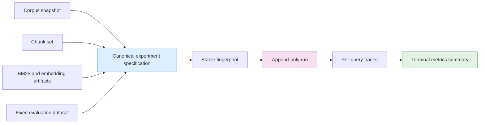
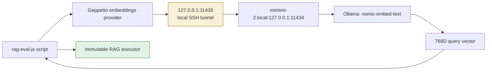
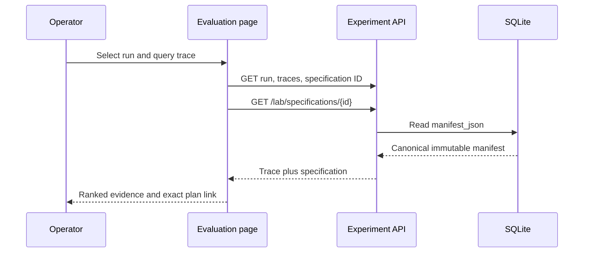

# Immutable TTC RAG Laboratory: From Fixed Truth to Executable JavaScript Experiments

The TTC RAG laboratory is now a runnable evaluation system rather than a collection of retrieval ideas. It accepts a fixed corpus snapshot, immutable chunk, BM25, embedding, and evaluation artifacts, composes a retrieval policy through a typed JavaScript builder, executes the resulting plan against real vectors and lexical indexes, and persists every result as an append-only observation. The system was validated through a live 20-query TTC run using JavaScript, Geppetto, and the private Mac-hosted Ollama embedding service.

This report describes the later integration phase of `/home/manuel/workspaces/2026-07-13/rag-eval-ttc/rag-evaluation-system`. Earlier vault articles cover fixed-truth authoring and transcript-RAG representation experiments. This article explains how the TTC work turned those principles into a concrete laboratory with stable experiment identity, a Go-backed fluent JavaScript API, durable traces, a web inspection surface, and a measured hybrid baseline.

> [!summary]
> - An experiment is a canonical specification over immutable inputs and retrieval policy. A run is a separate append-only execution observation.
> - `require("rag")` is a typed Go-backed JavaScript DSL. It authors plans, validates artifact lineage, persists specifications, starts runs, and executes retrieval only when an explicit query embedder is supplied.
> - The first live JavaScript run used `nomic-embed-text` at 768 dimensions through Geppetto and achieved MRR `0.8202` and relevant recall@10 `0.8158` across 20 TTC cards.
> - The web UI now links an inspected trace directly to the exact immutable manifest that produced it.

## The problem: retrieval experiments must be comparable

A retrieval result is not sufficient evidence by itself. It becomes useful only when a reader can answer four questions precisely: what corpus was searched, how it was transformed, what policy produced the ranking, and what relevance definition was used to evaluate it. If any of these are selected through a mutable “latest” pointer, a future result can look comparable while referring to different inputs.

The laboratory therefore treats a retrieval experiment as a value. Its input identifiers name a corpus snapshot, a chunk set, optionally a BM25 artifact and embedding set, and a fixed evaluation dataset. Its policy names channels, fusion, collapse, result count, and metrics. The value is serialized canonically and fingerprinted. Repeating the same specification does not overwrite its history; it creates another run with a distinct run identifier.



This distinction is central. A specification answers, “what was intended?” A run answers, “what happened on this execution?” Latency, tunnel availability, and provider state can vary between runs. The retrieval policy and input lineage must not.

## The laboratory’s data model

The public specification is implemented in `pkg/raglab/types.go`. It has four conceptual sections:

| Section | Contents | Purpose |
| --- | --- | --- |
| Provenance | fragments, notes, tags | Records author intent without changing runtime capability. |
| Inputs | snapshot, chunks, indexes, evaluation dataset, representations | Names the immutable data lineage. |
| Retrieval | channels, filters, RRF, collapse, result count | States how candidate results become a rank order. |
| Metrics | relevance threshold and cutoffs | States how the ranked output is judged. |

The current executable path supports raw chunk representations. The type system already names summary and question representations, but the executor deliberately rejects them until a durable representation materialization and parent-mapping layer exists. That is an important constraint: the API can state future intent without pretending that generated text is already an executable, citable artifact.

The canonical plan used for the live hybrid run can be described in compact form:

```text
lexical channel: BM25(raw chunks), topK 50
semantic channel: vector(raw chunks), topK 50
fusion: weighted RRF, rank constant 60, semantic weight 2
collapse: document
final result count: 10
relevance threshold: 2_SUBSTANTIAL
metrics: recall@10 and MRR
```

The relevance threshold is named rather than represented only as an integer. `2_SUBSTANTIAL` means a document materially answers the information need, while `3_AUTHORITATIVE` denotes the best direct evidence. This makes a metric interpretation visible in source, generated JSON, and UI output.

## Retrieval execution: candidates, fusion, evidence, and metrics

The executor in `pkg/raglab/executor.go` performs one evaluation card at a time. A lexical channel passes the query text to the persisted BM25 artifact. A vector channel obtains one query vector through an explicit `QueryEmbedder`, then searches the immutable embedding set. The query vector is generated once and reused across vector channels in the same card.

Multiple channels are fused with weighted reciprocal-rank fusion. The ranking contribution is based on channel rank rather than incomparable raw BM25 and vector score scales:

```text
weightedRRF(document) = Σ channelWeight / (rankConstant + rankInChannel)
```

The executor records channel hits and fused hits before producing the final result list. When document collapse is selected, multiple chunks from the same document cannot consume multiple final positions. Relevance calculation then compares final document revision IDs with the frozen judgment card.

```go
for _, card := range cards {
    channels := retrieveEachConfiguredChannel(card.Query)
    candidates := fuseWeightedRRF(channels, rankConstant, weights)
    results := collapseAndTruncate(candidates, plan.Results)
    metrics := compareWithFrozenJudgments(results, card)
    persistImmutableTrace(runID, card.ID, channels, candidates, results, metrics)
}
completeRunWithAggregateMetrics(runID)
```

The trace is intentionally richer than the summary. A summary reports aggregate MRR and recall. A trace shows a particular query, the hits contributed by each channel, the fused ordering, the final results, and timings. This separation makes it possible to diagnose whether an aggregate improvement came from semantic retrieval, lexical retrieval, fusion weights, or a small subset of cards.

## Why JavaScript is used for authoring rather than for persistence

The generated `rag-eval-js` binary exposes `require("rag")`. JavaScript is the concise language for composing an experiment, but it is not the authority for experiment semantics. The builders are Go objects adapted into Goja. Each lambda configures a typed Go builder, and `toSpec()` produces canonical JSON rather than serializing executable JavaScript.

```javascript
const experiment = rag.experiment("ttc-js-geppetto-weighted-rrf-v1", (e) => e
  .corpus(snapshotID)
  .chunks(chunkSetID)
  .bm25(bm25ID)
  .embeddings(embeddingSetID)
  .evaluation("candidate:ttc-baseline-v1")
  .retrieval((r) => r
    .channel("lexical", (c) => c.bm25().topK(50))
    .channel("semantic", (c) => c.vector().topK(50))
    .fuse((f) => f.rrf().rankConstant(60).weight("semantic", 2))
    .collapse("document")
    .results(10))
  .metrics((m) => m.relevanceAt(rag.grade("2_SUBSTANTIAL")).recallAt([10]).mrr()));
```

The Go side validates that every selected artifact is compatible with the same lineage. It also validates retrieval structure and metric requirements. A plan can be authored and inspected without opening a database. Persisting or executing requires `execution: "allowRuns"`; read-only use is explicit.

The strict boundary is the query embedder. An embedding set identifies stored corpus vectors. It does not grant a capability to create a new query vector, and it does not reveal a provider endpoint or credentials. Vector execution therefore requires a synchronous callback at `rag.open()`:

```javascript
const settings = gp.inferenceProfiles.load(profilePath).resolve("ttc-mimimi-nomic-embed");
const embedder = gp.embeddings(settings);
const lab = rag.open({
  database: "data/rag-eval.db",
  execution: "allowRuns",
  queryEmbed: (query) => embedder.embed(query),
});
```

This design keeps the experiment portable and auditable. The immutable plan says which vector artifact was searched. The operational profile says how the current process can embed a query. The two may be reviewed independently.

## The Mac embedding path and its operational boundary

The live TTC experiment used the Mac host `mimimi-2.local`. Ollama remains bound to the Mac’s loopback interface on port 11434. The workstation creates an SSH tunnel bound only to `127.0.0.1:11435`. Geppetto uses that local URL in a profile that is separate from the experiment specification.



The tunnel is an operator concern, not a hidden application default. The ticket playbook records the health check, tmux lifecycle, expected model identity, and 768-dimensional assertion. This matters because a vector query against a different model or dimension is not a fair execution of the existing embedding artifact.

The completed JavaScript run created `run_20b25df32dc874af1265a9e6ccf87570`. Its durable summary records 20 query traces, 19 answerable queries, MRR `0.8201754385964911`, relevant recall at result count `0.8157894736842105`, and approximately 14 seconds wall-clock execution. The result matches the prior Go-driven weighted-RRF observation, which is evidence that the JavaScript adapter preserved retrieval semantics rather than creating a second implementation.

## Inspection is part of the experiment contract

An evaluation interface must expose more than the latest score. The Evaluation page now obtains an experiment specification through `/api/v1/lab/specifications/{id}`. An inspected trace displays the specification identifier and links to the canonical stored manifest.



This is a practical safeguard against false comparisons. If two run summaries differ, the operator can inspect whether they used different input artifacts, different RRF weights, different collapse scopes, or different metric thresholds before drawing any conclusion about model quality.

## Validation, limitations, and next work

The delivery was tested through focused service/API tests, the full standalone Go suite, Go build, xgoja doctor, declaration generation, generated binary build, the plan-only JavaScript example, TypeScript checking, production web build, and the live Geppetto/Ollama experiment. The repository’s pinned `golangci-lint` could not run because it was built with Go 1.25 while the project targets Go 1.26.5; the code and test checks passed, and that environment limitation was recorded in the implementation diary.

The present baseline has deliberate limits:

- Raw chunks are executable; summaries and questions are declarative only until they are materialized as immutable artifacts with parent mappings and embeddings.
- The generated declaration sidecar covers `rag`; strict whole-runtime declarations remain blocked on a Geppetto provider descriptor.
- The 20-card TTC dataset is a useful fixed evaluation set, not evidence that one retrieval policy will dominate every future corpus.

The immediate next stage is cross-encoder reranking. It is not being inserted as an opaque model call. The new reranker ticket defines a separate runtime contract, trace schema, experiment identity, operator workflow, and comparison matrix. The laboratory is now sufficiently structured to measure that addition rather than merely demonstrate it.

## Key files and durable records

- `/home/manuel/workspaces/2026-07-13/rag-eval-ttc/rag-evaluation-system/pkg/raglab/executor.go` — retrieval execution, RRF, trace construction, and metrics.
- `/home/manuel/workspaces/2026-07-13/rag-eval-ttc/rag-evaluation-system/pkg/gojamodules/rag/module.go` — the Goja-native `require("rag")` API and explicit query-embedder boundary.
- `/home/manuel/workspaces/2026-07-13/rag-eval-ttc/rag-evaluation-system/cmd/rag-eval/doc/01-rag-laboratory-javascript.md` — embedded operator tutorial.
- `/home/manuel/workspaces/2026-07-13/rag-eval-ttc/rag-evaluation-system/ttmp/2026/07/14/RAGEVAL-RAG-DSL-001--typed-fluent-javascript-rag-laboratory-module/` — design, diary, scripts, and tunnel playbook.
- [[ARTICLE - RAG Evaluation - Building and Validating an Initial Fixed-Truth Dataset]] — fixed-truth dataset foundation.
