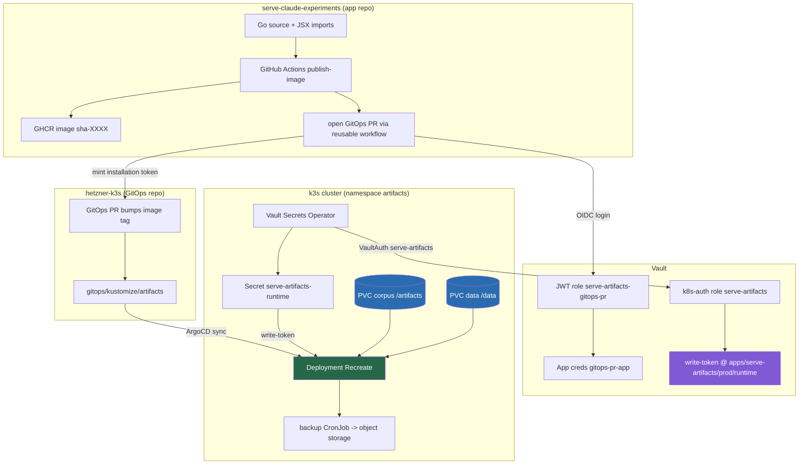
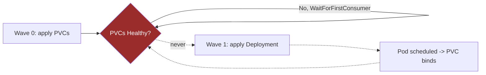
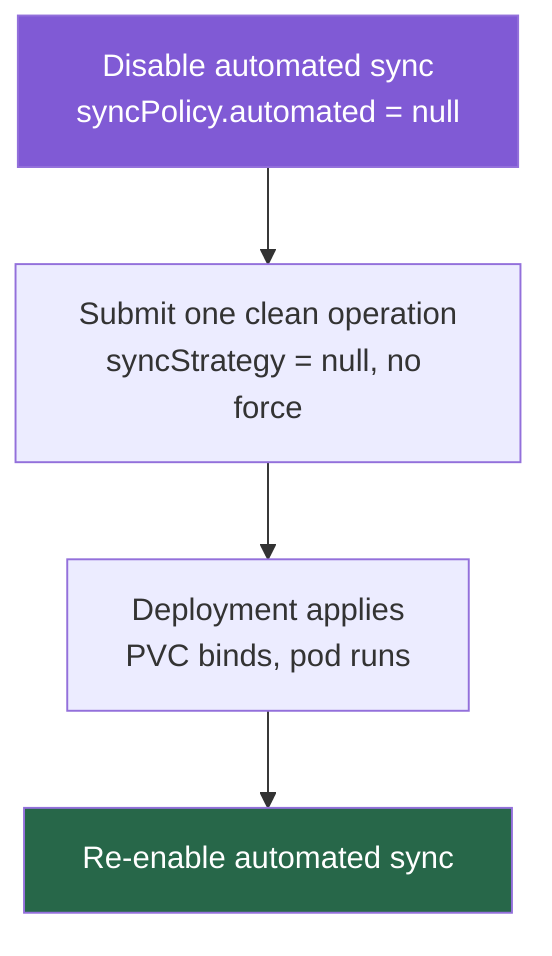

# Serve Artifacts Stateful Migration to K3s

This note records the migration of the `artifacts` application (the Claude artifact gallery at `https://artifacts.yolo.scapegoat.dev`) from a stateless deployment to a stateful one, and the two infrastructure problems that dominated the work. The migration adds two `local-path` persistent volumes, a Vault-synchronised write token, an off-node backup job, and a GitHub-App-based GitOps pull-request credential. The original stateless deployment is described in [[PROJ - Serve Artifacts - Deploying to K3s with GitOps]]; that note is now partially superseded by this one.

> [!summary]
> 1. The application gained persistent state (a corpus volume and a SQLite volume), a write API guarded by a Vault-synced token, and off-node backups; the delivery credential moved to the GitHub-App-via-Vault flow.
> 2. Two infrastructure problems consumed most of the effort: a **sync-wave deadlock** between `WaitForFirstConsumer` PVCs and their consumer Deployment, and a self-inflicted **`--force` + `ServerSideApply` operation loop** in ArgoCD.
> 3. End state at time of writing: the stateful infrastructure is deployed, healthy, and seeded, but it is still running the **old application image**. Shipping the new application code requires merging the application PR, which is the single remaining step.

## Why this migration exists

The stateless deployment served a read-only gallery baked into the container image. Two capabilities required durable state on the cluster:

- A **write API** (`POST /api/artifacts`, `PUT/PATCH /api/manifest/...`) and a matching Glazed CLI, which mutate a corpus of artifact files. These writes must persist across pod restarts and image rollouts.
- **User data** (favorites, tags, collections) stored in a SQLite database (`userdata.db`), which must likewise survive restarts.

The write API and CLI are documented under ticket `SERVE-20260714-ARTIFACTAPI`; this migration (`SERVE-20260714-DEPLOY`) is the infrastructure that makes them durable in production.

## Current project status

- **Deployed and healthy:** two PVCs (`serve-artifacts-corpus`, `serve-artifacts-data`), the stateful Deployment (`strategy: Recreate`), the Vault-synced runtime secret, the ServiceAccount, and the backup CronJob. ArgoCD reports `Synced / Healthy`.
- **Seeded:** the corpus was streamed into `/artifacts`; `/data/userdata.db` is left to be created fresh. `GET /search-index.json` returns a populated index.
- **Running the old image:** the deployed tag is `ghcr.io/wesen/2026-03-29--serve-claude-experiments:sha-c2f7237`, which predates the artifact API. `GET /api/artifacts` returns `404` on the live site because that route only exists on the unmerged application branch.
- **Remaining step:** merge the application PR (`support-modern-claude-artifacts`) to build and roll the new image. See [Near-term next steps](#near-term-next-steps).

## Architecture



The delivery path (image build, GitHub-App token, GitOps PR, ArgoCD reconcile) reuses the platform pattern documented in [[ARTICLE - GitHub App Tokens for GitOps PR Automation]] and researched in [[ARTICLE - Research - Vault OIDC and Short-Lived GitHub App Tokens for GitOps PR Automation]]. The cluster and ArgoCD conventions are described in [[ARTICLE - Hetzner K3s GitOps Platform Deep Dive]].

## Implementation details

### The persistent state model

Two `local-path` ReadWriteOnce PVCs hold the durable data:

- `serve-artifacts-corpus` (`/artifacts`) — the artifact files served by the gallery and mutated by the write API.
- `serve-artifacts-data` (`/data`) — `userdata.db` (favorites, tags, collections) and the regenerable thumbnail cache.

Because both claims are RWO and `local-path` volumes are node-local, the Deployment uses `strategy: Recreate`: the old pod must release the volume before the new pod mounts it. A `RollingUpdate` would deadlock on the claim. The `local-path` provisioner pins the pod to the volume's node through the PV's `nodeAffinity`, which is acceptable on a single-node cluster and is also what makes off-node backups possible: the backup CronJob co-locates onto the same node and mounts the volumes read-only (RWO is enforced per node, not per pod).

### The Vault-synchronised write token

The write API authenticates callers with a bearer token compared in constant time. The token value lives in Vault at `kv/apps/serve-artifacts/prod/runtime` under the key `write-token`. The Vault Secrets Operator projects it into a Kubernetes Secret:

```
VaultConnection  -> vault.vault.svc.cluster.local:8200
VaultAuth        -> kubernetes auth, role "serve-artifacts"
VaultStaticSecret serve-artifacts-runtime
    mount: kv (kv-v2), path: apps/serve-artifacts/prod/runtime
    -> Secret serve-artifacts-runtime { write-token }
Deployment env SERVE_ARTIFACTS_WRITE_TOKEN <- secretKeyRef(serve-artifacts-runtime, write-token)
```

The `serve-artifacts` Kubernetes-auth role and its read policy are declared in the GitOps repo at `vault/roles/kubernetes/serve-artifacts.json` and `vault/policies/kubernetes/serve-artifacts.hcl`, and reconciled by `scripts/bootstrap-vault-kubernetes-auth.sh`. The token *value* (a secret) is seeded out-of-band by the deploy ticket's `scripts/00-bootstrap-vault.sh`, which also creates the runtime policy and binds the k8s-auth role. Keeping the role and policy declarative in the repo, and only the secret value out-of-band, was itself a review finding: the original manifest referenced a role that no bootstrap file created.

### The GitHub-App GitOps-PR credential

The application's `publish-image.yaml` calls the shared reusable workflow with `gitops_pr_token_source: github_app`. On a push to `main`, the workflow authenticates to Vault with GitHub OIDC, reads the App credentials from `kv/ci/github/serve-artifacts/gitops-pr-app`, and mints a short-lived installation token to open the image-bump PR. The Vault JWT role and policy are codified in Terraform (`vault/github-actions/envs/k3s/main.tf`, entry `serve-artifacts-gitops-pr`). The App itself is the shared `wesen-gitops-pr-bot` (App ID `3926776`), already installed on the GitOps repository; its credentials were copied into the serve-artifacts Vault path rather than minting a new App. This entire flow is the subject of [[ARTICLE - GitHub App Tokens for GitOps PR Automation]]; the serve-artifacts role is the first App-based `gitops_pr_roles` entry codified in Terraform (the earlier `retro-obsidian-publish` migration was applied to live Vault by script and never committed).

## Problem A: the sync-wave deadlock

`local-path`'s `VolumeBindingMode` is `WaitForFirstConsumer`. A PVC created under this mode stays `Pending` — not `Bound`, and therefore not `Healthy` in ArgoCD's model — until a pod that mounts it is scheduled. The scheduling of that consumer pod is precisely what triggers binding.

The first version of the manifests annotated the PVCs with `argocd.argoproj.io/sync-wave: "0"` and the Deployment with `sync-wave: "1"`. ArgoCD applies one wave, waits for that wave to become healthy, and only then applies the next wave. The result was a circular wait:



ArgoCD waited for the PVCs to bind before creating their only consumer, and the PVCs could not bind without that consumer. The operation sat in `Running` with the message `waiting for healthy state of PersistentVolumeClaim/serve-artifacts-corpus`. The old stateless pod kept serving throughout, so there was no outage.

**Resolution.** The fix is to place the PVCs and their consumer Deployment in the **same** sync-wave, so ArgoCD applies them together in one wave; the Deployment's pod is then the first consumer and binds the volumes. The Deployment was moved to `sync-wave: "0"`. This matches the working pattern already in the repository at `gitops/kustomize/coinvault/`, where the PVC and Deployment share `sync-wave: "1"`. The runtime secret remains in an earlier wave (`-1`) so the required `secretKeyRef` is satisfied before the pod starts.

**Rule.** A `WaitForFirstConsumer` PVC must never be gated in an earlier sync-wave than the workload that mounts it. Co-locate them in one wave, or the workload deadlocks on a volume that cannot bind.

## Problem B: the `--force` + ServerSideApply operation loop (self-inflicted)

While attempting to accelerate the stuck sync, a manual sync was triggered through the Application CRD with `syncStrategy.apply.force: true`. The application's `syncOptions` already include `ServerSideApply=true`, and ArgoCD translates these into mutually exclusive `kubectl` flags:

```
one or more objects failed to apply, reason:
error validating options: --force cannot be used with --server-side
```

The failure did not stay contained to that one operation. ArgoCD's `selfHeal` retries the previous operation, and it carried the `syncStrategy` (including `force`) forward into each retry. Every subsequent operation — even ones submitted manually with `syncStrategy: null` — came back carrying `force: true`, confirmed by inspecting `.status.operationState.operation.sync.syncStrategy`. The application's `spec.syncPolicy` was clean the entire time; the force flag lived only in the operation history and was copied forward by the automated controller.

Two secondary mistakes compounded the diagnosis:

- `kubectl patch --type=merge` is a JSON merge patch. Submitting a new `.operation.sync` object without a `syncStrategy` key **merged** into the leftover object and preserved the old `force`. Only an explicit `"syncStrategy": null` (merge-patch deletion) or a fully fresh `.operation` removes it.
- Attempts to terminate the running operation via `kubectl patch --subresource=status` returned a confusing `NotFound`, and a JSON-patch removal of `/operation` was rejected as invalid, which slowed the recovery.

**Resolution.** The reliable recovery is to break the selfHeal reuse:



With `automated` disabled, the next operation was not overwritten by a selfHeal retry, so a force-free sync finally ran. It applied the Deployment alongside the PVCs (now same-wave from Problem A), the pod scheduled, both PVCs moved `Pending -> Bound`, and the operation succeeded with `force=false`. Automated sync was then re-enabled; because the last successful operation no longer carried `force`, the loop did not recur.

**Rule.** Never combine `--force` with `ServerSideApply`. When an ArgoCD operation wedges on a bad `syncStrategy`, the operation is sticky under `selfHeal`; disable `automated`, run one clean operation, then re-enable `automated`. Prefer the ArgoCD UI "Sync" (leave "Force" unchecked) over hand-editing the Application CRD.

## Seeding the volumes

Seeding runs with `automated` paused so `selfHeal` does not revert the replica count mid-operation. The deploy ticket's `scripts/01-seed-pvcs.sh` scales the Deployment to zero to release the RWO volumes, launches an Alpine maintenance pod that mounts both PVCs, streams the corpus in over `kubectl exec`, and scales the Deployment back to one:

```bash
kubectl -n artifacts scale deploy/serve-artifacts --replicas=0
kubectl -n artifacts apply -f <maintenance pod mounting both PVCs>
tar -C "$CORPUS_DIR" --exclude=conversation.json -cf - . \
  | kubectl -n artifacts exec -i serve-artifacts-seed -- tar -C /artifacts -xf -
kubectl -n artifacts delete pod/serve-artifacts-seed
kubectl -n artifacts scale deploy/serve-artifacts --replicas=1
```

Verification is by the live index rather than an in-pod shell: the application image is distroless and has no `sh`, so `kubectl exec ... -- sh` fails. `GET /search-index.json` returning a populated index is the correct check.

## Verification

- ArgoCD application `artifacts`: `Synced / Healthy`, `automated` re-enabled.
- PVCs `serve-artifacts-corpus` and `serve-artifacts-data`: `Bound`.
- Kubernetes Secret `serve-artifacts-runtime` present with key `write-token`; VaultStaticSecret `Ready`.
- Live site: `HTTP 200`, `<title>Claude Artifact Server</title>`, populated `search-index.json`.
- Confirmed still on the old image: `GET /api/artifacts` returns `404` (route absent from `sha-c2f7237`).

## Open questions

- Should the runtime `serve-artifacts` k8s-auth policy and role be moved entirely into the Terraform Vault source of truth, alongside the GitOps-PR role, rather than split between Terraform, the GitOps repo's declarative files, and the imperative bootstrap script?
- Should the backup CronJob be exercised once manually (or its schedule shortened for a first run) to prove the `sqlite3 .backup` plus `aws s3 cp` path end-to-end before relying on it?
- Is single-node `nodeAffinity` pinning acceptable long-term, or should the corpus move to an RWX or object-backed store if the cluster grows beyond one node?

## Near-term next steps

1. **Merge the application PR** `support-modern-claude-artifacts` (PR #1 on `wesen/2026-03-29--serve-claude-experiments`). This is the only remaining step to ship the new application code. On merge, `publish-image.yaml` builds a new image, mints a GitHub-App installation token through Vault, and opens an image-bump GitOps PR against `hetzner-k3s`.
2. **Merge the resulting GitOps image-bump PR** and confirm ArgoCD rolls the new tag. The corpus and `userdata.db` persist across the image change because they live in the PVCs.
3. **Verify the new application surface** is live: `GET /api/artifacts` should return `{total,results,facets}` instead of `404`, and a `POST /api/artifacts` with the write token should succeed.
4. **Prove the backup path** once, then leave it on schedule.

## Important project docs

- Deploy ticket (design guide, diary, scripts): `2026-03-29--serve-claude-experiments/ttmp/2026/07/14/SERVE-20260714-DEPLOY--.../` (`00-bootstrap-vault.sh`, `01-seed-pvcs.sh`, `02-restore.sh`, `03-bootstrap-gitops-pr-app.sh`).
- API + CLI ticket: `.../ttmp/2026/07/14/SERVE-20260714-ARTIFACTAPI--...`.
- GitOps manifests: `2026-03-27--hetzner-k3s/gitops/kustomize/artifacts/`; declarative Vault config: `vault/{roles,policies}/kubernetes/serve-artifacts.*`.
- Pull requests: hetzner-k3s **#158** (stateful manifests), **#159** (sync-wave fix); terraform **#9** (Vault GitOps-PR role); serve-artifacts **#1** (application — not yet merged).
- Operator handoff note produced during the incident: `/tmp/serve-artifacts-argocd-handoff.md`.

## Related notes

- [[PROJ - Serve Artifacts - Deploying to K3s with GitOps]] — the original stateless deployment of this same application; partially superseded by this note (see the deprecation callout there).
- [[ARTICLE - GitHub App Tokens for GitOps PR Automation]] — the GitOps-PR credential flow reused here.
- [[ARTICLE - Research - Vault OIDC and Short-Lived GitHub App Tokens for GitOps PR Automation]] — the research behind that flow.
- [[ARTICLE - Hetzner K3s GitOps Platform Deep Dive]] — the platform this app runs on.
- [[PROJ - Hetzner K3s Platform — ArgoCD Reorganization and Cleanup]] — ArgoCD conventions and the `coinvault` PVC sync-wave reference used to fix Problem A.

## Project working rule

Persistent-volume workloads on this platform have two non-obvious traps that this migration hit in sequence: a `WaitForFirstConsumer` PVC must share a sync-wave with its consumer, and an ArgoCD sync must never mix `--force` with `ServerSideApply`. Reach for the ArgoCD UI's plain "Sync" before hand-editing the Application CRD, and when an operation wedges, disable `automated`, run one clean sync, and re-enable `automated`.
