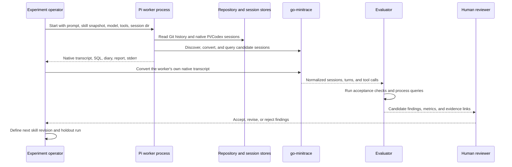
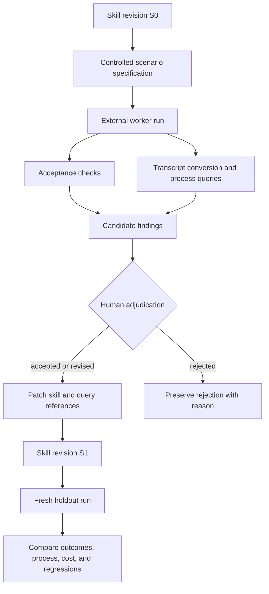

# External Agent Validation Loops: Isolated Skill Experiments, Transcript Evidence, and Researchctl Integration

A coding-agent skill is an executable intervention. It changes which commands an agent chooses, which evidence it treats as sufficient, how it handles failures, and what it reports. Reviewing the skill text is therefore necessary but incomplete. The stronger test is to launch a fresh external agent with a controlled prompt and restricted context, preserve the complete run, evaluate its behavior from the transcript, and use the observed failures to define the next skill revision.

This report presents that process as a reproducible engineering method. It documents a concrete experiment in which a fresh Pi worker running `umans-glm-5.2` had to identify which historical Pi or Codex session implemented recent RAG evaluation work. The worker succeeded, but its transcript exposed stale skill instructions, an undocumented Codex conversion collision, an imprecise commit-count query, delayed diary updates, and unnecessary event-stream volume. Those findings could not have been obtained reliably from static review alone.

The concrete run also supplies a first fixture for the proposed cross-purpose laboratory in [[researchctl]]. It shows how an external agent run can be represented as an immutable specification, a distinct execution, a set of hashed artifacts, objective acceptance results, candidate evaluator findings, and human adjudications. That representation supports repeated skill experiments without allowing the evaluator or the current skill author to rewrite earlier evidence.

> [!summary]
> - A fresh external agent should run in a separate process with an explicit model, provider extension, prompt, skill snapshot, tool allowlist, working directory, and session directory. The saved native transcript is the primary behavioral artifact.
> - Evaluation has two layers: deterministic acceptance checks establish whether the task was completed, while transcript analysis explains how it was completed and identifies candidate workflow defects.
> - Baseline, skill, and skill-plus-diary runs are distinct experimental arms. A diary is an intervention because it changes agent behavior; it is not neutral instrumentation.
> - The July 15 run correctly identified Codex session `019f4805-c991-70b3-ae0d-855c389d79d7` as the RAG implementer and exposed concrete defects in the current go-minitrace skill. The next step is to preserve the run as a regression fixture, patch the skill, and rerun a fresh worker on a holdout scenario.

## 1. Why skill improvement requires external execution

A skill file describes a preferred procedure, but the procedure is not the outcome. An agent may ignore part of the skill, interpret an instruction differently than its author intended, recover from an undocumented tool behavior, or produce a correct answer through an inefficient path. Conversely, a skill may look coherent during review while containing stale command flags that fail when a new agent follows them exactly.

Testing a skill inside the same conversation that authored it introduces several confounders. The current agent already knows the expected answer, remembers why each instruction was written, and has access to context that a future worker will not receive. It may silently correct stale instructions from memory. It may choose evidence that confirms the intended result. Even when the response is correct, the run does not establish that the skill is independently usable.

An external validation run removes most of that hidden assistance. The worker receives only the task, the selected skill, the allowed tools, and the environment needed to execute the task. Its session is preserved and evaluated afterward by another process. The experiment does not attempt to make the model deterministic. It makes the inputs, outputs, and evaluation boundary explicit enough that repeated runs can be compared.

The unit of evaluation is not merely the final answer. It is the complete relationship among:

- the scenario and its hidden or independently verifiable answer;
- the exact prompt given to the worker;
- the skill revision and other contextual interventions;
- the model, provider, thinking level, tools, and environment;
- the native transcript and produced artifacts;
- deterministic acceptance results;
- transcript-derived process metrics;
- evaluator findings and human adjudications.

This distinction matters because a correct final answer can still reveal a defective skill. The July 15 worker found the correct implementation session, but it performed unnecessary staging because the skill described obsolete Codex flags. It also produced an inflated “38 git commits” intermediate metric because the saved query matched text occurrences rather than verified Git objects. Outcome correctness did not eliminate the process defects; the transcript made both visible.

## 2. The experiment model

A controlled coding-agent experiment needs a small, stable vocabulary.

| Term | Meaning |
| --- | --- |
| **Scenario** | The task, fixtures, expected properties, allowed resources, and evaluation rules. |
| **Specification** | The canonical combination of scenario, agent configuration, intervention arm, environment, and metric definitions. |
| **Arm** | One controlled intervention, such as baseline, skill, or skill-plus-diary. |
| **Run** | One execution attempt of one specification. Repeating a specification creates a new run ID. |
| **Artifact** | A preserved input or output such as the prompt, skill snapshot, transcript, SQL, report, stderr, or acceptance result. |
| **Acceptance check** | A deterministic test of a required outcome or invariant. |
| **Evaluator** | A process that derives process metrics and candidate findings from preserved artifacts. |
| **Adjudication** | A human decision that accepts, revises, or rejects an evaluator finding. |

The distinction between a specification and a run is essential. A specification states what should remain constant: model, prompt, skill revision, fixture, allowed tools, and evaluation contract. A run records one actual execution, including timestamps, retries, environment failures, output files, and transcript behavior. Two runs of the same specification are not interchangeable, especially when the agent is stochastic or the environment contains mutable repositories.

A useful first experiment matrix contains three arms:

| Arm | Prompt | Skill | Diary requirement | Purpose |
| --- | --- | --- | --- | --- |
| Baseline | Same task | None | None | Measures what the model does without the skill. |
| Skill | Same task | Exact skill snapshot | None | Measures the skill's direct contribution. |
| Skill plus diary | Same task | Exact skill snapshot | Required checkpoints | Measures the combined intervention and the diary's behavioral cost or benefit. |

The prompt, fixtures, model, provider, thinking level, tool allowlist, timeout, repository state, and acceptance rules must remain constant across these arms. The diary arm is not equivalent to adding logging. It adds tool calls, introduces checkpoint obligations, and can change the agent's planning and recovery. It therefore belongs in the specification as an explicit factor.

## 3. The concrete July 15 scenario

The experiment asked a fresh worker to determine which recent coding-agent session performed the recent work in:

```text
/home/manuel/workspaces/2026-07-13/rag-eval-ttc/rag-evaluation-system
```

The task was suitable for a skill validation run because the correct answer could not be established from one metadata field. The implementation session was a long-lived Codex session originally launched on July 9 from a different repository. A later Codex auto-review session contained many references to the implementation because it had been given the implementation transcript. A Pi investigation session read the same RAG files after the work was complete. Cwd and keyword counts therefore produced plausible but incorrect candidates.

The prompt required the worker to inspect Git history first, search both Pi and Codex native stores, use go-minitrace for substantive conversion and SQLite analysis, save every custom query, maintain an append-only diary, and distinguish implementer, reviewer, and investigator roles. It explicitly prohibited attribution from cwd or mentions alone.

The acceptance target was independently verifiable:

- The implementation session was Codex session `019f4805-c991-70b3-ae0d-855c389d79d7`.
- Its source was `/home/manuel/.codex/sessions/2026/07/09/rollout-2026-07-09T13-56-06-019f4805-c991-70b3-ae0d-855c389d79d7.jsonl`.
- The relevant RAG work occurred late in the long-lived session, not in its original prompt context.
- Repository commits and untracked files could be matched to exact transcript operations.
- Codex session `019f5e08-100c-7bf1-93df-c003cbc25b91` was a review session, not the implementer.
- Pi session `019f65bf-9627-7e26-a849-a419a1f86134` was an investigation session, not the implementer.

The worker did not receive these answers. It received only the repository path, current date, evidence requirements, constraints, artifact locations, and the `go-minitrace-transcript-analysis` skill.

## 4. Process isolation in Pi

The successful run used Pi as the process host and loaded the Umans provider explicitly. Isolation was established through several independent controls.

### 4.1 Context isolation

The worker did not inherit the parent conversation. Project context files and unrelated skills were disabled. Only the selected transcript-analysis skill was loaded:

```text
/home/manuel/.pi/agent/skills/go-minitrace-transcript-analysis/SKILL.md
```

This prevented the worker from learning the expected session ID from the conversation that designed the experiment. It also made the skill itself observable: if the worker used an obsolete instruction, the evaluator could attribute the instruction to the skill snapshot rather than to unrelated context.

### 4.2 Tool isolation

The worker received only `read`, `bash`, and `write`. These tools were sufficient to inspect repositories, invoke go-minitrace, save SQL, and write reports. Browser tools, editing tools, MCP services, and unrelated extensions were absent. The tool set reduced the number of uncontrolled capabilities without blocking the intended task.

### 4.3 Provider and model isolation

The Umans provider is supplied by a Pi extension, so disabling all extensions also disables the provider. The final configuration disabled automatic extension loading and re-enabled only the required provider extension:

```bash
--no-extensions \
--extension /home/manuel/.pi/agent/npm/node_modules/pi-provider-umans/index.ts
```

Model selection used separate provider and model arguments:

```bash
--provider umans \
--model umans-glm-5.2 \
--thinking high
```

This was more reliable than a guessed provider-qualified model string. Two failed launches established the requirement. The first used an unrecognized composite model ID and failed with:

```text
Error: Model "umans/umans-glm-5.2" not found. Use --list-models to see available models.
```

The second disabled extensions without explicitly loading the provider and failed with:

```text
Error: Unknown provider "umans". Use --list-models to see available providers/models.
```

Neither failed launch created a worker session. Their stderr files were retained as harness evidence.

### 4.4 Filesystem and session isolation

The run used `/tmp/pi-subagent-rag-session-eval` as its working root. Pi wrote the native session into a dedicated session directory instead of the normal global session store. This made the worker transcript directly attributable and prevented candidate discovery from confusing the experiment transcript with older sessions.

The important paths were:

```text
/tmp/pi-subagent-rag-session-eval/
├── prompt.md
├── sessions/
│   └── 2026-07-15T13-49-32-594Z_019f660a-...jsonl
├── diary.md
├── report.md
├── queries/
├── analysis/
├── meta-queries/
├── meta-results/
├── evaluation.md
├── launch-attempt-1.stderr.log
├── launch-attempt-2.stderr.log
├── pi.stderr.log
└── events.jsonl
```

The source repositories and native Pi/Codex stores were read-only by task contract. The worker was forbidden to commit, push, or modify native sessions. Generated analysis lived under the isolated run root.

### 4.5 Launch shape

A robust reusable launch has this form:

```bash
pi \
  --provider umans \
  --model umans-glm-5.2 \
  --thinking high \
  --session-dir /tmp/pi-subagent-rag-session-eval/sessions \
  --name "RAG eval TTC session attribution" \
  --no-skills \
  --skill /home/manuel/.pi/agent/skills/go-minitrace-transcript-analysis/SKILL.md \
  --no-context-files \
  --no-extensions \
  --extension /home/manuel/.pi/agent/npm/node_modules/pi-provider-umans/index.ts \
  --no-approve \
  --tools read,bash,write \
  -p "$(cat /tmp/pi-subagent-rag-session-eval/prompt.md)"
```

The original successful run used Pi's JSON event mode so that the parent process could capture streaming events. That choice produced a 60 MB `events.jsonl` file for a 300 KB saved native session. The complete streaming event file was unnecessary for the subsequent go-minitrace evaluation. Future offline experiments should use text print mode and treat the saved native session as the primary transcript artifact. JSON event mode should be enabled only when the experiment explicitly measures streaming deltas, event ordering, or live orchestration behavior.

## 5. Run lifecycle and artifact flow

The validation process has two executions: the worker run and the evaluator run. The evaluator never modifies the worker transcript. It reads the preserved transcript, materializes a normalized analytical view, computes metrics, inspects evidence, and writes candidate findings.



Each output serves a different purpose:

| Artifact | Purpose |
| --- | --- |
| `prompt.md` | Preserves the exact worker instruction. |
| Skill snapshot | Identifies the intervention that was tested. |
| Native session JSONL | Preserves the worker's complete observable behavior. |
| `diary.md` | Preserves explicit checkpoints claimed by the worker. |
| SQL files | Makes the worker's narrowing and evidence extraction reproducible. |
| Worker `report.md` | Records the worker's conclusion and confidence. |
| stderr logs | Preserves launch and runtime failures. |
| Minitrace archive | Supplies a normalized analytical representation of the worker transcript. |
| Acceptance results | Records deterministic pass/fail checks. |
| Evaluator report | Records process metrics and candidate defects. |
| Adjudications | Distinguish accepted defects from automated suggestions. |

The native transcript remains primary because every normalized adapter can contain classification limitations. In this run, converted Codex command calls often had `operation_type = OTHER`, empty `file_path`, and null `exit_code`, while the real command, workdir, patch target, and nested subprocess result remained in `arguments_json` or `result`. The normalized database accelerated analysis, but claims about command success still required source-aware interpretation and Git cross-checking.

## 6. What the worker actually did

The worker completed the task in approximately 510 seconds. Its Pi session ID was `019f660a-3432-7af5-9d80-74180578f966`, saved under `/tmp/pi-subagent-rag-session-eval/sessions/` and converted to `/tmp/pi-subagent-rag-session-eval/analysis/worker/`. The session contained 33 turns and 48 tool calls. Forty-seven calls succeeded. The only failed call was a final `write` invocation that omitted the required `path`; the immediate retry succeeded.

The normalized operation count was:

| Tool and operation | Successful calls |
| --- | ---: |
| `bash` execute | 34 |
| `write` create | 7 |
| `bash` create/read classifications | 4 |
| `read` | 2 |
| Failed `write` | 1 |

The main milestones show where time was spent:

| Milestone | Time | Delta from start |
| --- | --- | ---: |
| Session start | 13:49:32Z | 0 s |
| Skill read | 13:49:38Z | 6 s |
| Repository history and status inspected | 13:49:38Z | 6 s |
| Initial diary written | 13:50:28Z | 56 s |
| Candidate Codex conversion started | 13:51:19Z | 107 s |
| First normalized SQL query | 13:51:35Z | 123 s |
| Original implementer rollout found | 13:52:51Z | 199 s |
| Original implementer converted | 13:53:47Z | 255 s |
| Commit-correlation query run | 13:54:32Z | 300 s |
| Git hashes cross-checked | 13:54:52Z | 320 s |
| Remaining diary checkpoints appended | 13:56:39Z | 427 s |
| Report write succeeded | 13:57:50Z | 498 s |
| Deliverables verified | 13:57:53Z | 501 s |

The worker followed the core evidentiary requirement. It inspected repository commits and changed files before searching transcripts. It searched both native stores. It converted candidate sessions and saved five SQL queries. It checked exact commit messages, hashes, timestamps, workdirs, patch operations, tests, and untracked files. It did not stop at the first cwd match.

The final attribution was correct. The implementer was the long-lived Codex session `019f4805-c991-70b3-ae0d-855c389d79d7`. The session originally started in `/home/manuel/code/wesen/2026-07-09--transcript-rag-sol2`, then later executed 531 RAG-repository tool calls during the July 14–15 work interval. Its transcript contained the commits that built immutable corpus snapshots, chunk sets, embedding sets, BM25 and vector retrieval, append-only experiment runs, the typed RAG laboratory builder, and artifact compatibility validation. Near the end, the session created `pkg/raglab/laboratory.go` and its test, encountered repeated runtime-test issues, and ended with those files uncommitted. That sequence explained both the Git history and the current working tree.

The worker also classified the main false positives correctly. The Codex auto-review session had 316 turns but only three tool calls and quoted the implementation transcript extensively. The Pi investigation session read RAG files after the implementation but performed no repository commits. Mention density was therefore not accepted as authorship evidence.

## 7. Why outcome checks and process evaluation are separate

A deterministic acceptance script could establish that the worker named the correct session ID, framework, and source path. It could also check that the report, diary, SQL, and native transcript exist. Those checks are necessary because they define an objective minimum result.

They do not explain whether the skill was efficient, accurate in its intermediate claims, or robust against the current CLI. The external evaluator supplied that second layer by converting the worker's own session with go-minitrace and querying its tool timeline, failures, turns, and operation types.

The evaluation scored nine dimensions, each out of five:

| Dimension | Score | Basis |
| --- | ---: | --- |
| Outcome correctness | 5 | Correct implementer and role classification. |
| Evidence quality | 5 | Commit, hash, timestamp, path, and untracked-file correlation. |
| Completeness | 5 | Pi and Codex search, alternatives, caveats, and artifacts. |
| Skill adherence | 3 | Skill loaded, but command-specific help was skipped. |
| Efficiency | 4 | Fast overall; manual parsing and staging were avoidable. |
| Recovery | 5 | Converter collision and write failure were recovered. |
| Reproducibility | 5 | SQL, diary, report, transcript, and source paths were saved. |
| Diary fidelity | 3 | Most checkpoints were appended late rather than when decisions occurred. |
| Reporting precision | 4 | The phrase “38 git commits” overstated what the query proved. |

The overall score was 39/45. The score describes a successful run with real improvement opportunities. It is not a single quality label for the model. A future comparison should preserve the per-dimension values because two runs with the same total may fail in materially different ways.

## 8. Defects found only through execution

### 8.1 Stale Codex discovery guidance

The skill said `go-minitrace discover codex` did not expose cwd and instructed the worker to parse the first JSONL line manually. The installed CLI now returns `cwd` and supports `--cwd-contains`. Because the worker followed the stale guidance, it performed unnecessary shell parsing.

The corrected command is:

```bash
go-minitrace discover codex \
  --source-dir /home/manuel/.codex \
  --since 2026-07-13 \
  --cwd-contains rag-eval-ttc \
  --output json
```

### 8.2 Stale Codex conversion guidance

The skill said Codex conversion accepted only `--source-dir` and prescribed a temporary `.codex` directory. The installed CLI supports repeatable `--source-session` and `--source-list`. The worker's staging work was therefore unnecessary.

A current narrow conversion is:

```bash
go-minitrace convert codex \
  --source-list ./sessions.txt \
  --output-dir ./analysis/codex
```

### 8.3 Parent/subagent normalization collisions in Codex conversion

A later check of native `session_meta` corrected the worker's initial description of this failure. The three July 14 Codex files have distinct native `payload.id` values. Each is a subagent session whose `payload.source.subagent.thread_spawn.parent_thread_id` points to the July 9 parent session `019f4805-c991-70b3-ae0d-855c389d79d7`. They are not native files reusing the parent ID, and the available metadata does not justify calling them resume snapshots.

The current converter normalizes each child source to the parent thread ID. Converting the parent and children into one output directory therefore makes all four sources target the same normalized archive path, causing outputs to be collapsed or overwritten. The worker recovered by converting each native source into a separate output directory and selecting the original July 9 source as authoritative for the implementation history. The implementer conclusion remains correct; the corrected explanation identifies the collision as converter parent-identity normalization.

This behavior requires an explicit preflight and postflight check. Native IDs and parent-thread links must be recorded before conversion. The number of input source files must be compared with generated archives, and normalized `session_id` values must be compared across source-specific outputs. Once a source has been overwritten in an output directory, a wider query glob cannot recover it.

### 8.4 Command-specific help was not enforced

The skill advised using embedded help but did not require it as a first gate. The worker tried `go-minitrace version`, which is not a valid subcommand, and then read helper scripts. If it had run `go-minitrace discover codex --help` and `go-minitrace convert codex --help`, the two stale flag descriptions would have been detected before they affected the run.

### 8.5 Commit counting conflated text matches with Git objects

The saved commit query selected every tool call whose `arguments_json` contained `git commit`. It returned 38 rows, including successful commands, repeated attempts, patch text containing old command strings, and calls containing more than one commit expression. The report then used the phrase “38 git commits issued,” although its evidence table showed 17 selected hashes.

A robust evaluator must separate four counts:

1. tool calls containing the text `git commit`;
2. shell command attempts that execute `git commit`;
3. attempts with a confirmed zero subprocess exit status;
4. resulting hashes verified in the target repository.

For converted Codex wrappers, `tool_calls.success = 1` may establish only that the outer tool transport succeeded. The nested command exit code can remain inside `result`, while normalized `exit_code` is null. Repository `git log` is therefore required before reporting a verified commit count.

### 8.6 Auto-review sessions distort keyword-based ranking

The Codex auto-review session mentioned the implementer session ID hundreds of times because its prompt contained the implementation history. It had almost no repository-changing activity. A ranking based on topic mentions would have promoted the reviewer above the implementer.

Session attribution should classify candidates by observable role:

- implementers perform patches, writes, tests, and verified commits;
- reviewers inspect or quote implementation evidence;
- investigators search earlier sessions and repositories;
- reference-only sessions contain the topic in context without relevant operations.

### 8.7 Diary checkpoints were delayed

The initial diary entry was written near the start, but Checkpoints 1–5 were appended together at turn 28 after the substantive investigation. The content was consistent with the transcript, yet it was not contemporaneous. The delay matters because a diary reconstructed at the end cannot independently establish when assumptions changed.

Future diary arms should require each checkpoint to be persisted before the next phase begins. Evaluation should compute checkpoint lag by comparing diary file-write times with the transcript events described by each checkpoint.

### 8.8 Streaming event capture was disproportionate

The 60 MB Pi event stream was roughly two hundred times the size of the 300 KB native session. Most of that volume came from streaming message deltas that were irrelevant to the offline evaluation. The run established a direct optimization: preserve the native session by default and add event-mode capture only when the experiment's metrics require it.

## 9. Converting findings into a skill revision

A useful improvement loop does not patch the skill from every evaluator suggestion. It creates candidate findings, reviews them against the source transcript and installed CLI, accepts the valid findings, and then defines a new immutable skill revision.



For the go-minitrace skill, the accepted patch set should include:

1. Correct the Codex cwd-discovery description.
2. Document `--source-session` and `--source-list` for Codex conversion.
3. Replace default staging with direct narrow conversion.
4. Add native Codex parent/subagent auditing, parent-identity collision detection, and per-source output guidance.
5. Require command-specific help before discovery and conversion.
6. Add a repository-history attribution procedure.
7. Define implementer, reviewer, investigator, and reference-only roles.
8. Add commit-attribution queries that separate mentions, attempts, exit status, and repository hashes.
9. Document Codex adapter fields that remain encoded in `arguments_json` and `result`.
10. Require contemporaneous diary checkpoints when the diary arm is selected.
11. Move the long JavaScript query-authoring tutorial out of the primary skill into a reference file, reducing irrelevant context for ordinary investigations.

The patched skill should not be evaluated by rerunning only the same scenario. The known RAG scenario is useful as a regression fixture: it confirms that stale flags and collision handling are fixed. A holdout scenario is required to determine whether the new attribution procedure generalizes without relying on details learned from this run.

## 10. Designing stronger experiment arms

A single successful worker run provides diagnostic evidence, not a general model comparison. Stronger experiments need controlled repetitions and predefined metrics.

### 10.1 Fixed factors

The following values should be part of the canonical specification:

- exact prompt content hash;
- fixture repository commit and working-tree manifest;
- native session-store snapshot or immutable source list;
- model and provider identifiers;
- thinking level;
- Pi version and provider-extension revision;
- tool allowlist;
- skill content hash;
- diary intervention and checkpoint schema;
- timeout and resource limits;
- acceptance script revision;
- evaluator query revision.

Environment values that may contain secrets should be represented by names and non-secret fingerprints, never raw credentials.

### 10.2 Repetitions

Each arm should run more than once when the question concerns expected behavior rather than basic compatibility. Repetitions measure variance in duration, tool-call count, failure recovery, evidence quality, and final correctness. A single run is sufficient to prove that a stale command exists; it is not sufficient to estimate the average effect of the skill.

Runs should remain distinct even when every specification field is equal. A `replicate_index` can group repetitions, but run identity must not be derived solely from the specification fingerprint.

### 10.3 Objective metrics

The first metrics should be simple and independently recomputable:

| Metric | Definition |
| --- | --- |
| `acceptance_score` | Fraction of deterministic acceptance checks passed. |
| `correct_session_attribution` | Whether the claimed implementation session matches the fixture answer. |
| `artifact_completeness` | Required artifacts present and non-empty. |
| `duration_seconds` | Worker start to terminal response. |
| `tool_calls` | Total tool invocations. |
| `tool_failures` | Failed tool invocations, classified by tool and cause. |
| `time_to_first_query` | Worker start to first substantive normalized query. |
| `time_to_verified_evidence` | Worker start to first independently verified decisive evidence. |
| `raw_grep_calls` | Raw-store grep operations after structured conversion begins. |
| `query_reuse_ratio` | Saved query executions divided by all substantive analytical queries. |
| `diary_checkpoint_lag` | Time between described event and persisted checkpoint. |
| `event_capture_bytes` | Size of optional streaming event artifact. |
| `native_transcript_bytes` | Size of primary native session artifact. |

Metrics should be defined before inspecting the result. Adding a metric after observing an interesting failure is valid for the next experiment revision, but it should be marked exploratory for the current run.

### 10.4 Qualitative rubric dimensions

Some properties require review rather than a shell assertion:

- Did the report distinguish observation from inference?
- Were alternatives rejected with concrete evidence?
- Did the worker use the installed CLI rather than remembered commands?
- Did it classify quoted transcripts correctly?
- Did it report counts with the semantics actually measured?
- Did recovery preserve evidence of the original failure?
- Did the diary match the transcript chronology?

Evaluator output for these questions is a candidate judgment. Human review decides whether it becomes accepted evidence.

## 11. The researchctl representation

The proposed researchctl laboratory separates the mutable research graph from the append-only execution record. The research graph states the question, hypothesis, success criteria, and interpretation. The run ledger preserves what was executed and observed. A later interpretation can change without changing the historical transcript or terminal summary.

An agent-evaluation specification would include the scenario, intervention arm, model configuration, and immutable artifact references:

```yaml
schemaVersion: researchctl-experiment/v1
domain: agent-eval
domainSchemaVersion: agent-eval/v1
name: go-minitrace cross-workspace attribution
inputs:
  - role: task
    kind: prompt
    id: sha256:<prompt-hash>
    uri: fixtures/rag-session-attribution/prompt.md
  - role: skill
    kind: pi-skill
    id: git:<skill-commit>
    uri: skills/go-minitrace-transcript-analysis/
  - role: fixture
    kind: repository-state
    id: git:<repository-commit>
    uri: fixtures/rag-session-attribution/repository.yaml
configuration:
  arm: skill-diary
  provider: umans
  model: umans-glm-5.2
  thinking: high
  tools: [read, bash, write]
  timeoutSeconds: 900
metrics:
  - name: acceptance_score
    unit: ratio
  - name: tool_failures
    unit: count
  - name: time_to_first_query
    unit: seconds
```

The external Pi process should not become a compile-time dependency of the generic researchctl core. An external runner can communicate over a versioned NDJSON protocol. It receives a run ID and specification, emits ordered lifecycle events, records artifact URIs and hashes, emits metrics, and closes exactly once with a terminal summary.

```json
{"type":"handshake","protocol":"researchctl-runner/v1","runner":"pi-agent-eval","version":"git:abc123"}
{"type":"request","id":"req-1","operation":"start","runId":"run-01J...","specification":{}}
{"type":"event","runId":"run-01J...","sequence":1,"kind":"worker_started","payload":{}}
{"type":"artifact","runId":"run-01J...","role":"native-transcript","uri":"runs/run-01J/session.jsonl","contentHash":"sha256:..."}
{"type":"metric","runId":"run-01J...","name":"acceptance_score","numericValue":1,"unit":"ratio"}
{"type":"summary","runId":"run-01J...","status":"succeeded","payload":{"outcome":"passed"}}
```

The protocol boundary must enforce one handshake, exact run-ID matching, increasing event sequence numbers, bounded frames, stderr separation, cancellation, and one terminal summary. Stdout contamination is a protocol error. Runner stderr is retained as an artifact rather than mixed into structured frames.

The run manifest for the July 15 experiment should reference at least:

```text
runs/<run-id>/
├── manifest.yaml
├── prompt.md
├── skill-snapshot/
├── environment.json
├── native-session.jsonl
├── diary.md
├── worker-report.md
├── acceptance-results.json
├── minitrace/
├── queries/
├── query-results/
├── evaluator-report.md
├── launch-attempts/
└── terminal-summary.json
```

Large artifacts such as native transcripts and event streams do not need to be stored inside SQLite. The ledger records their URI, content hash, media type, role, and schema version. The files remain portable and independently verifiable.

## 12. Acceptance, evaluation, and adjudication

The system should not allow one evaluator model to define skill quality without review. The evaluator can identify candidate defects, compute deterministic metrics, and assemble evidence links. It cannot silently promote those findings into accepted facts.

The adjudication record should contain:

- the candidate finding ID;
- decision: accepted, revised, or rejected;
- reviewer identity;
- cited transcript turns, tool calls, SQL results, and CLI help output;
- final wording of the issue;
- implicated skill revision;
- proposed or completed remediation;
- follow-up scenario or regression check.

The stale Codex flag findings from this run are suitable for acceptance because they were verified directly against installed command help. The “diary fidelity” finding may require a more explicit policy decision: delayed checkpoints are observable, but whether they constitute failure depends on the diary arm's contract. The commit-count finding should be revised rather than rejected: the query did return 38 matches, but the report assigned those matches a stronger semantic label than the query supported.

This separation supports honest revision history. The evaluator's original candidate remains preserved. The human's accepted wording is appended. The skill patch references the adjudication. A future run can then determine whether the defect is resolved.

## 13. Failure modes in external agent experiments

### Answer leakage

If the worker can read the parent conversation, previous evaluator report, fixture answer, or a vault report containing the answer, the run no longer tests independent discovery. Isolation must cover context files, loaded skills, working directory contents, prompt templates, and search paths. When complete secrecy is impossible, the fixture should use an answer that is independently generated after the worker run or stored outside the allowed read boundary.

### Mutable fixtures

A repository can gain commits or untracked files between repetitions. Native session stores can also gain the evaluator's own sessions. Every run therefore needs a fixture manifest containing repository commit, status, relevant untracked-file hashes, source-session list, and collection timestamp. Stronger fixtures copy or snapshot the required inputs into a read-only run directory.

### Evaluator contamination

The evaluator may use knowledge unavailable to the worker. That is acceptable when verifying correctness, but the distinction must be explicit. Objective acceptance checks should operate on fixture truth. Qualitative findings should cite observable transcript behavior rather than criticize the worker for not knowing hidden information.

### Model and provider drift

A model name can resolve to changing service behavior. Record provider, model, thinking level, Pi version, provider extension revision, request metadata available from the transcript, and run time. If the provider exposes a fixed model revision, include it in the specification.

### Tool and adapter drift

The go-minitrace CLI changed while the skill remained static. The same problem can affect Pi tool schemas, session format versions, or Codex adapters. Skills should require command-specific help at execution time, and experiment manifests should identify tool versions. Golden conversion fixtures should detect adapter changes.

### Failed launch omission

Failed process starts are part of harness behavior. Discarding them hides configuration defects and understates setup cost. Preserve command metadata, stderr, exit status, and whether a native session was created. Do not combine failed-start logs with the worker's own transcript.

### Reviewer sessions containing quoted implementation

A review agent may receive an entire implementation history. Content search then measures prompt composition rather than authorship. Attribution requires repository-changing operations and independent Git correlation.

### Outer-tool success mistaken for inner-command success

A wrapper tool can return successfully while the subprocess it launched exits non-zero. Normalized schemas may record only the wrapper success. Evaluators must inspect nested results or verify external state before reporting command success.

### Metric revision after observation

A metric invented after reviewing the result can be useful, but it must be labeled exploratory. Promotion criteria should rely on metrics and acceptance checks defined before the next run.

## 14. Implementation sequence

The July 15 run already supplies most of the content needed for a Phase 0 agent-evaluation fixture. Turning it into a maintained experimental system should proceed in small contracts.

### Phase 0: Preserve the fixture

Copy the prompt, skill revision, worker transcript, report, diary, SQL, evaluator queries, evaluator report, and launch failures into a durable fixture directory. Add hashes and a manifest. Write deterministic checks for the correct implementation session, role classifications, and required artifacts.

### Phase 1: Build a Pi external runner

Implement a runner that creates an isolated run directory, writes the prompt and environment manifest, launches Pi with an explicit provider extension and tool allowlist, captures stdout/stderr, detects session creation, and emits a terminal manifest. Default to text print mode while preserving the native session.

### Phase 2: Add transcript evaluation

Convert the worker session through `go-minitrace convert pi --source-session`. Run a versioned query bundle for session profile, tool failures, tool timeline, operation counts, diary writes, and time-to-first-evidence. Store query files and results as artifacts.

### Phase 3: Add experiment arms

Run baseline, skill, and skill-plus-diary specifications against the same fixture. Keep the prompt constant except for intervention text that is part of the arm. Execute multiple repetitions and compare correctness, duration, failures, evidence quality, and diary lag.

### Phase 4: Add adjudication

Represent evaluator findings as candidates. Add a human review command or workbench screen that can accept, revise, or reject each finding with evidence references. Skill changes should reference accepted adjudications.

### Phase 5: Add holdout scenarios

Create scenarios for workspace-cwd discovery, long-lived multi-repository sessions, auto-review transcript contamination, Codex parent/subagent normalization collisions, failed nested shell commands, and manifest drift. Keep expected answers unavailable to workers.

### Phase 6: Integrate with researchctl

Persist canonical specifications, distinct runs, artifacts, metrics, traces, terminal summaries, and adjudications in the append-only laboratory ledger. Link accepted runs to research graph experiments without rewriting authored project JavaScript.

## 15. A practical operating procedure

An operator running one skill experiment should follow this order:

1. Freeze the scenario fixtures and compute hashes.
2. Record the exact skill revision and copy it into the run input directory.
3. Generate a canonical specification and allocate a new run ID.
4. Create an empty isolated session directory.
5. Launch the worker with explicit provider, model, thinking level, tools, skill, and context controls.
6. Preserve failed launch attempts and verify whether each created a session.
7. Run deterministic acceptance checks against produced artifacts.
8. Convert the worker's native transcript with go-minitrace.
9. Execute the versioned evaluator query bundle.
10. Write candidate findings with exact evidence references.
11. Adjudicate findings before changing the skill.
12. Commit the accepted skill revision.
13. Rerun the known fixture for regression and a holdout fixture for generalization.
14. Compare arms and repetitions using predefined metrics.
15. Link the run and adjudications into the research graph.

The procedure keeps three decisions separate: whether the worker completed the task, whether its process revealed a skill defect, and whether a proposed skill revision improves performance on new work.

## 16. What this run establishes

The experiment establishes that a lightweight external-agent setup is sufficient to produce actionable skill evidence. It does not require a distributed scheduler or a complex benchmark platform. A separate Pi process, explicit context controls, a dedicated session directory, saved artifacts, and post-run go-minitrace analysis were enough to expose defects that static review missed.

It also establishes that the external evaluator must be precise about semantics. The evaluator correctly found stale commands and delayed diary writes, but it also had to correct the worker's own commit metric by inspecting what the SQL actually counted. Evaluation queries are executable specifications and require the same versioning, tests, and review as the skill being evaluated.

The run is not yet a complete comparative experiment. It tested one model, one skill-plus-diary configuration, one scenario, and one repetition. There is no baseline result and no patched-skill holdout result yet. Its value is diagnostic and architectural: it proves the capture sequence, supplies the first realistic fixture, and identifies the fields and artifacts the generic researchctl laboratory must preserve.

## 17. Working rules

- Test skills through fresh external agents; do not rely only on the authoring conversation.
- Preserve the exact prompt, skill snapshot, model configuration, tool set, environment identity, and native transcript.
- Treat baseline, skill, and diary-assisted runs as separate experimental specifications.
- Use deterministic acceptance checks for outcome claims and transcript evaluation for process claims.
- Require repository or external-state verification before promoting command text matches into successful-operation counts.
- Preserve failed launches and recovery steps as artifacts.
- Treat converted transcript schemas as analytical views, not replacements for native evidence.
- Require human adjudication before evaluator findings become accepted skill defects.
- Rerun known fixtures for regression and holdout fixtures for generalization.
- Keep run records append-only; revise interpretations through new adjudications and reports rather than rewriting historical evidence.

## 18. Implementation update

The first improvement cycle is now committed rather than remaining a proposal. The go-minitrace skill revision `58bc1a3` corrects Codex cwd discovery and source-selection flags, adds native parent/subagent auditing, documents converter identity collisions, defines a repository-history attribution procedure, separates commit text matches from verified Git objects, adds role classification and diary-timing guidance, and moves advanced JavaScript query authoring out of the primary skill context.

The observed run is preserved under `RESEARCHCTL-012` at:

```text
fixtures/agent-eval/rag-session-attribution-v1/
```

Researchctl commit `8b35856a83682d943fe75c26a24d0eafce4d3994` records the exact pre-repair skill revision `064f187`, prompt, native worker transcript, worker report, diary, SQL, evaluator report and queries, launch failures, environment, expected answer, fixture manifest, and checksums. The acceptance script passes 17/17 checks, and reconverting the preserved native session reproduces the one failed worker tool call.

The fixture stores the original Markdown artifacts under `.txt` names and packages the exact skill snapshot as `skill-snapshot.tar`. This preserves their bytes while preventing docmgr from interpreting copied artifacts as managed ticket documents. The final ticket passes `docmgr doctor` cleanly.

A new patched-skill worker was deliberately not launched against the live native stores. Those stores now contain the first worker, evaluator, parent conversation, and this answer-bearing report. Such a run could recover the expected session from later investigation material instead of executing the intended attribution procedure. The next execution should use a bounded read-only source snapshot or a separate holdout scenario.

## 19. Related notes

- [[go-minitrace]] — current knowledge map for transcript conversion, normalized SQLite analysis, annotations, and evidence workflows.
- [[researchctl]] — current knowledge map for research graphs, executable experiments, artifacts, and evidence import.
- [[PROJECT REPORT - go-minitrace Skill Repair and PR 95 Session Recovery]] — the preceding investigation that repaired the SQLite workflow and demonstrated workspace-cwd session recovery.
- [[ARTICLE - go-minitrace Query Engine Migration - DuckDB to Normalized SQLite]] — current command and schema migration reference.
- [[ARTICLE - Textbook - Transcript Analysis with go-minitrace]] — historical textbook treatment of transcript reduction; its DuckDB commands are deprecated, but its evidence-narrowing method remains relevant.
- [[ARTICLE - Validated Codesign Experiments for AI Systems Performance Engineering]] — an existing researchctl experiment report showing explicit specifications, repeated runs, artifacts, and validated outcomes in a deterministic domain.
- [[ARTICLE - Researchctl API - Implementation and Usage Deep Dive]] — research graph authoring, validation, materialization, and reporting.
- [[ARTICLE - Researchctl Codesign API - Implementation and Usage Deep Dive]] — executable experiment builders and artifact generation.
