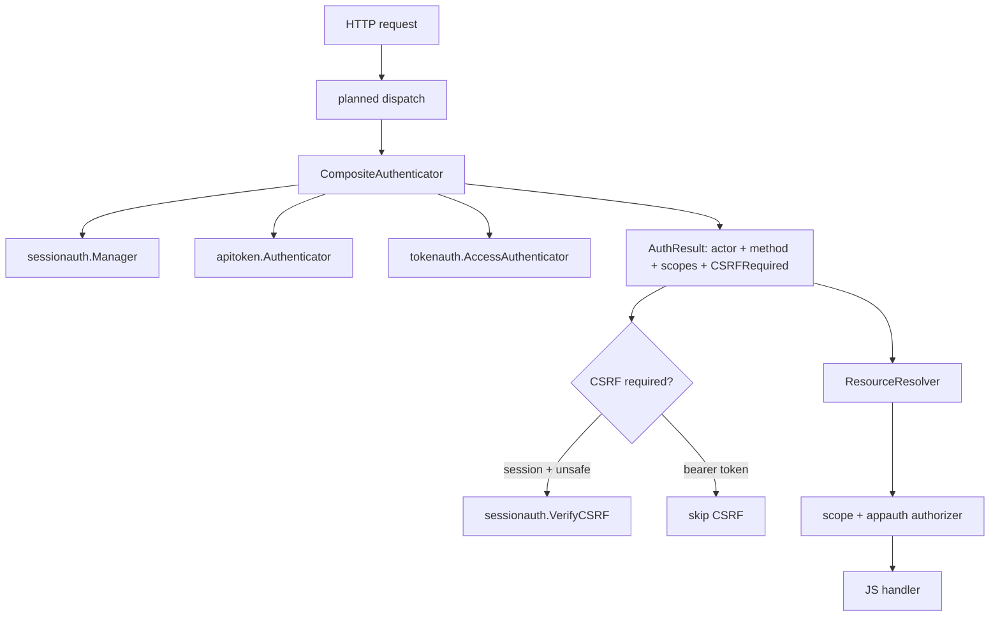

# go-minitrace Skill Repair and PR #95 Session Recovery: A Three-Part Investigation

This report documents a single session of work that moved through three connected stages. The first stage repaired the `go-minitrace` skill after the tool's query backend changed. The second stage used the repaired skill to locate a specific pull request session that standard discovery could not find. The third stage used the recovered session's transcript, the pull request's review threads, and the repository's design documents to reconstruct what the pull request actually did. The three stages are presented in the order they occurred, because each depends on the one before it.

The pull request at the center of the investigation is [go-go-golems/go-go-goja#95](https://github.com/go-go-golems/go-go-goja/pull/95), *Add xgoja personal inbox auth and device login tutorial*. At the time of this report it is open, mergeable, and passing all status checks.

This report is the current operational case study in the [[go-minitrace]] map: it demonstrates the repaired SQLite workflow, workspace-cwd discovery fallback, and transcript-backed review.

> [!summary]
> - The `go-minitrace` skill and its query recipes were rewritten for the normalized SQLite engine that replaced the removed DuckDB backend; seven stale vault articles were marked deprecated with inline migration callouts.
> - The go-go-goja PR #95 work could not be found by `discover pi --cwd-contains go-go-goja` because the session ran from a workspace directory, not the repository. A content grep over raw JSONL located it, and the converted archive was then queried with SQL.
> - PR #95 ships a three-family authentication model (browser sessions, API tokens, OAuth-style access/refresh tokens) and an application-owned device authorization flow. Its final review-driven hardening, in commit `9923094`, fixed a redirect-validation gap, moved post-auth rate limits after authorization, and made refresh-token rotation safe against access-insert failures.

## Part 1: Updating the go-minitrace skill

### Why the skill needed repair

The `go-minitrace-transcript-analysis` skill instructs an agent how to discover, convert, and query coding-agent session transcripts. The skill was written against a version of the tool whose analytical backend was DuckDB, exposed through the `go-minitrace query duckdb` command family. That backend has been removed. The tool now builds a normalized SQLite database from converted archives and runs SQL through a single sandboxed read-only command, `go-minitrace query run`.

An agent following the unrepaired skill would issue `go-minitrace query duckdb` and receive a command-not-found error. The skill also documented a JavaScript command API that no longer matches the tool: it referenced `mt.query()`, `mt.queryOne()`, and `mt.tableName`, none of which exist in the current builder-composed API. The bundled `scripts/query_minitrace.sh` invoked the removed command directly.

The repair was forced by a real failure. While trying to answer the question *which session ran go-go-goja PR #95*, the skill's prescribed `query duckdb` commands failed. The failure exposed seven distinct defects, each confirmed against the live tool's help output before being fixed.

### What changed

The skill lives in `/home/manuel/.codex/skills/go-minitrace-transcript-analysis`. The repair touched three files, committed as `064f187`:

The frontmatter and overview were rewritten to name the normalized SQLite engine instead of DuckDB, and a prominent note was added stating that `query duckdb` is removed and that `go-minitrace help query-duckdb` is now a migration guide rather than a command reference.

The **Important caveats** section gained the discovery blind spot that caused the original failure. `discover pi --cwd-contains <repo>` matches only on the session's recorded working directory. When work is done from a workspace directory rather than the repository itself, the filter returns nothing. The skill now documents the reliable fallback: grep the raw JSONL for a topic string to shortlist candidates, then convert that shortlist. The section also documents `convert pi --source-list`, which accepts a newline-separated file of session paths and is the preferred way to convert a narrow subset without staging a temporary directory.

The **query section** was rewritten end to end. The replacement command builds or reuses a normalized SQLite database from an archive glob and runs either a named preset or ad hoc SQL. The available presets are `session-list`, `framework-summary`, `annotations`, `timing-analysis`, `tool-operation-breakdown`, `tool-failures`, `read-ratio-distribution`, `file-operations`, and `file-timeline`. The useful flags are `--sql`, `--sql-file`, `--preset`, `--archive-glob`, `--max-rows`, `--max-cell-chars`, and `--timeout-ms`.

The **JavaScript command section** was rewritten to the current API. A query handler no longer calls `mt.query()` against `mt.tableName`. It builds a `DBHandle` from sources, cache, and limits, then calls `db.query()` against a real table. The minimal pattern is:

```js
const mt = require("minitrace");
const db = mt.db().RuntimeArchives().QueryCommandDefaults().Build();
try {
  return db.query(`SELECT session_id, title, agent_framework
                   FROM sessions ORDER BY started_at DESC`);
} finally {
  db.close();
}
```

The `references/queries.md` file was rewritten completely. The old file assumed a single DuckDB table named `sessions_base` and used `environment->>'agent_framework'`, `UNNEST(tool_calls) AS t(tc)`, and `CAST(json_extract(...) AS VARCHAR)` patterns throughout. The new file documents the normalized schema — the `sessions`, `turns`, and `tool_calls` tables with their real columns — and provides ready-made queries verified against a real converted archive. It ends with a migration table mapping each legacy DuckDB pattern to its SQLite equivalent.

The `scripts/query_minitrace.sh` script was fixed by changing `query duckdb` to `query run` on a single line.

### How the repair was verified

Every query in the rewritten `queries.md` was executed against the converted archive at `/tmp/pi-goja-mini/active/*/*.minitrace.json`. The session-count query returned six sessions. The framework summary returned the expected `pi` framework with 6116 total turns. The tool-frequency query returned the real call distribution: `bash` at 3151 calls, `read` at 1778, `edit` at 1162, `write` at 379, and `playwright_browser_navigate` at 62. The topic-grep query located the go-go-goja turns. The fixed shell script ran successfully. Verification by execution, not by inspection, was the standard applied to each change.

### The vault deprecation map

The skill repair implied a wider problem. If the skill was stale, the vault articles that taught the same workflow were likely stale too. A survey of every `go-minitrace` article in the Obsidian vault found seven that still reference the removed DuckDB backend. Rather than rewrite historical notes, a new article — `ARTICLE - go-minitrace Query Engine Migration - DuckDB to Normalized SQLite`, committed as `4939216` — was created as the authoritative deprecation map. Each stale note then received an append-only `> [!warning]` callout inserted directly under its H1 heading, linking to the migration article and providing the rewritten query specific to that note.

The deprecated set is:

| Article | DuckDB references | Nature of staleness |
| --- | --- | --- |
| Code Review with go-minitrace (guideline) | 5 | Four `query duckdb` code blocks plus the JSON double-quoting gotcha |
| transcript-analysis-with-go-minitrace (Tribal) | 10 | Prose and workflow diagram describe "DuckDB SQL" |
| KB-BATCH10-minitrace-transcript-analysis | 13 | Batch summary names DuckDB as the analytical read layer |
| PROJ - go-minitrace - Annotation System | 24 | Describes a `sqlite_scanner` DuckDB read path |
| PROJ - go-minitrace - Web UI and Transcript Explorer | 16 | SQL workbench described as in-process DuckDB |
| PROJ - Nightly Transcript Review - 2026-04-16 | 5 | Nightly query bundle and a DuckDB build conflict |
| PROJ - Cross-Model Transcript Analysis | 5 | Four core queries using `UNNEST(tool_calls)` |

Five articles were confirmed current and unaffected: the two go-go-goja auth deep-dives, the HTML export report, and the two Claude hook notes, which use an independent SQLite capture layer rather than the minitrace query engine.

## Part 2: Using go-minitrace to answer the question

### The question

The investigation began with a request: find the sessions worked on recently that touched go-go-goja and its pull request. The pull request of interest was later specified as [go-go-golems/go-go-goja#95](https://github.com/go-go-golems/go-go-goja/pull/95).

### Why discovery failed and how content grep succeeded

The first approach used `go-minitrace discover pi --cwd-contains go-go-goja --since 2026-07-13`. It returned no rows. This is the workspace-cwd blind spot documented in Part 1. The PR #95 session did not run with the go-go-goja repository as its working directory. It ran from `/home/manuel/workspaces/2026-06-20/ui-notebook-package`, a workspace directory. The `--cwd-contains` filter matches the recorded `cwd`, so it could not see the session even though the session's content is densely about go-go-goja.

The reliable method, once the blind spot was recognized, was to grep the raw JSONL files for the topic string before doing anything heavier. A grep across all sessions modified on July 13 or July 14 for `go-go-goja`, `go_go_goja`, or `xgoja` shortlisted the candidates by mention count:

| Mentions | Last modified | Session directory |
| --- | --- | --- |
| 781 | 2026-07-14 12:47 | `--home-manuel-workspaces-2026-06-20-ui-notebook-package--` |
| 735 | 2026-07-14 22:07 | `--home-manuel-code-wesen-claw-stuff--` |
| 467 | 2026-07-13 17:59 | `--home-manuel-code-wesen-2026-07-09--transcript-rag--` |
| 65 | 2026-07-14 22:37 | `--home-manuel-code-wesen-claw-stuff--` (second session) |
| 37 | 2026-07-14 22:22 | `--home-manuel-code-wesen-2026-04-17--byok-host--` |

The mention count alone did not identify the PR session. Several of these sessions mention go-go-goja or xgoja in passing. The decisive filter was the pull request URL itself.

### Finding the PR #95 session with SQL

The candidate files were staged into a flat directory and converted with `go-minitrace convert pi --source-dir /tmp/pi-goja-stage --output-dir /tmp/pi-goja-mini`. Six sessions converted cleanly into the minitrace archive format. The normalized SQLite engine was then queried for user turns mentioning the pull request URL:

```sql
SELECT session_id, turn_index,
       substr(coalesce(content, ''), 1, 160) AS snippet
FROM turns
WHERE role = 'user'
  AND content LIKE '%go-go-golems/go-go-goja/pull/95%'
ORDER BY session_id, turn_index;
```

The query returned exactly one working session. The session is `019ee82a-7169-74f2-adc7-df7e7e07200f`, titled *tinyidp Device DPoP and xgoja Auth PRs*. The pull request URL appears in two user turns, 1839 and 1841, both carrying the instruction *Address code review issues*. A third turn, 1883, references the pull request's GitHub Actions run and instructs a `go.mod` update to fix CI.

A separate grep across all session JSONL files for the pull request URL confirmed that only one working session and one meta-conversation (this investigation itself, started the following day) reference it. The recovery was complete: the PR #95 session had been located, converted, and confirmed by SQL query against its content.

### What the session list query revealed

The `session-list` preset gave the overall shape of the recovered archive. The session ran on the `gpt-5.6-terra` model, accumulated 1910 turns and 2048 tool calls over a span that began on 2026-06-21 and ended on 2026-07-14, and is classified as an internal session of quality tier A. The turn count is the important signal: a 1910-turn session is a long-form engineering effort, not a quick task, and the review-fix work at its end is a small fraction of a much larger body of auth work.

## Part 3: The PR #95 work

### What the pull request is

PR #95, *Add xgoja personal inbox auth and device login tutorial*, is open, mergeable, and passing all status checks at the time of this report. Its head branch is `task/api-auth-device-login`. It contains 84 commits, 224 changed files, and a net change of +35389 / -158 lines. The additions are dominated by documentation and an eight-step tutorial; the small deletion count reflects that the work adds an authentication model rather than replacing one.

The pull request body names four major areas: generated host auth and session support for OIDC browser login; programmatic API auth primitives, access and refresh token families, and the device authorization flow; durable SQL stores for programmatic auth state; and guarded, authenticated fetch client support. The tutorial, in `examples/xgoja/23-personal-knowledge-inbox/`, walks through eight steps that each add one sharply defined responsibility.

### The three credential families

The pull request is built on a deliberate taxonomy of credentials. The design document, in ticket `XGOJA-PROGRAMMATIC-AUTH-DESIGN` at `/home/manuel/code/wesen/go-go-golems/go-go-goja/ttmp/2026/06/15/`, states the principle directly: a browser session, an API token, and a device-issued access token each answer a different question, and conflating them collapses the security model.

| Credential | Primary caller | Sent to planned routes | Refreshes | Storage | Revocation |
| --- | --- | --- | --- | --- | --- |
| Session cookie | Browser | Yes | Idle/absolute extension | server-side session store | revoke session |
| Personal API token | Script, CI, user automation | Yes, `Authorization: Bearer` | No | hash only | revoke token |
| Service API token | machine or service account | Yes, `Authorization: Bearer` | No | hash only | revoke token |
| Access token | Device, CLI, native app | Yes, `Authorization: Bearer` | Via refresh token | hash only | revoke token or family |
| Refresh token | Device, CLI, native app | No | Rotates itself | hash only | revoke token or family |
| Device code | headless device | No | N/A | hash only | expire, deny, or approve |
| User code | user browser input | No | N/A | hash only | expire, deny, or approve |

The rule that makes this taxonomy safe is that refresh tokens never reach a planned route. They are accepted only by Go-owned refresh endpoints. A planned Express route compiles into a `RoutePlan` and is evaluated by a Go-owned enforcer before the JavaScript handler runs. The enforcer establishes an `AuthResult`, performs CSRF validation conditionally on the credential method, resolves resources, checks grants and authorization, and only then invokes the handler. JavaScript declares route intent; Go owns authentication, CSRF, resource resolution, authorization, and audit.

### The authentication result and the composite authenticator

The central abstraction the pull request introduces is `AuthResult`. The previous `Authenticator` interface returned only an `Actor`. It could not tell dispatch how the actor authenticated, so it could not decide CSRF behavior correctly for routes that accept both cookie sessions and bearer tokens.

```go
type AuthResult struct {
    Actor        *Actor
    Method       AuthMethod // session, api-token, access-token, device-token
    CredentialID string
    Scopes       []string
    CSRFRequired bool
    Claims       map[string]any
}
```

A composite authenticator routes each credential type to its handler — `sessionauth.Manager`, `apitoken.Authenticator`, or `tokenauth.AccessAuthenticator` — and produces a single `AuthResult`. Dispatch then branches on `CSRFRequired`: cookie-backed browser sessions require CSRF on unsafe methods; authorization-header bearer tokens do not, because browsers do not attach arbitrary bearer tokens automatically across sites.



### The device authorization flow

The device authorization flow follows the shape of RFC 8628 but is application-owned rather than IdP-owned. A generated xgoja host with hostauth enabled mounts three Go-owned endpoints before application routes:

| Method | Path | Purpose |
| --- | --- | --- |
| `POST` | `/auth/device/start` | Create a device code, user code, verification URI, expiry, and poll interval |
| `POST` | `/auth/device/token` | Poll using the device code; returns `authorization_pending` or `slow_down` until approval, then returns tokens |
| `POST` | `/auth/device/approve` | Browser-session and CSRF protected approval; narrows grants and marks the code approved |

The flow exists for limited-input clients. A CLI cannot safely handle an interactive browser login, but it can display a short user code and poll. The user approves the code in an already authenticated browser session. After approval, the polling endpoint returns an access token and a rotating refresh token. The browser cookie and the human password never move into the CLI.

The design distinguishes this application-owned flow from the tinyidp device authorization that ships in the separate `go-go-golems/tiny-idp` repository. tinyidp supplies browser OIDC login for the tutorial's smoke tests, replacing Keycloak for fast local iteration. Step 08 of the tutorial deliberately uses xgoja's own application-owned device endpoints, not tinyidp's IdP-owned flow.

### Why opaque tokens were chosen over JWTs

The design document records the decision to issue opaque tokens rather than JWTs in the first implementation. Opaque tokens allow immediate revocation, make token reuse detection straightforward, and let scopes and subject state change server-side without waiting for token expiry. They also avoid introducing a signing-key lifecycle before there is a concrete multi-service verification need. JWTs can be added later if stateless verification across services becomes a real requirement. This is a deferral decision, not a permanent commitment, and it is recorded as such.

### The review-driven hardening

The final phase of the pull request work was driven by code review. The transcript and the pull request's review threads together reconstruct the sequence. Three findings were filed against the branch, all addressed in commit `9923094`, *fix: address auth review findings*.

The first finding was a CodeQL bad-redirect check against `pkg/gojahttp/auth/keycloakauth/keycloakauth.go`. The original code validated that a redirect destination had a leading slash but did not reject an authority-style prefix such as `//` or `/\`. An attacker could construct a post-logout destination that looked local but resolved to an external host. The fix normalizes post-logout destinations through `localRedirectPath`, which rejects absolute URLs and the `//` and `/\` authority prefixes, and adds regression coverage for those cases.

The second finding was a P2 control-flow issue in `pkg/gojahttp/enforcer.go`. When a route declared a post-auth rate limiter keyed by resource, the limiter consumed the shared resource bucket before the grant and authorizer checks ran. An authenticated caller who lacked the action could repeatedly receive 403 responses while still exhausting the resource bucket for authorized users. The fix moves post-auth rate limits to run only after grant and authorizer checks pass, so denied callers cannot consume shared resource buckets. A regression test denies a resource-keyed request, then confirms the first authorized request still succeeds.

The third finding was a P2 atomicity issue in `pkg/gojahttp/auth/programauth/oauth_token.go`. The refresh flow rotated the current refresh token before creating the new access token. If `CreateAccessToken` failed after the rotation succeeded — a transient database error or a duplicate access-token id — the current refresh token had already been marked used, and the replacement refresh token was never returned to the client. A retry with the original refresh token would then be treated as reuse and could revoke the entire token family. The fix reorders the operations: the new access token is persisted before the current refresh token is rotated. An access-insert failure leaves the current refresh token usable. If the rotation then fails, the unreturned access token is deleted through a new store rollback operation. Regression coverage was added for the access-insert failure and retry case.

The transcript shows the fix sequence precisely. Turns 1842 through 1843 fetch the pull request's review comments with `gh api`. Turns 1845 through 1855 grep the codebase for the affected symbols — `RotateRefreshToken`, `CreateAccessToken`, `afterLogoutURL`, `AccessTokenStore`, `deleteAccess`, `defaultRelativeURL`, and `RateLimit` — to locate the code each finding references. Turns 1857 through 1873 apply the edits. Turn 1874 runs `gofmt` and fails; turn 1877 runs it again successfully after a correction. Turn 1879 runs the full test suite. Turn 1881 posts the reply to review comment 3567142. The pattern repeats for each finding, each reply citing the resolving commit.

### The CI and toolchain fix

After the review findings were resolved, a separate turn addressed failing CI. Turn 1883 instructed a `go.mod` update to address a failing GitHub Actions run on the pull request. Turn 1886 ran `go mod edit -toolchain=go1.26.5` and `go mod tidy`. The first attempt was reverted in turn 1887, and the toolchain edit was reapplied cleanly. Turn 1888 committed the result as `2fce13f`, *build: upgrade Go toolchain to 1.26.5*. At the time of this report, all status checks on the pull request report SUCCESS, and the pull request is mergeable.

The two commits together — `9923094` for the review findings and `2fce13f` for the toolchain — represent the final hardening that brought the branch to a mergeable state.

### The relationship to tinyidp

The pull request uses tinyidp as a fast local identity provider for the tutorial's smoke tests, but the relationship is narrower than it appears. tinyidp supplies browser OIDC login behavior for Steps 06 through 08 of the personal inbox tutorial. It does not supply the device authorization flow that Step 08 exercises, because Step 08 deliberately uses xgoja's own application-owned device endpoints. The tinyidp repository has since moved to `go-go-golems/tiny-idp` and gained native device authorization and DPoP support, but those are separate IdP-owned flows. Keeping the tutorial's application-owned device flow distinct from tinyidp's IdP-owned flow is a deliberate boundary, documented in the pull request body, and it is the reason the two implementations are not redundant.

## Working rules

- When a tool's backend is replaced, repair the skill that teaches the tool before relying on it. Verification by execution, not inspection, is the standard.
- `discover pi --cwd-contains` matches the recorded working directory, not the topic of conversation. When a session ran from a workspace directory, fall back to a content grep over raw JSONL.
- Convert a shortlisted subset with `convert pi --source-list` rather than converting the entire session tree. Query the resulting archive with SQL before reading turns manually.
- A pull request's review threads, the session transcript, and the repository's design documents each hold part of the truth. The transcript shows the order of work; the review threads show what was wrong and how it was fixed; the design document shows why the architecture is shaped the way it is. Reconstructing the work requires all three.
- Refresh-token rotation must be ordered so that a failure in access-token creation leaves the current refresh token usable. Rotating before creating introduces a reuse-revocation hazard under transient failure.
- Post-auth rate limits must run after authorization. Charging a shared resource bucket before a grant check lets denied callers exhaust limits meant for authorized users.
- Redirect validation that checks only for a leading slash is insufficient. Authority-style prefixes such as `//` and `/\` must be rejected explicitly.

## Related notes

- [[PROJECT REPORT - go-go-goja - Personal Inbox Auth, Programmatic Access, and Device Login]] — the earlier deep dive on PR #95's auth architecture, written before this recovery session.
- [[ARTICLE - go-minitrace Query Engine Migration - DuckDB to Normalized SQLite]] — the deprecation map and migration table produced in Part 1.
- [[PROJECT REPORT - go-go-goja Token Families and Device Authorization Flow - Deep Dive]] — the earlier token-family and device-authorization design.
- [[Code Review with go-minitrace]] — deprecated; the post-session analysis playbook whose query commands were migrated in Part 1.
- [[transcript-analysis-with-go-minitrace]] — deprecated; the Tribal workflow entry updated with a migration callout in Part 1.
