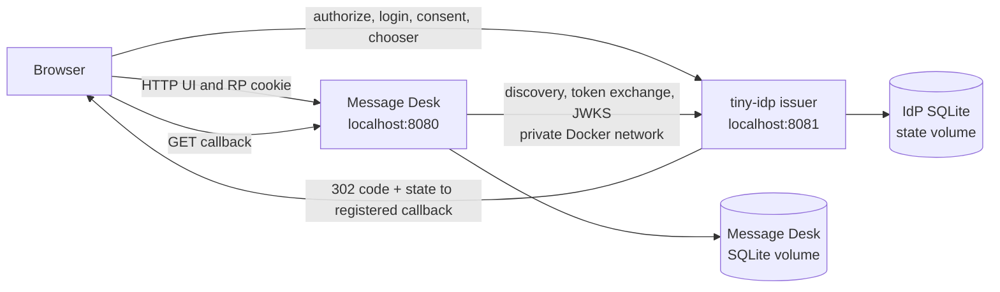
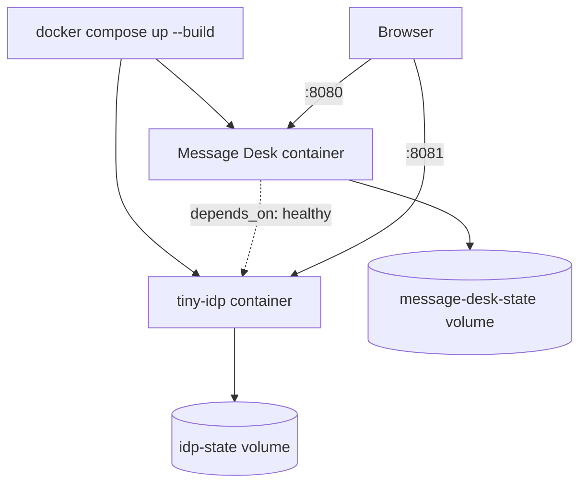

# tiny-idp: From an Embedded Provider to a Standalone Docker OIDC Service

This report records the construction and verification of a complete two-process
OpenID Connect demonstration: a standalone `tiny-idp` provider and a separate
Message Desk relying-party application. Both processes are packaged for Docker
Compose, retain their own durable SQLite state, and expose only their intended
browser-facing origins. The work is tracked in
`TINYIDP-EXTERNAL-DEMO-001`, whose design document and diary remain the
chronological primary record:

- `ttmp/2026/07/14/TINYIDP-EXTERNAL-DEMO-001--standalone-tiny-idp-and-message-desk-docker-oidc-demo/design-doc/01-standalone-tiny-idp-and-message-desk-docker-demo-analysis-design-and-implementation-guide.md`
- `ttmp/2026/07/14/TINYIDP-EXTERNAL-DEMO-001--standalone-tiny-idp-and-message-desk-docker-oidc-demo/reference/01-implementation-diary.md`

The result is a real application boundary, rather than a simulated remote
provider inside one executable. A browser is redirected from the Message Desk
at `http://localhost:8080` to an issuer at `http://localhost:8081`. The Message
Desk validates the resulting authorization-code flow, creates its own local
application session, and does not open or mutate the provider's account store.
The provider authenticates users, presents consent, manages its browser
sessions and account chooser, and issues OIDC credentials.

> [!summary]
> The demo proves that tiny-idp can be operated as an independently deployed
> OIDC issuer while a separate Go application uses it through standard
> discovery, authorization-code flow, PKCE, nonce validation, and JWKS-backed
> ID-token validation. It also exposed two integration defects that unit tests
> alone did not reveal: a login-page CSP that blocked the final callback
> redirect, and root-owned Docker named volumes that prevented SQLite creation.
> Both were corrected and the complete browser workflow was exercised with
> Playwright. This is a robust development and integration example, not a
> production deployment recipe: TLS, secure cookie policy, automated
> two-origin integration tests, and broader persistence/failure testing remain
> open ticket work.

## 1. The question this work answers

The earlier Message Desk example embedded tiny-idp in the same Go process. That
is a valuable deployment mode: an application can own its account lifecycle,
provider configuration, and application routes in one binary. It is not,
however, enough to demonstrate the security and operational boundary expected
when an identity provider is a separately operated service.

The central engineering question was therefore precise:

> Can a separately started, durable tiny-idp service authenticate a browser and
> authorize a separately started Message Desk application, without either
> process silently sharing identity state or weakening normal OIDC validation?

Answering it required more than making an authorization redirect appear to
work. A credible answer must establish all of the following properties.

1. The issuer has a stable public URL and durable signing/account state.
2. The relying party uses the public issuer identifier for protocol validation.
3. The relying party's private container-to-container calls do not change that
   public identifier.
4. Browser authentication and consent occur at the issuer, not through a
   Message Desk shortcut.
5. The final authorization response reaches only a registered callback.
6. Provider browser sessions and Message Desk sessions have deliberately
   different logout semantics.
7. The deployment can start from empty named volumes and produce useful health
   signals.
8. A user can observe and test the behavior as a complete application rather
   than as isolated HTTP handlers.

This report explains the resulting design, the concrete implementation, the
evidence obtained, the defects discovered during browser verification, and the
remaining limits.

## 2. System vocabulary and trust boundaries

The protocol terms matter because the same browser participates in two
different kinds of session.

| Term | This system's instance | Authority | Durable state |
| --- | --- | --- | --- |
| Identity provider (IdP) | standalone `tiny-idp` service | authenticates accounts and issues OIDC artifacts | provider SQLite DB, signing secret, provider browser session |
| Relying party (RP) | Message Desk | decides whether a validated identity may use the desk | Message Desk SQLite DB, RP login transaction and app session |
| Issuer | `http://localhost:8081` in the development Compose topology | names the OIDC security domain | provider configuration and OIDC discovery document |
| Redirect URI | Message Desk callback URL registered with the provider | receives an authorization response | provider client registration |
| Provider session | `tinyidp_session`-style issuer browser state | remembers a successful provider login | browser cookie plus provider-side session context |
| RP session | Message Desk application cookie | authorizes Message Desk API calls | application session record |
| Backchannel | service-to-service discovery, token, and JWKS requests | supports RP verification | no browser credential is sent over this channel |

The boundary can be pictured as follows.



The diagram shows a deliberate asymmetry. The browser uses public origins. The
Message Desk's protocol client may use a Docker-private route for calls that do
not occur in the browser, but its OIDC issuer identity remains the public
origin. The private route is a networking implementation detail, not a second
issuer and not a replacement for issuer validation.

### 2.1 What is intentionally not shared

The application does not import the provider's account service in external
mode. It does not query the provider's SQLite database. It does not create an
account at the provider when a visitor clicks an application control. It does
not turn an OAuth subject into a password credential. It consumes a validated
identity assertion and creates a local Message Desk session.

That separation has practical benefits:

- provider password policy, account recovery, MFA, consent, and login UI can
  evolve without recompiling the Message Desk;
- Message Desk data cannot accidentally become identity data merely because the
  two services use Go and SQLite;
- logout behavior can distinguish local application sign-out from an IdP-wide
  browser logout;
- an operator can deploy a different relying party against the issuer using the
  same normal client-registration model.

It also creates obligations. The RP must validate the full OIDC response; it
cannot trust a subject string supplied by its own browser. The provider must
know exact registered redirect URIs. The two services must agree on a public
issuer URL and client ID. Those obligations are features of the security
boundary, not incidental configuration.

## 3. From the embedded example to the external topology

The work reuses the Message Desk's useful domain and UI code while replacing
the embedding relationship.

| Concern | Embedded mode | External mode added here |
| --- | --- | --- |
| Process model | one Go process | one IdP container and one RP container |
| Identity store | owned/opened by the application binary | opened only by `tinyidp` process |
| Account registration | application may enable it | hidden and rejected by Message Desk API |
| OIDC issuer route | local handler wiring | public `localhost:8081` issuer |
| Discovery/token/JWKS route | local handler transport possible | Docker-private service route, public issuer preserved |
| Application data | Message Desk SQLite | Message Desk SQLite named volume |
| Provider data | provider SQLite | independent IdP named volume |
| Login UX | same renderer family | provider-owned renderer served from IdP |

The external example lives in
`examples/tinyidp-external-message-desk/`. The related Message Desk changes
live in `examples/tinyidp-message-app/`. The major implementation components
are:

```text
examples/
├── tinyidp-external-message-desk/
│   ├── cmd/idp/main.go                 # standalone provider executable
│   ├── idp_server.go                   # public provider composition
│   ├── idp_seed.go                     # deterministic bootstrap and account reconciliation
│   ├── demo-seed.json                  # explicitly development-only client/accounts
│   ├── Dockerfile.idp
│   ├── Dockerfile.message-desk
│   ├── docker-entrypoint.sh             # named-volume ownership then privilege drop
│   ├── compose.yaml                    # two services, volumes, health checks
│   └── README.md                        # operator-facing demo instructions
└── tinyidp-message-app/
    ├── external_config.go               # external issuer/backchannel validation
    ├── external_runtime.go              # RP-only initialization path
    ├── oidc_client.go                   # auth-code, PKCE, nonce, ID-token verification
    ├── app_http.go                      # capability-aware registration and logout API
    └── loginui/                         # reusable provider interaction renderer
```

The relevant public tiny-idp composition API is in
`pkg/embeddedidp/`. The standalone service calls those public facilities rather
than copying internal provider machinery:

- `embeddedidp.Bootstrap` creates or reconciles client registration and signing
  material;
- `embeddedidp.New` composes the Fosite-backed provider;
- `idpaccounts.Service` provisions/reconciles account records;
- `idpui` supplies the interaction renderer used by the authorization flow.

This is an important design test of an embedding API. If a separate first-party
binary has to reach into `internal/` packages or replicate protocol setup, the
public surface is incomplete. Here the service can be composed from public
packages, which is evidence that the existing provider foundation is usable for
both embedded and independent deployment modes.

## 4. Provider startup is an explicit composition operation

The standalone executable is intentionally small. It accepts a state root,
issuer, listen address, seed manifest, and log level as command-line fields.
It opens provider state, applies bootstrap, constructs the provider, registers
health handlers, and serves HTTP.

Conceptually, its startup sequence is:

```text
parse flags
validate canonical development issuer
open provider SQLite database under state root
load seed manifest
bootstrap signing material and client registration
provision or reconcile seeded accounts
construct embeddedidp.Provider with account service and UI renderer
register /healthz and /readyz
serve provider handler at the configured listen address
```

The corresponding code is principally in
`examples/tinyidp-external-message-desk/cmd/idp/main.go` and
`examples/tinyidp-external-message-desk/idp_server.go`.

### 4.1 Stable provider state

An issuer cannot issue coherent long-lived credentials if each start produces a
new signing key or replaces all clients. The IdP state root therefore contains
the provider SQLite database and token-signing material. Docker Compose mounts
that root as the `idp-state` named volume.

The lifetime rule is simple:

```text
empty volume  -> bootstrap durable provider state exactly once
existing volume -> verify/reuse compatible state
changed seed manifest -> reject incompatible durable identity state
```

That last branch is intentionally strict. It prevents a configuration edit from
silently repurposing an existing account identity. An operator should decide
whether a real account migration is acceptable; a demo bootstrapper should not
make that decision on the operator's behalf.

### 4.2 Seed manifests are development fixtures, not account import

`idp_seed.go` defines a `SeedManifest` with a client ID, redirect URIs,
post-logout redirect URIs, and development account entries. `Bootstrap` first
uses the provider bootstrap API to ensure the relying-party client and signing
state exist, then uses `idpaccounts.Service` to provision accounts.

Its account reconciliation behavior is deliberately conservative:

1. If an account does not exist, create it with the fixture attributes.
2. If it exists, compare identity-bearing fields such as ID, subject, email,
   and display name.
3. Authenticate with the configured fixture password to confirm the credential
   matches the known development configuration.
4. Reject drift rather than overwriting the durable account.

Pseudocode captures the policy.

```go
for _, wanted := range manifest.Accounts {
    found, err := accounts.Lookup(ctx, wanted.Login)
    switch {
    case errors.Is(err, ErrNotFound):
        accounts.Create(ctx, wanted)
    case err != nil:
        return err
    default:
        requireSameIdentity(found, wanted)
        requirePasswordAuthenticates(ctx, wanted.Login, wanted.Password)
    }
}
```

The password in `demo-seed.json` is intentionally public and development-only.
It is a test fixture, not a secret distribution mechanism. The README labels
the entire Compose topology as local development infrastructure. A production
operator must use a separate account-provisioning and secret-management flow.

### 4.3 Standalone provider settings

`NewStandaloneIDP` in `idp_server.go` centralizes the provider settings rather
than leaving behavior distributed between Docker arguments and HTTP handlers.
It validates the development issuer, requires the state store/account service/
token secret, and configures:

- Fosite-backed authorization and token handling through `embeddedidp.New`;
- a rate limiter;
- a direct resolver for the seed-defined client;
- `SameSite=Lax` browser-session behavior suitable for top-level OIDC
  redirects;
- a renderer built from `examples/tinyidp-message-app/loginui`;
- multi-account chooser support, with password logins eligible to be remembered
  and labelled from name/username fields.

The last item connects this work to
[[Projects/2026/07/14/PROJECT REPORT - tiny-idp - Multi-Account Browser Sessions and Logout Scopes|the prior multi-account session report]].
The chooser is an IdP capability. The external RP asks for
`prompt=select_account`; it does not manufacture an account list from its own
database.

## 5. The OIDC authorization-code transaction

The RP uses an authorization-code flow with PKCE S256 and an ID-token nonce.
The browser-facing sequence is standard OIDC, but the exact validation points
are worth making explicit.

```mermaid
sequenceDiagram
    participant B as Browser
    participant R as Message Desk :8080
    participant I as tiny-idp :8081
    participant D as Message Desk DB

    B->>R: GET /api/login
    R->>D: store state, nonce, PKCE verifier, expiry
    R-->>B: 302 issuer /authorize?client_id...&state...&code_challenge...&prompt=select_account
    B->>I: GET /authorize
    I-->>B: login / chooser / consent interaction
    B->>I: POST selected authentication and consent
    I-->>B: 302 http://localhost:8080/...callback?code=...&state=...
    B->>R: GET callback
    R->>D: consume unexpired state transaction exactly once
    R->>I: token exchange with authorization code + verifier
    R->>I: discovery/JWKS as needed
    I-->>R: token response and signed ID token
    R->>R: validate issuer, audience, signature, nonce, subject
    R->>D: create hashed RP session with 8-hour expiry
    R-->>B: set RP session cookie; redirect to desk
```

The implementation in `examples/tinyidp-message-app/oidc_client.go` gives each
of these values a specific job.

| Value | Generated/stored by | Checked by | Security purpose |
| --- | --- | --- | --- |
| `state` | Message Desk login transaction | Message Desk callback | binds callback to initiating browser transaction and prevents response mix-up/CSRF |
| PKCE verifier | Message Desk login transaction | token endpoint | binds a stolen authorization code to the initiating client transaction |
| PKCE S256 challenge | authorization request | token endpoint indirectly | avoids sending verifier in front channel |
| nonce | Message Desk login transaction | verified ID token | binds ID token to authorization request and reduces token replay/mix-up risk |
| authorization code | IdP | token endpoint | one-time handoff between browser result and RP backchannel |
| issuer | IdP discovery/token | RP verifier | names the security domain expected by the RP |
| subject | verified ID token | Message Desk session creator | stable identity key used by the RP |

The RP stores the login transaction durably and gives it a five-minute
lifetime. On callback it consumes the transaction, exchanges the code, checks
the ID token's signature through discovery/JWKS, confirms nonce and subject,
and creates a separate hashed Message Desk session with an eight-hour expiry.

This structure matters for negative cases. A callback with an unknown or
expired state cannot turn into a session. An authorization code acquired for a
different browser transaction lacks the stored PKCE verifier. An ID token with
the wrong issuer, audience, signature, or nonce cannot establish the RP
session.

### 5.1 Asking for account choice

When the Message Desk starts login it sends `prompt=select_account`. This is
not a replacement for password validation. It communicates that, when the IdP
has multiple remembered provider identities, the user should choose which
identity will authorize the client. The provider may then:

1. present an account chooser;
2. allow the user to choose a remembered account;
3. offer “use another account,” which returns to password authentication;
4. present consent for the requested scopes;
5. issue an authorization code only after the relevant checks succeed.

The external demo exercises this behavior with two seeded development
accounts. The account list remains provider-owned browser state, as it should.

## 6. One public issuer, one private route

Docker creates a practical complication that does not exist when all handlers
run inside one Go process. The browser reaches the provider at
`http://localhost:8081`, but the Message Desk container cannot use its own
loopback interface to reach that address. It needs the Compose service DNS name
`idp:8081`.

A tempting but incorrect solution is to configure the Message Desk's OIDC
issuer as `http://idp:8081`. That changes the protocol identity being
validated. Issuer comparisons, discovery metadata, token `iss` claims, and
browser redirects would no longer agree with the public browser origin.

The implementation instead has two separately validated configuration values:

```text
public issuer:          http://localhost:8081
private backchannel:    http://idp:8081
```

`externalOIDCConfig` validates the public issuer as a canonical local
development URL and ensures it is distinct from the public RP origin. A
separate validator accepts the private Docker DNS route only for explicitly
configured backchannel use, with strict URL/path form and path compatibility
with the public issuer.

### 6.1 The transport's narrow job

`issuerRewriteTransport` in `oidc_client.go` takes requests that the OIDC
library constructs for the public issuer and changes only the network
destination for matching issuer requests. It retains the public request URL and
Host semantics that the OIDC client and provider expect, while dialing the
private Docker address.

This distinction is easier to see in pseudocode.

```text
if request URL belongs to configured public issuer:
    clone request
    preserve logical URL and Host as public issuer
    map dial destination to configured private service base
    preserve issuer path prefix and request suffix
    send clone through HTTP transport
else:
    send request normally
```

The narrow matching rule is important. This is not general HTTP proxying and
not an arbitrary URL rewrite facility. It is an explicit network adaptation
for the already configured issuer. The issuer used in discovery, token
validation, redirect construction, and ID-token verification remains the
public issuer.

### 6.2 Why this is a security property

OIDC issuer validation protects a relying party from accepting a token minted
by a different authorization server. Treating a private DNS address as a
substitute issuer would weaken that identity check by conflating transport
reachability with protocol authority.

The correct separation is:

```text
authority identity = public issuer URL
network reachability = explicit private route for RP backchannel calls
browser navigation = public issuer URL
```

The demo's validators also reject several configuration mistakes before the
server starts: malformed URLs, invalid public origins, an untrusted cookie
scheme, and private backchannel routes that do not preserve the issuer path.
Failing at configuration time is more diagnosable and safer than allowing an
implicit fallback to a host-network route.

## 7. Provider-owned interaction UI and the CSP finding

The provider uses the reusable retro Message Desk interaction renderer from
`examples/tinyidp-message-app/loginui`. That gives the external login,
account-chooser, consent, and post-logout screens the same visual language as
the application without moving the provider pages into the application
container.

This is a useful division of responsibilities:

- `tiny-idp` owns interaction data, form actions, error handling, and the
  authorization transaction;
- the renderer owns HTML structure, CSS, and safe presentation of the supplied
  interaction model;
- Message Desk owns its own application page and does not serve the provider
  login form;
- static renderer assets are served under `/static/tinyidp/`, maintaining a
  distinct asset namespace.

### 7.1 Browser verification uncovered a real CSP bug

The first full browser authorization attempt did not reach Message Desk. The
provider login form posted successfully, but Chromium blocked the final 303
redirect to the RP callback because the interaction page's CSP used:

```text
form-action 'self'
```

At first glance that directive seems correct: the form itself posts to the
provider. The browser's enforcement covers the form submission's redirect
chain, however. When the provider transforms the successful POST into a 303 to
the registered callback, the callback origin must be permitted by
`form-action` as well.

The first attempted relaxation added only the issuer origin. That still failed,
because the terminal destination was the RP callback origin. The completed fix
was not a broad CSP relaxation. It used data that Fosite had already validated:
the registered authorization request's `redirect_uri`.

The change spans:

- `pkg/idpui/types.go`, which adds `InteractionForm.RedirectOrigin`;
- `internal/fositeadapter/rendering.go`, which derives the canonical callback
  origin from the validated request and supplies it to the renderer;
- `internal/fositeadapter/rendering_test.go`, which covers the rendering
  behavior.

The resulting interaction response permits exactly the logical form target and
the validated callback origin:

```text
default-src 'none';
style-src 'self';
frame-ancestors 'none';
form-action 'self' <validated callback origin>;
base-uri 'none'
```

For non-interaction pages, the stricter `form-action 'self'` policy remains.
The security rule is therefore not “allow any redirect origin so OAuth works.”
It is “allow the one callback origin that the provider has already accepted
through client redirect-URI validation.”

### 7.2 General lesson from the CSP defect

Security headers need end-to-end browser tests whenever their semantics involve
navigation, redirects, workers, or form submission. Handler unit tests can
assert that a header exists and still miss the browser's interpretation of a
redirect chain. In this case:

```text
server unit perspective: POST target is provider -> looks permitted
browser enforcement perspective: POST redirects to RP -> terminal target blocked
```

The final Playwright run reached the callback and created a Message Desk
session without current-browser console errors. Browser console history did
contain earlier exploration errors from the failed CSP iterations and local
origin experiments; that history is evidence of the debugging path, not a
claim that no prior error was observed.

## 8. Registration is a capability, not a hidden broken button

The embedded Message Desk can demonstrate self-registration because it owns
the embedded provider and account service. External Message Desk mode cannot
honestly expose that control without adding an account-provisioning API and
authorization model to the provider deployment.

The external runtime therefore makes the boundary visible in both API and UI.

| Surface | Embedded mode | External mode |
| --- | --- | --- |
| `/api/session` capability | registration may be enabled | reports registration unavailable |
| `/api/registration` | can supply registration configuration | returns not found |
| `/api/accounts` | can create an account when configured | returns not found |
| landing UI | can show registration action | explains that a desk account is required |
| account source | local embedded account service | external provider's seeded/managed accounts |

This behavior avoids a misleading interface where a visitor is invited to
register but receives an unexplained authorization error. The capability is
discovered by the frontend from session/configuration data instead of relying
on the UI to infer deployment mode from a failing POST.

The implementation is in `external_runtime.go` and `app_http.go`. The
external-runtime constructor opens only the Message Desk application database
and creates the normal remote OIDC client. It does not initialize the provider
database or account service. The route-level rejections ensure that disabling
the control in the frontend is not the only enforcement mechanism.

## 9. Logout has two different scopes

This two-origin deployment makes logout terminology concrete. A Message Desk
logout and an IdP logout should not be accidentally identical.

### 9.1 Local application logout

Local logout removes the Message Desk session. The browser becomes a guest of
the desk, but the provider session is intentionally left intact. Starting a
new login may return to the IdP account chooser, because the provider still
has remembered account state.

This is useful when a person changes desk identity but has not chosen to sign
out of the wider identity provider.

### 9.2 Global identity-provider logout

Global logout removes the Message Desk session and navigates the browser to
the IdP end-session endpoint. After it completes, the next application login
does not rely on an existing provider chooser session; it reaches password
authentication according to the provider's flow.

The tested behavioral matrix was:

| Starting state | Action | Expected outcome | Observed outcome |
| --- | --- | --- | --- |
| signed into Message Desk as first account | change account, then use another account | provider password path permits second account | second account reached desk |
| signed into desk | global logout | desk and provider login state cleared | next sign-in required provider authentication, not chooser reuse |
| signed into desk | local logout | desk session cleared, provider session retained | next sign-in reached account chooser |

This behavior depends on the earlier chooser/session work and is revalidated
here through the actual Docker network boundary. It is not merely a mocked
handler assertion.

## 10. Docker packaging and state lifecycle

The Compose topology contains two images and two named volumes.



The containers expose development ports as follows:

| Service | Browser address | Container purpose |
| --- | --- | --- |
| Message Desk | `http://localhost:8080` | application UI, callback endpoint, Message Desk API |
| tiny-idp | `http://localhost:8081` | discovery, authorize/login/consent, token/JWKS, end-session |

`compose.yaml` includes health checks for `/healthz` and `/readyz`; Message Desk
waits for the IdP health condition before it starts. This does not replace
application-level retry policy in a production platform, but it prevents an
obvious first-start race in the local demonstrator.

### 10.1 The named-volume ownership failure

The first Compose launch failed before an OIDC request. Docker created the
named state volume as root-owned, while the runtime image correctly attempted
to run as the unprivileged `tinyidp` user. SQLite creation then failed with:

```text
create SQLite database: open /state/tinyidp.sqlite: permission denied
```

This is a deployment correctness issue. Running the whole server as root would
hide the failure but create a worse security posture. The implemented
`docker-entrypoint.sh` instead uses a short root-only initialization step:

```sh
if [ "$(id -u)" = "0" ]; then
  mkdir -p /state
  chown -R tinyidp:tinyidp /state
  exec setpriv --reuid=tinyidp --regid=tinyidp --init-groups "$@"
fi
exec "$@"
```

The process that serves HTTP runs unprivileged. The entrypoint only prepares
the mounted state directory and drops privilege before executing the
application. This is more durable than requiring every developer to manually
change named-volume ownership, and it preserves least privilege after startup.

### 10.2 State reset is explicit

The README documents the difference between a normal restart and a reset:

```sh
docker compose up --build
docker compose down
docker compose down -v  # destructive: removes development state volumes
```

The volume-removal command is intentionally explicit because it destroys
provider accounts, signing material, sessions, and Message Desk data in this
development topology. It is appropriate for resetting fixtures, not for
ordinary operation.

## 11. Verification: source tests, Compose smoke, and a browser

Three complementary verification layers were used. Each has a different
failure-detection role.

### 11.1 Focused Go tests

The following focused package tests passed during the implementation:

```sh
go test ./internal/fositeadapter ./pkg/idpui ./examples/tinyidp-message-app -count=1
go test ./examples/tinyidp-external-message-desk/... ./examples/tinyidp-message-app -count=1
```

They cover package-level behavior and the new rendering/seed/configuration
paths. In particular, Fosite rendering tests protect the callback-origin CSP
data flow and seed tests exercise idempotent/reject-on-drift behavior.

### 11.2 Compose configuration and readiness

Compose configuration was parsed successfully with:

```sh
docker compose -f examples/tinyidp-external-message-desk/compose.yaml config
```

The ticket contains a retraceable smoke script:

`ttmp/2026/07/14/TINYIDP-EXTERNAL-DEMO-001--standalone-tiny-idp-and-message-desk-docker-oidc-demo/scripts/01-compose-health-smoke.sh`

It rebuilds/starts the topology and confirms both readiness endpoints. Its job
is intentionally narrow: fail quickly when an image, container command,
volume initialization, port mapping, or basic provider dependency is broken.

### 11.3 Browser-level Playwright verification

The strongest evidence came from driving a real Chromium browser against the
running Compose services. The final scenario covered:

1. visiting the unauthenticated Message Desk and observing that external mode
   does not show self-registration;
2. initiating sign-in and arriving at the IdP authorization/login page;
3. authenticating a seeded development account and consenting to the requested
   `openid` and `profile` scopes;
4. returning through the registered callback and reaching an authenticated
   desk;
5. posting a Message Desk message;
6. changing account through the provider chooser, then using another account
   through the password path;
7. performing global logout and observing that a later sign-in requires
   provider authentication rather than reusing the chooser;
8. performing local logout after another login and observing that a later
   sign-in can still use the provider chooser.

The active final Compose run had both services healthy, and the final browser
session reached the expected pages without current console errors. Earlier
console history recorded the CSP and origin experiments that led to the final
fix; those errors were not ignored, but investigated and resolved.

### 11.4 Why all three layers are required

| Verification layer | Catches well | Does not prove alone |
| --- | --- | --- |
| Go unit/package tests | parsing, configuration invariants, seed reconciliation, renderer model construction | browser navigation behavior, container filesystem ownership |
| Compose smoke | build/command/health/port/volume start failures | OIDC consent and callback behavior in a browser |
| Playwright browser run | CSP, cookies, redirects, UI state, actual protocol handoff | all negative security cases or long-lived restart semantics |

The CSP and volume defects demonstrate why a release-quality integration
workflow should retain all three layers.

## 12. Implementation timeline and reviewed commits

The ticket diary provides step-by-step command and observation detail. The
following commit groups describe the meaningful architectural increments.

| Commit | Increment | Review significance |
| --- | --- | --- |
| `5225478` | external issuer configuration validation | begins explicit separation of local and remote deployment assumptions |
| `3a73400` | idempotent identity seeding | creates reproducible first-start state without silently overwriting accounts |
| `f0bf599` | standalone provider constructor | exercises public `embeddedidp` composition API |
| `a4e83b2` | standalone IdP process | creates independently runnable issuer with health endpoints |
| `a15f51a` | external issuer Message Desk mode | removes embedded identity dependence from RP runtime |
| `09b556d`, `911aa11` | CSP callback-origin corrections | fixes browser-enforced authorization completion using validated redirect data |
| `14e0c4a` | seeded identity vs. registration separation | makes external deployment capabilities truthful at API/UI level |
| `8739522` | Compose topology | packages the two-origin deployment and durable state boundary |
| `8d040cb` | durable-volume initialization | makes empty-volume startup work while retaining unprivileged server process |
| `d1ae42c` | recorded browser verification | documents real end-to-end evidence |

The early CSP commit is deliberately listed as part of the historical path,
not as the final design in isolation. The final reviewed state includes the
validated callback-origin treatment, the test coverage, and browser evidence.

## 13. Security properties established by this implementation

The following claims are supported by source inspection and the executed
workflow. They should be read with the remaining-work limits in section 15.

### 13.1 Identity authority is separated from application authority

The provider authenticates an account and issues protocol artifacts. Message
Desk only creates an application session after OIDC validation. The RP's local
session does not become a provider login, and the provider's account record is
not a Message Desk record.

### 13.2 Authorization responses have a transaction binding

The RP stores `state`, nonce, PKCE verifier, and expiry before redirecting to
the issuer. Callback processing consumes this transaction and validates the
resulting ID token. An unrecognized callback parameter does not automatically
create an application session.

### 13.3 Docker reachability cannot redefine the issuer

The public issuer is retained as the OIDC identity. Private Docker routing is
an explicit, validated transport option for matching backchannel traffic. This
prevents the common configuration error of treating a service DNS name as a
new issuer merely because a container can reach it.

### 13.4 Interaction CSP remains narrow

The login/consent CSP does not allow arbitrary form destinations. It permits
the provider's own form action plus the canonical origin derived from a
provider-validated callback URI. That is the minimal policy needed for the
authorization redirect chain discovered in Chromium.

### 13.5 External mode does not pretend to offer registration

The UI hides registration and the backend rejects registration routes. This
prevents a false affordance and makes identity management an explicit provider
deployment responsibility.

### 13.6 Runtime server privilege is reduced

The Docker entrypoint handles mounted-volume ownership and then executes the
server as the unprivileged `tinyidp` user. The stable filesystem state survives
restarts without requiring a root HTTP process.

## 14. Design decisions that deserve future preservation

Several choices are easy to regress if future work focuses only on the happy
path. They should be treated as deliberate invariants.

### 14.1 Do not collapse public issuer and private transport URL

Maintain separate configuration types and validation for the protocol issuer
and optional container backchannel route. Do not add a convenience option that
silently changes both together. Future reverse-proxy/TLS deployment work must
continue to preserve this distinction.

### 14.2 Do not make seed reconciliation overwrite durable accounts

The fixture is convenient because a fresh developer volume reliably starts.
Its idempotence must remain verification-oriented. If operators need account
migration, implement an audited migration/provisioning command with explicit
authorization and review rather than making `docker compose up` mutate account
identity fields.

### 14.3 Keep registration capability-driven

When a new provider-side registration API exists, expose it through a real
capability/configuration contract, authorise it appropriately, and test the
error model. Do not simply restore a frontend button based on the presence of
an external issuer.

### 14.4 Keep global logout an explicit browser navigation

Deleting the RP cookie does not terminate the provider session. A global logout
feature must use the provider's end-session behavior and should preserve
post-logout redirect validation. The two actions should remain separately
labelled in both API and UI.

### 14.5 Keep CSP input provenance explicit

`InteractionForm.RedirectOrigin` is sensitive data from a security perspective.
It must continue to originate from the already validated authorization request,
not from an untrusted raw query parameter, a template field, or a UI-provided
URL. New interaction kinds should follow the same rule.

## 15. Current limits and the remaining ticket work

The example is functional and tested as a local development topology. It is
not yet a production deployment. The ticket intentionally remains active.

### 15.1 HTTPS and cookie deployment documentation

The Compose demo uses HTTP loopback origins and development cookie behavior.
Production requires an HTTPS public issuer, secure cookies, reverse-proxy
behavior that preserves externally visible origin information, and deployment
documentation that states which headers/forwarding settings are trusted. This
is ticket task 1.3.

### 15.2 Durable two-origin automated integration tests

The manual/interactive Playwright run is valuable evidence, but it is not yet
a committed repeatable end-to-end test suite. Ticket task 6.1 should create
durable automation for at least:

- fresh-volume startup;
- authorization, consent, callback, and authenticated API use;
- second-account switch through chooser and password path;
- local versus global logout distinction;
- IdP restart and RP restart with state preserved;
- a negative callback/state or invalid-client scenario.

### 15.3 Failure, secret, and persistence tests

Task 6.3 should exercise bad seed files, mismatched durable state, unavailable
provider health, malformed private backchannel configuration, volume ownership
failures, and restart semantics. It should also inspect images/logging for
accidental fixture or secret disclosure beyond the deliberately public demo
credentials.

### 15.4 Production identity operations remain outside this demo

The example does not yet provide a production account-creation portal, password
reset, email verification, MFA enrollment, account recovery, administrative
client management, secret rotation procedure, or TLS certificate management.
Those are not omissions hidden by the current UI; they are intentionally out
of scope for a seeded local demonstration.

## 16. How to reproduce the demonstrated system

From the tiny-idp repository root, start the Compose topology:

```sh
cd examples/tinyidp-external-message-desk
docker compose up --build
```

Then open the Message Desk at `http://localhost:8080`. The provider is visible
at `http://localhost:8081`. The development account details are deliberately
contained in `demo-seed.json`; use that fixture only in the local demo.

For a retraceable readiness check, run the ticket script from the repository
root:

```sh
ttmp/2026/07/14/TINYIDP-EXTERNAL-DEMO-001--standalone-tiny-idp-and-message-desk-docker-oidc-demo/scripts/01-compose-health-smoke.sh
```

To stop services while retaining their durable development state:

```sh
docker compose down
```

To discard the named volumes and return to a new fixture bootstrap, use the
explicit destructive command documented in the example README:

```sh
docker compose down -v
```

Do not promote these HTTP endpoints or demo seed credentials to a networked
deployment. Follow the remaining production-hardening work first.

## 17. Review guide for a new contributor

A contributor reviewing or extending this work should read in the following
order.

1. Read the ticket design document for goals, non-goals, phases, and the
   original topology choice.
2. Read the implementation diary to understand the real failures that shaped
   the final design.
3. Read `idp_seed.go` before changing demo account behavior; it encodes the
   important no-silent-drift rule.
4. Read `idp_server.go` and `cmd/idp/main.go` to see exactly how public tiny-idp
   packages compose an independent issuer.
5. Read `external_config.go` and `oidc_client.go` together. Configuration
   validation and private routing are one security story.
6. Read `app_http.go` and external runtime construction together before changing
   registration or logout UI; capabilities are enforced by both route and UI.
7. Read `internal/fositeadapter/rendering.go` and `pkg/idpui/types.go` before
   modifying CSP or interaction model fields.
8. Run the focused Go tests, Compose smoke, and browser scenario after any
   protocol, renderer, cookie, or Docker change.

The following review questions are productive:

- Does a new URL originate from a validated configuration value or a Fosite
  validated request, rather than browser input?
- Does a private route change only network dialing, or does it accidentally
  redefine the OIDC issuer identity?
- Does a frontend capability correspond to a backend authorization decision?
- Does a new state volume start correctly as an unprivileged process?
- Does a new redirect behavior have a browser test, not only an HTTP unit test?
- Does a local sign-out preserve or destroy provider state intentionally and
  visibly?

## 18. Relationship to the wider tiny-idp work

This report is a deployment-oriented continuation of several earlier project
reports:

- [[Projects/2026/07/07/PROJECT REPORT - tiny-idp - Strict Fosite Provider and Hosted OIDF Conformance|Strict Fosite provider and hosted OIDF conformance]] established protocol correctness and external OIDF evidence.
- [[Projects/2026/07/09/PROJECT REPORT - tiny-idp - Production Embedding API and Release Hardening|Production embedding API and release hardening]] made public provider composition an explicit design target.
- [[Projects/2026/07/13/PROJECT REPORT - tiny-idp - Stylable Login and Consent UI|Stylable login and consent UI]] established the renderer/UI seam reused by the standalone provider.
- [[Projects/2026/07/14/PROJECT REPORT - tiny-idp - Multi-Account Browser Sessions and Logout Scopes|Multi-account browser sessions and logout scopes]] supplied the provider-side chooser and the distinction between local and global logout.
- [[Projects/2026/07/14/PROJECT REPORT - tiny-idp - Public Embedding Foundations|Public embedding foundations]] explains why first-party examples should be constructed from stable public APIs instead of internal coupling.

The standalone Docker demo converts those foundations into an observable
deployment. Its most important contribution is not a new screen or a new
container file. It demonstrates that the provider can remain an independent
identity authority while still providing a coherent, stylable, multi-account
experience to a separate application using standard OIDC.

## 19. Final assessment

`TINYIDP-EXTERNAL-DEMO-001` has reached a strong integration milestone. A
developer can start a self-contained Compose project, sign in through a
separate tiny-idp origin, grant OIDC scopes, return to a useful durable Message
Desk, post content, switch remembered identities, and choose local or global
logout. The implementation preserves protocol identity across a private Docker
network, handles empty persistent volumes without running the HTTP server as
root, and constrains interaction CSP using provider-validated callback data.

The work should now transition from exploratory manual evidence toward
repeatable two-origin integration tests and production deployment guidance.
That next phase should retain the explicit boundaries established here: public
issuer identity is not transport routing, provider accounts are not relying
party records, and a correct OAuth/OIDC server response is not complete until a
real browser accepts the entire redirect and cookie sequence.
