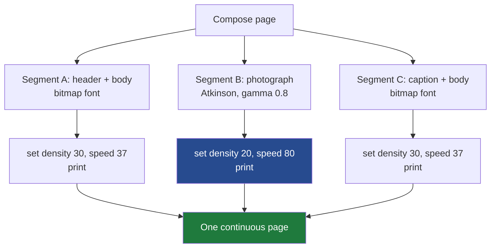

# Thermal Rasterization: Dithering, Heat, and Bitmap Fonts

This note is a deep-dive technical analysis of how the Almanach project makes a thermal printer produce legible pages, and how each decision was reached by printing candidates on real paper and reading the results. It covers three independent control axes — the host-side tone curve, the 1-bit conversion algorithm, and the printer's heat — plus a fourth discovery about small text that none of those axes could fix. The reference implementation is the Almanach render service (`/home/manuel/code/wesen/go-go-golems/almanach`); the experimental work is captured in the ticket `ALMANACH-RASTER-LAB`.

The audience is an engineer who wants to drive a monochrome thermal printer well and understand *why* the settings are what they are, not merely copy them.

> [!summary]
> - A thermal printer has two output levels per dot; continuous-tone images must be simulated with dot patterns (dithering), and the result must be calibrated to a medium that spreads ink and whose darkness is adjustable.
> - Three levers govern legibility: a host tone curve (gamma), the dithering algorithm (Atkinson won for photographs), and the printer's heat (density and speed). They interact, and only paper resolves the interaction.
> - Small text is a separate problem: anti-aliased vector fonts lose sub-pixel strokes under 1-bit conversion. Bitmap fonts solve it outright.
> - Text and photographs want *different* heat, and the fix costs nothing because the print path already sends the page as separate segments.

## Why this note exists

A one-bit device cannot print gray. The Almanach pipeline renders an HTML page with headless Chrome, screenshots it to a grayscale PNG, and must decide, for every pixel, whether to burn a dot or leave the paper blank. The original code made that decision with a single fixed threshold: any pixel darker than gray value 128 became a dot. That rule is correct for high-contrast line art and catastrophic for photographs, and it is the reason printed pages were described as "hard to read."

The work described here replaced that single rule with a calibrated system. The value of writing it down is that the reasoning generalizes to any monochrome thermal or e-ink target: the algorithms, the medium's non-linearities, and the empirical method transfer directly.

## The problem, stated precisely

A grayscale pixel carries 256 levels. The print head carries two: dot or no dot. The original conversion collapsed the former into the latter at a single cut point.

```
out(x, y) = luminance(x, y) < 128
```

Three failures follow from that line, and all three are visible on paper.

The first is midtone collapse. A face, a patch of fur, or a gray sky occupies luminance values roughly between 90 and 180. A single cut sends all of them to solid black or solid white, so every internal gradient inside those regions disappears. The second is dot gain: a burned dot physically spreads on thermal paper, so a region that is 50 percent dots on screen prints darker than 50 percent gray, and dense regions fill in and turn muddy. The third is edge loss: a bright, thin feature such as a whisker sits above the threshold and is discarded entirely.

The figure below is the whole argument in one image. Both halves are the same source photograph and the same printer density. The left half is the fixed-threshold conversion; the right half is the system this note describes.

![[Attachments/almanach-raster/raster-threshold-vs-atkinson.png]]

On the left, the cat's face is a black mass with blown highlights, and the gray ramp above it is a solid black bar followed by blank paper — no tone survives. On the right, fur, whiskers, eye detail, and a continuous ramp are all present. The difference is not resolution or heat. It is the conversion algorithm and a tone curve, and the rest of this note explains both.

## The three levers

Legibility is governed by three independent controls. "Hard to read" touched all three, and the central difficulty was that they interact.

| Lever | Where it lives | What it controls |
|-------|----------------|------------------|
| Tone curve (gamma, brightness, contrast) | Host, before dithering | Pre-compensates dot gain; sets perceived lightness |
| 1-bit conversion (threshold, ordered, error diffusion) | Host, the rasterizer | How gray is simulated with dots |
| Heat (density, speed) | Firmware, ESC/POS | How dark every dot burns |

The tone curve reshapes the 256-level grayscale before any dot decision is made. The conversion algorithm decides the dot pattern. The heat decides how dark those dots come out physically. A dark image can be produced by a dense dot pattern, or by a sparse pattern burned hot, and those two routes do not look the same on paper. That is why the interaction, not any single lever, is the thing to calibrate.

## Lever two: the dithering algorithm

Dithering simulates intermediate tone by placing black and white dots in patterns whose local average approximates the original gray. The eye integrates a small neighborhood, so a region that is 30 percent black dots reads as 30 percent gray. The algorithm chooses *which* dots are black, and that choice determines quality.

### Fixed threshold

The original rule. Each pixel is compared to a global constant. It is correct for text and high-contrast graphics and wrong for photographs, for the reasons above. It remains the right mode for content that is already close to black and white.

### Ordered dithering

A fixed threshold matrix is tiled across the image; each pixel is compared to the matrix value at its position rather than to a constant. The Bayer matrix is the classic example. Ordered dithering is fast, deterministic, and parallelizable because each pixel is independent. Its weakness is that the matrix imposes a regular cross-hatch texture that competes with image detail. On paper, the Bayer output kept midtones but the grid was distracting in flat areas such as a cheek or a background, so it lost to error diffusion for photographs.

### Error diffusion

Error diffusion quantizes one pixel, measures the error between the pixel's true value and the black-or-white it was rounded to, and distributes that error to neighboring pixels that have not been processed yet. A region that is slightly too dark after one pixel is rounded down pushes positive error forward, making a nearby pixel more likely to stay white, so the local average tracks the original tone. The kernel — the set of neighbors and weights — defines the algorithm.

```
work = float copy of gray
for y in rows:
    for x in cols:
        old      = work[y][x]
        new      = 0 if old < threshold else 255
        out[y][x]= (new == 0)          # black where rounded down
        err      = old - new
        for (dx, dy, weight) in kernel.taps:
            work[y+dy][x+dx] += err * weight / kernel.divisor
```

Floyd–Steinberg diffuses the entire quantization error across four neighbors with divisor 16. It reproduces tone accurately, but on thermal paper it printed slightly dark and showed the correlated "worm" texture that error diffusion is known for. Atkinson diffuses only six eighths of the error across six neighbors with divisor 8:

```
Atkinson kernel (divisor 8):
        X   1   1
    1   1   1
        1
```

Discarding a quarter of the error at every pixel is the reason Atkinson prints lighter. On a medium with dot gain, printing lighter is exactly what compensates for the medium darkening the result. That property is why Atkinson, not the more tonally accurate Floyd–Steinberg, won on paper.

The comparison was run on real paper at a fixed density. Atkinson gave the best combination of tonal detail and restraint; Floyd–Steinberg was a close second but denser in the shadows; Bayer showed its grid; threshold destroyed the photograph. The finding is not that Atkinson is universally best — it is that a medium with dot gain rewards an algorithm that deliberately under-inks.

The physical Atkinson print is below. What the screen preview promised, the paper delivered: the fur keeps its direction, the eyes keep their catchlights, and the shadows under the chin stay readable rather than blocking up.

![[Attachments/almanach-raster/paper-atkinson-cat.jpg]]

## Lever one: the tone curve and dot gain

Dithering decides the dot pattern, but the input to dithering is still a 256-level grayscale, and that grayscale can be reshaped first. The reshaping matters because the medium is non-linear: a 50 percent dot pattern does not print as 50 percent gray, it prints darker, because each dot spreads.

The tone curve applied before dithering is a gamma function on the normalized gray value, followed by a contrast scaling around the midpoint and a brightness offset.

```
v' = clamp( ((v ^ gamma) - 0.5) * contrast + 0.5 + brightness )   with v in [0, 1]
```

The gamma exponent bends the midtones. With the convention `v' = v^gamma`, an exponent below 1 lightens midtones and an exponent above 1 darkens them. This convention deserves emphasis because informal descriptions of "gamma correction" often state the direction backwards; the safe practice is to fix the formula and let paper decide the exponent.

Paper decided. A gamma sweep of {0.7, 1.0, 1.4} was printed with Atkinson at a fixed density. The gamma-1.4 strip darkened the shadows and crushed the low end of the gray ramp; the gamma-0.7 strip opened the shadows; the preferred result sat between 0.7 and 1.0. The locked value for photographs is **gamma 0.8**, which lightens the midtones just enough to counter dot gain without washing out the highlights. In the side-by-side figure above, the right half uses gamma 0.8, and the gray ramp reproduces as a smooth gradient rather than crushing to black in its darker half.

## Lever three: heat — density and speed

The printer's own darkness control is its heat. On the K118 mechanism used here, heat is exposed over ESC/POS as two registers.

Density is the strobe-energy setting, range 0 to 39, set by `ESC ## STDP n`. It is a global darkness knob orthogonal to the dot pattern: raising density darkens every dot regardless of how the dots were placed. There is no separate contrast register on this printer; density *is* the contrast control.

Speed is set by `ESC ## STSP n` from a fixed list of supported values. Lower speed means the head dwells longer on each line, which burns darker and more evenly; higher speed prints lighter and faster. Speed is therefore a second heat lever, and it turned out to matter for a specific artifact discussed below.

The original pipeline left density at a fixed default and never coordinated it with the image. Bringing it under control is half the calibration.

### Reading the density ladder for text

A text-only calibration card was printed across densities 16, 24, 32, and 39 at fixed speed. The card carries the same paragraph at sizes from 16 pixels down to 8, plus a white-on-black bar to expose bleed.

![[Attachments/almanach-raster/paper-text-density24.jpg]]

At density 16 the small sizes were faint and broke up. At density 24 the text was crisp and dark down to about 11 pixels. At density 32 the punch was best while the smallest glyphs only just began to fill. At density 39 the large text was bold but the 8- and 9-pixel lines started to bleed and close their counters — the enclosed holes in letters such as e, a, and g. The text heat sweet spot is therefore around density 28 to 32, which is notably hotter than the photograph wants. That divergence becomes the central design decision later.

### Power droop, and why speed is a lever

A subtle artifact appeared on the lower-density strips: the gray tone varied *across a single line*. This is print-head power droop. When a raster row fires many dots at once, the shared power rail sags, and dots burned while the rail is depressed come out lighter. It shows at low density because the dots are already marginal, and it is masked at high density because there is more energy headroom. Lowering the print speed gives the rail more time to recover between lines and lengthens the dwell per dot, which reduces the within-line variation. Speed, in other words, is not only a darkness control but an evenness control, and text — printed as long, dense rows of solid strokes — is exactly the content that provokes droop.

## The empirical method: lab and paper

None of these decisions could be made from a screen preview, because dot gain, bleed, and power droop only exist on paper. The method was a closed loop. A small harness generated candidate bitmaps and printed them, each carrying a printed header that named its own algorithm and parameters, so a photograph of a strip was self-describing. The printed strips were photographed and read, the observations narrowed the next sweep, and only settings that won on paper were merged into the production service.


The self-labeling detail is what made the loop efficient. Because every strip printed its own parameters as a header, there was never ambiguity about which photograph corresponded to which setting, and the reading step could attribute every visual difference to a known cause.

## The fourth problem: small text and bitmap fonts

An observation from the density ladder did not fit the three-lever model: at 8 and 9 pixels, parts of letters were simply missing, and no density fixed it. The cause is upstream of the printer. A vector font rendered at a small size produces strokes thinner than one pixel, and the font rasterizer represents those strokes with anti-aliasing — light gray pixels rather than solid black ones. The 1-bit conversion then discards them, because a light-gray stroke sits above the threshold. Small text is therefore a continuous-tone problem in disguise, and it cannot be repaired by heat, because the strokes were already gone before the bitmap reached the printer.

There are two host-side responses. Raising the threshold or switching small text to error diffusion keeps some of the light-gray strokes as dots, which helps but thickens and fuzzes the glyphs. The better response is to remove the anti-aliasing at the source by using a bitmap font — a font whose glyphs are authored at an exact pixel size, every stroke a solid one-bit pixel, every counter open by design. There is nothing for the threshold to discard.

A comparison card rendered the same text three ways: anti-aliased vector under threshold, vector with anti-aliasing disabled, and classic X11 PCF bitmap fonts at their native sizes.

![[Attachments/almanach-raster/paper-smalltext-strategies.jpg]]

The result is unambiguous. The anti-aliased section breaks up badly by 8 pixels. Disabling anti-aliasing helps but the glyphs are blocky and still crumble at the smallest size. The bitmap section is crisp all the way down: the 6×9 and 6×10 fonts are more legible than the 11-pixel anti-aliased line above them, counters stay open at 5×7, and even 4×6 is readable. For small text on this class of device, the font choice dominates every host-side algorithm trick.

The production consequence looked, at first, like "use a pixel web font." It is not that simple, because the production renderer draws through Chrome rather than a direct rasterizer, and Chrome will not use a web font's embedded bitmap strike. What actually works in the pipeline — disabling anti-aliasing, choosing a well-hinted font, and setting it large enough — is worked out in the follow-up section below, and it reframes this whole result: the lesson is not "ship a bitmap font" but "let the font's own hinting make the one-bit decision."

## Putting it together: per-segment heat

Two locked findings are in tension. Photographs want a cool, light setting — Atkinson, gamma 0.8, density around 20 — so the dots do not merge into mud. Text wants a hot setting — density around 30, slower speed — so strokes are dark and even. A single global setting cannot serve both, which is precisely why mixed pages read poorly under one fixed configuration.

The resolution costs nothing in firmware. The print path already sends a tall page as multiple segment commands, because the receiving buffer is limited. Density and speed are printer state, so setting them *between* segment commands makes each segment print at its own heat. A page can therefore print its text segments hot and its photograph segment cool in a single job.



The composed page below is the proof, generated by the mixed-page harness: bitmap-font text destined for the hot segments, the Atkinson photograph destined for the cool segment.

![[Attachments/almanach-raster/raster-mixed-page.png]]

Printed with per-segment heat, the text is crisp and dark and the photograph stays light and detailed, in the same job, with no firmware change. This is the complete answer to the original complaint.

## The locked recipe

Every value below was confirmed on the physical K118, not chosen from a screen preview.

| Content | Recipe |
|---------|--------|
| Photographs and continuous-tone art | Atkinson dithering, gamma 0.8, density ≈ 20, speed 80 |
| Small text (render) | 1× anti-aliasing-off, a well-hinted font (DejaVu Serif/Sans) set large enough, bold for the smallest and for italic — see the production follow-up. A bitmap font is ideal only when drawn directly, not via a web font. |
| Text heat | Density ≈ 30–38 (38 read best on hinted fonts); density matters more than speed |
| Mixed pages | Per-segment density and speed on the existing segmented path |
| High-contrast line art, QR codes | Fixed threshold |

## The Go implementation

The findings were merged into the render service as a pluggable rasterizer in `internal/app/raster.go`. The entry point is `Rasterize(img, RasterOptions)`, which supports threshold, Atkinson, Floyd–Steinberg, and Bayer8, with the gamma/brightness/contrast tone curve applied before any dithering.

The most important implementation constraint is reversibility. The threshold mode delegates to the original `imageToBitmap` function so its output is byte-for-byte identical to the legacy pipeline, and a unit test asserts that identity across several threshold values including the boundary value zero. That test caught a real defect during development: an early "default the threshold to 128 when it is zero" guard silently changed the output for an explicit threshold of zero, which would have broken the reversibility guarantee. The fix was to default the threshold only inside the dithering path and pass it through untouched for threshold mode.

```go
func Rasterize(img image.Image, opts RasterOptions) (*Bitmap, error) {
    if opts.Mode == "" || opts.Mode == RasterThreshold {
        return imageToBitmap(img, opts.Threshold) // byte-identical to legacy
    }
    if opts.Threshold == 0 {
        opts.Threshold = 128
    }
    gray := luminanceGrid(img)
    applyTone(gray, opts.Gamma, opts.Brightness, opts.Contrast)
    switch opts.Mode {
    case RasterAtkinson: return packBoolBits(errorDiffuse(gray, t, atkinsonKernel)), nil
    case RasterFloyd:    return packBoolBits(errorDiffuse(gray, t, floydKernel)), nil
    case RasterBayer8:   return packBoolBits(orderedBayer8(gray)), nil
    }
    // ...
}
```

The heat lever became `setPrinterHeat` in `internal/app/printer.go`, which posts to the firmware's density and speed endpoints before the bitmap. The render options and the print command expose `--raster-mode`, `--gamma`, `--brightness`, `--contrast`, `--density`, and `--speed`, and the same keys are readable from a layout's `render:` block. The default mode remains threshold, so existing output is unchanged until a caller opts into a dither mode.

The packed-bitmap contract is preserved exactly: rows are padded to a multiple of eight pixels and bits are set most-significant-first, matching the firmware's `GS v 0` raster reader. A rasterization change alters which bits are set, never the byte layout.

## Common failure modes

The failures below are the ones that cost the most time, stated so they can be recognized quickly.

- Trusting the screen preview. Dot gain, bleed, and power droop do not exist on screen. Every darkness and legibility decision must be made on paper.
- Getting the gamma direction backwards. Fix the formula as `v' = v^gamma`, then let a printed ramp choose the exponent rather than reasoning about it.
- Assuming text is immune to dithering. It is immune only when its strokes have a solid black core, which large text has and small text does not.
- Fighting small-text dropout with the threshold. The dropout happens because anti-aliasing produced light-gray strokes; the fix is a bitmap font, not a different threshold.
- Using one global heat for a mixed page. Text and photographs want different heat; set it per segment.

## Working rules

- Default photographs to Atkinson with gamma near 0.8, and tune density downward until the shadows stop merging.
- For small text in a Chrome-rendered pipeline, disable anti-aliasing and pick a well-hinted font set large enough (bold for the smallest and for italic); reach for supersampling only for a delicate display font you refuse to change. A directly-drawn bitmap font is the ideal, but the browser will not use a web font's embedded bitmap strike.
- Treat density and speed as content-dependent, and set them per segment on mixed pages.
- Keep a byte-identical threshold path so any rasterization change is reversible, and assert it with a test.
- When a printed artifact varies within a single line, suspect power droop and lower the speed before touching anything else.

## Follow-up: making small text legible in the production renderer

The bitmap-font result above was proven with a Python rasterizer that drew glyphs directly. Production renders differently: headless Chrome turns an HTML page into the screenshot, and only then does the 1-bit conversion run. Reproducing "use a bitmap font" inside that pipeline turned out to be neither possible nor necessary. This section is the production follow-through, and it is worth reading in full because it reversed its own conclusion twice — and each reversal came from a printed page rather than an argument.

### Why the obvious fix does not work: embedded-bitmap web fonts

The direct translation of "use a bitmap font" is to serve the browser a web font that carries the pixel design as embedded monochrome bitmap strikes (the OpenType `EBDT`/`EBLC` tables), applied to small-text elements at the strike's native pixel size. The render browser already captures at device-pixel-ratio 1, so a `font-size: 9px` element occupies exactly nine device pixels, which is where a 9-pixel strike should land verbatim.

It failed. A classic X11 PCF font was converted to an OpenType font carrying its bitmap strike (fontforge, run headless), embedded via `@font-face`, and rendered at 384 pixels. Chrome did not use the strike. Blink renders the font's vector outlines and ignores embedded monochrome bitmaps for normal text; the outlines that fontforge auto-traced from the bitmap were crude, so the custom font rendered *worse* than the stock font. In the figure below, the left half is anti-aliased-on and the right half anti-aliased-off; the custom "AlmanachPixel" rows are degraded on both sides, because in both cases Chrome is drawing outlines, not the strike.

![[Attachments/almanach-raster/pixelfont-aa-off-vs-on.png]]

### Disabling anti-aliasing

The mechanism that actually helps is upstream of any font choice. On Linux, Chrome rasterizes text through FreeType, and whether FreeType anti-aliases is a fontconfig decision, not a CSS one — `-webkit-font-smoothing` is a no-op in Chrome on Linux. Supplying the render browser a fontconfig file with `antialias=false` (through the `FONTCONFIG_FILE` environment variable, set on the browser process) switches FreeType to its monochrome rasterizer. That rasterizer makes the black-or-white decision per pixel *with hinting applied*, so it preserves stems the same way it does on a low-resolution screen.

The effect is measurable: the render screenshot goes from a few percent gray pixels to **zero**. There is no longer any light-gray fringe for the downstream luminance threshold to discard, so nothing drops. In the figure above, the right (anti-aliasing-off) column keeps the 8-pixel vector line legible where the left column has already broken it up. The important shift is conceptual: the 1-bit decision moves from a dumb luminance threshold applied after the fact to FreeType's hint-aware rasterizer applied at draw time.

Anti-aliasing off is enough for a well-hinted font. It is not enough for every font, which is the next problem.

### Supersampling: rescuing delicate fonts without changing them

A delicate serif such as EB Garamond renders roughly even with anti-aliasing off, and worst of all in its italic, because its slanted hairline serifs are thinner than a pixel and italic hinting is weak. Supersampling addresses this without touching the font. The page is rendered at three times the device resolution with anti-aliasing on, so a stroke one target-pixel wide is captured across three source pixels; the screenshot is then box-averaged back down to the target resolution and thresholded. A stroke that would have vanished at 1× survives as a run of gray that the threshold keeps.

The implementation has two sharp edges. First, the scale must actually take: `chromedp.EmulateViewport` defaults the device scale factor to 1 and would override the launch flag, so the factor is set through `chromedp.EmulateScale`, verified by the screenshot coming out three times as wide. Second, the downscale must be fast — a naive `image.At()` box average took seventeen seconds on a full page — so the decoded screenshot is drawn once into a packed RGBA buffer and the inner loop indexes the pixel bytes directly with fixed-point luminance weights, which brings a 3× render to about two and a half seconds.

Supersampling works: the small serif italic that was broken at 1× becomes complete while still looking like a serif. It shipped first as the default.

### The font/size/technique/heat matrix

Then the question was posed properly. Rather than argue about techniques, a harness rendered the same small text across six fonts, sizes eight through sixteen, five techniques (1× anti-aliasing-off, 2×/3×/4× supersampling, and a darker-threshold variant), and a grid of printer densities and speeds — every sheet downsampled to the 384-pixel target exactly like the pipeline, self-labeled with its settings, printed, and read on paper.

The font comparison is the first result. A well-hinted font stays crisp to eight or nine pixels; a lightly-hinted one does not, in any technique.

![[Attachments/almanach-raster/pixelfont-font-matrix.png]]

Four findings came out of the matrix, and the first two overturned earlier decisions:

- **The font's hinting quality dominates.** DejaVu Serif and DejaVu Sans are crisp small; EB Garamond, DM Sans, and Noto Sans are rough small regardless of technique.
- **For a hinted font, 1× anti-aliasing-off is as crisp as — usually crisper than — supersampling, and about three times faster.** Bytecode hinting is designed to snap stems to exact pixels, and supersampling bypasses hinting entirely by rendering large and shrinking. This reversed the supersampling default.
- **Effective size is set by x-height, not nominal size.** EB Garamond has a small x-height and renders two to three pixels smaller than DejaVu at the same `font-size` (Garamond 16–17 reads like DejaVu 11–12), so a delicate face must simply be set larger.
- **Weight is the biggest remaining lever.** Heavier strokes survive the threshold far better, and bold italic is legible where normal italic is not.

![[Attachments/almanach-raster/pixelfont-weight-sweep.png]]

The printer heat sweep closed the loop with the earlier heat work. Across densities 24–38 at speeds 37 and 80, **density ≈ 38 read best, and the two speeds were not visibly distinguishable** on these fonts — so the faster speed stays, and only the density matters for text.

### The shipped decision and the recipe

The default render technique is now **1× anti-aliasing-off**: sharper for a hinted font and three times faster. Supersampling remains available as an opt-in (`--supersample`) for anyone who insists on a delicate display font rendered small. The byte-compatible packed-bitmap contract is unchanged throughout.

The rest of the recipe is a set of typographic choices rather than pipeline code, because the matrix showed that the font and its size do more for legibility than any rasterization trick. For crisp small thermal text: pick a **well-hinted font** (DejaVu Serif for a serif look, DejaVu Sans for maximum crispness) or set a delicate face like EB Garamond about three points larger; use **bold or medium weight for the smallest and for italic text**; keep text from getting too small in the first place; and print at **density ≈ 38**.

### The lesson

The fix migrated from "ship a special font" to "turn anti-aliasing off, choose a hinted font, and don't set it too small" — and every step along the way was decided by a printed page, not by reasoning about rasterizers. The general rule for a one-bit device is that legibility is governed more by the font's hinting and its size than by any clever conversion technique layered on top. Techniques matter at the margin; the font and the size set the ceiling.

## Related notes

- [[On-Ramp/dithering-and-rasterization]] — the standing knowledge-base entry on the three dithering families.
- [[On-Ramp/esc-pos-thermal-printer]] — the `GS v 0` framing and the ESC/POS command reference.

The small-text production work above is recorded run-by-run under the ticket `ALMANACH-PIXELFONT` at `ttmp/2026/07/16/` in the Almanach repository, with the font/heat matrix harness at `scripts/02-font-matrix.py`.

The full run-by-run record, the experiment harness, the intern-oriented system guide, and the bundled bitmap fonts live in the Almanach repository under the ticket `ALMANACH-RASTER-LAB` at `ttmp/2026/07/16/`.
